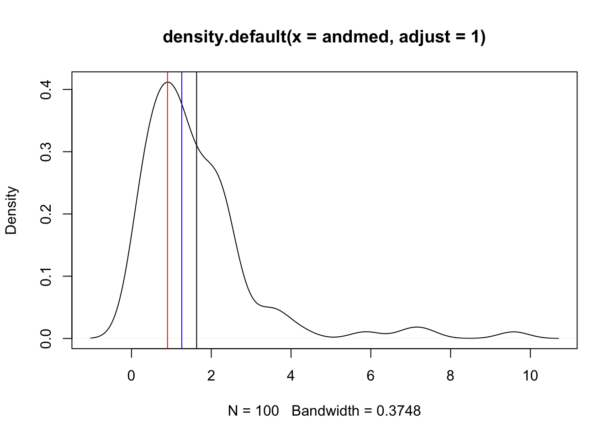
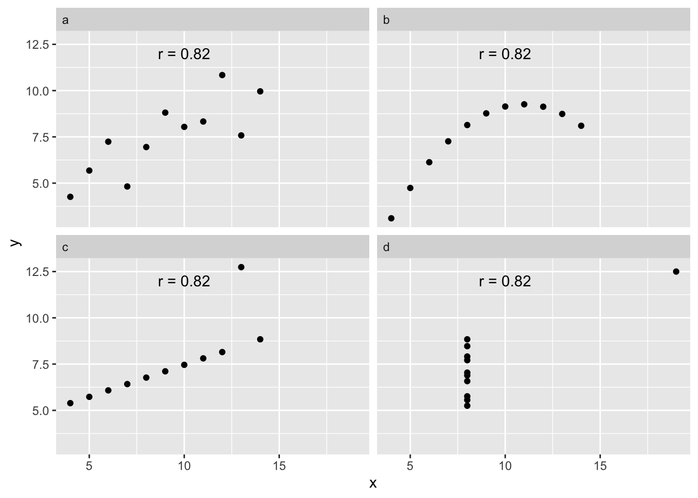

#  Kuidas näevad välja teie andmed


## Summaarsed statistikud {-}

Summaarne statistik püüab iseloomustada teie valimit ühe numbri abil.  
Milliseid summaarseid statistikuid arvutada ja milliseid vältida, sõltub statistilisest mudelist, mis omakorda sõltub teie andmetest ja teie uskumustest andmeid genereeriva protsessi kohta. 

Summaarse statistika abil iseloomustame 

+ tüüpilist valimi liiget (keskmise näitajad), 
+ muutuja sisest varieeruvust (standardhälve, mad jms), 
+ erinevate muutujate koos-varieeruvust (korrelatsioonikordaja)

##  Keskväärtused {-}

Keskväärtust saab mõõta paaril tosinal erineval viisil, millest järgnevalt vaatleme kolme või nelja. Enne kui arvutama kukute, mõelge järele, miks te soovite keskväärtust teada. Kas teid huvitab valimi tüüpiline liige? Kuidas te sooviksite seda tüüpilisust defineerida? Kas valimi keskmise liikmena või valimi kõige arvukama liikmena? või veel kuidagi? 
See, millist keskväärtust kasutada, sõltub sageli andmejaotuse kujust. Sümmeetrilisi jaotusi on lihtsam iseloomustada ja mitmetipulised jaotused on selles osas kõige kehvemad.

Järgnevad nõuanded on rangelt soovituslikud:

(1) Kui valim on normaaljaotusega (histogramm on sümmeetriline), hinda tüüpilist liiget läbi aritmeetilise keskmise (mean).  

(2) Muidu kasuta mediaani (median). Kui valim on liiga väike, et jaotust hinnata (aga > 4), eelista mediaani. Mediaani saamiseks järjestatakse mõõdetud väärtused suuruse järgi ja võetakse selle rea keskmine liige. Mediaan on vähem tundlik ekstreemsete väärtuste (outlierite) suhtes kui mean. 

(3) Valimi kõige levinumat esindajat iseloomustab mood ehk jaotuse tipp. Seda on aga raskem täpselt määrata ja mitmetipulisel jaotusel on mitu moodi. Töötamisel posterioorsete jaotustega on mood sageli parim lahendus. 

(ref:lognorm) Simuleeritud lognormaaljaotusega andmed. Punane joon - mood; sinine joon - mediaan; must joon - aritmeetiline keskmine (mean). Milline neist vastab parimini teie intuitsiooniga nende andmete "keskväärtusest"? Miks?

<div class="figure" style="text-align: center">

<p class="caption">(\#fig:lognorm)(ref:lognorm)</p>
</div>


## Muutuja sisene varieeruvus {-}

Aritmeetilise keskmisega (*mean*) käib kokku standardhälve (SD). 
SD on sama ühikuga, mis andmed (ja andmete keskväärtus). Suhtelist standardhälvet kutsutakse variatsiooni koefitsiendiks (*Coefficient of Variation*) ja arvutatakse nii: `CV = sd(x)/mean(x)`. CV x 100% annab varieeruvuse protsendina keskväärtusest. 

Statistikute hulgas eelistatud andmete avaldamise formaat on mean (SD), mitte mean (+/- SD). 1 SD katab 68% normaaljaotusest, 2 SD – 96% ja 3 SD – 99%. Normaaljaotus langeb servades kiiresti, mis tähendab, et tal on peenikesed sabad ja näiteks 5 SD kaugusel keskmisest paikneb vaid üks punkt miljonist. 
Näiteks: inimeste IQ on normaaljaotusega, mean = 100, sd = 15. See tähendab, et kui sinu IQ = 115 (mis on enam-vähem ülikooli astujate keskmine IQ), siis on tõenäosus, et juhuslikult kohatud inimene on sinust nutikam, 18% ((100% - 68%) / 2  = 18%). 

Kui aga “tegelikul” andmejaotusel on “paks saba” (nagu eelmisel joonisel kujutatud andmetel) või esinevad outlierid, siis normaaljaotust eeldav mudel tagab ülehinnatud SD ja seega ülehinnatud varieeruvuse. Kui andmed saavad olla ainult positiivsed, siis SD > mean/2 viitab, et andmed ei sobi normaaljaotuse mudeliga (sest mudel ennustab negatiivsete andmete esinemist küllalt suure sagedusega). 

Standardhälve on defineeritud ka mõnede teiste jaotuste jaoks peale normaaljaotuse (Poissioni jaotus, binoomjaotus). Funktsioon sd() ja selle taga olev võrrand sd = sqrt((mean(x) - x)^2/(n - 1)) on loodud normaaljaotuse tarbeks ja neid alternatiivseid standardhälbeid ei arvuta. Veelgi enam, igale jaotusele, mida me oskame integreerida, saab ka integraali abil õige katvusega standardhälbe arvutada. Seega tasub meeles pidada, et tavapärane viis standardhälbe arvutamiseks sd() abil kehtib normaaljaotuse mudeli piirides ja ei kusagil mujal! 
Siiski, kui arvutada standardhälbe sd()-ga, võib olla kindel, et jaotusest sõltumata hõlvavad 2 SD-d vähemalt 75% andmejaotusest.
Kui andmed ei sobi normaaljaotusesse ja te ei ole rahul tulemusega, mille tõlgendus on niivõrd ebakindel kui 75 protsenti kuni 96+ protsenti, võib pakkuda kahte alternatiivset lahendust: 

##	Logaritmi andmed {-}

Kui kõik andmeväärtused on positiivsed ja andmed on lognormaaljaotusega, siis logaritmimine muudab andmed normaalseks. Logaritmitud andmetest tuleks arvutada aritmeetiline keskmine ja SD ning seejärel mõlemad anti-logaritmida (näiteks, kui log2(10) = 3.32, siis antilogaritm sellest on 2^3.32 = 10). Sellisel juhul avaldatakse lõpuks geomeetriline keskmine ja multiplikatiivne SD algses lineaarses skaalas (multiplikatiivne SD = geom mean x SD; geom mean/SD). Geomeetriline keskmine on alati väiksem kui aritmeetiline keskmine. Lisaks on SD intervall nüüd asümmeetriline ja SD on alati > 0. See protseduur tagab, et 68% lognormaalsetest andmetest jääb 1 SD vahemikku ning 96% andmetest jääb 2 SD vahemikku.

Kui lognormaalsetele andmetele arvutada tavaline SD lineaarses skaalas kasutades sd() funktsiooni, siis tuleb SD sageli palju laiem kui peaks ja hõlmab ka negatiivseid väärtusi (pea meeles, et SD definitsiooni järgi jääb 96% populatsioonist 2 SD vahemikku).   
Sageli on aga negatiivsed muutuja väärtused võimatud (näiteks nädalas suitsetatud sigarettide arv). 

Logaritmimise kaudu avaldatud multiplikatsiivse SD arvutamiseks kasutame enda kirjutatud funktsiooni mulitplicative_sd(). Esiteks arvutame multiplikatiivse ja aditiivse sd lognormaalsetele andmetele, mida kujutasime eelmisel joonisel: 


```r
multiplicative_sd <- function(x) {
  x <- na.omit(x) #viskan välja NA-d (kui neid on)
  log_data <- log10(x) #logaritmin andmed
  log_mean <- mean(log_data) #keskmine logaritmitud andmetest
  log_sd <- sd(log_data) #SD logaritmitud andmetest
  geom_mean <- 10^log_mean #anti-logaritm annab geomeetrilise keskmise
  mult_sd <- 10^log_sd #anti-logaritm annab multiplikatiivse SD
  lower1 <- geom_mean/mult_sd #alumine SD piir
  upper1 <- geom_mean * mult_sd #ülemine SD piir
  lower2 <- geom_mean/(mult_sd^2) #alumine 2 SD piir
  upper2 <- geom_mean * (mult_sd^2) #ülemine 2 SD piir
  Mean <- mean(x) #aritmeetiline keskmine
  lower3 <- mean(x) - sd(x) #alumine additiivse SD piir
  upper3 <- mean(x) + sd(x) #ülemine additiivse SD piir
  lower4 <- mean(x) - sd(x)*2 #alumine additiivse 2 SD piir
  upper4 <- mean(x) + sd(x)*2 #ülemine additiivse 2 SD piir
  tibble(SD = c("multiplicative_SD", 
                "multiplicative_2_SD", 
                "additive_SD", 
                "additive_2_SD"), 
         MEAN = c(geom_mean, 
                  geom_mean, 
                  Mean, 
                  Mean), 
         lower = c(lower1, 
                   lower2, 
                   lower3, 
                   lower4), 
         upper = c(upper1, 
                   upper2, 
                   upper3, 
                   upper4))
}
andmed <- rlnorm(100) #100 juhuslikku arvu lognormaaljaotusest
multiplicative_sd(andmed) %>% knitr::kable()
```


SD                      MEAN    lower   upper
--------------------  ------  -------  ------
multiplicative_SD      0.983    0.357    2.71
multiplicative_2_SD    0.983    0.129    7.46
additive_SD            1.593   -0.157    3.34
additive_2_SD          1.593   -1.907    5.09

Tavalise aritmeetitilise keskmise asemel on meil nüüd geomeetriline keskmine.  Võrdluseks on antud ka tavaline (aritmeetiline) keskmine ja (aditiivne) SD. Additiivne SD on selle jaotuse kirjeldamiseks selgelt ebaadekvaatne (vt jaotuse pilti ülalpool ja võrdle mulitplikatiivse SD-ga).


Kuidas aga töötab multiplikatiivne standardhälve normaaljaotusest pärit andmetega (N=3, mean=100, sd=20)? Kui multiplikatiivse sd rakendamine normaalsete andmete peal viiks katastroofini, siis poleks sel statistikul suurt kasutusruumi.

SD                     MEAN   lower   upper
--------------------  -----  ------  ------
multiplicative_SD       108    92.8     126
multiplicative_2_SD     108    79.7     147
additive_SD             109    92.1     126
additive_2_SD           109    75.2     143

Nagu näha, on multiplikatiivse sd kasutamine normaalsete andmetega pigem ohutu (kui andmed on positiivsed). Arvestades, et additiivne SD on lognormaalsete andmete korral kõike muud kui ohutu ning et lognormaaljaotus on bioloogias üsna tavaline, eriti ensüümreaktsioonide ja kasvuprotsesside juures, on mõistlik alati kasutada multiplicative_sd() funktsiooni. Kui mõlema SD väärtused on sarnased, siis võib loota, et andmed on normaalsed ning saab refereede rõõmuks avaldada tavapärase additiivse SD.

> kui n < 10, siis mõlemad SD-d alahindavad süstemaatiliselt tegelikku sd-d. Ettevaatust väikeste valimitega!

Vahest tekkib teil vajadus empiiriliselt määrata, kas teie andmed on normaaljaotusega. 
Enne kui seda tegema asute, peaksite mõistma, et see, et teie valim ei ole normaalne, ei tähenda automaatselt, et populatsioon, millest see valim tõmmati, ei oleks normaaljaotusega.
Igal juhul, valimiandmete normaalsuse määramiseks on kõige mõistlikum kasutada qq-plotti. 
QQ-plot (kvantiil-kvantiil plot) võrdleb andmete jaotust ideaalse normaaljaotusega andmepunkti haaval. Kui empiiriline jaotus kattub referentsjaotusega, siis on tulemuseks sirgel paiknevad punktid. Järgneval qq plotil on näha, mis juhtub, kui plottida lognormaalseid andmeid normaaljaotuse vastu:

(ref:qqnorm) QQ-plot lognormaalsetele andmetele. Plotil võrreldakse lognormaalsete andmete jaotust referentsjaotusega, milleks on antud juhul normaaljaotus. Punased katkendjooned annavad standardveapõhise usaldusvahemiku (arvutatud simuleeritud juhuvalimist normaaljaotusega referentspopulatsioonist), millesse peaks jääma enamus andmepunkte juhul kui andmepunktid pärineksid normaaljaotusest.


```r
qqPlot(andmed)
#> [1] 4 1
```

<div class="figure" style="text-align: center">

<p class="caption">(\#fig:qqnorm)(ref:qqnorm)</p>
</div>

Nüüd joonistame qq-ploti logaritmitud andmetele. 

(ref:qqlognorm) QQ-plot normaalsetele andmetele (logaritmitud lognormaalsed andmed). 


```r
qqPlot(log(andmed))
#> [1]  83 100
```

<div class="figure" style="text-align: center">

<p class="caption">(\#fig:qqlognorm)(ref:qqlognorm)</p>
</div>

Pole kahtlust, andmed on logaritmitud kujul normaaljaotusega.

> qqPlot() võimaldab võrrelda teie andmeid ükskõik millise R-is defineeritud jaotusega (?car::qqPlot). 

Normaaljaotuse kindlakstegemiseks on loodud ka peotäis sageduslikke teste, mis annavad väljundina p väärtuse. Nende kasutamisest soovitame siiski hoiduda, sest tulemused on sageli ebakindlad, eriti väikestel ja suurtel valimitel. Mõistlikum on vaadata kõikide andmepunktide plotti normaaljaotuse vastu, kui jõllitada ühte numbrit (p), mille väärtus, muuseas, monotooniliselt langeb koos valimi suuruse kasvuga.

## Iseloomusta andmeid algses skaalas: mediaan (MAD) {-} 

MAD –-- median absolute deviation --- on vähem tundlik outlierite suhtes ja ei eelda normaaljaotust. Puuduseks on, et MAD ei oma tõlgendust, mille kohaselt ta hõlmaks kindlat protsenti populatsiooni või valimi andmejaotusest. Seevastu sd puhul võime olla kindlad, et isegi kõige hullema jaotuse korral jäävad vähemalt 75% andmetest 2 SD piiridesse.

Lognormaalsete andmetega:


```r
mad(andmed, constant = 1); sd(andmed); mad(andmed)
#> [1] 0.681
#> [1] 1.75
#> [1] 1.01
```


```r
mad(log10(andmed), constant = 1); sd(log10(andmed)); mad(log10(andmed))
#> [1] 0.241
#> [1] 0.44
#> [1] 0.357
```

mad = median(abs(median(x) - x)), mida on väga lihtne mõista. Samas R-i funktsioon mad() korrutab default-ina mad-i läbi konstandiga 1.4826, mis muudab mad()-i tulemuse võrreldavaks sd-ga, tehes sellest sd robustse analoogi. Robustse sellepärast, et mad-i arvutuskäik, mis sõltub mediaanist, mitte aritmeetilisest keskmisest, ei ole tundlik outlierite suhtes. Seega, kui tahate arvutada mad-i, siis fikseerige mad() funktsioonis argument *constant* ühele.

> Ära kunagi avalda andmeid vormis: mean (MAD) või median (SD). 
  Korrektne vorm on mean (SD) või median (MAD).


Veel üks viis andmejaotuse summeerimiseks on kasutada kvantiile. Siin saame me tüüpiliselt rohkem kui ühe numbri, aga sageli on selline viis informatiivsem, kui ühenumbrilised summaarsed statistikud. 
Funktsioon quantile võimaldab valida, milliseid kvantiile soovite näha. Järgnevas koodist saame teada, millisest vektori "andmed" väärtusest allapoole jääb 2.5%, 25%, 50%, 75% ja 95% väärtusi.

```r
quantile(andmed, c(0.025, 0.25, 0.5, 0.75, 0.95))
#>  2.5%   25%   50%   75%   95% 
#> 0.155 0.428 1.094 1.772 5.838
```


## Muutujate koosvarieeruvus {-}

Andmete koos-varieeruvust mõõdetakse korrelatsiooni abil. Tulemuseks on üks number - korrelatsioonikordaja r, mis varieerub -1 ja 1 vahel. 

+ r = 0 – kahte tüüpi mõõtmised (x=pikkus, y=kaal) samadest mõõteobjektidest varieeruvad üksteisest sõltumatult. 
+ r = 1: kui ühe muutuja väärtus kasvab, kasvab ka teise muutuja väärtus alati täpselt samas proportsioonis. 
+ r = -1: kui ühe muutuja väärtus kasvab, kahaneb teise muutuja väärtus alati täpselt samas proportsioonis. 
    
Kui r on -1 või 1, saame me x väärtust teades täpselt ennustada y väärtuse (ja vastupidi, teades y väärrust saame täpselt ennustada x väärtuse).    
Kuidas tõlgendame aga tulemust $r = 0.9$? Mitte kuidagi. Selle asemel tõlgendame $r^2 = 0.9^2 = 0.81$ – mis tähendab, et x-i varieeruvus suudab seletada mitte rohkem kui 81% y varieeruvusest ja vastupidi, et Y-i varieeruvus suudab seletada 81% X-i varieeruvusest. 

Korrelatsiooni saab mõõta mitmel viisil (`?cor.test, method=`). Kõige levinum on Pearsoni korrelatsioonikoefitsient, mis eeldab, *(i)* et me mõõdame pidevaid muutujaid, *(ii)* juhuvalimit, *(iii)* et populatsiooniandmed on normaaljaotusega ja *(iv)* et igal mõõteobjektil on mõõdetud 2 omadust (pikkus ja kaal, näiteks). Tuntuim alternatiiv on mitteparameetriline Spearmani korrelatsioon, mis ei eelda andmete normaaljaotust ega seda, et mõõdetakse pidevaid suurusi. Kui Pearsoni korrelatsiooni eeldused on täidetud ja te kasutate siiski Spearmani korrelatsiooni, siis langeb teie arvutuse efektiivsus ca. 10% võrra.  


```r
cor(iris$Sepal.Length, iris$Sepal.Width, use = "complete.obs")
#> [1] -0.118
```


Korrelatsioonikordaja väärtus sõltub mitte ainult andmete koosvarieeruvusest vaid ka andmete ulatusest. 
Suurema ulatusega andmed X ja/või Y teljel annavad keskeltläbi 0-st kaugemal oleva korrelatsioonikordaja. 
Selle pärast sobib korrelatsioon halvasti näiteks korduskatsete kooskõla mõõtmiseks. 

Lisaks, korrelatsioonikordaja mõõdab vaid andmete *lineaarset* koos-varieeruvust: kui andmed koos-varieeruvad mitte-lineaarselt, siis võivad ka väga tugevad koos-varieeruvused jääda märkamatuks.

(ref:anscombe) Anscombe'i kvartett illustreerib korrelatsioonikordaja lineaarset olemust: neli andmestikku annavad identse korrelatsioonikordaja (Pearsons'r), ehkki tegelikud seosed andmete vahel on täiesti erinevad.

<div class="figure" style="text-align: center">

<p class="caption">(\#fig:anscombe)(ref:anscombe)</p>
</div>


Moraal seisneb selles, et enne korrelatsioonikordaja arvutamist tasub alati plottida andmed, et veenduda võimaliku seose lineaarsuses. 
Lineaarsuse puudumine andmete koosvarieeruvuse mustris tähendab, et korrelatsioonikordaja tuleb eksitav.

Korrelatsioonikordaja mõõdab pelgalt määra, mil üks muutuja muutub siis, kui teine muutuja muutub. 
Seega ei ole suurt mõtet arvutada korrelatsioonikordajat juhul kui me teame ette seose olemasolust kahe muutuja vahel. 
Näiteks, kui sama entiteeti mõõdetakse kahel erineval viisil, või kahes korduses, või kui esimene muutuja arvutatakse teise muutuja kaudu.

> Kõik summaarsed statistikud kaotavad suure osa teie andmetes leiduvast infost – see kaotus on õigustatud ainult siis, kui teie poolt valitud statistik iseloomustab hästi andmete sügavamat olemust (näiteks tüüpilist mõõtmistulemust või andmete varieeruvust).

Korrelatsioonimaatriksi saab niimoodi:

```r
# numeric columns only!
# the following gives cor matrix with 
# frequentist correction for mutliple testing:
# print(psych::corr.test(iris[-5]))
# only numeric cols allowed! Hence -Species
knitr::kable(cor(iris[,-5]))
```

                Sepal.Length   Sepal.Width   Petal.Length   Petal.Width
-------------  -------------  ------------  -------------  ------------
Sepal.Length           1.000        -0.118          0.872         0.818
Sepal.Width           -0.118         1.000         -0.428        -0.366
Petal.Length           0.872        -0.428          1.000         0.963
Petal.Width            0.818        -0.366          0.963         1.000

