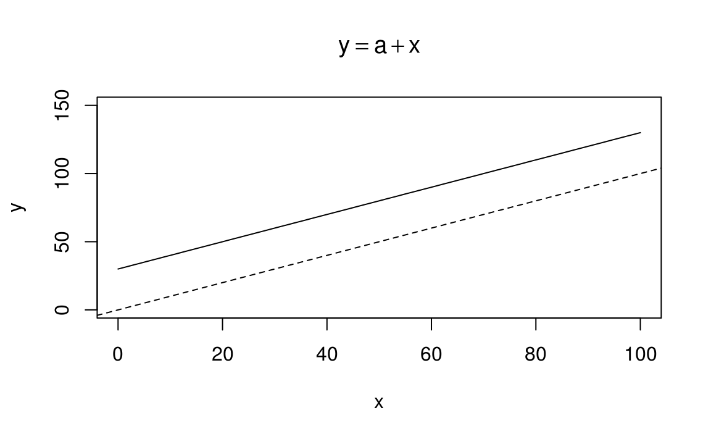
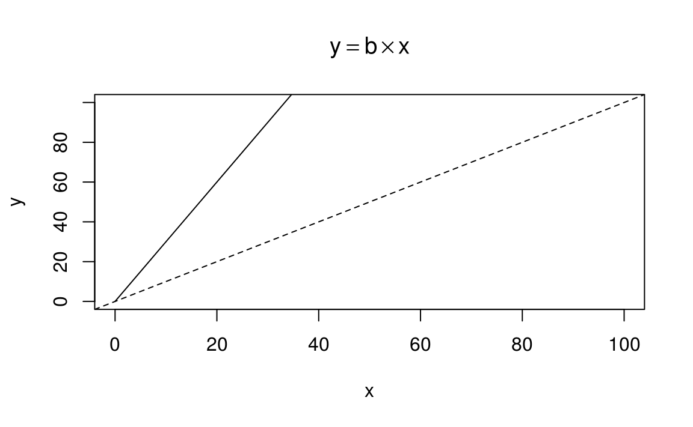
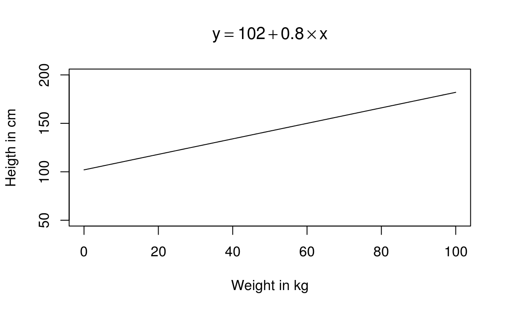
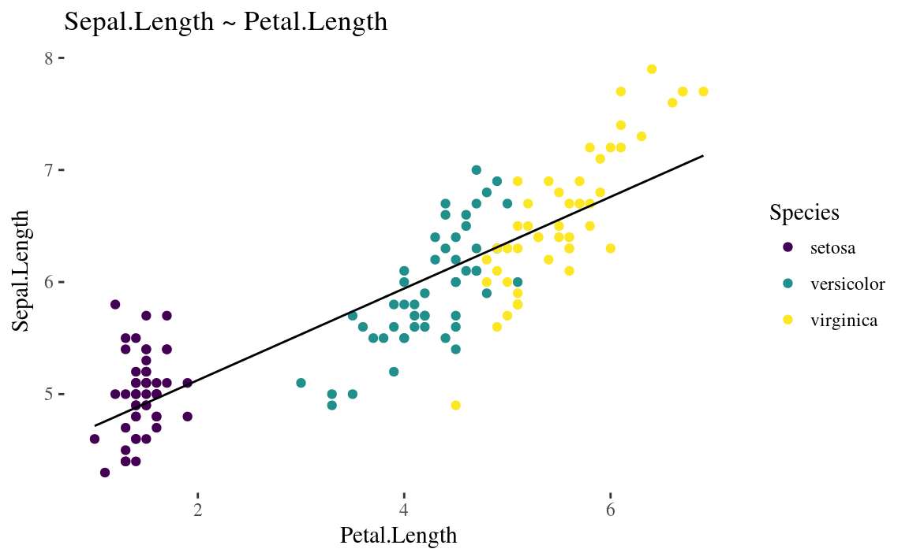
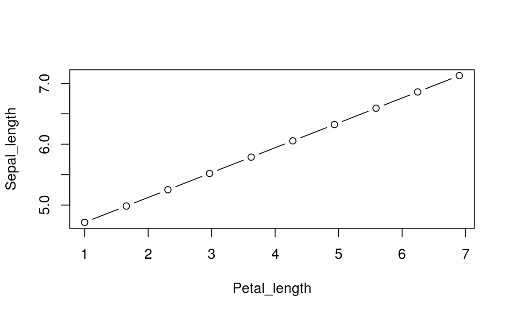
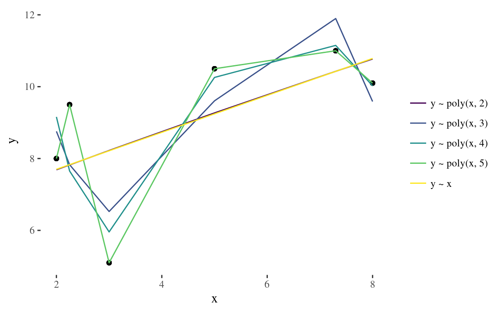

# Lineaarsed mudelid


```r
library(tidyverse)
library(broom)
library(modelr)
library(viridis)
```


Oletame, et me mõõtsime N inimese pikkuse cm-s ja kaalu kg-s ning meid huvitab, kuidas inimeste pikkus sõltub nende kaalust. 
Lihtsaim mudel pikkuse sõltuvusest kaalust on pikkus = kaal (formaliseeritult: y = x) ja see mudel ennustab, et kui Juhani kaal = 80 kg, siis Juhan on 80 cm pikkune. 
Siin on pikkus muutuja, mille väärtust ennustatakse ja kaal muutuja, mille väärtuste põhjal ennustatakse pikkusi. 

Genereerime andmed:

```r
# y = kaal
x <- 0:100
# x = pikkus
y <- x
```

Selle mudeli saame graafiliselt kujutada nii:

```r
plot(y ~ x, type = "l", xlab = "Weight in kg", ylab = "Heigth in cm", main = bquote(y == x))
```

<div class="figure" style="text-align: center">

<p class="caption">(\#fig:unnamed-chunk-5)Lihtne mudel y ~ x, mille intecept = 0 ja tõus = 1.</p>
</div>

Mudeli keeles tähistame me seda, mida me ennustame (antud juhul pikkus) Y-ga ja seda, mille väärtuse põhjal me ennustame (antud juhul kaal) X-ga. Seega sirge mudeli matemaatiline formalism on Y = X. 

See on äärmiselt jäik mudel: sirge, mille asukoht on rangelt fikseeritud.
Sirge lõikab y telge alati 0-s (mudeli keeles: sirge intercept ehk lõikepunkt Y teljel = 0) ja tema tõusunurk saab olla ainult 45 kraadi (mudeli keeles: mudeli slope ehk tõus = 1). 
Selle mudeli jäikus tuleneb sellest, et temas ei ole parameetreid, mille väärtusi me saaksime vabalt muuta ehk tuunida.  

Mis juhtub, kui me lisame mudelisse konstandi, mille liidame x-i väärtustele? 

$$y = a + x$$

See konstant on mudeli parameeter, mille väärtuse võime vabalt valida. Järgnevalt anname talle väärtuse 30 (ilma konkreetse põhjuseta).


```r
x <- 0:100 
a <- 30
y <- a + x
```


```r
plot(y ~ x, xlim = c(0, 100), ylim = c(0, 150), type = "l",
     main = bquote(y == a + x))
abline(c(0, 1), lty = 2)
```

<div class="figure" style="text-align: center">

<p class="caption">(\#fig:unnamed-chunk-7)Lineaarne mudel, mille intecept = ", a ," ja tõus = 1.. Katkendjoon, lõikepunkt = 0. Pidevjoon, lõikepunkt = 30.</p>
</div>


Meie konstant a määrab $y$ väärtuse, kui $x = 0$, ehk sirge lõikepunkti $y$ teljel.
Teisisõnu, a = mudeli lõikepunkt (*intercept*).

Mis juhtub, kui me mitte ei liida, vaid korrutame *x*-i konstandiga? 

$$y =  b \times x$$

Jällegi, me anname mudeli parameetrile b suvalise väärtuse, 3.


```r
x <- 0:200
b <- 3
y <- b * x
```


```r
plot(y ~ x, xlim = c(0, 100), ylim = c(0, 100), type = "l", main = bquote(y == b %*% x))
abline(c(0, 1), lty = 2)
```

<div class="figure" style="text-align: center">

<p class="caption">(\#fig:unnamed-chunk-9)Lineaarne mudel, mille intercept = 0 ja tõus = 3. Katkendjoon, tõus = 1. Pidevjoon, tõus = 3.</p>
</div>


Nüüd muutub sirge tõusunurk, ehk kui palju me ootame *y*-t muutumas, kui *x* muutub näiteks ühe ühiku võrra. 
Kui b = 3, siis *x*-i tõustes ühe ühiku võrra suureneb *y* kolme ühiku võrra. Proovi järgi, mis juhtub, kui b = -3.

Selleks, et sirget kahes dimensioonis vabalt liigutada, piisab kui me kombineerime eelnevad näited ühte: 

$$y = a + b \times x$$

Selleks lisame mudelisse kaks parameetrit, lõikepunkt (a) ja tõus (b). 
Kui $a = 0$ ja $b = 1$, saame me eelpool kirjeldatud mudeli $y = x$. 
Kui $a = 102$, siis sirge lõikab y-telge väärtusel 102. 
Kui $b = 0.8$, siis x-i tõustes 1 ühiku võrra tõuseb y-i väärtus 0.8 ühiku võrra.
Kui $a = 100$ ja $b = 0$, siis saame sirge, mis on paraleelne x-teljega ja lõikab y-telge väärtusel 100. 
Seega, teades a ja b väärtusi ning omistades x-le suvalise meid huvitava väärtuse, saab ennustada y-i keskmist väärtust sellel x-i väärtusel. 
Näiteks, olgu andmete vastu fititud mudel pikkus(cm) = 102 + 0.8 * kaal(kg) ehk 

$$y = 102 + 0.8 \times x$$ 

Omistades nüüd kaalule väärtuse 80 kg, tuleb mudeli poolt ennustatud keskmine pikkus 102 + 0.8 * 80 = 166 cm. 
Iga kg lisakaalu ennustab mudeli kohaselt 0.8 cm võrra suuremat pikkust.


```r
a <- 102
b <- 0.8
x <-  0:100 
y <-  a + b * x
```


```r
plot(y ~ x, xlab = "Weight in kg", ylab = "Heigth in cm", ylim = c(50, 200), type = "l", main = bquote(y == 102 + 0.8 %*% x))
```

<div class="figure" style="text-align: center">

<p class="caption">(\#fig:unnamed-chunk-11)Lineaarne mudel, millel on tuunitud nii lõikepunkt kui tõus.</p>
</div>


See mudel ennustab, et 0 kaalu juures on pikku 102 cm, mis on rumal, aga mudelite puhul tavaline olukord. 
Me tuunime mudelit andmete peal, mis ei sisalda 0-kaalu. 
Meie valimiandmed ei peegelda täpselt inimpopulatsiooni. 
Sirge mudel ei peegelda täpselt pikkuse-kaalu suhteid vahemikus, kus meil on reaalseid kaaluandmeid; ja ta teeb seda veelgi vähem seal, kus meil mõõdetud kaalusid ei ole. 
Seega pole mõtet imestada, miks mudeli intercept meie üle irvitab.  


Kahe parameetriga sirge mudel ongi see, mida me fitime kahedimensiooniliste andmetega.

Näiteks nii, kasutame R-i "iris" andmesetti:

```r
# Fit a linear model and name the model object as m
m <- lm(Sepal.Length ~ Petal.Length, data = iris)
```


```r
# Make a scatter plot, colored by the var called "Species"
# Draw the fitted regression line from m
augment(m, iris) %>% 
  ggplot(aes(Petal.Length, Sepal.Length, color = Species)) +
  geom_point() +
  geom_line(aes(y = .fitted), color = 1) +
  labs(title = "Sepal.Length ~ Petal.Length") +
  scale_color_viridis(discrete = TRUE)
#> Warning: Deprecated: please use `purrr::possibly()` instead
#> Warning: Deprecated: please use `purrr::possibly()` instead
#> Warning: Deprecated: please use `purrr::possibly()` instead
#> Warning: Deprecated: please use `purrr::possibly()` instead
#> Warning: Deprecated: please use `purrr::possibly()` instead
```

<div class="figure" style="text-align: center">

<p class="caption">(\#fig:unnamed-chunk-13)Fititud mudel, kus muutuja Petal.Length järgi ennustatakse muutuja Sepal.Length väärtusi.</p>
</div>

Mudeli fittimine tähendab siin lihtsalt, et sirge on 2D ruumi asetatud nii, et see oleks võimalikult lähedal kõikidele punktidele.

> Oletame, et meil on n andmepunkti ja et me fitime neile sirge. Nüüd plotime fititud sirge koos punktidega ja tõmbame igast punktist mudelsirgeni joone, mis on paraleelne y-teljega. Seejärel mõõdame nende n joone pikkused. Olgu need pikkused a, b, ... i. `lm()` funktsioon fitib sirge niimoodi, et summa $a^2 + b^2 + ... + i^2$ oleks minimaalne. Seda kutsutakse vähimruutude meetodiks.

Mudeli koefitsientide väärtused saame kasutades funktsiooni `coef()`:

```r
coef(m)
#>  (Intercept) Petal.Length 
#>        4.307        0.409
```

Siin a = (Intercept) ja b = Petal.Length ehk 0.41.

## Ennustus lineaarsest mudelist {-}

Anname x-le rea väärtusi, et ennustada y keskmisi väärtusi nendel x-i väärtustel. 
Siin me ennustame y (Sepal_length) keskväärtusi erinevatel x-i (Petal_length) väärtustel, mitte individuaalseid Sepal_length väärtusi. Me kasutame selleks deterministlikku mudelit kujul Sepal_length =  a + b*Petal_length. Hiljem õpime ka bayesiaanlike meetoditega individuaalseid Sepal_length-e ennustama. 

Järgnev kood on sisuliselt sama, millega me üle-eelmisel plotil joonistasime mudeli y = a + bx. 
Me fikseerime mudeli koefitsiendid fititud irise mudeli omadega ja anname Petal_length muutujale 10 erinevat väärtust originaalse muutuja mõõtmisvahemikus. 
Aga sama hästi võiksime ekstrapoleerida ja küsida, mis on oodatav Sepal_length, kui Petal_length on 100 cm? 
Sellele küsimusele on ebareaalne vastus, aga mudel ei tea seda. 
Proovi, mis vastus tuleb.


```r
## Genereerime uued andmed Petal.Length vahemikus
Petal_length <- seq(min(iris$Petal.Length), 
                    max(iris$Petal.Length), 
                    length.out = 10)
## Võtame mudeli koefitsendid
a <- coef(m)[1]
b <- coef(m)[2]
## Kasutades mudeli koefitsente genereerime Sepal_length väärtused
Sepal_length <-  a + b * Petal_length
```


```r
plot(Sepal_length ~ Petal_length, type = "b")
```

<div class="figure" style="text-align: center">

<p class="caption">(\#fig:unnamed-chunk-16)Siin ennustasime kümme y väärtust x väärtuste põhjal..</p>
</div>


## Neli mõistet {-}

Mudelis $y = a + bx$ on $x$ ja $y$ muutujad, ning $a$ ja $b$ on parameetrid. 
Muutujate väärtused fikseeritakse andmete poolt, parameetrid fititakse andmete põhjal. 
Fititud mudel ennustab igale $x$-i väärtusele vastava kõige tõenäolisema $y$ väärtuse ($y$ keskväärtuse sellel $x$-i väärtusel).
 
- Y --- mida me ennustame (*dependent variable, predicted variable*).
 
- X --- mille põhjal me ennustame (*independent variable, predictor*).
 
- Muutuja (variable) - iga asi, mida me valimis mõõdame (X ja Y on kaks muutujat). Muutujal on sama palju fikseeritud väärtusi kui meil on selle muutuja kohta mõõtmisandmeid.
 
- Parameeter (parameter) - mudeli koefitsient, millele võib omistada suvalisi väärtusi. Parameetreid tuunides fitime mudeli võimalikult hästi sobituma andmetega.
 
Mudel on matemaatilise formalism, mis püüab kirjeldada füüsikalist protsessi.
Statistilise mudeli struktuuris on komponent, mis kirjeldab ideaalseid ennustusi (nn protsessi mudel) ja eraldi veakomponent (ehk veamudel), mis kirjeldab looduse varieeruvust nende ideaalsete ennustuste ümber. Mudeli koostisosad on (i) muutuja, mille väärtusi ennustatakse, (ii), muutuja(d), mille väärtuste põhjal ennustatakse, (iii) parameetrid, mille väärtused fititakse ii põhjal ja (iv) konstandid.  

## Mudeli fittimine {-}

Mudelid sisaldavad (1) matemaatilisi struktuure, mis määravad mudeli tüübi ning (2) parameetreid, mida saab andmete põhjal tuunida, niiviisi täpsustades mudeli kuju. 

Seda tuunimist nimetatakse mudeli fittimiseks. 
Mudelit fittides on eesmärk saavutada antud tüüpi mudeli maksimaalne sobivus andmetega.
<!-- See näide on küll millegi muu kohta -->
Näiteks võrrand $y = a + bx$ määrab mudeli, kus $y = x$ on see struktuur, mis tagab, et mudeli tüüp on sirge, ning $a$ ja $b$ on parameetrid, mis määravad sirge asendi. 
Seevastu struktuur $y = x + x^2$ tagab, et mudeli $y = a + b_1x + b_2x^2$  tüüp on parabool, ning parameetrite $a$, $b_1$ ja $b_2$ väärtused määravad selle parabooli täpse kuju. Ja nii edasi. 

> Lineraarse mudeli parima sobivuse andmetega saab tagada kahel erineval viisil: (i) vähimruutude meetod mõõdab y telje suunaliselt iga andmepunkti kauguse mudeli ennustusest, võtab selle kauguse ruutu, summeerib kauguste ruudud ning leiab sirge asendi, mille korral see summa on minimaalne; (ii) Bayesi teoreem annab väheinformatiivse priori korral praktiliselt sama fiti. 
  
Hea mudel on 
 
1. Võimalikult lihtsa struktuuriga, mille põhjal on veel võimalik teha järeldusi protsessi kohta, mis genereeris mudeli fittimiseks kasutatud andmeid; 
 
2. Sobitub piisavalt hästi andmetega (eriti uute andmetega, mida ei kasutatud selle mudeli fittimiseks), et olla relevantne andmeid genereeriva protsessi kirjeldus; 
 
3. Genereerib usutavaid simuleeritud andmeid.
 
Sageli fititkse samade andmetega mitu erinevat tüüpi mudelit ja püütakse otsustada, milline neist vastab kõige paremini eeltoodud tingimustele. 
Näiteks, kui sirge suudab kaalu järgi pikkust ennustada paremini kui parabool, siis on sirge mudel paremas kooskõlas teadusliku hüpoteesiga, mis annaks mehhanismi protsessile, mille käigus kilode lisandumine viiks laias kaaluvahemikus inimeste pikkuse kasvule ilma, et pikkuse kasvu tempo kaalu tõustes langeks. 
 
See, et teie andmed sobivad hästi mingi mudeliga, ei tähenda automaatselt, et see fakt oleks teaduslikult huvitav. 
Mudeli parameetrid on mõtekad mudeli matemaatilise kirjelduse kontekstis, aga mitte tingimata suure maailma põhjusliku seletamise kontekstis. 
Siiski, kui mudeli matemaatiline struktuur loodi andmeid genreeeriva loodusliku protsessi olemust silmas pidades, võib mudeli koefitsientide uurimisest selguda olulisi tõsiasju suure maailma kohta. 
 
> Mudeli fittimine: X ja Y saavad oma väärtused otse andmetest; parameetrid võivad omandada ükskõik millise väärtuse.
 
> Fititud mudelist ennustamine: X-le saab omistada ükskõik millise väärtuse; parameetrite väärtused on fikseeritud; Y väärtus arvutatakse mudelist.
  
## Üle- ja alafittimine {-}
  
Osad mudelite tüübid on vähem paindlikud kui teised (parameetreid tuunides on neil vähem liikumisruumi). 
Kuigi sellised mudelid sobituvad halvemini andmetega, võivad need  ikkagi paremini kui mõni paindlikum mudel välja tuua andmete peidetud olemuse. 
Mudeldamine eeldab, et me usume, et meie andmetes leidub nii müra (mida mudel võiks ignoreerida), kui signaal (mida mudel püüab tabada). 
Kuna mudeli jaoks näeb müra samamoodi välja, kui signaal, on iga mudel kompromiss üle- ja alafittimise vahel. 
Me lihtsalt loodame, et meie mudel on piisavalt jäik, et mitte liiga palju müra modelleerida ja samas piisavalt paindlik, et piisaval määral signaali tabada.
  
Üks kõige jäigemaid mudeleid on sirge, mis tähendab, et sirge mudel on suure tõenäosusega alafittitud. 
Keera sirget kuipalju tahad, ikka ei sobitu ta enamiku andmekogudega. Ja need vähesed andmekogud, mis sirge mudeliga sobivad, on genereeritud teatud tüüpi lineaarsete protsesside poolt. 
Sirge on seega üks kõige paremini tõlgendatavaid mudeleid. 
Teises äärmuses on polünoomsed mudelid, mis on väga paindlikud, mida on väga raske tõlgendada ja mille puhul esineb suur mudeli ülefittimise oht. 
Ülefititud mudel järgib nii täpselt valimiandmeid, et sobitub hästi valimis leiduva juhusliku müraga ning seetõttu sobitub halvasti järgmise valimiga samast populatsioonist (igal valimil on oma juhuslik müra). 
Üldiselt, mida rohkem on mudelis tuunitavaid parameetreid, seda paindlikum on mudel, seda kergem on seda valimiandmetega sobitada ja seda raskem on seda tõlgendada. 
Veelgi enam, alati on võimalik konstrueerida mudel, mis sobitub täiuslikult kõikide andmepunktidega (selle mudeli parameetrite arv = N). 
Selline mudel on täpselt sama informatiivne kui andmed, mille põhjal see fititi --- ja täiesti kasutu.
  
  


<div class="figure" style="text-align: center">

<p class="caption">(\#fig:unnamed-chunk-18)Kasvava paindlikusega polünoomsed mudelid.</p>
</div>


Vähimruutude meetodil fititud mudeleid saame võrrelda AIC-i näitaja järgi. AIC  - Akaike Informatsiooni Kriteerium - vaatab mudeli sobivust andmetega ja mudeli parameetrite arvu. 
Väikseim AIC tähitab parimat fitti väikseima parameetrite arvu juures (kompromissi) ja väikseima AIC-ga mudel on eelistatuim mudel. Aga seda ainult võrreldud mudelite hulgas. AIC-i absoluutväärtus ei loe - see on suhteline näitaja.

model_formula      aic
---------------  -----
y ~ x             28.5
y ~ poly(x, 2)    30.5
y ~ poly(x, 3)    28.2
y ~ poly(x, 4)    28.6
y ~ poly(x, 5)    -Inf

AIC näitab, et parim mudel on mod_e4. Aga kas see on ka kõige kasulikum mudel? Mis siis, kui 3-s andmepunkt on andmesisestaja näpuviga?


> Ülefittimise vältimiseks kasutavad Bayesi mudelid informatiivseid prioreid, mis välistavad ekstreemsed parameetriväärtused. Vt http://elevanth.org/blog/2017/08/22/there-is-always-prior-information/
