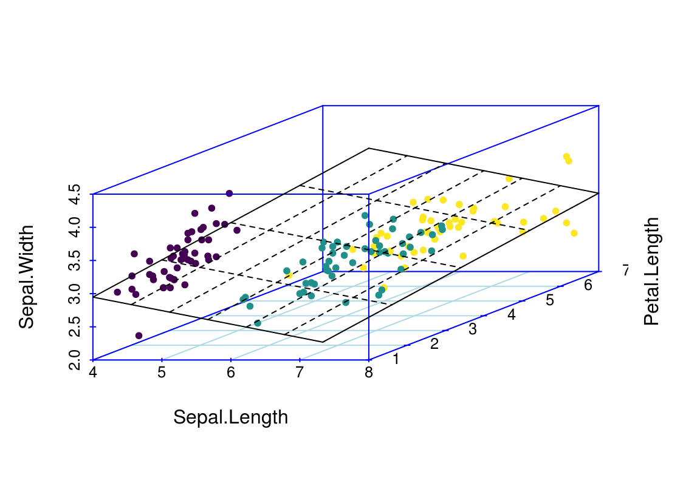
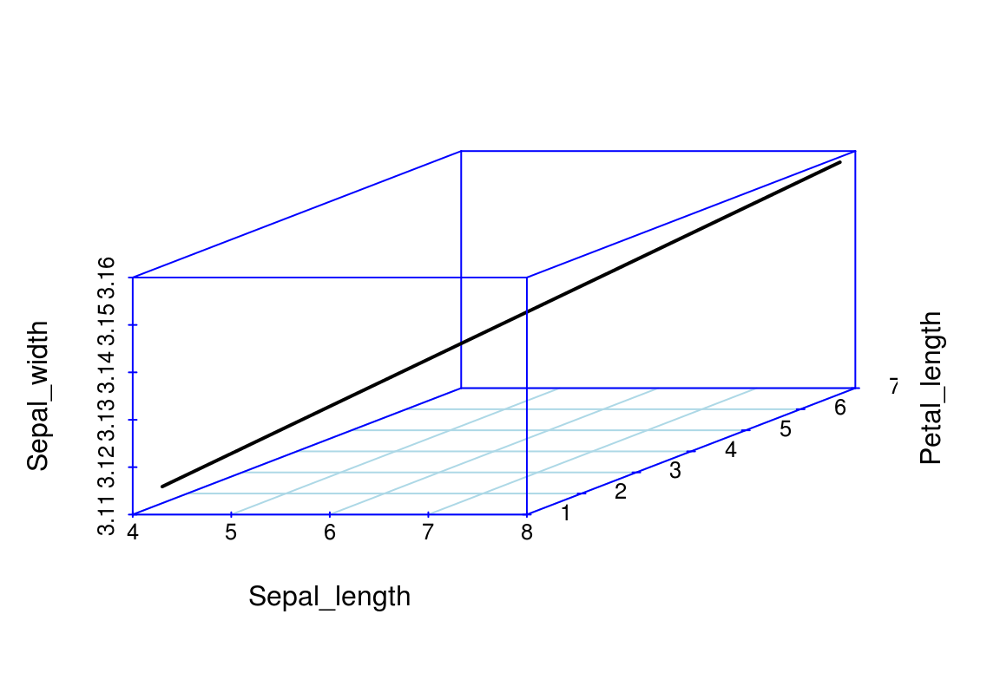

# Kaks lineaarse mudeli laiendust


```r
library(tidyverse)
library(scatterplot3d)
library(viridis)
```


## Mitme sõltumatu prediktoriga mudel {-}

Esiteks vaatame mudelit, kus on mitu prediktorit x~1~, x~2~, ... x~n~, mis on additiivse mõjuga. See tähendab, et me liidame nende mõjud, mis omakorda tähendab, et me usume, et x~1~...x~n~ mõjud y-i väärtusele on üksteisest sõltumatud. Mudel on siis kujul 

$$y = a + b_1x_1~ + b_2x_2~ +~ ... +~ b_nx_n$$


> Mitme prediktoriga mudeli iga prediktori tõus (beta koefitsient) ütleb, mitme ühiku võrra ennustab mudel y muutumist juhul kui see prediktor muutub ühe ühiku võrra ja kõik teised prediktorid ei muutu üldse. 


Kui meie andmed on kolmedimensioonaalsed (me mõõdame igal mõõteobjektil kolme muutujat) ja me tahame ennnustada ühe muutuja väärtust kahe teise muutuja väärtuste põhjal (meil on 2 prediktorit), siis tuleb meie 3 parameetriga lineaarne regressioonimudel tasapinna kujul. 
Kui meil on 3 prediktoriga mudel, siis me liigume juba 4-mõõtmelisse ruumi.


<div class="figure" style="text-align: center">

<p class="caption">(\#fig:unnamed-chunk-4)Regressioonitasand 3D andmetele. Siin on Sepal.Length ja Petal.Length prediktorid ja Sepal.Width ennustatav muutuja.</p>
</div>


Seda mudelit saab kaeda 2D ruumis, kui kollapseerida kolmas mõõde konstandile.


```r
p <- ggplot(iris, aes(Sepal.Length, Sepal.Width, color = Species)) +
  geom_point() +
  xlim(4, 8) +
  scale_color_viridis(discrete = TRUE)
p + geom_abline(intercept = coef(m2)[1], slope = coef(m2)[2]) +
  labs(title = deparse(formula(m2)))
m1 <- lm(Sepal.Width ~ Sepal.Length, data = iris)
p + geom_abline(intercept = coef(m1)[1], slope = coef(m1)[2]) +
  labs(title = deparse(formula(m1)))
```

<div class="figure" style="text-align: center">

<p class="caption">(\#fig:lin2d)2D-le kollapseeritud graafiline kujutus 3D andmete põhjal fititud mudelist. Muutuja Petal.Length on kollapseeritud konstandile.</p>
</div>

Siin on regressioonijoon hoopis teises kohas, kui lihtsas ühe prediktoriga mudelis.

Nõnda võrdleme kahe mudeli koefitsiente.


```r
coef(m1)
#>  (Intercept) Sepal.Length 
#>       3.4189      -0.0619
coef(m2)
#>  (Intercept) Sepal.Length Petal.Length 
#>        1.038        0.561       -0.335
```

Nagu näha, mudeli m2 b_1 koefitsient erineb oluliselt mudeli m1 vastavast koefitsiendist.

Kumb mudel on siis parem? 
AIC-i järgi on m2 kõvasti parem, kui m1, lisakoefitsendi (Petal.Length) kaasamisel mudelisse paranes oluliselt selle ennustusvõime.

```r
AIC(m1, m2)
#>    df   AIC
#> m1  3 179.5
#> m2  4  92.1
```

**Ennustused sõltumatute prediktoritega mudelist**

Siin on idee kasutada fititud mudeli struktuuri enustamaks y keskmisi väärtusi erinevatel $x_1$ ja $x_2$ väärtustel. 
Kuna mudel on fititud, on parameetrite väärtused fikseeritud. 


```r
## New sepal length values
Sepal_length <- seq(min(iris$Sepal.Length), max(iris$Sepal.Length), length.out = 10)
## Keep new petal length constant
Petal_length <- mean(iris$Petal.Length)
## Extract model coeficents
a <- coef(m2)[1]
b1 <- coef(m2)[2]
b2 <- coef(m2)[3]
## Predict new sepal width values
Sepal_width_predicted <- a + b1 * Sepal_length + b2 * Petal_length
```


```r
plot(Sepal_width_predicted ~ Sepal_length, type = "b", ylim = c(0, 5), col = "red")
# prediction from the single predictor model
abline(c(coef(m1)[1], coef(m1)[2]), lty = "dashed")
```

<div class="figure" style="text-align: center">

<p class="caption">(\#fig:unnamed-chunk-8)Ennustatud y väärtused erinevatel x1 ja x2 väärtustel, punane joon. Katkendjoon, ühe prediktoriga mudeli ennustus.</p>
</div>

Nüüd joonistame 3D pildi olukorrast, kus nii $x_1$ kui $x_2$ omandavad rea väärtusi. Mudeli ennustus on ikkagi sirge kujul -- mis sest, et 3D ruumis.


```r
Petal_length <- seq(min(iris$Petal.Length), max(iris$Petal.Length), length.out = 10)
Sepal_width <- a + b1 * Sepal_length + b2 * Petal_length
dfr <- data_frame(Sepal_width, Sepal_length, Petal_length)
with(dfr, scatterplot3d(Sepal_length, Petal_length, Sepal_width, col.axis = "blue", col.grid = "lightblue", type = "l", lwd = 2))
```

<div class="figure" style="text-align: center">

<p class="caption">(\#fig:unnamed-chunk-9)kahe prediktoriga mudeli ennustus 3D ruumis.</p>
</div>

## Interaktsioonimudel {-}

Interaktsioonimudelis sõltub ühe prediktori mõju sõltub teise prediktori väärtusest:

$$y = a + b_1x_1 + b_2x_2 + b_3x_1x_2$$

Interaktsioonimudeli koefitsientide tõlgendamine on keerulisem. 
b_1 on otse tõlgendatav ainult siis, kui x_2 = 0 (ja b_2 ainult siis, kui x_1 = 0).
Edaspidi õpime selliseid mudeleid graafiliselt tõlgendama. 
Mudeli koefitsientide otse tõlgendamine ei ole siin sageli perspektiivikas.

> Interaktsioonimudelis sõltub x_1 mõju tugevus y-le x_2 väärtusest. Selle sõltuvuse määra kirjeldab b_3 (x_1 ja x_2 interaktsiooni tugevus). Samamoodi ja sümmeetriliselt erineb ka x_2 mõju erinevatel x_1 väärtustel. Ainult siis, kui x_2 = 0, ennustab x_1 tõus 1 ühiku võrra y muutust b_1 ühiku võrra.

Interaktsioonimudeli 2D avaldus on kurvatuuriga tasapind, kusjuures kurvatuuri määrab b_3. 

Interaktsiooniga mudel on AIC-i järgi pisut vähem eelistatud võrreldes m2-ga. 
Seega, eriti lihtsuse huvides, eelistame m2-e.

```r
m3 <- lm(Sepal.Width ~ Sepal.Length + Petal.Length + Sepal.Length * Petal.Length, data = iris)
AIC(m1, m2, m3)
#>    df   AIC
#> m1  3 179.5
#> m2  4  92.1
#> m3  5  93.4
```


**Ennustused interaktsioonimudelist**  

Kõigepealt anname rea väärtusi x_1-le ja hoiame x_2 konstantsena. 


```r
Petal_length <-  mean(iris$Petal.Length)
a <- coef(m3)[1]
b1 <- coef(m3)[2]
b2 <- coef(m3)[3]
b3 <- coef(m3)[4]
Sepal_width <- a + b1 * Sepal_length + b2 * Petal_length + b3 * Sepal_length * Petal_length
plot(Sepal_width ~ Sepal_length, type = "l", ylim = c(2, 6))
abline(m2, lty = "dashed")
#> Warning in abline(m2, lty = "dashed"): only using the first two of 3
#> regression coefficients
```

<div class="figure" style="text-align: center">

<p class="caption">(\#fig:unnamed-chunk-11)Ennustus interaktsioonimudelist, kus x1 on antud rida väärtusi ja x2 hoitakse konstantsena.</p>
</div>

Tulemuseks on sirge, mis on paraleelne ilma interaktsioonita mudeli ennustusele (katkendjoon)


Nagu näha, korrutamistehe viib selleni, et interaktsioonimudeli tõus erineb ilma interaktsioonita mudeli tõusust. 

Kui aga interaktsioonimudel plottida välja 3D-s üle paljude x_1 ja x_2 väärtuste, saame me regressioonikurvi (mitte sirge), kus b_3 annab kurvatuuri.


```r
Petal_length <-  seq(min(iris$Petal.Length), 
                     max(iris$Petal.Length), 
                     length.out = 100)
a <- coef(m3)[1]
b1 <- coef(m3)[2]
b2 <- coef(m3)[3]
b3 <- coef(m3)[4]

Sepal_width <-   a + b1 * Sepal_length + b2 * Petal_length +  b3 * Sepal_length * Petal_length
dfr <- data.frame(Sepal_width, Sepal_length, Petal_length)
with(dfr, scatterplot3d(Sepal_length, Petal_length, Sepal_width, pch = 20, col.axis = "blue", col.grid = "lightblue", lwd = 2))
```

<div class="figure" style="text-align: center">

<p class="caption">(\#fig:unnamed-chunk-12)Ennustused 3D interaktsioonimudelist üle paljude x1 ja x2 väärtuste.</p>
</div>

Vau! See on alles ennustus!
