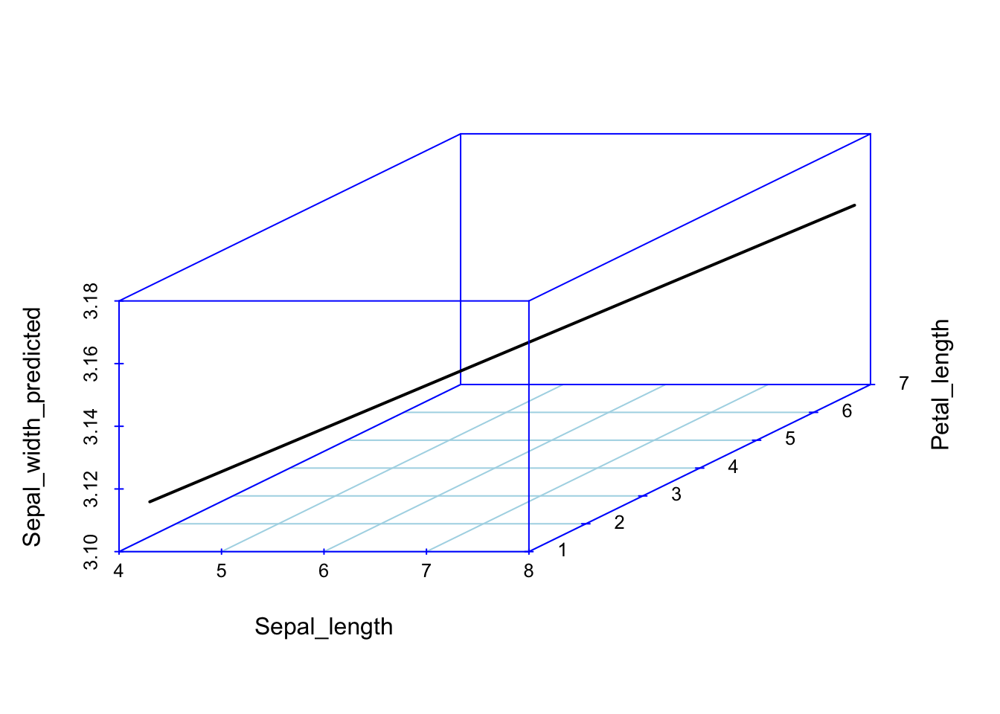
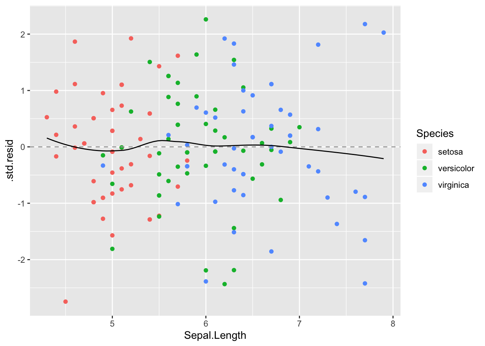
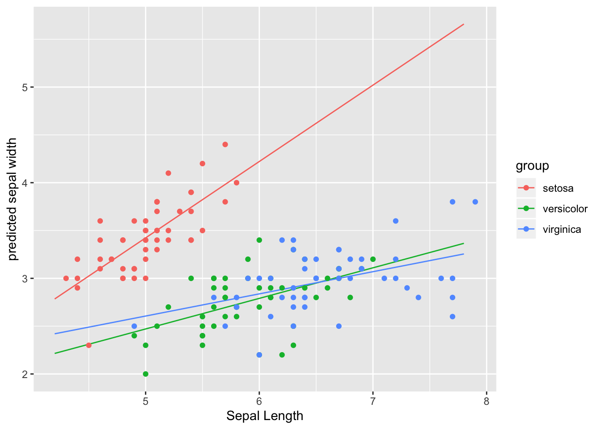

# Kaks lineaarse mudeli laiendust


```r
library(tidyverse)
library(scatterplot3d)
library(viridis)
library(ggeffects)
library(broom)
library(car)
```

## Mitme sõltumatu prediktoriga mudel 


Esiteks vaatame mudelit, kus on mitu prediktorit $x_1$, $x_2$, ... $x_n$, mis on aditiivse mõjuga.
See tähendab, et me liidame nende mõjud, mis omakorda tähendab, et me usume, et $x_1$ ... $x_n$ mõjud y-i väärtusele on üksteisest sõltumatud. 
Mudel on siis kujul 

$$y = a + b_1x_1~ + b_2x_2~ +~ ... +~ b_nx_n$$

> Mitme prediktoriga mudeli iga prediktori tõus (beta koefitsient) ütleb, mitme ühiku võrra ennustab mudel y muutumist juhul kui see prediktor muutub ühe ühiku võrra ja kõik teised prediktorid ei muutu üldse (Yule, 1899). 

Milliseid muutujaid (regressoreid) peaks üks hea lineaarne mudel sisaldama, milliseid peaks me mudelist välja viskama ja milliseid igal juhul sisse panema?
Matemaatiliselt põhjustab regressorite eemaldamine ülejäänud regressorite koefitsientide ebakonsistentsust, välja arvatud siis, kui (i) välja visatud regressorid ei ole korreleeritud sisse jäetud regressoritega või (ii) välja vistatud regressorite koefitsiendid võrduvad nulliga, mis muudab nad ebarelevantseteks. Kuidas sa tead, et kõik vajalikud regressorid on sul üldse olemas (olematuid andmeid ei saa ka mudelisse lisada)? Loomulikult ei teagi, mis tähendab lihtsalt, et mudeldamine on keeruline protsess, nagu teaduski. Pane ka tähele, et koefitsiendi "mitte-oluline" p väärtus ei tähenda iseenesest, et koefitsient tõenäoliselt võrdub nulliga või on nulli lähedal, vaid seda, et meil pole piisavalt andmeid, et vastupidist kinnitada. Koefitsiendi hinnangu usalduspiirid on selles osas palju parem töövahend.

Kui meie andmed on kolmedimensionaalsed (me mõõdame igal mõõteobjektil kolme muutujat) ja me tahame ennnustada ühe muutuja väärtust kahe teise muutuja väärtuste põhjal (meil on kaks prediktorit), siis tuleb meie kolme parameetriga lineaarne regressioonimudel tasapinna kujul. 
Kui meil on kolme prediktoriga mudel, siis me liigume juba neljamõõtmelisse ruumi.


(ref:regressioonitasand) Regressioonitasand 3D andmetele. Kahe prediktoriga mudel, kus Sepal.Length ja Petal.Length on prediktorid ja Sepal.Width ennustatav muutuja.

<div class="figure">

<p class="caption">(\#fig:regressioonitasand)(ref:regressioonitasand)</p>
</div>


Seda mudelit saab kaeda 2D ruumis, kui kollapseerida kolmas mõõde konstandile.

(ref:lin2d) 2D-le kollapseeritud graafiline kujutus 3D andmete põhjal fititud mudelist. Vasemal, muutuja Petal.Length on kollapseeritud konstandile. Siin on regressioonijoon hoopis teises kohas, kui lihtsas ühe prediktoriga mudelis (paremal).


```r
p <- ggplot(iris, aes(Sepal.Length, Sepal.Width, color = Species)) +
  geom_point() +
  xlim(4, 8) +
  scale_color_viridis(discrete = TRUE) +
  theme(title = element_text(size = 8))
p1 <- p + geom_abline(intercept = coef(m2)[1], slope = coef(m2)[2]) +
  labs(title = deparse(formula(m2)))
m1 <- lm(Sepal.Width ~ Sepal.Length, data = iris)
p2 <- p + geom_abline(intercept = coef(m1)[1], slope = coef(m1)[2]) +
  labs(title = deparse(formula(m1)))
devtools::source_gist("8b4d6ab6a333ef1cd14e8067c3badbae", filename = "grid_arrange_shared_legend.R")
grid_arrange_shared_legend(p1, p2)
```

<div class="figure">

<p class="caption">(\#fig:lin2d)(ref:lin2d)</p>
</div>


Võrreldes mudelite m1 (üks prediktor) ja m2 (kaks prediktorit) Sepal.Length ($b_1$) koefitsienti on näha, et need erinevad oluliselt.


```r
coef(m1)
#>  (Intercept) Sepal.Length 
#>       3.4189      -0.0619
coef(m2)
#>  (Intercept) Sepal.Length Petal.Length 
#>        1.038        0.561       -0.335
```

Kumb mudel on siis parem? 
AIC-i järgi on m2 kõvasti parem kui m1, lisakoefitsendi (Petal.Length) kaasamisel mudelisse paranes oluliselt selle ennustusvõime.

```r
AIC(m1, m2)
#>    df   AIC
#> m1  3 179.5
#> m2  4  92.1
```

### Ennustused sõltumatute prediktoritega mudelist {-}

Siin on idee kasutada fititud mudeli struktuuri ennustamaks y keskmisi väärtusi erinevatel $x_1$ ja $x_2$ väärtustel.
Kuna mudel on fititud, on parameetrite väärtused fikseeritud. 


```r
## New sepal length values
Sepal_length <- seq(min(iris$Sepal.Length), max(iris$Sepal.Length), length.out = 10)
## Keep new petal length constant
Petal_length <- mean(iris$Petal.Length)
## Extract model coeficents
a <- coef(m2)["(Intercept)"]
b1 <- coef(m2)["Sepal.Length"]
b2 <- coef(m2)["Petal.Length"]
## Predict new sepal width values
Sepal_width_predicted <- a + b1 * Sepal_length + b2 * Petal_length
```

(ref:yksversuskaks) Ennustatud y väärtused erinevatel $x_1$ väärtustel kui $x_2$ on konstantne, punane joon. Katkendjoon, ühe prediktoriga mudeli ennustus.


```r
plot(Sepal_width_predicted ~ Sepal_length, type = "b", ylim = c(0, 5), col = "red")
# Prediction from the single predictor model
abline(m1, lty = "dashed")
```

<div class="figure">

<p class="caption">(\#fig:yksversuskaks)(ref:yksversuskaks)</p>
</div>

Nüüd joonistame 3D pildi olukorrast, kus nii x~1~ kui x~2~ omandavad rea väärtusi. Mudeli ennustus on ikkagi sirge kujul -- mis sest, et 3D ruumis.

(ref:kaksprediktorit) Kahe prediktoriga mudeli ennustus 3D ruumis.


```
#> Warning: `data_frame()` is deprecated, use `tibble()`.
#> This warning is displayed once per session.
```

<div class="figure">

<p class="caption">(\#fig:kaksprediktorit)(ref:kaksprediktorit)</p>
</div>

## Interaktsioonimudel 

Interaktsioonimudelis sõltub ühe prediktori mõju teise prediktori väärtusest:

$$y = a + b_1x_1 + b_2x_2 + b_3x_1x_2$$

Ekvivalntne viis interaktsiooni spetsifitseerida on läbi võrrandisüsteemi:
$$y = a + \gamma x_1 + b_2x_2$$
$$\gamma = b_1 + b_3x_2$$
Siit on hästi näha, et me teeme kaks lineaarset regressiooni, millest teine modelleerib $x_1$ muutuja koefitsiendi sõltuvust $x_2$ muutuja väärtusest.

Samamoodi kehtib ka ümberkirjutus 
$$y = a + \gamma x_2 + b_1x_1$$
$$\gamma = b_2 + b_3x_1$$

mis tähendab, et ühtlasi modelleerime me ka $x_2$ koefitsiendi sõltuvust $x_1$-st. Mudeli koefitsientide tõlgendamise teeb keeruliseks, et gamma tõlgendamisel tuleb arvesse võtta kolm asja -- b~2~, b~3~ ja x~1~.

Kaks muutujat võivad inteakteeruda sõltumata sellest, kas nad on korreleeritud või mitte -- interaktsioon ei impitseeri korrelatsiooni, ega vastupidi.

Sageli on nii, et prediktoreid, mille mõju y-le on suur, tasub mudeldada ka interaktsioonimudelis (näiteks suitsetamise mõju vähimudelites kipub olema interaktsiooniga). 
Interaktsioonimudelis on b~1~ koefitsient otse tõlgendatav ainult siis, kui x~2~ = 0 (ja b~2~ ainult siis, kui x~1~ = 0).

 Kui interaktsioonimudel fititakse tsentreeritud x-muutujate peal, mille keskväärtus = 0 (või standardiseeritud muutujatel), siis muutub koefitsientide tõlgendamine lihtsamaks: 

* b~1~ annab y tõusu, kui x~1~ tõuseb 1 ühiku võrra ja x~2~ on fikseeritud oma keskväärtusel 

* b~2~ annab y tõusu, kui x~2~ tõuseb 1 ühiku võrra ja x~1~ on fikseeritud oma keskväärtusel). 

* b~3~ ütleb, kui palju muutub x~1~ mõju y-le, kui x~2~ muutub ühe ühiku võrra. Samamoodi, b~3~ ütleb, kui palju muutub x~2~ mõju y-le, kui x~1~ muutub ühe ühiku võrra.

NB! Ärge standardiseerige faktormuutujaid ehk *dummy*-regressoreid kujul 1, 0  -- neid on lihtsam tõlgendada algsel kujul 0/1 skaalas.

Edaspidi õpime selliseid mudeleid graafiliselt tõlgendama, kuna koefitsientide otse tõlgendamine ei ole siin sageli perspektiivikas.

> Interaktsioonimudelis sõltub x~1~ mõju tugevus y-le x~2~ väärtusest. Selle sõltuvuse määra kirjeldab b~3~ (x~1~ ja x~2~ interaktsiooni tugevus). Samamoodi ja sümmeetriliselt erineb ka x~2~ mõju erinevatel x~1~ väärtustel. Ainult siis, kui x~2~ = 0, ennustab x~1~ tõus 1 ühiku võrra y muutust b~1~ ühiku võrra.

Kui meil on mudelis interaktsiooniliige $x_1x_2$, siis on enamasti mõistlik ka lisada eraldi liikmetena ka $x_1$ ja $x_2$. 

Näiteks mudel, milles on pidev y-muutuja, pidev prediktor "education" ja binaarne prediktor "sex_male" (1 ja 0): 

$$score = a + b_1 * education + b_2 * sex_{male} + b_3 * education * sex_{male}$$

Variandis

$$score = a + b_1 * education + b_3 * education * sex_{male}$$

surume meeste ja naiste intercepti pidevale muutujale "education" ühte punkti, aga samas modelleerime sellele erinevad tõusud meeste ja naiste lõikes.

Samamoodi, variandis 

$$score = a +  b_2 * sex_{male} + b_3 * education * sex_{male}$$

on naiste tõus surutud nulli, aga interceptid võivad erineda, mis on kokkuvõttes üsna imelik, kuigi tehniliselt on mudel ok ja seda võib edukalt fittida.

Ja variandis 

$$score = 0 + b_3 * education * sex_{male}$$

On meil meeste ja naiste intercept surutud nulli, aga meeste ja naiste tõusud võivad erineda.

Kui meil on kaks faktor-prediktorit, siis mudel kujul

$$y= 0 + b_3x_1x_2$$

Mudeldab eraldi nende faktorite tasemete kõikvõimalud kombinatsioonid.

> Oletame, et meil on lisaks pidevale prediktorile x~1~ ka faktor-prediktor x~2~. Diskreetsed  e faktor-prediktorid rekodeeritakse automaatselt nn *dummy*-muutujateks. Kahevalentse e binaarse muutuja, näit sex = c("male", "female"), korral läheb  regressioonivõrrandisse uus dummy-muutuja, sex_female, kus kõik emased on 1-d ja isased 0-d. Üldine intercept vastab siis isaste mõjule ja sex_female intercept annab emaste erinevuse isastest. Kui meil on n-tasemega diskreetne muutuja, rekodeerime selle n-1 *dummy*-muutujana, millest igaüks on 0/1 kodeeringus ja millest igaühe interceptid annavad erinevuse null-taseme (selle taseme, mis ei ole rekodeeritud *dummy*-muutujana) interceptist. Mudeli seisukohast pole oluline, millise faktortunnuse taseme me nulltasemeks võtame. Terminoloogiliselt on meie n-tasemega faktortunnus *seletav muutuja* (*explanatory variable*), millest tehakse n-1 *regressorit*. Seega tehniliselt on mudeli liikmed regressorid, mitte seletavad muutujad. Üks seletav muutuja võib anda välja mitu regressorit (nagu eelmises näites) ja üks regressor võib põhineda mitmel muutujal (näit x~1x~2 interaktsiooniterm). 


Interaktsioonimudeli 2D avaldus on kurvatuuriga tasapind, kusjuures kurvatuuri määrab b~3~. 

Interaktsiooniga mudel on AIC-i järgi pisut vähem eelistatud võrreldes kahe prediktoriga mudeliga m2. 
Seega, eriti lihtsuse huvides, eelistame m2-e.

```r
m3 <- lm(Sepal.Width ~ Sepal.Length + Petal.Length + Sepal.Length * Petal.Length, data = iris)
AIC(m1, m2, m3)
#>    df   AIC
#> m1  3 179.5
#> m2  4  92.1
#> m3  5  93.4
```


### Ennustused interaktsioonimudelist {-}  

Kõigepealt anname rea väärtusi x~1~-le ja hoiame x~2~ konstantsena. 

(ref:ennustus-interaktsioonimudelist) Ennustus interaktsioonimudelist, kus x~1~ (Sepal_Length) on antud rida väärtusi ja x~2~ (Petal_length) hoitakse konstantsena (pidevjoon). Interaktsioonimudeli regressioonijoon on paraleelne ilma interaktsioonita mudeli ennustusele (katkendjoon).


```r
Petal_length <-  mean(iris$Petal.Length)
a <- coef(m3)["(Intercept)"]
b1 <- coef(m3)["Sepal.Length"]
b2 <- coef(m3)["Petal.Length"]
b3 <- coef(m3)["Sepal.Length:Petal.Length"]
Sepal_width_predicted <- a + b1 * Sepal_length + b2 * Petal_length + b3 * Sepal_length * Petal_length
plot(Sepal_width_predicted ~ Sepal_length, type = "l", ylim = c(2, 6))
abline(coef(m2)[c("(Intercept)", "Sepal.Length")], lty = "dashed")
```

<div class="figure">

<p class="caption">(\#fig:ennustus-interaktsioonimudelist)(ref:ennustus-interaktsioonimudelist)</p>
</div>

Nagu näha viib korrutamistehe selleni, et interaktsioonimudeli tõus erineb ilma interaktsioonita mudeli tõusust. 

Kui aga interaktsioonimudel plottida välja 3D-s üle paljude x~1~ ja x~2~ väärtuste, saame me regressioonikurvi (mitte sirge), kus b~3~ annab kurvatuuri.

(ref:ennustused3d-interaktsioonimudelist) Ennustused 3D interaktsioonimudelist üle paljude x~1~ (Sepal_Length) ja x~2~ (Petal_length) väärtuste.

<div class="figure">

<p class="caption">(\#fig:ennustused3d-interaktsioonimudelist)(ref:ennustused3d-interaktsioonimudelist)</p>
</div>

Vau! See on alles ennustus!

# Vähimruutude meetodiga fititud mudelite töövoog -- lm()

Kuna lm() funktsiooniga ja bayesi meetodil fititud mudeliobjektidega töötamine on mõnevõrra erinev, õpetame seda eraldi. Siinkohal anname põhilise töövoo lm() mudelobjektide inspekteerimiseks.

Töötame m3 mudeliobjektiga, mis on interaktsioonimudel: 

Sepal.Width ~ Sepal.Length * Species

ehk

$$Speal.Width = a + b_1*Sepal.Length + b_2*Species + b_3*Sepal.Length*Species$$


```r
library(ggeffects)
m3 <- lm(Sepal.Width ~ Sepal.Length * Species, data = iris)
```


## 1. vaatame mudeli koefitsiente {-}


```r
tidy(m3)
#> # A tibble: 6 x 5
#>   term                           estimate std.error statistic  p.value
#>   <chr>                             <dbl>     <dbl>     <dbl>    <dbl>
#> 1 (Intercept)                      -0.569     0.554     -1.03 3.06e- 1
#> 2 Sepal.Length                      0.799     0.110      7.23 2.55e-11
#> 3 Speciesversicolor                 1.44      0.713      2.02 4.51e- 2
#> 4 Speciesvirginica                  2.02      0.686      2.94 3.85e- 3
#> 5 Sepal.Length:Speciesversicolor   -0.479     0.134     -3.58 4.65e- 4
#> 6 Sepal.Length:Speciesvirginica    -0.567     0.126     -4.49 1.45e- 5
```

Interaktsioonimudeli koefitsientide jõllitamine on sageli tühi töö ja vaimu närimine. Õnneks on meil muid meeotodeid, kuidas lm() mudelitega töötada.

Võrdluseks - nii fitime eraldi mudeli igale irise liigile. Tulemus on tegelikult identne interaktsioonimudeliga kategoorilisele muutujale (Species), aga koefitsiendid on otse tõlgendatavad. Samas, interaktsioonimudelit saab fittida ka pidevale muutujale!


```r
iris %>% split(.$Species) %>% 
  map(~ lm(Sepal.Width ~ Sepal.Length, data = .)) %>% 
  map(summary) %>% 
  map_dfr(~ broom::tidy(.), .id = "Species")
#> # A tibble: 6 x 6
#>   Species    term         estimate std.error statistic  p.value
#>   <chr>      <chr>           <dbl>     <dbl>     <dbl>    <dbl>
#> 1 setosa     (Intercept)    -0.569    0.522      -1.09 2.81e- 1
#> 2 setosa     Sepal.Length    0.799    0.104       7.68 6.71e-10
#> 3 versicolor (Intercept)     0.872    0.445       1.96 5.56e- 2
#> 4 versicolor Sepal.Length    0.320    0.0746      4.28 8.77e- 5
#> 5 virginica  (Intercept)     1.45     0.431       3.36 1.55e- 3
#> 6 virginica  Sepal.Length    0.232    0.0651      3.56 8.43e- 4
```

Adjusteeritud r2 tasub eraldi üle vaadata.

```r
summary(m3)$adj.r.squared
#> [1] 0.61
```

0.61 tähendab, et mudel suudab seletada mitte rohkem kui 61% y-muutuja (Sepal.Width) varieeruvusest. 

## 2. Testime mudeli eeldusi {-}

Nii saab fititud väärtused (.fitted), residuaalid (.resid), fittitud väätruste standardvead (.se.fit). Residuaal = y data value - fitted value. Seega positiivne residuaal näitab, et mudeli ennustus keskmisele y väärtusele mingil x-muutujate väärtusel on madalam kui juhutb olema tegelik y-i andmepunkti väärtus. See võib olla tingitud y-muutuja normaalsest bioloogilisest varieeruvusest, aga ka sellest, et mudel ei kirjelda täiuslikult x-ide ja y tegelikku seost.


```r
(a_m3 <- augment(m3))
#> # A tibble: 150 x 10
#>   Sepal.Width Sepal.Length Species .fitted .se.fit   .resid   .hat .sigma
#>         <dbl>        <dbl> <fct>     <dbl>   <dbl>    <dbl>  <dbl>  <dbl>
#> 1         3.5          5.1 setosa     3.50  0.0399 -0.00306 0.0215  0.273
#> 2         3            4.9 setosa     3.34  0.0403 -0.343   0.0218  0.272
#> 3         3.2          4.7 setosa     3.18  0.0512  0.0163  0.0354  0.273
#> 4         3.1          4.6 setosa     3.10  0.0591 -0.00380 0.0471  0.273
#> 5         3.6          5   setosa     3.42  0.0385  0.177   0.0200  0.273
#> 6         3.9          5.4 setosa     3.74  0.0581  0.157   0.0455  0.273
#> # … with 144 more rows, and 2 more variables: .cooksd <dbl>,
#> #   .std.resid <dbl>
```

.hat >1 sugereerib high leverage andmepunkte 

.std.resid on studentiseeritud residuaal, mis on sd ühikutes (.resid/sd(.resid))

### Lineaarsus - residuaalid~fitted plot {-}

Residuals vs fitted plot testib lineaarsuse eeldust - kui .resid punktid jaotuvad ühtlaselt nulli ümber, siis mudel püüab kinni kogu süstemaatilise varieeruvuse teie andmetest ja see mis üle jääb on juhuslik varieeruvus.

```r
ggplot(a_m3, aes(`.fitted`, `.resid`)) + 
  geom_point(aes(color=Species), alpha=0.5) + 
  geom_smooth()
```


### Mõjukuse plot {-}

* *outlier*id -- studentideeritud residuaalid > 2 või < -2. Studentiseeritud residuaali saab (ligikaudu) jagades vaatluse residuaali residuaalide standardhälbega. See protseduur võimaldab paremini võrrelda erinevate vaatluste residuaale. 

Standardiseeritud residuaali arvutamine: Kui $E_i$ on i-s residuaal, k on mudeli regressorite arv ja n on vaatluste arv, siis $h_i = 1/n + E_i/\sum~E^2$, $S_E = (E^2/(n - k -1))^{1/2}$  ja $E_{st} = E_i/(S_E(1 - h_i)^{1/2})$ kus E~st on standardiseeritud residuaal, mis suurtel valimitel on väga sarnane studentiseeritud residuaaliga (mis erineb selle poolest, et välistab iga residuaali S~E-st seda residuaali genereerinud vaatluse). Kui n on suur, siis kehtib enam-vähem seos $E_{st} = E_i/sd(E)$, kus E_st on nii standardiseeritud kui studentiseeritud residuaal.  

* *high leverage* vaatlused -- hat > 1 - sugereerib *high leverage* vaatlust 
Keskmine hat value = (k + 1)/n, kus k on regressorite arv (mitte arvestades intercepti) ja n on vaatluste arv. NB! Kuna *high leverage* vaatlused tõmbavad regressioonijoon enda suunas, siis on neil sageli madalad residuaalid (erinevalt outlieritest, mis ei ole *high leverage* vaatlused)


```r
library(car)
influencePlot(m3, id.method="identify", main="Influence Plot",
              sub="Circle size is proportional to Cook's distance")
```


```
#>     StudRes    Hat   CookD
#> 15   -0.243 0.1236 0.00139
#> 42   -2.810 0.0621 0.08307
#> 69   -2.477 0.0253 0.02567
#> 107  -0.331 0.1638 0.00359
#> 119  -2.464 0.0824 0.08782
```

Horisontaalsed referentsjooned näitavad 0, 2 ja -2 studentiseeritud residuaale.
Vertikaalsed referentsjooned näitavad hat-väärtusi 2h ja 3h.

> Regressiooni *outlier* on vaatlus, mille y-muutja väärtus on ebatavaline X-muujutuja väärtuse kontekstis. Seega annab *outlier* mudeli fittimisel kõrge residuaaliga punkti. Lihtsalt (mitte-konditsionaalselt) ebatavalised Y-i või X-i väärtused ei pruugi olla *outlier*id. Kui peaks juhuma, et *outlier* langeb kokku ebatavalise X-i väärtusega, siis selle punkti eemaldamine muudab märkimisväärselt mudeli koefitsiente. Selline *outlier* on ühtlasi ka *high leverage* vaatlus. Siit jõuame mõjukate vaatluste (*Influential observations*) defineerimisele --- Mõjukus mudeli koefitsientidele =  *Leverage* x *"outlierness"*. *High leverage* andmepunktid on x-muutujate ekstreemsed punktid, mille lähedal ei ole n-mõõtmelises ruumis (kui teil on n x-muutujat) teisi punkte. Seetõttu läheb fititud mudel just nende punktide lähedalt mõõda. Mõjukad punktid on tüüpiliselt ka *high leverage* punktid, kuid vastupidine ei kehti!


#### Cooki kaugus - mõjukus {-}

.cooksd on Cook-i kaugus, mis näitab mõjukust. Rusikareeglina tähendab cooksd > 3 cooksd keskväärtust, et tegu võiks olla mõjuka vaatlusega. Teine võimalus on pidada mõjukaks igat punkti, mis on kõrgem kui 4/n. Kolmanadad arvavad jälle, et .cooksd > 1 v .cooksd > 0.5 viitab mõjukale vaatlusele. Üldiselt on kõigi mudeli eelduste kontrollidega nii, et vastava statistiku jaotuse jõllitamine on sageli kasulikum kui automaatselt mingi *cut-offi* järgi talitamine.

Cooki D andmepunktile saame valemist $D_i = \frac{E'_i}{k+1} + \frac{h_i}{1-h_i}$, kus $D_i$ on i-ndale vaatlusele vastav Cooki kaugus ja ${E'_i}$ on sellele vaatlusele vastav studentiseeritud residuaal.


```r
ggplot(data = NULL, aes(x = 1:150, y = a_m3$`.cooksd`)) + geom_col() + 
  geom_hline(yintercept = 4/150)+ 
  geom_hline(yintercept = 3*mean(a_m3$`.cooksd`), lty = 2)
```


### Residuaalide normaalsus - qq plot {-}

Kas residuaalid on normaaljaotusega? NB! studentiseeritud residuaalid on studenti t jaotusega ja üldiselt on targem vaadata neid, kui tavalisi residuaale. Studenti t jaotusele pean ette andma ka vabadusastmete arvu e df-i.

```r
car::qqPlot(a_m3$`.std.resid`, distribution = "t", df=149)
```


```
#> [1] 42 69
```
QQ-plot näitab erinevust normaaljaotusest (t jaotusest) eelkõige residuaalide jaotuse sabades. Antud juhul on kõik hästi.

Isegi oluisem on vaadata, et residuaalide jaotus ei oleks mitmetipuline. Kui on, siis võib see olla märgiks, et mudelist on puudu mõni faktormuutuja, mis andmetes olevad diskreetsed loomulikud alampopulatsioonid lahku ajaks.

```r
ggplot(a_m3, aes(`.std.resid`))+ geom_density()
```


### Homoskedastilisus - Scale-location plot {-}

Scale-location plot - homoskedastilisuse eeldust ehk seda, et varieeruvus ei sõltuks prediktormuutuja väärtusest. Y-teljel on ruutjuur studentiseeritud residuaalide absoluutväärtusest

```r
ggplot(a_m3, aes(`.fitted`, `.resid` %>% abs %>% sqrt)) + 
  geom_point(aes(color=Species), alpha=0.5) + 
  ylab("square root of absolute residual")+
  geom_smooth(se = FALSE)
```


## Residuaalid y ja x muutujate vastu {-}

Kõigepealt residuaalid y-muutja vastu

```r
ggplot(a_m3, aes(Sepal.Width, `.std.resid`)) + geom_point(aes(color=Species)) + geom_hline(yintercept = 0, lty =2, color ="darkgrey") + 
  geom_smooth( se=F, color="black", size=0.5)
```


Mudel paistab süstemaatiliselt alahindama Sepal Width-i seal kus Sepal Length on kõrge, ja vastupidi. Horisontaalne punktiirjoon näitab, kus mudel vastab täpselt andmetele.

Studentiseeritud residuaalid sd ühikutes

Ja nüüd residuaalid x-muutuja vastu. 

```r
ggplot(a_m3, aes(Sepal.Length, `.std.resid`, color=Species)) + 
  geom_point() +
  geom_hline(yintercept = 0, lty =2, color ="darkgrey")+
  geom_smooth(se=F, color="black", size=0.5)
```


Ideaalsed residuaalid! 

## 3. Teeme mudeli põhjal ennustusi (marginal plots) {-}

Me ennustame y-i keskmisi väärtuseid etteantud x-i väärtustel.

ggpredict() ennustab y-muutuja väärtusi ühe x-muutuja väärtuste järgi, hoides kõiki teisi x-muutujaid konstantsena.

Kõigepealt võrdleme lihtsa 1 prediktoriga mudeli ennustust kahe prediktoriga mudeli ennustusega 

```r
lm1 <- lm(Sepal.Width ~ Sepal.Length, data = iris)
lm2 <- lm(Sepal.Width ~ Sepal.Length + Petal.Length, data = iris)

mydf <- ggpredict(lm1, terms = "Sepal.Length")
mydf2 <- ggpredict(lm2, terms = "Sepal.Length")

ggplot(mydf, aes(x, predicted)) + 
  geom_line() +
  geom_ribbon(data = mydf, aes(ymin = conf.low, ymax = conf.high), 
              alpha = 0.5, fill="lightgrey") +
  geom_line(data = mydf2, aes(x, predicted), lty=2)+
  geom_ribbon(data = mydf2, aes(ymin = conf.low, ymax = conf.high), 
              alpha = 0.5, fill="lightgrey") +
  geom_point(data=iris, aes(Sepal.Length, Sepal.Width, color=Species)) + 
  xlab("Sepal Length") + 
  ylab("predicted sepal width")+
  theme_classic()
```


>terms argument võtab kuni 3 muutujat, neist 2 peavad olema faktormuutujad ja 3 muutuja korral tekib tabelisse veerg nimega facet, mille abil saab tulemused facet_wrap()-ga välja plottida.


```r
mydf <- ggpredict(m3, terms = c("Sepal.Length", "Species"))
ggplot(mydf, aes(x, predicted)) + 
  geom_line(aes(color=group)) + 
  geom_point(data=iris, aes(Sepal.Length, Sepal.Width, color=Species)) + 
  xlab("Sepal Length") +
  ylab("predicted sepal width")
```




Nii saab sisestada üksikuid parameetriväärtusi ja neile ennustusi teha:

```r
(mydf1 <- ggpredict(m3, terms = c("Sepal.Length [5, 22]", "Species [setosa, versicolor]")))
#> 
#> # Predicted values of Sepal.Width
#> # x = Sepal.Length
#> 
#> # Species = setosa
#>   x predicted std.error conf.low conf.high
#>   5      3.42     0.039     3.35       3.5
#>  22     17.00     1.876    13.32      20.7
#> 
#> # Species = versicolor
#>   x predicted std.error conf.low conf.high
#>   5      2.47      0.08     2.31      2.63
#>  22      7.91      1.21     5.53     10.28
```

## 4. Võrdleme mudeleid {-}

1. Eeldus - kõik võrreldavad mudelid on fititud täpselt samade andmete peal.

2. Eeldus (ei ole vajalik AIC meetodi puhul) - tegemist on nn nested mudelitega. Nested mudel tähendab, et kõik väiksema mudeli liikmed on olemas ka suuremas mudelis.

 Mudelite võrdlus ANOVA-ga (ainult nested mudelid)

```r
tidy(anova(lm1, lm2, m3))
#> Warning: Unknown or uninitialised column: 'term'.
#> # A tibble: 3 x 6
#>   res.df   rss    df sumsq statistic   p.value
#>    <dbl> <dbl> <dbl> <dbl>     <dbl>     <dbl>
#> 1    148  27.9    NA NA         NA   NA       
#> 2    147  15.4     1 12.5      169.   4.83e-26
#> 3    144  10.7     3  4.71      21.2  2.06e-11
```

Mudelite võrdlus AIC-ga

```r
AIC(lm1, lm2, m3)
#>     df   AIC
#> lm1  3 179.5
#> lm2  4  92.1
#> m3   7  43.3
```

AIC (Akaike Informatsiooni Kriteerium) on number, mis püüab tabada mõistlikku tasakaalu mudeli fiti valimiandmetega ja parsinoomia vahel. Väiksema AIC-ga mudel on eelistatud suurema AIC-ga mudeli ees (samas, AIC-l kui ühel arvul puudub tõlgendus). 

Probleem AIC-i taga on selles, et parem fit valimiandmetega võib tähendada mudeli ülefittimist (ja seega halvemat mudelit). Kuna ülefittimise tõenäosus kasvab koos mudeli keerukusega (parameetrite arvuga), eelistame võimalikult lihtsat mudelit, mis samas seletaks võimalikult suure osa valimiandmete varieeruvusest. 


# Andmete transformeerimine

Lineaarsed transformatsioonid võivad hõlbustada mudeli koefitsientide tõlgendamist (näit. skaala millimeetritest meetritessse, tsentreerimine, standardiseerimine). Mittelineaarsed transformatsioonid (logaritmimine, jms) muudavad mudeli fitti ja võivad olla kasulikud mudeli aditiivsuse/lineaarsuse parandamisel. Oluline on mõista, et transformeeritud andmetega mudeleid tuleb tõlgendada transformeeritud skaalas. Seega, kui algsel skaalal pole muud tõlgendust, kui et väärtused on monotoonilised (näiteks suurem number on alati tähtsam kui väiksem number), siis sobib meile sama hästi iga lineaarne transformatsioon sellest skaalast (näiteks ruutjuure võtmine vms). Bioloogias enamasti asjad nii lihtsad ei ole ja seetõttu keskendume siin paremini tõlgendatavatele transformatsioonidele. 

## Logaritmimine

Kui muutujal saavad olla ainult positiivsed väärtused, siis on logaritmimine vahest hea mõte. Enne logaritmima asumist paeb andmetest kaotama ka nullid, näiteks asendades need mingi väikese positiivse arvuga. Logaritmilises skaalas andmetele fititud mudelite $\beta$ koefitsiendid peaaegu alati < 1. 

### Miks ja millal muutujaid logaritmida {-}

1. Muutuja(te) logaritmimine muudab muutujate vahelised suhted mitte-lineaarseks, samas säilitades mudeli lineaarsuse. Ja vastupidi, kui tavalises meetrilises skaalas juhtuvad additiivse mudeli muutujate vahelised seosed olema mitte-lineaarsed, siis x-muutuja(te) logaritmimine võib need muuta lineaarseks, ja sellega päästa ühe olulisema lineaarse regressiooni eelduse (vt ka ptk 4.2).

2. Logarimimine on hea, kui soovite y ja x muutuja omavahelist sõltuvust tõlgendada üle suhtelise muutuse ehk muutuse protsendi. Kui algses skaalas on $\beta$ koefitsiendi loomulik tõlgendus additiivne: x-i kasv 1 ühiku võrra ennustab y-i kasvu $\beta$ ühiku võrra, siis naturaallogaritmitud x-i korral on üks loomulikest multiplikatiivsetest tõlgendustest: x-i kasv 1 ühiku võrra ennustab y-i muutust ... protsendi võrra. Additiivsel juhul me liidame ja lahutame, multiplikatiivsel juhul aga korrutame ja jagame.

3. Muutuja logaritmimine võib viia selle muutuja lähemale normaaljaotusele (lognormaaljaotuse logaritm on normaaljaotusega). Algselt paremale kaldu jaotuse äärmuspunktid võivad regressioonile liiga suurt kaalu omada, milline probleem sageli kaob logaritmimisel.

4. Kui mudeli residuaalid on ümber nulli tugevalt paremale poole kiivas jaotusega, siis andmete logaritmimine võib need normaliseerida. Samuti siis, kui residuaalide sd on proportsionaalne fititud väärtusega (st CV, mitte SD, on konstantne) ja siis, kui te ususte, et residuaalid peegeldavad multiplikatiivseid vigu.

5. Kui y ja x-i vaheline sõltuvus on eksponentsiaalne. 

6. Y-muutuja logaritmimine võib aidata hetoroskedastilisuse vastu.

7. Teaduslik teooria võib indikeerida logaritmimist. Näit pH on log skaalas.

8. Logaritmimine võib lihtsustada mudelit, vähendades interaktsiooniliikmete arvu.

Mudeli fiti kvaliteedi koha pealt pole vahet, millist logaritmi te kasutate --  erinevused on "pelgalt" mudeli koefitsientide tõlgendustes.
 Naturaallogaritmitud log(x) andmete peal fititud mudeli korral on algses lineaarses skaalas tõlgendatav logaritmitud andmete peal fititud $\beta$, aga log-skaalas muutujate väärtused ei tähenda peale vaadates suurt midagi. Vastupidiselt on  kümnendlogaritmitud log10(x) või kahendlogaritmitud log2(x) andmed log skaalas tõlgendatavad, aga mitte neil fititud $\beta$ lineaarses skaalas. Igal juhul eelistavad loodusteadlased kasutada log2 ja log10 skaalasid, mida on mugavam otse log-skaalas tõlgendada. log2 skaalas vastab üheühikuline muutus kahekordsele muutusele algses skaalas ja anti-logaritm on $2^{log2(x)}$. Log10 skaalas vastab üheühikuline muutus 10-kordsele muutusele algses skaalas ja anti-logaritm on $10^{log10(x)}$. 

### Naturaallogaritmitud andmetega töötamine {-}

Järgnevalt õpetame naturaallogaritmitud andmetega fititud mudelite $\beta$ koefitsiendite tõlgendamist algses, meetrilises skaalas ja suhtelises protsendiskaalas.  

Naturaallogaritmi alus on $e \approx 2.71828$ ja sellel on järgmised matemaatilised omadused:

1. $log(e) = 1$

2. $log(1) = 0$

3. $log(A^r) = r * log(A)$

4. $e^{log(A)} = A$ ehk $exp(log(A)) = A$ ehk $2.72^{log(A)} \approx A$

5. $log(AB)=logA + logB$ 

6. $log(A/B)=logA - logB$

7. $exp(AB) =  exp(A)^B$

8. $exp(A+B) = exp(A)exp(B)$ 

9. $exp(A-B) = exp(A)/exp(B)$

Lineaarsel regressioonil saab log-transformatsiooni kasutada kolmel erineval viisil:

- y = $\alpha$ + $\beta$x --- lineaarne mudel (transformeerimata)

- y = $\alpha$ + $\beta$ * log(x) --- lineaar-log mudel (transformeeritud on prediktor(id))

- log(y) = $\alpha$ + $\beta$x -- log-lineaar mudel (transformeeritud on y-muutuja)

- log(y) = $\alpha$ + $\beta$ * log(x) -- log-log mudel (transformeeritud on y ja x muutujad)

**Lineaarses** mudelis y = $\alpha$ + $\beta$x, annab $\beta$ selle, mitu ühikut muutub Y keskväärtus, kui X muutub ühe ühiku võrra.  

**Lineaar-log** mudelis jääb kehtima sama $\beta$ tõlgendus, mis ülalpool, ainult et log-ühikutes. Seega viib logx-i muutus ühe log ühiku võrra y keskväärtuse muutusele $\beta$ ühiku võrra (see kehtib muidugi ka log2 ja log10 skaalades). 

Kui me juba kasutasime naturaallogaritmimist, siis tahame ilmselt tõlgendust pigem muutuse protsendina ja/või algsetes meetrilistes skaalas (log2 ja log10 ei võimalda selliseid mugavaid tõlgendusi):

- $\beta$ on oodatud y muutus, kui x kasvab $ex$ korda. 

- Kui $\beta$ on väike, siis saab seda tõlgendada kui suhtelist erinevust. Näiteks, kui $\beta$ = 0.06, siis 1 ühikuline x-i muutus viib u 6%-sele y muutusele. Sedamõõda kuidas $\beta$ kaugeneb nullist (näiteks $\beta$ = 0.4), hakkab selline hinnang tõsiselt alahindama tegelikku x-i mõju y väärtusele. 

- Oodatud y muutus kui x kasvab p protsenti on $\beta$ * log([100 + p]/100). Näit, kui x kasvab 10% võrra (ehk kui korrutame x-i 1.1-ga), siis log(110/100) = 0.095 ja 0.095$\beta$ on oodatud y muutus. 

**Log-lineaarse** mudeli korral, 

- kui x kasvab 1 ühiku võrra, siis oodatud y väärtus kasvab exp($\beta$) korda. 

- Kui x kasvab c ühiku võrra, siis oodatud y väärtus kasvab exp(c$\beta$) korda. 

- Kui $\beta$ on väike, siis 100 * $\beta$ vastab y protsentuaalsele muutusele juhul kui x muutub 1 ühiku võrra (kui $\beta$ = 0.06, siis x-i muutus 1 ühiku võrra viib y-i 6% tõusule). 

**Log-log** mudeli korral on tõlgendus oodatud y-i muutus protsentides kui x muutub mingi protsendi võrra. Sellist suhet kotsutakse ökonomeetrias elastiliseks ja log x-i $\beta$ koefitsient on "elastilisus." 

- Kui me korrutame x-i e-ga, siis korrutame oodatud y-i väärtuse exp($\beta$)-ga. 

- Et saada y suhtelist muutust, kui x kasvab p protsenti, arvuta a = log([100 + p]/100) ja siis võta exp(a$\beta$). 


## Standardiseerimine

Kui prediktor $x_1$ on mõõdetud näiteks eurodes ja prediktor $x_2$ aastates, siis on meil fititud koefitsientidele $b_1$ ja $b_2$ peale vaadates raske öelda, kumb mõjutab y-muutuja väärtust rohkem. Kuna euro ühik on palju granuleeritum kui aasta, siis võib ka väga väike nullist erinev $b_1$ omada mudeli seisukohast suuremat tähtsust kui suhteliselt suur $b_2$. 

$x.z = (x - mean(x))/sd(x)$

Sellisel viisil standardiseeritud andmete keskväärtus on 0 ja sd = 1. Seega on kõik predikorid samas skaalas ja me mõõdame efekte sd ühikutes. See lubab võrrelda algselt erinevas skaalas prediktoreid. Intecept tähendab nüüd keskmist ennustust, juhul kui kõik prediktorid on fikseeritud oma keskväärtustel. 

Kui mudel sisaldab lisaks pidevatele prediktoritele ka binaarseid prediktoreid, siis on kasulikum standardiseerida üle 2xSD, jättes binaarsed muutujad muutmata.

$x.z2 = (x - mean(x))/(2 * sd(x))$

Nüüd tähendab 1 ühikuline muutus efekti -1 SD-st kuni 1 SD-ni üle keskväärtuse.


### Korrelatsioon üle regressiooni ja regressioon keskmisele {-}

Kui standardiseerime nii y kui x-i

`x <- (x - mean(x)) / sd(x)`
`y <- (y  -mean(y)) / sd(y)`

siis y~x regressiooni intercept = 0 ja tõus on sama, mis x ja y vaheline korrelatsioonikoefitsient r.
Seega jääb tõus alati -1 ja 1 vahele. 

Siit tuleb ka seletus nähtusele, mida kutsutakse regressiooniks keskmisele (*regression to the mean*). Fakti, et y on sellises mudelis alati 0-le lähemal kui x, kutsutaksegi regressiooniks keskmisele. Näiteks, kui olete 20 cm keskmisest pikem ja pikkuse päritavus on 0.5, siis on oodata, et teie järglased on keskeltläbi 10 cm võrra keskmisest pikemad (ja teist lühemad). Selle pseudo-põhjusliku nähtuse avastas Francis Galton. 

## Tsentreerimine

x.c1 = x - mean(x) annab keskväärtuseks nulli aga jätab varieeruvused algsesse skaalasse. Näiteks interaktsioonimudelite koefitsiendid on otse tõlgendatavad  tsentreeritud prediktorite korral.

Teine võimalus on tsentreerida mõnele teaduslikult mõistlikule väärtusele. Näiteks IQ-d saab tsentreerida 100-le (x - 100). 

## Mudeli koefitsientide transformeerimine

Ilma interaktsioonideta mudeli korral saab sama tulemuse, mis prediktoreid tsentreerides, kui me reskaleerime tavalises skaalas fititud mudeli koefitsiendid, korrutades iga $\beta$ oma prediktori kahekordse sd-ga ($\beta_x = \beta \times 2 \times sd(x)$). Nende $\beta_x$-de pealt näeb iga muutuja suhtelist tähtsust mudelis. 

Teine võimalus beta koefitsientide transformeerimiseks, mis ei eelda prediktorite normaalsust, on korrutada betad läbi vastavate muutujate interkvartiilsete range-dega (IQR).

Hoitatus: standardiseeritud koefitsiente ei tohi kasutada, et võrrelda samade prediktorite mõju erinevate andmete peal fititud sama struktuuriga mudelile.
 

## Pidev või diskreetne muutuja?

Tavaliselt on mõistlik fittida mudel pidevale y muutujale ka siis, kui tahame lõpuks tõlgenada tulemusi diskreetsel skaalal. Pidev muutuja sisaldab rohkem informatsiooni ja seetõttu on meil lootust saada parem fit. Erandiks on sellised pidevad x muutujad, mille mõju y-le on mittelineaarne (näiteks vanuse mõju suremusele). Siin on vahest mõistlik konverteerida pidev muutuja faktormuutujaks ja saada hinnang näiteks igale vanuseklassile eraldi. 

Additiivne mudel eeldab, et emaste ja isaste tõusud on võrdsed, mistõttu need fititakse sama beta koefitsiendiga, mis tähendab, et x~2~ mõju pidelvale prediktorile x~1~ on, et me saame mudeli ennustusena faktori n tasemele vastavad n paralleelset sirget, millest igaüks näitab pideva x~1~ seost pideva y-ga erinevatel x~2~ tasemetel. 0/1 kodeeringus regressorite interceptid annavad nende paralleelsete sirgete vahelised kaugused üldise-intercepti poolt antud faktori taseme ennustusest.

## mitmese regressiooni üldised printsiibid

1. võta sisse kõik teaduslikku huvi pakkuvad muutujad ja viska välja muutujad, mille kohta sul pole põhust arvata, et nad võiksid y väärtusi mõjutada.

2. kontrolli, ega muutujate vahel ei esine väga tugevaid korrelatsioone (kollineaarsus). Kui jah, siis kombineeri kollineaarsed muutujad üheks või transformeeri neid või viska mõni muutuja välja.

3. muutujad, mis ei varieeru, ei oma ka regressioonis mõju.

4. tugeva mõjuga muutujate puhul võib olla vajalik sisse tuua nende muutujate interkatsioond (vt ptk ...).

5. muutujad, mida sa reaalselt mõõtsid, ei pruugi olla need muutujad, mis mudelisse lähevad -- näiteks arvuta kehamassiindeks mõõdetud muutujate põhjal.

6. kui pidevad prediktorid transformeerida log skaalasse, siis on lineaarsesse mudelisse pandud efektid multiplikatiivsed, mitte aditiivsed.
