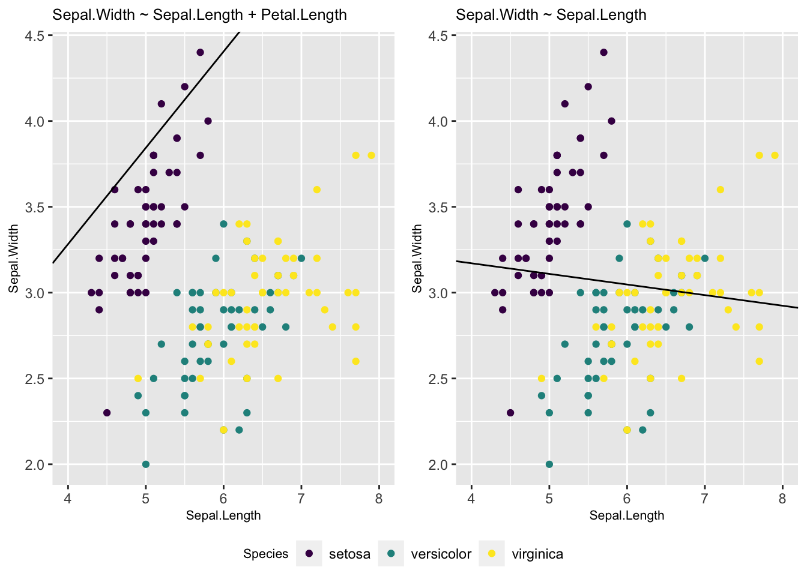

# Kaks lineaarse mudeli laiendust


```r
library(tidyverse)
library(scatterplot3d)
library(viridis)
```


## Mitme sõltumatu prediktoriga mudel {-}

Esiteks vaatame mudelit, kus on mitu prediktorit $x_1$, $x_2$, ... $x_n$, mis on aditiivse mõjuga.
See tähendab, et me liidame nende mõjud, mis omakorda tähendab, et me usume, et $x_1$ ... $x_n$ mõjud y-i väärtusele on üksteisest sõltumatud. 
Mudel on siis kujul 

$$y = a + b_1x_1~ + b_2x_2~ +~ ... +~ b_nx_n$$

> Mitme prediktoriga mudeli iga prediktori tõus (beta koefitsient) ütleb, mitme ühiku võrra ennustab mudel y muutumist juhul kui see prediktor muutub ühe ühiku võrra ja kõik teised prediktorid ei muutu üldse. 


Kui meie andmed on kolmedimensionaalsed (me mõõdame igal mõõteobjektil kolme muutujat) ja me tahame ennnustada ühe muutuja väärtust kahe teise muutuja väärtuste põhjal (meil on kaks prediktorit), siis tuleb meie kolme parameetriga lineaarne regressioonimudel tasapinna kujul. 
Kui meil on kolme prediktoriga mudel, siis me liigume juba neljamõõtmelisse ruumi.


(ref:regressioonitasand) Regressioonitasand 3D andmetele. Kahe prediktoriga mudel, kus Sepal.Length ja Petal.Length on prediktorid ja Sepal.Width ennustatav muutuja.

<div class="figure" style="text-align: center">

<p class="caption">(\#fig:regressioonitasand)(ref:regressioonitasand)</p>
</div>


Seda mudelit saab kaeda 2D ruumis, kui kollapseerida kolmas mõõde konstandile.

(ref:lin2d) 2D-le kollapseeritud graafiline kujutus 3D andmete põhjal fititud mudelist. Vasemal, muutuja Petal.Length on kollapseeritud konstandile. Siin on regressioonijoon hoopis teises kohas, kui lihtsas ühe prediktoriga mudelis (paremal).


```r
p <- ggplot(iris, aes(Sepal.Length, Sepal.Width, color = Species)) +
  geom_point() +
  xlim(4, 8) +
  scale_color_viridis(discrete = TRUE) +
  theme(title = element_text(size = 8))
p1 <- p + geom_abline(intercept = coef(m2)[1], slope = coef(m2)[2]) +
  labs(title = deparse(formula(m2)))
m1 <- lm(Sepal.Width ~ Sepal.Length, data = iris)
p2 <- p + geom_abline(intercept = coef(m1)[1], slope = coef(m1)[2]) +
  labs(title = deparse(formula(m1)))
devtools::source_gist("8b4d6ab6a333ef1cd14e8067c3badbae", filename = "grid_arrange_shared_legend.R")
grid_arrange_shared_legend(p1, p2)
```

<div class="figure" style="text-align: center">

<p class="caption">(\#fig:lin2d)(ref:lin2d)</p>
</div>


Võrreldes mudelite m1 (üks prediktor) ja m2 (kaks prediktorit) Sepal.Length ($b_1$) koefitsienti on näha, et need erinevad oluliselt.


```r
coef(m1)
#>  (Intercept) Sepal.Length 
#>       3.4189      -0.0619
coef(m2)
#>  (Intercept) Sepal.Length Petal.Length 
#>        1.038        0.561       -0.335
```

Kumb mudel on siis parem? 
AIC-i järgi on m2 kõvasti parem kui m1, lisakoefitsendi (Petal.Length) kaasamisel mudelisse paranes oluliselt selle ennustusvõime.

```r
AIC(m1, m2)
#>    df   AIC
#> m1  3 179.5
#> m2  4  92.1
```

**Ennustused sõltumatute prediktoritega mudelist**

Siin on idee kasutada fititud mudeli struktuuri ennustamaks y keskmisi väärtusi erinevatel $x_1$ ja $x_2$ väärtustel.
Kuna mudel on fititud, on parameetrite väärtused fikseeritud. 


```r
## New sepal length values
Sepal_length <- seq(min(iris$Sepal.Length), max(iris$Sepal.Length), length.out = 10)
## Keep new petal length constant
Petal_length <- mean(iris$Petal.Length)
## Extract model coeficents
a <- coef(m2)["(Intercept)"]
b1 <- coef(m2)["Sepal.Length"]
b2 <- coef(m2)["Petal.Length"]
## Predict new sepal width values
Sepal_width_predicted <- a + b1 * Sepal_length + b2 * Petal_length
```

(ref:yksversuskaks) Ennustatud y väärtused erinevatel $x_1$ väärtustel kui $x_2$ on konstantne, punane joon. Katkendjoon, ühe prediktoriga mudeli ennustus.


```r
plot(Sepal_width_predicted ~ Sepal_length, type = "b", ylim = c(0, 5), col = "red")
# Prediction from the single predictor model
abline(m1, lty = "dashed")
```

<div class="figure" style="text-align: center">

<p class="caption">(\#fig:yksversuskaks)(ref:yksversuskaks)</p>
</div>

Nüüd joonistame 3D pildi olukorrast, kus nii x~1~ kui x~2~ omandavad rea väärtusi. Mudeli ennustus on ikkagi sirge kujul -- mis sest, et 3D ruumis.

(ref:kaksprediktorit) Kahe prediktoriga mudeli ennustus 3D ruumis.

<div class="figure" style="text-align: center">

<p class="caption">(\#fig:kaksprediktorit)(ref:kaksprediktorit)</p>
</div>

## Interaktsioonimudel {-}

Interaktsioonimudelis sõltub ühe prediktori mõju teise prediktori väärtusest:

$$y = a + b_1x_1 + b_2x_2 + b_3x_1x_2$$

Interaktsioonimudeli koefitsientide tõlgendamine on keerulisem. 
b~1~ on otse tõlgendatav ainult siis, kui x~2~ = 0 (ja b~2~ ainult siis, kui x~1~ = 0).
Edaspidi õpime selliseid mudeleid graafiliselt tõlgendama. 
Mudeli koefitsientide otse tõlgendamine ei ole siin sageli perspektiivikas.

> Interaktsioonimudelis sõltub x~1~ mõju tugevus y-le x~2~ väärtusest. Selle sõltuvuse määra kirjeldab b~3~ (x~1~ ja x~2~ interaktsiooni tugevus). Samamoodi ja sümmeetriliselt erineb ka x~2~ mõju erinevatel x~1~ väärtustel. Ainult siis, kui x~2~ = 0, ennustab x~1~ tõus 1 ühiku võrra y muutust b~1~ ühiku võrra.

Interaktsioonimudeli 2D avaldus on kurvatuuriga tasapind, kusjuures kurvatuuri määrab b~3~. 

Interaktsiooniga mudel on AIC-i järgi pisut vähem eelistatud võrreldes kahe prediktoriga mudeliga m2. 
Seega, eriti lihtsuse huvides, eelistame m2-e.

```r
m3 <- lm(Sepal.Width ~ Sepal.Length + Petal.Length + Sepal.Length * Petal.Length, data = iris)
AIC(m1, m2, m3)
#>    df   AIC
#> m1  3 179.5
#> m2  4  92.1
#> m3  5  93.4
```


**Ennustused interaktsioonimudelist**  

Kõigepealt anname rea väärtusi x~1~-le ja hoiame x~2~ konstantsena. 

(ref:ennustus-interaktsioonimudelist) Ennustus interaktsioonimudelist, kus x~1~ (Sepal_Length) on antud rida väärtusi ja x~2~ (Petal_length) hoitakse konstantsena (pidevjoon). Interaktsioonimudeli regressioonijoon on paraleelne ilma interaktsioonita mudeli ennustusele (katkendjoon).


```r
Petal_length <-  mean(iris$Petal.Length)
a <- coef(m3)["(Intercept)"]
b1 <- coef(m3)["Sepal.Length"]
b2 <- coef(m3)["Petal.Length"]
b3 <- coef(m3)["Sepal.Length:Petal.Length"]
Sepal_width_predicted <- a + b1 * Sepal_length + b2 * Petal_length + b3 * Sepal_length * Petal_length
plot(Sepal_width_predicted ~ Sepal_length, type = "l", ylim = c(2, 6))
abline(coef(m2)[c("(Intercept)", "Sepal.Length")], lty = "dashed")
```

<div class="figure" style="text-align: center">

<p class="caption">(\#fig:ennustus-interaktsioonimudelist)(ref:ennustus-interaktsioonimudelist)</p>
</div>

Nagu näha viib korrutamistehe selleni, et interaktsioonimudeli tõus erineb ilma interaktsioonita mudeli tõusust. 

Kui aga interaktsioonimudel plottida välja 3D-s üle paljude x~1~ ja x~2~ väärtuste, saame me regressioonikurvi (mitte sirge), kus b~3~ annab kurvatuuri.

(ref:ennustused3d-interaktsioonimudelist) Ennustused 3D interaktsioonimudelist üle paljude x~1~ (Sepal_Length) ja x~2~ (Petal_length) väärtuste.

<div class="figure" style="text-align: center">

<p class="caption">(\#fig:ennustused3d-interaktsioonimudelist)(ref:ennustused3d-interaktsioonimudelist)</p>
</div>

Vau! See on alles ennustus!
