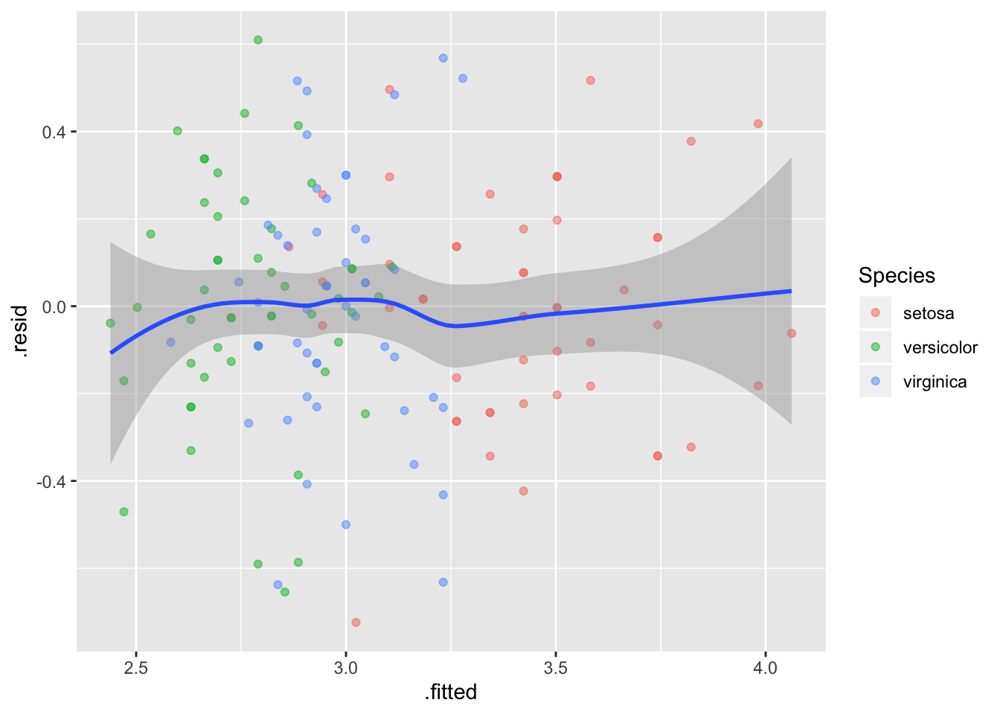
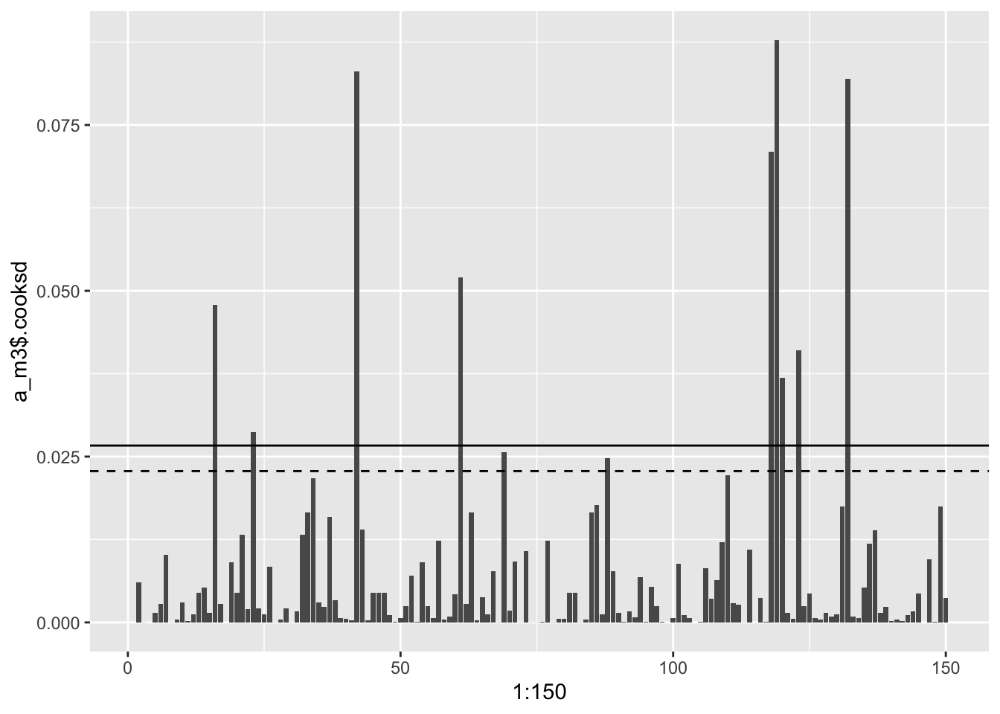

# Kaks lineaarse mudeli laiendust

## Mitme sõltumatu prediktoriga mudel {-}

Esiteks vaatame mudelit, kus on mitu prediktorit x~1~, x~2~, ... x~n~, mis on additiivse mõjuga. See tähendab, et me liidame nende mõjud, mis omakorda tähendab, et me usume, et x~1~...x~n~ mõjud y-i väärtusele on üksteisest sõltumatud. Mudel on siis kujul 

$$y = a + b_1x_1~ + b_2x_2~ +~ ... +~ b_nx_n$$


> Mitme prediktoriga mudeli iga prediktori tõus (beta koefitsient) ütleb, mitme ühiku võrra ennustab mudel y muutumist juhul kui see prediktor muutub ühe ühiku võrra ja kõik teised prediktorid ei muutu üldse. 


Kui meie andmed on kolmedimensioonaalsed (me mõõdame igal mõõteobjektil kolme muutujat) ja me tahame ennnustada ühe muutuja väärtust kahe teise muutuja väärtuste põhjal (meil on 2 prediktorit), siis tuleb meie 3 parameetriga lineaarne regressioonimudel tasapinna kujul. 
Kui meil on 3 prediktoriga mudel, siis me liigume juba 4-mõõtmelisse ruumi.


<div class="figure" style="text-align: center">

<p class="caption">(\#fig:unnamed-chunk-3)Regressioonitasand 3D andmetele. Siin on Sepal.Length ja Petal.Length prediktorid ja Sepal.Width ennustatav muutuja.</p>
</div>


Seda mudelit saab kaeda 2D ruumis, kui kollapseerida kolmas mõõde konstandile.


```r
library(tidyverse)
p <- ggplot(iris, aes(Sepal.Length, Sepal.Width, color = Species)) +
  geom_point() +
  xlim(4, 8) +
  scale_color_viridis(discrete = TRUE)
p + geom_abline(intercept = coef(m2)[1], slope = coef(m2)[2]) +
  labs(title = deparse(formula(m2)))
m1 <- lm(Sepal.Width ~ Sepal.Length, data = iris)
p + geom_abline(intercept = coef(m1)[1], slope = coef(m1)[2]) +
  labs(title = deparse(formula(m1)))
```

<div class="figure" style="text-align: center">

<p class="caption">(\#fig:lin2d)2D-le kollapseeritud graafiline kujutus 3D andmete põhjal fititud mudelist. Muutuja Petal.Length on kollapseeritud konstandile.</p>
</div>

Siin on regressioonijoon hoopis teises kohas, kui lihtsas ühe prediktoriga mudelis.

Nõnda võrdleme kahe mudeli koefitsiente.


```r
coef(m1)
#>  (Intercept) Sepal.Length 
#>       3.4189      -0.0619
coef(m2)
#>  (Intercept) Sepal.Length Petal.Length 
#>        1.038        0.561       -0.335
```

Nagu näha, mudeli m2 b_1 koefitsient erineb oluliselt mudeli m1 vastavast koefitsiendist.

Kumb mudel on siis parem? 
AIC-i järgi on m2 kõvasti parem, kui m1, lisakoefitsendi (Petal.Length) kaasamisel mudelisse paranes oluliselt selle ennustusvõime.

```r
AIC(m1, m2)
#>    df   AIC
#> m1  3 179.5
#> m2  4  92.1
```

**Ennustused sõltumatute prediktoritega mudelist**

Siin on idee kasutada fititud mudeli struktuuri enustamaks y keskmisi väärtusi erinevatel $x_1$ ja $x_2$ väärtustel. 
Kuna mudel on fititud, on parameetrite väärtused fikseeritud. 


```r
## New sepal length values
Sepal_length <- seq(min(iris$Sepal.Length), max(iris$Sepal.Length), length.out = 10)
## Keep new petal length constant
Petal_length <- mean(iris$Petal.Length)
## Extract model coeficents
a <- coef(m2)[1]
b1 <- coef(m2)[2]
b2 <- coef(m2)[3]
## Predict new sepal width values
Sepal_width_predicted <- a + b1 * Sepal_length + b2 * Petal_length
```


```r
plot(Sepal_width_predicted ~ Sepal_length, type = "b", ylim = c(0, 5), col = "red")
# prediction from the single predictor model
abline(c(coef(m1)[1], coef(m1)[2]), lty = "dashed")
```

<div class="figure" style="text-align: center">

<p class="caption">(\#fig:unnamed-chunk-7)Ennustatud y väärtused erinevatel x1 ja x2 väärtustel, punane joon. Katkendjoon, ühe prediktoriga mudeli ennustus.</p>
</div>

Nüüd joonistame 3D pildi olukorrast, kus nii $x_1$ kui $x_2$ omandavad rea väärtusi. Mudeli ennustus on ikkagi sirge kujul -- mis sest, et 3D ruumis.


```r
Petal_length <- seq(min(iris$Petal.Length), max(iris$Petal.Length), length.out = 10)
Sepal_width <- a + b1 * Sepal_length + b2 * Petal_length
dfr <- data_frame(Sepal_width, Sepal_length, Petal_length)
with(dfr, scatterplot3d(Sepal_length, Petal_length, Sepal_width, col.axis = "blue", col.grid = "lightblue", type = "l", lwd = 2))
```

<div class="figure" style="text-align: center">

<p class="caption">(\#fig:unnamed-chunk-8)kahe prediktoriga mudeli ennustus 3D ruumis.</p>
</div>

## Interaktsioonimudel {-}

Interaktsioonimudelis sõltub ühe prediktori mõju sõltub teise prediktori väärtusest:

$$y = a + b_1x_1 + b_2x_2 + b_3x_1x_2$$

Interaktsioonimudeli koefitsientide tõlgendamine on keerulisem. 
b_1 on otse tõlgendatav ainult siis, kui x_2 = 0 (ja b_2 ainult siis, kui x_1 = 0).
Edaspidi õpime selliseid mudeleid graafiliselt tõlgendama. 
Mudeli koefitsientide otse tõlgendamine ei ole siin sageli perspektiivikas.

> Interaktsioonimudelis sõltub x_1 mõju tugevus y-le x_2 väärtusest. Selle sõltuvuse määra kirjeldab b_3 (x_1 ja x_2 interaktsiooni tugevus). Samamoodi ja sümmeetriliselt erineb ka x_2 mõju erinevatel x_1 väärtustel. Ainult siis, kui x_2 = 0, ennustab x_1 tõus 1 ühiku võrra y muutust b_1 ühiku võrra.

Interaktsioonimudeli 2D avaldus on kurvatuuriga tasapind, kusjuures kurvatuuri määrab b_3. 

Interaktsiooniga mudel on AIC-i järgi pisut vähem eelistatud võrreldes m2-ga. 
Seega, eriti lihtsuse huvides, eelistame m2-e.

```r
m3 <- lm(Sepal.Width ~ Sepal.Length + Petal.Length + Sepal.Length * Petal.Length, data = iris)
AIC(m1, m2, m3)
#>    df   AIC
#> m1  3 179.5
#> m2  4  92.1
#> m3  5  93.4
```


**Ennustused interaktsioonimudelist**  

Kõigepealt anname rea väärtusi x_1-le ja hoiame x_2 konstantsena. 


```r
Petal_length <-  mean(iris$Petal.Length)
a <- coef(m3)[1]
b1 <- coef(m3)[2]
b2 <- coef(m3)[3]
b3 <- coef(m3)[4]
Sepal_width <- a + b1 * Sepal_length + b2 * Petal_length + b3 * Sepal_length * Petal_length
plot(Sepal_width ~ Sepal_length, type = "l", ylim = c(2, 6))
abline(m2, lty = "dashed")
#> Warning in abline(m2, lty = "dashed"): only using the first two of 3
#> regression coefficients
```

<div class="figure" style="text-align: center">

<p class="caption">(\#fig:unnamed-chunk-10)Ennustus interaktsioonimudelist, kus x1 on antud rida väärtusi ja x2 hoitakse konstantsena.</p>
</div>

Tulemuseks on sirge, mis on paraleelne ilma interaktsioonita mudeli ennustusele (katkendjoon)


Nagu näha, korrutamistehe viib selleni, et interaktsioonimudeli tõus erineb ilma interaktsioonita mudeli tõusust. 

Kui aga interaktsioonimudel plottida välja 3D-s üle paljude x_1 ja x_2 väärtuste, saame me regressioonikurvi (mitte sirge), kus b_3 annab kurvatuuri.


```r
Petal_length <-  seq(min(iris$Petal.Length), 
                     max(iris$Petal.Length), 
                     length.out = 100)
a <- coef(m3)[1]
b1 <- coef(m3)[2]
b2 <- coef(m3)[3]
b3 <- coef(m3)[4]

Sepal_width <-   a + b1 * Sepal_length + b2 * Petal_length +  b3 * Sepal_length * Petal_length
dfr <- data.frame(Sepal_width, Sepal_length, Petal_length)
with(dfr, scatterplot3d(Sepal_length, Petal_length, Sepal_width, pch = 20, col.axis = "blue", col.grid = "lightblue", lwd = 2))
```

<div class="figure" style="text-align: center">

<p class="caption">(\#fig:unnamed-chunk-11)Ennustused 3D interaktsioonimudelist üle paljude x1 ja x2 väärtuste.</p>
</div>

Vau! See on alles ennustus!


## Veamudel {-}
  
Eelpool kirjeldatud mudelid on deterministlikud --- nad ei sisalda hinnangut andmete varieeruvusele ennustuse ümber. Neid kutsutakse ka **protsessi mudeliteks** sest nad modelleerivad protsessi täpselt. Ehk, kui mudel ennustab, et 160 cm inimene kaalub keskmiselt 80 kg, siis protsessi mudel ei ütle, kui suurt pikkusest sõltumatut kaalude varieeruvust võime oodata 160 cm-ste inimeste hulgas. Selle hinnangu andmiseks tuleb mudelile lisada veel üks komponent, **veamudel** ehk veakomponent, mis sageli tuuakse sisse normaaljaotuse kujul. Veakomponent modelleerib üksikute inimeste kaalude varieeruvust (mitte keskmise kaalu varieeruvust) igal mõeldaval ja mittemõeldaval pikkusel. Tänu sellele ei ole mudeli ennustused enam deterministlikud, vaid tõenäosuslikud. 

  > Bioloogid, erinevalt füüsikutest, usuvad, et valimisisene andmete varieeruvus on
   tingitud pigem bioloogilisest varieeruvusest, kui mõõtmisveast. Aga loomulikult sisaldub selles ka mõõtmisviga. Lihtsuse huvides räägime
    edaspidi siiski veamudelist, selle asemel, et öelda "bioloogilise varieeruvuse ja veamudel".

Kuidas veakomponent lineaarsesse mudelisse sisse tuua? 
Ilma veakomponendita mudel: 


ilma veakomponendita mudel: 

$$y = a + bx$$


ennustab y-i keskväärtust erinevatel x-i väärtustel.

Veakomponent tähendab, et andmepunkti tasemel varieerub y-i väärtus ümber mudeli poolt ennustatud keskväärtuse. 
Lineaarsetes mudelites modelleeritakse seda varieeruvust normaaljaotusega (vahest ka studenti t jaotusega): 


$$y\sim dnorm(\mu,~\sigma)$$

kus $\mu$ (mu) on mudeli poolt ennustatud keskväärtus ja $\sigma$ (sigma) on mudeli poolt ennustatud standardhälve ehk varieeruvus andmepunktide tasemel. 
Tilde $\sim$ tähistab seose tõenäosuslikkust. 
Veamudelis on keskväärtuse ehk mu ennustus endiselt deterministlik ja sigma töötab originaalsel andmetasemel, mitte keskväärtuste tasemel. 
See võimaldab protsessi mudeli veamudelisse sisse kirjutada lihtsalt mu ümber defineerides:

$$\mu = a + bx$$ 

mis tähendab, et

$$y \sim dnorm(a + b\times x, ~\sigma)$$


See ongi sirge mudel koos veakomponendiga. Seega on sellel lineaarsel regressioonimudelil kolm parameetrit: intercept a, tõus b ja "veaparameeter" $\sigma$. 
Sellist mudelit on mõistlik fittida Bayesi teoreemi abil. 
Bayesi meetodiga fititud mudel, mida kutsutakse posteerioriks, näitab, millised kombinatsioonid nendest kolmest parameetrist usutavalt koos esinevad, ja millised mitte. 
Seega on fititud 3 parameetriga bayesi mudel 3-dimensionaalne tõenäosusjaotus (3D posteerior). 
Muidugi saame ka ükshaaval välja plottida kolm 1D posteeriori, millest igaüks iseloomustab üht parameetrit ning on kollapseeritud üle kahe ülejäänud parameetri. 
[Edaspidi](pidev) õpime selliste mudelitega töötama. 


> Kõik statistilised mudelid on tõenäosusmudelid ning sisaldavad veakomponenti.  


Muide, kõik veamudelid, millega me edaspidi töötame, modelleerivad igale x-i väärtusele (kaalule) sama suure y-i suunalise varieeruvuse (pikkuste sd). 
Suurem osa statistikast kasutab eeldusi, mida keegi päriselt tõe pähe ei võta, aga millega on arvutuslikus mõttes lihtsam elada.

### Enimkasutatud veamudel on normaaljaotus {-}

Alustuseks simuleerime lihtsate vahenditega looduslikku protsessi, mille tulemusel tekib normaaljaotus.  
Oletame, et bakteri kasvukiirust mõjutavad 12 geeni, mille mõjud võivad olla väga erineva tugevusega, kuid mille mõjude suurused ei sõltu üksteisest. 
Seega nende 12 geeni mõjud kasvukiirusele liituvad.
Järgnevas koodis võtame 12 juhuslikku arvu 1 ja 100 vahel (kasutades `runif()` funktsiooni). 
Need 12 arvu näitavad 12 erineva geeni individuaalsete mõjude suurusi bakteritüve kasvukiirusele. 
Meil on seega kuni 100-kordsed erinevused erinevate geenide mõjude suuruste vahel. 
Seejärel liidame need 12 arvu. 
Nüüd võtame uue 12-se valimi ja kordame eelnevat. 
Me teeme seda 10 000 korda järjest ja plotime saadud 10 000 arvu (10 000 liitmistehte tulemust) tihedusfuntksioonina. 


```r
kasv <- replicate(10000, sum(runif(12, 1, 100))) 
p <- ggplot(tibble(kasv), aes(kasv)) + geom_density()
p
```

<div class="figure" style="text-align: center">

<p class="caption">(\#fig:unnamed-chunk-12)Normaaljaotus tekib sõltumatutest efektidest. Kümne tuhande N = 12 suuruse juhuvalimi summa tihedusdiagramm.</p>
</div>

Selles näites võrdub iga andmepunkt 10 000st ühe bakteritüve kasvukiiruse mõõtmisega. Seega, antud eelduste korral on bakteritüvede kasvukiirused normaaljaotusega.

Nüüd vaatame, mis juhtub, kui 12 geeni mõjud ei ole üksteisest sõltumatud. Kui 12 geeni on omavahel vastasmõjudes, siis nende geenide mõjud korrutuvad, mitte ei liitu. (Korrutamine pole ainus viis, kuidas vastasmõjusid modeleerida, küll aga kõige levinum.)
Kõigepealt vaatleme juhtu, kus 12 geeni on kõik väikeste mõjudega ning seega mitte ühegi geeni mõju ei domineeri teiste üle.
Seekord genreerime 12 juhuslikku arvu 1 ja 1.1 vahel. 
Siin tähendab arv 1.1 kasvu tõusu 10% võrra. 
Seejärel korrutame need 12 arvu, misjärel kordame eelnevat 10 000 korda. 


```r
kasv <- replicate(10000, prod(runif(12, 1, 1.1))) 
p %+% tibble(kasv)
```

<div class="figure" style="text-align: center">

<p class="caption">(\#fig:unnamed-chunk-13)Normaaljaotus tekib väikestest sõltuvatest efektidest. Kümne tuhande N = 12 suuruse juhuvalimi korrutiste tihedusdiagramm. Ühegi geeni mõju ei domineeri teiste üle.</p>
</div>

Tulemuseks on jällegi normaaljaotus.
Selles näites olid üksikud interakteeruvad geenid ükshaaval väikeste mõjudega ja ühegi geeni mõju ei domineerinud teiste üle. 
Mis juhtub, kui mõnel geenil on kuni 2 korda suurem mõju kui teisel?


```r
kasv <- replicate(10000, prod(runif(12, 1, 2)))
p %+% tibble(kasv)
```

<div class="figure" style="text-align: center">

<p class="caption">(\#fig:unnamed-chunk-14)Lognormaaljaotus tekib suurematest sõltuvatest efektidest. Kümne tuhande N = 12 suuruse juhuvalimi korrutiste tihedusdiagramm. Mõnel geenil on kuni 2 korda suurem mõju kui teisel.</p>
</div>

Nüüd on tulemuseks log-normaaljaotus. Mis teie arvate, kas teie poolt uuritavat tunnust mõjutavad faktorid, mis omavahel ei interakteeru või kui interakteeruvad, on kõik ühtlaselt väikeste efektidega? 
Või on tegu vastasmõjudes olevate faktoritega, millest osad on palju suuremate mõjudega, kui teised? 
Ühel juhul eelistate te normaaljaotust, teisel juhul peate õppima töötama ka lognormaaljaotusega.

Kui me vaatame samu andmeid logaritmilises skaalas, avastame, et need andmed on normaaljaotusega. 
See ongi andmete logaritmimise mõte.


```r
kasv <- replicate(10000, log10(prod(runif(12, 1, 2))))
p %+% tibble(kasv) + labs(x = "kasv, log10")
```

<div class="figure" style="text-align: center">

<p class="caption">(\#fig:unnamed-chunk-15)Logaritmilises skaalas lognormaalsed efektid on normaaljaotusega. Kümne tuhande N = 12 suuruse juhuvalimi korrutiste tihedusdiagramm. Mõnel geenil on kuni 2 korda suurem mõju kui teisel.</p>
</div>

### Normaaljaotuse mudel väikestel valimitel {-}

Oletame, et meil on kolm andmepunkti ning me usume, et need andmed on juhuslikult tõmmatud normaaljaotusest või sellele lähedasest jaotusest. Normaaljaotuse mudelit kasutades me sisuliselt deklareerime, et me usume, et kui me oleksime olnud vähem laisad ja 3 mõõtmise asemel sooritanuks 3000, siis need mõõtmised sobituksid piisavalt hästi meie 3 väärtuse peal fititud normaaljaotusega. Seega, me usume, et omades 3 andmepunkti me teame juba umbkaudu, millised tulemused me oleksime saanud korjates näiteks 3 miljonit andmepunkti. Oma mudelist võime simuleerida ükskõik kui palju andmepunkte. 

Aga pidage meeles, et selle mudeli fittimiseks kasutame me ainult neid andmeid, mis meil päriselt on --- ja kui meil on ainult 3 andmepunkti, on tõenäoline, et fititud mudel ei kajasta hästi tegelikkust. 

> Halvad andmed ei anna kunagi head tulemust. 

Eelnev ei kehti Bayesi mudelite kohta, mis toovad priorite kaudu sisse lisainfot, mis ei kajastu valimiandmetes ja võib analüüsi päästa.

Kuidas panna skeptik uskuma, et statistilised meetodid töötavad halvasti väikestel valimitel? Siin aitab simulatsioon, kus me tõmbame 3-se valimi etteantud populatsioonist ning üritame selle valimi põhjal ennustada selleasama populatsiooni struktuuri. Kuna tegemist on simulatsiooniga, teame täpselt, et populatsioon, kust me tõmbame oma kolmese valimi, on normaaljaotusega, et tema keskväärtus = 0 ja et tema sd = 1. 
Me fitime oma valimi andmetega 2 erinevat mudelit: normaaljaotuse ja Studenti t jaotuse. 

<div class="figure" style="text-align: center">

<p class="caption">(\#fig:unnamed-chunk-16)Juhuvalim normaaljaotusest, mille keskmine = 0 ja sd = 1 (n=3; andmepunktid on näidatud mustade munadena). Sinine joon - populatsioon, millest tõmmati valim; punane joon - normaaljaotuse mudel, mis on fititud valimi andmetel; must joon - Studenti t jaotuse mudel, mis on fititud samade andmetega. Mustad punktid, valim. Katkendjoon, populatsiooni keskmine, millest valim tõmmati.</p>
</div>

Siin saame hinnata mudelite fitte jumala positsioonilt, võrreldes fititud mudelite jaotusi "tõese" sinise jaotusega.
Mõlemad mudelid on süstemaatiliselt nihutatud väiksemate väärtuste poole ja alahindavad varieeruvust. t jaotuse mudel on oodatult paksemate sabadega ja ennustab 0-st kaugele palju rohkem väärtusi kui normaaljaotuse mudel. Kuna me teame, et populatsioon on normaaljaotusega, pole väga üllatav, et t jaotus modeleerib seda halvemini kui normaaljaotus. 

Igal juhul, mõni teine juhuvalim annaks meile hoopis teistsugused mudelid, mis rohkem või vähem erinevad algsest populatsioonist.

Mis juhtub kui me kasutame oma normaaljaotuse mudelit uute andmete simuleerimiseks? Kui lähedased on need simuleeritud andmed populatsiooni andmetega ja kui lähedased valimi andmetega, millega me normaaljaotuse mudeli fittisime?


```r
# tõmbame 3 juhuslikku arvu normaalhaotusest, mille keskväärtus = 0 ja sd = 1.
dfr <- tibble(sample_data = rnorm(3)) 
dfr <- summarise_at(dfr, "sample_data", c("mean", "sd"))
dfr
#> # A tibble: 1 x 2
#>     mean    sd
#>    <dbl> <dbl>
#> 1 0.0654 0.808
# simuleerime 1000 uut andmepunkti fititud mudelist
simulated_data <- rnorm(1000, dfr$mean, dfr$sd)
# arvutame simuleeritud andmete keskmise ja sd ning joonistame neist histogrammi
ggplot(tibble(simulated_data), aes(simulated_data)) +
  geom_histogram(bins = 15)
```

<div class="figure" style="text-align: center">

<p class="caption">(\#fig:unnamed-chunk-17)Kasutame fititud mudeleid uute andmete simuleerimiseks.</p>
</div>

Nagu näha, on uute (simuleeritud) andmete keskväärtus ja SD väga sarnased algsete andmete omale, mida kasutasime mudeli fittimisel. 
Kahjuks ei ole need aga kaugeltki nii sarnased algsele jaotusele, mille kuju me püüame oma andmete ja mudeli pealt ennustada. 
Seega on meie mudel üle-fittitud, mis tähendab, et ta kajastab liigselt neid valimi aspekte, mis ei peegelda algse populatsiooni omadusi. 
Loomulikult ei vasta ükski mudel päriselt tegelikkusele. 
Küsimus on pigem selles, kas mõni meie mudelitest on piisavalt hea, et olla kasulik.
Vastus sellele sõltub, milleks plaanime oma mudelit kasutada.


```r
mean(simulated_data > 0) 
#> [1] 0.535
mean(simulated_data > 1)
#> [1] 0.116
```
Kui populatsiooniväärtustest on 50% suuremad kui 0, siis mudeli järgi vaevalt 32%. Kui populatsiooniväärtustest on 16% suuremad kui 1, siis mudeli järgi vaevalt 4%.
See illustreerib hästi mudeli kvaliteeti.


```r
library(brms)
sim_t <- rstudent_t(1000, 2, dfr$mean, dfr$sd)
mean(sim_t > 0)
#> [1] 0.516
mean(sim_t > 1)
#> [1] 0.189
```
Samad ennustused t jaotusest on isegi paremad! Aga kumb on ikkagi parem mudel populatsioonile?


### Normaaljaotuse ja lognormaaljaotuse erilisus {-}

Normaaljaotus ja lognormaaljaotus on erilised sest 

(1) kesksest piirteoreemist (*central limit theorem*) tuleneb, et olgu teie valim ükskõik millise jaotusega, paljudest valimitest arvutatud **aritmeetilised keskmised** on alati enam-vähem normaaljaotusega. See kehtib enamuse andmejaotuste korral, kui n>30. Selle matemaatilise tõe peegeldus füüsikalisse maailma on "elementaarsete vigade hüpotees", mille kohaselt paljude väikeste üksteisest sõltumatute juhuslike efektide (vigade) summa annab tulemuseks normaaljaotuse. 
Paraku enamus bioloogilisi mõõtmisi annavad tulemuseks eranditult mitte-negatiivseid väärtusi. Sageli on selliste väärtuste jaotused ebasümmeetrilised (v.a. siis, kui cv = sd/mean on väike), ja kui nii, siis on meil sageli tegu lognormaaljaotusega, mis tekkib log-normaalsete muutujate korrutamisest. 
Siit tuleb Keskne piirteoreem 2, mille kohaselt suvalise jaotusega muutujate **geomeetrilised keskmised** on enam-vähem lognormaaljaotusega, ning elementaarsete vigade hüpotees 2: Kui juhuslik varieeruvus tekib paljude juhuslike efektide korrutamisel, on tulemuseks lognormaaljaotus. Lognormaaljaotusega väärtuste logaritmimine annab normaaljaotuse. 

(2) Nii normaal- kui lognormaaljaotus on maksimaalse entroopiaga jaotused. Entroopiat vaadeldakse siin informatsiooni & müra kaudu --- maksimaalse entroopiaga süsteem sisaldab maksimaalselt müra ja minimaalselt informatsiooni (Shannoni informatsiooniteooria). See tähendab, et väljaspool oma parameetrite tuunitud väärtusi on normaal- ja lognormaaljaotused minimaalselt informatiivsed. Näiteks normaaljaotusel on kaks parameetrit, mu ja sigma (ehk keskmine ja standardhälve). Seega, andes normaaljaotusele ette keskväärtuse ja standardhälbe fikseerime üheselt jaotuse ehk mudeli kuju ja samas lisame sinna minimaalselt muud (sooviamtut) informatsiooni. Teised maksimaalse entroopiaga jaotused on eksponentsiaalne jaotus, binoomjaotus ja poissoni jaotus. Maksimaalse entroopiaga jaotused sobivad hästi Bayesi prioriteks sest me suudame kontrollida, millist informatsiooni me neisse surume.
