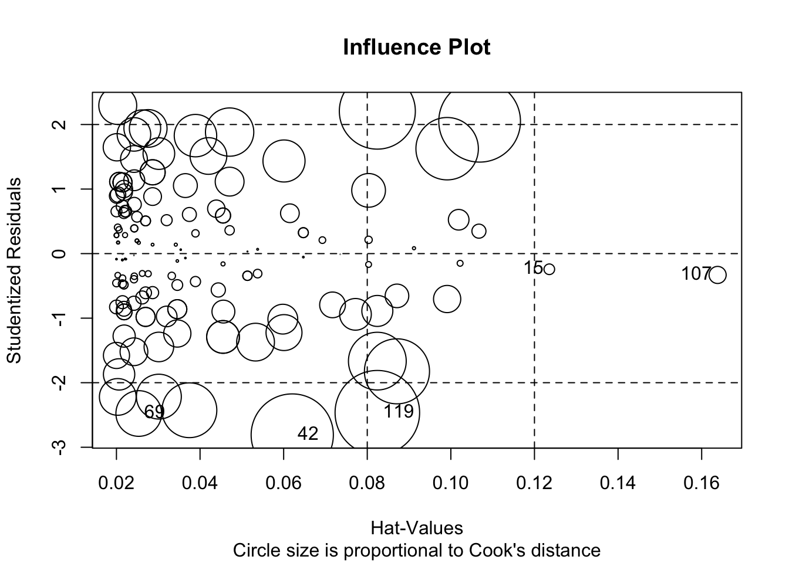
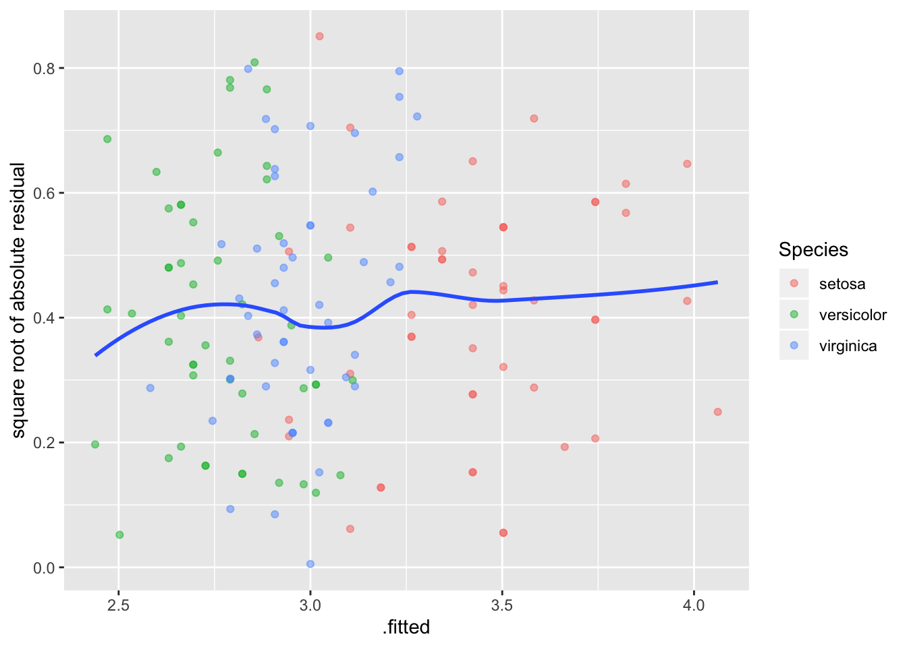
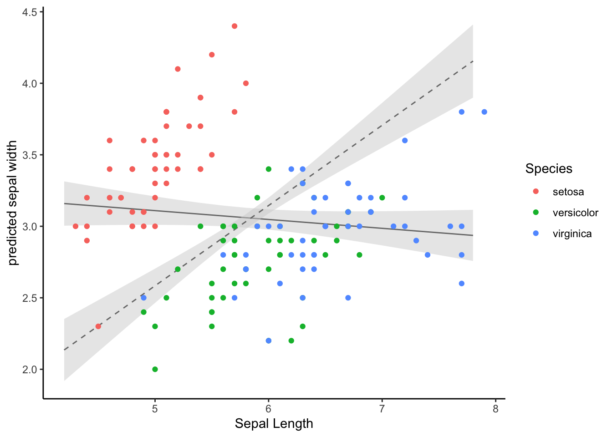

# Kaks lineaarse mudeli laiendust


```r
library(tidyverse)
library(scatterplot3d)
library(viridis)
library(ggeffects)
library(broom)
```


## Mitme sõltumatu prediktoriga mudel {-}


Esiteks vaatame mudelit, kus on mitu prediktorit $x_1$, $x_2$, ... $x_n$, mis on aditiivse mõjuga.
See tähendab, et me liidame nende mõjud, mis omakorda tähendab, et me usume, et $x_1$ ... $x_n$ mõjud y-i väärtusele on üksteisest sõltumatud. 
Mudel on siis kujul 

$$y = a + b_1x_1~ + b_2x_2~ +~ ... +~ b_nx_n$$

> Mitme prediktoriga mudeli iga prediktori tõus (beta koefitsient) ütleb, mitme ühiku võrra ennustab mudel y muutumist juhul kui see prediktor muutub ühe ühiku võrra ja kõik teised prediktorid ei muutu üldse (Yule, 1899). 


Kui meie andmed on kolmedimensionaalsed (me mõõdame igal mõõteobjektil kolme muutujat) ja me tahame ennnustada ühe muutuja väärtust kahe teise muutuja väärtuste põhjal (meil on kaks prediktorit), siis tuleb meie kolme parameetriga lineaarne regressioonimudel tasapinna kujul. 
Kui meil on kolme prediktoriga mudel, siis me liigume juba neljamõõtmelisse ruumi.


(ref:regressioonitasand) Regressioonitasand 3D andmetele. Kahe prediktoriga mudel, kus Sepal.Length ja Petal.Length on prediktorid ja Sepal.Width ennustatav muutuja.

<div class="figure" style="text-align: center">

<p class="caption">(\#fig:regressioonitasand)(ref:regressioonitasand)</p>
</div>


Seda mudelit saab kaeda 2D ruumis, kui kollapseerida kolmas mõõde konstandile.

(ref:lin2d) 2D-le kollapseeritud graafiline kujutus 3D andmete põhjal fititud mudelist. Vasemal, muutuja Petal.Length on kollapseeritud konstandile. Siin on regressioonijoon hoopis teises kohas, kui lihtsas ühe prediktoriga mudelis (paremal).


```r
p <- ggplot(iris, aes(Sepal.Length, Sepal.Width, color = Species)) +
  geom_point() +
  xlim(4, 8) +
  scale_color_viridis(discrete = TRUE) +
  theme(title = element_text(size = 8))
p1 <- p + geom_abline(intercept = coef(m2)[1], slope = coef(m2)[2]) +
  labs(title = deparse(formula(m2)))
m1 <- lm(Sepal.Width ~ Sepal.Length, data = iris)
p2 <- p + geom_abline(intercept = coef(m1)[1], slope = coef(m1)[2]) +
  labs(title = deparse(formula(m1)))
devtools::source_gist("8b4d6ab6a333ef1cd14e8067c3badbae", filename = "grid_arrange_shared_legend.R")
grid_arrange_shared_legend(p1, p2)
```

<div class="figure" style="text-align: center">

<p class="caption">(\#fig:lin2d)(ref:lin2d)</p>
</div>


Võrreldes mudelite m1 (üks prediktor) ja m2 (kaks prediktorit) Sepal.Length ($b_1$) koefitsienti on näha, et need erinevad oluliselt.


```r
coef(m1)
#>  (Intercept) Sepal.Length 
#>       3.4189      -0.0619
coef(m2)
#>  (Intercept) Sepal.Length Petal.Length 
#>        1.038        0.561       -0.335
```

Kumb mudel on siis parem? 
AIC-i järgi on m2 kõvasti parem kui m1, lisakoefitsendi (Petal.Length) kaasamisel mudelisse paranes oluliselt selle ennustusvõime.

```r
AIC(m1, m2)
#>    df   AIC
#> m1  3 179.5
#> m2  4  92.1
```

**Ennustused sõltumatute prediktoritega mudelist**

Siin on idee kasutada fititud mudeli struktuuri ennustamaks y keskmisi väärtusi erinevatel $x_1$ ja $x_2$ väärtustel.
Kuna mudel on fititud, on parameetrite väärtused fikseeritud. 


```r
## New sepal length values
Sepal_length <- seq(min(iris$Sepal.Length), max(iris$Sepal.Length), length.out = 10)
## Keep new petal length constant
Petal_length <- mean(iris$Petal.Length)
## Extract model coeficents
a <- coef(m2)["(Intercept)"]
b1 <- coef(m2)["Sepal.Length"]
b2 <- coef(m2)["Petal.Length"]
## Predict new sepal width values
Sepal_width_predicted <- a + b1 * Sepal_length + b2 * Petal_length
```

(ref:yksversuskaks) Ennustatud y väärtused erinevatel $x_1$ väärtustel kui $x_2$ on konstantne, punane joon. Katkendjoon, ühe prediktoriga mudeli ennustus.


```r
plot(Sepal_width_predicted ~ Sepal_length, type = "b", ylim = c(0, 5), col = "red")
# Prediction from the single predictor model
abline(m1, lty = "dashed")
```

<div class="figure" style="text-align: center">

<p class="caption">(\#fig:yksversuskaks)(ref:yksversuskaks)</p>
</div>

Nüüd joonistame 3D pildi olukorrast, kus nii x~1~ kui x~2~ omandavad rea väärtusi. Mudeli ennustus on ikkagi sirge kujul -- mis sest, et 3D ruumis.

(ref:kaksprediktorit) Kahe prediktoriga mudeli ennustus 3D ruumis.

<div class="figure" style="text-align: center">

<p class="caption">(\#fig:kaksprediktorit)(ref:kaksprediktorit)</p>
</div>

## Interaktsioonimudel {-}

Interaktsioonimudelis sõltub ühe prediktori mõju teise prediktori väärtusest:

$$y = a + b_1x_1 + b_2x_2 + b_3x_1x_2$$

Sageli on nii, et prediktoreid, mille mõju y-le on suur, tasub mudeldada ka interaktsioonimudelis (näiteks suitsetamise mõju vähimudelites kipub olema interaktsiooniga). 

Interaktsioonimudeli koefitsientide tõlgendamine on keerulisem. 
b~1~ on otse tõlgendatav ainult siis, kui x~2~ = 0 (ja b~2~ ainult siis, kui x~1~ = 0).
Samas, kui interaktsioonimudel fititakse standardiseeritud x-muutujate peal, mille keskväärtus = 0, siis muutub koefitsientide tõlgendamine lihtsamaks - b~1~ tõlgendame x~2~ keskväärtusel (ja vastupidi, b~2~ x~1~ keskväärtusel).

Edaspidi õpime selliseid mudeleid graafiliselt tõlgendama, kuna koefitsientide otse tõlgendamine ei ole siin sageli perspektiivikas.

> Interaktsioonimudelis sõltub x~1~ mõju tugevus y-le x~2~ väärtusest. Selle sõltuvuse määra kirjeldab b~3~ (x~1~ ja x~2~ interaktsiooni tugevus). Samamoodi ja sümmeetriliselt erineb ka x~2~ mõju erinevatel x~1~ väärtustel. Ainult siis, kui x~2~ = 0, ennustab x~1~ tõus 1 ühiku võrra y muutust b~1~ ühiku võrra.

Interaktsioonimudeli 2D avaldus on kurvatuuriga tasapind, kusjuures kurvatuuri määrab b~3~. 

Interaktsiooniga mudel on AIC-i järgi pisut vähem eelistatud võrreldes kahe prediktoriga mudeliga m2. 
Seega, eriti lihtsuse huvides, eelistame m2-e.

```r
m3 <- lm(Sepal.Width ~ Sepal.Length + Petal.Length + Sepal.Length * Petal.Length, data = iris)
AIC(m1, m2, m3)
#>    df   AIC
#> m1  3 179.5
#> m2  4  92.1
#> m3  5  93.4
```


**Ennustused interaktsioonimudelist**  

Kõigepealt anname rea väärtusi x~1~-le ja hoiame x~2~ konstantsena. 

(ref:ennustus-interaktsioonimudelist) Ennustus interaktsioonimudelist, kus x~1~ (Sepal_Length) on antud rida väärtusi ja x~2~ (Petal_length) hoitakse konstantsena (pidevjoon). Interaktsioonimudeli regressioonijoon on paraleelne ilma interaktsioonita mudeli ennustusele (katkendjoon).


```r
Petal_length <-  mean(iris$Petal.Length)
a <- coef(m3)["(Intercept)"]
b1 <- coef(m3)["Sepal.Length"]
b2 <- coef(m3)["Petal.Length"]
b3 <- coef(m3)["Sepal.Length:Petal.Length"]
Sepal_width_predicted <- a + b1 * Sepal_length + b2 * Petal_length + b3 * Sepal_length * Petal_length
plot(Sepal_width_predicted ~ Sepal_length, type = "l", ylim = c(2, 6))
abline(coef(m2)[c("(Intercept)", "Sepal.Length")], lty = "dashed")
```

<div class="figure" style="text-align: center">

<p class="caption">(\#fig:ennustus-interaktsioonimudelist)(ref:ennustus-interaktsioonimudelist)</p>
</div>

Nagu näha viib korrutamistehe selleni, et interaktsioonimudeli tõus erineb ilma interaktsioonita mudeli tõusust. 

Kui aga interaktsioonimudel plottida välja 3D-s üle paljude x~1~ ja x~2~ väärtuste, saame me regressioonikurvi (mitte sirge), kus b~3~ annab kurvatuuri.

(ref:ennustused3d-interaktsioonimudelist) Ennustused 3D interaktsioonimudelist üle paljude x~1~ (Sepal_Length) ja x~2~ (Petal_length) väärtuste.

<div class="figure" style="text-align: center">

<p class="caption">(\#fig:ennustused3d-interaktsioonimudelist)(ref:ennustused3d-interaktsioonimudelist)</p>
</div>

Vau! See on alles ennustus!

# Vähimruutude meetodiga fititud mudelite töövoog -- lm()

Kuna lm() funktsiooniga ja bayesi meetodil fititud mudeliobjektidega töötamine on mõnevõrra erinev, õpetame seda eraldi. Siinkohal anname põhilise töövoo lm() mudelobjektide inspekteerimiseks.

Töötame m3 mudeliobjektiga, mis on interaktsioonimudel: Sepal.Width ~ Sepal.Length * Species


```r
library(ggeffects)
m3 <- lm(Sepal.Width ~ Sepal.Length * Species, data = iris)
```


## 1. vaatame mudeli koefitsiente


```r
tidy(m3)
#> # A tibble: 6 x 5
#>   term                           estimate std.error statistic  p.value
#>   <chr>                             <dbl>     <dbl>     <dbl>    <dbl>
#> 1 (Intercept)                      -0.569     0.554     -1.03 3.06e- 1
#> 2 Sepal.Length                      0.799     0.110      7.23 2.55e-11
#> 3 Speciesversicolor                 1.44      0.713      2.02 4.51e- 2
#> 4 Speciesvirginica                  2.02      0.686      2.94 3.85e- 3
#> 5 Sepal.Length:Speciesversicolor   -0.479     0.134     -3.58 4.65e- 4
#> 6 Sepal.Length:Speciesvirginica    -0.567     0.126     -4.49 1.45e- 5
```

Interaktsioonimudeli koefitsientide jõllitamine on sageli tühi töö ja vaimu närimine. Õnneks on meil muid meeotodeid, kuidas lm() mudelitega töötada.

Võrdluseks - nii fitime eraldi mudeli igale irise liigile. Tulemus on tegelikult identne interaktsioonimudeliga kategoorilisele muutujale (Species), aga koefitsiendid on otse tõlgendatavad. Samas, interaktsioonimudelit saab fittida ka pidevale muutujale!


```r
iris %>% split(.$Species) %>% 
  map(~ lm(Sepal.Width ~ Sepal.Length, data = .)) %>% 
  map(summary) %>% 
  map_dfr(~ broom::tidy(.), .id = "Species")
#> # A tibble: 6 x 6
#>   Species    term         estimate std.error statistic  p.value
#>   <chr>      <chr>           <dbl>     <dbl>     <dbl>    <dbl>
#> 1 setosa     (Intercept)    -0.569    0.522      -1.09 2.81e- 1
#> 2 setosa     Sepal.Length    0.799    0.104       7.68 6.71e-10
#> 3 versicolor (Intercept)     0.872    0.445       1.96 5.56e- 2
#> 4 versicolor Sepal.Length    0.320    0.0746      4.28 8.77e- 5
#> 5 virginica  (Intercept)     1.45     0.431       3.36 1.55e- 3
#> 6 virginica  Sepal.Length    0.232    0.0651      3.56 8.43e- 4
```

Adjusteeritud r2 tasub eraldi üle vaadata.

```r
summary(m3)$adj.r.squared
#> [1] 0.61
```

0.61 tähendab, et mudel suudab seletada mitte rohkem kui 61% y-muutuja (Sepal.Width) varieeruvusest. 

## 2. Testime mudeli eeldusi

Nii saab fititud väärtused (.fitted), residuaalid (.resid), fittitud väätruste standardvead (.se.fit). Residuaal = Y data value - fitted value. Seega positiivne residuaal näitab, et mudeli ennustus keskmisele y väärtusele mingil x-muutujate väärtusel on madalam kui juhutb olema tegelik y-i andmepunkti väärtus. See võib olla tingitud y-muutuja normaalsest bioloogilisest varieeruvusest, aga ka sellest, et mudel ei kirjelda täiuslikult x-ide ja y tegelikku seost.


```r
(a_m3 <- augment(m3))
#> # A tibble: 150 x 10
#>   Sepal.Width Sepal.Length Species .fitted .se.fit   .resid   .hat .sigma
#> *       <dbl>        <dbl> <fct>     <dbl>   <dbl>    <dbl>  <dbl>  <dbl>
#> 1         3.5          5.1 setosa     3.50  0.0399 -0.00306 0.0215  0.273
#> 2         3            4.9 setosa     3.34  0.0403 -0.343   0.0218  0.272
#> 3         3.2          4.7 setosa     3.18  0.0512  0.0163  0.0354  0.273
#> 4         3.1          4.6 setosa     3.10  0.0591 -0.00380 0.0471  0.273
#> 5         3.6          5   setosa     3.42  0.0385  0.177   0.0200  0.273
#> 6         3.9          5.4 setosa     3.74  0.0581  0.157   0.0455  0.273
#> # ... with 144 more rows, and 2 more variables: .cooksd <dbl>,
#> #   .std.resid <dbl>
```

.hat >1 sugereerib high leverage andmepunkte 

.std.resid on studentiseeritud residuaal, mis on sd ühikutes (.resid/sd(.resid))

### Lineaarsus - residuaalid~fitted plot

Residuals vs fitted plot testib lineaarsuse eeldust - kui .resid punktid jaotuvad ühtlaselt nulli ümber, siis mudel püüab kinni kogu süstemaatilise varieeruvuse teie andmetest ja see mis üle jääb on juhuslik varieeruvus.

```r
ggplot(a_m3, aes(`.fitted`, `.resid`)) + 
  geom_point(aes(color=Species), alpha=0.5) + 
  geom_smooth()
```


### Cooki kaugus - outlierid

.cooksd on Cook-i kaugus, mis näitab võimalikke outliereid. rusikareeglina tähendab cooksd > 3 cooksd keskväärtust, et tegu võiks olla outlieriga. Teine võimalus on pidada igat punkti, mis on kõrgem kui 4/n, outlieriks. Kolmanadad arvavad jälle, et outlierina võiks vaadelda iga teistest väga erinevat väärtust, või et .cooksd > 1 v .cooksd > 0.5 on indikatsiooniks nn mõjukast väärtusest (influencial value).


```r
ggplot(data = NULL, aes(x = 1:150, y = a_m3$`.cooksd`)) + geom_col() + 
  geom_hline(yintercept = 4/150)+ 
  geom_hline(yintercept = 3*mean(a_m3$`.cooksd`), lty = 2)
```



### Mõjukuse plot

outlierid - studentideeritud residuaalid > 2 või < -2
hat > 1 - sugereerib high leverage andmepunkte 

```r
library(car)
influencePlot(m3, id.method="identify", main="Influence Plot",
              sub="Circle size is proportional to Cook's distance")
#>     StudRes    Hat   CookD
#> 15   -0.243 0.1236 0.00139
#> 42   -2.810 0.0621 0.08307
#> 69   -2.477 0.0253 0.02567
#> 107  -0.331 0.1638 0.00359
#> 119  -2.464 0.0824 0.08782
```


> Mõjukad punktid (Influential observations) omavad suurt mõju mudeli ennustustele. High Leverage andmepunktid on x-muutujate ekstreemsed punktid, mille lähedal ei ole n-mõõtmelises ruumis (kui teil on n x-muutujat) teisi punkte. Seetõttu läheb fititud mudel nende punktide lähedalt mõõda. Mõjukad punktid on tüüpiliselt ka high leverage punktid, kuid vastupidine ei kehti!

### Residuaalide normaalsus - qq plot

Kas residuaalid on normaaljaotusega?

```r
car::qqPlot(a_m3$`.std.resid`, distribution = "norm")
#> [1] 42 69
```


### Homoskedastilisus - Scale-location plot

Scale-location plot - homoskedastilisuse eeldust ehk seda, et varieeruvus ei sõltuks prediktormuutuja väärtusest. Y-teljel on ruutjuur studentiseeritud residuaalide absoluutväärtusest

```r
ggplot(a_m3, aes(`.fitted`, `.resid` %>% abs %>% sqrt)) + 
  geom_point(aes(color=Species), alpha=0.5) + 
  ylab("square root of absolute residual")+
  geom_smooth(se = FALSE)
```


## Residuaalid y ja x muutujate vastu

Kõigepealt residuaalid y-muutja vastu

```r
ggplot(a_m3, aes(Sepal.Width, `.std.resid`)) + geom_point(aes(color=Species)) + geom_hline(yintercept = 0, lty =2, color ="darkgrey") + 
  geom_smooth( se=F, color="black", size=0.5)
```



Mudel paistab süstemaatiliselt alahindama Sepal Width-i seal kus Sepal Length on kõrge, ja vastupidi. Horisontaalne punktiirjoon näitab, kus mudel vastab täpselt andmetele.

Studentiseeritud residuaalid sd ühikutes

Ja nüüd residuaalid x-muutuja vastu. 

```r
ggplot(a_m3, aes(Sepal.Length, `.std.resid`, color=Species)) + 
  geom_point() +
  geom_hline(yintercept = 0, lty =2, color ="darkgrey")+
  geom_smooth(se=F, color="black", size=0.5)
```


Ideaalsed residuaalid! 

## 3. Teeme mudeli põhjal ennustusi (marginal plots)

Me ennustame Y-i keskmisi väärtuseid etteantud X-i väärtustel.

ggpredict() ennustab y-muutuja väärtusi ühe x-muutuja väärtuste järgi, hoides kõiki teisi x-muutujaid konstantsena.

Kõigepealt võrdleme lihtsa 1 prediktoriga mudeli ennustust kahe prediktoriga mudeli ennustusega 

```r
lm1 <- lm(Sepal.Width ~ Sepal.Length, data = iris)
lm2 <- lm(Sepal.Width ~ Sepal.Length + Petal.Length, data = iris)

mydf <- ggpredict(lm1, terms = "Sepal.Length")
mydf2 <- ggpredict(lm2, terms = "Sepal.Length")

ggplot(mydf, aes(x, predicted)) + 
  geom_line() +
  geom_ribbon(data = mydf, aes(ymin = conf.low, ymax = conf.high), 
              alpha = 0.5, fill="lightgrey") +
  geom_line(data = mydf2, aes(x, predicted), lty=2)+
  geom_ribbon(data = mydf2, aes(ymin = conf.low, ymax = conf.high), 
              alpha = 0.5, fill="lightgrey") +
  geom_point(data=iris, aes(Sepal.Length, Sepal.Width, color=Species)) + 
  xlab("Sepal Length") + 
  ylab("predicted sepal width")+
  theme_classic()
```


>terms argument võtab kuni 3 muutujat, neist 2 peavad olema faktormuutujad ja 3 muutuja korral tekib tabelisse veerg nimega facet, mille abil saab tulemused facet_wrap()-ga välja plottida.


```r
mydf <- ggpredict(m3, terms = c("Sepal.Length", "Species"))
ggplot(mydf, aes(x, predicted)) + 
  geom_line(aes(color=group)) + 
  geom_point(data=iris, aes(Sepal.Length, Sepal.Width, color=Species)) + 
  xlab("Sepal Length") +
  ylab("predicted sepal width")
```




Nii saab sisestada üksikuid parameetriväärtusi ja neile ennustusi teha:

```r
(mydf1 <- ggpredict(m3, terms = c("Sepal.Length [5, 22]", "Species [setosa, versicolor]")))
#> # A tibble: 4 x 5
#>       x predicted conf.low conf.high group     
#>   <dbl>     <dbl>    <dbl>     <dbl> <fct>     
#> 1     5      3.42     3.35      3.50 setosa    
#> 2     5      2.47     2.31      2.63 versicolor
#> 3    22     17.0     13.3      20.7  setosa    
#> 4    22      7.91     5.53     10.3  versicolor
```

### 4. Võrdleme mudeleid

1. Eeldus - kõik võrreldavad mudelid on fititud täpselt samade andmete peal.

2. Eeldus (ei ole vajalik AIC meetodi puhul) - tegemist on nn nested mudelitega. Nested mudel tähendab, et kõik väiksema mudeli liikmed on olemas ka suuremas mudelis.

 Mudelite võrdlus ANOVA-ga (ainult nested mudelid)

```r
tidy(anova(lm1, lm2, m3))
#> Warning: Unknown or uninitialised column: 'term'.
#> # A tibble: 3 x 6
#>   res.df   rss    df sumsq statistic   p.value
#> *  <dbl> <dbl> <dbl> <dbl>     <dbl>     <dbl>
#> 1    148  27.9    NA NA         NA   NA       
#> 2    147  15.4     1 12.5      169.   4.83e-26
#> 3    144  10.7     3  4.71      21.2  2.06e-11
```

Mudelite võrdlus AIC-ga

```r
AIC(lm1, lm2, m3)
#>     df   AIC
#> lm1  3 179.5
#> lm2  4  92.1
#> m3   7  43.3
```

AIC (Akaike Informatsiooni Kriteerium) on number, mis püüab tabada mõistlikku tasakaalu mudeli fiti valimiandmetega ja parsinoomia vahel. Väiksema AIC-ga mudel on eelistatud suurema AIC-ga mudeli ees (samas, AIC-l kui ühel arvul puudub tõlgendus). 

Probleem AIC-i taga on selles, et parem fit valimiandmetega võib tähendada mudeli ülefittimist (ja seega halvemat mudelit). Kuna ülefittimise tõenäosus kasvab koos mudeli keerukusega (parameetrite arvuga), eelistame võimalikult lihtsat mudelit, mis samas seletaks võimalikult suure osa valimiandmete varieeruvusest. 


