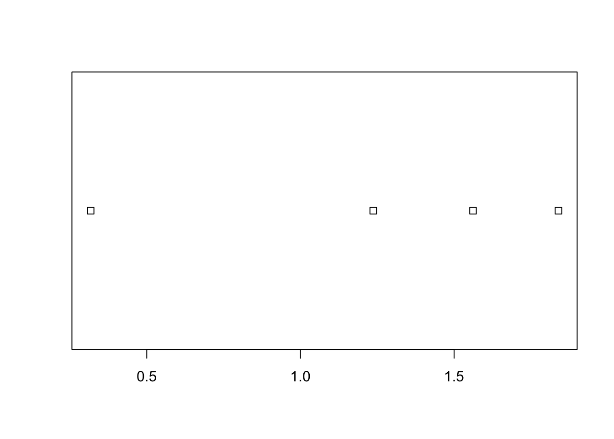
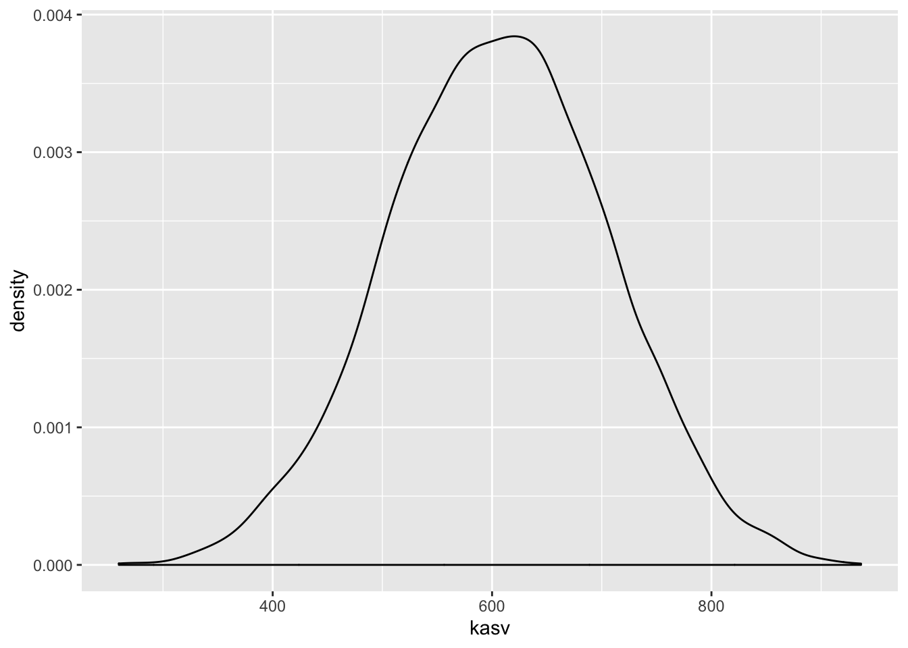
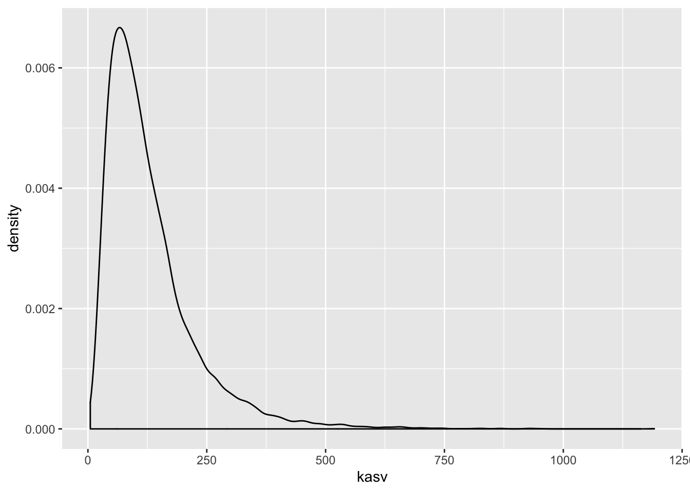
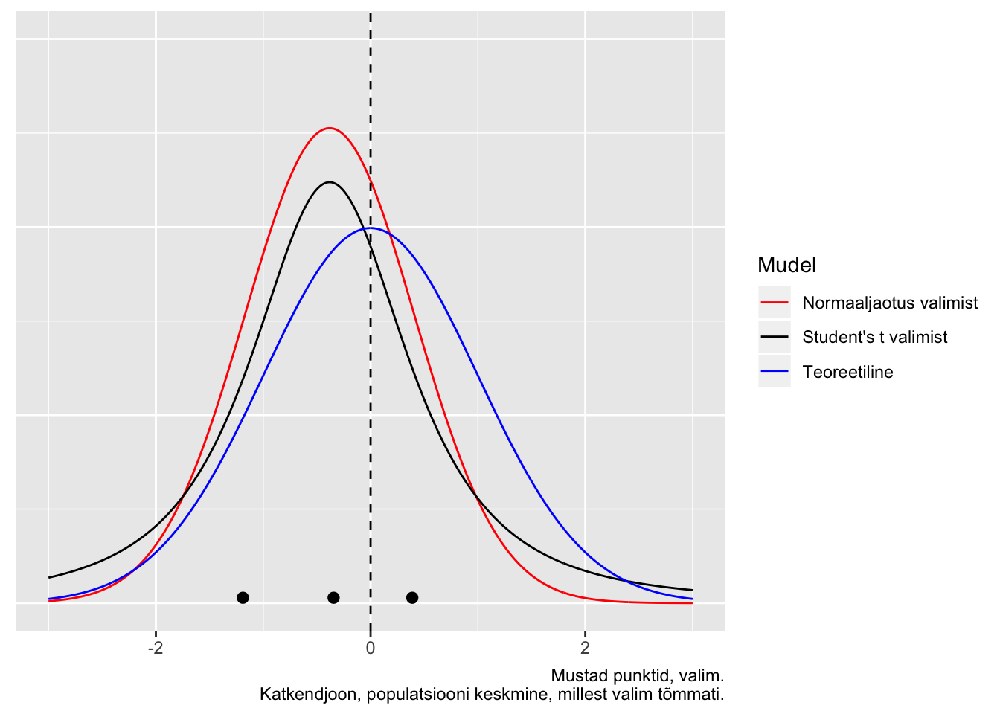
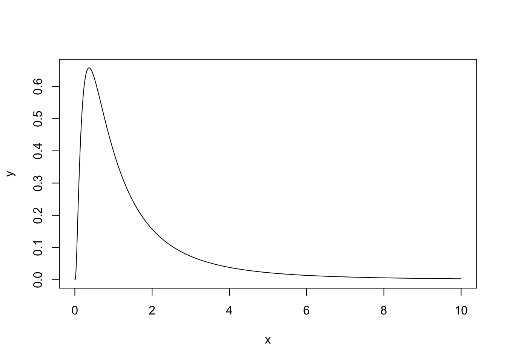
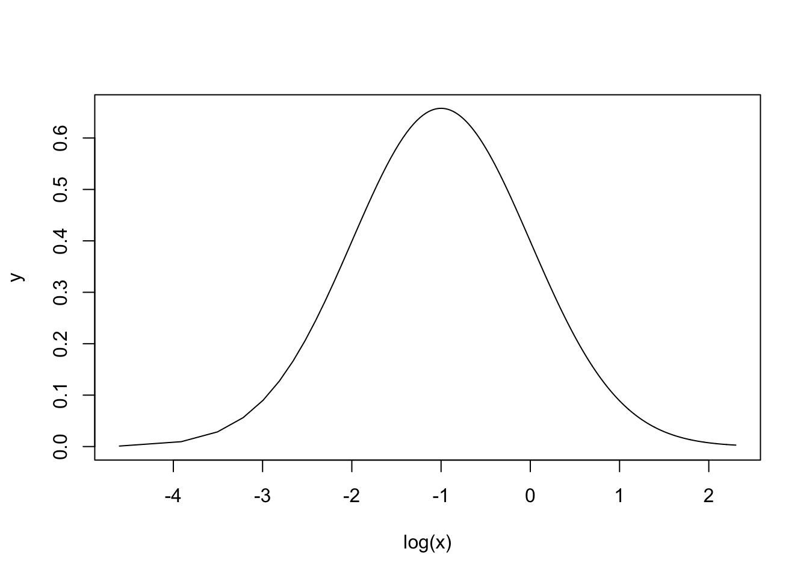

# Veamudel


```r
library(tidyverse)
library(brms)
library(broom)
```

## Lihtne varieeruvuse mudel  

Oletame, et me oleme mõõtnud nelja patsienti ja saanud tulemuseks 1.2, 2.12, 1.4 ja 8.34. Kuidas me oma valimit iseloomustame ja kas me peaksime 4. tulemuse, kui kahtlase, välja viskama? 
Arvatavasti tahaksime saada hinnangut kõige tõenäolisemale mõõtetulemusele patsientide populatsioonis ehk siis keskmise või tüüpilise patsiendi väärtusele. Ja lisaks ka hinnangut  patsientide vahelise varieeruvuse määrale. Meid võib ka huvitada võrrelda  patsientide ja tervete inimeste varieeruvust. Esmapilgul tundub see lihtsa ülesandena, mis ei vaja mudeldamist --  lihtsalt arvutame aritmeetilise keskmise ja standardhälbe ja meil on mõlemad hinnangud olemas. Aga tegelikult oleme probleemi ees, millele pole ühte õiget lahendust. 

Kui me viskame 4. tulemuse välja, siis tuleb meie keskmine kuhugi 1.5 kanti, muidu aga piirkonda, mille lähedal meil ei ole ühtegi andmepunkti. Samuti annaks sd arvutus üsna erinevad tulemused. Kumb võimalus siis valida? Selleks peame ikkagi otsustama, kuidas modelleerida oma andmed. Sõltuvalt looduslikust protsessist, mis need andmed genereeris, võiks andmete mudel olla näiteks normaaljaotus, lognormaaljaotus vms. Kui valime normaaljaotuse, millise õlad langevad väga kiiresti, siis on vaid väike tõenäosus kohata tervelt veerandit oma andmepunktidest nõnda kaugel teistest, mis annab argumendi selle punkti eemaldamiseks. Aga lognormaaljaotuse korral, mille õlg laskub palju aeglasemalt, on tõenäosus 4. mõõtmisest isegi kaugemal olevaid andmeid kohata palju suurem ja seega peaksime selle andmepunkti sisse jätma. 
Erinevat tüüpi mudelitel on erinevad parameetrid, millele saab andmete põhjal väärtusi otsida. See, et normaaljaotuse parameetrit $\mu$ saab meie näites arvutada aritmeetilise keskmise kaudu, ei tähenda, et ka teiste mudelite korral peaksime sama lokatsiooniparameetrit fittima (või et neil mudelitel üldse oleks lokatsiooniparameeter). Sarnased lood on muidugi ka varieeruvust iseloomustava parameetriga.

Statistilist mudelit saab kasutada mitmel moel.

1. Mudel toob sisse lisainformatsiooni andmete jaotuse kuju kohta, mida valimiandmetes endis ei pruugi sisalduda, ja mis tõstab meie järelduste kvaliteeti (või langetab seda, kui valisime kehva mudeli).

2. Võrreldes erinevat tüüpi mudelite sobivust andmetega ning omades aimu protsesside kohta, mida üks või teine mudel võiks adekvaatselt kirjeldada, on võimalik teha järeldusi loodusliku mehhanismi kohta, mis genereeris andmed, mille põhjal mudelid fititi.

3. Me võime fititud mudeli põhjal teha ennustusi, ehk genereerida uusi andmeid *in silico*.

Niisiis lihtne mudel andmetele: $\mu$ ehk aritmeetiline keskmine kui hinnang kõige tõenäosemale väärtusele. See on deterministlik nn *protsessimudel*, kus samad valimiväärtused annavad alati sama ja ühese tulemuse. Statistiline mudel sisaldab endas nii protsessimudelit kui tõenäosuslikku nn *varieeruvuse mudelit* (ajaloolistel põhjustel kutsutakse seda sageli veamudeliks), mis tuleb sisse tõenäosusjaotuse kujul

$$dnorm(\mu, \sigma)$$

Selle mudeli on võimalik ümber sõnastada (seda seeläbi üldistades) lihtsa regressioonivõrrandina $y = b_0$, kusjuures $\mu = b_0$ ehk andmete keskväärtus võrdub regressioonisirge interceptiga. Asendades saame

$$y \sim dnorm(b_0, \sigma)$$

Tilde $\sim$ tähistab seose tõenäosuslikkust, ehk seda, et y muutuja ennustuslikd väärtused tõmmatakse juhuvalimina normaaljaotusest, mis omakorda on fititud empiiriliste väärtuste (ehk valimi) põhjal. 

Seega on meil normaaljaotuse keskväärtus võimalik leida aritmeetilise keskmisena või samaväärselt vähimruutude meetodiga, mis paneb keskväärtuse kohta, kus keskväärtuse ja iga andmepunkti vahelise kauguste ruutude summa tuleb minimaalne. Vähimruutude meetod on üldisem, sest töötab ka järgmises peatükis, kus me asendame $\mu$ terve regressioonivõrrandiga kujul $y = b_0 + b_1x_1 + b_2x_2 + ... + b_ix_i$ (protsessimudel). Ja kui meie regressioonivõrrandid lähevad mittelineaarseks ja vähimruutude meetod nende fittimisel enam ei tööta, siis veel üldisem meetod, Bayesi teoreem, töötab ikka.

Kuigi aritmeetiline keskmine ja vähimruutude meetod annavad sama hinnangu lokatsiooniparameetrile, ei ütle need midagi sigma kohta. Samas Bayesi meetod annab hinnangu (koos usaldusintervalliga) mõlemale parameetrile.

    Normaaljaotus mudeldab lokalisatsiooniparameetrit mu populatsiooni 
    tüüpilise või keskmise liikme hinnanguna ja varieeruvusparameetrit 
    sigma populatsiooni liikmete vaheliste erinevuste määra hinnanguna. 
    

Arvutame lihtsa mudeli läbi vähimruutude meetodiga ja Bayesi meetodiga


```r
set.seed(1234321)
andmed <- tibble(a= rnorm(4))
plot(andmed)
```



```r
mean(andmed$a); sd(andmed$a)
#> [1] 1.24
#> [1] 0.662
```

Vähimruutude meetodit rakendab lm() funktsioon

```r
lm(a~1, data = andmed) %>% broom::tidy()
#> # A tibble: 1 x 5
#>   term        estimate std.error statistic p.value
#>   <chr>          <dbl>     <dbl>     <dbl>   <dbl>
#> 1 (Intercept)     1.24     0.331      3.74  0.0333
```

Ja Bayesi brms::brm()

```r
(Bayes_mudel <- brm(a~1, data = andmed) %>% broom::tidy())
```


```
#> # A tibble: 2 x 5
#>   term        estimate std.error lower upper
#>   <chr>          <dbl>     <dbl> <dbl> <dbl>
#> 1 b_Intercept     1.24     0.684 0.196  2.25
#> 2 sigma           1.27     1.24  0.461  3.02
```

Nagu näete, lm() fitib ainult mu parameetri, samas kui me Bayesi meetodit kasutades saame hinnangu (koos usalduspiiridega) kahele parameetrile: mu ehk intercept ja sigma ehk sd. 

Meie poolt simuleeritud andmed tulevad normaaljaotusega populatsioonist, mille mu = 0 ja sd = 1. Kumbki meetod ei luba meile null-intercepti sest andmeid on vähe ja need on juhusliku valimivea tõttu kallutatud. See-eest sigma hinnang, mille Bayes meile annab on küll laiavõitu (ikka sellepärast, et meil on vähe andmeid), aga vähemalt hõlmab endas õiget väärtust.


## protsessimudel ja varieeruvuse mudel lineaarses regressioonis

Kui mudel $kaal = b_0 + b_1 ~pikkus$ ennustab, et 160 cm inimene kaalub keskmiselt 80 kg, siis protsessi mudel ei ütle, kui suurt pikkusest sõltumatut kaalude varieeruvust võime oodata 160 cm-ste inimeste hulgas. 
Selle hinnangu andmiseks tuleb mudelile lisada varieeruvusekomponent, sageli normaaljaotuse kujul, mis modelleerib üksikute inimeste kaalude varieeruvust (mitte keskmise kaalu varieeruvust) igal mõeldaval ja mittemõeldaval pikkusel. 

  > Bioloogid, erinevalt füüsikutest, usuvad, et valimisisene andmete 
  varieeruvus on tingitud pigem bioloogilisest varieeruvusest kui mõõtmisveast, 
  aga loomulikult sisaldub selles ka mõõtmisviga. 

Kuidas varieeruvuskomponent lineaarsesse mudelisse sisse tuua? 
Ilma varieeruvuskomponendita mudel:

$$y = b_0 + bx$$

ennustab y-i keskväärtust erinevatel x-i väärtustel.

Varieeruvuskomponent: 

$$y\sim dnorm(\mu,~\sigma)$$

kus $\mu$ (*mu*) on mudeli poolt ennustatud keskväärtus ja $\sigma$ (sigma) on mudeli poolt ennustatud standardhälve ehk varieeruvus andmepunktide tasemel. 
Varieeruvusmudelis on keskväärtuse ehk *mu* ennustus endiselt deterministlik ja sigma töötab originaalsel andmetasemel, mitte keskväärtuste tasemel. 
See võimaldab protsessimudeli varieeruvusmudelisse sisse kirjutada lihtsalt *mu* ümber defineerides:

$$\mu = b_0 + bx$$ 

mis tähendab, et

$$y \sim dnorm(b_0 + b_1x, ~\sigma)$$


See ongi sirge mudel koos varieeruvuskomponendiga. Seega on sellel lineaarsel regressioonimudelil kolm parameetrit: intercept $b_0$, tõus $b_1$ ja "veaparameeter" $\sigma$. 
Sellist mudelit on mõistlik fittida Bayesi teoreemi abil. 
Bayesi meetodiga fititud mudel, mida kutsutakse posteerioriks, näitab, millised kombinatsioonid nendest kolmest parameetrist usutavalt koos esinevad, ja millised mitte. 
Seega on fititud 3 parameetriga bayesi mudel 3-dimensionaalne tõenäosusjaotus (3D posteerior). 
Muidugi saame ka ükshaaval välja plottida kolm 1D posteeriori, millest igaüks iseloomustab üht parameetrit ning on kollapseeritud üle kahe ülejäänud parameetri. 
[Edaspidi](pidev) õpime selliste mudelitega töötama. 


> Kõik statistilised mudelid on tõenäosusmudelid ning sisaldavad varieeruvuskomponenti.  

Kuna erinevalt lokatsiooniparameetrist, ei aja me mudelis sigmat lahku vastavalt x-i väärtustele, siis meie varieeruvusmudel (ja enamus veamudeleid, millega me edaspidi töötame) modelleerib igale x-i väärtusele (kaalule) sama suure y-i suunalise varieeruvuse (pikkuste sd). 
Suurem osa statistikast kasutab eeldusi, mida keegi päriselt tõe pähe ei võta, aga millega on arvutuslikus mõttes lihtsam elada. Siiski, 19. peatükis õpime, kuidas loobuda sellest eeldusest.

## Enimkasutatud veamudel on normaaljaotus {-}

Alustuseks simuleerime lihtsate vahenditega looduslikku protsessi, mille tulemusel tekib normaaljaotus.  
Oletame, et bakteri kasvukiirust mõjutavad 12 geeni, mille mõjud võivad olla väga erineva tugevusega, kuid mille mõjude suurused ei sõltu üksteisest. 
Seega nende 12 geeni mõjud kasvukiirusele liituvad.
Järgnevas koodis võtame 12 juhuslikku arvu 1 ja 100 vahel (kasutades `runif()` funktsiooni). 
Need 12 arvu näitavad 12 erineva geeni individuaalsete mõjude suurusi bakteritüve kasvukiirusele. 
Meil on seega kuni 100-kordsed erinevused erinevate geenide mõjude suuruste vahel. 
Seejärel liidame need 12 arvu. 
Nüüd võtame uue 12-se valimi ja kordame eelnevat. 
Me teeme seda 10 000 korda järjest ja plotime saadud 10 000 arvu (10 000 liitmistehte tulemust) tihedusfuntksioonina. 

(ref:normaaljaotus-tekib) Normaaljaotus tekib sõltumatutest efektidest. Kümne tuhande N = 12 suuruse juhuvalimi summa tihedusdiagramm.


```r
kasv <- replicate(10000, sum(runif(12, 1, 100))) 
p <- ggplot(tibble(kasv), aes(kasv)) + geom_density()
p
```

<div class="figure">

<p class="caption">(\#fig:normaaljaotus-tekib)(ref:normaaljaotus-tekib)</p>
</div>

Selles näites võrdub iga andmepunkt 10 000st ühe bakteritüve kasvukiiruse mõõtmisega. Seega, antud eelduste korral on bakteritüvede kasvukiirused normaaljaotusega.

Nüüd vaatame, mis juhtub, kui 12 geeni mõjud ei ole üksteisest sõltumatud. Kui 12 geeni on omavahel vastasmõjudes, siis nende geenide mõjud korrutuvad, mitte ei liitu. (Korrutamine pole ainus viis, kuidas vastasmõjusid modeleerida, küll aga kõige levinum.)
Kõigepealt vaatleme juhtu, kus 12 geeni on kõik väikeste mõjudega ning seega mitte ühegi geeni mõju ei domineeri teiste üle.
Seekord genreerime 12 juhuslikku arvu 1 ja 1.1 vahel. 
Siin tähendab arv 1.1 kasvu tõusu 10% võrra. 
Seejärel korrutame need 12 arvu, misjärel kordame eelnevat 10 000 korda. 

(ref:soltuvatest-efektidest) Normaaljaotus tekib väikestest sõltuvatest efektidest. Kümne tuhande N = 12 suuruse juhuvalimi korrutiste tihedusdiagramm. Ühegi geeni mõju ei domineeri teiste üle.


```r
kasv <- replicate(10000, prod(runif(12, 1, 1.1))) 
p %+% tibble(kasv)
```

<div class="figure">

<p class="caption">(\#fig:soltuvatest-efektidest)(ref:soltuvatest-efektidest)</p>
</div>

Tulemuseks on jällegi normaaljaotus.
Selles näites olid üksikud interakteeruvad geenid ükshaaval väikeste mõjudega ja ühegi geeni mõju ei domineerinud teiste üle. 
Mis juhtub, kui mõnel geenil on kuni 2 korda suurem mõju kui teisel?

(ref:lognormaal) Lognormaaljaotus tekib suurematest sõltuvatest efektidest. Kümne tuhande N = 12 suuruse juhuvalimi korrutiste tihedusdiagramm. Mõnel geenil on kuni 2 korda suurem mõju kui teisel.


```r
kasv <- replicate(10000, prod(runif(12, 1, 2)))
p %+% tibble(kasv)
```

<div class="figure">

<p class="caption">(\#fig:lognormaal)(ref:lognormaal)</p>
</div>

Nüüd on tulemuseks log-normaaljaotus. Mis teie arvate, kas teie poolt uuritavat tunnust mõjutavad faktorid, mis omavahel ei interakteeru või kui interakteeruvad, on kõik ühtlaselt väikeste efektidega? 
Või on tegu vastasmõjudes olevate faktoritega, millest osad on palju suuremate mõjudega, kui teised? 
Ühel juhul eelistate te normaaljaotust, teisel juhul peate õppima töötama ka lognormaaljaotusega.

Kui me vaatame samu andmeid logaritmilises skaalas, avastame, et need andmed on normaaljaotusega. 
See ongi andmete logaritmimise mõte.

(ref:logskaalas) Logaritmilises skaalas lognormaalsed efektid on normaaljaotusega. Kümne tuhande N = 12 suuruse juhuvalimi korrutiste tihedusdiagramm. Mõnel geenil on kuni 2 korda suurem mõju kui teisel.


```r
kasv <- replicate(10000, log10(prod(runif(12, 1, 2))))
p %+% tibble(kasv) + labs(x = "kasv, log10")
```

<div class="figure">

<p class="caption">(\#fig:logskaalas)(ref:logskaalas)</p>
</div>

>Normaaljatuse avastas Gauss (1809), aga nime andis sellele Francis Galton (1860ndatel), kuna antropoloogilised mõõtmised "normaalselt" järgisid "vigade seadust", mille ta nimetas "Normaalseks jaotuste kurviks".


### Normaaljaotuse mudel väikestel valimitel {-}

Oletame, et meil on kolm andmepunkti ning me usume, et need andmed on juhuslikult tõmmatud normaaljaotusest või sellele lähedasest jaotusest. Normaaljaotuse mudelit kasutades deklareerime, et me usume, et kui oleksime olnud vähem laisad ja 3 mõõtmise asemel sooritanuks 3000, siis need mõõtmised sobituksid piisavalt hästi meie 3 väärtuse peal fititud normaaljaotusega. Seega, me usume, et omades 3 andmepunkti me teame juba umbkaudu, millised tulemused me oleksime saanud korjates näiteks 3 miljonit andmepunkti. Oma mudelist võime simuleerida ükskõik kui palju andmepunkte. 

Aga pidage meeles, et selle mudeli fittimiseks kasutame me ainult neid andmeid, mis meil päriselt on --- ja kui meil on ainult 3 andmepunkti, on tõenäoline, et fititud mudel ei kajasta hästi tegelikkust. 

Kuidas panna skeptik uskuma, et statistilised meetodid töötavad halvasti väikestel valimitel? Järgnevalt illustreerime seda ühe võimaliku valimiga paljudest, mis on tõmmatud imaginaarsest populatsioonist, mille parameetreid me teame. Me tõmbame 3-se valimi ning üritame selle valimi põhjal ennustada selleasama populatsiooni struktuuri. Kuna tegemist on simulatsiooniga, teame täpselt, et populatsioon, kust me tõmbame oma kolmese valimi, on normaaljaotusega, et tema keskväärtus = 0 ja et tema sd = 1. Seega saame võrrelda oma ennustust populatsiooni tõeliste parameetriväärtustega.
Me fitime oma valimiandmetega 2 erinevat mudelit: normaaljaotuse ja Studenti t jaotuse. 

(ref:juhuvalim-normaaljaotusest) Juhuvalim normaaljaotusest, mille keskmine = 0 ja sd = 1 (n=3; andmepunktid on näidatud mustade munadena). Sinine joon - populatsioon, millest tõmmati valim; punane joon - normaaljaotuse mudel, mis on fititud valimi andmetel; must joon - Studenti t jaotuse mudel, mis on fititud samade andmetega. Mustad punktid, valim. Katkendjoon, populatsiooni keskmine, millest valim tõmmati.

<div class="figure">

<p class="caption">(\#fig:juhuvalim-normaaljaotusest)(ref:juhuvalim-normaaljaotusest)</p>
</div>

Siin saame hinnata mudelite fitte jumala positsioonilt, võrreldes fititud mudelite jaotusi "tõese" sinise jaotusega.
Mõlemad mudelid on süstemaatiliselt nihutatud väiksemate väärtuste poole ja alahindavad varieeruvust. t jaotuse mudel on oodatult paksemate sabadega ja ennustab 0-st kaugele palju rohkem väärtusi kui normaaljaotuse mudel. Kuna me teame, et populatsioon on normaaljaotusega, pole väga üllatav, et t jaotus modeleerib seda halvemini kui normaaljaotus. 

Igal juhul, mõni teine juhuvalim annaks meile hoopis teistsugused mudelid, mis rohkem või vähem erinevad algsest populatsioonist.

Mis juhtub kui me kasutame oma normaaljaotuse mudelit uute andmete simuleerimiseks? Kui lähedased on need simuleeritud andmed populatsiooni andmetega ja kui lähedased valimi andmetega, millega me normaaljaotuse mudeli fittisime?

(ref:kasutame-fititud) Kasutame fititud mudeleid uute andmete simuleerimiseks.


```r
# tõmbame 3 juhuslikku arvu normaalhaotusest, mille keskväärtus = 0 ja sd = 1.
dfr <- tibble(sample_data = rnorm(3)) 
dfr <- summarise_at(dfr, "sample_data", c("mean", "sd"))
dfr
#> # A tibble: 1 x 2
#>     mean    sd
#>    <dbl> <dbl>
#> 1 0.0654 0.808
# simuleerime 1000 uut andmepunkti fititud mudelist
simulated_data <- rnorm(1000, dfr$mean, dfr$sd)
# arvutame simuleeritud andmete keskmise ja sd ning joonistame neist histogrammi
ggplot(tibble(simulated_data), aes(simulated_data)) +
  geom_histogram(bins = 15)
```

<div class="figure">

<p class="caption">(\#fig:kasutame-fititud)(ref:kasutame-fititud)</p>
</div>

Nagu näha, igati ootuspäraselt on uute (simuleeritud) andmete keskväärtus ja SD väga sarnased algsete andmete omale, mida kasutasime mudeli fittimisel. 
Kahjuks ei ole need aga kaugeltki nii sarnased algsele jaotusele, mille kuju me püüame oma andmete ja mudeli pealt ennustada. 
Seega on meie mudel üle-fittitud, mis tähendab, et ta kajastab liigselt neid valimi aspekte, mis ei peegelda algse populatsiooni omadusi. 
Loomulikult ei vasta ükski mudel päriselt tegelikkusele. 
Küsimus on pigem selles, kas mõni meie mudelitest on piisavalt hea, et olla kasulik.
Vastus sellele sõltub, milleks plaanime oma mudelit kasutada.


```r
mean(simulated_data > 0) 
#> [1] 0.535
mean(simulated_data > 1)
#> [1] 0.116
```
Kui populatsiooniväärtustest on 50% suuremad kui 0, siis mudeli järgi vaevalt 32%. Kui populatsiooniväärtustest on 16% suuremad kui 1, siis mudeli järgi vaevalt 4%.
See illustreerib hästi mudeli kvaliteeti.


```r
sim_t <- rstudent_t(1000, 2, dfr$mean, dfr$sd)
mean(sim_t > 0)
#> [1] 0.516
mean(sim_t > 1)
#> [1] 0.189
```
Samad ennustused t jaotusest on isegi paremad! Aga kumb on ikkagi parem mudel populatsioonile?


## Normaaljaotuse ja lognormaaljaotuse erilisus {-}

Normaaljaotus ja lognormaaljaotus on erilised sest 

(1) kesksest piirteoreemist (*central limit theorem*) tuleneb, et olgu teie valim ükskõik millise jaotusega, paljudest valimitest arvutatud **aritmeetilised keskmised** on alati enam-vähem normaaljaotusega. See kehtib enamuse andmejaotuste korral, kui n>30. 
Selle matemaatilise tõe peegeldus füüsikalisse maailma on "elementaarsete vigade hüpotees", mille kohaselt paljude väikeste üksteisest sõltumatute juhuslike efektide (vigade) summa annab tulemuseks normaaljaotuse. 

Paraku enamus bioloogilisi mõõtmisi annavad tulemuseks eranditult mitte-negatiivseid väärtusi. 
Sageli on selliste väärtuste jaotused ebasümmeetrilised (v.a. siis, kui cv = sd/mean on väike), ja kui nii, siis on meil sageli tegu lognormaaljaotusega, mis tekkib log-normaalsete muutujate korrutamisest. 
Siit tuleb Keskne piirteoreem 2, mille kohaselt suvalise jaotusega muutujate **geomeetrilised keskmised** on enam-vähem lognormaaljaotusega, ning elementaarsete vigade hüpotees 2: Kui juhuslik varieeruvus tekib paljude juhuslike efektide korrutamisel, on tulemuseks lognormaaljaotus. 
Lognormaaljaotusega väärtuste logaritmimine annab normaaljaotuse. 

(2) Nii normaal- kui lognormaaljaotus on maksimaalse entroopiaga jaotused. 
Entroopiat vaadeldakse siin informatsiooni & müra kaudu --- maksimaalse entroopiaga süsteem sisaldab maksimaalselt müra ja minimaalselt informatsiooni (vastavalt Shannoni informatsiooniteooriale). See tähendab, et väljaspool oma parameetrite tuunitud väärtusi on normaal- ja lognormaaljaotused minimaalselt informatiivsed. 
Normaaljaotusel ja lognormaaljaotusel on kummagil kaks parameetrit, *mu* ja *sigma* (ehk keskmine ja standardhälve), mille väärtused fikseerides fikseerime üheselt jaotuse ehk mudeli kuju, lisades sinna minimaalselt muud (sooviamtut) informatsiooni. 
Teised maksimaalse entroopiaga jaotused on näiteks eksponentsiaalne jaotus, binoomjaotus, bernoulli jaotus, poissoni jaotus. 

> Kui meil on tegu nullist suuremate andmetega, on andmete logaritmimine sageli hea mõte. Logaritmitud andmete pealt arvutatud keskmise ja sd eksponentimine annab meile geomeetrilise keskmise (exp(mu) = mu_geom) ja multiplikatiivse sd (exp(sd) = sd_mult). 

Kui me fitime lognormaaljaotust andmetega, siis fititud koefitsiendid mu ja sd tuleb eksponentida, et saada geomeetriline keskmine ja multiplikatiivne sd. 

mu_geom x sd_mult ... mu_geom/sd_mult annab vahemiku, kuhu jääb 68% lognormaalsetest andmetest ja mu_geom x 2sd_mult ... mu_geom/2sd_mult annab vahemiku, kuhu jääb 96% andmetest (just nagu additiivne sd tõõtab aritmeetilise additiivse keskmisega normaalsete andmete korral). 

Maksimaalsel entroopial põhineb normaaljaotuse ja lognormaaljaotuse sage kasutamine Bayesi statistikas prioritena, sest me suudame paremini kontrollida, millist informatsiooni me neisse surume. Esimesel kesksel piirteoreemil seevastu põhineb kogu sageduslik statistika (vt ptk 8.).

### Normaaljaotuse ja lognormaaljaotuse võrdlus

**Normaaljaotus** 

1. Normaaljaotusega ehk normaalsete juhuslike muutujate liitmine annab normaalse summa. Lineaarsed kombinatsioonid $Y= \alpha + \beta_1X_1 + \beta_2X_2$ jäävad normaalseks.

2. Normaalsete muutujate aritmeetilised keskmised on normaaljaotusega.

3. Keskne piirteoreem: mitte-normaalsete muutujate aritmeetilised keskmised on enam-vähem normaaljaotusega.

4. Elementaarsete vigade hüpotees: kui juhuslik varieeruvus on paljude juhuslike mõjude summa, on tulemuseks normaaljaotus.

5. Additiivne regressioonimudel (normaalne tõepära) viib additiivsetele vigadele (residuaalidele), mis omakorda viib konstantsele varieeruvusele (SD-le). Vead on normaaljaotusega.

**lognormaaljaotus**

1. lognormaalsete juhuslike muutujate korrutamine annab lognormaalse korrutise.

2. Longnormaalsete muutujate geomeetrilised keskmised on lognormaaljaotusega.

3. Keskne piirteoreem: mitte-lognormaalsete muutujate geomeetrilised keskmised on enam-vähem lognormaaljaotusega

4. Elementaarsete vigade hüpotees: kui juhuslik varieeruvus on paljude juhuslike mõjude korrutis, on tulemuseks lognormaaljaotus

5. multiplikatiivne regressioonimudel (lognormaalne tõepära) viib multiplikatiivsete vigadeni ja konstantsele suhtelisele varieeruvusele (CV-le). Vigade jaotus on ebasümmeetriline. 

Seega võime lognormaaljaotust kutsuda ka multiplikatiivseks normaaljaotuseks.


## Teised veamudelid
### Lognormaaljaotus


```r
x <- seq(0, 10, length.out = 1000)
y <- dlnorm(x)
plot(x, y, typ = "l")
```




Seda jaotust, mis ei ulatu kunagi teisele poole nulli, iseloomustab, et x-i logaritmimine annab tulemuseks normaaljaotuse. 


```r
plot(log(x), y, type = "l")
```



Lognormaaljaotuse keskväärtus, standardhälve, mood ja mediaan:

$$keskv\ddot{a}\ddot{a}rtus = \exp(\mu + 1/2 \times \sigma^2)$$ 

$$sd = \exp(\mu + 1/2 \times \sigma^2) \times \sqrt{\exp(\sigma^2) - 1}$$
$$mood = e^{\mu - \sigma^2}$$

$$mediaan = e^\mu$$
Siin on siis $\mu$ ja $\sigma$ arvutatud logaritmitud andmete pealt.

### Binoomjaotus

Kui teil on binaarne muutuja (sellel saab olla ainult kaks väärtust, näiteks sees/väljas, 1/0), mis kajastab sõltumatuid sündmusi, siis modelleerib seda binoomjaotus $y \sim Binomial(n, p)$.
Kus *n* on edukate sündmuste arv ja *p* on nende suhteline sagedus (p = n / N, kus *N* on kõikide sündmuste kopguarv). 
Sõltumatud sündmused on sellised, kus ühe sündmuse esinemise järgi ei saa ennustada teise sündmuse esinemist (st puudub korrelatsioon sündmuste esinemise vahel). 
Tehniliselt on binoomjaotusel veel omadus, et valim võetakse replacementiga, mis tähendab, et iga sündmus pannakse populatsiooni tagasi, kus seda saab uuesti valimisse tõmmata. 
Siit tuleb, et binoomjaotuse mudel kehtib päris maailmas mõõndustega ja et seda mudelit on kindlam kasutada siis, kui N >> n. 
Kui N on suur, siis meenutab binoomjaotus normaaljaotust (läheneb selle kujule).


```r
n <- 10 # sündmuste koguarv
x <- seq(0, n) # kõik võimalikud õnnestumiste arvud 10st sündmusest
p <- 0.3 # 30% õnnestumisi (sagedus)
y <- dbinom(x, n, p)
plot(x, y)
```


$$keskv\ddot{a}\ddot{a}rtus = N \times p$$

Kui Np võrdub täisarvuga, siis mediaan = mood = keskväärtus

$$sd = sqrt(N \times p(1 - p))$$

Standardviga proportsioonile $p = \sqrt{\frac{p(1 - p)}{N}}$
See standardviga (*standard error*) on teiste sõnadega standardhälve meie hinangule proportsiooni väärtusele. 
Kui n = 0 või N - n = 0, siis on selline SE arvutus eksitav. 

### Poissoni jaotus

See jaotus modelleerib üksikuid haruldasi ja sõltumatuid diskreetseid sündmusi, mille arvu me saame üles lugeda.
Näiteks surmi ajaühiku kohta või pommitabamusi pindalaühiku kohta. Poissoni jaotus on binoomjaotuse erijuht.
Lisaeeldused on, et sündmuste toimumise sagedus ei muutu, et kaks sündmust ei saa toimuda täpselt samal ajal/kohas, et sündmuse toimumise tõenäosus on proportsionaalne intervalli pikkusega/suurusega (ajas või ruumis) ja et N >> n.

Kui keskmine sündmuste arv intevallis on $\lambda$ (lambda), siis

$$P(k~events~in~interval) = e^{\lambda} \times \frac{\lambda ^{k}}{k!}$$


Oodatud väärtus = variance = $\lambda$

$sd = \sqrt{\lambda}$

Millal kasutada Poissoni jaotust, ja millal binoomjaotust? Kui iga andmepunkti saab vaadelda kui edukate katsete arvu suhet kõikide katsete arvule, siis kasuta binoomjaotust/logistilist regressiooni.
Kui aga andmepunkti väärtusel pole loomulikku piiri (see on lihtsalt mingit tüüpi sündmuste arv), kasuta Poissoni/logaritmilist regressiooni.
