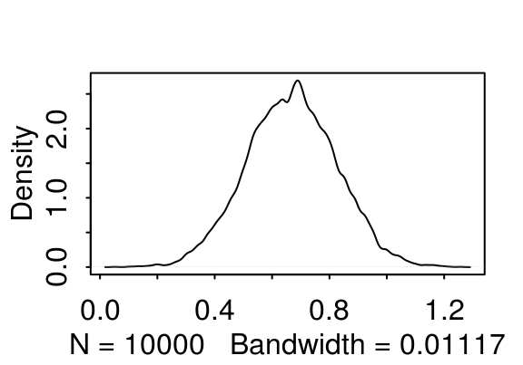
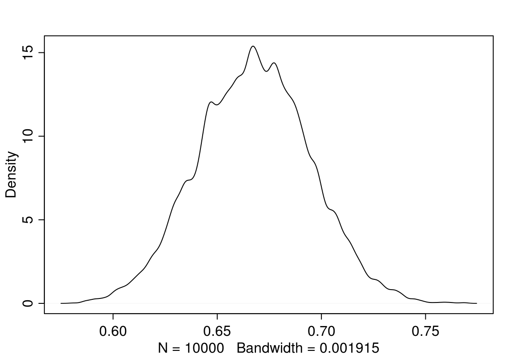
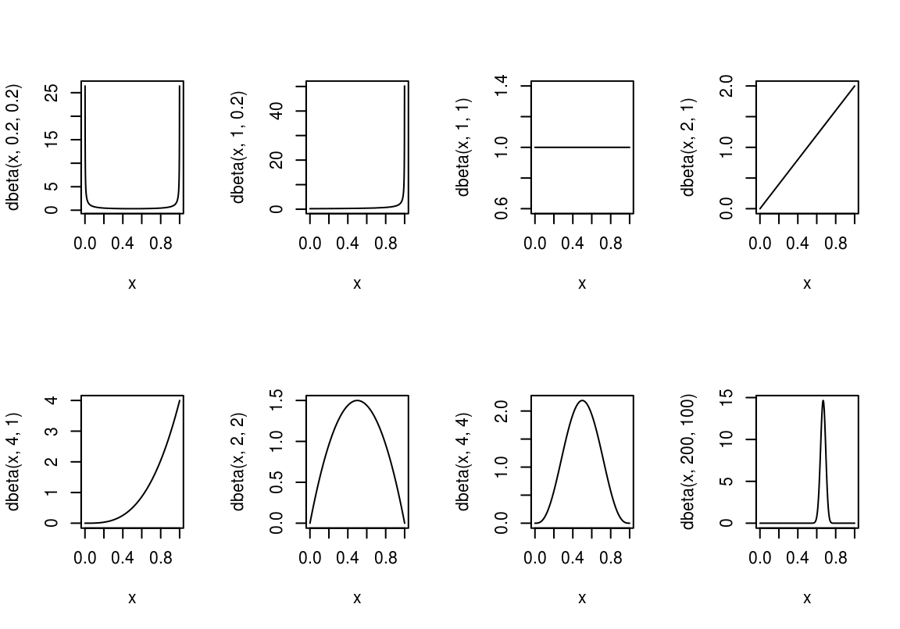
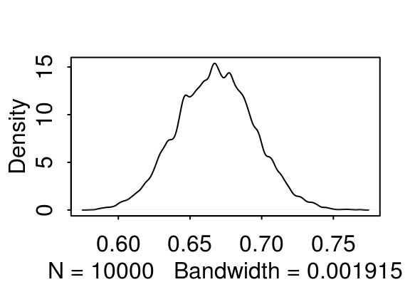

# Mudelite keel

Siin vaatame kuidas kirjeldada mudelit nii, et masin selle ära tunneb. 
Meie mudelid töötavad läbi "rethinking" paketi. 
See raamatukogu pakub kaks võimalust, kuidas mudelit arvutada, mis mõlemad kasutavad sama notatsiooni. 
Mõlemad võimalused arvutavad posteeriori mitte Bayesi teoreemi kasutades (nagu me ennist tegime), vaid kasutades stohhastilisi meetodeid, mis iseloomustavad posteeriori umbkaudu (aga piisavalt täpselt). 
Põhjuseks on, et keerulisemate mudelite korral on Bayesi teoreemi kasutamine liialt arvutusmahukas. 

Esiteks `rethinking::map()` leiab posteeriori tipu ja selle lähedal funktsiooni tõusunurga. 
Siin on eelduseks, et posteerior on normaaljaotus. 
See eeldus kehtib alati, kui nii prior kui tõepära on modelleeritud normaaljaotusena (ja ka paljudel muudel juhtudel). 

Teine võimalus on `rethinking::map2stan()`, mis suunab teie kirjutatud mudeli Stan-i. 
Stan teeb *Hamilonian Monte Carlo* simulatsiooni, kasutades valget maagiat selleks, et tõmmata valim otse posteerioorsest jaotusest. 
See on väga moodne lähenemine statistikale, töötab oluliselt aeglasemalt kui map, aga ei sõltu normaaljaotustest ning suudab arvutada hierarhilisi mudeleid, mis map-le üle jõu käivad. 

Me võime sama mudeli kirjelduse sõõta mõlemasse funktsiooni.

Lihtne mudel näeb välja niimodi:

```
dead ~ dbinom(9, p) # binomial likelihood
p ~ dunif(0, 1) # uniform prior
```        

Tõepärafunktsioon on modeleeritud binoomjaotusena. 
Parameeter, mille väärtust määratakse on p, ehk suremus. 
See on ainus parameeter, mille väärtust me siin krutime.
NB! igale parameetrile peab vastama oma prior. 
Meil on selles mudelis täpselt 1 parameeter ja 1 prior. 
Vastuseks saame selle ainsa parameetri posterioorse jaotuse. 
Hiljem näeme, et kui meil on näiteks 452 parameetrit, mille väärtusi me koos arvutame, siis on meil ka 452 priorit ja 452 posterioorset jaotust.


```r
library(rethinking)
# Fit model using rethinking
m1 <- map(
    alist(
        dead ~ dbinom(9, p), # Binomial likelihood
        p ~ dunif(0, 1) # Uniform prior
), data = list(dead = 6))

# Summary of quadratic approximation
precis(m1)
#>   Mean StdDev 5.5% 94.5%
#> p 0.67   0.16 0.42  0.92
```


Nüüd tõmbame posteerioroorsest jaotusest valimi n=10 000. Selleks on funktsioon extract.samples()


```r
samples <- extract.samples(m1)
# hist(samples$p)
dens(samples$p)
HPDI(samples$p, prob = 0.95) # Highest density 95% at the center
#> |0.95 0.95| 
#> 0.354 0.962
```

<div class="figure" style="text-align: center">

<p class="caption">(\#fig:unnamed-chunk-3)tõmbame valimi posteeriorist.</p>
</div>

Kuus patsienti üheksast surid ja nüüd me usume, et tegelik suremus võib olla nii madal kui 37% ja nii kõrge kui 97%. Kui me tahame paremat hinnangut on meil vaja kas rohkem patsiente või informatiivsemat priorit (paremat taustainfot).


```r
m2 <- map(
    alist(
        dead ~ dbinom(90, p),  # Binomial likelihood
        p ~ dunif(0, 1)     # Uniform prior
), data = list(dead = 60))
# Display summary of quadratic approximation
precis(m2)
#>   Mean StdDev 5.5% 94.5%
#> p 0.67   0.05 0.59  0.75
```


```r
samples <- extract.samples(m2)
dens(samples$p)
#PI(samples$p, prob = 0.95) # Leaves out equal 2.5% at both sides
HPDI(samples$p, prob = 0.95) # Highest density 95% at the center
#> |0.95 0.95| 
#> 0.572 0.764
```

<div class="figure" style="text-align: center">

<p class="caption">(\#fig:unnamed-chunk-5)Veel üks valim posteeriorist (60 surma 90st).</p>
</div>

10 korda rohkem andmeid: nüüd on suremus määratud kuskile 57% ja 77% vahele (suure tõenäosusega)

## Beta prior {-}

Nüüd anname sisse mõistlikuma struktuuriga priori: beta-jaotuse

Beta-prior katab vahemiku 0st 1ni ja sellel on 2 parameetrit, a ja b.

Siin mõned näited erinevatest beta parametriseeringutest
<div class="figure" style="text-align: center">

<p class="caption">(\#fig:unnamed-chunk-6)Beta jaotuse parametriseeringuid.</p>
</div>

$beta(\theta~\vert~a,b)$ jaotuse keskväärtus on 
 
$\mu = a/(a + b)$ 
 
ja mood on 

$\omega= (a-1)/(a + b-2)$ (kui $a > 1$ ja $b > 1$). 

Seega, kui a = b, siis on keskmine ja mood 0.5. Kui a > b, on keskmine ja mood > 0.5 ja kuid a < b, on mõlemad < 0.5. 

Beta jaotuse "laiuse" annab "konsentratsioon" $\kappa = a + b$. 
Mida suurem $\kappa$, seda kitsam jaotus.

$a = \mu\kappa$  

$b = (1-\mu)\kappa$

$a = \omega(\kappa-2) + 1$

$b = (1-\omega)(\kappa-2)+1$ kui $\kappa > 2$

Me võime $\kappa$-le omistada väärtuse nagu see oleks mündivisete arv, mis iseloomustab meie priori tugevust (juhul kui tõepära funktsioon tuleb andmetest, mis koosnevad selle sama mündi visetest). 
Kui meie jaoks piisaks ainult mõnest mündiviset, et priorist (eelnevast teadmisest) lahti ütelda, peaks meie prior sisaldama väikest kappat. 

Näiteks, mu prior on, et münt on aus ($\mu = 0.5$; $a = b$), aga ma ei ole selles väga veendunud. 
Niisiis ma arvan, et selle eelteadmise kaal võrdub sellega, kui ma oleksin näinud 8 mündiviske tulemust. 
Seega $\kappa = 8$, mis tähendab, et $a = \mu\kappa = 4$ ja $b = (1-\mu)\kappa = 4$. 
Aga mis siis kui me tahame beta priorit, mille mood $\omega = 0.8$ ja $\kappa = 12$? 
Siis saame valemist, et $a = 9$ ja $b = 3$. 


```r
## Fit model
m3 <- rethinking::map(
    alist(
        dead ~ dbinom(9, p),  # Binomial likelihood
        p ~ dbeta(200, 100) # Beta prior
), data = list(dead = 6))
## Extract samples
samples <- extract.samples(m3)
# Display summary of quadratic approximation
precis(m3)
#>   Mean StdDev 5.5% 94.5%
#> p 0.67   0.03 0.62  0.71
```


```r
HPDI(samples$p, prob = 0.95) # Highest density 95% at the center
#> |0.95 0.95| 
#> 0.616 0.720
dens(samples$p)
```

<div class="figure" style="text-align: center">

<p class="caption">(\#fig:unnamed-chunk-8)Posteerior, mis on arvutatud beta prioriga binoomsest tõepäramudelist.</p>
</div>

Nagu näha on ka kitsa priori mõju üsna väika, isegi kui kui n = 9.

## Prioritest üldiselt {-}

Neid võib jagada kolmeks: mitteinformatiivsed, väheinformatiivsed ehk "regularizing" ja informatiivsed. 

Mitteinformatiivseid prioreid ei ole sisuliselt olemas ja neid on soovitav vältida. 
Sageli kutsutakse tasaseid prioreid mitteinformatiivseteks. 
Neil on vähemalt 2 puudust. 
Tasane prior, mis ulatub lõpmatusse, on tehniliselt "improper", sest tema alune pindala ei summeeru ühele. 
Ja teiseks muudavad sellised priorid mcmc ahelad vähem efektiivseteks, mis võib teie arvutuse kihva keerata. 

Väheinformatiivsed priorid kujutavad endast kompromissi: nad muudavad võimalikult vähe tõepärafunktsiooni kuju, aga samas piiravad seda osa parameetriruumist, kust MCMC ahelad posteeriori otsivad (mis on soodne arvutuslikult). 
Nende priorite taga on filosoofiline eeldus, et teadlast huvitavad eelkõige tema enda andmed ja see, mida need ühe või teise hüpoteesi (parameetri väärtuse) kohta ütlevad. 
See eeldus on vaieldav, aga kui selle järgi käia, siis kulub vähem mõttejõudu eelteadmiste mudelisse formaliseerimiseks. 

Nõrgalt regulariseerivad priorid on väheinformatiivsete priorite alamliik, mis on tsentreeritud nullile ja tõmbavad posteeriorit õrnalt nulli suunas. 

Vähemalt suured farmaatsiafirmad seda hoiakut ei jaga ja kulutavad oma miljoneid informatiivsete priorite tootmiseks. 
Selles protsessis saavad kokku statistikud, teaduseksperdid ja psühholoogid, et inimkonna teadmisi võimalikult adekvaatselt vormida tõenäosusjaotustesse. 
Meie töötame siiski enamasti väheinformatiivsete prioritega.
