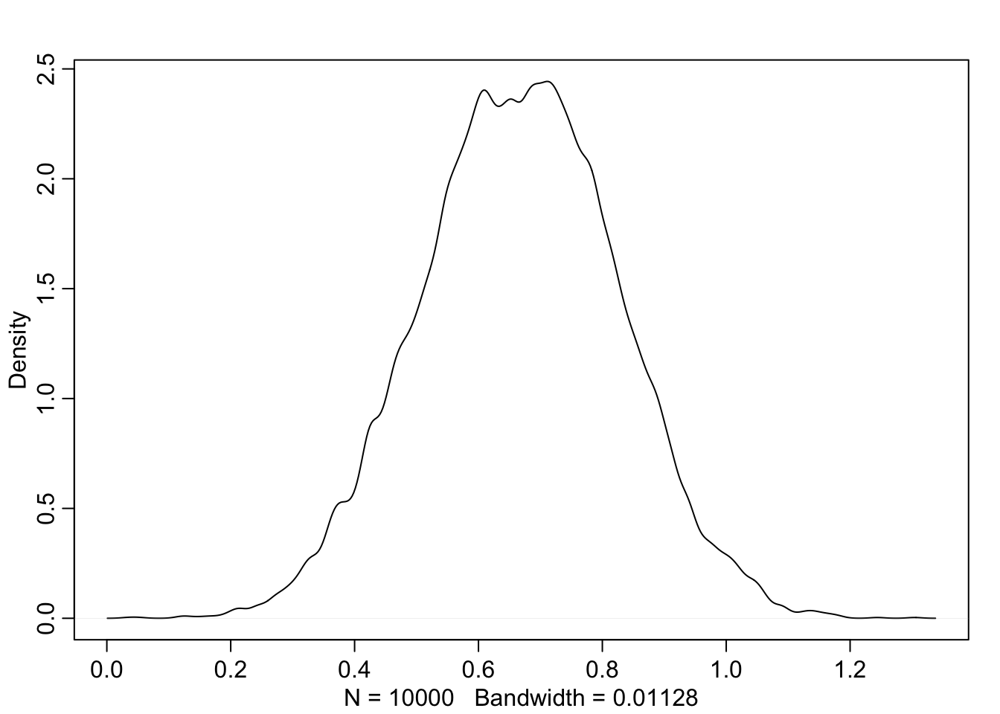
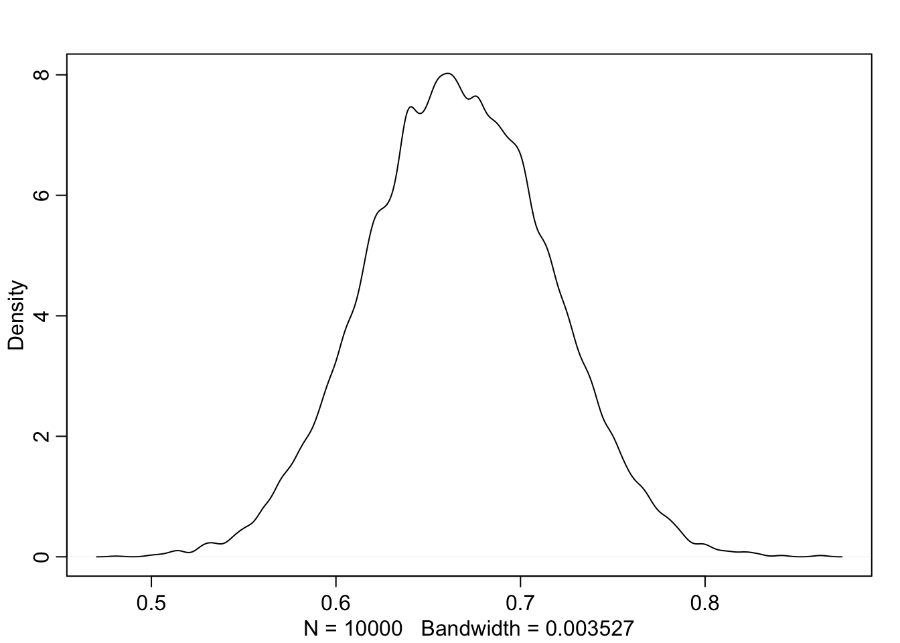
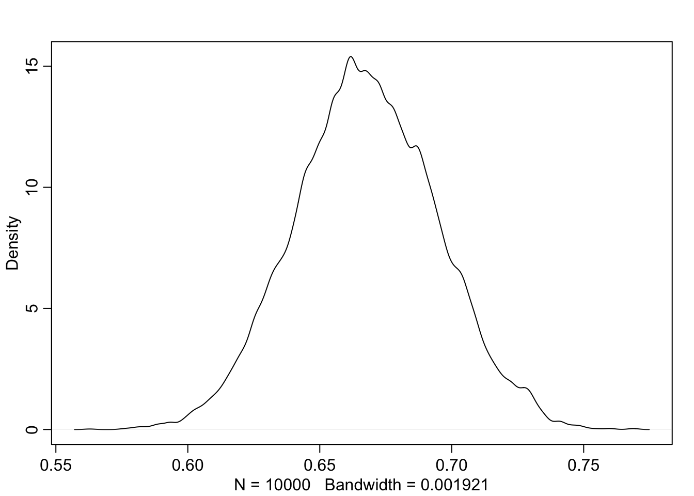

# Mudelite keel

Siin vaatame kuidas kirjeldada mudelit nii, et masin selle ära tunneb. 
Meie mudelid töötavad läbi "rethinking" paketi. 
See raamatukogu pakub kaks võimalust, kuidas mudelit arvutada, mis mõlemad kasutavad sama notatsiooni. 
Mõlemad võimalused arvutavad posteeriori mitte Bayesi teoreemi kasutades (nagu me ennist tegime), vaid kasutades stohhastilisi meetodeid, mis iseloomustavad posteeriori umbkaudu (aga piisavalt täpselt). 
Põhjuseks on, et keerulisemate mudelite korral on Bayesi teoreemi kasutamine liialt arvutusmahukas. 

Esiteks `rethinking::map()` leiab posteeriori tipu ja selle lähedal funktsiooni tõusunurga. 
Siin on eelduseks, et posteerior on normaaljaotus. 
See eeldus kehtib alati, kui nii prior kui tõepära on modelleeritud normaaljaotusena (ja ka paljudel muudel juhtudel). 

Teine võimalus on `rethinking::map2stan()`, mis suunab teie kirjutatud mudeli Stan-i. 
Stan teeb *Hamilonian Monte Carlo* simulatsiooni, kasutades valget maagiat selleks, et tõmmata valim otse posteerioorsest jaotusest. 
See on väga moodne lähenemine statistikale, töötab oluliselt aeglasemalt kui map, aga ei sõltu normaaljaotustest ning suudab arvutada hierarhilisi mudeleid, mis map-le üle jõu käivad. 

Me võime sama mudeli kirjelduse sööta mõlemasse funktsiooni.

Lihtne mudel näeb välja niimodi:

```
dead ~ dbinom(9, p) # binomial likelihood
p ~ dunif(0, 1) # uniform prior
```        

Tõepärafunktsioon on modeleeritud binoomjaotusena. 
Parameeter, mille väärtust määratakse on p, ehk suremus. 
See on ainus parameeter, mille väärtust me siin krutime.
NB! igale parameetrile peab vastama oma prior. 
Meil on selles mudelis täpselt 1 parameeter ja 1 prior. 
Vastuseks saame selle ainsa parameetri posterioorse jaotuse. 
Hiljem näeme, et kui meil on näiteks 452 parameetrit, mille väärtusi me koos arvutame, siis on meil ka 452 priorit ja 452 posterioorset jaotust.


```r
library(rethinking)
# Fit model using rethinking
m1 <- map(
    alist(
        dead ~ dbinom(9, p), # Binomial likelihood
        p ~ dunif(0, 1) # Uniform prior
), data = list(dead = 6))

# Summary of quadratic approximation
precis(m1)
#>   Mean StdDev 5.5% 94.5%
#> p 0.67   0.16 0.42  0.92
```


Nüüd tõmbame posteerioroorsest jaotusest valimi n=10 000. Selleks on funktsioon extract.samples()

(ref:pullpost) Tõmbame valimi posteeriorist.


```r
samples <- extract.samples(m1)
# hist(samples$p)
dens(samples$p)
```

<div class="figure">

<p class="caption">(\#fig:pullpost)(ref:pullpost)</p>
</div>

```r
HPDI(samples$p, prob = 0.95) # Highest density 95% at the center
#> |0.95 0.95| 
#> 0.364 0.973
```

Kuus patsienti üheksast surid ja nüüd me usume, et tegelik suremus võib olla nii madal kui 37% ja nii kõrge kui 97%. Kui me tahame paremat hinnangut on meil vaja kas rohkem patsiente või informatiivsemat priorit (paremat taustainfot).


```r
m2 <- map(
    alist(
        dead ~ dbinom(90, p),  # Binomial likelihood
        p ~ dunif(0, 1)     # Uniform prior
), data = list(dead = 60))
# Display summary of quadratic approximation
precis(m2)
#>   Mean StdDev 5.5% 94.5%
#> p 0.67   0.05 0.59  0.75
```

(ref:perse) Veel üks valim posteeriorist (60 surma 90st).


```r
samples <- extract.samples(m2)
dens(samples$p)
```

<div class="figure">

<p class="caption">(\#fig:perse)(ref:perse)</p>
</div>

```r
#PI(samples$p, prob = 0.95) # Leaves out equal 2.5% at both sides
HPDI(samples$p, prob = 0.95) # Highest density 95% at the center
#> |0.95 0.95| 
#> 0.567 0.767
```

10 korda rohkem andmeid: nüüd on suremus määratud kuskile 57% ja 77% vahele (suure tõenäosusega)

## Beta prior {-}

Nüüd anname sisse mõistlikuma struktuuriga priori: beta-jaotuse

Beta-prior katab vahemiku 0st 1ni ja sellel on 2 parameetrit, a ja b.

Siin mõned näited erinevatest beta parametriseeringutest.

(ref:betaparm) Beta jaotuse parametriseeringuid.

<div class="figure">

<p class="caption">(\#fig:betaparm)(ref:betaparm)</p>
</div>

$beta(\theta~\vert~a,b)$ jaotuse keskväärtus on 
 
$\mu = a/(a + b)$ 
 
ja mood on 

$\omega= (a-1)/(a + b-2)$ (kui $a > 1$ ja $b > 1$). 

Seega, kui a = b, siis on keskmine ja mood 0.5. Kui a > b, on keskmine ja mood > 0.5 ja kuid a < b, on mõlemad < 0.5. 

Beta jaotuse "laiuse" annab "kontsentratsioon" $\kappa = a + b$. 
Mida suurem $\kappa$, seda kitsam jaotus.

$a = \mu\kappa$  

$b = (1-\mu)\kappa$

$a = \omega(\kappa-2) + 1$

$b = (1-\omega)(\kappa-2)+1$ kui $\kappa > 2$

Me võime $\kappa$-le omistada väärtuse nagu see oleks mündivisete arv, mis iseloomustab meie priori tugevust (juhul kui tõepära funktsioon tuleb andmetest, mis koosnevad selle sama mündi visetest). 
Kui meie jaoks piisaks ainult mõnest mündiviset, et priorist (eelnevast teadmisest) lahti ütelda, peaks meie prior sisaldama väikest kappat. 

Näiteks, mu prior on, et münt on aus ($\mu = 0.5$; $a = b$), aga ma ei ole selles väga veendunud. 
Niisiis ma arvan, et selle eelteadmise kaal võrdub sellega, kui ma oleksin näinud 8 mündiviske tulemust. 
Seega $\kappa = 8$, mis tähendab, et $a = \mu\kappa = 4$ ja $b = (1-\mu)\kappa = 4$. 
Aga mis siis kui me tahame beta priorit, mille mood $\omega = 0.8$ ja $\kappa = 12$? 
Siis saame valemist, et $a = 9$ ja $b = 3$. 


```r
## Fit model
m3 <- rethinking::map(
    alist(
        dead ~ dbinom(9, p),  # Binomial likelihood
        p ~ dbeta(200, 100) # Beta prior
), data = list(dead = 6))
## Extract samples
samples <- extract.samples(m3)
# Display summary of quadratic approximation
precis(m3)
#>   Mean StdDev 5.5% 94.5%
#> p 0.67   0.03 0.62  0.71
```


```r
HPDI(samples$p, prob = 0.95) # Highest density 95% at the center
#> |0.95 0.95| 
#> 0.615 0.720
dens(samples$p)
```

<div class="figure">

<p class="caption">(\#fig:unnamed-chunk-5)Posteerior, mis on arvutatud beta prioriga binoomsest tõepäramudelist.</p>
</div>

Nagu näha on ka kitsa priori mõju üsna väika, isegi kui kui n = 9.

## Prioritest üldiselt {-}

Neid võib jagada kolmeks: mitteinformatiivsed, väheinformatiivsed ehk "regularizing" ja informatiivsed. 

Mitteinformatiivseid prioreid ei ole sisuliselt olemas ja neid on soovitav vältida. 
Sageli kutsutakse tasaseid prioreid mitteinformatiivseteks. 
Neil on vähemalt 2 puudust. 
Tasane prior, mis ulatub lõpmatusse, on tehniliselt "improper", sest tema alune pindala ei summeeru ühele. 
Ja teiseks muudavad sellised priorid mcmc ahelad vähem efektiivseteks, mis võib teie arvutuse kihva keerata. 

Väheinformatiivsed priorid kujutavad endast kompromissi: nad muudavad võimalikult vähe tõepärafunktsiooni kuju, aga samas piiravad seda osa parameetriruumist, kust MCMC ahelad posteeriori otsivad (mis on soodne arvutuslikult). 
Nende priorite taga on filosoofiline eeldus, et teadlast huvitavad eelkõige tema enda andmed ja see, mida need ühe või teise hüpoteesi (parameetri väärtuse) kohta ütlevad. 
See eeldus on vaieldav, aga kui selle järgi käia, siis kulub vähem mõttejõudu eelteadmiste mudelisse formaliseerimiseks. 

Nõrgalt regulariseerivad priorid on väheinformatiivsete priorite alamliik, mis on tsentreeritud nullile ja tõmbavad posteeriorit õrnalt nulli suunas. Regulariseerimine tähendab seda, et kui regressiooni beta-koefotsiendi prior surub seda koefitsienti õrnalt nulli poole (nulltõus tähendab efekti puudumist), siis reageerib mudel selle võrra vähem andmetele, mis kallutavad seda betat nullist eemale, ja tulemuseks on loodetavasti mudeli ülefittimise vältimine. Selline lähenemine töötab päriselt, aga samas pole alati lihtne öelda, kui palju me peaksime konkreetsel juhul prioritega regulariseerima - üleregulariseeritud mudel ei arvesta piisavalt andmetega, mis on selgelt raiskamine.

Vähemalt suured farmaatsiafirmad seda hoiakut ei jaga ja kulutavad oma miljoneid informatiivsete priorite tootmiseks. 
Selles protsessis saavad kokku statistikud, teaduseksperdid ja psühholoogid, et inimkonna teadmisi võimalikult adekvaatselt vormida tõenäosusjaotustesse. 
Meie töötame siiski enamasti väheinformatiivsete prioritega.

# MCMC põhimõte

MCMC tähendab Markovi ahelate Monte Carlo meetodit. Sellel meetodil on siis kaks poolt: Markovi ahelad ja Monte Carlo. **Monte Carlo** on simulatsioonimeetod, mis kasutab juhuslike arvude genereerimist parameetriväärtuse umbkaudseks hindamiseks. Näiteks, et hinnata ebaregulaarse kujundi pindala, (i) joonista selle ümber ruut, mille pindala sa oskad mõõta, (ii) viska sellele ühendkujundile juhuslikult n palli, millest osad langevad algsele kujundile aga kõik langevad ruutu; (iii) nende pallide proportsioon korrutatuna ruudu pindalaga annab teile algse kujundi pindala. 

**Markovi ahel** kujutab endast üksteisega tõenäosuslikult seotud sündmuste järjestust. Markovi ahel liigub sammhaaval mõõda fikseeritud hulka võimalikke sündmusi (parameetriruumi), kusjuures iga juba toimunud samm määrab järgmiste võimalike sammude tõenäosused. Igal sammul peatub ahel ühel sündmusel (parameetriväärtusel) ja seejärel viib järgmine samm uuele parameetriväärtusele, või mitte (ahel jääb paigale). See süsteem töötab ilma mäluta: järgmine samm sõltub sellest, millisel parameetriväärtusel on ahel praegu, mitte süsteemi ajaloost. 

Lihtsaim ja ajalooliselt esimene Markovi ahela tüüp on Metropolise algoritm. Kujutage endale ette 1-mõõtmelist parameetriruumi, mis vastab ühe parameetriga mudelile, kus iga punkt kujutab endast ühte parameetriväärtust. Ahel maandub sellel 1-D sirgel juhuslikus punktis, misjärel on tal võrdne võimalus vaadata vasakule või paremale. Ta valib juhuslikult ühe parameetriväärtuse ehk prospekti, aga selle asemel, et sinna hüpata, hoopis kaalutleb meie andmetele ja priorile toetudes, milline on selle prospekti tõenäolisus võrreldes ahela praeguse positsiooniga. Ehk, kui palju kordi on prospekt andmete & priori poolt rohkem toetatud kui käesolev parameetriväärtus. Kui prospekt on näiteks 2 korda paremini toetatud, siis liigub ahel tõenäosusega 2/3 uuele positsioonile ja tõenäosusega 1/3 jääb paigale. 

Sellisel viisil edasi-tagasi sammudes veedab ahel rohkem aega parameetriruumi piirkonnas, mis on andmetega paremas kooskõlas, ja pikas perspektiivis annavad ahela sammud juhuvalimi posteeriorist. Ahela esimesed tuhat sammu loetakse  nn sissepõletamise perioodiks, mil ahel otsib katse-eksituse meetodil posteeriori tihedamat (tõenäolisemat) ala, ja neid ei salvestata posterioorse valimi hulka. Salvestatud ahela osa hõlmab tavaliselt mõned tuhanded sammud. Sageli jooksutame paraleelselt 3 või 4 iseseisvat ahelat ja vaatame, kas need konvergeeruvad samas parameetriväärtuste piirkonnas. See on tähtis kvaliteedinäitaja - kui mõni ahel liigub teistest eemal, siis ei saa me oma arvutust usaldada. 

Seega võtab ahel posteeriorist juhuslikke arve, millega me saame hiljem otse töötada - näiteks plottida posteeriori histogrammi ja leida sealt suurima tihedusega piirkonna, kuhu jääb 95% ahela sammudest (ehk 95% CI ehk 95% HDI [highest density interval]). Kui meie mudelis on n parameetrit, siis jookseb ahel n-dimensionaalses matemaatilises ruumis, kus osad parameetriväärtused on andmetega paremas kooskõlas kui teised. Tänapäeval jooksutatakse ka paarikümne tuhande parameetriga mudeleid, mille jaoks arvutil kulub tavaliselt kuni paar päeva.

Metropolise algoritm leiab peale paljude sammude astumist garanteeritult õige posteeriori ja võtab sellest juhuvalimi. Probleem on siin selles, kui palju samme selleks tegelikkuses kulub. Kuna algoritmil on võimalus ka paigale jääda, siis olukorras, kus posteerior asub ahela praegusest asukohast kaugel, või on väga kitsas (hõlmab vaid tühist osa parameetriruumist) võib ahelal kuluda liiga palju aega, et temast tegelikku kasu võiks tõusta. Selle pärast otsitakse, ja leitakse, sellele matemaatiliselt efektiivsemaid alternatiive, millest meie (st Stan) kasutame nn Hamiltonian Monte Carlo-t. 

Hamiltonian Monte Carlo lahendab probleemi jooksutades füüsikalise simulatsiooni käigus kuulikest n-dimnesionaalsel pinnal. See kuulike liigub posteeriori otsinguil kiiremini. Kuulike veedab kauem aega parameetriruumi piirkondades, mis on andmete poolt paremini kinnitatud. Igas punktis randomiseeritakse tema momentum. Pind on miinus log posteerior. See töötab hästi, aga vajab lisaks gradienti e log-posteeriori kurvatuuri, kuulikese massi, ühel trajektooril asuvate sammude hulka ja individuaalsete sammude pikkust. Need lahendatakse automaatselt, aga igaühega neist võivad seonduda veateated ja kvaliteediprobleemid.

n_eff - effective sample size - sammude arv, arvestades, et puudub autokorrelatsioon ahela järjestikuste sammude vahel. 


