# Ennustame pidevat suurust {-}

Selles peatükis saab "rethinking" library hullult kuuma.

```r
library(rethinking)
library(tidyverse)
library(gridExtra)
```


## Lihtne normaaljaotuse mudel {-}

Kui me eelmises peatükis modelleerisime diskreetseid binaarseid sündmusi (elus või surnud) üle binoomjaotuse, siis edasi tegeleme pidevate suurustega ehk parameetritega, millele saab omistada iga väärtuse vahemikus -Inf kuni Inf. 

Proovime veelkord USA presidentide keskmist pikkust ennustada (sama näide oli bootstrappimisel). 
Selleks on meil on vaja kahte asja: (1) tõepära mudelit ning (2) igale tõepära mudeli parameetrile oma priorit.

Selline on täismudeli (tõepära ja priorid) struktuur:
```
heights ~ dnorm(mu, sigma)  # normal likelihood
mu ~ dnorm(mean = 0, sd = 200) # normal prior for mean
sigma ~ dcauchy(0, 20) #half-cauchy prior for sd 
```

Tõepära on siin modeleeritud normaaljaotusena, milles on 2 tuunitavat parameetrit: mu (keskmine) ja sigma (standardhälve).
Pelgalt nende kahe parameetri fikseerimine annab meile unikaalse normaaljaotuse. 
See, et keskmise pikkuse prior on tsentreeritud nullile viib õige pisukesele (nõnda laia priori juures küll pigem märkamatule) mu hinnangu nihkumisele nulli suunas. 
Selle nihke õigustus on püüd vältida mudeli üle-fittimist ehk teisisõnu ülespoole kallutatud hinnangut keskmisele pikkusele.
Sama hästi võiksime kasutada ka priorit `mu ~ dnorm(mean = 178, sd = 10)`, kus 178 on ameerika meeste keskmine pikkus. 

Alati tasub mudeli priorid välja plottida, et veenduda, et nad tõesti kajastavad meile taustateadmisi ja on sobivas parameetrivahemikus (bayesi programmide default priorid on sageli kas liiga laiad või vastupidi eeldavad, et parameetriväärtused jäävad alla 10 ühiku).


```r
x <- 0:100
y <- dcauchy(x, 0, 20)
plot(y ~ x, type = "l" , main = "Cauchy prior for sd")
```

<div class="figure" style="text-align: center">
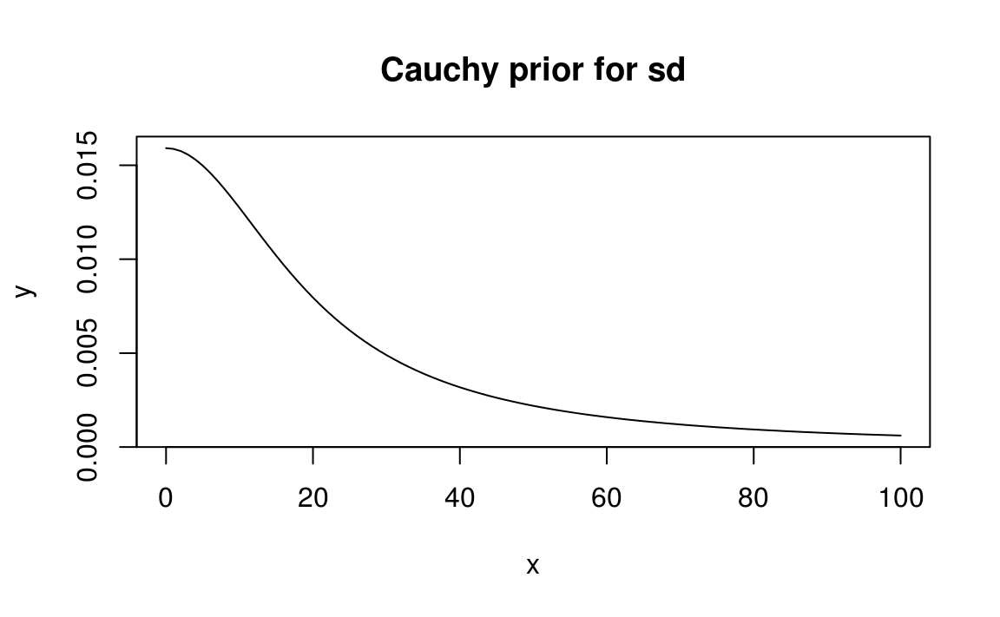
<p class="caption">(\#fig:unnamed-chunk-4)Cauchy prior</p>
</div>


```r
x <- 150:200
y <- dnorm(x, 0, 200)
plot(y ~ x, type = "l", main = "Normal prior for mu")
```

<div class="figure" style="text-align: center">
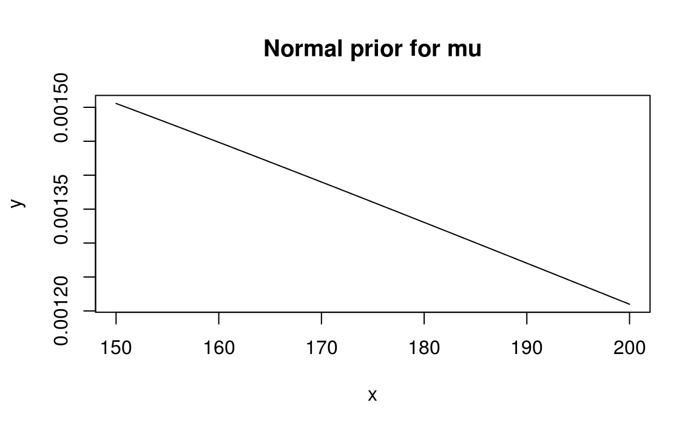
<p class="caption">(\#fig:unnamed-chunk-5)Normaaljaptuse prior</p>
</div>


```r
x <- 150:200
y <- dnorm(x, 178, 10)
plot(y ~ x, type = "l", main = "Another normal prior for mu")
```

<div class="figure" style="text-align: center">

<p class="caption">(\#fig:unnamed-chunk-6)veel üks Normaaljaptuse prior.</p>
</div>

Siin on valida kahe priori vahel mu-le. Võib-olla eelistaksid sina mõnda kolmandat? 
Kui jah, siis pole muud kui tee valmis ja kasuta!

Sama hästi võiksime tõepära modelleerida ka mõne muu jaotusega (Studenti t jaotus, eksponentsiaalne jaotus, lognormaaljaotus jne). 
Sel juhul oleksid meil erinevad parameetrid, mida tuunida, aga põhimõte on sama. 
Bayes on modulaarne --- kui sa põhimõtet tead, pole tehniliselt suurt vahet, millist mudelit soovid kasutada.

Näiteks:
```
heights ~ student_t(nu, mu, sigma) # t likelihood
nu ~ dunif( 1, 100) # uniform prior for the shape parameter
mu ~ dnorm(mean = 0, sd = 200) # normal prior for mean
sigma ~ dcauchy(0, 20) # half-cauchy prior for sd
```

Normaaljaotusel on 2 parameetrit, millele posteerior arvutada: mu (mean) ja sigma (sd). 
Seega on vaja ka kahte priorit, üks mu-le ja teine sigma-le.
Studenti t jaotuse korral lisandub veel üks parameeter: nu ehk jaotuse kuju määrav parameeter. 
nu-d saab tuunida 1 ja lõpmatuse vahel. 
Mida väiksem on nu, seda paksemad tulevad jaotuse sabad. 
Kui nu on suur, siis on t jaotuse kuju sama, mis normaaljaotusel. 
Siin andsime nu-le tasase priori 1 ja 100 vahel, hiljem proovime ka teisi prioreid nu-le.   

Studenti t jaotus on põnev alternatiiv normaaljaotusele, sest see on vähem tundlik outlieritele. 
Kuna normaaljaotus langeb servades väga kiiresti siis, kui meil on mõni andmepunkt, mis jääb jaotuse tipust kaugele, on ainus võimalus selle punkti normaaljaotuse alla mahutamiseks omistada jaotusele väga suur standardhälve. 
See muudab outlierit sisaldava normaaljaotuse ülemäära laiaks, mis viib analüüsis asjatult kaotatud efektidele. 
Seevastu t jaotuse sabasid saab nu abil üles-alla liigutada vastavalt sellele, kas andmed sisaldavad outliereid (selleks tuleb lihtsalt fittida nu parameeter andmete põhjal).

Outlierid toovad meile paksema sabaga jaotuse, mis tipu ümber ei lähe aga kaugeltki nii laiaks, kui samade andmetega fititud normaaljaotus.
    
    
### Kui lai on meie tõepärafunktsioon? {-}

Normaaljaotusega modelleeritud tõepärafunktsioon on normaaljaotus, mille `keskväärtus = mean(valim)` ja mille `standardhälve = sd(valim) / sqrt(N)`, kus N on valimi suurus. 
See tõepärafunktsioon modelleerib meie valimi keskväärtuse kohtamise tõenäosust igal võimalikul parameetriväärtusel. 
Kui oleme huvitatud USA presidentide keskmisest pikkusest, siis tõepärafunktsioon ütleb iga võimaliku pikkuse kohta, millise tõenäosusega kohtaksime oma valimi keskväärtust juhul, kui just see oleks tegelik presidentide keskmine pikkus. 
Sigma, mille posteeriori me mudelist arvutame, on aga standardhälve algsete andmepunktide tasemel. 
See on väga oluline eristus, sest sigma kaudu saab simueerida uusi andmepunkte.  

### Lihtne või robustne normaalne mudel? {-}

Proovime mudeldada simuleeritud andmete keskväärtust.


```r
set.seed(890775)
a <- rnorm(20, mean = 0, sd = 1) # expected mean = 0, sd = 1
b <- c(a, 5, 9) # plus 2 outliers
```

Siin kasutame andmeid, mille keskväärtus on 0.38 ja sd = 1 ja millele on lisatud kaks outlierit (5 ja 9). Proovime neid andmeid mudeldada normaaljaotusega tõepäramudeliga ja seejärel üle studenti t jaotuse. 
Me fitime 4 mudelit, neist 3 koos outlieritega. 
Mudeli fittimine käib nii, et mcmc ahelad sammuvad parameetriruumis ja iga samm annab meile ühe juhusliku väärtuse posteeriorist. 
Defaultina on meil üks ahel, mis teeb 1000 sammu (seda saab muuta: vt `?map2stan`). 
Kuna ahelad veedavad rohkem aega seal, kus posterioorne tõenäosuspilv on tihedam, siis saab nõnda sämplitud posteeriori juhuvalimi histogrammist posterioorse jaotuse kuju. 
Veelgi enam, selle asemel, et tegeleda posterioorsete jaotuste matemaatilise analüüsiga (integreerimisega) võime analüüsida oma mcmc sämpleid otse, mis tähendab, et kõrgema matemaatika asemel vajame 2. klassi aritmeetikat.

Kõigepealt ilma outlieriteta mudel normaalse tõepärafuktsiooniga. 
Me kasutame sd priorina pool-Cauchy jaotust, mille tipp on 0 kohal ja millel on piisavalt paks saba suuremate numbrite poole.
See on väheinformatiivne prior, mis on nähtud sd-de puhul mcmc algoritmides hästi töötavat. 
Andmed võime `map2stan()` funktsiooni sisestada nii listina kui data.frame-na (aga mitte tibble kujul). 


```r
# Ilma outlierita andmed
m0 <- map2stan(
  alist(
    y ~ dnorm(mu, sigma),  # normal likelihood
    mu ~ dnorm(0, 5), # normal prior for mean
    sigma ~ dcauchy(0, 2.5) # half-cauchy prior from sd 
  ),
  data = list(y = a))
```


Sama mudel, aga outlieritega andmed. `map2stan()` tõlgib sisestatud mudeli Stan keelde ja see mudel kompileeritakse C++ keelde, milles on kodeeritud Stani mcmc mootor. 
Kuna kompileerimine on ajakulukas, kasutame m1 fittimiseks rstan raamatukogu (see loetakse sisse rethinkingu depency-na) ja juba komplieeritud m0 mudelit, millele lisame andmed kahe elemendina: N annab andmete arvu ja y tegelikud andmeväärtused. 
Selline andmete sisestamise viis on omane Stanile - `map2stan()` arvutab ise kapoti all N-i.

```r
m1 <- stan(fit = m0@stanfit,
           data = list(N = length(b), 
                       y = b),
           chains = 4)
```


Nüüd studenti t jaotusega tõepäramudel. 
Argumendid cores = 4, chains = 4 tähendavad, et me jooksutame 4 mcmc ahelat kasutades selleks oma arvuti 4 tuuma. 
Mudeli m2 juures tähendab argument constraints(list(nu = "lower=1")), et mcmc sämpleri ahelad ei lähe kunagi allapoole ühte. 
See on siin kuna definitsiooni kohaselt ei saa nu olla väiksem kui 1.
Argument start annab listi, mis annab iga parameetri jaoks väärtuse, millest mcmc ahel posteeriori sämplimist alustab. See on vahest vajalik, sest kui mcmc ahelad hakkavad posteeriori tõenäosuspilve otsima kaugel selle tegelikust asukohast n-mõõtmelises ruumis (n = mudeli parameetrite arv), siis võib juhtuda, et mudeli fittimine ebaõnnestub ja te saate veateate. 


```r
m2 <- map2stan(
  alist(
    y ~ student_t(nu, mu, sigma),
    nu ~ dnorm(5, 10), 
    mu ~ dnorm(0, 5),
    sigma ~ dcauchy(0, 2.5)
    ),
  data = list(y = b),
  constraints = list(nu = "lower=1"),
  start = list(mu = mean(b), sigma = sd(b), nu = 10),
  cores = 4,
  chains = 4
)
```


```r
m2 <- readRDS("data/stan_m2.rds")
m2@stanfit
#> Inference for Stan model: y ~ student_t(nu, mu, sigma).
#> 4 chains, each with iter=2000; warmup=1000; thin=1; 
#> post-warmup draws per chain=1000, total post-warmup draws=4000.
#> 
#>         mean se_mean   sd   2.5%    25%    50%    75%  97.5% n_eff Rhat
#> mu      0.28    0.00 0.22  -0.11   0.14   0.27   0.41   0.76  2066    1
#> sigma   0.78    0.01 0.27   0.39   0.59   0.74   0.92   1.40  1254    1
#> nu      2.21    0.04 1.48   1.04   1.39   1.84   2.53   5.57  1644    1
#> dev    78.68    0.10 3.35  74.84  76.19  77.81  80.25  87.47  1057    1
#> lp__  -27.23    0.04 1.45 -31.06 -27.86 -26.88 -26.16 -25.55  1323    1
#> 
#> Samples were drawn using NUTS(diag_e) at Mon Oct 23 15:51:33 2017.
#> For each parameter, n_eff is a crude measure of effective sample size,
#> and Rhat is the potential scale reduction factor on split chains (at 
#> convergence, Rhat=1).
```

Ja viimasena studenti t mudel, kus nu on fikseeritud konstandina. Kuna me ei fiti nu-d mudeli parameetrina, pole meil vaja ka priorit nu-le. Me teeme selle mudeli, sest nu täpsel väärtusel pole väga suurt mõju tulemustele. Me lihtsalt fikseerime nu suvalisele väärtusele, mis annab t jaotusele piisavalt paksud sabad.


```r
m3 <- map2stan(
  alist(
    y ~ student_t(4, mu, sigma),
    mu ~ dnorm(0, 5),
    sigma ~ dcauchy(0, 2.5)
  ),
  data = list(y = b),
  constraints = list(nu = "lower=1"),
  start = list(mu = mean(b), sigma = sd(b)),
  cores = 4,
  chains = 4)
```


Üks esimesi asju mida koos parameetrite vaatamisega teha on lisaks vaadata, kas ka ahelad konvergeerusid.
Selleks saab mugavalt kasutada `rethinking::tracerplot()` funktsiooni.


```r
tracerplot(m2)
```

<div class="figure" style="text-align: center">
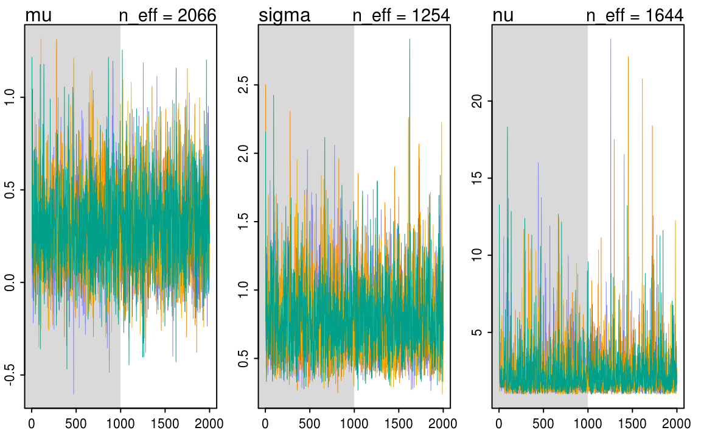
<p class="caption">(\#fig:unnamed-chunk-16)Traceplot markovi ahelate inspekteerimiseks</p>
</div>

Pildilt on näha, et neli ahelat (4 värvi) on hästi konvergeerunud. Hall ala on nn warmup ala, mille tulemusi ei salvestata. Muidu astub iga ahel sammu kaupa ja iga edukas samm salvestatakse ühe posteeriori väärtusena. Ahel sämplib korraga mu, sigma ja nu väärtusi n-mõõtmelises ruumis (n = mudeli parameetrite arv), mis tähendab, et ahela iga samm salvestatakse n kõrvuti numbrina. 

Kui näit sigma kõrgema väärtusega kaasneb keskeltäbi kõrgem (või madalam) mu väärtus, on sigma ja mu omavahel korreleeritud. 
Et kontrollida parameetrite posterioorsete väärtuste korrelatsioone kasutame funktsiooni `rethinking::pairs()`:


```r
pairs(m2)
```

<div class="figure" style="text-align: center">
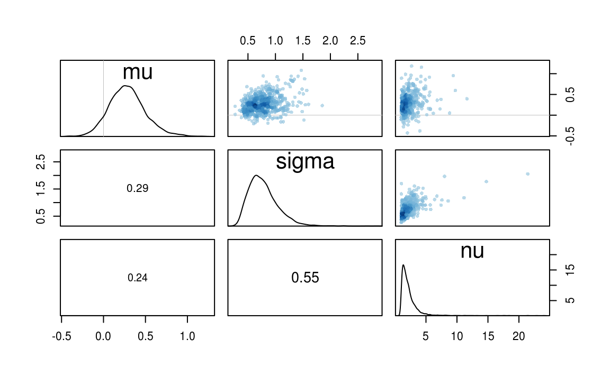
<p class="caption">(\#fig:unnamed-chunk-17)korrelatsiooniplot mudeli parameetritele.</p>
</div>

Normaaljaotus on selle poolest eriline, et tema parameetrid mu ja sigma ei ole korreleeritud. 
Paljud teised mudelid ei ole nii lahked. 
Siin on meil mõõdukas korrelatsioon nu ja sigma vahel. 
See on igati loogiline ja ei häiri meid.

### MCMC ahelate kvaliteet {-}

Kui Rhat on 1, siis see tähendab, et MCMC ahelad on ilusti jooksnud ja posteeriori sämplinud. 
Kui Rhat > 1.1, siis on probleem.
Suur Rhat viitab, et ahel(ad) pole jõudnud konvergeeruda. 
Kui ahelad ei konvergeeru, siis võib karta, et nad ei sämpli ka sama posteeriori jaotust. Kontrolli, kas mudeli kood ei sisalda vigu. 
Kui ei, siis vahest aitab, kui pikendada warm-up perioodi (`map2stan(..., iter = 3000, warmup = 2000)` pikendab *default* warm-upi 2 korda). 
Vahest aitab mudeli re-parametriseerimine (siin on lihtne trikk tekitada priorid, mis ei erineks väga palju oma vahemiku poolest; sellega kaasneb sageli andmete tsentreerimine või standardiseerimine; vt allpool).

n_eff on efektiivne valimi suurus, mis hindab iseseisvalt sämplitud andmete arvu ning see ei tohi olla väga väike. 
Kui n_eff on palju väiksem kui jooksutatud markovi ahela pikkus (iga ahel on defaultina 1000 iteratsiooni pikk), on ahel jooksnud ebaefektiivselt. 
See ei tähenda tingimata, et posteerior vale oleks. 
Reegilina peaks Neff/N > 0.1

Ahelad peavad plotitud kujul välja nägema nagu karvased tõugud, mis on ilma paljaste laikudeta.
Kui ahelad omavad pikki sirgeid lõike (n_eff tuleb siis väga madal), kus ahel ei ole töötanud, siis see rikub korralikult posteeriori. 
Tüüpiliselt aitavad nõrgalt informatiivsed priorid --- priorite õige valik on sama palju arvutuslik vajadus kui taustainfo lisamine. 
Igal juhul tuleb vältida aladefineeritud tasaseid prioreid, mis võimaldavad ahelatel sämplida lõpmatust ja sel viisil õige tee kaotada. 
Peale selle, tasased priorid, mis ütlevad, et kõik parameetri väärtused on võrdselt tõenäolised, kajastavad harva meie tegelikke taustateadmisi.

Halvad WARNING-ud: divergent transitions (too many), BMFI too low --- võivad tähendada, et ahelad ei tööta korralikult. WARNING-ute kohta saad abi siit http://mc-stan.org/misc/warnings.html.

Ilusamad parameetriplotid saab kasutades "bayesplot" raamatukogu funktsioone.

Esiteks usalduspiirid:

```r
library(bayesplot)
fit2d <- as.data.frame(m2@stanfit)
pars <- names(fit2d)

# inner interval = 50% CI and outer interval = 95% CI.
mcmc_intervals(fit2d, 
               pars = pars[1:3], 
               prob = 0.5, 
               prob_outer = 0.90)
```

<div class="figure" style="text-align: center">
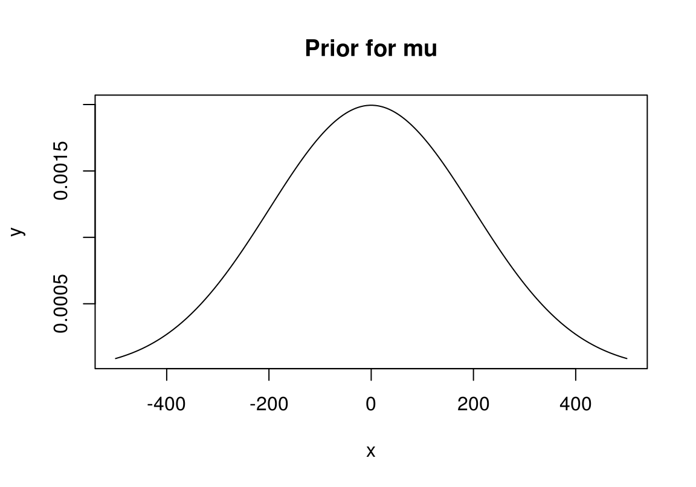
<p class="caption">(\#fig:unnamed-chunk-18)Posteeriorite CI plot</p>
</div>

Ja teiseks täis posteeriorid.

```r
mcmc_areas(fit2d, pars = pars[1:2], prob = 0.8)
```

<div class="figure" style="text-align: center">
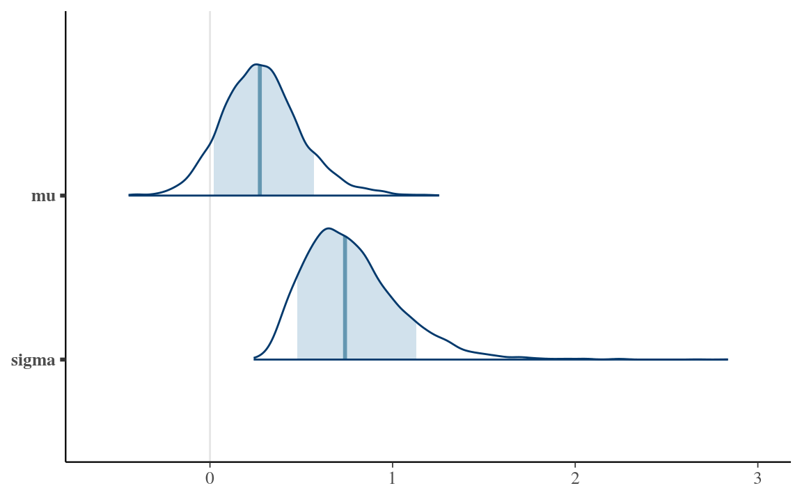
<p class="caption">(\#fig:unnamed-chunk-19)Posteeriorite tihedusplot.</p>
</div>


Funktsiooniga `rethinking::extract.samples()` saame koos sämplitud parameetrite numbrid kõrvuti (rea kaupa) tabelisse. 


```r
m2sampl <- extract.samples(m2) %>% 
  as.data.frame() %>% 
  mutate(CV = sigma / mu)
```

Sellest tabelist võib arvutada posteerioreid ka uutele "väljamõeldud" parameetritele. 
Näiteks arvutame posteeriori CV-le:


```r
ggplot(m2sampl, aes(CV)) + 
  geom_density(breaks = seq(0, 1, by = 0.1)) + 
  xlim(0, 10)
#> Warning: Ignoring unknown parameters: breaks
#> Warning: Removed 609 rows containing non-finite values (stat_density).
```

<div class="figure" style="text-align: center">
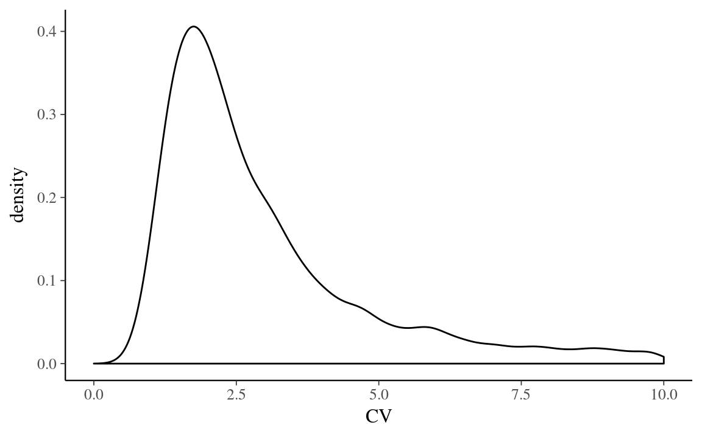
<p class="caption">(\#fig:unnamed-chunk-21)Posteerior uuele parameetrile</p>
</div>

Kuna posteerior iseloomustab meie teadmiste piire, siis võime selle abil küsida, kui suure tõenäosusega jääb tõeline CV näiteks parameetrivahemikku 2 kuni 5?


```r
intv <- filter(m2sampl, between(CV, 2, 5)) %>% nrow(.) / nrow(m2sampl)
intv
#> [1] 0.415
```

Vastus on, et me arvame 42 kindlusega, et tõde jääb kuskile sellesse vahemikku.

Võime ka küsida, millesesse vahemikku jääb näiteks 67% meie usust mu tõelise väärtuse kohta? 


```r
HPDI(m2sampl$CV, prob = 0.67)
#> |0.67 0.67| 
#> 0.964 4.058
```

Nüüd võrdleme nelja fititud mudelit, et otsustada, milline mudel kirjeldab kõige paremini outlieritega andmeid. 
m0 on ilma outlierita mudel ja me tahame teada, milline mudel m1, m2 või m3 annab sellele kõige lähedasemad tulemused. 


```r
coeftab_plot(coeftab(m0, m1, m2, m3), 
             pars = c("mu", "sigma"), 
             prob = 0.5)
```

<div class="figure" style="text-align: center">

<p class="caption">(\#fig:unnamed-chunk-24)Võrdlev plot mitme mudeli posteerioritele.</p>
</div>

Me sättisime usalduspiirid 0.5 peale, mis tähendab, et need ennustavad, kuhu peaks mudeli järgi jääma parameetri tegelik väärtus 50%-se tõenäosusega. 
Nagu näha, on m2 ja m3 posteeriorid palju lähemal m0-le kui normaaljaotusega fititud m1 oma.
Eriti drastilised on erinevused sigma hinnangule. 
Lisaks, m1 mudeli mu usaldusintervall on palju laiem kui m0, m2 ja m3 oma --- mudel nagu saaks aru, et andmed lõhnavad kala järgi.

### Näide: USA presidentide keskmine pikkus {-}

Läheme tagasi normaaljatuse ja USA presidentide juurde. 
Kõigepealt defineerime priorid. 
Alati on mõistlik priorid välja joonistada ja vaadata, kas nad vastavad meie ootustele. 
Pea meeles, et sigma ehk sd on samades ühikutes, mis mõõtmisandmed. 

Kui sulle need priorid ei meeldi, tuuni priorite parameetreid ja proovi uuesti plottida.


```r
x <- -500:500
y <- dnorm(x, 0, 200)
plot(x, y, main = "Prior for mu", type = "l")
```

<div class="figure" style="text-align: center">
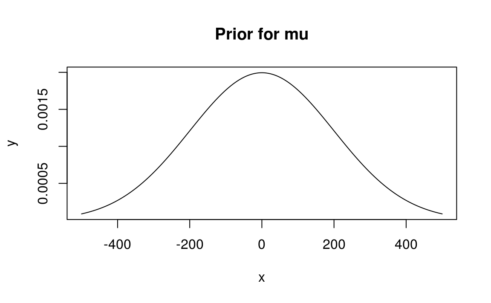
<p class="caption">(\#fig:unnamed-chunk-25)Prior keskmisele.</p>
</div>

Siin kasutame nõrgalt informatiivseid prioreid. 
Idee on selles, et normaaljaotus, mis on tsentreeritud 0 ümber, tõmbab meie posteeriorit nõrgalt nulli poole (nõrgalt, sest jaotus on hästi lai võrreldes tõepärafunktsiooniga). 
Pane tähele, et oma priori kohaselt usume me, et 50% tõenäususega on USA presidentide keskmine pikkus negatiivne. 
See prior on tehniline abivahend, mitte meie tegelike uskumuste peegeldus presidentide kohta. 
Aga tehniliselt kõik töötab selles mõttes, et andmed domineerivad posteeriori üle ja priori sisuliselt ainus ülesanne on veidi MCMC mootori tööd lihtsustada. 

Sigma priorina kasutame half-Cauchy jaotust, mis on samuti väheinformatiivne. 
Half-Cauchy ei saa olla < 0 ja on meile soodsa kujuga sest annab suurema tõenäosuse nullile lähemal asuvatele sd-väärtustele --- aga samas, kuna ta on paksu sabaga, ei välista see ka päris suuri sd väärtusi.


```r
x <- 0:200
y <- dcauchy(x , 0, 10)
plot(x, y, main = "Prior for sigma", type = "l")
```

<div class="figure" style="text-align: center">
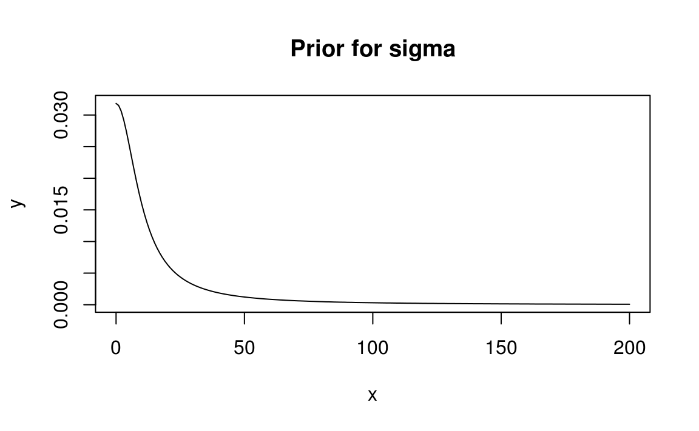
<p class="caption">(\#fig:unnamed-chunk-26)Prior SD-le</p>
</div>

Tekitame andmeraami analüüsiks ja mudeli, mis põhineb normaalsel tõepärafunktsioonil.


```r
heights <- c(183, 192, 182, 183, 177, 185, 188, 188, 182, 185)
us_presidents <- data_frame(Height = heights, id = "usa")
potusm1 <- map2stan(
  alist(
    Height ~ dnorm(mu, sigma), # normal likelihood
    mu ~ dnorm(0, 200), # normal prior for mean
    sigma ~ dcauchy(0, 10) # half-cauchy prior from sd 
  ), data = us_presidents
)
```


Mudeli koefitsiendid:


```r
precis(potusm1)
#>        Mean StdDev lower 0.89 upper 0.89 n_eff Rhat
#> mu    184.5    1.5     181.90     186.71   482    1
#> sigma   4.7    1.3       2.87       6.36   471    1
```

Nüüd teeme katse võrrelda USA presidentide ja Euroopa ning mujalt pärit riigijuhtide keskmisi pikkusi.
Kõigepealt loome analüüsitava andmeraami.

```r
world_leaders <- read_csv2("data/world_leaders.csv")
presidents <- world_leaders %>% 
  select(Country, Height) %>% 
  bind_rows(us_presidents)
knitr::kable(head(presidents))
```


Country    Height
--------  -------
Canada        188
Cuba          190
France        170
France        165
France        189
France        172

Ja siin on mudel. 
Nüüd on mu ümber defineeritud kui mu1[indeks], mis tähendab, et mu1 saab kaks hulka väärtusi, üks kummagil indeks muutuja tasemel. 
Sellega jagame oma andmed kahte ossa (USA versus Euroopa ja muu maailm), mida analüüsime eraldi. 
Sigma on mõlemale kontinendile sama, mis tähendab, et mudel eeldab, et presidentide pikkuste jaotus on mõlemal kontinendil identne.


```r
# Split into 2 groups
presidents <- presidents %>% 
  mutate(Groups = case_when(
    Country == "USA" ~ "USA",
    Country != "USA" ~ "World"
  ))
```

Adult human height varies country-by-country, we take 170 cm as relatively safe prior for male height.

```r
potusm2 <- map2stan(
  alist(
    Height ~ dnorm(mu, sigma),
    mu <- mu_1[Groups], # mu is redifined as mu_1, which takes values at each indeks level
    mu_1[Groups] ~ dnorm(170, 10), # normal prior for mean
    sigma ~ dcauchy(0, 10) # half-cauchy prior from sd 
  ),
  data = presidents)
```


```r
precis(potusm2, depth = 2)
#>          Mean StdDev lower 0.89 upper 0.89 n_eff Rhat
#> mu_1[1] 182.8   3.57     177.11      188.2   885    1
#> mu_1[2] 176.3   1.85     173.33      179.2   836    1
#> sigma    11.7   1.26       9.86       13.8   628    1
```

Me võime ka vaadata 2 grupi standardhälbeid lahus.
Järgnevas mudelis on mõistlik ahelale stardipositsioon ette anda.


```r
## Calculate start values
startvalues <- presidents %>% 
  group_by(Groups) %>% 
  summarise_at(vars(Height), funs(mean, sd))
## Fit model
potusm2.1 <- map2stan(
  alist(
    Height ~ dnorm(mu, sigma),
    mu <- mu_1[Groups],
    sigma <- sigma_1[Groups],
    mu_1[Groups] ~ dnorm(170, 10), # normal prior for mean
    sigma_1[Groups] ~ dcauchy(0, 10) # half-cauchy prior from sd 
  ),
  data = presidents, 
  start = list(mu_1 = startvalues$mean,
               sigma_1 = startvalues$sd)
)
```


```r
tracerplot(potusm2.1, n_cols = 2)
```

<div class="figure" style="text-align: center">
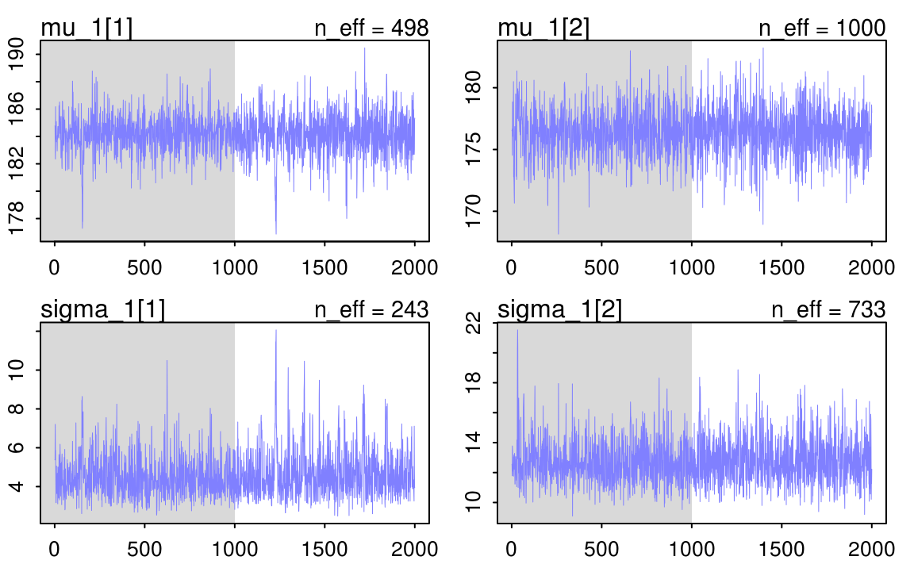
<p class="caption">(\#fig:unnamed-chunk-37)Traceplot.</p>
</div>


Tulemus ES-i osas tuleb üsna sarnane.

```r
plot(coeftab(potusm2, potusm2.1))
```

<div class="figure" style="text-align: center">
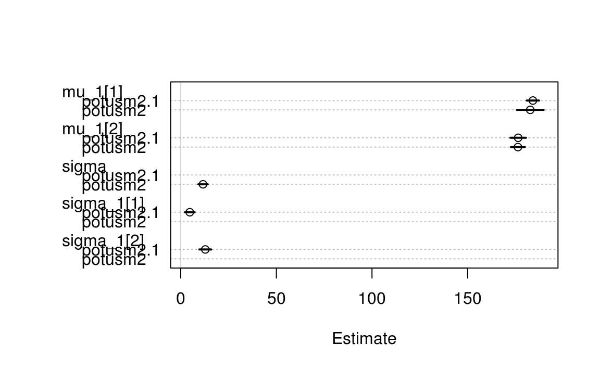
<p class="caption">(\#fig:unnamed-chunk-38)mudelite võrdlusplot.</p>
</div>


```r
precis(potusm2, depth = 2)
#>          Mean StdDev lower 0.89 upper 0.89 n_eff Rhat
#> mu_1[1] 182.8   3.57     177.11      188.2   885    1
#> mu_1[2] 176.3   1.85     173.33      179.2   836    1
#> sigma    11.7   1.26       9.86       13.8   628    1
```

Siin tuleb kasulik trikk: me lahutame rea kaupa mu1[1] posteeriori sampli liikmed mu1[2] sampli liikmetest. 
Nii saame posteeriori efekti suurusele ehk hinnangu sellele, mitme cm võrra on USA presidendid keskmiselt pikemad kui Euroopa omad!


```r
samplespm2 <- extract.samples(potusm2) %>% 
  as.data.frame() %>% 
  mutate(ES = mu_1.1 - mu_1.2)
dens(samplespm2$ES)
```

<div class="figure" style="text-align: center">
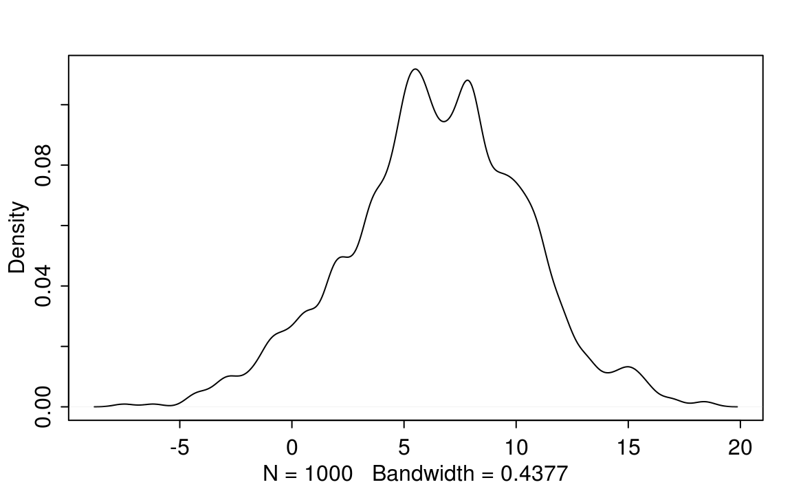
<p class="caption">(\#fig:unnamed-chunk-40)Posteerior ES-le.</p>
</div>


```r
median(samplespm2$ES)
#> [1] 6.56
rethinking::HPDI(samplespm2$ES, prob = 0.9)
#>  |0.9  0.9| 
#> -1.09 12.02
mean(samplespm2$ES < 0)
#> [1] 0.065
```

Võrdse SD-ga mudeli järgi on USA presidendid keskeltläbi 6.6 cm pikemad, ebakindlus selle hinnangu ümber on suur -- 90% HDI on -1.1 kuni 12 ja tõenäosus et pikkuste erinevus on väiksem kui 0 on 0.06.


```r
samplesm2.1 <- extract.samples(potusm2.1) %>% 
  as.data.frame() %>% 
  mutate(ES = mu_1.1 - mu_1.2)
median(samplesm2.1$ES)
#> [1] 7.54
HPDI(samplesm2.1$ES, prob = 0.9)
#>  |0.9  0.9| 
#>  3.39 12.16
mean(samplesm2.1$ES < 0)
#> [1] 0.001
```

Erineva SD-ga mudeli järgi on riigijuhtide pikkuste vahe 7.5 cm, ebakindlus väiksem -- 90% HDI on 3.4 kuni 12.2 ja tõenäosus et pikkuste erinevus on väiksem kui 0 on 0.

See ei tähenda tingimata, et me peaksime eelistama teist mudelit. Oluline on, mida me teoreetiliselt usume, kas seda, et tegelik presidentide varieeruvus on USAs ja Euroopas võrdne, või mitte.

## Lineaarne regressioon {-}

Eelmises peatükis hindasime ühe andmekogu (näiteks mõõdetud pikkuste) põhjal ehitatud mudelite parameetreid (näiteks keskmist ja statndardhälvet). Nüüd astume sammu edasi ja hindame kahe muutuja (näiteks pikkuse ja kaalu) koos-varieeruvust. Selleks ehitame mudeli, mis sisaldab mõlemaid muutujaid ja küsime: kui palju sõltub y varieeruvus x varieeruvusest. Lihtsaim viis sellele küsimusele läheneda on lineaarse regressiooni kaudu. Me ehitame lineaarse mudeli, mis vaatab kaalu-pikkuse paare (igal subjektil mõõdeti kaal ja pikkus ning mudel vaatab kaalu ja pikkuse koos-varieeruvust subjektide vahel). Enam ei tohiks tulla üllatusena, et meie arvutused ei anna numbrilist hinnangut mitte teaduslikule küsimusele selle kohta kuidas *y*-i väärtused sõltuvad *x*-i väärtustest, vaid mudeli parameetritele. Meie mudel on sirge võrrand $y = a + b*x$ ja tavapärases R-i notatsioonis kirjutatakse see *y~x*. 

Kuna pikkused ja kaalud on igavad, proovime vaadata kuidas riigi keskmine eluiga on seotud riigi rikkusega.

## `lm()` - vähimruutude meetodiga fititud lineaarsed mudelid {-}

Kautame gapminder andmeid aastast 2007.

```r
library(gapminder)
# Select only data from year 2007
g2007 <- gapminder %>% filter(year == 2007)
knitr::kable(head(g2007))
```


country       continent    year   lifeExp        pop   gdpPercap
------------  ----------  -----  --------  ---------  ----------
Afghanistan   Asia         2007      43.8   31889923         975
Albania       Europe       2007      76.4    3600523        5937
Algeria       Africa       2007      72.3   33333216        6223
Angola        Africa       2007      42.7   12420476        4797
Argentina     Americas     2007      75.3   40301927       12779
Australia     Oceania      2007      81.2   20434176       34435

Enne kui SKP ja eluea seoseid otsima hakkame, vaatame, mis juhtub, kui me arvutame ainult interceptiga mudeli, kus puudub SKP (kasutades lihtsuse mõttes mudeli fittimiseks nn vähimruutude meetodit `lm()` funktsiooni abil).


```r
gapmod1 <- lm(lifeExp ~ 1, data = g2007)
summary(gapmod1)
#> 
#> Call:
#> lm(formula = lifeExp ~ 1, data = g2007)
#> 
#> Residuals:
#>    Min     1Q Median     3Q    Max 
#> -27.39  -9.85   4.93   9.41  15.60 
#> 
#> Coefficients:
#>             Estimate Std. Error t value Pr(>|t|)    
#> (Intercept)    67.01       1.01    66.1   <2e-16 ***
#> ---
#> Signif. codes:  0 '***' 0.001 '**' 0.01 '*' 0.05 '.' 0.1 ' ' 1
#> 
#> Residual standard error: 12.1 on 141 degrees of freedom
```

Ok, intercept = 67. 
Mida see tähendab?

```r
mean(g2007$lifeExp)
#> [1] 67
```

See on lihtsalt parameetri, mida me ennustame, keskmine väärtus ehk keskmine eluiga üle kõikide riikide.

Nüüd fitime mudeli, kus on olemas SKP ja eluea seos aga puudub lõikepunkt.

```r
gapmod2 <- lm(lifeExp ~ 0 + gdpPercap, data = g2007)
summary(gapmod2)
#> 
#> Call:
#> lm(formula = lifeExp ~ 0 + gdpPercap, data = g2007)
#> 
#> Residuals:
#>    Min     1Q Median     3Q    Max 
#>  -65.5   17.6   44.9   54.7   67.0 
#> 
#> Coefficients:
#>           Estimate Std. Error t value Pr(>|t|)    
#> gdpPercap 0.002951   0.000218    13.5   <2e-16 ***
#> ---
#> Signif. codes:  0 '***' 0.001 '**' 0.01 '*' 0.05 '.' 0.1 ' ' 1
#> 
#> Residual standard error: 45.1 on 141 degrees of freedom
#> Multiple R-squared:  0.565,	Adjusted R-squared:  0.562 
#> F-statistic:  183 on 1 and 141 DF,  p-value: <2e-16
```


```r
p <- ggplot(g2007, aes(gdpPercap, lifeExp)) +
  geom_point() + 
  geom_line(aes(y = .fitted), data = gapmod2)
p
```

<div class="figure" style="text-align: center">
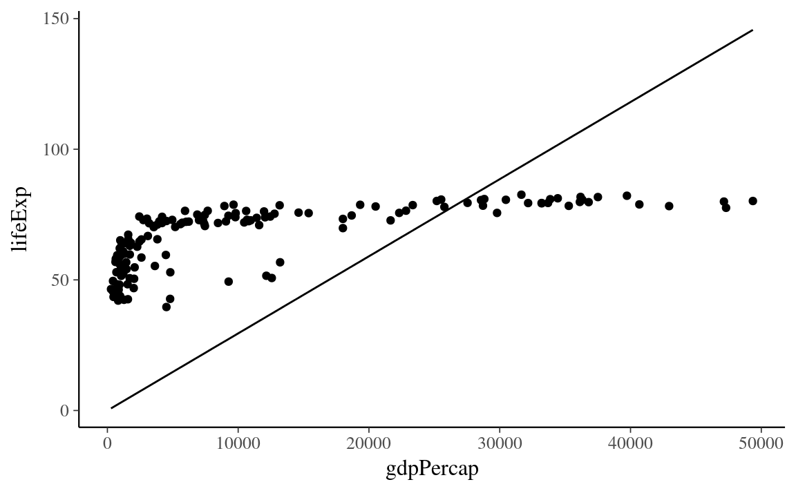
<p class="caption">(\#fig:unnamed-chunk-47)Nulli surutud interceptiga lineaarne regressioon eluea sõltuvusele SKP-st.</p>
</div>


Nüüd on intercept surutud väärtusele y = 0.

Ja lõpuks täismudel

```r
gapmod3 <- lm(lifeExp ~ gdpPercap, data = g2007)
summary(gapmod3)
#> 
#> Call:
#> lm(formula = lifeExp ~ gdpPercap, data = g2007)
#> 
#> Residuals:
#>    Min     1Q Median     3Q    Max 
#> -22.83  -6.32   1.92   6.90  13.13 
#> 
#> Coefficients:
#>             Estimate Std. Error t value Pr(>|t|)    
#> (Intercept) 5.96e+01   1.01e+00    59.0   <2e-16 ***
#> gdpPercap   6.37e-04   5.83e-05    10.9   <2e-16 ***
#> ---
#> Signif. codes:  0 '***' 0.001 '**' 0.01 '*' 0.05 '.' 0.1 ' ' 1
#> 
#> Residual standard error: 8.9 on 140 degrees of freedom
#> Multiple R-squared:  0.461,	Adjusted R-squared:  0.457 
#> F-statistic:  120 on 1 and 140 DF,  p-value: <2e-16
```


```r
p + geom_line(aes(y = .fitted), data = gapmod3, color = "#FDE725FF")
```

<div class="figure" style="text-align: center">
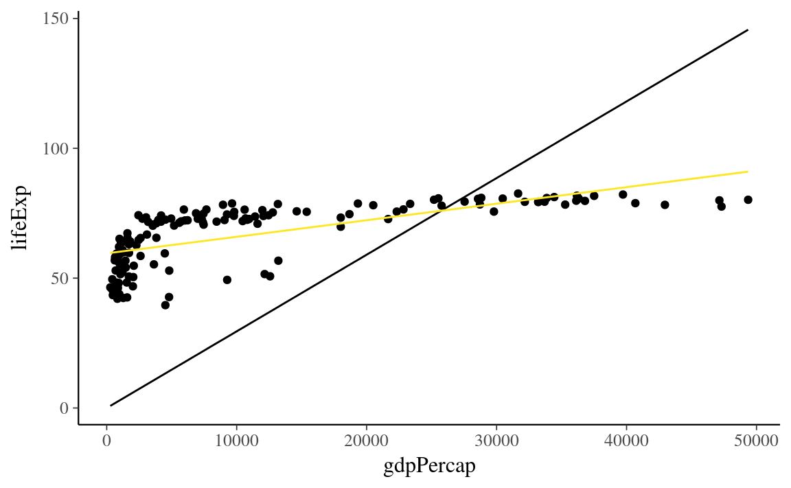
<p class="caption">(\#fig:unnamed-chunk-49)Täismudeliga regressioon.</p>
</div>


Kuidas me seda m3 mudelit tõlgendame?
Esiteks, Intercept on 59.6, mis tähendab, et mudel ennustab, et kui riigi SKP = 0 USD, siis selle riigi elanime keskmine euliga on ligi 60 aastat. 
See on selgelt imelik, sest ühegi riigi SKP ei ole null, ja kui oleks, oleks seal ka eluiga 0 (selle järgi peaksime eelistama mudelit gapmod2, kus me oleme intercepti nulli surunud).


Teiseks, koefitsient b = 0.00064, mis on üsna väike arv. See tähendab, et SKP tõus 1 USD võrra tõstab eluiga keskmiselt 0.00064 aasta võrra (ja SKP tõus 1000 USD võrra tõstab eluiga 0.64 aasta võrra). 
Muidugi ainult siis, kui uskuda mudelit.

Kolmandaks, adjusted R squared on 0.46, mis tähendab et mudeli järgi seletab SKP varieerumine 46% eluea varieeruvusest riikide vahel.

Hea küll, aga milline mudel on siis parim? 

```r
knitr::kable(AIC(gapmod1, gapmod2, gapmod3))
```

           df    AIC
--------  ---  -----
gapmod1     2   1113
gapmod2     2   1487
gapmod3     3   1028

AIC on *Aikake informatsiooni kriteerium*, mis võtab arvesse nii mudeli fiti headuse kui mudeli parameetrite arvu. 
Kuna R saab parameetreid lisades ainult kasvada ja me teame, et mingist hetkest oleme niikuinii oma mudeli üle fittinud, siis otsime AIC-i abil kompromissi: võimalult hea fit võimalikult väikese parameetrite arvuga. 
AIC on suhteline mõõt, selle absoluutnäit ei oma mingit tähendust. 
Me eelistame väiksema AIC-ga mudelit nende mudelite seast, mida me võrdleme. 
See ei tähenda, et võitnud mudel oleks hea mudel --- alati on võimalik, et kõik head mudelid jäid võrdlusest välja. 

Seega parim mudel on gapmod3 ja kõige kehvem on gapmod2, mille lõikepunkt on realistlikult nulli fikseeritud! 

## Bayesi meetodil lineaarse mudeli fittimine {-}

Nüüd Bayesi mudelid. 
"rethinking" paketi `glimmer()` on abivahend, mis konverteerib `lm()` mudeli kirjelduse Bayesi mudeli kirjelduseks kasutades normaaljaotusega tõepära mudelit.
Intercept only model

```r
intercept_only <- glimmer(lifeExp ~ 1, data = g2007)
#> alist(
#>     lifeExp ~ dnorm( mu , sigma ),
#>     mu <- Intercept,
#>     Intercept ~ dnorm(0,10),
#>     sigma ~ dcauchy(0,2)
#> )
```

Ainult interceptiga mudel. 
Keskväärtus ehk mu on ümber defineeritud kui intercept, aga see annab talle lihtsalt uue nime. 
Sama hästi oleksime võinud fittida mudelit, kus hindame otse mu keskväärtust (nagu me eelmises peatükis tegime). 
Pane tähele, et võrreldes `lm()` funktsiooniga on meil mudelis lisaparameeter --- sigma. 
Kui Intercept annab meile keskmise eluea, siis sigma annab eluigade standardhälbe riikide vahel.

> Kui me tahame fittida lineaarset mudelit, siis peab tõepära funktsioon olema kas normaaljaotus või studenti t jaotus.


```r
gapmod4 <- map2stan(flist = intercept_only$f, data = intercept_only$d)
```


```r
precis(gapmod4)
#>           Mean StdDev lower 0.89 upper 0.89 n_eff Rhat
#> Intercept 66.3   0.99       64.6       67.8   694    1
#> sigma     12.1   0.71       11.0       13.2   554    1
```

Nüüd ilma interceptita mudel

```r
no_intercept <- glimmer(lifeExp ~ -1 + gdpPercap, data = g2007)
#> alist(
#>     lifeExp ~ dnorm( mu , sigma ),
#>     mu <- b_gdpPercap*gdpPercap,
#>     b_gdpPercap ~ dnorm(0,10),
#>     sigma ~ dcauchy(0,2)
#> )
```

Selline Bayesi mudeli esitus on "ilusam" kui `lm()` sest ta toob mudeli eksplitsiitselt välja (samas kui lm notatsioon ütleb, et mudel on "miinus intercept") 


```r
gapmod5 <- map2stan(flist = no_intercept$f, data = no_intercept$d)
```


```r
precis(gapmod5)
#>             Mean StdDev lower 0.89 upper 0.89 n_eff Rhat
#> b_gdpPercap  0.0   0.00        0.0        0.0   888    1
#> sigma       45.2   2.75       40.8       49.4   187    1
```

Ja lõpuks täismudel:

```r
full_model <- glimmer(lifeExp ~ gdpPercap, data = g2007)
#> alist(
#>     lifeExp ~ dnorm( mu , sigma ),
#>     mu <- Intercept +
#>         b_gdpPercap*gdpPercap,
#>     Intercept ~ dnorm(0,10),
#>     b_gdpPercap ~ dnorm(0,10),
#>     sigma ~ dcauchy(0,2)
#> )
```


```r
gapmod6 <- map2stan(flist = full_model$f, data = full_model$d)
```


```r
compare(gapmod4, gapmod5, gapmod6)
#>         WAIC pWAIC dWAIC weight    SE   dSE
#> gapmod6 1028   2.6   0.0      1 14.07    NA
#> gapmod4 1113   1.5  85.7      0 12.09  9.67
#> gapmod5 1486   0.8 458.8      0  7.29 15.70
```

Jälle on täismudel võitja ja kui intercept nulli suruda, saame kehveima tulemuse.
Siin me kasutame AIC-i Bayesi analoogi WAIC, mis nende mudelite peal peaks töötama veidi paremini kui AIC. 
Aga see on tehniline detail.
WAIC abil mudeleid võrreldes saame muuhulgas mudeli kaalu. 
Antud juhul on 100% kaalust gapmo6-l ja ülejäänud mudelitele ei jää midagi.


```r
plot(coeftab(gapmod4, gapmod5, gapmod6))
```

<div class="figure" style="text-align: center">
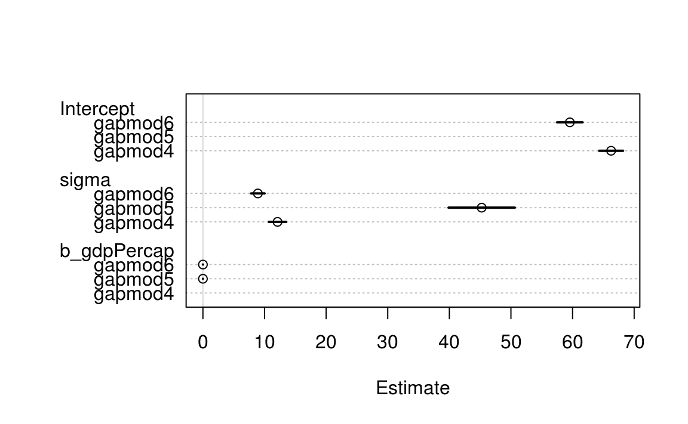
<p class="caption">(\#fig:unnamed-chunk-64)Mudelite võrdlusplot.</p>
</div>


Viime SKP andmed log-skaalasse ja proovime uuesti. See tähendab, et me arvame, et iga SKP kümnekordne tõus võiks kaasa tuua eluea tõusu x aasta võrra.

```r
g2007 <- g2007 %>% 
  mutate(l_GDP = log10(gdpPercap))
# glimmer(lifeExp ~ -1 + l_GDP, data = g2007)
gapmod7 <- map2stan(alist(
    lifeExp ~ dnorm(mu, sigma),
    mu <- b_gdp * l_GDP,
    b_gdp ~ dnorm(0, 10),
    sigma ~ dcauchy(0, 2)
), data = g2007)

gapmod8 <- map2stan(alist(
    lifeExp ~ dnorm(mu, sigma),
    mu <- Intercept + b_gdp * l_GDP,
    Intercept ~ dnorm(0, 100),
    b_gdp ~ dnorm(0, 10),
    sigma ~ dcauchy(0, 2)
), data = g2007)
```


```r
compare(gapmod4, gapmod5, gapmod6, gapmod7, gapmod8)
#>         WAIC pWAIC dWAIC weight    SE   dSE
#> gapmod7  965   3.0   0.0   0.53 25.11    NA
#> gapmod8  966   3.8   0.2   0.47 25.37  2.56
#> gapmod6 1028   2.6  62.4   0.00 14.07 18.21
#> gapmod4 1113   1.5 148.1   0.00 12.09 23.18
#> gapmod5 1486   0.8 521.1   0.00  7.29 26.82
```


<div class="figure" style="text-align: center">
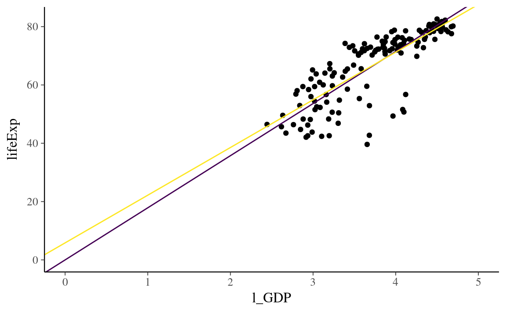
<p class="caption">(\#fig:unnamed-chunk-68)Log skaalas töötab nulli surutud interceptiga mudel sama hästi kui täismudel. See ei ole paraku mudeldamise üldine omadus.</p>
</div>

Kuna Bayesi mudelite fittimine on keerulisem kui `lm()` abil, on eriti tähtis fititud mudel välja plottida. 
See on esimene kaitseliin lollide vigade ja halvasti jooksvate Markovi ahelate vastu. 

Kui Bayesi mudeleid on raskem fittida, siis milleks me peaksime neid eelistama tavalistele vähimruutude meetodil fititud mudelitele? 
Tegelikult alati ei peagi. 
Aga siiski, Bayesi mudelid sisaldavad eksplitsiitset veakomonenti (sigma), mis on kasulik mudelist uusi andmeid ennustades. 
Samuti annavad nad parima hinnangu ebakindlusele parmeetrite väärtuste hinnangute ümber, võimaldavad mudeli fittimisel siduda andmeid taustainfoga (prior) ning, mis kõige tähtsam, võimaldavad paindlikumalt fittida hierarhilisi mudeleid (nende juurde tuleme hiljem). 

Samas, kui prior on väheinformatiivne, siis Bayesi hinnangud mudeli koefitsientide kõige tõenäolisematele väärtustele on praktiliselt samad, kui vähimruutude meetodiga `lm()` abil saadud punkt-hinnangud.

Siin me fitime pedagooglistel kaalutlustel kõike Bayesiga aga praktikas jätavad paljud mõistlikud inimesed Bayesi hierarhiliste mudelite jaoks ja kasutavad lihtsate mudelite jaoks `lm()`. 

Tagasi gapmod7 ja gapmod8 mudelite juurde. 
Plotime nende koefitsiendid koos usalduspiiridega.

```r
plot(coeftab(gapmod7, gapmod8))
```

<div class="figure" style="text-align: center">
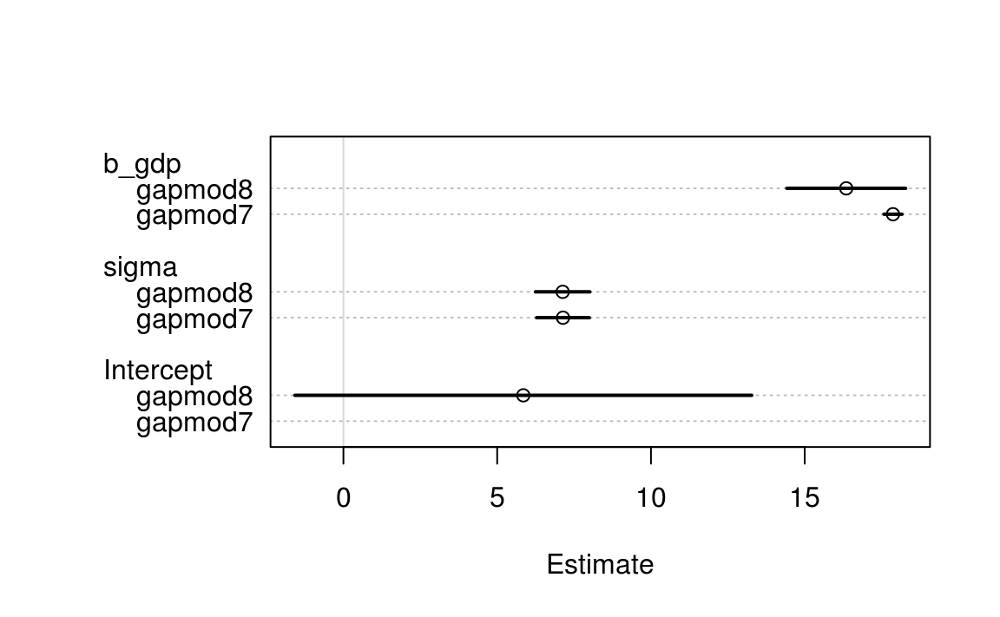
<p class="caption">(\#fig:unnamed-chunk-69)mudelite võrdlusplot.</p>
</div>

Pane tähele, et gapmod8 "b_gdp" koefitsiendi posteerior on palju laiem kui gapmod7 "b_gdp" oma.
See on üldine nähtus, mis tuleneb sellest, et gapmod7-s on vähem parameetreid. 
**Iga lisatud parameeter kipub vähendama teiste parameetrite hindamise täpsust.**

## Ennustused mudelist {-}

Kuidas plottida meie hinnangud ebakindlusele parameetri tegeliku väärtuse ümber?
Siin tuleb appi `rethinking::link()`.

Nii tõmbame posteriorist igale meie andmetes esinevale log GDP väärtusele vastavad 1000 ennustust keskmise eluea kohta sellel l_GDP väärtusel: 


```r
linked <- link(gapmod8)
linked <- as_tibble(linked)
linked_mean <- apply(linked, 2, HPDI, prob = 0.95)
```

Sel viisil saab tabeli, kus igale 142-le andmepunktist vastab üks veerg, milles on 1000 posteeriorist arvutatud ennustust lifeExp väärtusele.

Praktikas soovime aga enamasti meie poolt ette antud l_GDP väärtustel põhinevaid ennustusi keskmise eluea kohta. See käib nii:


```r
# link() draws from the posterior 1000 mu values for each l_GDP value in the width object; out pops a table with 1000 rows and 41 columns. 
mu1 <- as_tibble(link(gapmod8, data = list(l_GDP = seq(2, 6, 0.1))))
#> [ 100 / 1000 ]
[ 200 / 1000 ]
[ 300 / 1000 ]
[ 400 / 1000 ]
[ 500 / 1000 ]
[ 600 / 1000 ]
[ 700 / 1000 ]
[ 800 / 1000 ]
[ 900 / 1000 ]
[ 1000 / 1000 ]
```

Nüüd on meil mu1 objektis 41 l_GDP väärtust, millest igale vastab 1000 ennustust keskmise eluea kohta sellel l_GDP-l. 
Järgmiseks arvutame igale neist 41-st tulbast keskmise ja 95% HPDI ning plotime need koos andmepunktidega kasutades base-R graafikasüsteemi.


Pane tähele, et hall riba näitab ebakindlust ennustuse ümber keskmisele elueale üle kõikide riikide, mis võiksid sellist l_GDP-d omada (ehk ebakindlust regressioonijoonele). 
Kui me aga tahame ennustada ka keskmiste eluigade varieeruvust riigi tasemel (kasutades Bayesi hinnangut sigma parameetrile), siis on meil vaja `sim()` funktsiooni:


```r
mu.mean <- apply(mu1, 2, mean) # applies the FUN mean() to each column
mu.HPDI <- apply(mu1, 2, HPDI, prob = 0.95) %>% 
  t() %>% 
  as_data_frame()
mu.HPDI <- bind_cols(width = seq(2, 6, 0.1), mu.HPDI)
colnames(mu.HPDI) <- c("width", "lower", "upper")
sim.length <- as_tibble(sim(gapmod8, data = list(l_GDP = seq(2, 6, 0.1))))
#> [ 100 / 1000 ]
[ 200 / 1000 ]
[ 300 / 1000 ]
[ 400 / 1000 ]
[ 500 / 1000 ]
[ 600 / 1000 ]
[ 700 / 1000 ]
[ 800 / 1000 ]
[ 900 / 1000 ]
[ 1000 / 1000 ]
height.PI <- sapply(sim.length, PI, prob = 0.95, simplify = FALSE) %>% 
  do.call(rbind,. )
height.PI <- cbind(width = seq(2, 6, 0.1), height.PI) %>% as_tibble()
colnames(height.PI) <- c("width", "lower", "upper")
```


```r
library(viridis)
ggplot(g2007) +
  geom_point(aes(l_GDP, lifeExp, color = continent)) +
  geom_line(data = data_frame(width = seq(2, 6, 0.1), mu.mean), aes(width, mu.mean)) +
  geom_ribbon(data = mu.HPDI, aes(x = width, ymin = lower, ymax = upper), 
              fill = "grey5", alpha = 0.1) +
  geom_ribbon(data = height.PI, aes(x = width, ymin = lower, ymax = upper), 
              fill = "grey50", alpha = 0.1) +
  labs(caption = "Dark grey, 95% HDPI - highest posterior density.\nLight grey, 95% PI - percentile interval.") +
  theme(legend.title = element_blank()) +
  scale_color_viridis(discrete = TRUE)
```

<div class="figure" style="text-align: center">
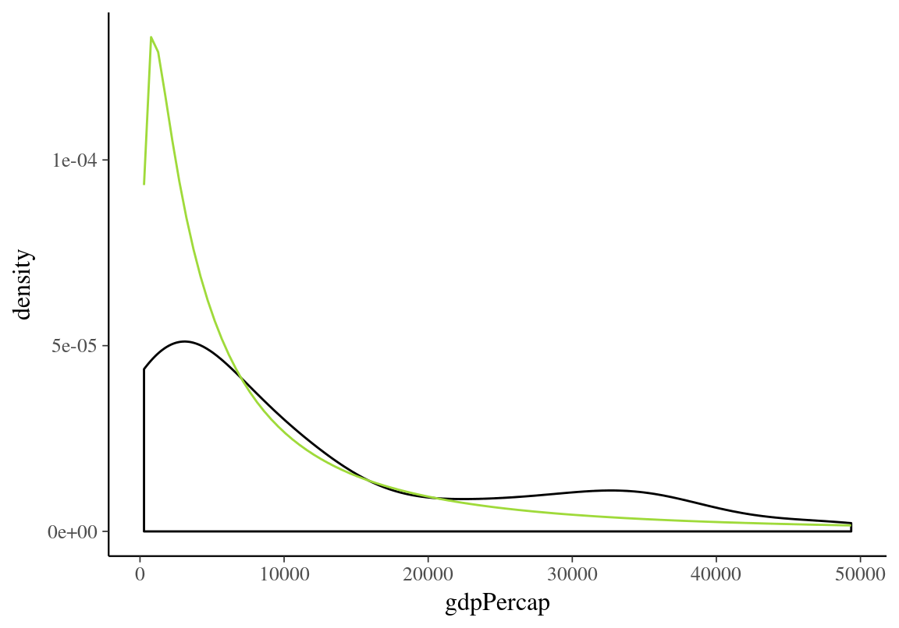
<p class="caption">(\#fig:unnamed-chunk-73)Ennustused mudelist.</p>
</div>

Nüüd ütleb laiem hall ala, et me oleme üsna kindlad, et nende riikide puhul, mille puhul mudel töötab, kohtame individaalsete riikide keskmiseid eluigasid halli ala sees ja mitte sealt väljas. 
Nagu näha, on meil ka riike, mis jäävad hallist alast kaugele ja mille keskmine eluiga on kõvasti madalam, kui mudel ennustab. 
Need on äkki riigid, kus parasjagu on sõda üle käinud ja mille eluiga ei ole näiteks seetõttu SKP-ga lihtsas põhjuslikus seoses. 
Igal juhul tasuks need ükshaaval üle vaadata sest punktid, mida mudel ei seleta, võivad varjata endas mõnd huvitavat saladust, mis pikisilmi ootab avastajat. 
Lisaks: pane tähele, et mudel eeldab, et riikide keskmise eluea SD on muutumatu igal GDP väärtusel.


Kuidas saada ennustusi kindlale l_GDP väärtusele? Näiteks tulp V10 vastab l_GDP väärtusele 2.9. Järgnevalt arvutame oodatavad keskmised eluead sellele SKP väärtusele (fiksionaalsetele riikidele, millel võiks olla täpselt selline SKP):

```r
dens(sim.length$V10)
HPDI(sim.length$V10, prob = 0.95)
#> |0.95 0.95| 
#>  38.1  65.7
```

<div class="figure" style="text-align: center">
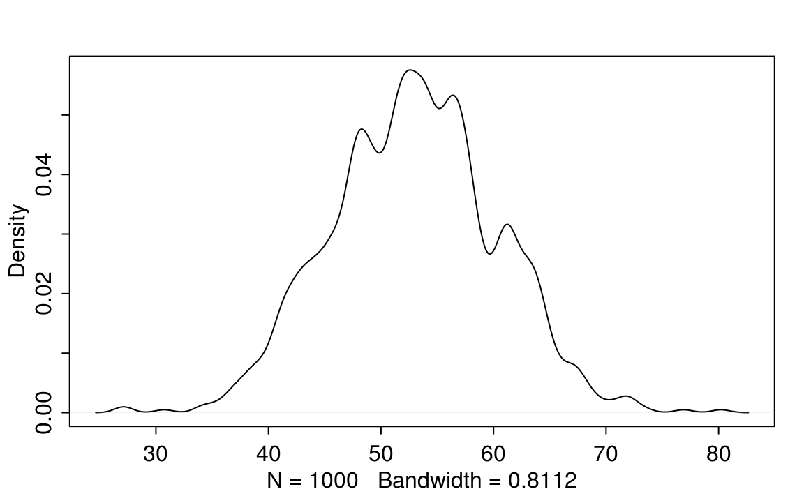
<p class="caption">(\#fig:unnamed-chunk-74)Ennustus mudelist kindlale log GDP väärtusele.</p>
</div>

Nagu näha, võib mudeli kohaselt sellise riigi keskmine eluiga tulla nii madal, kui 40 aastat ja nii kõrge kui 67 aastat.

### Lognormaalne tõepäramudel {-}

See mudel on alternatiiv andmete logaritmimisele, kui Y-muutuja (see muutuja, mille väärtust te ennustate) on lognormaalse jaotusega. 


> Lognormaalne Y-i tõepäramudel on mittelineaarne. Lognormaaljaotus defineetitakse üle mu ja sigma, mis aga vastavd hoopis log(Y) normaaljaotuse mu-le ja sigmale.

Seekord ennustame GDP-d keskmise eluea põhjal (mis, nagu näha jooniselt, ei ole küll päris lognormaalne).

<div class="figure" style="text-align: center">
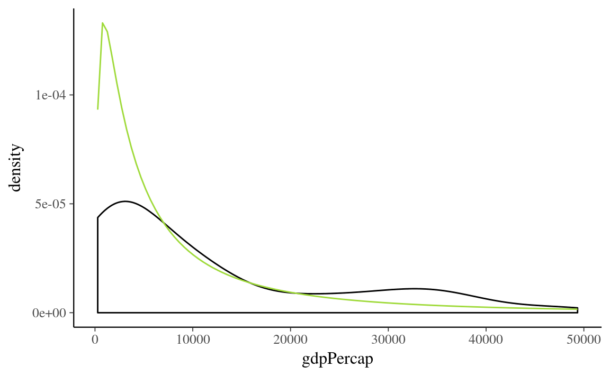
<p class="caption">(\#fig:unnamed-chunk-75)SKP-de jaotus</p>
</div>

Mustaga on näidatud empiiriline SKP jaotus, punasega fititud lognormaalne mudel sellest samast jaotusest. Järgnevalt ennustame SKP-d keskmise eluea põhjal, milleks fitime lognormaalse tõepäramudeli, kus mu on ümber defineeritud regressioonivõrrandiga:


```r
m_ln1 <- map2stan(
  alist(
   gdpPercap  ~ dlnorm( mu , sigma ),
    mu <- a + b * lifeExp,
    a ~ dnorm( 0, 10 ),
    b ~ dnorm( 0, 10 ),
    sigma ~ dcauchy( 0, 2 ) 
   ), 
  data = g2007, 
  start = list( a = 3, b = 0, sigma = 0.5 ) 
  )
```


```r
precis(m_ln1)
#>       Mean StdDev lower 0.89 upper 0.89 n_eff Rhat
#> a     2.48   0.38       1.87       3.08   283    1
#> b     0.09   0.01       0.08       0.10   287    1
#> sigma 0.81   0.05       0.74       0.88   294    1
```

Logormaalses mudelis muutuvad parameetrite tähendused ja need tuleb lineaarse mudeli intercepti ja tõusu interpretatsioonidega kooskõlla viimiseks ümber arvutada. Kõigepealt avaldame tõusu. Kuna meil on tegemist mitte-lineaarse mudeliga, sõltub tõusu väärtus ka mudeli interceptist: $slope = exp(\alpha + \beta)-exp(\alpha)$. See ei ole lineaarne seos: b omab seda suuremat mõju efektile (tõusule), mida suurem on a. [Kui meil on tegu binaarse X-ga (prediktoriga), siis kodeerime selle 2 taset kui -1 ja 1. Sellises mudelis on slope sama, mis efekti suurus ES, ja $ES = exp(\alpha + \beta)-exp(\alpha-\beta)$]


```r
a <- seq( 0, 10, length.out = 1000 )
b <- 2
b1 <- 3
y <- exp( a + b ) - exp( a )
y1 <- exp( a + b1 ) - exp( a )

plot( a, y, type = "l", xlab = "a value", ylab = "slope" )
lines( a, y1, col = "red" )
```

<div class="figure" style="text-align: center">
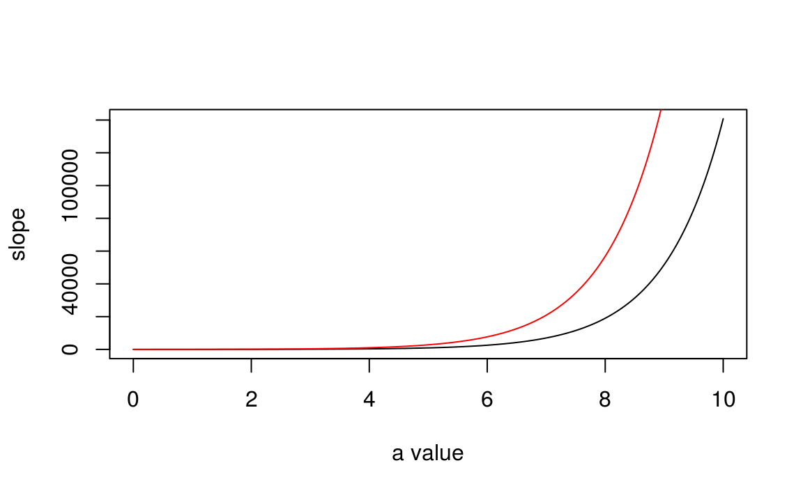
<p class="caption">(\#fig:unnamed-chunk-79)Mudeli tõus sõltub interceptist.</p>
</div>

Must joon näitab mudeli tõusu sõltuvust parameetri a väärtusest, kui parameeter b = 2. Punane joon teeb sedasama, kui b = 3.

Selline on siis mudeli tõusude (beta) posteerior:


```r
s_ln1 <- extract.samples( m_ln1 ) %>% as.data.frame()
beta <- exp(s_ln1$a + s_ln1$b) - exp(s_ln1$a)
```


```r
dens(beta)
```

<div class="figure" style="text-align: center">
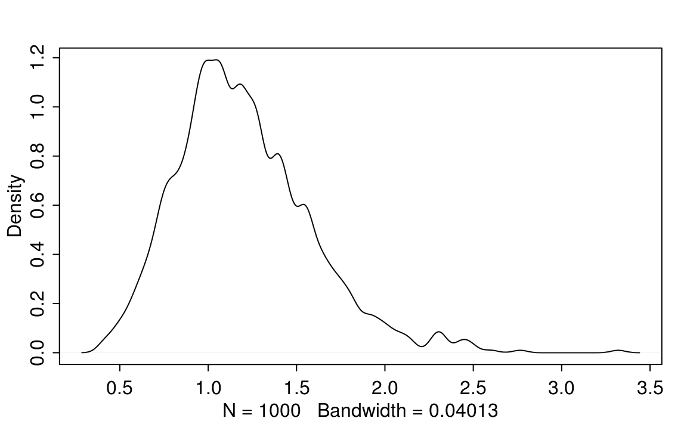
<p class="caption">(\#fig:unnamed-chunk-81)Mudeli tõusude (beta) posteerior.</p>
</div>

Lognormaaljaotusega mudelis täidab normaaljaotusega mudeli intercepti rolli eelkõige meedian, mis on defineeritud kui exp(a), aga arvutada saab ka keskmise:

```r
i_median <- exp(s_ln1$a)
mean(i_median)
#> [1] 12.8
i_mean <- exp(s_ln1$a + (s_ln1$sigma ^ 2) / 2)
mean(i_mean)
#> [1] 17.8
```

Siin ennustame fititud mudelist uusi andmeid (väljamõeldud riikide rikkust):


```r
sim_ci <- sim(m_ln1) %>% 
  as_tibble() %>% 
  apply(2, HPDI, prob = 0.95)
#> [ 100 / 1000 ]
[ 200 / 1000 ]
[ 300 / 1000 ]
[ 400 / 1000 ]
[ 500 / 1000 ]
[ 600 / 1000 ]
[ 700 / 1000 ]
[ 800 / 1000 ]
[ 900 / 1000 ]
[ 1000 / 1000 ]
```


```r
ggplot(g2007, aes(lifeExp, gdpPercap)) + 
  geom_point(aes(color = continent), size = 0.8) +
  geom_ribbon(aes( ymin = sim_ci[1,], ymax = sim_ci[2,]), alpha = 0.2) +
  scale_color_viridis(discrete = TRUE)
```

<div class="figure" style="text-align: center">
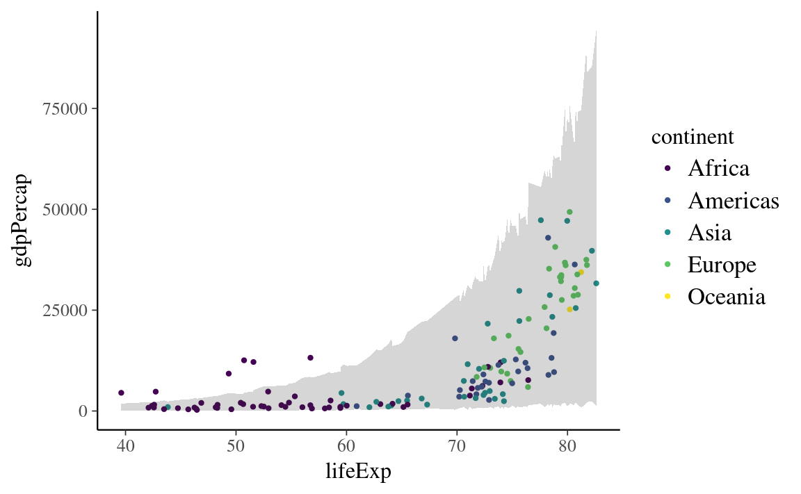
<p class="caption">(\#fig:unnamed-chunk-84)Ennustus mudelist.</p>
</div>


Ka see mudel jääb hätta Aafrika outlieritega, mille eluiga ei suuda ennustada rikkust.

## Mitme prediktoriga lineaarne regressioon {-}


```r
g2007 <- gapminder %>% 
  filter(year == 2007 ) %>% 
  mutate(l_GDP = log10(gdpPercap),
         l_pop = log10(pop), 
         lpop_s = (l_pop - mean(l_pop )) / sd(l_pop),
         lGDP_s = (l_GDP - mean(l_GDP )) / sd(l_GDP)) %>% 
  as.data.frame()
```


Meil on võimalik lisada regressioonivõrrandisse lisaprediktoreid. Nüüd ei küsi me enam, kuidas mõjutab l_GDP varieeruvus keskmise eluea varieeruvust vaid: kuidas mõjutavad muutujad l_GDP, continent ja logaritm pop-ist (rahvaarvust) keskmist eluiga. Me modelleerime selle lineaarselt nii, et eeldusena varieeruvad need x-i muutujad üksteisest sõltumatult: $y = a + b_1x_1 + b_2x_2 + b_3x_3$

Sellise mudeli tõlgendus on suhteliselt lihtne: 

> koef b1 ütleb meile, 
      kui mitme ühiku võrra tõuseb/langeb muutuja y (eluiga) 
      kui muutuja x1 (l_GDP) tõuseb 1 ühiku võrra; 
      tingimusel, et me hoiame kõigi teiste muutujate väärtused konstantsed. 
      
      
Sarnane definitsioon kehtib ka kõigi teiste prediktorite (x-de) kohta.

Kui meil on mudelis SKP ja pop, siis saame küsida 

1) kui me juba teame SKP-d, millist ennustuslikku lisaväärtust annab meile ka populatsiooni suuruse teadmine? ja

2) kui me juba teame populatsiooni suurust, millist lisaväärtust annab meile ka SKP teadmine?

Järgenval mudelil on 4 parameetrit (intercept + 3 betat).


```r
m1 <- lm(lifeExp ~ l_GDP + continent + l_pop, data = g2007)
summary( m1 )
#> 
#> Call:
#> lm(formula = lifeExp ~ l_GDP + continent + l_pop, data = g2007)
#> 
#> Residuals:
#>     Min      1Q  Median      3Q     Max 
#> -19.425  -2.246  -0.014   2.468  14.957 
#> 
#> Coefficients:
#>                   Estimate Std. Error t value Pr(>|t|)    
#> (Intercept)        19.4182     7.4557    2.60   0.0102 *  
#> l_GDP              10.6876     1.2378    8.63  1.5e-14 ***
#> continentAmericas  11.6564     1.6929    6.89  2.0e-10 ***
#> continentAsia      10.0521     1.5776    6.37  2.7e-09 ***
#> continentEurope    11.2320     1.9265    5.83  3.9e-08 ***
#> continentOceania   12.8918     4.5493    2.83   0.0053 ** 
#> l_pop               0.0928     0.8076    0.11   0.9087    
#> ---
#> Signif. codes:  0 '***' 0.001 '**' 0.01 '*' 0.05 '.' 0.1 ' ' 1
#> 
#> Residual standard error: 5.95 on 135 degrees of freedom
#> Multiple R-squared:  0.767,	Adjusted R-squared:  0.757 
#> F-statistic: 74.2 on 6 and 135 DF,  p-value: <2e-16
```

loeme mudelis "+" märki nagu "või". Ehk, "eluiga võib olla funktsioon SKP-st **või** rahvaarvust".

Intercept 19 ei tähenda tõlgenduslikult midagi. l-GDP tõus ühiku võrra tõstab eluiga 10.7 aasta võrra. 

võrdluseks lihtne mudel

```r
m2 <- lm(lifeExp ~ l_GDP, data = g2007)
summary( m2 )
#> 
#> Call:
#> lm(formula = lifeExp ~ l_GDP, data = g2007)
#> 
#> Residuals:
#>    Min     1Q Median     3Q    Max 
#> -25.95  -2.66   1.22   4.47  13.12 
#> 
#> Coefficients:
#>             Estimate Std. Error t value Pr(>|t|)    
#> (Intercept)     4.95       3.86    1.28      0.2    
#> l_GDP          16.59       1.02   16.28   <2e-16 ***
#> ---
#> Signif. codes:  0 '***' 0.001 '**' 0.01 '*' 0.05 '.' 0.1 ' ' 1
#> 
#> Residual standard error: 7.12 on 140 degrees of freedom
#> Multiple R-squared:  0.654,	Adjusted R-squared:  0.652 
#> F-statistic:  265 on 1 and 140 DF,  p-value: <2e-16
```

Siin on l_GDP mõju suurem, 16.6 aastat. Millisel mudelil on siis õigus? Proovime veel ülejäänud variendid


```r
m3 <- lm(lifeExp ~ l_GDP + continent, data = g2007)
summary( m3 )
#> 
#> Call:
#> lm(formula = lifeExp ~ l_GDP + continent, data = g2007)
#> 
#> Residuals:
#>     Min      1Q  Median      3Q     Max 
#> -19.492  -2.315  -0.043   2.550  14.882 
#> 
#> Coefficients:
#>                   Estimate Std. Error t value Pr(>|t|)    
#> (Intercept)          20.14       4.03    4.99  1.8e-06 ***
#> l_GDP                10.66       1.21    8.78  6.1e-15 ***
#> continentAmericas    11.69       1.65    7.07  7.5e-11 ***
#> continentAsia        10.11       1.48    6.85  2.3e-10 ***
#> continentEurope      11.27       1.89    5.95  2.1e-08 ***
#> continentOceania     12.93       4.52    2.86   0.0049 ** 
#> ---
#> Signif. codes:  0 '***' 0.001 '**' 0.01 '*' 0.05 '.' 0.1 ' ' 1
#> 
#> Residual standard error: 5.93 on 136 degrees of freedom
#> Multiple R-squared:  0.767,	Adjusted R-squared:  0.759 
#> F-statistic: 89.7 on 5 and 136 DF,  p-value: <2e-16

m4 <- lm(lifeExp ~ l_GDP + l_pop, data = g2007)
AIC(m1, m2, m3, m4)
#>    df AIC
#> m1  8 918
#> m2  3 965
#> m3  7 916
#> m4  4 962
```

Võitja mudel on hoopis m3, mis võtab arvesse kontinendi. Siin on l_GDP mõju samuti 10.7 aastat. Lisaks näeme, et kui riik ei asu Aafrikas, siis on l_GDP mõju elueale u 11 aasta võrra suurem. Seega elu Aafrika kisub alla keskmise eluea riigi rikkusest sõltumata. Võib olla on põhjuseks sõjad, võib-olla AIDS ja malaaria, võib-olla midagi muud. 

Millise mudeli me peaksime siis avaldama? Vastus on, et need kõik on olulised, et vastata küsimusele, millised faktorid kontrollivad keskmist eluiga? Mudelite võrdlusest näeme, et rahvaarvu mõju elueale on väike või olematu ning et SKP mõju avaldub log skaalas (viitab teatud tüüpi eksponentsiaalsetele protsessidele, kus rikkus tekitab uut rikkust) ning, et Aafrikaga on midagi pahasti ja teistmoodi kui teiste kontinentidega. Aafrikast tasub otsida midagi, mida meie senised mudelid ei kajasta.

Miks ei ole mudeli summary tabelis Aafrikat? Põhjus on tehniline. Kategoorilisi muutujaid, nagu kontinent, vaatab mudel paariviisilises võrdluses, mis tähendab et k erineva tasemega muutujast tekitatakse k - 1 uut muutujat, millest igaühel on kaks taset (0 ja 1). See algne muutuja, mis üle jääb (antud juhul Africa), jääb ilma oma uue muutujata. Me saame teisi uusi kontinendi põhjal tehtud muutujaid tõlgendada selle järgi, kui palju nad erinevad Africa-st.

#### Miks multivariaatsed mudelid head on? {-}

1) nad aitavad kontrollida "confounding" muutujaid. Confounding muutuja võib olla korreleeritud mõne teise muutujaga, mis meile huvi pakub. See võib nii maskeerida signaali, kui tekitada võlts-signaali, kuni y ja x1 seose suuna muutmiseni välja.

2) ühel tagajärjel võib olla mitu põhjust.

3) Isegi kui muutujad ei ole omavahel üldse korreleeritud, võib ühe tähtsus sõltuda teise väärtusest. Näiteks taimed vajavad nii valgust kui vett. Aga kui ühte ei ole, siis pole ka teisel suurt tähtsust.

### Mudeldamine standardiseeritud andmetega {-}

Kui me lahutame igast andmepunktist selle muutuja keskväärtuse siis saame 0-le tsentreeritud andmed. Kui me sellisel viisil saadud väärtused omakorda läbi jagame muutuja standardhälbega, siis saame standardiseeritud andmed, mille keskväärtus on null ja SD = 1.

$Standard.andmed = (x - mean(x))/sd(x)$ 

Nii on lihtsam erinevas skaalas muutujaid omavahel võrrelda (1 ühikuline muutus võrdub alati muutusega 1 standardhäve võrra) ja mudeli arvutamine üle mcmc ahelate on ka lihtsam.


```r
m5 <- map2stan(
    alist(
        lifeExp ~ dnorm( mu , sigma ) ,
        mu <- a + b_GDP * lGDP_s + b_pop * lpop_s ,
        a ~ dnorm( 0 , 10 ) ,
        c(b_GDP, b_pop) ~ dnorm( 0 , 1 ) ,
        sigma ~ dunif( 0 , 10 )
), data = g2007 )
```


```r
precis(m5)
#>        Mean StdDev lower 0.89 upper 0.89 n_eff Rhat
#> a     66.74   0.64      65.77      67.79  1000    1
#> b_GDP  6.95   0.58       6.06       7.84   775    1
#> b_pop  0.80   0.55      -0.11       1.58   870    1
#> sigma  7.64   0.50       6.82       8.40   876    1
```

kui l_GDP kasvab 1 sd võrra, siis eluiga kasvab 6.9 aasta võrra. 


```r
f1 <- glimmer(lifeExp ~ lGDP_s + lpop_s + continent, data = g2007)
#> alist(
#>     lifeExp ~ dnorm( mu , sigma ),
#>     mu <- Intercept +
#>         b_lGDP_s*lGDP_s +
#>         b_lpop_s*lpop_s +
#>         b_continentAmericas*continentAmericas +
#>         b_continentAsia*continentAsia +
#>         b_continentEurope*continentEurope +
#>         b_continentOceania*continentOceania,
#>     Intercept ~ dnorm(0,10),
#>     b_lGDP_s ~ dnorm(0,10),
#>     b_lpop_s ~ dnorm(0,10),
#>     b_continentAmericas ~ dnorm(0,10),
#>     b_continentAsia ~ dnorm(0,10),
#>     b_continentEurope ~ dnorm(0,10),
#>     b_continentOceania ~ dnorm(0,10),
#>     sigma ~ dcauchy(0,2)
#> )
```
See on mudeli struktuur, mis sisaldab uusi kategoorilisi muutujaid

Siin on tähtis anda map2stan()-le ette glimmeri poolt eeltöödeldud andmed:

```r
m6 <- map2stan(
  f1$f, 
  data = f1$d)
```


```r
precis(m6)
#>                      Mean StdDev lower 0.89 upper 0.89 n_eff Rhat
#> Intercept           59.92   0.97      58.31      61.42   344    1
#> b_lGDP_s             6.29   0.68       5.20       7.31   450    1
#> b_lpop_s             0.06   0.50      -0.75       0.79  1000    1
#> b_continentAmericas 11.66   1.53       9.07      13.94   436    1
#> b_continentAsia     10.11   1.47       7.87      12.51   428    1
#> b_continentEurope   11.26   1.83       8.50      14.26   434    1
#> b_continentOceania  11.18   4.00       4.87      17.50   784    1
#> sigma                5.95   0.36       5.38       6.49   931    1
```

## Keerulisemate mudelitega töötamine {-}

Kasuta graafilisi meetodeid. 
Mudeli koefitsientide jõllitamine üksi ei päästa.

### Predictor residual plots {-}

Plotime varieeruvuse, mida mudel ei oota ega seleta.


```r
names(coef(m5))
#> [1] "a"     "b_GDP" "b_pop" "sigma"
```

Kõigepealt lihtne residuaalide plot, kus meil on y-teljel residuaalid ja x-teljel X1 muutuja tegelikud  valimiväärtused. Y = 0 tähistab horisontaalse joonena mudeli ennustatud Y (eluea) väärtusi kõigil prediktori X1 (lGDP_s) väärtustel ja residuaal on defineeritud kui tegelik Y miinus mudeli poolt ennustatud eluiga sellel X1 väärtusel. Mudeli ennustuse saamiseks anname mudelile ette fikseeritud parameetrite (koefitsientide) a, b_GDP ja b_pop väärtused ning arvutame oodatava keskmise eluea üle kõigi valimis leiduvate lGDP_s ja lpop_s väärtuste. Seega saame sama palju keskmise eluea ennustusi, kui palju on meie andmetabelis ridu.


```r
# Using the fitted model compute the expected value of y (mu) 
# for each of the 142 data rows.
mu <- coef( m5 )[ 'a' ] + 
  coef( m5 )[ 'b_GDP' ] * g2007$lGDP_s + 
  coef( m5 )[ 'b_pop' ] * g2007$lpop_s

# compute residuals - a vector w. 142 values
m.resid <- g2007$lifeExp - mu

ggplot( g2007, aes( lGDP_s, m.resid ) ) + 
  geom_segment( aes( xend = lGDP_s, yend = 0 ), size = 0.2 ) +
  geom_point( size = 0.5, type = 1 )
#> Warning: Ignoring unknown parameters: type
```

<div class="figure" style="text-align: center">
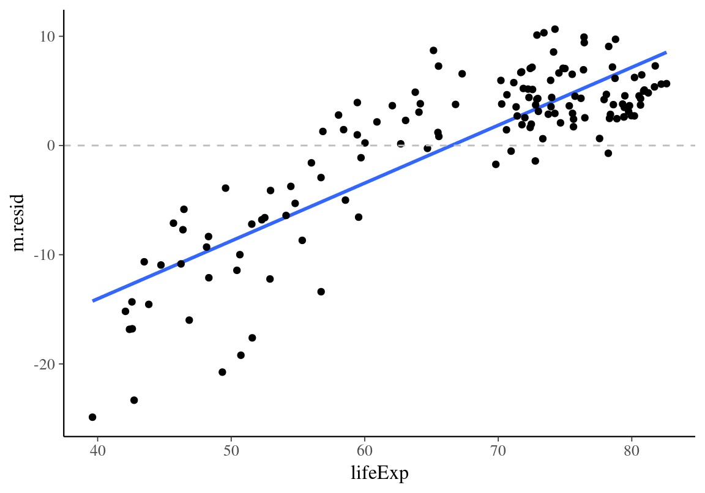
<p class="caption">(\#fig:unnamed-chunk-97)Mudeli residuaalide plot (m.resid ~ X1).</p>
</div>


Me näeme, et seal kus SKP on väiksem kipuvad residuaalid olema negatiivsed, mis tähendab, et mudel ülehindab keskmist eluiga. Ja vastupidi, seal kus SKP on üle keskmise, mudel kipub alahindma keskmist eluiga.

See seos tuleb eriti selgelt välja järgmisel pildil, kus plotime residuaalide sõltuvuse elueast (kui eelmine plot oli m.resid ~ X1, siis nüüd plotime  m.resid ~ Y). Lisaks joonistame selguse mõttes regressioonisirge. Kui residuaalid oleks ühtlaselt jaotunud mõlemale poole mudeli ennustust, siis saaksime horisontaalse regressioonisirge. Tegeliku sirge tõus näitab, et suuremad eluead omavad eelistatult poitiivseid residuaale ja väiksemad eluead negatiivseid residuaale. See tähendab, et mudel alahindab eluiga seal, kus SKP on kõrge ja vastupidi, ülehindab eluiga seal, kus SKP on madal.

```r
g2007$m.resid <- m.resid
ggplot(g2007, aes(lifeExp, m.resid)) +
  geom_smooth(method = "lm", se = FALSE) +
  geom_point() +
  geom_hline(yintercept = 0, color = "grey", linetype = 2)
```

<div class="figure" style="text-align: center">
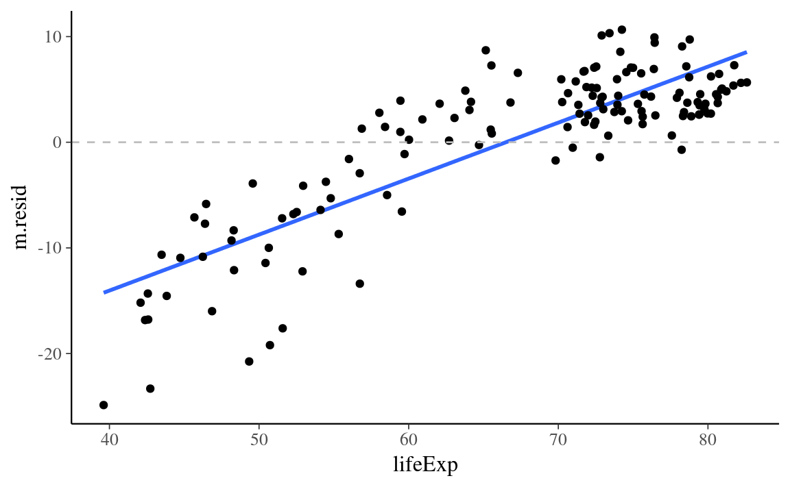
<p class="caption">(\#fig:unnamed-chunk-98)m.resid ~ Y plot</p>
</div>

Horisontaalne punktiirjoon näitab, kus mudel vastab täpselt andmetele. 

###  Ennustavad plotid  {-}

Plot, kus me ennustame keskmise eluea sõltuvust SKP-st nii riikide kaupa eraldi (andmepunktide paupa) kui üldiselt kõikide riikide keskmisena, millel on mingi kindel SKP (mudeli parima ennustuse ehk sirge asendi ümber valitsevat ebakindlust). Et seda teha, hoiame rahvaarvu konstantsena oma keskväärtusel, mis standardiseeritud andmetl võrdub alati nulliga. link() funktsioon annab meile keskmiste eluigade ennustused meie poolt ette antud X1 ja X2 väärtustel, ning sim() annab meile eluigade ennustused fiktsionaalsete riikide kaupa samadel X1 ja X2 väärtustel. Nagu näha, on meie mudeli arvates riikide kaupa ennustamine palju laiema varieeruvusega kui üle kõikväimalike riikide kesmise kaupa ennustamine.


```r
# prepare new counterfactual data
pred.data <- tibble(
    lGDP_s = seq(-3, 3, length.out = 30), # need meie poolt valitud lGDP_s väärtused, millele me ennustame vastavad eluead 
    lpop_s = 0 # rahvaarv fikseeritakse muutuja keskmisele tasemele, mis standardiseeritud andmete korral = 0
)

# compute counterfactual mean lifeExp (mu)
mu <- link(m5, data = pred.data)
#> [ 100 / 1000 ]
[ 200 / 1000 ]
[ 300 / 1000 ]
[ 400 / 1000 ]
[ 500 / 1000 ]
[ 600 / 1000 ]
[ 700 / 1000 ]
[ 800 / 1000 ]
[ 900 / 1000 ]
[ 1000 / 1000 ]
mu.mean <- apply(mu, 2, mean)
mu.PI <- apply(mu, 2, PI)

# simulate counterfactual lifeExpectancies of individual countries
R.sim <- sim(m5, data = pred.data)
#> [ 100 / 1000 ]
[ 200 / 1000 ]
[ 300 / 1000 ]
[ 400 / 1000 ]
[ 500 / 1000 ]
[ 600 / 1000 ]
[ 700 / 1000 ]
[ 800 / 1000 ]
[ 900 / 1000 ]
[ 1000 / 1000 ]
R.sim <- na.omit(R.sim)
R.PI <- apply(R.sim, 2, PI)

ggplot(pred.data, aes(lGDP_s, mu.mean)) +
  geom_line(y = mu.mean) +
  geom_ribbon(ymin = mu.PI[1,], ymax = mu.PI[2,], fill = "grey60", alpha = 0.3) +
  geom_ribbon(ymin = R.PI[1,], ymax = R.PI[2,], fill = "grey10", alpha = 0.3)
```

<div class="figure" style="text-align: center">
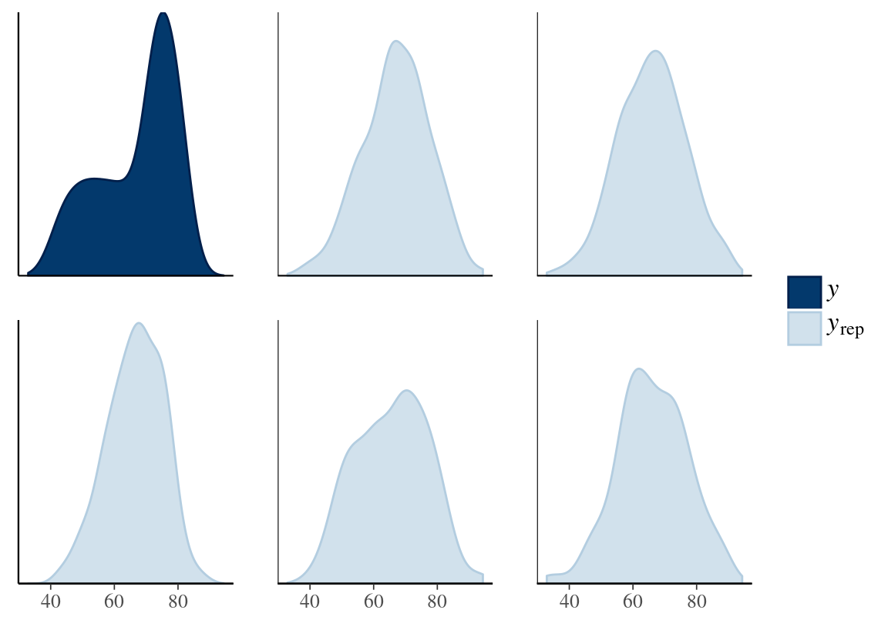
<p class="caption">(\#fig:unnamed-chunk-99)Ennustav plot</p>
</div>

Näeme, kuidas ennustus sobib/ei sobi andmetega. Võrdle eelneva ennustuspildiga, kus mudel ei sisalda rahvaarvu. Ennustuse intervallid on originaalandmete skaalas (aastates), mis on hea.


### Posterior prediction plots {-}

Posterioorsed ennustusplotid panevad kõrvuti (või üksteise otsa) Y-i algandmed ja mudeli ennustused Y-väärtustele. Kui meie valimi suurus on N, siis me tõmbame mudelist näiteks 5 valimit, igaüks suurusega N ja plotime need kõrvuti valimiandmete plotiga. Siis me vaatame sellele plotile peale ja otsustame, kas mudeli ennustused on piisavalt lähedal valimi andmetele. Kui ei, siis on tõenäoline, et meie mudelis on midagi mäda ja me peame hakkama sealt vigu otsima. Tõsi küll, keerulisemate hierarhiliste mudelite korral on vahest raske otsustada, millised peaksid tulema eduka mudeli ennustused võrreldes algandmetega --- aga siiski, see on arvatavasti kõige tähtsam plot, mida oma mudelist teha!

1) võrdle mudeli ennustusi andmetega. (Aga arvesta sellega, et mitte kõik mudelid ei püüagi täpselt andmetele vastata.)


```r
yrep <- sim(m5)
#> [ 100 / 1000 ]
[ 200 / 1000 ]
[ 300 / 1000 ]
[ 400 / 1000 ]
[ 500 / 1000 ]
[ 600 / 1000 ]
[ 700 / 1000 ]
[ 800 / 1000 ]
[ 900 / 1000 ]
[ 1000 / 1000 ]
ppc_dens(g2007$lifeExp, yrep[1:5, ])
```

<div class="figure" style="text-align: center">
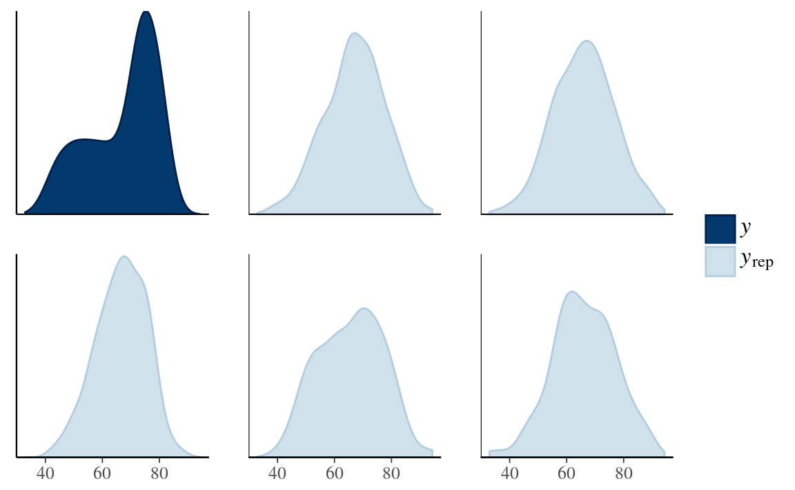
<p class="caption">(\#fig:unnamed-chunk-100)Valimi andmed vs. mudeli poolt ennustatud andmed.</p>
</div>

 
2) Millisel viisil täpselt meie mudel ebaõnnestub? See plot annab mõtteid, kuidas mudelit parandada.

Ploti ennustused andmepunktide vastu, pluss jooned, mis näitavad igale ennustusele omistatud usaldusintervalli. Lisaks veel sirge, mis näitab täiuslikku ennustust (slope = 1, intercept = 0). 

Loeme gapminderi andmed uuesti sisse:

```r
g2007 <- gapminder %>% filter( year == 2007 )
g2007 <- g2007 %>% mutate( l_GDP = log10( gdpPercap ) )
g2007 <- g2007 %>% mutate( l_pop = log10( pop ), 
                           lpop_s = (l_pop - mean( l_pop ) )/sd( l_pop ),
                           lGDP_s = (l_GDP - mean( l_GDP ) )/sd( l_GDP ) ) %>% 
  as.data.frame()
```

Ja nüüd plotime ennustused Y-le tegelike Y valimi väärtuste vastu:

```r
mu <- link(m5)  
#> [ 100 / 1000 ]
[ 200 / 1000 ]
[ 300 / 1000 ]
[ 400 / 1000 ]
[ 500 / 1000 ]
[ 600 / 1000 ]
[ 700 / 1000 ]
[ 800 / 1000 ]
[ 900 / 1000 ]
[ 1000 / 1000 ]
mu.mean <- apply(mu, 2, mean)

mu.PI <- apply( mu , 2 , PI )

g2007$mu.mean <- mu.mean

ggplot(g2007, aes(lifeExp, mu.mean)) +
  geom_point() +
  geom_crossbar(ymin = mu.PI[1,], ymax = mu.PI[2,]) +
  geom_abline(intercept = 0, slope = 1, lty = 2) +
  ylab("Predicted life expectancy") + 
  xlab("Observed life expectancy") +
  coord_cartesian( xlim=c( 40, 85 ), ylim=c( 40, 85 ))
```

<div class="figure" style="text-align: center">
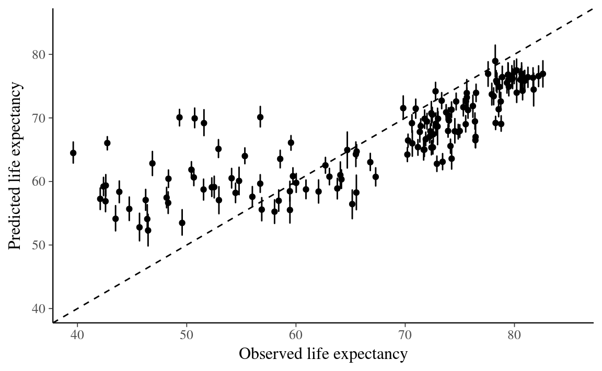
<p class="caption">(\#fig:unnamed-chunk-102)Ennustus vs. valimi väärtus</p>
</div>

Siin on ennustus ja seda ümbritsev ebakindlus iga riigi keskmisele elueale.

Järgnev plot annab ennustusvea igale riigile. Siin tähistab 89% CI näiteks Vietnamile eluigade vahemikku, millese jääb mudeli ennustuse kohaselt 89% kõikvõimalike fiktsionaalsete riikide keskmistest eluigadest, mille SKP ja rahvaarv võrdub Vietnami omaga. Kuna me tsentreerime CI Vietnami tegeliku keskmise eluea residuaalile (erinevusele mudeli ennustusest), näitab see, kui palju erineb Vietnami eluiga mudeli ennustusest riikidele, nagu Vietnam. See plot annab meile riigid, mille suhtes mudel jänni jääb. Enamasti leiame need riigid Aafrikast.
 

```r
# compute residuals
life.resid <- g2007$lifeExp - mu.mean

mu_sim <- sim( m5 )  
#> [ 100 / 1000 ]
[ 200 / 1000 ]
[ 300 / 1000 ]
[ 400 / 1000 ]
[ 500 / 1000 ]
[ 600 / 1000 ]
[ 700 / 1000 ]
[ 800 / 1000 ]
[ 900 / 1000 ]
[ 1000 / 1000 ]
sim.PI <- apply( mu_sim , 2 , PI )

ggplot( g2007, aes( x = life.resid, y = reorder( country, life.resid ) ) ) +
  geom_point() +
  geom_errorbarh( aes( xmin = lifeExp - sim.PI[1,], 
                       xmax = lifeExp - sim.PI[2,] ), 
                  color = "red") +
  geom_vline( xintercept = 0 ) +
  theme(text = element_text(size=7)) +
  theme(axis.title.y = element_blank())
```

<div class="figure" style="text-align: center">
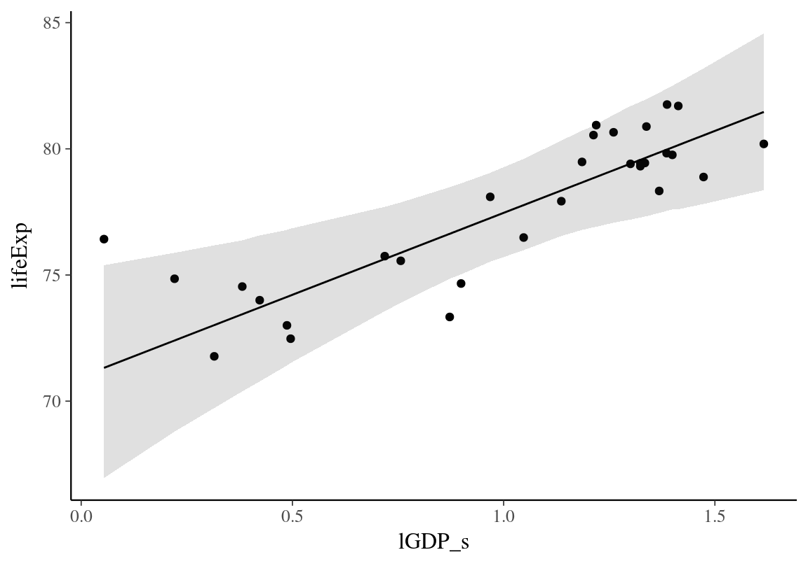
<p class="caption">(\#fig:unnamed-chunk-103)Ennustused riigi kaupa.</p>
</div>

punased jooned näitavad 89% ennustuspiire igale residuaalile riigi tasemel (89% kõikvõimalike riikide keskmiste eluigade residuaalidest sellel SKPl jääb punasesse vahemikku).

### Interaktsioonid prediktorite vahel {-}

Eelnevad mudelid eeldavad, et prediktorite varieeruvused on üksteisest sõltumatud. Aga mis siis, kui see nii ei ole ja ühe prediktori mõju suurus sõltub teisest prediktorist, ehk prediktorite vahel on interaktsioon? Lihtsaim viis sellist interaktsiooni modelleerida on lisades interaktsiooni aditiivsele mudelile korrutamisetehtena:

$y = a + b1x1 + b2x2 + b3x1x2$

Sellise mudeli järgi erineb sirge tõus b1 erinevatel b2 väärtustel, ja erinevuse määr sõltub b3-st (b3 annab interaktsiooni tugevuse). Samamoodi ja sümmeetriliselt erineb ka tõus b2 sõltuvalt b1 väärtusest. See on ühine paljude hierarhiliste mudelitega, mida võib omakorda vaadelda massivsete interaktsioonimudelitena. Seevastu y = a + b1x1 + b2x2 tüüpi mudel annab b1-le konstantse tõusunurga, kuid laseb intercepti muutuma sõltuvalt b2 väärtusest (ja vastupidi). 

Interaktsioonimudeli fittimises pole midagi erilist võrreldes sellega, mida me oleme juba õppinud. Aga fititud parameetrite tõlgendamine on keeruline. 
Alustame diskreetse muutujaga, continent, ja mudeldame selle interaktsiooni SKP-ga.


```r
f1 <- glimmer(lifeExp ~ lGDP_s * continent, data = g2007)
#> alist(
#>     lifeExp ~ dnorm( mu , sigma ),
#>     mu <- Intercept +
#>         b_lGDP_s*lGDP_s +
#>         b_continentAmericas*continentAmericas +
#>         b_continentAsia*continentAsia +
#>         b_continentEurope*continentEurope +
#>         b_continentOceania*continentOceania +
#>         b_lGDP_s_X_continentAmericas*lGDP_s_X_continentAmericas +
#>         b_lGDP_s_X_continentAsia*lGDP_s_X_continentAsia +
#>         b_lGDP_s_X_continentEurope*lGDP_s_X_continentEurope +
#>         b_lGDP_s_X_continentOceania*lGDP_s_X_continentOceania,
#>     Intercept ~ dnorm(0,10),
#>     b_lGDP_s ~ dnorm(0,10),
#>     b_continentAmericas ~ dnorm(0,10),
#>     b_continentAsia ~ dnorm(0,10),
#>     b_continentEurope ~ dnorm(0,10),
#>     b_continentOceania ~ dnorm(0,10),
#>     b_lGDP_s_X_continentAmericas ~ dnorm(0,10),
#>     b_lGDP_s_X_continentAsia ~ dnorm(0,10),
#>     b_lGDP_s_X_continentEurope ~ dnorm(0,10),
#>     b_lGDP_s_X_continentOceania ~ dnorm(0,10),
#>     sigma ~ dcauchy(0,2)
#> )
```


```r
m1 <- map2stan(f1$f, f1$d)
```


```r
plot(precis(m1))
```

<div class="figure" style="text-align: center">
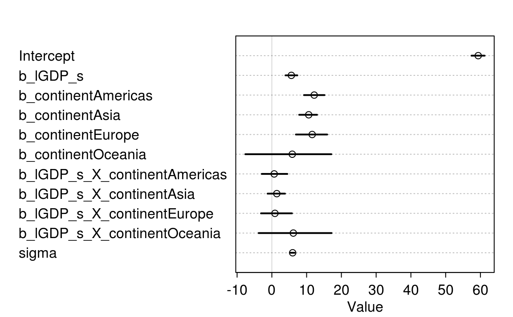
<p class="caption">(\#fig:unnamed-chunk-107)Mudeli koefitsientide plot.</p>
</div>


Aafrika on siin võrdluseks.

Interaktsioon on sümmeetriline. Me võime sama hästi küsida, kui palju SKP mõju elueale sõltub kontinendist, kui seda, kui palju kontinendi mõju eluale sõltub SKP-st.

Nüüd joonistame välja regressioonisirge Aafrika ja Euroopa jaoks eraldi m1 mudeli põhjal


```r
c1 <- coef(m1)
names(c1)
#>  [1] "Intercept"                    "b_lGDP_s"                    
#>  [3] "b_continentAmericas"          "b_continentAsia"             
#>  [5] "b_continentEurope"            "b_continentOceania"          
#>  [7] "b_lGDP_s_X_continentAmericas" "b_lGDP_s_X_continentAsia"    
#>  [9] "b_lGDP_s_X_continentEurope"   "b_lGDP_s_X_continentOceania" 
#> [11] "sigma"
```

Kõigepealt defineerime X1 ja X2 väärtused, millele teeme ennustused link() funktsiooni abil. Link tabelist veergude keskmine annab keskmise eluea ennustuse vastavale mandrile ja SKP-le. PI() abil saame 89% CI igale ennustusele. 


```r
dd <- as.data.frame(f1$d) #we use the dataframe made by glimmer()
#in dd all continents are in separate 2-level columns (except Africa)
dd1 <- dd %>% filter(continentAmericas == 0, 
                     continentAsia == 0, 
                     continentEurope == 0, 
                     continentOceania == 0)
mu.Africa <- link(m1, dd1)
#> [ 100 / 1000 ]
[ 200 / 1000 ]
[ 300 / 1000 ]
[ 400 / 1000 ]
[ 500 / 1000 ]
[ 600 / 1000 ]
[ 700 / 1000 ]
[ 800 / 1000 ]
[ 900 / 1000 ]
[ 1000 / 1000 ]
mu.Africa.mean <- apply(mu.Africa, 2, mean)
mu.Africa.PI <- apply(mu.Africa, 2, PI, prob = 0.9)

ggplot(dd1, aes(lGDP_s, lifeExp)) +
  geom_point() +
  geom_ribbon(aes(ymin = mu.Africa.PI[1,], ymax = mu.Africa.PI[2,]), alpha = 0.15) +
  geom_line(aes(y = mu.Africa.mean))
```

<div class="figure" style="text-align: center">
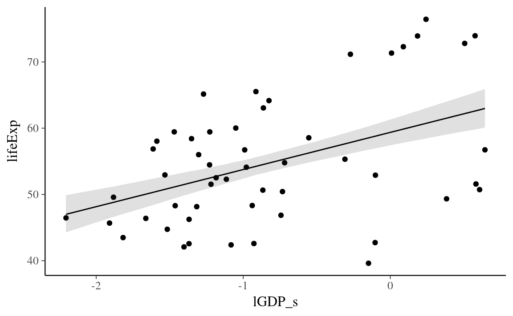
<p class="caption">(\#fig:unnamed-chunk-109)Ennustusplot Aafrikale.</p>
</div>


```r
dd1 <- dd %>% filter(continentEurope == 1)
mu.Europe <- link(m1, dd1)
#> [ 100 / 1000 ]
[ 200 / 1000 ]
[ 300 / 1000 ]
[ 400 / 1000 ]
[ 500 / 1000 ]
[ 600 / 1000 ]
[ 700 / 1000 ]
[ 800 / 1000 ]
[ 900 / 1000 ]
[ 1000 / 1000 ]
mu.Europe.mean <- apply( mu.Europe , 2 , mean )
mu.Europe.PI <- apply( mu.Europe , 2 , PI , prob=0.9 )

ggplot(data=dd1, aes(lGDP_s, lifeExp)) +
  geom_point()+
  geom_ribbon( aes(ymin=mu.Europe.PI[1,], ymax=mu.Europe.PI[2,]), alpha=0.15)+
  geom_line( aes( y=mu.Europe.mean))
```

<div class="figure" style="text-align: center">
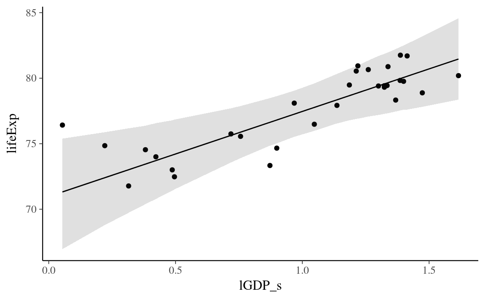
<p class="caption">(\#fig:unnamed-chunk-110)Ennustusplot Euroopale.</p>
</div>

Nagu näha, on meil nüüd üsna erinevad sirge tõusunurgad.

### Interaktsioonid pidevatele tunnustele {-}

Kasutame standardiseeritud prediktoreid, sest nende koefitsiente saab paremini tõlgendada (tegelikult piisab prediktorite tsentreerimisest). Meie andmed käsitlevad diabeedimarkereid Ameerika lõunaosariikide neegritel 1960-ndatel. Me ennustame siin sõltuvalt vanusest ja vööümbermõõdust hdl-i --- high density cholesterol --- mis on nn hea kolesterool.


```r
#diabetes <- read.table( file = 'data/diabetes.csv', header = TRUE, sep = ';', dec = ',' )
diabetes <- read.csv2( "data/diabetes.csv" )
d1 <- diabetes %>% select( hdl, age, waist ) %>% na.omit()
d2 <- d1 %>% mutate( age_st = ( age - mean( age ) )/sd( age ), 
                    waist_st = ( waist - mean( waist ) )/sd( waist ) )
```


```r
m2 <- map2stan(
    alist(
        hdl ~ dnorm( mu , sigma ) ,
        mu <- a + bR*age_st + bA*waist_st + bAR*age_st*waist_st,
        a ~ dnorm( 0, 100 ),
        bR ~ dnorm( 0, 2 ),
        bA ~ dnorm( 0, 2 ),
        bAR~ dnorm( 0, 2),
        sigma ~ dcauchy( 0, 1 )
), data = d2 )
```


```r
plot(precis( m2 ) )
```

<div class="figure" style="text-align: center">
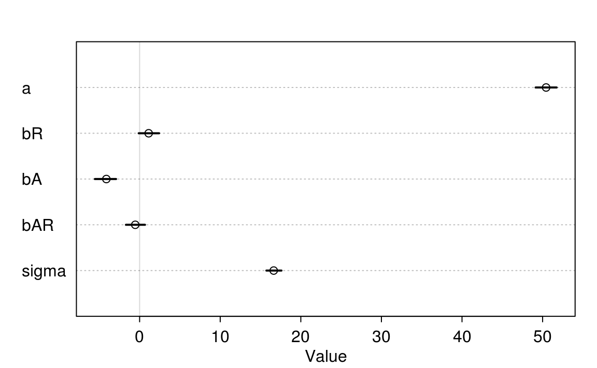
<p class="caption">(\#fig:unnamed-chunk-114)mudeli koefitsientide plot</p>
</div>


**NB!** Järgmised interpretatsioonid kehtivad ainult siis, kui mudeldame nullile tsentreeritud andmeid.

a - hdl-i oodatav keskväärtus siis kui võõ-ümbermõõt ja vanus on fikseeritud oma keskmistel väärtustel. 
bR - oodatav hdl-i muutus, kui vanus kasvab 1 aasta võrra ja võõ-ümbermõõt on fikseeritud oma keskväärtusel
bA - sama, kui võõ-ümbermõõt kasvab 1 ühiku (inch) võrra 
bAR - kaks ekvivalentset tõlgendust: 1) oodatav muutus vanuse mõju määrale hdl-le, kui vöö-ümbermõõt kasvab 1 ühiku võrra. 2) oodatav muutus vöö-ümbermõõdu mõju määrale hdl-le, kui vanus kasvab 1 ühiku võrra.

Negatiivne bAR tähendab, et vanus ja vöö-ümbermõõt omavad vastandlikke mõjusid hdl-i tasemele, aga samas kumgki tõstab teise tähtsust hdl-le.


```r
m3 <- map2stan(
    alist(
        hdl ~ dnorm(mu, sigma),
        mu <- a + bR * age_st + bA * waist_st,
        a ~ dnorm(0, 100),
        c(bR, bA) ~ dnorm(0, 2),
        sigma ~ dcauchy(0, 1)
), data = d2)
```


```r
compare(m2, m3)
#>    WAIC pWAIC dWAIC weight   SE  dSE
#> m3 3391   5.6   0.0   0.72 41.8   NA
#> m2 3393   7.1   1.9   0.28 41.9 1.91
```


Siin on tegelikult eelistatud ilma interaktsioonita mudel. Aga kuna interaktsioonimudeli kaal on ikkagi 28%, tasub meil ennustuste tegemisel mõlemat mudelit koos arvestada vastavalt oma kaalule. 


```r
coeftab(m2, m3)
#>       m2      m3     
#> a        50.4    50.4
#> bR       1.12    1.09
#> bA      -4.13   -4.10
#> bAR     -0.54      NA
#> sigma    16.6    16.6
#> nobs      400     400
```

Tõesti, bA ja bR on mõlemas mudelis väga sarnased. m3 on kindlasti lihtsamini tõlgendatav.

Ensemble teeb ära nii link()-i kui sim()-i, kasutades mõlemat mudelit vastavalt nende mudelite WAIC-i kaaludele ja toodab listi, mille elementideks on link() toodetud maatriks ja sim() toodetud maatriks.

Teeme 3 plotti: waist = 0 (keskmine), waist = -1 (miinus üks sd) ja waist = 1


```r
waist_fun <- function(waist, ...) {
  d.pred <- data.frame(age_st = seq( -2, 2, length.out = 20 ),
                       waist_st = waist)
  e <- ensemble(..., data = d.pred)
  hdl <- apply(e$link, 2, mean)
  mu.PI <- apply(e$link, 2, PI, prob = 0.97)
  ggplot(d.pred, aes(x = age_st)) +
    geom_line(aes(y = hdl)) +
    geom_line( aes(y = mu.PI[1,]), linetype = 2) +
    geom_line( aes( y = mu.PI[2,] ), linetype = 2) +
    ylim(40, 70)
}
```

Ensemble mudel:

```r
## Fit ensemble model
# p <- lapply(-1:1, waist_fun, m2, m3)
## Plot three plots
# do.call(grid.arrange, c(p, ncol = 3))
## 
p_1 <- waist_fun(-1, m2, m3)
p0 <- waist_fun(0, m2, m3)
p1 <- waist_fun(1, m2, m3)
grid.arrange(p_1, p0, p1, ncol = 3)
#> Warning: Removed 2 rows containing missing values (geom_path).
```

<div class="figure" style="text-align: center">

<p class="caption">(\#fig:unnamed-chunk-120)Ennustusplot üle kahe mudeli.</p>
</div>

Ja sama ainult ühe mudeliga -- m2. 

```r
w0 <- waist_fun(-1, m2)
w_1 <- waist_fun(0, m2)
w1 <- waist_fun(1, m2)
grid.arrange(w0, w_1, w1, ncol = 3)
```

<div class="figure" style="text-align: center">
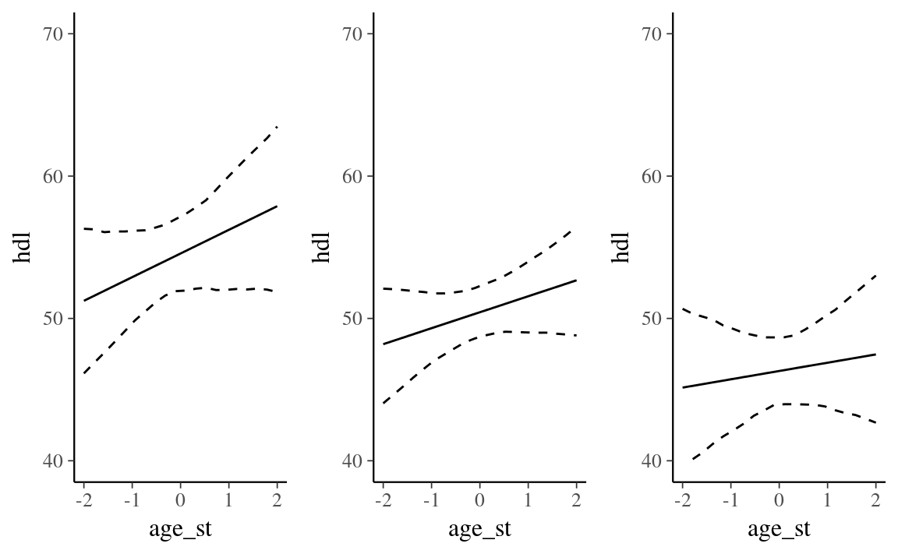
<p class="caption">(\#fig:unnamed-chunk-121)Ennustusplot m2-le.</p>
</div>


Nüüd on hästi näha, et interaktsioonimudel laseb sirge tõusunurgad vabaks!

Üldiselt tasub interaktsioon mudelisse sisse kirjutada siis, kui see interaktsioon on teoreetiliselt mõtekas (ühe prediktori mõju võiks sõltuda teise prediktori tasemest).
Interaktsiooni koefitsiendi määramine võib suurendada ebakindlust teiste parameetrite määramisel, seda eriti siis kui interaktsiooni parameeter on korreleeritud oma komponentide parameetritega (vt pairs(model)).

Isegi kui interaktsiooniparameetri posteerior hõlmab 0-i, tuleb interaktsiooni parameetrit mudelisse pannes arvestada, et individuaalsete prediktorite mõju ei saa summeerida pelgalt läbi nende koefitsientide. Selle asemel tuleb vaadata sirge tõusu erinevatel teiste prediktorite väärtustel (nagu eelneval joonisel)

Kui tavaline interaktsioonimudel on $y = a + b_1x_1 + b_2x_2 + b_3x_1x_2$, siis mis juhtub, kui meie mudel on $y = b_1x_1 + b_3x_1x_2$? See tähendab, et me surume b2 väärtuse nulli, mis võib ära rikkuda mudeli teiste parameetrite posteeriorid! Kui teil on alust arvata, et b2-l puudub otsene mõju y väärtusele (kuid tal on mõju b1 väärtusele), siis võib muidugi ka sellist mudelit kasutada. Aga see on haruldane juhtum.

