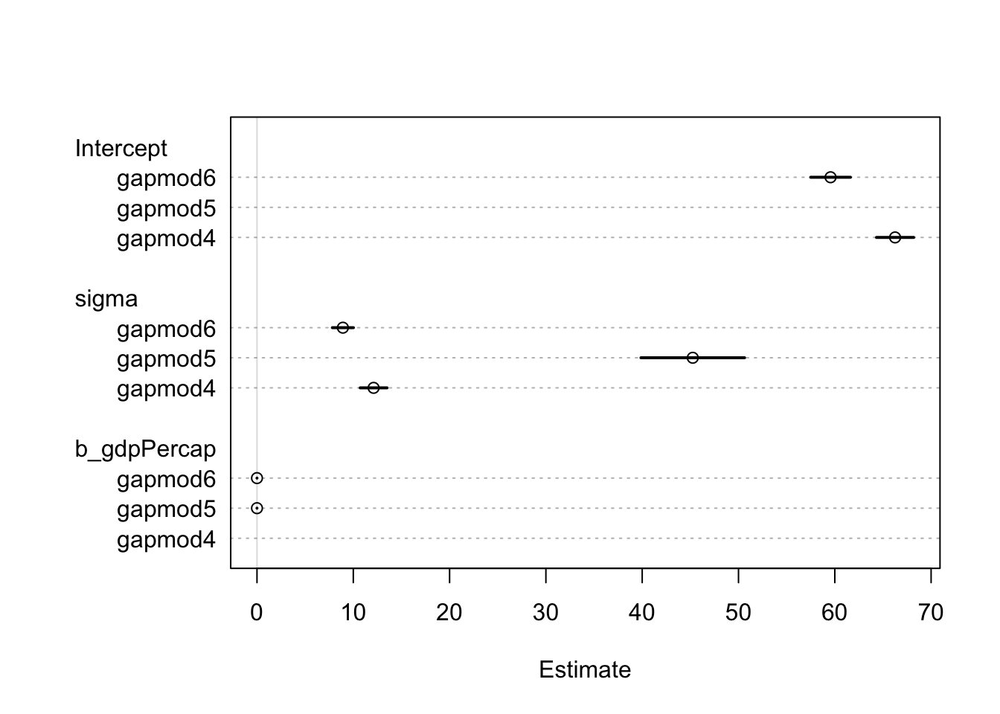
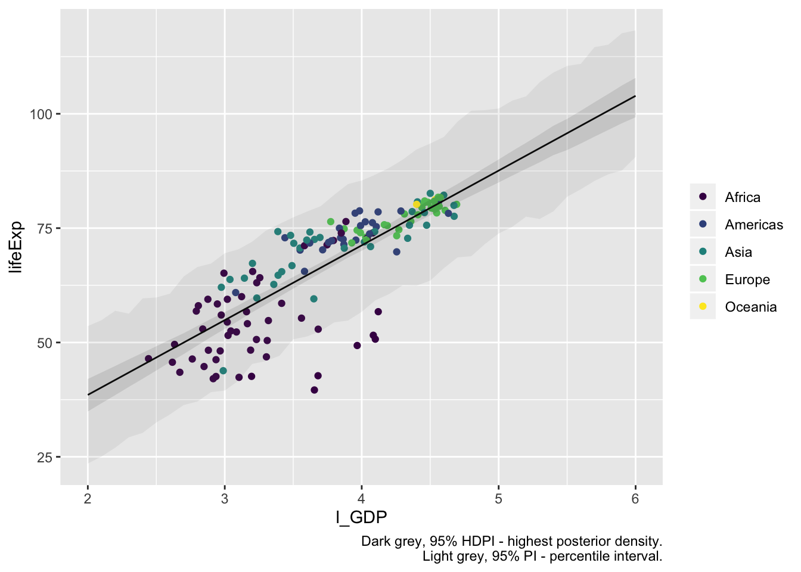
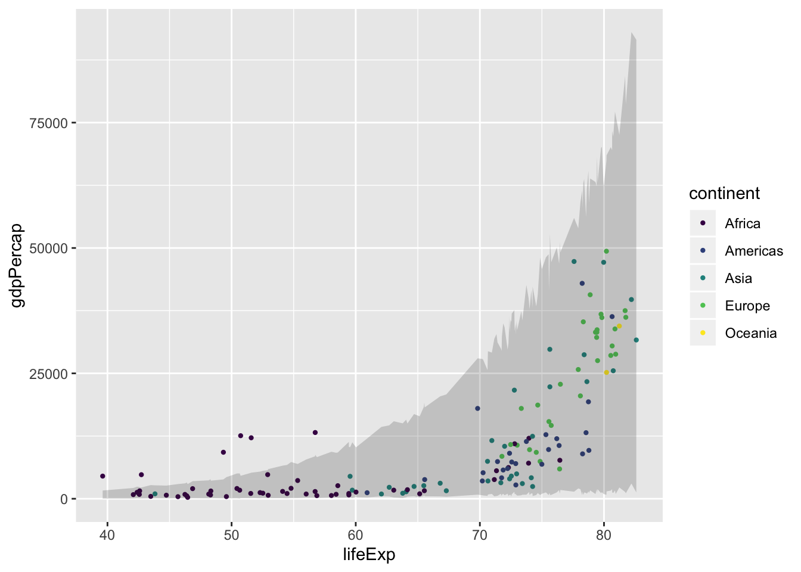

# Bayesi meetodil lineaarse mudeli fittimine


```r
library(tidyverse)
library(gapminder)
library(rethinking)
```

Nüüd Bayesi mudelid. 
"rethinking" paketi `glimmer()` on abivahend, mis konverteerib `lm()` mudeli kirjelduse Bayesi mudeli kirjelduseks kasutades normaaljaotusega tõepära mudelit.
Intercept only model

```r
g2007 <- gapminder %>% 
  filter(year == 2007)
intercept_only <- glimmer(lifeExp ~ 1, data = g2007)
#> alist(
#>     lifeExp ~ dnorm( mu , sigma ),
#>     mu <- Intercept,
#>     Intercept ~ dnorm(0,10),
#>     sigma ~ dcauchy(0,2)
#> )
```

Ainult interceptiga mudel. 
Keskväärtus ehk mu on ümber defineeritud kui intercept, aga see annab talle lihtsalt uue nime. 
Sama hästi oleksime võinud fittida mudelit, kus hindame otse mu keskväärtust (nagu me eelmises peatükis tegime). 
Pane tähele, et võrreldes `lm()` funktsiooniga on meil mudelis lisaparameeter --- sigma. 
Kui Intercept annab meile keskmise eluea, siis sigma annab eluigade standardhälbe riikide vahel.

> Kui me tahame fittida lineaarset mudelit, siis peab tõepära funktsioon olema kas normaaljaotus või studenti t jaotus.


```r
gapmod4 <- map2stan(flist = intercept_only$f, data = intercept_only$d)
```


```r
precis(gapmod4)
#>           Mean StdDev lower 0.89 upper 0.89 n_eff Rhat
#> Intercept 66.3   0.99       64.6       67.8   694    1
#> sigma     12.1   0.71       11.0       13.2   554    1
```

Nüüd ilma interceptita mudel

```r
no_intercept <- glimmer(lifeExp ~ -1 + gdpPercap, data = g2007)
#> alist(
#>     lifeExp ~ dnorm( mu , sigma ),
#>     mu <- b_gdpPercap*gdpPercap,
#>     b_gdpPercap ~ dnorm(0,10),
#>     sigma ~ dcauchy(0,2)
#> )
```

Selline Bayesi mudeli esitus on "ilusam" kui `lm()` sest ta toob mudeli eksplitsiitselt välja (samas kui lm notatsioon ütleb, et mudel on "miinus intercept") 


```r
gapmod5 <- map2stan(flist = no_intercept$f, data = no_intercept$d)
```


```r
precis(gapmod5)
#>             Mean StdDev lower 0.89 upper 0.89 n_eff Rhat
#> b_gdpPercap  0.0   0.00        0.0        0.0   888    1
#> sigma       45.2   2.75       40.8       49.4   187    1
```

Ja lõpuks täismudel:

```r
full_model <- glimmer(lifeExp ~ gdpPercap, data = g2007)
#> alist(
#>     lifeExp ~ dnorm( mu , sigma ),
#>     mu <- Intercept +
#>         b_gdpPercap*gdpPercap,
#>     Intercept ~ dnorm(0,10),
#>     b_gdpPercap ~ dnorm(0,10),
#>     sigma ~ dcauchy(0,2)
#> )
```


```r
gapmod6 <- map2stan(flist = full_model$f, data = full_model$d)
```


```r
compare(gapmod4, gapmod5, gapmod6)
#>         WAIC pWAIC dWAIC weight    SE   dSE
#> gapmod6 1028   2.6   0.0      1 14.07    NA
#> gapmod4 1113   1.5  85.7      0 12.09  9.67
#> gapmod5 1486   0.8 458.8      0  7.29 15.70
```

Jälle on täismudel võitja ja kui intercept nulli suruda, saame kehveima tulemuse.
Siin me kasutame AIC-i Bayesi analoogi WAIC, mis nende mudelite peal peaks töötama veidi paremini kui AIC. 
Aga see on tehniline detail.
WAIC abil mudeleid võrreldes saame muuhulgas mudeli kaalu. 
Antud juhul on 100% kaalust gapmo6-l ja ülejäänud mudelitele ei jää midagi.


```r
plot(coeftab(gapmod4, gapmod5, gapmod6))
```

<div class="figure" style="text-align: center">

<p class="caption">(\#fig:unnamed-chunk-15)Mudelite võrdlusplot.</p>
</div>


Viime SKP andmed log-skaalasse ja proovime uuesti. See tähendab, et me arvame, et iga SKP kümnekordne tõus võiks kaasa tuua eluea tõusu x aasta võrra.

```r
g2007 <- g2007 %>% 
  mutate(l_GDP = log10(gdpPercap))
# glimmer(lifeExp ~ -1 + l_GDP, data = g2007)
gapmod7 <- map2stan(alist(
    lifeExp ~ dnorm(mu, sigma),
    mu <- b_gdp * l_GDP,
    b_gdp ~ dnorm(0, 10),
    sigma ~ dcauchy(0, 2)
), data = g2007)

gapmod8 <- map2stan(alist(
    lifeExp ~ dnorm(mu, sigma),
    mu <- Intercept + b_gdp * l_GDP,
    Intercept ~ dnorm(0, 100),
    b_gdp ~ dnorm(0, 10),
    sigma ~ dcauchy(0, 2)
), data = g2007)
```


```r
compare(gapmod4, gapmod5, gapmod6, gapmod7, gapmod8)
#>         WAIC pWAIC dWAIC weight    SE   dSE
#> gapmod7  965   3.0   0.0   0.53 25.11    NA
#> gapmod8  966   3.8   0.2   0.47 25.37  2.56
#> gapmod6 1028   2.6  62.4   0.00 14.07 18.21
#> gapmod4 1113   1.5 148.1   0.00 12.09 23.18
#> gapmod5 1486   0.8 521.1   0.00  7.29 26.82
```


<div class="figure" style="text-align: center">

<p class="caption">(\#fig:unnamed-chunk-19)Log skaalas töötab nulli surutud interceptiga mudel sama hästi kui täismudel. See ei ole paraku mudeldamise üldine omadus.</p>
</div>

Kuna Bayesi mudelite fittimine on keerulisem kui `lm()` abil, on eriti tähtis fititud mudel välja plottida. 
See on esimene kaitseliin lollide vigade ja halvasti jooksvate Markovi ahelate vastu. 

Kui Bayesi mudeleid on raskem fittida, siis milleks me peaksime neid eelistama tavalistele vähimruutude meetodil fititud mudelitele? 
Tegelikult alati ei peagi. 
Aga siiski, Bayesi mudelid sisaldavad eksplitsiitset veakomonenti (sigma), mis on kasulik mudelist uusi andmeid ennustades. 
Samuti annavad nad parima hinnangu ebakindlusele parmeetrite väärtuste hinnangute ümber, võimaldavad mudeli fittimisel siduda andmeid taustainfoga (prior) ning, mis kõige tähtsam, võimaldavad paindlikumalt fittida hierarhilisi mudeleid (nende juurde tuleme hiljem). 

Samas, kui prior on väheinformatiivne, siis Bayesi hinnangud mudeli koefitsientide kõige tõenäolisematele väärtustele on praktiliselt samad, kui vähimruutude meetodiga `lm()` abil saadud punkt-hinnangud.

Siin me fitime pedagooglistel kaalutlustel kõike Bayesiga aga praktikas jätavad paljud mõistlikud inimesed Bayesi hierarhiliste mudelite jaoks ja kasutavad lihtsate mudelite jaoks `lm()`. 

Tagasi gapmod7 ja gapmod8 mudelite juurde. 
Plotime nende koefitsiendid koos usalduspiiridega.

```r
plot(coeftab(gapmod7, gapmod8))
```

<div class="figure" style="text-align: center">

<p class="caption">(\#fig:unnamed-chunk-20)Mudelite võrdlusplot.</p>
</div>

Pane tähele, et gapmod8 "b_gdp" koefitsiendi posteerior on palju laiem kui gapmod7 "b_gdp" oma.
See on üldine nähtus, mis tuleneb sellest, et gapmod7-s on vähem parameetreid. 
**Iga lisatud parameeter kipub vähendama teiste parameetrite hindamise täpsust.**

## Ennustused mudelist {-}

Kuidas plottida meie hinnangud ebakindlusele parameetri tegeliku väärtuse ümber?
Siin tuleb appi `rethinking::link()`.

Nii tõmbame posteriorist igale meie andmetes esinevale log GDP väärtusele vastavad 1000 ennustust keskmise eluea kohta sellel l_GDP väärtusel: 


```r
linked <- link(gapmod8)
linked <- as_tibble(linked)
linked_mean <- apply(linked, 2, HPDI, prob = 0.95)
```

Sel viisil saab tabeli, kus igale 142-le andmepunktist vastab üks veerg, milles on 1000 posteeriorist arvutatud ennustust lifeExp väärtusele.

Praktikas soovime aga enamasti meie poolt ette antud l_GDP väärtustel põhinevaid ennustusi keskmise eluea kohta. See käib nii:


```r
# link() draws from the posterior 1000 mu values for each l_GDP value in the width object; out pops a table with 1000 rows and 41 columns. 
mu1 <- as_tibble(link(gapmod8, data = list(l_GDP = seq(2, 6, 0.1))))
#> [ 100 / 1000 ]
[ 200 / 1000 ]
[ 300 / 1000 ]
[ 400 / 1000 ]
[ 500 / 1000 ]
[ 600 / 1000 ]
[ 700 / 1000 ]
[ 800 / 1000 ]
[ 900 / 1000 ]
[ 1000 / 1000 ]
```

Nüüd on meil mu1 objektis 41 l_GDP väärtust, millest igale vastab 1000 ennustust keskmise eluea kohta sellel l_GDP-l. 
Järgmiseks arvutame igale neist 41-st tulbast keskmise ja 95% HPDI ning plotime need koos andmepunktidega kasutades base-R graafikasüsteemi.


Pane tähele, et hall riba näitab ebakindlust ennustuse ümber keskmisele elueale üle kõikide riikide, mis võiksid sellist l_GDP-d omada (ehk ebakindlust regressioonijoonele). 
Kui me aga tahame ennustada ka keskmiste eluigade varieeruvust riigi tasemel (kasutades Bayesi hinnangut sigma parameetrile), siis on meil vaja `sim()` funktsiooni:


```r
mu.mean <- apply(mu1, 2, mean) # applies the FUN mean() to each column
mu.HPDI <- apply(mu1, 2, HPDI, prob = 0.95) %>% 
  t() %>% 
  as_data_frame()
mu.HPDI <- bind_cols(width = seq(2, 6, 0.1), mu.HPDI)
colnames(mu.HPDI) <- c("width", "lower", "upper")
sim.length <- as_tibble(sim(gapmod8, data = list(l_GDP = seq(2, 6, 0.1))))
#> [ 100 / 1000 ]
[ 200 / 1000 ]
[ 300 / 1000 ]
[ 400 / 1000 ]
[ 500 / 1000 ]
[ 600 / 1000 ]
[ 700 / 1000 ]
[ 800 / 1000 ]
[ 900 / 1000 ]
[ 1000 / 1000 ]
height.PI <- sapply(sim.length, PI, prob = 0.95, simplify = FALSE) %>% 
  do.call(rbind,. )
height.PI <- cbind(width = seq(2, 6, 0.1), height.PI) %>% as_tibble()
colnames(height.PI) <- c("width", "lower", "upper")
```


```r
library(viridis)
ggplot(g2007) +
  geom_point(aes(l_GDP, lifeExp, color = continent)) +
  geom_line(data = data_frame(width = seq(2, 6, 0.1), mu.mean), aes(width, mu.mean)) +
  geom_ribbon(data = mu.HPDI, aes(x = width, ymin = lower, ymax = upper), 
              fill = "grey5", alpha = 0.1) +
  geom_ribbon(data = height.PI, aes(x = width, ymin = lower, ymax = upper), 
              fill = "grey50", alpha = 0.1) +
  labs(caption = "Dark grey, 95% HDPI - highest posterior density.\nLight grey, 95% PI - percentile interval.") +
  theme(legend.title = element_blank()) +
  scale_color_viridis(discrete = TRUE)
```

<div class="figure" style="text-align: center">

<p class="caption">(\#fig:unnamed-chunk-24)Ennustused mudelist.</p>
</div>

Nüüd ütleb laiem hall ala, et me oleme üsna kindlad, et nende riikide puhul, mille puhul mudel töötab, kohtame individaalsete riikide keskmiseid eluigasid halli ala sees ja mitte sealt väljas. 
Nagu näha, on meil ka riike, mis jäävad hallist alast kaugele ja mille keskmine eluiga on kõvasti madalam, kui mudel ennustab. 
Need on äkki riigid, kus parasjagu on sõda üle käinud ja mille eluiga ei ole näiteks seetõttu SKP-ga lihtsas põhjuslikus seoses. 
Igal juhul tasuks need ükshaaval üle vaadata sest punktid, mida mudel ei seleta, võivad varjata endas mõnd huvitavat saladust, mis pikisilmi ootab avastajat. 
Lisaks: pane tähele, et mudel eeldab, et riikide keskmise eluea SD on muutumatu igal GDP väärtusel.


Kuidas saada ennustusi kindlale l_GDP väärtusele? Näiteks tulp V10 vastab l_GDP väärtusele 2.9. Järgnevalt arvutame oodatavad keskmised eluead sellele SKP väärtusele (fiksionaalsetele riikidele, millel võiks olla täpselt selline SKP):

```r
dens(sim.length$V10)
HPDI(sim.length$V10, prob = 0.95)
#> |0.95 0.95| 
#>  40.5  67.2
```

<div class="figure" style="text-align: center">

<p class="caption">(\#fig:unnamed-chunk-25)Ennustus mudelist kindlale log GDP väärtusele.</p>
</div>

Nagu näha, võib mudeli kohaselt sellise riigi keskmine eluiga tulla nii madal, kui 40 aastat ja nii kõrge kui 67 aastat.

## Lognormaalne tõepäramudel {-}

See mudel on alternatiiv andmete logaritmimisele, kui Y-muutuja (see muutuja, mille väärtust te ennustate) on lognormaalse jaotusega. 


> Lognormaalne Y-i tõepäramudel on mittelineaarne. Lognormaaljaotus defineetitakse üle mu ja sigma, mis aga vastavd hoopis log(Y) normaaljaotuse mu-le ja sigmale.

Seekord ennustame GDP-d keskmise eluea põhjal (mis, nagu näha jooniselt, ei ole küll päris lognormaalne).

<div class="figure" style="text-align: center">

<p class="caption">(\#fig:unnamed-chunk-26)SKP-de jaotus</p>
</div>

Mustaga on näidatud empiiriline SKP jaotus, rohelisega fititud lognormaalne mudel sellest samast jaotusest. Järgnevalt ennustame SKP-d keskmise eluea põhjal, milleks fitime lognormaalse tõepäramudeli, kus mu on ümber defineeritud regressioonivõrrandiga:


```r
m_ln1 <- map2stan(
  alist(
   gdpPercap  ~ dlnorm( mu , sigma ),
    mu <- a + b * lifeExp,
    a ~ dnorm( 0, 10 ),
    b ~ dnorm( 0, 10 ),
    sigma ~ dcauchy( 0, 2 ) 
   ), 
  data = g2007, 
  start = list( a = 3, b = 0, sigma = 0.5 ) 
  )
```


```r
precis(m_ln1)
#>       Mean StdDev lower 0.89 upper 0.89 n_eff Rhat
#> a     2.48   0.38       1.87       3.08   283    1
#> b     0.09   0.01       0.08       0.10   287    1
#> sigma 0.81   0.05       0.74       0.88   294    1
```

Logormaalses mudelis muutuvad parameetrite tähendused ja need tuleb lineaarse mudeli intercepti ja tõusu interpretatsioonidega kooskõlla viimiseks ümber arvutada. Kõigepealt avaldame tõusu. Kuna meil on tegemist mitte-lineaarse mudeliga, sõltub tõusu väärtus ka mudeli interceptist: $slope = exp(\alpha + \beta)-exp(\alpha)$. See ei ole lineaarne seos: b omab seda suuremat mõju efektile (tõusule), mida suurem on a. [Kui meil on tegu binaarse X-ga (prediktoriga), siis kodeerime selle 2 taset kui -1 ja 1. Sellises mudelis on slope sama, mis efekti suurus ES, ja $ES = exp(\alpha + \beta)-exp(\alpha-\beta)$]


```r
a <- seq( 0, 10, length.out = 1000 )
b <- 2
b1 <- 3
y <- exp( a + b ) - exp( a )
y1 <- exp( a + b1 ) - exp( a )

plot( a, y, type = "l", xlab = "a value", ylab = "slope" )
lines( a, y1, col = "red" )
```

<div class="figure" style="text-align: center">

<p class="caption">(\#fig:unnamed-chunk-30)Mudeli tõus sõltub interceptist.</p>
</div>

Must joon näitab mudeli tõusu sõltuvust parameetri a väärtusest, kui parameeter b = 2. Punane joon teeb sedasama, kui b = 3.

Selline on siis mudeli tõusude (beta) posteerior:


```r
s_ln1 <- extract.samples( m_ln1 ) %>% as.data.frame()
beta <- exp(s_ln1$a + s_ln1$b) - exp(s_ln1$a)
```


```r
dens(beta)
```

<div class="figure" style="text-align: center">

<p class="caption">(\#fig:unnamed-chunk-32)Mudeli tõusude (beta) posteerior.</p>
</div>

Lognormaaljaotusega mudelis täidab normaaljaotusega mudeli intercepti rolli eelkõige meedian, mis on defineeritud kui exp(a), aga arvutada saab ka keskmise:

```r
i_median <- exp(s_ln1$a)
mean(i_median)
#> [1] 12.8
i_mean <- exp(s_ln1$a + (s_ln1$sigma ^ 2) / 2)
mean(i_mean)
#> [1] 17.8
```

Siin ennustame fititud mudelist uusi andmeid (väljamõeldud riikide rikkust):


```r
sim_ci <- sim(m_ln1) %>% 
  as_tibble() %>% 
  apply(2, HPDI, prob = 0.95)
#> [ 100 / 1000 ]
[ 200 / 1000 ]
[ 300 / 1000 ]
[ 400 / 1000 ]
[ 500 / 1000 ]
[ 600 / 1000 ]
[ 700 / 1000 ]
[ 800 / 1000 ]
[ 900 / 1000 ]
[ 1000 / 1000 ]
```


```r
ggplot(g2007, aes(lifeExp, gdpPercap)) + 
  geom_point(aes(color = continent), size = 0.8) +
  geom_ribbon(aes( ymin = sim_ci[1,], ymax = sim_ci[2,]), alpha = 0.2) +
  scale_color_viridis(discrete = TRUE)
```

<div class="figure" style="text-align: center">

<p class="caption">(\#fig:unnamed-chunk-35)Ennustus mudelist.</p>
</div>


Ka see mudel jääb hätta Aafrika outlieritega, mille eluiga ei suuda ennustada rikkust.
