# brms

**brms** on pakett, mis võimaldab kirjutada lihtsat süntaksit kasutades ka üsna keerulisi mudeleid ja need Stan-is fittida. Brms on loodud Paul Bürkneri poolt (https://github.com/paul-buerkner/brms), mis on oma kasutuslihtsuse tõttu jõudnud isegi ette Stani meeskonna arendatavast analoogsest paketist **rstanarm** (https://github.com/stan-dev/rstanarm/blob/master/README.md). Paul Bürkner oli mõned aastad tagasi psühholoogia doktorant, kes kirjutas brms-i algselt naljaviluks oma doktoriprojekti kõrvalt, mille tulemusel on ta praegu teatud ringkonnis tuntum kui Lady Gaga.  

**rstanarm**, mide me siin ei käsitle, püüab pakkuda tavalisete sageduslikele meetoditele (ANOVA, lineaarne regressioon jne) bayesi analooge, mille mudeli spetsifikatsioon ja väljund erineks võimalikult vähe tavalisest baas-R-i töövoost. **brms** on keskendunud mitmetasemelistele mudelitele ja kasutab põhimõtteliselt **lme4** (https://github.com/lme4/lme4/) mudelite keelt. Loomulikult saab **brms**-is fittida ka lineaarseid ja mitte-lineaareid ühetasemelisi mudeleid, nagu ka imputeerida andmeid ja teha palju muud (nagu näiteks pitsat valmistada).


```r
library(tidyverse)
library(skimr)
library(brms)
library(loo)
library(broom)
library(bayesplot)
library(gridExtra)
library(mice)
library(pROC)
```

## brms-i töövoog

**brms**-iga modelleerimisel on mõned asjad, mida tuleks teha sõltumata sellest, millist mudelit te parajasti fitite. Kõigepealt peaksite kontrollima, et mcmc ahelad on korralikult jooksnud (divergent transitions, rhat ja ahelate visuaalne inspekteerimine). Lisaks peaksite tegema posterioorse prediktiivse ploti ja vaatama, kui palju mudeli poolt genereeritud uued valimid meenutavad teie valimit. Samuti peaksite joonisel plottima residuaalid. Kui te inspekteerite fititud parameetrite väärtusi, siis tehke seda posteeriorite tasemel, k.a. koos veapiiridega. Kindlasti tuleks ka plottida mudeli ennustused koos usalduspiiridega.

Enne tõsist mudeldamist kiikame irise andmetabelisse


```r
skim(iris)
#> Skim summary statistics
#>  n obs: 150 
#>  n variables: 5 
#> 
#> ── Variable type:factor ───────────────────────────────────────────────────
#>  variable missing complete   n n_unique                       top_counts
#>   Species       0      150 150        3 set: 50, ver: 50, vir: 50, NA: 0
#>  ordered
#>    FALSE
#> 
#> ── Variable type:numeric ──────────────────────────────────────────────────
#>      variable missing complete   n mean   sd  p0 p25  p50 p75 p100
#>  Petal.Length       0      150 150 3.76 1.77 1   1.6 4.35 5.1  6.9
#>   Petal.Width       0      150 150 1.2  0.76 0.1 0.3 1.3  1.8  2.5
#>  Sepal.Length       0      150 150 5.84 0.83 4.3 5.1 5.8  6.4  7.9
#>   Sepal.Width       0      150 150 3.06 0.44 2   2.8 3    3.3  4.4
#>      hist
#>  ▇▁▁▂▅▅▃▁
#>  ▇▁▁▅▃▃▂▂
#>  ▂▇▅▇▆▅▂▂
#>  ▁▂▅▇▃▂▁▁
```


```r
ggplot(iris, aes(Petal.Length, Sepal.Length)) + 
  geom_point(aes(color = Species)) +
  geom_smooth(method = "loess", color = "black") +
  geom_smooth(method = "lm")
```


Loess fit viitab, et 3 liiki ühe sirgega mudeldada pole võib-olla optimaalne lahendus.


```r
ggplot(iris, aes(Petal.Length, Sepal.Length, color = Species)) + 
  geom_point() +
  geom_smooth(method = "loess", aes(group = Species), color = "black") +
  geom_smooth(method = "lm")
```


Nüüd on loess ja lm heas kooskõlas - seos y~x vahel oleks nagu enam-vähem lineaarne. Siit tuleb ka välja, et kolme mudeli tõusud on sarnased, interceptid erinevad.

### Kiire töövoog

Minimaalses töövoos anname ette võimalikult vähe parameetreid ja töötame mudeliga nii vähe kui võimalik. See on mõeldud ülevaatena Bayesi mudeli fittimise põhilistest etappidest 

Mudeli fittimine:

```r
m_kiire <- brm(Sepal.Length ~ Petal.Length, data = iris)
write_rds(m_kiire, path = "data/m_kiire.fit")
```

Priorid on brms-i poolt ette antud ja loomulikult ei sisalda mingit teaduslikku informatsiooni. Nad on siiski "nõrgalt informatiivsed" selles mõttes, et kasutavad parametriseeringuid, mis enamasti võimaldavad mcmc ahelatel normaalselt joosta. Järgmises ptk-s õpime ise prioreid määrama.

Posteeriorid ja mcmc ahelate konvergents


```r
plot(m_kiire)
```


Fiti kokkuvõte - koefitsiendid ja nende fittimise edukust hindavad statistikud (Eff.Sample, Rhat)

```r
tidy(m_kiire)
#>             term estimate std.error   lower   upper
#> 1    b_Intercept    4.307    0.0780   4.179   4.434
#> 2 b_Petal.Length    0.409    0.0187   0.379   0.439
#> 3          sigma    0.411    0.0243   0.373   0.453
#> 4           lp__  -85.338    1.2173 -87.757 -84.015
```

Eff.Sample näitab efektiivset valimi suurust, mida ahelad on kasutanud. See on suht keeruline mõiste, aga piisab, kui aru saada, et see näitaja ei tohiks olla madalam kui paarkümmend.

Rhat on statistik, mis vaatab ahelate konvergentsi. Kui Rhat > 1.1, siis on kuri karjas. Rhat 1.0 ei tähenda paraku, et võiks rahulikult hingata -- tegu on statistikuga, mida saab hästi tõlgendada häda kuulutajana, aga liiga sageli mitte vastupidi.

Ennustav plot ehk *marginal plot* -- mudeli fit 95% CI-ga.

```r
plot(marginal_effects(m_kiire), points = TRUE)
```


### Põhjalikum töövoog

Põhiline erinevus eelmisega on suurem tähelepanu prioritele, mudeli fittimise diagnostikale ning tööle fititud mudeliga.

### Spetsifitseerime mudeli, vaatame ja muudame vaikeprioreid 

brms-i default priorid on konstrueeritud olema üsna väheinformatiivsed ja need tuleks enamasti informatiivsematega asendada. Igasse priorisse tuleks panna nii palju informatsiooni, kui teil on vastava parameetri kohta. Kui te mõne parameetri kohta ei oska öelda, milllised oleks selle mõistlikud oodatavad väärtused, siis saab piirduda brms-i antud vaikeväärtustega. Samas, kui keerulisemad mudelid ei taha hästi joosta (mida tuleb ikka ette), siis aitab sageli priorite kitsamaks muutmine.


```r
get_prior(Sepal.Length ~ Petal.Length + (1 | Species), 
          data = iris)
#>                 prior     class         coef   group resp dpar nlpar bound
#> 1                             b                                           
#> 2                             b Petal.Length                              
#> 3 student_t(3, 6, 10) Intercept                                           
#> 4 student_t(3, 0, 10)        sd                                           
#> 5                            sd              Species                      
#> 6                            sd    Intercept Species                      
#> 7 student_t(3, 0, 10)     sigma
```

Me fitime pedagoogilistel kaalutlustel shrinkage mudeli, mis tõmbab 3 liigi lõikepunkte natuke keskmise lõikepunkti suunas. On vaieldav, kas see on irise andmestiku juures mõistlik strateegia, aga me teeme seda siin ikkagi.

> Mitmetasemeline shrinkage mudel on abinõu ülefittimise vastu. Mudelite võrdlemisel otsitakse kompromissi - ehk mudeli, mille ennustused oleks andmepunktidele võimalikult lähedal ilma,et see mudel oleks liiga keeruliseks aetud (keerulisus on proportsionaalne mudeli parameetrite arvuga).


Prioreid muudame nii:

```r
prior <- c(prior(normal(6, 3), class = "Intercept"),
           prior(normal(0, 1), class = "b"),
           prior(student_t(6, 0, 2), class = "sigma"))
```

Me valime siin nn väheinformariivsed priorid, nii et regressiooni tulemus on suht hästi võrreldav lme4 sagedusliku mudeliga. "b" koefitsiendi priorile (aga mitte "sigma" ega "Intercept"-le) võib anda ka ülemise ja/või alumise piiri `prior(normal(0, 1), class = "b", lb = -1, ub = 10)` ütleb, et "b" prior on nullist erinev ainult -1 ja 10 vahel. "sigma" priorid on automaatselt lb = 0-ga, sest varieeruvus ei tohi olla negatiivne. 

Alati tasub prioreid pildil vaadata, et veenduda nende mõistlikuses.

```r
x <- seq(0, 10, length.out = 100)
y <- dstudent_t(x, df = 6, mu = 0, sigma = 2, log = FALSE)
plot(y ~ x)
```

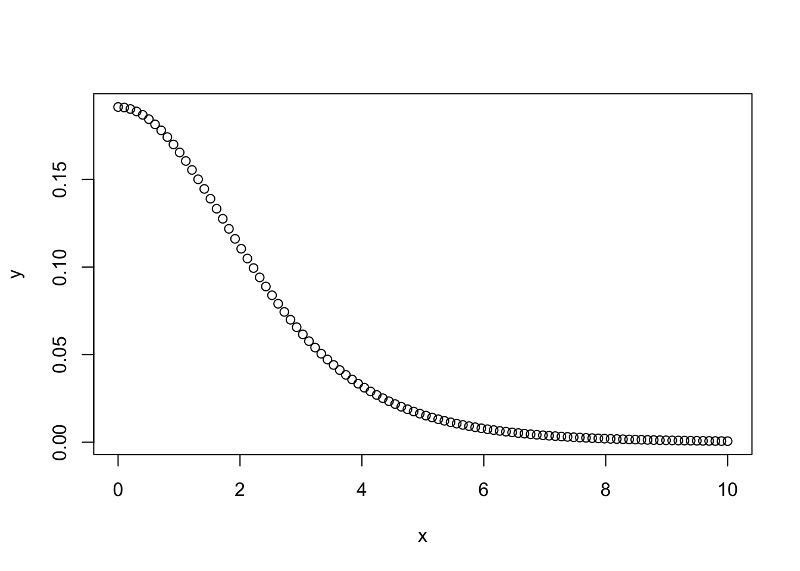
Sigma prior, mida **brms** kasutab, on vaikimisi pool sümmeetrilisest jaotusest, mis lõigatakse nulli kohalt pooleks nii, et seal puuduvad < 0 väärtused (seega ei saa varieeruvuse posteerior minna alla nulli).

Me võime ka prioreid ilma likelihoodideta (tõepärafunktsioonideta) läbi mudeli lasta, misjärel tõmbame fititud mudelist priorite valimid (neid võiks kutsuda ka "priorite posteerioriteks") ja plotime kõik priorid koos. Seda pilti saab siis võrrelda koos andmetega fititud mudeli posteerioritega. Selle võimaluse kasutamine on tõusuteel, sest keerulisemate mudelite puhul võib priorite ükshaaval plottimine osutuda eksitavaks.

Tekitame priorite valimid, et näha oma priorite mõistlikust (brm() argument on sample_prior = TRUE). Ühtlasi fitime ka oma mudeli koos andmete ja prioritega.

```r
m1 <- brm(Sepal.Length ~ Petal.Length + (1 | Species), 
          data = iris, 
          prior = prior, 
          family = gaussian,
          warmup = 1000,
          iter = 2000,
          chains = 3,
          cores = 3,
          sample_prior = TRUE)
write_rds(m1, path = "data/m1.fit")
```

Me fittisime mudeli m1 kaks korda: nii andmetega (selle juurde jõuame varsti), kui ka ilma andmeteta. Kui panna sisse `sample_prior = "only"`, siis jookseb mudel ilma andmeteta, ja selle võrra kiiremini. Vaikeväärtus on `sample_prior = "no"`, mis tähendab, et fititakse ainult üks mudel - koos andmetega. Ilma andmeteta (likelihoodita) fitist saame tõmmata priorite mcmc valimid, mille ka järgmiseks plotime. 


```r
prior_samples(m1) %>% 
  gather() %>% 
  ggplot() + 
  geom_density(aes(value)) + 
  facet_wrap(~ key, scales = "free_x")
```

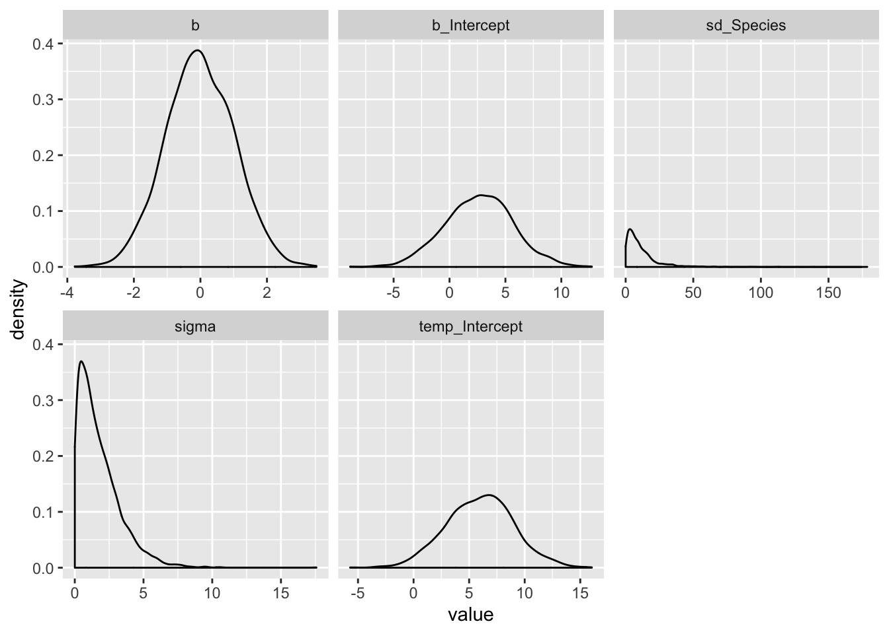

Kui kasutame `sample_prior = "only"` varianti, siis on esimene koodirida erinev: `samples1 = as.data.frame(m1$fit)`.

> **brms**-i Intercepti priorite spetsifitseerimisel tasub teada, et **brms** oma sisemuses tsentreerib kõik prediktorid nullile (x - mean(x)), ja teie poolt ette antud prior peaks vastama neile tsentreeritud prediktoritele, kus kõikide prediktorite keskväärtus on null. Põhjus on, et tsentreeritud parametriseeringuga mudelid jooksevad sageli paremini. Alternatiiv on kasutada mudeli tavapärase süntaksi y ~ 1 + x (või ekvivalentselt y ~ x) asemel süntaksit y ~ 0 + intercept + x. Sellisel juhul saab anda priorid tsentreerimata predikroritele. Lisaks on **brms** selle süntaksi puhul nõus "b"-le antud prioreid vaikimisi ka intercepti fittimisel kasutama. 


### `brm()` funktsiooni argumendid: 

- family - tõepärafunktsiooni tüüp (modelleerib y muutuja jaotust e likelihoodi)

- warmup - mitu sammu mcmc ahel astub, enne kui ahelat salvestama hakatakse. tavaliselt on 500-1000 sammu piisav, et tagada ahelate konvergents. Kui ei ole, tõstke 2000 sammuni.

- iter - ahelate sammude arv, mida salvestatakse peale warmup perioodi. Enamasti on 2000 piisav. Kui olete nõus piirduma posteeriori keskväärtuse arvutamisega ja ei soovi täpseid usaldusintervalle, siis võib piisata ka 200 sammust. 

- chains - mitu sõltumatut mcmc ahelat jooksutada. 3 on hea selleks, et näha kas ahelad konvergeeruvad. Kui mitte, tuleks lisada informatiivsemaid prioreid ja/või warmupi pikkust.

- cores - mitu teie arvuti tuuma ahelaid jooksutama panna.

- adapt_delta - mida suurem number (max = 1), seda stabiilsemalt, ja aeglasemalt, ahelad jooksevad.

- thin - kui ahel on autokorreleeritud, st ahela eelmine samm suudab ennustada järgevaid (see on paha), siis saab salvestada näit ahela iga 5. sammu (thin = 5). Aga siis tuleks ka sammude arvu 5 korda tõsta. Vaikeväärtus on thin = 1. Autokorrelatsiooni graafilist määramist näitame allpool

Järgmine funktsioon trükib välja Stani koodi, mis spetsifitseerib mudeli, mida tegelikult Stanis fittima hakatakse. See on väga kasulik, aga ainult siis kui tahate õppida otse Stanis mudeleid kirjutama:


```r
make_stancode(Sepal.Length ~ Petal.Length, data = iris, prior = prior)
```

### Fitime mudeleid ja võrdleme fitte.

Eelmises mudelis (m1) ennustame muutuja Sepal.Length väärtusi Petal.Length väärtuste põhjal shrinkage mudelis, kus iga irise liik on oma grupis.

Teine mudel, mis sisaldab veel üht ennustavat muutujat (Sepal.Width):

```r
m2 <- brm(Sepal.Length ~ Petal.Length + Sepal.Width + (1 | Species), 
          data = iris, 
          prior = prior)
write_rds(m2, path = "data/m2.fit")
```

Kolmandaks ühetasemeline mudel, mis vaatab kolme irise liiki eraldi:

```r
m3 <- brm(Sepal.Length ~ Sepal.Width + Petal.Length * Species, 
          data = iris, 
          prior = prior)
write_rds(m3, path = "data/m3.fit")
```

Ja lõpuks mudel, mis paneb kõik liigid ühte patta:

```r
m4 <- brm(Sepal.Length ~ Petal.Length + Sepal.Width, 
          data = iris, 
          prior = prior)
write_rds(m4, path = "data/m4.fit")
```


Siin me võrdleme neid nelja mudelit. Väikseim looic (leave-one-out information criterion) võidab. See on suhteline võrdlus -- looic abs väärtus ei mängi mingit rolli. 


```r
loo(m1, m2, m3, m4)
#>          LOOIC    SE
#> m1      106.43 16.65
#> m2       81.61 16.11
#> m3       80.06 15.77
#> m4      100.55 16.41
#> m1 - m2  24.82  9.63
#> m1 - m3  26.37 10.66
#> m1 - m4   5.88 15.28
#> m2 - m3   1.55  3.34
#> m2 - m4 -18.94  9.90
#> m3 - m4 -20.49  9.95
```

Siin on m1 ja m2/m3 mudeli erinevus 25 ühikut ja selle erinevuse standardviga on 10 ühikut. 2 SE-d annab umbkaudu 95% usaldusintervalli, ja see ei kata antud juhul nulli. Seega järeldame, et m2 ja m3, mis kasutavad ennustamiseks lisamuutujat, on selgelt eelistatud. Samas ei saa me õelda, et hierarhiline mudel m2 oleks parem või halvem kui interaktsioonimudel m3. Ka puudub oluline erinevus m1 ja m4 fiti vahel. Tundub, et selle ennustusjõu, mille me võidame lisaparameetrit mudeldades, kaotame omakorda liike ühte patta pannes (neid mitte osaliselt iseseisvana modelleerides).

Alternatiivina kasutame `brms::waic` kriteeriumit mudelite võrdlemiseks. See töötab kiiremini kui LOO ja tõlgendus on sarnane - väikseim waic võidab ja absolutväärtusi ei saa ükshaaval tõlgendada. 


```r
waic(m1, m2, m3, m4)
#>           WAIC    SE
#> m1      106.40 16.64
#> m2       81.55 16.10
#> m3       79.96 15.76
#> m4      100.53 16.41
#> m1 - m2  24.85  9.63
#> m1 - m3  26.44 10.67
#> m1 - m4   5.87 15.28
#> m2 - m3   1.60  3.34
#> m2 - m4 -18.98  9.90
#> m3 - m4 -20.57  9.95
```

Nagu näha, annavad LOO ja waic sageli väga sarnaseid tulemusi.

Me ei süvene LOOIC ega waic-i statistilisse mõttesse, sest bayesi mudelite võrdlemine on kiiresti arenev ala, kus ühte parimat lahendust pole veel leitud. 

### Vaatame mudelite kokkuvõtet

Lihtne tabel mudeli m2 fititud koefitsientidest koos 95% usalduspiiridega


```r
tidy(m2)
#>                              term estimate std.error   lower   upper
#> 1                     b_Intercept    1.710    1.0270   0.095   3.345
#> 2                  b_Petal.Length    0.759    0.0645   0.651   0.866
#> 3                   b_Sepal.Width    0.440    0.0839   0.303   0.576
#> 4           sd_Species__Intercept    1.725    1.5315   0.433   5.024
#> 5                           sigma    0.313    0.0186   0.284   0.345
#> 6     r_Species[setosa,Intercept]    0.676    0.9925  -0.901   2.250
#> 7 r_Species[versicolor,Intercept]   -0.226    0.9842  -1.853   1.253
#> 8  r_Species[virginica,Intercept]   -0.642    0.9907  -2.277   0.809
#> 9                            lp__  -50.433    2.3680 -54.788 -47.169
```

r_ prefiks tähendab, et antud koefitsient kuulub mudeli esimesele (madalamale) tasemele (Liigi tase) r - random - tähendab, et iga grupi (liigi) sees arvutatakse oma fit. b_ tähendab mudeli 2. taset (keskmistatud üle kõikide gruppide). 2. tasmel on meil intercept, b1 ja b2 tõusud ning standardhälve y muutuja ennustatud andempunktide tasemel. 1. tasemel on meil 3 liigi interceptide erinevus üldisest b_Intercepti väärtusest. Seega, selleks, et saada setosa liigi intercepti, peame tegema tehte 1.616 + 0.765.

**tidy** funktsiooni tööd saab kontrollida järgmiste parameetrite abil:

```r
tidy(x, parameters = NA, par_type = c("all",
  "non-varying", "varying", "hierarchical"), robust = FALSE,
  intervals = TRUE, prob = 0.9, ...)
```
par_type = "hierarchical" kuvab grupi taseme parameetrite sd-d ja korrelatsioonid.
"varying" kuvab grupi taseme interceptid ja tõusud (siis kui neid mudeldadakse).
"non-varying" kuvab kõrgema taseme (grupi-ülesed) parameetrid.
robust = TRUE annab estimate posteeriori mediaanina (vaikeväärtus FALSE annab selle aritmeetilise keskmisena posteeriorist).

Nüüd põhjalikum mudeli kokkuvõte: 

```r
m2
#> Warning: There were 17 divergent transitions after warmup. Increasing adapt_delta above 0.95 may help.
#> See http://mc-stan.org/misc/warnings.html#divergent-transitions-after-warmup
#>  Family: gaussian 
#>   Links: mu = identity; sigma = identity 
#> Formula: Sepal.Length ~ Petal.Length + Sepal.Width + (1 | Species) 
#>    Data: iris (Number of observations: 150) 
#> Samples: 3 chains, each with iter = 2000; warmup = 1000; thin = 1;
#>          total post-warmup samples = 3000
#> 
#> Group-Level Effects: 
#> ~Species (Number of levels: 3) 
#>               Estimate Est.Error l-95% CI u-95% CI Eff.Sample Rhat
#> sd(Intercept)     1.72      1.53     0.36     5.98        515 1.00
#> 
#> Population-Level Effects: 
#>              Estimate Est.Error l-95% CI u-95% CI Eff.Sample Rhat
#> Intercept        1.71      1.03    -0.36     4.08        594 1.01
#> Petal.Length     0.76      0.06     0.63     0.88       1478 1.00
#> Sepal.Width      0.44      0.08     0.27     0.60       1893 1.00
#> 
#> Family Specific Parameters: 
#>       Estimate Est.Error l-95% CI u-95% CI Eff.Sample Rhat
#> sigma     0.31      0.02     0.28     0.35       1882 1.00
#> 
#> Samples were drawn using sampling(NUTS). For each parameter, Eff.Sample 
#> is a crude measure of effective sample size, and Rhat is the potential 
#> scale reduction factor on split chains (at convergence, Rhat = 1).
```

Siin on eraldi toodud grupi tasemel ja populatsiooni tasemel koefitsiendid ja gruppide vaheline sd (= 1.72). Pane tähele, et üldine varieeruvus sigma = 0.31 on palju väiksem kui gruppide vaheline varieeruvus sd(Intercept) = 1.72. Seega on grupid üksteisest tugevalt erinevad ja neid tuleks võib-olla tõesti eraldi modelleerida.

Divergentsed transitsioonid on halvad asjad - ahelad on läinud 17 korda metsa. Viisakas oleks adapt deltat tõsta või kitsamad priorid panna, aga 17 halba andmepunkti paarist tuhandest, mille mcmc ahelad meile tekitasid, pole ka mingi maailmalõpp. Nii et las praegu jääb nagu on. Need divergentsed transitsioonid on kerged tekkima just mitmetasemelistes mudelites. 


### Plotime posteeriorid ja ahelad


```r
plot(m2)
```


Siit on näha, et ahelad on ilusti konvergeerunud. Ühtlasi on pildil posterioorsed jaotused fititud koefitsientidele.

*Regular expressioni* abil saab plottida mudeli madalama taseme ahelaid & posteerioreid, mida plot() vaikimisi ei näita.

```r
plot(m2, pars = "r_")
```


Vaatame korrelatsioone erinevate parameetrite posterioorsete valimite vahel. (Markovi ahelad jooksevad n-mõõtmelises ruumis, kus n on mudeli parameetrite arv, mille väärtusi hinnatakse.)
Pairs(m3) teeb pildi ära, aga ilusama pildi saab `GGally::ggpairs()` abil.


```r
pairs(m2, pars = "b_")
```


```r
library(GGally)
posterior_samples(m2) %>%
  select(contains("b_")) %>%
  ggpairs()
```

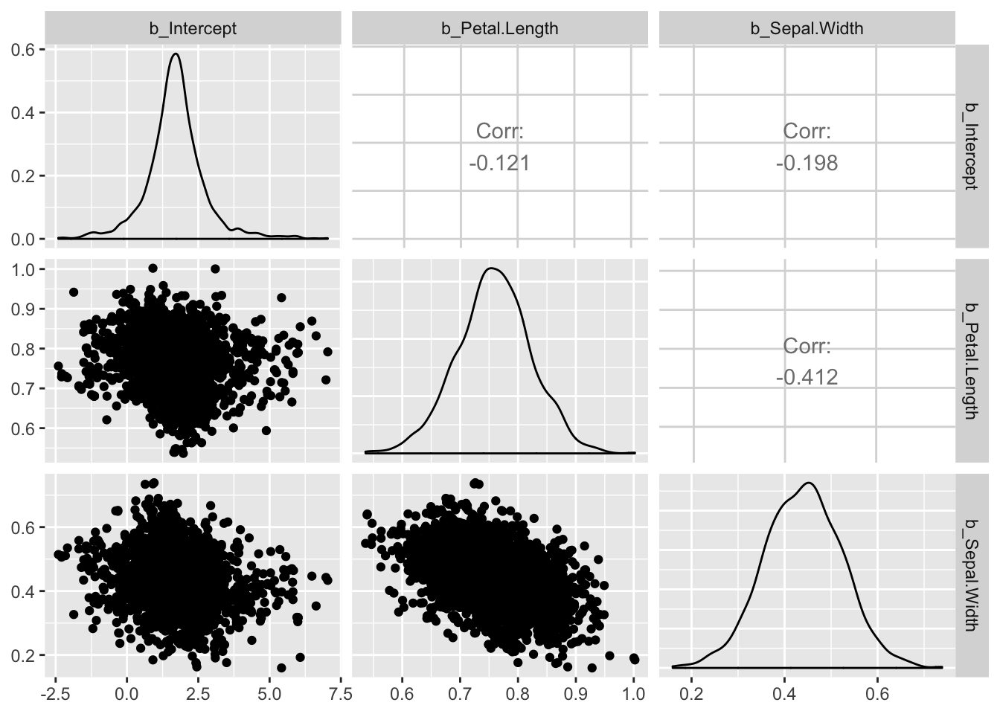

Siin on posteeriorite põhjal arvutatud 50% ja 95% CI ja see plotitud.

```r
stanplot(m2, pars = "r_", type = "intervals")
```


type = argument sisestamine võimaldab plottida erinevaid diagnostilisi näitajaid. Lubatud sisendid on "hist", "dens", "hist_by_chain", "dens_overlay", "violin", "intervals", "areas", "acf", "acf_bar", "trace", "trace_highlight", "scatter", "rhat", "rhat_hist", "neff", "neff_hist" "nuts_acceptance", "nuts_divergence", "nuts_stepsize", "nuts_treedepth" ja "nuts_energy".


```r
stanplot(m2, type = "neff")
```


Neff on efektiivne valimi suurus ja senikaua kuni Neff/N suhe ei ole < 0.1, pole põhjust selle pärast muretseda.

### Korjame ahelad andmeraami ja plotime fititud koefitsiendid CI-dega


```r
model <- posterior_samples(m1)
```

mcmc_intervals() on bayesplot paketi funktsioon. me plotime 50% ja 95% CI-d.

```r
pars <- colnames(model)
mcmc_intervals(model, regex_pars = "[^(lp__)]")
```


Näeme, et sigma hinnang on väga usaldusväärne, samas kui gruppide vahelise sd hinnang ei ole seda mitte (pane tähele posterioorse jaotuse ebasümmeetrilisust).


```r
model2 <- posterior_samples(m2)
pars <- colnames(model2)
mcmc_intervals(model2, regex_pars = "[^(lp__)]")
mcmc_areas(model2,  pars = c("b_Petal.Length", "b_Sepal.Width"))
```


### Bayesi versioon R-ruudust 

Kui suurt osa koguvarieeruvusest suudavad mudeli prediktorid seletada?

```r
bayes_R2(m2)
#>    Estimate Est.Error Q2.5 Q97.5
#> R2     0.86   0.00831 0.84 0.873
```


```r
bayes_R2(m1)
#>    Estimate Est.Error  Q2.5 Q97.5
#> R2    0.833    0.0109 0.807  0.85
```

https://github.com/jgabry/bayes_R2/blob/master/bayes_R2.pdf
Annab põhjenduse sellele statistikule (mille arvutamine erineb tavalisest vähimruutudega arvutatud mudeli $R^2$-st).

### Plotime mudeli poolt ennustatud valimeid -- posterior predictive check

Kui mudel suudab genereerida simuleeritud valimeid, mis ei erine väga palju empiirilisest valimist, mille põhjal see mudel fititi, siis võib-olla ei ole see täiesti ebaõnnestunud mudeldamine. See on loogika posterioorse ennustava ploti taga.

Vaatame siin simultaanselt kõigi kolme eelnevalt fititud mudeli simuleeritud valimeid (y_rep) võrdluses algsete andmetega (y):

```r
purrr::map(list(m1, m2, m3), pp_check, nsamples = 10) %>% 
  grid.arrange(grobs = ., nrow = 3)
```


- y - tihedusplot empiirilistest andmetest
- y_rep -- plotid mudeli poolt ennustatud iseseisvatest valimitest (igaüks sama suur kui empiiriline valim y) 
Jooniselt on näha, et m3 ennustused on võrreldes m1 ja m2-ga kõige kaugemal tegelikust valimist.

### Plotime mudeli ennustusi - marginal effects plots

Teeme ennustused. Kõigepealt ennustame ühe keskmise mudeliga, mis ei arvesta mitmetasemelise mudeli madalamte tasemete koefitsientidega.


```r
plot(marginal_effects(m2, effects = "Petal.Length", method = "predict", probs = c(0.1, 0.9)), points = TRUE)
```


Ennustus on selles mõttes ok, et vaid väike osa punkte jääb sellest välja, aga laiavõitu teine!

Nüüd ennustame sama mudeli põhjal igale liigile eraldi. Seega kasutame mudeli madalama taseme koefitsiente. Peame andma lisaparameetri `re_formula = NULL`, mis tagab, et ennustuse tegemisel kasutatakse ka mudeli madalama taseme koefitsiente.

```r
plot(marginal_effects(m2, effects = "Petal.Length", method = "predict", conditions = make_conditions(iris, vars = "Species"), probs = c(0.1, 0.9), re_formula = NULL), points = TRUE)
```


`method = "predict"` ennustab, millisesse vahemikku peaks mudeli järgi jääma 90% andmepunkte (k.a. uued andmepunktid, mida pole veel valimisse korjatud).

Tõesti, valdav enamus valimi punkte on intervallis sees, mis viitab et mudel töötab hästi. Seal, kus on rohkem punkte, on intervall kitsam ja mudel usaldusväärsem.

Järgneval pildil on `method = "fitted"`. Nüüd on enamus punkte väljaspool usaldusintervalle, mis sellel pildil mõõdavad meie usaldust regressioonijoone vastu.


```r
plot(marginal_effects(m2, effects = "Petal.Length", method = "fitted", conditions = make_conditions(iris, vars = "Species"), probs = c(0.1, 0.9), re_formula = NULL), points = TRUE)
```


`method = "fitted"` annab CI regressioonijoonele.

Argumendid: 

- method -- predict annab veapiirid (95% CI) mudeli ennustustustele andmepunkti tasemel. fitted annab veapiirid mudeli fitile endale (joonele, mis tähistab keskmist või kõige tõenäolisemat y muutuja väärtust igal x-i väärtusel)

- conditions - andmeraam, kus on kirjas mudeli nendele ennustavatele (x) muutujatele omistatud väärtused, mida ei joonistata x teljele. Kuna meil on selleks mudeli madalama taseme muutuja Species, siis on lisaks vaja määrata argument *re_formula = NULL*, mis tagab, et ennustuste tegemisel kasutatakse mudeli kõikide tasemete fititud koefitsiente. re_formula = NA annab seevastu keskmise fiti üle kõigi gruppide (irise liikide)

- probs annab usaldusintervalli piirid.

Pane tähele, et argument `points` (ja muud lisaargumendid, nagu näiteks `theme`) kuuluvad `plot()`, mitte `marginal_effects()` funktsioonile.


Tavaline interaktsioonimudel, aga pidevatele muutujatele.

```r
m5 <- brm(Sepal.Length ~ Petal.Length + Sepal.Width + Petal.Length * Sepal.Width, 
          data = iris, 
          prior = prior, 
          family = gaussian)
write_rds(m5, path = "data/m5.fit")
```


Kõigepealt plotime mudeli ennustused, kuidas Sepal Length sõltub Petal Length-ist kolmel erineval Sepal width väärtusel.

```r
plot(marginal_effects(m5, effects = "Petal.Length:Sepal.Width"), points = TRUE)
```


Ja siis sümmeetriliselt vastupidi.

```r
plot(marginal_effects(m5, effects = "Sepal.Width:Petal.Length"), points = TRUE)
```


Siin lisame enda soovitud Sepal Width väärtused (5 ja 1.2), mis on väljaspool seda, mida loodus pakub. Pane tähele ennustuse laiemaid CI-e.

```r
conditions <- data.frame(Sepal.Width = c(5, 1.2))
plot(marginal_effects(m5, effects = "Petal.Length", conditions = conditions, re_formula = NULL), points = TRUE)
```


### Alternatiivne tee
Alternatiivne millele?
Teeme tabeli nende väärtustega, millele tahame mudeli ennustusi. Tabelis newx on spetsifitseeritud mudeli kõikide X muutujate väärtused! Me ennustame Y väärtusi paljudel meie poolt võrdse vahemaaga ette antud petal length väärtustel, kusjuures me hoiame sepal width väärtuse alati konstantsena tema valimi keskmisel väärtusel ja vaatame ennustusi eraldi kahele liigile kolmest. Liigid on mudeli madala taseme osad, seega kasutame ennustuste tegemisel mudeli kõikide tasemete koefitsiente.


```r
newx <- expand.grid(Petal.Length = modelr::seq_range(iris$Petal.Length, n = 150),
                    Sepal.Width = mean(iris$Sepal.Width),
                    Species = c("setosa", "virginica"))
```
`expand.grid()` lõõb tabeli pikaks nii, et kõik võimalikud kombinatsioonid 3st muutujast on täidetud väärtustega.


`re_formula` NULL mudeldab eraldi liigid eraldi mudeli madalama taseme (liikide sees) koefitsiente kasutades

```r
predict_interval_brms2 <- predict(m2, newdata = newx, re_formula = NULL) %>%
  cbind(newx, .)
head(predict_interval_brms2)
#>   Petal.Length Sepal.Width Species Estimate Est.Error Q2.5 Q97.5
#> 1         1.00        3.06  setosa     4.50     0.314 3.88  5.12
#> 2         1.04        3.06  setosa     4.53     0.314 3.92  5.14
#> 3         1.08        3.06  setosa     4.54     0.320 3.92  5.19
#> 4         1.12        3.06  setosa     4.58     0.314 3.96  5.19
#> 5         1.16        3.06  setosa     4.61     0.315 3.99  5.23
#> 6         1.20        3.06  setosa     4.64     0.312 4.03  5.27
```

`predict()` ennustab uusi petal length väärtusi (Estimate veerg) koos usaldusinetrvalliga neile väärtustele

Siin siis eraldi ennustused kahele liigile kolmest, kaasa arvatud petal length väärtusvahemikule, kus selle liigi isendeid valimis ei ole (ja võib-olla ei saagi olla) 

```r
no_versicolor <- filter(iris, Species != "versicolor")
ggplot(data = predict_interval_brms2, aes(x = Petal.Length, y = Estimate)) +
  geom_point(data = no_versicolor, aes(Petal.Length, Sepal.Length, color = Species)) +
  geom_line(aes(color = Species)) +
  geom_ribbon(aes(ymin = Q2.5, ymax = Q97.5, fill = Species), alpha = 1/3)
```

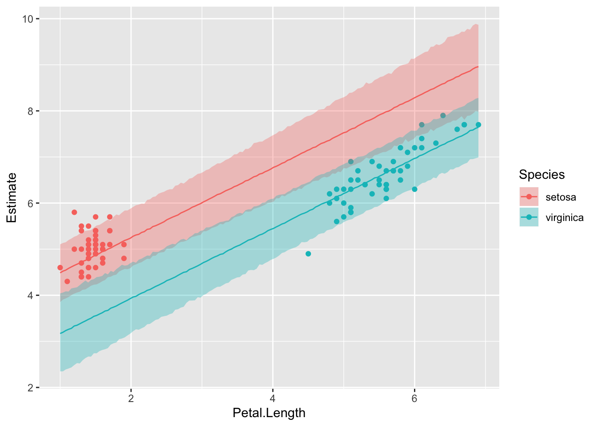

Ennustav plot - kuidas lähevad kokku mudeli ennustused reaalsete y-i andmepunktidega

```r
pr <- predict(m2) %>% cbind(iris)
ggplot(pr, aes(Sepal.Length, Estimate, color = Species)) +
  geom_pointrange(aes(ymin = Q2.5, ymax = Q97.5)) +
  geom_abline(lty = 2) +
  coord_cartesian(xlim = c(4, 8), ylim = c(4, 8))
```

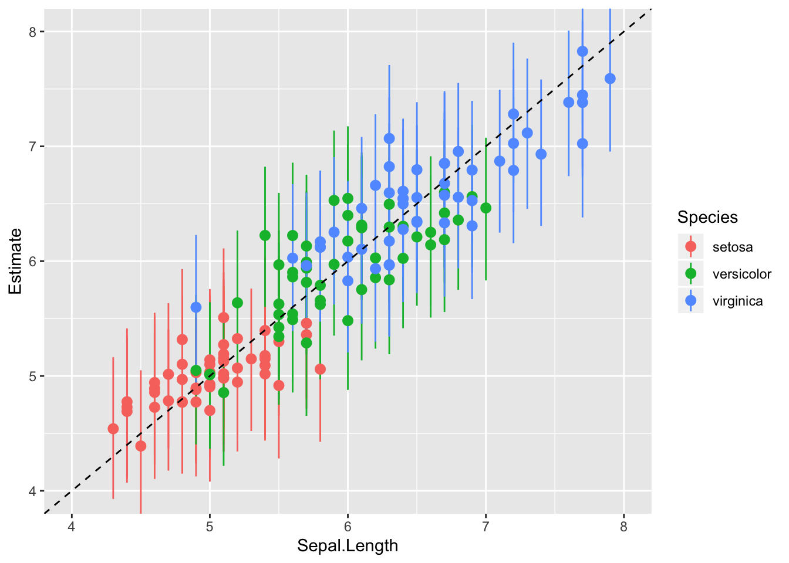

Igale andmepunktile -- kui palju erineb selle residuaal 0-st kui hästi ennustab mudel just seda andmepunkti. Ruumi kokkuhoiuks plotime välja ainult irise valiku 50-st andmepunktist.

```r
set.seed(69)
as_data_frame(residuals(m2)) %>% 
  sample_n(50) %>% 
  ggplot(aes(x = reorder(seq_along(Estimate), Estimate), y = Estimate)) +
  geom_pointrange(aes(ymin = Q2.5, ymax = Q97.5), fatten = 0.1) +
  coord_flip() +
  theme(text = element_text(size = 8), axis.title.y = element_blank()) +
  xlab("Residuals (95 CI)")
```


Ok, isendid nr 15 ja 44 paistavad olema vastavalt palju suurema ja väiksema Sepal Lengthiga kui mudel ennustab. Võib küsida, miks?

Nüüd plotime usaldusintervalli mudeli fitile ('keskmisele' Y väärtusele igal määratud X-i väärtusel), mitte Y-ennustusele andmepunkti kaupa. Selleks on hea fitted() funktsioon. Me ennustame m2 mudelist vastavalt newdata parameetriväärtustele. Kui me newdata argumendi tühjaks jätame, siis võtab fitted() selleks automaatselt algse iris tabeli (ehk valimi väärtused). 


```r
predict_interval_brms2f <- fitted(m2, newdata = newx, re_formula = NULL) %>%
  cbind(newx,.)
head(predict_interval_brms2f)
#>   Petal.Length Sepal.Width Species Estimate Est.Error Q2.5 Q97.5
#> 1         1.00        3.06  setosa     4.49    0.0542 4.38  4.59
#> 2         1.04        3.06  setosa     4.52    0.0535 4.41  4.62
#> 3         1.08        3.06  setosa     4.55    0.0529 4.45  4.65
#> 4         1.12        3.06  setosa     4.58    0.0524 4.48  4.68
#> 5         1.16        3.06  setosa     4.61    0.0520 4.51  4.71
#> 6         1.20        3.06  setosa     4.64    0.0518 4.54  4.74
```


```r
ggplot(data = predict_interval_brms2f, aes(x = Petal.Length, y = Estimate, color = Species)) +
  geom_point(data = no_versicolor, aes(Petal.Length, Sepal.Length, color = Species)) +
  geom_line() +
  geom_ribbon(aes(ymin = Q2.5, ymax = Q97.5, fill = Species), alpha = 1/3, colour = NA) +
  scale_x_continuous(breaks = 0:10)
```


Mudeli genereeritud andmed ja valimiandmed mõõtmisobjekti (subjekti e taimeisendi) kaupa. See on sisuliselt posterior predictive plot (vt eespool). 


```r
predicted_subjects_brms <- predict(m2) %>% cbind(iris, .)
```

`predict()` arvutab mudeli põhjal uusi Y muutuja andmepunkte. Võib kasutada ka väljamõeldud andmete pealt Y väärtuste ennustamiseks (selleks tuleb anda ette andmeraam kõigi X-muutujate väärtustega, mille pealt tahetakse ennustusi).

Punktid on ennustused ja ristikesed on valimiandmed

```r
ggplot(data = predicted_subjects_brms, aes(x = Petal.Length, color = Species)) +
  geom_point(aes(y = Estimate)) +
  geom_point(aes(y = Sepal.Length), shape = 3)
```

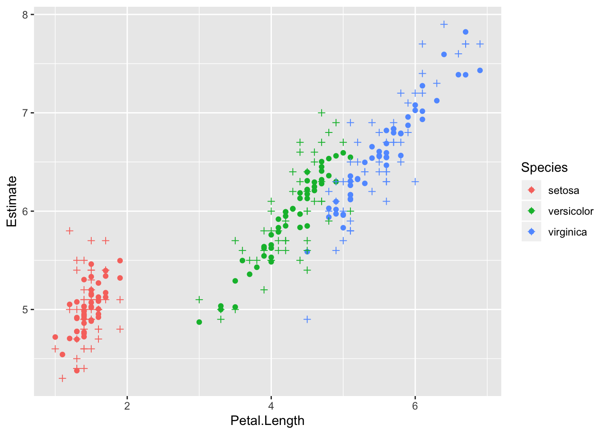

### Alternatiiv -- ansambliennustus

Kuna meil on 2 mudelit (m2 ja m3) mis on pea võrdselt eelistatud, siis genreerime ennustused mõlemast (mudelite ansamblist) proportsionaalselt nende waic skooridega. See ennustus kajastab meie mudeldamistööd tervikuna, mitte ühte "parimat" mudelit ja seega võib loota, et annab paremini edasi meie mudeldamises peituvat ebakindlust.

```r
pp_a <- pp_average(m2, m3, weights = "waic", method = "predict") %>%
  as_tibble() %>% 
  bind_cols(iris)
ggplot(data = pp_a, aes(x = Petal.Length, color = Species)) +
  geom_point(aes(y = Estimate)) +
  geom_point(aes(y = Sepal.Length), shape = 3)
```

## Mudeli eelduste kontroll

Pareto k otsib nn mõjukaid (influential) andmepunkte. 

```r
loo_m2 <- loo(m2)
plot(loo_m2)
```


Kui paljud andmepunktid on kahtlaselt mõjukad?

```r
pareto_k_table(loo_m2) 
#> 
#> All Pareto k estimates are good (k < 0.5).
```


### Plotime residuaalid

`resid()` annab residuaalid vektorina. 
Kõigepealt plotime residuaalid fititud (keskmiste) Y väärtuste vastu:

```r
resid <- residuals(m2, type = "pearson")
fit <- fitted(m2)
ggplot() + 
  geom_point(aes(x = fit[,"Estimate"], y = resid[,"Estimate"])) + 
  geom_hline(yintercept = 0, lty = "dashed") +
  labs(x = "fitted", y = "residuals")
```


Residuals vs fitted plot testib lineaarsuse eeldust - kui .resid punktid jaotuvad ühtlaselt nulli ümber, siis mudel püüab kinni kogu süstemaatilise varieeruvuse teie andmetest ja see mis üle jääb on juhuslik varieeruvus.

Vaatame diagnostilist plotti autokorrelatsioonist residuaalide vahel.

```r
plot(acf(resid))
```

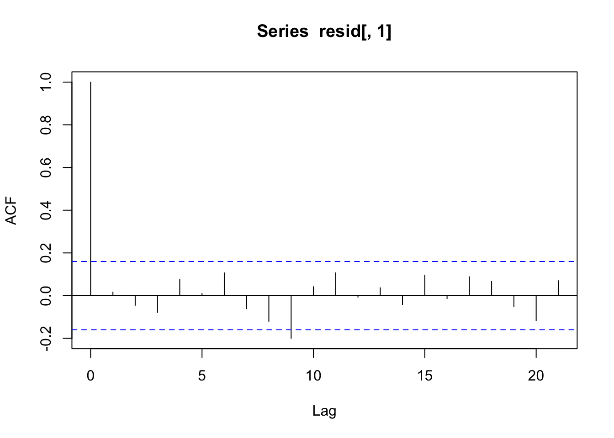

Residuaalide autokorrelatsioonid on madalad - seega kõik paistab OK ja andmepunktide sõltumatus on tagatud.

Siin on residuaalide histogramm:

```r
ggplot(data = NULL) + 
  geom_density(aes(x = resid[,"Estimate"]), fill = "lightgrey") + 
  geom_vline(xintercept = median(resid), linetype = "dashed")
```


Residuaalid on sümmeetrilise jaotusega ja meedian residuaal on peaaegu null. See on kõik hea.

Ja lõpuks plotime residuaalid kõigi x-muutujate vastu. Kõigepealt ühendame resid vektori irise tabeliga, et oleks mugavam plottida, seejärel tekitame uue veeru st_resid e studentiseeritud residuaalid, mis on sd ühikutes.

residuaalid standardhälbe ühikutes (nn Studentiseeritud residuaalid) saab ja ka tuleks plottida kõigi x-muutujate suhtes.

```r
iris2 <- iris %>% 
  cbind(resid) %>% 
  mutate(st_resid = Estimate / sd(resid))
ggplot(iris2, aes(Petal.Length, st_resid, color = Species)) + 
  geom_point() +
  geom_hline(yintercept = 0, linetype = "dashed")
```


Tsiteerides klassikuid: "Pole paha!". Mudel ennustab hästi, aga mõne punkti jaoks on ennustus 2 sd kaugusel.

```r
ggplot(iris2, aes(Sepal.Width, st_resid, color = Species)) + 
  geom_point() +
  geom_hline(yintercept = 0, linetype = "dashed")
```


```r
ggplot(iris2, aes(Species, st_resid)) + 
  geom_boxplot() +
  geom_hline(yintercept = 0, linetype = "dashed") +
  geom_jitter(width = 0.1)
```


# Brms mudelid

## Robustne lineaarne regressioon

Kasutame dnorm likelihoodi asemel studenti t jaotust. Selle jaotuse õlad on reguleeritavalt kõrgemad ja nende alla mahuvad paremini outlierid. Õlgade kõrgust reguleerib parameeter nu (1 - Inf), mille väiksemad väärtused (alla 10) annavad laiad õlad ja kaitse outlierite vastu. Me anname nu-le gamma priori. Sellel prioril on omakorda 2 parameetrit, shape ja scale Kui fikseerime shape = 4 ja scale = 1, siis saame kitsa priori, mis eelistab nu väärtusi, mis soosivad laiu õlgu ja robustset regressiooni.


```r
x = seq(from = 0, to = 20, by = .1)
y = dgamma(x, shape = 4, scale = 1)
plot(y ~ x)
```

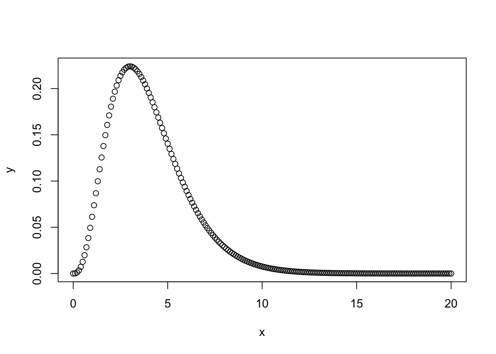


```r
get_prior(Sepal.Length ~ Petal.Length, data = iris, family = "student")
#>                 prior     class         coef group resp dpar nlpar bound
#> 1                             b                                         
#> 2                             b Petal.Length                            
#> 3 student_t(3, 6, 10) Intercept                                         
#> 4       gamma(2, 0.1)        nu                                         
#> 5 student_t(3, 0, 10)     sigma
```


```r
prior <- prior(gamma(4, 1), class = "nu")
```

robust_m1 on studenti likelihoodiga, mille õlad määratakse adaptiivselt andmete poolt.
robust_m2-s anname õlgade laiuse ette ja robust_m3 on mitte-robustne kontroll tavalise normaalse likelihoodiga.

```r
robust_m1 <- brm(Sepal.Length ~ Petal.Length, 
          data = iris, 
          family = "student",
          prior = prior)
robust_m2 <- brm(bf(Sepal.Length~Petal.Length, nu = 4),
          data = iris, 
          family = student,
          prior = c(prior(normal(0, 100), class = Intercept),
                prior(normal(0, 10),  class = b),
                prior(student_t(5, 0, 5),   class = sigma)))
robust_m3 <- brm(Sepal.Length~Petal.Length, 
          data = iris, 
          family = "gaussian")
write_rds(robust_m1, path = "data/robust_m1.fit")
write_rds(robust_m2, path = "data/robust_m2.fit")
write_rds(robust_m3, path = "data/robust_m3.fit")
```


```r
b_estimates <- bind_rows(tidy(robust_m1), 
                         tidy(robust_m2), 
                         tidy(robust_m3), 
                         .id = "model_nr") 
b1 <- filter(b_estimates, str_detect(term, "b_P")) %>%
  ggplot(aes(model_nr, estimate)) +
  geom_pointrange(aes(ymin = lower, ymax = upper)) + 
  coord_flip() + 
  labs(x = "Model nr", title = "slopes")
b2 <- filter(b_estimates, str_detect(term, "b_I")) %>%
  ggplot(aes(model_nr, estimate)) +
  geom_pointrange(aes(ymin = lower, ymax = upper)) + 
  coord_flip() + 
  labs(x = NULL, title = "intercepts")
gridExtra::grid.arrange(b1, b2, nrow = 1)
```


Kolme mudeli lõikepunktid ja tõusunurgad on sisuliselt võrdsed ja sama täpsusega hinnatud. Seega ei tee robustne mudel vähemal halba, kui meil on enam-vähem normaalsed andmed.

Proovime ka robuststet versiooni 2 grupi võrdlusest (vastab t testile, kus kahe grupi sd-d hinnatakse eraldi)

```r
no_versicolor <- filter(iris, Species != "versicolor")
get_prior(bf(Sepal.Length ~ Species, sigma ~ Species), 
          data = no_versicolor, 
          family = "student")
#>                 prior     class             coef group resp  dpar nlpar
#> 1                             b                                        
#> 2                             b Speciesvirginica                       
#> 3 student_t(3, 6, 10) Intercept                                        
#> 4       gamma(2, 0.1)        nu                                        
#> 5                             b                             sigma      
#> 6                             b Speciesvirginica            sigma      
#> 7 student_t(3, 0, 10) Intercept                             sigma      
#>   bound
#> 1      
#> 2      
#> 3      
#> 4      
#> 5      
#> 6      
#> 7
```


```r
prior <- c(prior(gamma(4, 1), class = "nu"),
           prior(normal(0, 4), class = "b"))
```


```r
robust_t_test1 <- brm(bf(Sepal.Length ~ Species, sigma ~ Species), 
            data = no_versicolor, 
            prior = prior, 
            family = "student")
write_rds(robust_t_test1, path = "data/robust_t_test1.fit")
```


```r
tidy(robust_t_test1)
#>                       term estimate std.error   lower   upper
#> 1              b_Intercept    5.002    0.0505   4.916   5.086
#> 2        b_sigma_Intercept   -1.175    0.1281  -1.383  -0.970
#> 3       b_Speciesvirginica    1.557    0.1032   1.387   1.726
#> 4 b_sigma_Speciesvirginica    0.577    0.1694   0.298   0.846
#> 5                       nu    6.113    2.0334   3.337   9.874
#> 6                     lp__  -79.991    1.5766 -82.954 -78.063
```

b_Intercept on hinnang 1. grupi keskväärtusele (algses skaalas)

b_Speciesvirginica on hinnag efekti suurusele, ehk 2. grupi erinevusest esimesest grupist (algses skaalas)

b_Intercept + b_Speciesvirginica annab 2. grupi keskväärtuse.

b_sigma_Intercept on naturaallogaritm 1. grupi sd-st.

```r
exp(-1.175)
#> [1] 0.309
```
Tegelik sigma on 0.3

b_sigma_Speciesvirginica on logaritm 2. grupi (I. virginica) sd erinevusest esimesest grupist (ehk efekti suurus).

```r
exp(-1.175 + 0.577)
#> [1] 0.55
```

Seega saab algses skaalas sd-d nii: 

exp(b_sigma_Intercept) = 1. grupi sd

exp(b_sigma_Intercept) + exp(b_sigma_Speciesvirginica) = 2. grupi sd

exp(b_sigma_Speciesvirginica) = sd-de erinevus

Nii arvutame 2. grupi keskväärtuse posteeriori

```r
r_1_df <- posterior_samples(robust_t_test1)
mean_2.gr <- r_1_df$b_Intercept + r_1_df$b_Speciesvirginica
ggplot(data = NULL) + geom_density(aes(mean_2.gr))
```


Nii saab tekitada usaldusinetvalle, mis katavad 90% jaotuse alusest kõrgeimast tihedusest (mis ei ole päris sama, mis kvantiilide meetod) 

```r
rethinking::HPDI(mean_2.gr, prob = 0.9)
#> |0.9 0.9| 
#>  6.4  6.7
```


```r
quantile(mean_2.gr, probs = c(0.05, 0.95))
#>   5%  95% 
#> 6.41 6.71
```


Nii saame teada, milline osa (fraktsioon) posteeriorist on väiksem kui 6.4

```r
mean(mean_2.gr < 6.4)
#> [1] 0.0372
```

Asendades eelnevas koodis 6.4 nulliga saame bayesi versiooni ühepoolsest p väärtusest hüpoteesile, et teise grupi keskväärtus on null.

Avaldame posteeriori 2. grupi sd-e

```r
sd_2.gr <- exp(r_1_df$b_sigma_Intercept) + exp(r_1_df$b_sigma_Speciesvirginica)
ggplot(data = NULL) + 
  geom_density(aes(sd_2.gr))
```


On tavaline, et sd-de posteeriorid ei ole normaaljaotusega (selle kohta vaata lähemalt Statistical Rethinking raamatust).


```r
t.test(Sepal.Length ~ Species, data = no_versicolor)
#> 
#> 	Welch Two Sample t-test
#> 
#> data:  Sepal.Length by Species
#> t = -20, df = 80, p-value <2e-16
#> alternative hypothesis: true difference in means is not equal to 0
#> 95 percent confidence interval:
#>  -1.79 -1.38
#> sample estimates:
#>    mean in group setosa mean in group virginica 
#>                    5.01                    6.59
```

Klassikalise t testi efekti suuruse CI on 1.38 ... 1.79
robustse t testi oma on 1.39 ... 1.73

Simuleerime siis ühe tõsiste outlieritega andmestiku, et vaadata kas meil õnnestub päästa efekt statistilise mitteolulisuse õnnetust saatusest. Meil on a grupis 30 andmepunkti normaaljaotusest mu = 0, sd = 1 ja b grupis 25 andmepunkti normaaljaotusest mu = 1, sd = 1.5, pluss 5 andmepunkti, mis mängivad outliereid.

```r
set.seed(123)
df1 <- tibble(a = rnorm(30), b = c(rnorm(25, 1, 1.5), 4.3, 5.3, 7, -8.1, -17)) %>% gather()
ggplot(df1, aes(value, fill = key)) + 
  geom_histogram(alpha = 0.7, position = "identity", bins = 30)
```


```r
robust_t_test2 <- brm(bf(value~key, sigma ~ key), 
            data = df1, 
            family = "student", 
            prior = prior(gamma(4, 1), class= "nu"))
write_rds(robust_t_test2, path = "data/robust_t_test2.fit")
```


```r
tidy(robust_t_test2)
#>                term  estimate std.error    lower     upper
#> 1       b_Intercept   -0.0961     0.188   -0.410    0.2049
#> 2 b_sigma_Intercept   -0.2372     0.192   -0.557    0.0689
#> 3            b_keyb    1.4340     0.405    0.776    2.0979
#> 4      b_sigma_keyb    0.6312     0.287    0.164    1.0979
#> 5                nu    2.8096     0.952    1.585    4.6058
#> 6              lp__ -124.5835     1.718 -128.006 -122.5280
```


```r
t.test(value ~ key, data = df1)
#> 
#> 	Welch Two Sample t-test
#> 
#> data:  value by key
#> t = -1, df = 30, p-value = 0.3
#> alternative hypothesis: true difference in means is not equal to 0
#> 95 percent confidence interval:
#>  -2.417  0.777
#> sample estimates:
#> mean in group a mean in group b 
#>         -0.0471          0.7729
```

Nüüd kus meil on outlieritega andmed, annab klassikaline t test efekti suurusele 
CI -2.41 ... 0.78 (p = 0.3), aga robustne t test leiab efekti üles - 
CI 0.78 ... 2.10 [tegelik ES oleks 1, outliereid arvestamata].

Ilma outlieriteta versioon annab p = 0.00006

```r
set.seed(123)
a = rnorm(30) 
b = c(rnorm(25, 1, 1.5))
t.test(a, b)$p.value
#> [1] 6.37e-05
```

Kui tavaline t test annab välja kahe grupi keskmised, usaldusintervalli nende erinevusele (ehk ES-le) ja p väärtuse, siis bayesi variant annab välja 2 grupi keskväärtused, 2 grupi varieeruvused andmepunktide tasemel ning kõik efekti suurused ja hüpoteesitestid, millest te suudate unistada. Selle külluse põhjus on, et hinnang iga parameeteri väärtusele tuleb meile posteeriori ehk tõenäosusjaotuse kujul. Kuna iga posteerior on meil arvutis olemas kui arvuline vektor, ja teatavasti saab vektoritega teha aritmeetilisi tehteid, siis saab ka posteerioreid omavahel liita, lahutada, astendada jms. Teoreetiliselt sisaldab posteerior kogu infot, mis meil vastava parameetri väärtuse kohta on. Me ei vaja midagi enamat, et teha kõiki järeldusi, mida me selle parameetri väärtuse kohta üldse teha saame. Seetõttu on bayesi versioon mitte ainult palju paindlikum kui tavaline t test, vaid selle output on ka hästi palju informatiivsem.

Igaks juhuks tuletame meelde, et tavaline t test (küll versioonis, kus võrreldavate gruppide varieeruvused on eeldatud olema identsed) on ekvivalentne lineaarse regressiooniga, mille siin fitime vähimruutude meetodiga. (Väheinformatiivsete prioritega bayesi versioon normaaljaotuse likelihoodiga annaks sellega väga sarnase fiti.)


```r
lm1 <- lm(value ~ key, data = df1)
tidy(lm1)
#> # A tibble: 2 x 5
#>   term        estimate std.error statistic p.value
#>   <chr>          <dbl>     <dbl>     <dbl>   <dbl>
#> 1 (Intercept)  -0.0471     0.554   -0.0850   0.933
#> 2 keyb          0.820      0.784    1.05     0.300
```
p = 0.3 ongi vastava t testi põhiväljund.


### lognormaalne tõepärafunktsioon

Sama näide on pikemalt 14. peatükis, seal küll lahendatud rethinkingu abil.


```r
library(gapminder)
library(rethinking)
g2007 <- gapminder %>% 
  filter(year == 2007) %>% 
  mutate(l_GDP = log10(gdpPercap))
```

<div class="figure" style="text-align: center">
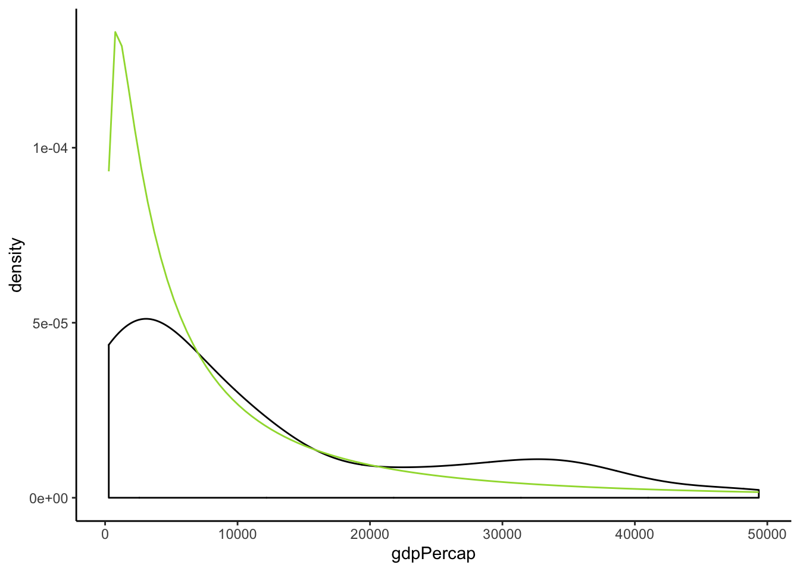
<p class="caption">(\#fig:unnamed-chunk-92)SKP-de jaotus</p>
</div>


```r
get_prior(gdpPercap~lifeExp, family = "lognormal", data=g2007)
#>                 prior     class    coef group resp dpar nlpar bound
#> 1                             b                                    
#> 2                             b lifeExp                            
#> 3 student_t(3, 9, 10) Intercept                                    
#> 4 student_t(3, 0, 10)     sigma
```


```r
prior <- c(prior(normal(0, 10), class="Intercept"),
           prior(normal(0,10), class ="b"),
           prior(student(6,0,5)), class ="sigma")
```


```r
ln_m1 <- brm(gdpPercap~lifeExp, family = "lognormal", prior=prior, data=g2007, cores=4)
write_rds(ln_m1, "ln_m1.rds")
```


```r
tidy(ln_m1)
#>          term  estimate std.error     lower     upper
#> 1 b_Intercept  2.53e+00    0.3891  1.88e+00     3.162
#> 2   b_lifeExp  9.09e-02    0.0057  8.15e-02     0.100
#> 3       sigma  8.08e-01    0.0504  7.30e-01     0.895
#> 4        lp__ -1.40e+03    1.2649 -1.40e+03 -1398.543
```


```r
plot(marginal_effects(ln_m1), points=TRUE)
```


```r
plot(marginal_effects(ln_m1, method="predict"), points=TRUE)
```

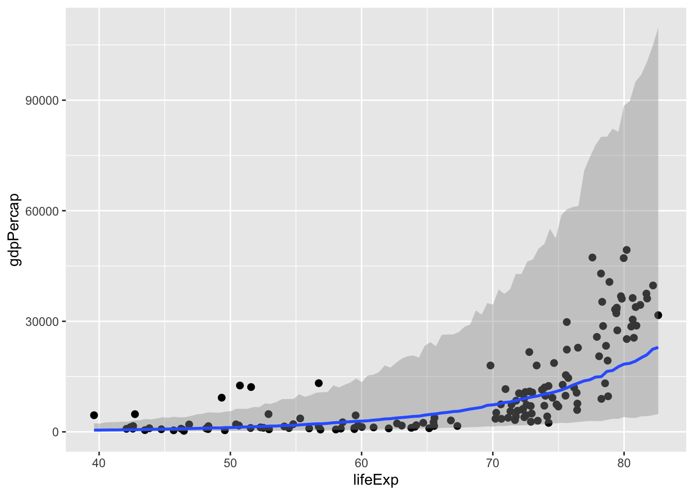


```r
ln_m2 <- brm(l_GDP~lifeExp, data=g2007, cores=4)
write_rds(ln_m2, "ln_m2.rds")
```


```r
ln_m2 <- read_rds("ln_m2.rds")
```


```r
plot(marginal_effects(ln_m2, method="predict"), points=TRUE)
```


```r
bayes_R2(ln_m1)
#>    Estimate Est.Error  Q2.5 Q97.5
#> R2    0.587    0.0767 0.429 0.727
```

```r
bayes_R2(ln_m2)
#>    Estimate Est.Error Q2.5 Q97.5
#> R2    0.652    0.0277 0.59 0.698
```


```r
plot(marginal_effects(ln_m2), points=TRUE)
```


### Puuduvate andmete imputatsioon

Regressioonimudelite fittimisel kasutatakse ainult vaatlusi, kus esinevad väärtused kõigis mudelisse pandud muutujates. Seega, kui meil on palju muutujaid, milles igaühes puuduvad juhuslikult mõned väärtused, siis kaotame kokkuvõttes enamuse oma valimist. Aitab puuduvate andmete imputatsioon, mis tegelikult tähendab, et me fitime iga puuduvaid andmeid sisaldava muutuja eraldi regressioonimudelis kõigi teiste muutujate vastu.

Eriti vajalik, kui andmed ei puudu juhuslikult! 

Viskame irise andmestiku kahest tulbast välja 1/4 andmepunkte, aga mitte juhuslikult vaid kõik madalamad väärtused. Selline suunatud tegevus kallutab (ehk suunab kindlas suunas) oluliselt mudeldamise tulemusi

```r
quantile(iris$Petal.Length)
#>   0%  25%  50%  75% 100% 
#> 1.00 1.60 4.35 5.10 6.90
iris_na <- iris
iris_na$Sepal.Length[iris_na$Sepal.Length < 5] <- NA
iris_na$Petal.Length[iris_na$Petal.Length < 1.6] <- NA
```


```r
lm(Petal.Length ~ Sepal.Length, data = iris) %>% tidy()
#> # A tibble: 2 x 5
#>   term         estimate std.error statistic  p.value
#>   <chr>           <dbl>     <dbl>     <dbl>    <dbl>
#> 1 (Intercept)     -7.10    0.507      -14.0 6.13e-29
#> 2 Sepal.Length     1.86    0.0859      21.6 1.04e-47
```


```r
lm(Petal.Length ~ Sepal.Length, data = iris_na) %>% tidy()
#> # A tibble: 2 x 5
#>   term         estimate std.error statistic  p.value
#>   <chr>           <dbl>     <dbl>     <dbl>    <dbl>
#> 1 (Intercept)     -4.19    0.609      -6.89 4.33e-10
#> 2 Sepal.Length     1.43    0.0976     14.6  4.53e-27
```


imputeerime enne mudeli fittimist kasutades multiple imputation meetodit mice paketist https://stefvanbuuren.name/mice/.
Siin imputeerime iga puuduva väärtuse kasutades kõigi teiste parameetrite väärtusi, ja me teeme seda 5 korda.


```r
library(mice)
imp <- mice(iris_na, m = 5, print = FALSE)
```

Meil on nüüd 5 imputeeritud andmesetti. Me saadame need kõik brms-i.

> Siin kasutame mice() tema vaikeväärtustel, kuid mice pakett on tegelikult vägagi rikkalik imputatsioonimasin, mille helpi ja tutoorialeid tuleks kindlasti enne lugeda, kui oma andmeid imputeerima asuda. Lisaks, see raamat on tervenisti pühendatud imputatsioonile: https://stefvanbuuren.name/fimd/


```r
iris_imp1 <- brm_multiple(Petal.Length ~ Sepal.Length, data = imp)
write_rds(iris_imp1, path = "data/iris_imp1.fit")
```


Saame tavalise fitiobjekti, kus on 5 alammudeli posterioorid. Kõik juba koos.

```r
tidy(iris_imp1)[,1:3]
#>             term estimate std.error
#> 1    b_Intercept   -7.692    0.5543
#> 2 b_Sepal.Length    1.948    0.0929
#> 3          sigma    0.843    0.0523
#> 4           lp__ -192.574    3.2501
```

Tõepoolest, süstemaatiliselt rikutud andmetest on imutatsiooni abil võimalik täitsa head ennustust tagasi saada!!!

## Imputatsioon otse brms-is

See töötab küll irise peal halvemini kui mice!


```r
bform <- bf(Petal.Length | mi() ~ mi(Sepal.Length)) + 
  bf(Sepal.Length | mi() ~ Sepal.Width + Petal.Width + Species + mi(Petal.Length)) + set_rescor(FALSE)
iris_imp2 <- brm(bform, data = iris_na)
write_rds(iris_imp2, path = "data/iris_imp2.fit")
```

Kasutades mi() funktsiooni peame siin ekslpitsiitselt ütlema, milliseid muutujaid soovime imputeerida. Me imputeerime Petal.Length-i, kasutades NA-de väärtuste prediktorina Sepal.Length-i, mis on omakorda imputeeritud. Sepal.Length-i imputeerime omakorda Sepal.Width, Petal.width jne järgi. 


```r
bform <- bf(Petal.Length | mi() ~ mi(Sepal.Length)) + 
  bf(Sepal.Length | mi() ~ Species) + set_rescor(FALSE)
iris_imp3 <- brm(bform, data = iris_na)
write_rds(iris_imp3, path = "data/iris_imp3.fit")
```


```r
tidy(iris_imp2) %>% head()
#>                              term estimate std.error  lower   upper
#> 1         b_PetalLength_Intercept  -5.5690    0.4917 -6.204 -4.8129
#> 2         b_SepalLength_Intercept   2.6008    0.3255  2.115  3.1246
#> 3       b_SepalLength_Sepal.Width   0.3074    0.0855  0.164  0.4297
#> 4       b_SepalLength_Petal.Width   0.0679    0.1515 -0.130  0.3330
#> 5 b_SepalLength_Speciesversicolor  -0.2201    0.1595 -0.482  0.0172
#> 6  b_SepalLength_Speciesvirginica  -0.4502    0.2319 -0.856 -0.0937
```


```r
tidy(iris_imp3) %>% head()
#>                              term estimate std.error lower  upper
#> 1         b_PetalLength_Intercept   -4.601    0.5864 -5.56 -3.650
#> 2         b_SepalLength_Intercept    5.168    0.0915  5.01  5.316
#> 3 b_SepalLength_Speciesversicolor    0.781    0.1157  0.59  0.971
#> 4  b_SepalLength_Speciesvirginica    1.449    0.1155  1.26  1.645
#> 5  bsp_PetalLength_miSepal.Length    1.488    0.0945  1.33  1.642
#> 6               sigma_PetalLength    0.705    0.0494  0.63  0.791
```


## Binoomjaotusega mudelid

y ∼ Binomial(n,p)

Me teeme n katset ja kodeerime iga eduka katse 1-ga ja mitteeduka katse 0-ga. Kui n=1, siis y on ühtedest ja nullidest koosnev vektor (muutuja) ja p on tõenäosus, et suvaline katse annab tulemuseks 1-e. Eeldades logistilist transformatsiooni on siin tegu logistilise regressiooniga.
Kui n > 1 (ja ikka eeldades logistilist transformatsiooni), siis on tegu aggregeeritud binoomse logistilise regressiooniga. Me lahendame allpool need mõlemad.
 
### Logistiline regressioon

Tavalises lineaarses regressioonis on tavapärane, et kuigi me ennustame pidevat y-muutujat, kas osad või kõik X-muutujad (prediktorid) on mittepidevad. Lineaarsed mudelid jooksevad võrdselt hästi pidevate ja mittepidevate (binaarsete) prediktoritega. (Binaarsed muutujad võivad omada kaht diskreetset väärtust, mida kodeerime 1 ja 0-na). Aga kuidas käituda, kui meie poolt ennustatav Y-muutuja on binaarne? Kui me püüame ennustada binaarse y-muutuja oodatavaid väärtusi tõenäosustena, ehk 1-de arvu suhet katsete koguarvu, kas siis tavaline lineaarne regressioon enam ei tööta? Töötab küll, aga paraku ei ole garanteeritud, et mudeli ennustused jäävad 0 ja 1 vahele, ehk tõenäosuste skaalasse. Seda tagab logistiline regressioon. Logistilises regressioonis ei modelleeri me mitte otse y väärtusi (1 ja 0) erinevatel x-i väärtustel, vaid tõenäosust P(Y = 1 | X) [tõenäosus, et Y = 1, fikseeritud x-i väärtusel]. 

Logistiline regressioon töötab tänu logistilisele transformatsioonile. Näiteks logistiline transformatsioon funktsioonile $y = a + bx$ näeb välja niimoodi 
$$y=\frac{exp(a + bx)}{1 + exp(a + bx)}$$ 

    exp(a) tähendab "e astmes a", kus e on Euleri arv, ehk arv, mille 
    naturaal-logaritm = 1 (seega on e naturaal-logaritmi alus). 
    e on umbes 2.71828 ja selle saab valemist (1 + 1/n)^n, 
    kui n läheneb lõpmatusele.

#### Logistiline ja logit transformatsioon - definitsioonid

See peatükk aitab loogilisest regressioonist aru saada - aru saamine pole aga tingimata vajalik selle edukaks tegemiseks. 

 Logistiline transformatsioon viib lineaarse regressiooni tavapärasest y-muutuja skaalast [−∞,+∞] tõenäosuste skaalasse [0,1], andes meile sirge asemele S-kujulise kurvi, mis läheneb asümptootiliselt ühelt poolt 0-le ja teiselt poolt 1-le. Logistilise funktsiooni põõrdväärtus on logit funktsioon, mis annab "*odds*-i" ehk shansi ehk kihlveosuhted tõenäosusele p: $odds = \frac {p}{1 − p}$. Tõenäosuse p logit ehk logit(p) on sama, mis log(odds):

$$logit(p)=\log \left({\frac {p}{1-p}}\right)=\log(p)-\log(1-p)$$

Meie y = a + bx mudeli korral tavalises meetrilises skaalas on *odds* exponent meie fititud lineaarsest mudelist: 

$$odds= \frac {P(Y = 1 ~|~ X)}{1-P(Y = 1 ~|~ X)} = exp(a+bx)$$ 

Näiteks tõenäosus 0.2 (20%) tähendab, et $odds = 0.2/(1 - 0.2) = 1/4$ ehk üks neljale ja tõenäosus 0.9 tähendab, et $odds = 0.9/(1 - 0.9) = 9$ ehk üheksa ühele. Sellel meetodil töötavad näiteks hipodroomid, sest nii on mänguril lihtne näha, et kui kihlveokontori poolt mingile hobusele omistatud odds on näiteks üks nelja vastu ja te maksate kihlveo maaklerile 1 euro, siis saab võidu korral 4 eurot kasumit (ehk 5 eurose kupüüri). Logaritm *odds*-idest ongi logit transformatsioon, mille pöördväärtus on omakorda logistiline transformatsioon!

Suvalise arvu α logistiline funktsioon on logiti põõrdväärtus:

$$logit^{-1}\alpha=logistic (\alpha)={\frac {exp (\alpha) }{1+ exp (\alpha)}}$$


```r
x <- -10:10
y <- exp(x)/(1+exp(x))
plot(y~x)
```


Kui me mudeli y = a + bx korral muudame x-i ühe ühiku võrra muutuvad log-odds-id b võrra. Teisisõnu võime korrutada lineaarses skaalas *odds*-id exp(b)-ga. Kuna P(Y = 1 | X) ja X-i seos ei ole sirge, siis b ei vasta P(Y = 1 | X) muutusele X-i muutumisel ühe ühiku võrra. See, kui kiiresti P(Y = 1 | X) muutub, sõltub X-i väärtusest, aga hoolimata sellest, senikaua kui b > 0, on X-i kasv alati seotud tõenäosuse kasvuga (ja vastupidi). 
 

Kahe tõenäosuse logitite vahe on sama, mis logaritm *odds-ratio*-st (log(OR) ehk shanside suhe)

$${log} (OR)= {logit} (p_{1})- {logit} (p_{2})$$

**Odds-ratio**

Kui meil on 2 katsetingimust (ravim/platseebo) ning 2 väljundit (näit elus/surnud), siis 

* a - ravim/elus juhutude arv, 

* b - ravim/surnud juhutude arv, 

* c - platseebo/elus juhutude arv, 

* d - platseebo/surnud juhutude arv.

$$OR = \frac {a/b}{c/d}$$ 

* OR = 1 Katsetingimus ei mõjuta väljundi *odds*-e 

* OR > 1 Katsetingimus tõstab väljundi *odds*-e 

* OR < 1 Katsetingimus langetab väljundi *odds*-e

Logistiline regressioon üldistab OR-i kaugemale 2st binaarsest muutujast.
Kui meil on binaarne y-muutuja ja binaarne x-muutuja (x1), pluss rida teisi x-muutujaid (x2...xn), siis mitmese logistilise regressiooni x1-e tõusukoefitsient b1 on seotud tingimusliku OR-ga. $\exp(\beta_1)$ annab Y ja X vahelise OR-i, tingimusel, et teiste x-muutujate väärtused on fikseeritud (see on tavaline sõltumatute muutujatega lineaarse regressiooni beta-koefitsientide tõlgendamise tingimus). 

    OR-i kui suhtelise efekti suuruse tõlgendamine sõltub sündmuse y = 1 
    baastõenäosusest. Näiteks kui surm põhjusel x on tavapäraselt väga 
    haruldane ja mingi keskkonnamõju annab OR = 10, siis tegelik tõus 
    suremuses (surma tõenäosus keskkonnamõju tingimustes) võib olla tühine. 

#### Logistiline regressioon brms-s


```r
library(rethinking)
```


```r
data(chimpanzees)
skim(chimpanzees)
#> Skim summary statistics
#>  n obs: 504 
#>  n variables: 8 
#> 
#> ── Variable type:integer ──────────────────────────────────────────────────
#>      variable missing complete   n  mean    sd p0 p25  p50 p75 p100
#>         actor       0      504 504  4     2     1   2  4     6    7
#>         block       0      504 504  3.5   1.71  1   2  3.5   5    6
#>  chose_prosoc       0      504 504  0.57  0.5   0   0  1     1    1
#>     condition       0      504 504  0.5   0.5   0   0  0.5   1    1
#>   prosoc_left       0      504 504  0.5   0.5   0   0  0.5   1    1
#>   pulled_left       0      504 504  0.58  0.49  0   0  1     1    1
#>     recipient     252      252 504  5     2     2   3  5     7    8
#>         trial       0      504 504 36.38 20.79  1  18 36    54   72
#>      hist
#>  ▇▇▇▇▁▇▇▇
#>  ▇▇▁▇▇▁▇▇
#>  ▆▁▁▁▁▁▁▇
#>  ▇▁▁▁▁▁▁▇
#>  ▇▁▁▁▁▁▁▇
#>  ▆▁▁▁▁▁▁▇
#>  ▇▇▇▇▁▇▇▇
#>  ▇▇▇▇▇▇▇▇
```


#### Intercept only model


```r
m_logreg_1 <- brm(data = chimpanzees, 
                  family = binomial,
                  pulled_left ~ 1,
                  prior(normal(0, 10), class = Intercept))
write_rds(m_logreg_1, path= "data/m_logreg_1.fit")
```


```r
m_logreg_1 <- read_rds("data/m_logreg_1.fit")
```


```r
tidy(m_logreg_1)
#>          term estimate std.error    lower    upper
#> 1 b_Intercept    0.323    0.0882    0.181    0.464
#> 2        lp__ -346.669    0.6652 -347.959 -346.194
```

Tõenäosus, et shimpans "pulled left":

```r
inv_logit_scaled(fixef(m_logreg_1))
#>           Estimate Est.Error  Q2.5 Q97.5
#> Intercept     0.58     0.522 0.539 0.621
```

See tõenäosus peaks seega jääma kuhugi 54% ja 62% vahele.

Nüüd ehtne ennustav logistiline regressioonimudel

```r
m_logreg_2 <-
  brm(data = d, family = binomial,
      pulled_left ~ 1 + prosoc_left,
      prior = c(prior(normal(0, 10), class = Intercept),
                prior(normal(0, 10), class = b)))
write_rds(m_logreg_2, path= "data/m_logreg_2.fit")
```


```r
m_logreg_2 <- read_rds("data/m_logreg_2.fit")
```


```r
tidy(m_logreg_2)
#>            term  estimate std.error    lower    upper
#> 1   b_Intercept    0.0456     0.128   -0.165    0.259
#> 2 b_prosoc_left    0.5659     0.187    0.260    0.879
#> 3          lp__ -345.7102     1.014 -347.639 -344.741
```

The proportional odds = 1.76, which is the ratio of the probability an event happens to the probability it does not happen (the outcome or y variable). 

If changing the predictor prosoc_left from 0 to 1 increases the log-odds of pulling the left-hand lever by 0.57, then there is a proportional increase of exp(0.57) = 1.76 in the odds of pulling the left-hand lever. This means that the odds increase by 73%.


```r
exp(0.57)
#> [1] 1.77
```

The actual change in probability will also depend upon the intercept, alpha, as well as any other predictor variables. Logistic regression induce interactions among all variables. You can think of these interactions as resulting from both ceiling and  floor effects: If the intercept is large enough to guarantee a pull, then increasing the odds by 73% isn’t going to make it any more guaranteed. Suppose α = 4.  Then the probability of a pull, ignoring everything else, would be `inv_logit_scaled(4)` = 0.98. Adding in an increase of 0.57 (the estimate for beta) changes this to: `inv_logit_scaled(4 + 0.57)` = 0.99. That's a difference, on the absolute scale, of 1%, despite being an 73% increase in proportional odds. Likewise, if the intercept is very negative, then the probability of a pull is almost zero. An increase in odds of 73% may not be enough to get the probability up from the floor. 


```r
inv_logit_scaled(0.04562136 + 0.56590225)
#> [1] 0.648
```

Pr of pulling left, if prosoc_left is 1, is 64%.


```r
inv_logit_scaled(0.04562136)
#> [1] 0.511
```

If prosoc_left is 0, it is 51%.

This meagre difference is reflected in the roc curve.

```r
glm.probs <- predict(m_logreg_2, type = "response") %>% as.data.frame()
#> Warning: Using 'binomial' families without specifying 'trials' on the left-
#> hand side of the model formula is deprecated.
glm.probs <- glm.probs[,1]
glm.pred <- rep("pulled_right", 504)
glm.pred[glm.probs > 0.5] <- "pulled_left" 
table(glm.pred, chimpanzees$pulled_left)
#>               
#> glm.pred         0   1
#>   pulled_left  202 279
#>   pulled_right  10  13
```


```r
library(pROC)
roccurve <- roc(chimpanzees$pulled_left ~ glm.probs)
plot(roccurve, legacy.axes = TRUE, cex.axis = 0.7, cex.lab = 0.8)
```

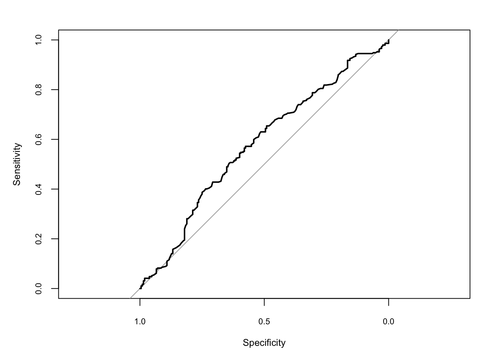


Sarnase mudeli saab fittida ka siis, kui n>1 ja meil on igale ahvile countide suhted nr of pull-left/total pulls. Nüüd on meil vaja lisada trials(), kuhu läheb n kas ühe numbrina või muutujana, mis indekseerib sündmuste arvu ehk n-i. Antud juhul on kõikidel ahvidel katsete arv n 18.

```r
chimp_aggr <- select(chimpanzees, actor, condition, prosoc_left, pulled_left) %>%
  group_by(actor, condition, prosoc_left) %>%
  summarise_at("pulled_left", sum)
m_logreg_3 <- brm(pulled_left | trials(18) ~ 1 + prosoc_left, 
                  data = chimp_aggr, 
                  family = binomial)
```
Koefitsendid  tulevad samad, mis eelmisel mudelil.

Näide agregeeritud binoomsetele andmetele.

```r
data(UCBadmit)
head(UCBadmit)
#>   dept applicant.gender admit reject applications
#> 1    A             male   512    313          825
#> 2    A           female    89     19          108
#> 3    B             male   353    207          560
#> 4    B           female    17      8           25
#> 5    C             male   120    205          325
#> 6    C           female   202    391          593
```


```r
ucbadmit <- mutate(UCBadmit, male = case_when(
  applicant.gender == "male" ~ 1,
  TRUE ~ 0
))
```


```r
m_ucadmit1 <- brm(admit | trials(applications) ~ 1 + male,
                  data = ubcadmit, 
                  family = binomial,
                  prior = c(prior(normal(0, 10), class = Intercept), 
                            prior(normal(0, 10), class = b)))
write_rds(m_ucadmit1, path = "data/m_ucadmit1.fit")
```


```r
m_ucadmit1 <- read_rds("data/m_ucadmit1.fit")
```


```r
tidy(m_ucadmit1)
#>          term estimate std.error    lower    upper
#> 1 b_Intercept   -0.831    0.0509   -0.918   -0.748
#> 2      b_male    0.612    0.0626    0.512    0.718
#> 3        lp__ -433.695    0.9484 -435.621 -432.776
```


```r
exp(0.61)
#> [1] 1.84
```

Mehed saavad suhtelise 84% eelise ülikooli sissesaamisel.


```r
inv_logit_scaled(-0.83 + 0.61)
#> [1] 0.445
```

Meeskandidaadi tõenäosus sisse saada on 44%.


```r
inv_logit_scaled(-0.83)
#> [1] 0.304
```

Naiskandidaadi tõenäosus sisse saada on 30%.

Kui palju erinevad vastuvõtmise tõenäosused (usaldusintervallidega)?

```r
post <- posterior_samples(m_ucadmit1)
post %>% mutate(p_admit_male = inv_logit_scaled(b_Intercept + b_male),
                p_admit_female = inv_logit_scaled(b_Intercept),
                diff_admit = p_admit_male - p_admit_female) %>%
  summarise(`2.5%`  = quantile(diff_admit, probs = .025),
            `50%`   = median(diff_admit),
            `97.5%` = quantile(diff_admit, probs = .975))
#>    2.5%   50% 97.5%
#> 1 0.115 0.142  0.17
```

Mudeldame otse küsimust, mis on naiste ja meeste erinevus sissesaamisel.
intercepti surume nulli, et saada eraldi hinnang igale departmendile:

```r
m_ucadmit2 <- brm(admit | trials(applications) ~ 0 + dept + male,
                  data = ucbadmit, 
                  family = binomial,
                  prior(normal(0, 10), class = b))
write_rds(m_ucadmit2, path = "data/m_ucadmit2.fit")
```


```r
m_ucadmit2 <- read_rds("data/m_ucadmit2.fit")
```


```r
tidy(m_ucadmit2)
#>      term estimate std.error   lower    upper
#> 1 b_deptA    0.684    0.0968   0.523   0.8426
#> 2 b_deptB    0.641    0.1157   0.453   0.8313
#> 3 b_deptC   -0.581    0.0743  -0.705  -0.4593
#> 4 b_deptD   -0.613    0.0841  -0.752  -0.4776
#> 5 b_deptE   -1.058    0.0974  -1.219  -0.9006
#> 6 b_deptF   -2.630    0.1556  -2.896  -2.3911
#> 7  b_male   -0.102    0.0807  -0.232   0.0368
#> 8    lp__  -70.630    1.8432 -74.018 -68.2572
```


```r
pd <- position_dodge(1)
predict(m_ucadmit2) %>%
  as_tibble() %>% 
  bind_cols(ucbadmit) %>% 
  ggplot(aes(x = dept, y = admit / applications)) +
  geom_pointrange(aes(y = Estimate / applications,
                      ymin = Q2.5  / applications,
                      ymax = Q97.5 / applications,
                      color = applicant.gender), position = pd) +
  geom_point(aes(color = applicant.gender), position = pd) +
  labs(y = "Proportion admitted",
       title = "Posterior validation check") 
```


Ohhoo, kui vaadata deparmente eraldi, pole mingit kinnitust, et meestel oleks paremad võimalused ülikooli sisse saada.


```r
marginal_effects(m_ucadmit2, effects ="dept", conditions = data.frame(male = c(0, 1)))
```


### y muutujal 3+ kategoorilist väärtust

 Building a generalized linear model from a multinomial likelihood is complicated, because as the event types multiply, so too do your modeling choices. And there are two different approaches to constructing the likelihoods, as well.  The  First is based directly on the multinomial likelihood and uses a generalization of the logit link. 

When more than two types of unordered events are possible, and the probability of each type of event is constant across trials, then the maximum entropy distribution is the multinomial distribution. The conventional and natural link is this context is the multinomial logit. This link function takes a vector of scores, one for each  K event types, and computed the probability of a particular type of event K.


Estimate the association between person’s family income and which career (there are 3 choiches) he chooses. 


```r
N <- 100
set.seed(2078)
# simulate family incomes for each individual
family_income <- runif(N)
# assign a unique coefficient for each type of event
b      <- (1:-1)
career <- rep(NA, N)  # empty vector of choices for each individual

for (i in 1:N) {
    score     <- 0.5 * (1:3) + b * family_income[i]
    p         <- softmax(score[1], score[2], score[3])
    career[i] <- sample(1:3, size = 1, prob = p)
}
```


```r
mult_logistic_m1 <-
  brm(data = list(career = career, family_income = family_income), 
      family = categorical(link = "logit"),
      career ~ 1 + family_income)

write_rds(mult_logistic_m1, path = "data/mult_logistic_m1.fit")
```
 


Parameetreid ei saa otse tõlgendada. Selle asemel on mõistlik töötada mudeli ennustuste tasemel konverteerides parameetrid 3ks tõenäosusteks, et inimene kindlal perekonna sissetuleku tasemel valib karjääri 1, 2 või 3.

```r
pred1 <- predict(mult_logistic_m1) %>% as_tibble()
pred1$career <- career
pred1$income <- family_income
pred1_l <- reshape2::melt(pred1, id.vars =  4:5, measure.vars = 1:3)
pred1_l <- pred1_l %>% 
  mutate(variable = case_when(variable == "P(Y = 1)" ~ "career 1",
                              variable == "P(Y = 2)" ~ "career 2",
                              variable == "P(Y = 3)" ~ "career 3"))
ggplot(pred1_l, aes(income, value)) + geom_point() + facet_wrap(~variable)+
  ylab("Pr of career choice at a given income") 
```


 

### zero inflated mudelid

Kasulikud siis, kui teil on Y-s rohkem nulle kui võiks arvata.
Näiteks, kui proovida hinnata, mitu suitsu päevas tõmmatakse andmestikust, mis sisaldab mittesuitsetajaid.

selle mudeli spetsifitseerimiseks pole vaja teha muud, kui õelda brm() argument family = zero_inflated_poisson(), zero_inflated_beta(), _binomial(), _negbinomial().

zinb data: mitu kala turist püüab.


```r
zinb <- read_csv("http://stats.idre.ucla.edu/stat/data/fish.csv")
zinb
```


```r
brm(count ~ persons + child + camper, 
                 data = zinb, family = zero_inflated_poisson())
```

sellel mudelil on parameeter `zi` ehk zero inflated probability, mille väärtus annab infleeritud 0-de suhte kõikidesse 0-desse, 

järgmiseks püüame veel lisaks ennustada zi väärtust lähtuvalt laste arvust (lastega pered võiks vähem kalastada)


```r
brm(bf(count ~ persons + child + camper, 
       zi ~ child), data = zinb, family = zero_inflated_poisson())
```

Nüüd on meil parameetrid `zi_Intercept` ja `zi_child`

### additiivsed distributsioonilised mudelid

inkorporeerime splinid multitaseme mudelisse - siis kui me ei tea y ja x-i suhete kuju.

simuleerime andmed

```r
dat_smooth <- mgcv::gamSim(eg = 6, n = 200, scale = 2, verbose = FALSE)
#> Gu & Wahba 4 term additive model
```


```r
head(dat_smooth[, 1:6])
#>       y    x0    x1     x2    x3     f
#> 1  5.00 0.945 0.192 0.5494 0.246  7.69
#> 2  9.08 0.126 0.194 0.0512 0.963  9.04
#> 3 16.63 0.807 0.508 0.1144 0.396 17.35
#> 4 19.70 0.399 0.823 0.9513 0.748 19.09
#> 5  6.84 0.379 0.396 0.8617 0.660  7.34
#> 6 20.27 0.123 0.826 0.1846 0.197 20.15
```

x0 kuni x3 on prediktorid, fac on faktor veerg, mis indikeerib nested andmestruktuuri. me ennustame y väärtusi x0 ja x1 järgi, ja lisaks laseme residuaalse sd varieeruma x0 smoothing termi ja fac gruppide interceptide järgi.


```r
fit_smooth1 <- brm(
  bf(y ~ s(x1) + s(x2) + (1|fac), sigma ~ s(x0) + (1|fac)),
  data = dat_smooth, family = gaussian()
)
```


## Monotoonilised efektid

näit prediktor muutuja: suitsetab palju - vähe - väga vähe.
me ei eelda, et 3 taset oleks üksteisest sama kaugel - ei modelleeri seda pideva muutujana.


```r
fit1 <- brm(y ~ mo(x), data = d)
```

nüüd tekivad meile Simplex parameetrid. Nende prior on kanooniliselt ühe parameetriga (alpha) Dirichlet prior, mis on beta jaotuse multivariaatne üldistus. 

siin me eeldame, et kõrvuti kategooriate erinevused on samad - e lähevad sama priori alla. Kui me eeldame, et meil on näit 3 järjestikust monotoonilist taset ja, et madalatel väärtustel (1) on monotoonilise muutuja mõju Y-le suurem, siis anname alphale kõrgema väärtuse. Meie kolemses näites on vaja spetsifitseerida vektor 3 alpha-ga.


```r
prior <- prior(dirichlet(c(2, 1, 1)), class = "...", coef = "...")
fit4 <- brm(y ~ mo(x), data = d,
            prior = prior, sample_prior = TRUE)
```

monotooniliste muutujate interaktsiooni mudeldamine

```r
fit5 <- brm(y ~ mo(x)*age, data = d)
marginal_effects(fit5, "x:age")
```


mitmetasemelised monotoonilised mudelid

```r
fit6 <- brm(y ~ mo(x)*age + (mo(x) | city), data = d)
```

### Multivariaatsed mudelid

mitu y muutujat, millel igaühel on oma prediktorid.

Eurasian blue tit: predict the tarsus length as well as the back color of chicks. Half of the brood were put into another fosternest, while the other half stayed in the fosternest of their own dam. This allows to separate genetic from environmental factors. Additionally, we have information about the hatchdate and sex of the chicks (the latter being known for 94% of the animals).


```r
data("BTdata", package = "MCMCglmm")
head(BTdata)
```


```r
fit1 <- brm(
  cbind(tarsus, back) ~ sex + hatchdate + (1|p|fosternest) + (1|q|dam),
  data = BTdata, chains = 2, cores = 2
)
add_ic(fit1) <- "loo"
summary(fit1)
pp_check(fit1, resp = "tarsus")
pp_check(fit1, resp = "back")
```

The term (1|p|fosternest) indicates a varying intercept over fosternest. By writing |p| in between we indicate that all varying effects of fosternest should be modeled as correlated. This makes sense since we actually have two model parts, one for tarsus and one for back. The indicator p is arbitrary and can be replaced by other symbols that comes into your mind.
 Similarily, the term (1|q|dam) indicates correlated varying effects of the genetic mother of the chicks.
 
 The summary output of multivariate models closely resembles those of univariate models, except that the parameters now have the corresponding response variable as prefix. Within dams, tarsus length and back color seem to be negatively correlated, while within fosternests the opposite is true. This indicates differential effects of genetic and environmental factors on these two characteristics. Further, the small residual correlation rescor(tarsus, back) on the bottom of the output indicates that there is little unmodeled dependency between tarsus length and back color. Although not necessary at this point, we have already computed and stored the LOO information criterion of fit1, which we will use for model comparisons. 

Me võime anda ette erinevad valemid kummagile y-muutujale nii

```r
bf_tarsus <- bf(tarsus ~ sex + (1|p|fosternest) + (1|q|dam))
bf_back <- bf(back ~ hatchdate + (1|p|fosternest) + (1|q|dam))
fit2 <- brm(bf_tarsus + bf_back, data = BTdata, chains = 2, cores = 2)
```

We change our model in various directions at the same time. Remember the slight left skewness of tarsus, which we will now model by using the skew_normal family instead of the gaussian family. Since we do not have a multivariate normal (or student-t) model, estimating residual correlations is no longer possible. We make this explicit using the set_rescor function. We investigate if the relationship of back and hatchdate is really linear as previously assumed by fitting a non-linear spline of hatchdate. On top of it, we model separate residual variances of tarsus for males and femals chicks.


```r
bf_tarsus <- bf(tarsus ~ sex + (1|p|fosternest) + (1|q|dam)) +
  lf(sigma ~ 0 + sex) + skew_normal()
bf_back <- bf(back ~ s(hatchdate) + (1|p|fosternest) + (1|q|dam)) +
  gaussian()
fit3 <- brm(bf_tarsus + bf_back + set_rescor(FALSE), data = BTdata)
```

### Mittelineaarsed mudelid


```r
b <- c(2, 0.75)
x <- rnorm(100)
y <- rnorm(100, mean = b[1] * exp(b[2] * x))
dat1 <- data.frame(x, y)

prior1 <- prior(normal(1, 2), nlpar = "b1") +
  prior(normal(0, 2), nlpar = "b2")
fit1 <- brm(bf(y ~ b1 * exp(b2 * x), b1 + b2 ~ 1, nl = TRUE),
            data = dat1, prior = prior1)
```

Siin on iga mittelineaarne parameeter (b1 ja b2) eraldi modelleeritud ~1 abil.  Argument b1 + b2 ~ 1 (lühivorm: b1 ~ 1, b2 ~ 1) ütleb, mis muutujad valemist on parameetrid, mille väärtust tuleb hinnata. Lisaks spetsifitseerib see igale parameetrile lineaarsed prediktorid. Mitte-lineaarsed parameetrid on tegelikult kohahoidjad lineaarsetele prediktor-termidele. Kuna me siin ei ennusta b1 ja b2 lisaparameetrite kaudu, on meil intercept-only mudel kummagile.

Priors on population-level parameters (i.e., ‘fixed effects’) are often mandatory to identify a non-linear model. Thus, brms requires the user to explicitely specify these priors. In the present example, we used a normal(1, 2) prior on (the population-level intercept of) b1, while we used a normal(0, 2) prior on (the population-level intercept of) b2. Setting priors is a non-trivial task in all kinds of models, especially in non-linear models, so you should always invest some time to think of appropriate priors. Quite often, you may be forced to change your priors after fitting a non-linear model for the first time, when you observe different MCMC chains converging to different posterior regions. This is a clear sign of an idenfication problem and one solution is to set stronger (i.e., more narrow) priors.

# brms süntaks


Symbol   Example             Meaning                                                                                                                                                                                   
-------  ------------------  ------------------------------------------------------------------------------------------------------------------------------------------------------------------------------------------
+        + x                 include this variable                                                                                                                                                                     
-        -                   x	delete this variable                                                                                                                                                                    
:        x : z               include the interaction between these variables                                                                                                                                           
*        x * z               include these variables and the interactions between them                                                                                                                                 
/        x / z               nesting: include z nested within x                                                                                                                                                        
|        x | z               conditioning: include x given z                                                                                                                                                           
^        (u + v + w + z)^3   include these variables and all interactions up to three way                                                                                                                              
poly     poly(x,3)           polynomial regression: orthogonal polynomials                                                                                                                                             
Error    Error(a/b)          specify an error term                                                                                                                                                                     
I        I(x*z)              as is: include a new variable consisting of these variables multiplied. (x^2) means include this variable squared, etc. In other words I( ) isolates the mathematic operations inside it. 
1        - 1                 intercept: delete the intercept (regress through the origin)                                                                                                                              

üldine vorm:

`response ~ pterms + (gterms | group)`

kasuta g1:g2 või g1/g2, kui nii g1 kui g2 on sobilikud grupeerivad faktorid. 
: operaator loob uue grupeeriva faktori, mis kombineerib g1 ja g2 tasemed.  

/ operaator viitab nested struktuurile (kool - koolitüüp)

(1 | g1/g2), tähendab tegelikult (1 | g1) + (1 | g1:g2). 

(1 | g1 + g2) on sama, mis (1 | g1) + (1 | g2).

 || kasutades (x || g1) ei modelleeri me grupi-taseme korrelatsioone. See on hea, kui mudeli fittimine muidu ei tööta. 
 
 kuidas mudeldada sama grupeeriva faktori korrelatsioone üle mitme regressioonivõrrandi? Selleks laiendame | operaatori |<ID>|, kus <ID> on suvaline väärtus. 
Näiteks kui termid (x1|ID|g1) and (x2|ID|g1) esinevad kuskil samas või erinevates võrrandites, modelleeritakse need kui korreleeritud.

alternatiivseid grupeeivaid struktuure saab väljendada nii: 

`(gterms | fun(group))`. 

Hetkel on meil 2 sellist fun-i: gr() annab default käitumise ja mm() annab multi-membership termid. 
Näiteks `brm(y ~ 1 + (1 | mm(s1, s2))` modelleerib seda, kuidas lapsed võivad õppida kahes koolis (s1 ja s2) eri aegadel

gr() lisatakse muidu automaatselt, aga seda spetsifitseerides saab kirjutada

`y ~ x + (1|gr(g1, by = g2))`, mis tähendab, et grupeeriva muutja g1 sees lahutatakse veel gruppidesse g2 muutuja tasemete järgi - ja iga g2 grupp modelleeritakse iseseisvalt (ilma shrinkageta)

Mittelineaarne mudel:

y = b1(1 − exp(−(x/b2)**b3 )

y ja x seos parameetritega b1..b3
Oletame, et tahame kõik parameetrid fittida grupeeriva muutuja g tasemete järgi ja et grupi tasmel efektid oleks omavahel korreleeritud. Lisaks ennustame me b1-e kovariaat z järgi. See kõik läheb järgmisesse võrrandisüsteemi kus, lisaks mitte-lineaarsele võrrandile, igale parameetrile b1...b3 vastab oma lineaarne võrrand:

`y ~ b1 * (1 - exp(-(x / b2) ^ b3)`
`b1 ~ z + (1|ID|g)`
`b2 ~ (1|ID|g)`
`b3 ~ (1|ID|g)`

lisaks on mudeli keeles silumistermid s() ehk spline ja t2() ehk bivariate tensor spline, mis tulevad mgcv paketist. 
Näiteks `rentsqm ~ t2(area, yearc) + (1|district)`

category specific effects cs, 

monotonic effects mo, 

noise-free effects me, or 

Gaussian process terms gp. 

additional information on the response variable may be specified via
`response | aterms ~ <predictor terms>`. The aterms part may contain multiple terms of the form fun(<variable>) separated by + each providing special information on the response variable. This allows among others to weight observations, provide known standard errors for meta-analysis, or model censored or truncated data.


## General formula structure

response | aterms ~ pterms + (gterms | group)

The pterms - effects that are assumed to be the same across observations ('population-level' effects). 

gterms - effects that are assumed to vary across grouping variables specified in group ('group-level' effects).

###Group-level terms: x||g, 1|ID|g, gr(x, by = ), mm(g1, g2)

Multiple grouping factors each with multiple group-level effects are possible. 

Use || in grouping terms to prevent correlations from being modeled. 

It is possible to model different group-level terms of the same grouping factor as correlated (even across different formulas, e.g., in non-linear models) by using |<ID>| instead of |. All group-level terms sharing the same ID will be modeled as correlated. for instance, the terms (1+x|2|g) and (1+z|2|g) mean that correlations between x and z will be estimated.
correlated group-level effects across parameters:
`bf(y ~ a1 - a2^x, a1 ~ 1 + (1|2|g), a2 ~ x + (x|2|g), nl = TRUE)`

If levels of the grouping factor belong to different sub-populations, it may be reasonable to assume a different covariance matrix for each of the sub-populations. For instance, the variation within the treatment group and within the control group in a randomized control trial might differ. Suppose that y is the outcome, and x is the factor indicating the treatment and control group. Then, we could estimate different hyper-parameters of the varying effects (in this case a varying intercept) for treatment and control group via y ~ x + (1 | gr(subject, by = x)).

A multi-membership term with two members: (1 | mm(g1, g2)), where g1 and g2 specify the first and second member, respectively. If x varies across the levels of g1 and g2, we can save the respective x values in the variables x1 and x2 and then model the varying effect as (1 + mmc(x1, x2) | mm(g1, g2)).

multilevel w smoothing terms `brmsformula(y ~ x1*x2 + s(z) + (1+x1|1) + (1|g2))` 

additionally predict 'sigma' `brmsformula(y ~ x1*x2 + s(z) + (1+x1|1) + (1|g2), sigma ~ x1 + (1|g2))`


### Special predictor terms (s, t2, gp(), mo(), me(), mi(), cs())

Smoothing terms are modeled using s() and t2() in the pterms part of the formula. 

Gaussian process terms can be fitted using gp() in the pterms. Similar to smooth terms, Gaussian processes can be used to model complex non-linear relationships, for instance temporal or spatial autocorrelation. However, they are computationally demanding and are thus not recommended for very large datasets.

The pterms and gterms parts may contain non-standard effect types: monotonic mo(predictor), measurement error me(predictor, sd_predictor), missing value mi(predictor), and category specific effects cs(<predictors>). 

Category specific effects can only be estimated in ordinal models and are explained in more detail in the package's main vignette (type vignette("brms_overview")). 

A monotonic predictor must either be integer valued or an ordered factor. Predictor categories (or integers) are not assumed to be equidistant with respect to their effect on the response variable. The distance between adjacent categories is estimated from the data and may vary across categories. One parameter takes care of the direction and size of the effect similar to an ordinary regression parameter, while an additional parameter vector estimates the normalized distances between consecutive predictor categories.

Often predictors contain measurement error. Effects of noise-free predictors can be modeled using the me (for 'measurement error') function. If x is a measured predictor with known measurement error sdx, we can include it via y ~ me(x, sdx). If x2 is another measured predictor with corresponding error sdx2 and z is a predictor without error (e.g., an experimental setting), we can model all main effects and interactions: $y = me(x, sdx) * me(x2, sdx2) * z$. 

Using a variable with missing values as predictors requires two things, First, we need to specify that the predictor contains missings that should to be imputed. If x is a predictor with missings and z is a predictor without missings, we go for y ~ mi(x) + z. Second, we need to model x as an additional response with corresponding predictors and the addition term mi(). In our example, we could write x | mi() ~ z. 

bf(bmi ~ age * mi(chl)) + bf(chl | mi() ~ age) + set_rescor(FALSE).

### Additional response information

aterms part may contain multiple terms of the form fun(<variable>) separated by + each providing special information on the response variable. fun can be replaced with either se, weights, cens, trunc, trials, cat, or dec. 

For families gaussian, student and skew_normal, it is possible to specify standard errors of the observations, thus allowing to perform meta-analysis. Suppose that the variable y_i contains the effect sizes from the studies and se_i the corresponding standard errors. Then, fixed and random effects meta-analyses can be conducted using the formulas `y_i | se(se_i) ~ 1` and `y_i | se(se_i) ~ 1 + (1|study)`, respectively, where study is a variable uniquely identifying every study. 

Meta-regression can be performed via `y_i | se(se_i) ~ 1 + mod1 + mod2 + (1|study)` or 
`y_i | se(se_i) ~ 1 + mod1 + mod2 + (1 + mod1 + mod2|study)`, where mod1 and mod2 represent moderator variables. By default, the standard errors replace the parameter sigma. To model sigma in addition to the known standard errors, set argument sigma in function se to TRUE, for instance, `y_i | se(se_i, sigma = TRUE) ~ 1`.

For all families, weighted regression may be performed using weights in the aterms part. Internally, this is implemented by multiplying the log-posterior values of each observation by their corresponding weights. Suppose that variable we_i contains the weights and that yi is the response variable. Then, formula `y_i | weights(we_i) ~ predictors` implements a weighted regression.

With the exception of categorical, ordinal, and mixture families, left, right, and interval censoring can be modeled through `y | cens(censored) ~ predictors`. The censoring variable (named censored in this example) should contain the values 'left', 'none', 'right', and 'interval' (or equivalently -1, 0, 1, and 2) to indicate that the corresponding observation is left censored, not censored, right censored, or interval censored. For interval censored data, a second variable (let's call it y2) has to be passed to cens. In this case, the formula has the structure `y | cens(censored, y2) ~ predictors`. While the lower bounds are given in y, the upper bounds are given in y2 for interval censored data. Intervals are assumed to be open on the left and closed on the right: (y, y2].

With the exception of categorical, ordinal, and mixture families, the response distribution can be truncated using the trunc function in the addition part. If the response variable is truncated between, say, 0 and 100, we can specify this via `yi | trunc(lb = 0, ub = 100) ~ predictors`. Instead of numbers, variables in the data set can also be passed allowing for varying truncation points across observations. Defining only one of the two arguments in trunc leads to one-sided truncation.

For all continuous families, missing values in the responses can be imputed within Stan by using the addition term mi. This is mostly useful in combination with mi predictor terms as explained above under 'Special predictor terms'.

For families binomial and zero_inflated_binomial, addition should contain a variable indicating the number of trials underlying each observation: `success | trials(n)`. If the number of trials is constant across all observations, say 10, we may also write `success | trials(10)`. 

For all ordinal families, aterms may contain a term cat(number) to specify the number of categories (e.g, cat(7)). If not given, the number of categories is calculated from the data.

Multiple addition terms may be specified at the same time using the + operator, for instance `formula = y_i | se(se_i) + cens(censored) ~ 1` for a censored meta-analytic model.


### Formula syntax for non-linear models

The non-linear model can be specified within the formula argument. Suppose, that we want a non-linear model being defined via formula = y ~ alpha - beta * lambda^x. To tell brms that this is a non-linear model, argument nl = TRUE. Now we have to specify a model for each of the non-linear parameters. Let's say we just want to estimate those three parameters with no further covariates or random effects. Then we can pass alpha + beta + lambda ~ 1 or equivalently (and more flexible) alpha ~ 1, beta ~ 1, lambda ~ 1 to the ... argument. If we have another predictor z and observations nested within the grouping factor g, we may write for instance alpha ~ 1, beta ~ 1 + z + (1|g), lambda ~ 1. We are using z and g only for the prediction of beta, but we might also use them for the other non-linear parameters.

Non-linear models may not be uniquely identified and / or show bad convergence. For this reason it is mandatory to specify priors on the non-linear parameters.

`bf(y ~ a1 - a2^x, a1 + a2 ~ 1, nl = TRUE)` simple nl model

### Formula syntax for predicting distributional parameters

It is also possible to predict parameters of the response distribution such as the residual standard deviation sigma in gaussian models or the hurdle probability hu in hurdle models. The syntax closely resembles that of a non-linear parameter, for instance sigma ~ x + s(z) + (1+x|g). 

Alternatively, one may fix distributional parameters to certain values. This is useful when models become too complicated and otherwise have convergence issues. The quantile parameter of the asym_laplace distribution is a good example where it is useful. By fixing quantile, one can perform quantile regression for the specified quantile. For instance, quantile = 0.25 allows predicting the 25%-quantile. Furthermore, the bias parameter in drift-diffusion models, is assumed to be 0.5 (i.e. no bias) in many applications. To achieve this, simply write bias = 0.5. Other possible applications are the Cauchy distribution as a special case of the Student-t distribution with nu = 1, or the geometric distribution as a special case of the negative binomial distribution with shape = 1. Furthermore, the parameter disc ('discrimination') in ordinal models is fixed to 1 by default and not estimated, but may be modeled as any other distributional parameter if desired ('disc' can only be positive, which is achieved by applying the log-link).

In categorical models, distributional parameters do not have fixed names. Instead, they are named after the response categories (excluding the first one, which serves as the reference category), with the prefix 'mu'. If, for instance, categories are named cat1, cat2, and cat3, the distributional parameters will be named mucat2 and mucat3.

Some distributional parameters currently supported by brmsformula have to be positive (a negative standard deviation or precision parameter does not make any sense) or are bounded between 0 and 1 (for zero-inflated / hurdle probabilities, quantiles, or the initial bias parameter of drift-diffusion models). However, linear predictors can be positive or negative, and thus the log link (for positive parameters) or logit link (for probability parameters) are used by default to ensure that distributional parameters are within their valid intervals. This implies that, by default, effects for such distributional parameters are estimated on the log / logit scale and one has to apply the inverse link function to get to the effects on the original scale. Alternatively, it is possible to use the identity link to predict parameters on their original scale, directly. However, this is much more likely to lead to problems in the model fitting, if the parameter actually has a restricted range.

### Formula syntax for mixture models

If not specified otherwise, all mean parameters of the mixture components are predicted using the right-hand side of formula.

distributional parameters of mixture distributions have the same name as those of the corresponding ordinary distributions, but with a number at the end to indicate the mixture component. For instance, if you use family mixture(gaussian, gaussian), the distributional parameters are sigma1 and sigma2. distributional parameters of the same class can be fixed to the same value. For the above example, we could write sigma2 = "sigma1" to make sure that both components have the same residual standard deviation, which is in turn estimated from the data.

specify different predictors for different mixture components
mix <- mixture(gaussian, gaussian)
bf(y ~ 1, mu1 ~ x, mu2 ~ z, family = mix)

fix both residual standard deviations to the same value
bf(y ~ x, sigma2 = "sigma1", family = mix)


In addition, there are two types of special distributional parameters. The first are named mu<ID>, that allow for modeling different predictors for the mean parameters of different mixture components. For instance, if you want to predict the mean of the first component using predictor x and the mean of the second component using predictor z, you can write mu1 ~ x as well as mu2 ~ z. The second are named theta<ID>, which constitute the mixing proportions. If the mixing proportions are fixed to certain values, they are internally normalized to form a probability vector. If one seeks to predict the mixing proportions, all but one of the them has to be predicted, while the remaining one is used as the reference category to identify the model. The softmax function is applied on the linear predictor terms to form a probability vector.

### Formula syntax for multivariate models

Multivariate models may be specified using cbind notation or with help of the mvbf function. Suppose that y1 and y2 are response variables and x is a predictor. Then cbind(y1, y2) ~ x specifies a multivariate model, The effects of all terms specified at the RHS of the formula are assumed to vary across response variables. For instance, two parameters will be estimated for x, one for the effect on y1 and another for the effect on y2. This is also true for group-level effects. When writing, for instance, cbind(y1, y2) ~ x + (1+x|g), group-level effects will be estimated separately for each response. To model these effects as correlated across responses, use the ID syntax (see above). For the present example, this would look as follows: cbind(y1, y2) ~ x + (1+x|2|g). Of course, you could also use any value other than 2 as ID.

It is also possible to specify different formulas for different responses. If, for instance, y1 should be predicted by x and y2 should be predicted by z, we could write mvbf(y1 ~ x, y2 ~ z). Alternatively, multiple brmsformula objects can be added to specify a joint multivariate model (see 'Examples').

## brms likelihoods

A character string naming the distribution of the response variable. 

student(link = "identity", link_sigma = "log", link_nu = "logm1")

bernoulli(link = "logit")

negbinomial(link = "log", link_shape = "log")

geometric(link = "log")

lognormal(link = "identity", link_sigma = "log")

shifted_lognormal(link = "identity", link_sigma = "log",
  link_ndt = "log")

skew_normal(link = "identity", link_sigma = "log",
  link_alpha = "identity")

exponential(link = "log")

weibull(link = "log", link_shape = "log")

exgaussian(link = "identity", link_sigma = "log", link_beta = "log")

Beta(link = "logit", link_phi = "log")

hurdle_poisson(link = "log")

hurdle_negbinomial(link = "log", link_shape = "log",
  link_hu = "logit")

hurdle_gamma(link = "log", link_shape = "log", link_hu = "logit")

hurdle_lognormal(link = "identity", link_sigma = "log",
  link_hu = "logit")

zero_inflated_beta(link = "logit", link_phi = "log",
  link_zi = "logit")

zero_one_inflated_beta(link = "logit", link_phi = "log",
  link_zoi = "logit", link_coi = "logit")

zero_inflated_poisson(link = "log", link_zi = "logit")

zero_inflated_negbinomial(link = "log", link_shape = "log",
  link_zi = "logit")

zero_inflated_binomial(link = "logit", link_zi = "logit")

categorical(link = "logit")

cumulative(link = "logit", link_disc = "log",
  threshold = c("flexible", "equidistant"))
  
* Family gaussian with identity link leads to linear regression. 

* Family student with identity link leads to robust linear regression that is less influenced by outliers. 

* Family skew_normal can handle skewed responses in linear regression. 

* Families poisson, negbinomial, and geometric with log link lead to regression models for count data. 

* Families binomial and bernoulli with logit link leads to logistic regression and family categorical to multi-logistic regression when there are more than two possible outcomes. 

* Families cumulative, cratio ('continuation ratio'), sratio ('stopping ratio'), and acat ('adjacent category') leads to ordinal regression. 

* Families Gamma, weibull, exponential, lognormal, frechet, and inverse.gaussian can be used (among others) for survival regression. 

* Families weibull, frechet, and gen_extreme_value ('generalized extreme value') allow for modeling extremes. 

* Family asym_laplace allows for quantile regression when fixing the auxiliary quantile parameter to the quantile of interest. 

* Family exgaussian ('exponentially modified Gaussian') and shifted_lognormal are especially suited to model reaction times. 

* The wiener family provides an implementation of the Wiener diffusion model. For this family, the main formula predicts the drift parameter 'delta' and all other parameters are modeled as auxiliary parameters (see brmsformula for details). 

* Families hurdle_poisson, hurdle_negbinomial, hurdle_gamma, hurdle_lognormal, zero_inflated_poisson, zero_inflated_negbinomial, zero_inflated_binomial, zero_inflated_beta, and zero_one_inflated_beta allow to estimate zero-inflated and hurdle models. These models can be very helpful when there are many zeros in the data (or ones in case of one-inflated models) that cannot be explained by the primary distribution of the response. Families hurdle_lognormal and hurdle_gamma are especially useful, as traditional lognormal or Gamma models cannot be reasonably fitted for data containing zeros in the response.

A list of all possible links for each family: 

* The families gaussian, student, skew_normal, exgaussian, asym_laplace, and gen_extreme_value accept the links (as names) identity, log, and inverse; 

* families poisson, negbinomial, geometric, zero_inflated_poisson, zero_inflated_negbinomial, hurdle_poisson, and hurdle_negbinomial the links log, identity, and sqrt; 

* families binomial, bernoulli, Beta, zero_inflated_binomial, zero_inflated_beta, and zero_one_inflated_beta the links logit, probit, probit_approx, cloglog, cauchit, and identity; 

* families cumulative, cratio, sratio, and acat the links logit, probit, probit_approx, cloglog, and cauchit; family categorical the link logit; 

* families Gamma, weibull, exponential, frechet, and hurdle_gamma the links log, identity, and inverse; families lognormal and hurdle_lognormal the links identity and inverse; 

* family inverse.gaussian the links 1/mu^2, inverse, identity and log; family von_mises the link tan_half; family wiener the link identity. 

The first link mentioned for each family is the default.


## priors

### Population-level ('fixed') effects

If y is predicted by x1 and x2 then x1 and x2 have regression parameters b_x1 and b_x2. The default prior for population-level effects (including monotonic and category specific effects) is an improper flat prior. Other common options are normal priors or student-t priors. If we want to have a normal prior with mean 0 and standard deviation 5 for x1, and a unit student-t prior with 10 degrees of freedom for x2, we can specify this via set_prior("normal(0,5)", class = "b", coef = "x1") and  set_prior("student_t(10,0,1)", class = "b", coef = "x2"). To put the same prior on all population-level effects at once, set_prior("<prior>", class = "b"). This also leads to faster sampling, because priors can be vectorized in this case. Both ways of defining priors can be combined using for instance set_prior("normal(0,2)", class = "b") and 
set_prior("normal(0,10)", class = "b", coef = "x1") at the same time. This will set a normal(0,10) prior on the effect of x1 and a normal(0,2) prior on all other population-level effects. However, this will break vectorization.

The intercept has its own parameter class named "Intercept" and priors can thus be specified via set_prior("<prior>", class = "Intercept"). Setting a prior on the intercept will not break vectorization of the other population-level effects. Note that technically, this prior is set on an intercept that results when internally centering all population-level predictors around zero to improve sampling efficiency. On this centered intercept, specifying a prior is actually much easier and intuitive than on the original intercept, since the former represents the expected response value when all predictors are at their means. To treat the intercept as an ordinary population-level effect and avoid the centering parameterization, use 0 + intercept on the right-hand side of the model formula.

A special shrinkage prior to be applied on population-level effects is the horseshoe prior. See horseshoe for details. Another shrinkage prior is the so-called lasso prior. See lasso for details.

In non-linear models, population-level effects are defined separately for each non-linear parameter. Accordingly, it is necessary to specify the non-linear parameter in set_prior so that priors can be assigned correctly. If, for instance, alpha is the parameter and x the predictor for which we want to define the prior, we can write set_prior("<prior>", coef = "x", nlpar = "alpha"). As a shortcut we can use set_prior("<prior>", nlpar = "alpha") to set the same prior on all population-level effects of alpha at once.

If desired, population-level effects can be restricted to fall only within a certain interval using the lb and ub arguments of set_prior. This is often required when defining priors that are not defined everywhere on the real line, such as uniform or gamma priors. When defining a uniform(2,4) prior, you should write set_prior("uniform(2,4)", lb = 2, ub = 4). When using a prior that is defined on the positive reals only (such as a gamma prior) set lb = 0. In most situations, it is not useful to restrict population-level parameters through bounded priors (non-linear models are an important exception), but if you really want to this is the way to go.

### Standard deviations of group-level ('random') effects

Each group-level effect of each grouping factor has a standard deviation named sd_<group>_<coef>. Consider, for instance, the formula y ~ x1 + x2 + (1 + x1 | g). We see that the intercept as well as x1 are group-level effects nested in the grouping factor g. The corresponding standard deviation parameters are named as sd_g_Intercept and sd_g_x1 respectively. These parameters are restricted to be non-negative and, by default, have a half student-t prior with 3 degrees of freedom and a scale parameter that depends on the standard deviation of the response after applying the link function. Minimally, the scale parameter is 10. This prior is used (a) to be only very weakly informative in order to influence results as few as possible, while (b) providing at least some regularization to considerably improve convergence and sampling efficiency. To define a prior distribution only for standard deviations of a specific grouping factor, use set_prior("<prior>", class = "sd", group = "<group>"). To define a prior distribution only for a specific standard deviation of a specific grouping factor, you may write set_prior("<prior>", class = "sd", group = "<group>", coef = "<coef>"). 
When defining priors on group-level parameters in non-linear models, please make sure to specify the corresponding non-linear parameter through the nlpar argument in the same way as for population-level effects.

### Correlations of group-level ('random') effects

If there is more than one group-level effect per grouping factor, the correlations between those effects have to be estimated. The prior "lkj_corr_cholesky(eta)" or in short "lkj(eta)" with eta > 0 is essentially the only prior for (Cholesky factors) of correlation matrices. If eta = 1 (the default) all correlations matrices are equally likely a priori. If eta > 1, extreme correlations become less likely, whereas 0 < eta < 1 results in higher probabilities for extreme correlations. Correlation matrix parameters in brms models are named as cor_<group>, (e.g., cor_g if g is the grouping factor). To set the same prior on every correlation matrix, use for instance set_prior("lkj(2)", class = "cor"). 

### Splines

Each spline has its corresponding standard deviations modeling the variability within this term. This parameter class is called sds and priors can be specified via set_prior("<prior>", class = "sds", coef = "<term label>"). The default prior is the same as for standard deviations of group-level effects.

### Gaussian processes

Gaussian processes have two parameters, the standard deviation parameter sdgp, and characteristic length-scale parameter lscale (see gp for more details). The default prior of sdgp is the same as for sd-s of group-level effects. The default prior of lscale is an informative inverse-gamma prior specifically tuned to the covariates of the Gaussian process (for more details see https://betanalpha.github.io/assets/case_studies/gp_part3/part3.html). This tuned prior may be overly informative in some cases, so please consider other priors as well to make sure inference is robust to the prior specification. If tuning fails, a half-normal prior is used instead.

### Autocorrelation parameters

The autocorrelation parameters are named ar (autoregression), ma (moving average), arr (autoregression of the response), car (spatial conditional autoregression), as well as lagsar and errorsar (Spatial simultaneous autoregression). Priors can be defined by set_prior("<prior>", class = "ar") for ar and similar for other autocorrelation parameters. By default, ar and ma are bounded between -1 and 1, car, lagsar, and errorsar are bounded between 0, and 1, and arr is unbounded (you may change this by using the arguments lb and ub). The default prior is flat over the definition area.

### Parameters for specific families

Families gaussian, student, skew_normal, lognormal, and gen_extreme_value need the parameter sigma to account for the residual standard deviation. By default, sigma has a half student-t prior that scales in the same way as the group-level standard deviations. 
Family student needs the parameter nu representing the degrees of freedom of students-t distribution. By default, nu has prior "gamma(2, 0.1)" and a fixed lower bound of 1. 

Families gamma, weibull, inverse.gaussian, and negbinomial need a shape parameter that has a "gamma(0.01, 0.01)" prior by default. 

Every family specific parameter has its own prior class, so that set_prior("<prior>", class = "<parameter>") is the right way to go. All of these priors are chosen to be weakly informative, having only minimal influence on the estimations, while improving convergence and sampling efficiency. Often, it may not be immediately clear, which parameters are present in the model. To get a full list of parameters and parameter classes for which priors can be specified use function get_prior.


