# brms

brms on populaarne pakett, mis võimaldab kirjutada lihtsas ja lühidas keeles ka üsna keerulisi mudeleid ja need Stan-is fittida. Brms on ühe inimese (Paul Bürkner) projekt (https://github.com/paul-buerkner/brms), mis on jõudnud ette Stani meeskonna arendatavast analoogsest paketist rstanarm (https://github.com/stan-dev/rstanarm/blob/master/README.md). Paul Brükner oli mõned aastad tagasi psühholoogia doktorant, kes kirjutas brms-i naljaviluks oma doktoriprojekti kõrvalt, mille tulemusel on ta praegu teatud ringkonnis tuntum kui Lady Gaga.  

rstanarm, mide me siin ei käsitle, püüab pakkuda tavalisete sageduslikele meetoditele (ANOVA, lineaarne regressioon jne) bayesi analooge, mille mudeli spetsifikatsioon ja väljund erineks võimalikult vähe tavalisest baas-R-i töövoost. Brms on keskendunud mitmetasemelistele mudelitele ja püüab kasutada mudelite keelt, mis on harjumuspärane sageduslike hierarhiliste mudelite fittimise paketi lme4 (https://github.com/lme4/lme4/) kasutajatele. Loomulikult saab brms-is fittida ka lineaarseid ja mitte-lineaareid ühetasemelisi mudeleid, nagu ka imputeerida andmeid ja teha palju muud.


```r
library(tidyverse)
library(brms)
library(broom)
library(bayesplot)
library(mice)
library(pROC)
```

## brms-i töövoog

brms-iga modelleerimisel on mõned asjad, mida tuleks teha sõltumata sellest, millist mudelit te parajasti fitite. Kõigepealt peaksite kontrollima, et mcmc ahelad on korralikult jooksnud (divergent transitions, rhat ja ahelate visuaalne inspekteerimine). Lisaks peaksite tegema posterioorse prediktiivse ploti ja vaatama, kui palju mudeli poolt genereeritud uued valimid meenutavad teie valimit. Samuti peaksite joonisel plottima residuaalid. Kui te inspekteerite fititud parameetrite väärtusi, siis tehke seda posteeriorite tasemel, k.a. koos veapiiridega. Kindlasti tuleks ka plottida mudeli ennustused koos usalduspiiridega.

Enne tõsist mudeldamist kiikame irise andmetabelisse


```r
summary(iris)
#>   Sepal.Length   Sepal.Width    Petal.Length   Petal.Width 
#>  Min.   :4.30   Min.   :2.00   Min.   :1.00   Min.   :0.1  
#>  1st Qu.:5.10   1st Qu.:2.80   1st Qu.:1.60   1st Qu.:0.3  
#>  Median :5.80   Median :3.00   Median :4.35   Median :1.3  
#>  Mean   :5.84   Mean   :3.06   Mean   :3.76   Mean   :1.2  
#>  3rd Qu.:6.40   3rd Qu.:3.30   3rd Qu.:5.10   3rd Qu.:1.8  
#>  Max.   :7.90   Max.   :4.40   Max.   :6.90   Max.   :2.5  
#>        Species  
#>  setosa    :50  
#>  versicolor:50  
#>  virginica :50  
#>                 
#>                 
#> 
```


```r
ggplot(iris, aes(Petal.Length, Sepal.Length)) + 
  geom_point(aes(color = Species)) +
  geom_smooth(method = lm) +
  geom_smooth( color = "black", size = 0.5)
```


Loess fit viitab, et 3 liiki ühe sirgega mudeldada pole võib-olla optimaalne lahendus.


```r
ggplot(iris, aes(Petal.Length, Sepal.Length, color = Species)) + 
  geom_point() +
  geom_smooth(method = lm) +
  geom_smooth(data=iris %>% filter(Species =="virginica"), 
              se = FALSE, color = "black", size = 0.5)+
  geom_smooth(data=iris %>% filter(Species =="versicolor"), 
              se = FALSE, color = "black", size = 0.5)+
  geom_smooth(data=iris %>% filter(Species =="setosa"), 
              se = FALSE, color = "black", size = 0.5)+
  theme_classic()
```

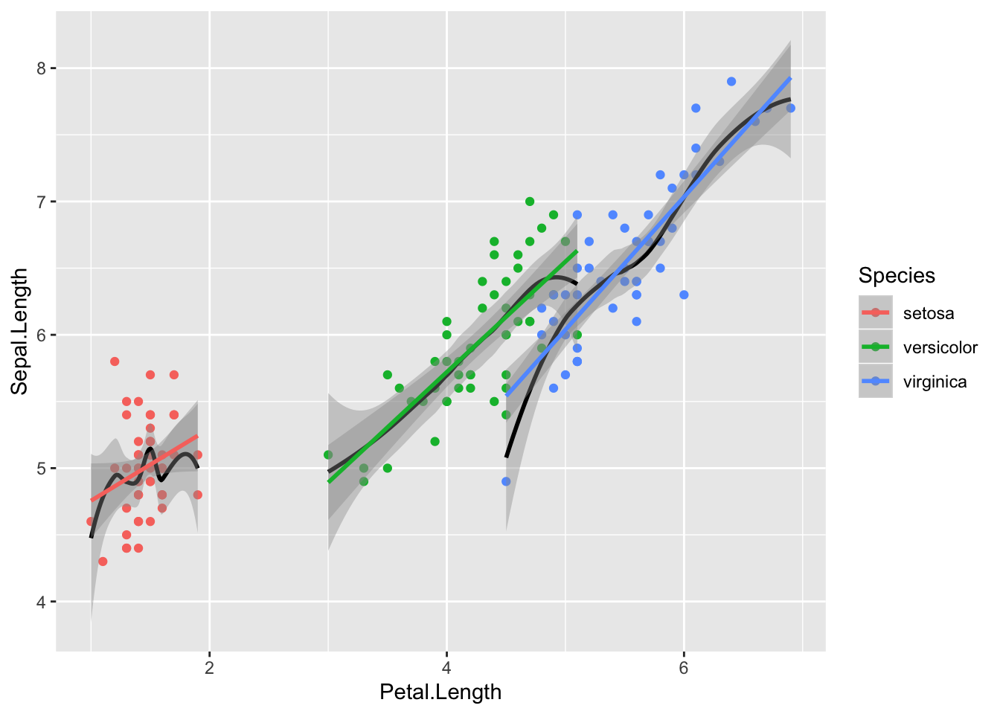

Nüüd on loess ja lm heas kooskõlas - seos y~x vahel oleks nagu enam-vähem lineaarne. Siit tuleb ka välja, et kolme mudeli tõusud on sarnased, interceptid erinevad.

### kiire töövoog

Minimaalses töövoos anname ette võimalikult vähe parameetreid ja töötame mudeliga nii vähe kui võimalik. See on mõeldud ülevaatena Bayesi mudeli fittimise põhilistest etappidest 

mudeli fittimine

```r
m_kiire <- brm(Sepal.Length~Petal.Length, data= iris)
write_rds(m_kiire, path = "m_kiire.fit")
```

Priorid on brms-i poolt ette antud ja loomulikult ei sisalda mingit teaduslikku informatsiooni. Nad on siiski "nõrgalt informatiivsed" selles mõttes, et kasutavad parametriseeringuid, mis enamasti võimaldavad mcmc ahelatel normaalselt joosta. Järgmises ptk-s õpime ise prioreid määrama.

posteeriorid ja mcmc ahelate konvergents


```r
plot(m_kiire)
```

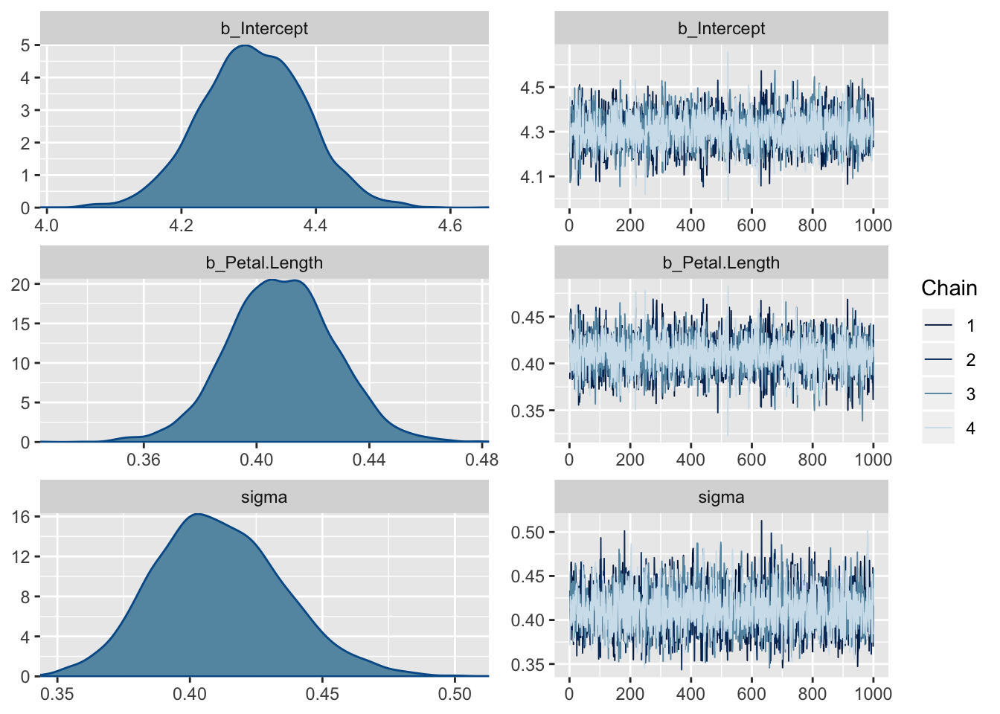

Fiti kokkuvõte - koefitsiendid ja nende fittimise edukust hindavad statistikud (Eff.Sample, Rhat)

```r
m_kiire %>% tidy
#>             term estimate std.error   lower   upper
#> 1    b_Intercept    4.307    0.0780   4.179   4.434
#> 2 b_Petal.Length    0.409    0.0187   0.379   0.439
#> 3          sigma    0.411    0.0243   0.373   0.453
#> 4           lp__  -85.338    1.2173 -87.757 -84.015
```

Eff.Sample näitab efektiivset valimi suurust, mida ahelad on kasutanud. See on suht keeruline mõiste, aga piisab, kui aru saada, et see näitaja ei tohiks olla madalam kui paarkümmend.

Rhat on statistik, mis vaatab ahelate konvergentsi. Kui Rhat > 1.1, siis on kuri karjas. Rhat 1.0 ei tähenda paraku, et võiks rahulikult hingata -- tegu on statistikuga, mida saab hästi tõlgendada häda kuulutajana, aga liiga sageli mitte vastupidi.

Ennustav plot ehk *marginal plot* - mudeli fit 95% CI-ga.

```r
plot(marginal_effects(m_kiire), points=TRUE)
```


### Põhjalikum töövoog

Põhiline erinevus eelmisega on suurem tähelepanu prioritele, mudeli fittimise diagnostikale ning tööle fititud mudeliga.

### Spetsifitseerime mudeli, vaatame ja muudame vaikeprioreid 

brms-i default priorid on konstrueeritud olema üsna väheinformatiivsed ja need tuleks enamasti informatiivsematega asendada. Igasse priorisse tuleks panna nii palju informatsiooni, kui teil on vastava parameetri kohta. Kui te mõne parameetri kohta ei oska öelda, milllised oleks selle mõistlikud oodatavad väärtused, siis saab piirduda brms-i antud vaikeväärtustega. Samas, kui keerulisemad mudelid ei taha hästi joosta (mida tuleb ikka ette), siis aitab sageli priorite kitsamaks muutmine.


```r
get_prior(Sepal.Length~Petal.Length + (1 | Species), 
          data= iris)
#>                 prior     class         coef   group resp dpar nlpar bound
#> 1                             b                                           
#> 2                             b Petal.Length                              
#> 3 student_t(3, 6, 10) Intercept                                           
#> 4 student_t(3, 0, 10)        sd                                           
#> 5                            sd              Species                      
#> 6                            sd    Intercept Species                      
#> 7 student_t(3, 0, 10)     sigma
```

Me fitime pedagoogilistel kaalutlustel shrinkage mudeli, mis tõmbab 3 liigi intercepte natuke keskmise intercepti suunas. On vaieldav, kas see on irise andmestiku juures mõistlik strateegia, aga me teeme seda siin ikkagi.

>Mitmetasemeline shrinkage mudel on abinõu ülefittimise vastu. Mudelite võrdlemisel otsitakse kompromissi - ehk mudeli, mille ennustused oleks andmepunktidele võimalikult lähedal ilma,et see mudel oleks liiga keeruliseks aetud (keerulisus on proportsionaalne mudeli parameetrite arvuga).


Prioreid muudame nii


```r
prior <- c(prior(normal(6, 3), class = "Intercept"),
           prior(normal(0, 1), class ="b"),
           prior(student_t(6, 0, 2), class = "sigma"))
```

Me valime siin nn väheinformariivsed priorid, nii et regressiooni tulemus on suht hästi võrreldav lme4 sagedusliku mudeliga. "b" koefitsiendi priorile (aga mitte "sigma" ega "Intercept"-le) võib anda ka ülemise ja/või alumise piiri [prior(normal(0, 1), class ="b", lb= -1, ub=10) ütleb, et "b" prior on nullist erinev ainult -1 ja 10 vahel]. sigma priorid on automaatselt lb = 0-ga, sest varieeruvus ei tohi olla negatiivne. 

Alati tasub prioreid pildil vaadata, et veenduda nende mõistlikuses.

```r
x <- seq(0, 10, length.out = 100)
y <- brms::dstudent_t(x, df = 6, mu = 0, sigma = 2, log = FALSE)
plot(y~x)
```


Sigma prior, mida brms kasutab, on vaikimisi pool sümmeetrilisest jaotusest, mis lõigatakse nulli kohalt pooleks nii, et seal puuduvad < 0 väärtused (seega ei saa varieeruvuse posteerior minna alla nulli).

Me võime ka prioreid ilma likelihoodideta (tõepärafunktsioonideta) läbi mudeli lasta, misjärel tõmbame fititud mudelist priorite valimid (neid võiks kutsuda ka "priorite posteerioriteks") ja plotime kõik priorid koos. Seda pilti saab siis võrrelda koos andmetega fititud mudeli posteerioritega. Selle võimaluse kasutamine on tõusuteel, sest keerulisemate mudelite puhul võib priorite ükshaaval plottimine osutuda eksitavaks.

Tekitame priorite valimid, et näha oma priorite mõistlikust (brm() argument on sample_prior = TRUE). Ühtlasi fitime ka oma mudeli koos andmete ja prioritega.

```r
m1 <- brm(Sepal.Length~Petal.Length + (1 | Species), 
          data= iris, 
          prior = prior, 
          family = gaussian,
          warmup = 1000,
          iter = 2000,
          chains = 3,
          cores = 3,
          sample_prior=TRUE)
write_rds(m1, path = "m1.fit")
```

Me fittisime mudeli m1 kaks korda: nii andmetega (selle juurde jõuame varsti), kui ka ilma andmeteta. Kui panna sisse `sample_prior = "only"`, siis jookseb mudel ilma andmeteta, ja selle võrra kiiremini. Vaikeväärtus on `sample_prior = "no"`, mis tähendab, et fititakse ainult üks mudel - koos andmetega. Ilma andmeteta (likelihoodita) fitist saame tõmmata priorite mcmc valimid, mille ka järgmiseks plotime. 


```r
samples1 <- prior_samples(m1)
sa <- samples1 %>% gather()
ggplot(sa)+ geom_density(aes(value)) + 
  facet_wrap(~key, scales="free_x")
```


Kui kasutame `sample_prior = "only"` varianti, siis on esimene koodirida erinev: `samples1 = as.data.frame(m1$fit)`.

> brms-i Intercepti priorite spetsifitseerimisel tasub teada, et brms oma sisemuses tsentreerib kõik prediktorid nullile (x - mean(x)), ja teie poolt ette antud prior peaks vastama neile tsentreeritud prediktoritele, kus kõikide prediktorite keskväärtus on null. Põhjus on, et tsentreeritud parametriseeringuga mudelid jooksevad sageli paremini. Alternatiiv on kasutada mudeli tavapärase süntaksi y ~ 1 + x (või ekvivalentselt y ~ x) asemel süntaksit y ~ 0 + intercept + x. Sellisel juhul saab anda priorid tsentreerimata predikroritele. Lisaks on brms selle süntaksi puhul nõus "b"-le antud prioreid vaikimisi ka intercepti fittimisel kasutama. 


### brm() funktsiooni argumendid: 

family - tõepärafunktsiooni tüüp (modelleerib y muutuja jaotust e likelihoodi)

warmup - mitu sammu mcmc ahel astub, enne kui ahelat salvestama hakatakse. tavaliselt on 500-1000 sammu piisav, et tagada ahelate konvergents. Kui ei ole, tõstke 2000 sammuni.

iter - ahelate sammude arv, mida salvestatakse peale warmup perioodi. Enamasti on 2000 piisav. Kui olete nõus piirduma posteeriori keskväärtuse arvutamisega ja ei soovi täpseid usaldusintervalle, siis võib piisata ka 200 sammust. 

chains - mitu sõltumatut mcmc ahelat jooksutada. 3 on hea selleks, et näha kas ahelad konvergeeruvad. Kui mitte, tuleks lisada informatiivsemaid prioreid ja/või warmupi pikkust.

cores - mitu teie arvuti tuuma ahelaid jooksutama panna.

adapt_delta - mida suurem number (max = 1), seda stabiilsemalt, ja aeglasemalt, ahelad jooksevad.

thin - kui ahel on autokorreleeritud, st ahela eelmine samm suudab ennustada järgevaid (see on paha), siis saab salvestada näit ahela iga 5. sammu (thin = 5). Aga siis tuleks ka sammude arvu 5 korda tõsta. Vaikeväärtus on thin = 1. Autokorrelatsiooni graafilist määramist näitame allpool


*Järgmine funktsioon trükib välja Stani koodi, mis spetsifitseerib mudeli, mida tegelikult Stanis fittima hakatakse. See on väga kasulik, aga ainult siis kui tahate õppida otse Stanis mudeleid kirjutama.*


```r
make_stancode(Sepal.Length~Petal.Length, data= iris,
              prior = prior)
```

### Fitime mudeleid ja võrdleme fitte.

Mudelis m1 ennustame muutuja Sepal.Length väärtusi Petal.Length väärtuste põhjal shrinkage mudelis, kus iga irise liik on oma grupis.

Teine mudel, m2, sisaldab veel üht ennustavat muutujat (Sepal.Width).


```r
m2 <- brm(Sepal.Length~Petal.Length + Sepal.Width + (1 | Species), 
          data= iris, 
          prior = prior, 
          chains = 3,
          cores = 4,
          control = list(adapt_delta = 0.95))
write_rds(m2, path = "m2.fit")
```

Kolmandaks ühetasemeline mudel, m3, mis vaatab kolme irise liiki eraldi


```r
m3 <- brm(Sepal.Length~ Sepal.Width + Petal.Length*Species, 
          data= iris, 
          prior = prior, 
          chains = 3,
          cores = 3)
write_rds(m3, path = "m3.fit")
```

Ja lõpuks lihtne mudel, m4, mis paneb kõik liigid ühte patta.

```r
m4 <- brm(Sepal.Length~Petal.Length + Sepal.Width, 
          data= iris, 
          prior = prior, 
          chains = 3,
          cores = 4)
write_rds(m4, path = "m4.fit")
```


```r
m2 <- read_rds("m2.fit")
m3 <- read_rds("m3.fit")
m4 <- read_rds("m4.fit")
```


Siin me võrdleme neid nelja mudelit. Väikseim looic (leave-one-out information criterion) võidab. See on suhteline võrdlus -- looic abs väärtus ei mängi mingit rolli. 


```r
loo(m1, m2, m3, m4)
```

Siin on m1 ja m2/m3 mudeli erinevus 25 ühikut ja selle erinevuse standardviga on 10 ühikut. 2 SE-d annab umbkaudu 95% usaldusintervalli, ja see ei kata antud juhul nulli. Seega järeldame, et m2 ja m3, mis kasutavad ennustamiseks lisamuutujat, on selgelt eelistatud. Samas ei saa me õelda, et hierarhiline mudel m2 oleks parem või halvem kui interaktsioonimudel m3. Ka puudub oluline erinevus m1 ja m4 fiti vahel. Tundub, et selle ennustusjõu, mille me võidame lisaparameetrit mudeldades, kaotame omakorda liike ühte patta pannes (neid mitte osaliselt iseseisvana modelleerides).

Alternatiivina kasutame brms::waic kriteeriumit mudelite võrdlemiseks. See töötab kiiremini kui LOO ja tõlgendus on sarnane - väikseim waic võidab ja absolutväärtusi ei saa ükshaaval tõlgendada. 


```r
brms::waic(m1, m2, m3, m4)
#>           WAIC    SE
#> m1      106.40 16.64
#> m2       81.55 16.10
#> m3       79.96 15.76
#> m4      100.53 16.41
#> m1 - m2  24.85  9.63
#> m1 - m3  26.44 10.67
#> m1 - m4   5.87 15.28
#> m2 - m3   1.60  3.34
#> m2 - m4 -18.98  9.90
#> m3 - m4 -20.57  9.95
```

Nagu näha, annavad LOO ja waic sageli väga sarnaseid tulemusi.

Me ei süvene LOOIC ega waic-i statistilisse mõttesse, sest bayesi mudelite võrdlemine on kiiresti arenev ala, kus ühte parimat lahendust pole veel leitud. 

### vaatame mudelite kokkuvõtet

Lihtne tabel mudeli m2 fititud koefitsientidest koos 95% usalduspiiridega


```r
tidy(m2)
#>                              term estimate std.error   lower   upper
#> 1                     b_Intercept    1.710    1.0270   0.095   3.345
#> 2                  b_Petal.Length    0.759    0.0645   0.651   0.866
#> 3                   b_Sepal.Width    0.440    0.0839   0.303   0.576
#> 4           sd_Species__Intercept    1.725    1.5315   0.433   5.024
#> 5                           sigma    0.313    0.0186   0.284   0.345
#> 6     r_Species[setosa,Intercept]    0.676    0.9925  -0.901   2.250
#> 7 r_Species[versicolor,Intercept]   -0.226    0.9842  -1.853   1.253
#> 8  r_Species[virginica,Intercept]   -0.642    0.9907  -2.277   0.809
#> 9                            lp__  -50.433    2.3680 -54.788 -47.169
```

r_ prefiks tähendab, et antud koefitsient kuulub mudeli esimesele (madalamale) tasemele (Liigi tase) r- random - tähendab, et iga grupi (liigi) sees arvutatakse oma fit. b_ tähendab mudeli 2. taset (keskmistatud üle kõikide gruppide). 2. tasmel on meil intercept, b1 ja b2 tõusud ning standardhälve y muutuja ennustatud andempunktide tasemel. 1. tasemel on meil 3 liigi interceptide erinevus üldisest b_Intercepti väärtusest. Seega, selleks, et saada setosa liigi intercepti, peame tegema tehte 1.616 + 0.765.

tidy funktsiooni tööd saab kontrollida järgmiste parameetrite abil:

```r
tidy(x, parameters = NA, par_type = c("all",
  "non-varying", "varying", "hierarchical"), robust = FALSE,
  intervals = TRUE, prob = 0.9, ...)
```
par_type = "hierarchical" kuvab grupi taseme parameetrite sd-d ja korrelatsioonid.
"varying" kuvab grupi taseme interceptid ja tõusud (siis kui neid mudeldadakse).
"non-varying" kuvab kõrgema taseme (grupi-ülesed) parameetrid.
robust = TRUE annab estimate posteeriori mediaanina (vaikeväärtus FALSE annab selle aritmeetilise keskmisena posteeriorist).

Nüüd põhjalikum mudeli kokkuvõte: 

```r
m2
#> Warning: There were 17 divergent transitions after warmup. Increasing adapt_delta above 0.95 may help.
#> See http://mc-stan.org/misc/warnings.html#divergent-transitions-after-warmup
#>  Family: gaussian 
#>   Links: mu = identity; sigma = identity 
#> Formula: Sepal.Length ~ Petal.Length + Sepal.Width + (1 | Species) 
#>    Data: iris (Number of observations: 150) 
#> Samples: 3 chains, each with iter = 2000; warmup = 1000; thin = 1;
#>          total post-warmup samples = 3000
#> 
#> Group-Level Effects: 
#> ~Species (Number of levels: 3) 
#>               Estimate Est.Error l-95% CI u-95% CI Eff.Sample Rhat
#> sd(Intercept)     1.72      1.53     0.36     5.98        503 1.00
#> 
#> Population-Level Effects: 
#>              Estimate Est.Error l-95% CI u-95% CI Eff.Sample Rhat
#> Intercept        1.71      1.03    -0.36     4.08        550 1.01
#> Petal.Length     0.76      0.06     0.63     0.88       1380 1.00
#> Sepal.Width      0.44      0.08     0.27     0.60       1857 1.00
#> 
#> Family Specific Parameters: 
#>       Estimate Est.Error l-95% CI u-95% CI Eff.Sample Rhat
#> sigma     0.31      0.02     0.28     0.35       1882 1.00
#> 
#> Samples were drawn using sampling(NUTS). For each parameter, Eff.Sample 
#> is a crude measure of effective sample size, and Rhat is the potential 
#> scale reduction factor on split chains (at convergence, Rhat = 1).
```

Siin on eraldi toodud grupi tasemel ja populatsiooni tasemel koefitsiendid ja gruppide vaheline sd (= 1.72). Pane tähele, et üldine varieeruvus sigma = 0.31 on palju väiksem kui gruppide vaheline varieeruvus sd(Intercept) = 1.72. Seega on grupid üksteisest tugevalt erinevad ja neid tuleks võib-olla tõesti eraldi modelleerida.

Divergentsed transitsioonid on halvad asjad - ahelad on läinud 17 korda metsa. Viisakas oleks adapt deltat tõsta või kitsamad priorid panna, aga 17 halba andmepunkti paarist tuhandest, mille mcmc ahelad meile tekitasid, pole ka mingi maailmalõpp. Nii et las praegu jääb nagu on. Need divergentsed transitsioonid on kerged tekkima just mitmetasemelistes mudelites. 


### plotime posteeriorid ja ahelad


```r
plot(m2)
```

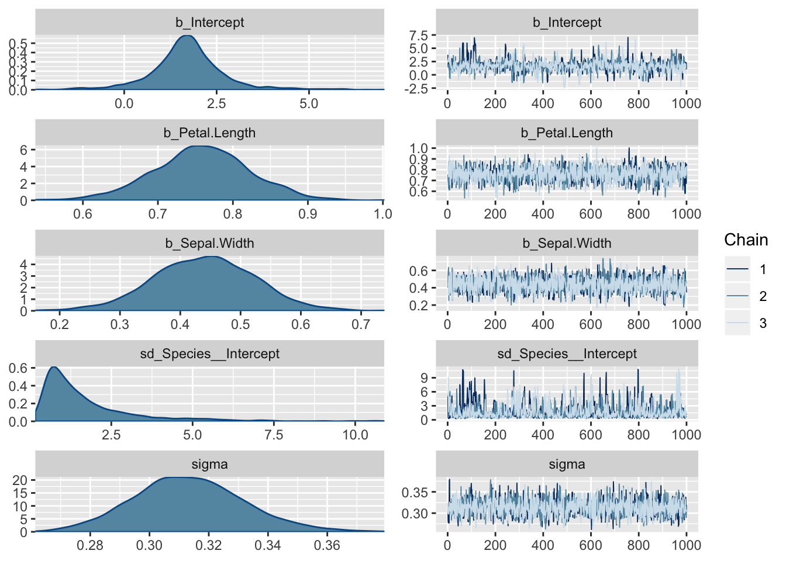

Siit on näha, et ahelad on ilusti konvergeerunud. Ühtlasi on pildil posterioorsed jaotused fititud koefitsientidele.

regular expressioni abil saab plottida mudeli madalama taseme ahelaid & posteerioreid, mida plot() vaikimisi ei näita.

```r
#regex works!
plot(m2, pars = "r_", theme = theme_dark())
```


Vaatame korrelatsioone erinevate parameetrite posterioorsete valimite vahel. (Markovi ahelad jooksevad n-mõõtmelises ruumis, kus n on mudeli parameetrite arv, mille väärtusi hinnatakse.)
pairs(m3) teeb pildi ära, aga ilusama pildi saab GGally::ggpairs() abil.


```r
pairs(m2, pars="b_")
```


```r
library(GGally)
posterior_samples(m2) %>%
  select(contains("b_")) %>%
  ggpairs()
```

Siin on posteeriorite põhjal arvutatud 50% ja 95% CI ja see plotitud.

```r
stanplot(m2, pars = "r_", type = "intervals")
```


type= argument sisestamine võimaldab plottida erinevaid diagnostilisi näitajaid. Lubatud sisendid on "hist", "dens", "hist_by_chain", "dens_overlay", "violin", "intervals", "areas", "acf", "acf_bar", "trace", "trace_highlight", "scatter", "rhat", "rhat_hist", "neff", "neff_hist" "nuts_acceptance", "nuts_divergence", "nuts_stepsize", "nuts_treedepth" ja "nuts_energy".


```r
stanplot(m2, type="neff")
```


Neff on efektiivne valimi suurus ja senikaua kuni Neff/N suhe ei ole < 0.1, pole põhjust selle pärast muretseda.

### korjame ahelad andmeraami ja plotime fititud koefitsiendid CI-dega


```r
model <- posterior_samples(m1) 
#model <- m1$fit %>% as.data.frame() 
##töötab samamoodi
```

mcmc_intervals() on bayesplot paketi funktsioon. me plotime 50% ja 95% CI-d.

```r
pars <- names(model)
mcmc_intervals(model, pars=pars[-length(pars)]) 
#with pars left out the last parameter lp_
```

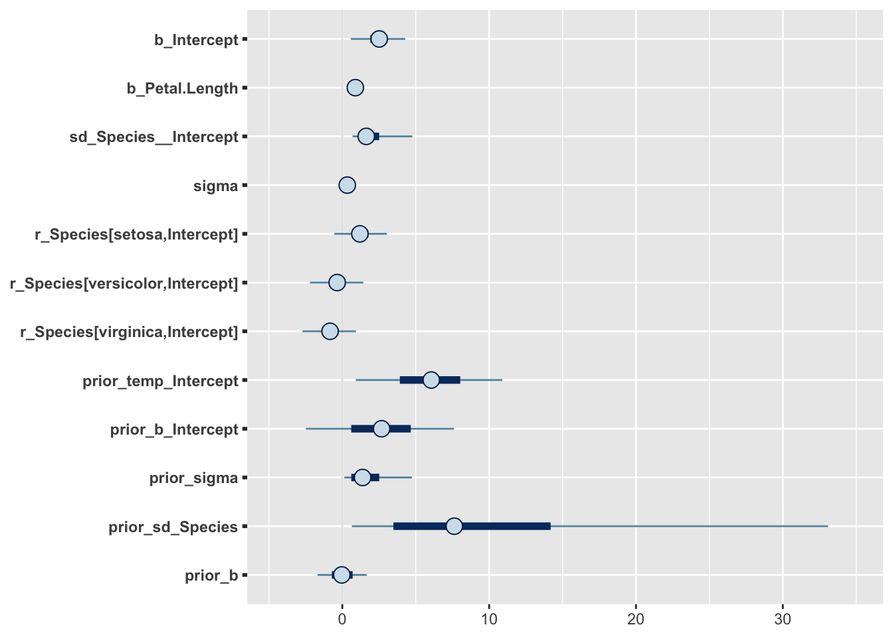

Näeme, et sigma hinnang on väga usaldusväärne, samas kui gruppide vahelise sd hinnang ei ole seda mitte (pane tähele posterioorse jaotuse ebasümmeetrilisust).


```r
model2 <- m2$fit %>% as.data.frame() 
pars <- names(model2)
mcmc_intervals(model2, pars=pars[-length(pars)])
mcmc_areas(model2,  pars=c("b_Petal.Length", "b_Sepal.Width"))
```


### bayesi versioon r-ruudust 

kui suurt osa koguvarieeruvusest suudavad mudeli prediktorid seletada?

```r
bayes_R2(m2)
#>    Estimate Est.Error Q2.5 Q97.5
#> R2     0.86   0.00831 0.84 0.873
```

```r
bayes_R2(m1)
#>    Estimate Est.Error  Q2.5 Q97.5
#> R2    0.833    0.0109 0.807  0.85
```

https://github.com/jgabry/bayes_R2/blob/master/bayes_R2.pdf
Annab põhjenduse sellele statistikule (mille arvutamine erineb tavalisest vähimruutudega arvutatud mudeli r2-st).

### plotime mudeli poolt ennustatud valimeid - posterior predictive check

Kui mudel suudab genereerida simuleeritud valimeid, mis ei erine väga palju empiirilisest valimist, mille põhjal see mudel fititi, siis võib-olla ei ole see täiesti ebaõnnestunud mudeldamine. See on loogika posterioorse ennustava ploti taga.


```r
gridExtra::grid.arrange(pp_check(m1), pp_check(m2), pp_check(m3), nrow = 3)
```

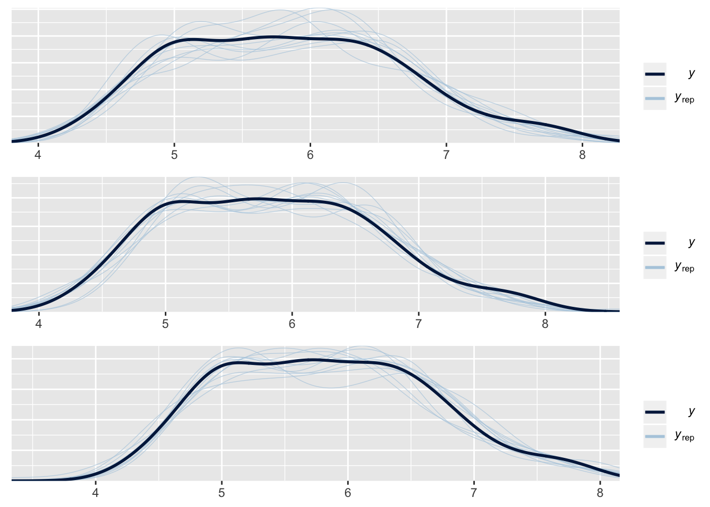

y - tihedusplot empiirilistest andmetest
y_rep - plotid mudeli poolt ennustatud iseseisvatest valimitest (igaüks sama suur kui empiiriline valim y) 
Jooniselt on näha, et m3 ennustused on võrreldes m1 ja m2-ga kõige kaugemal tegelikust valimist.

### plotime mudeli ennustusi - marginal effects plots

teeme ennustused

Kõigepealt ennustame ühe keskmise mudeliga, mis ei arvesta mitmetasemelise mudeli madalamte tasemete koefitsientidega.


```r
plot(marginal_effects(m2, effects= "Petal.Length", method = "predict", probs=c(0.1, 0.9)), points = TRUE,  theme = theme_bw())
```

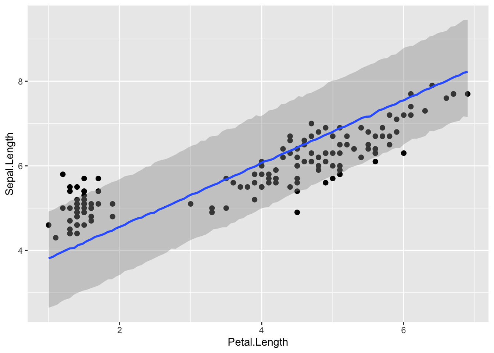


```r
marginal_effects(m2, effects= "Petal.Length", method = "predict", probs=c(0.1, 0.9))
```


Ennustus on selles mõttes ok, et vaid väike osa punkte jääb sellest välja, aga laiavõitu teine!

Nüüd ennustame sama mudeli põhjal igale liigile eraldi. Seega kasutame mudeli madalama taseme koefitsiente. peame andma lisaparameetri re_formula = NULL, mis tagab, et ennustuse tegemisel kasutatakse ka mudeli madalama taseme koefitsiente.

```r
conditions <- data.frame(Species =c("setosa", "virginica", "versicolor"))
plot(marginal_effects(m2, effects= "Petal.Length", method = "predict", conditions = conditions, probs=c(0.1, 0.9), re_formula = NULL), points = TRUE, theme = theme_bw())
```

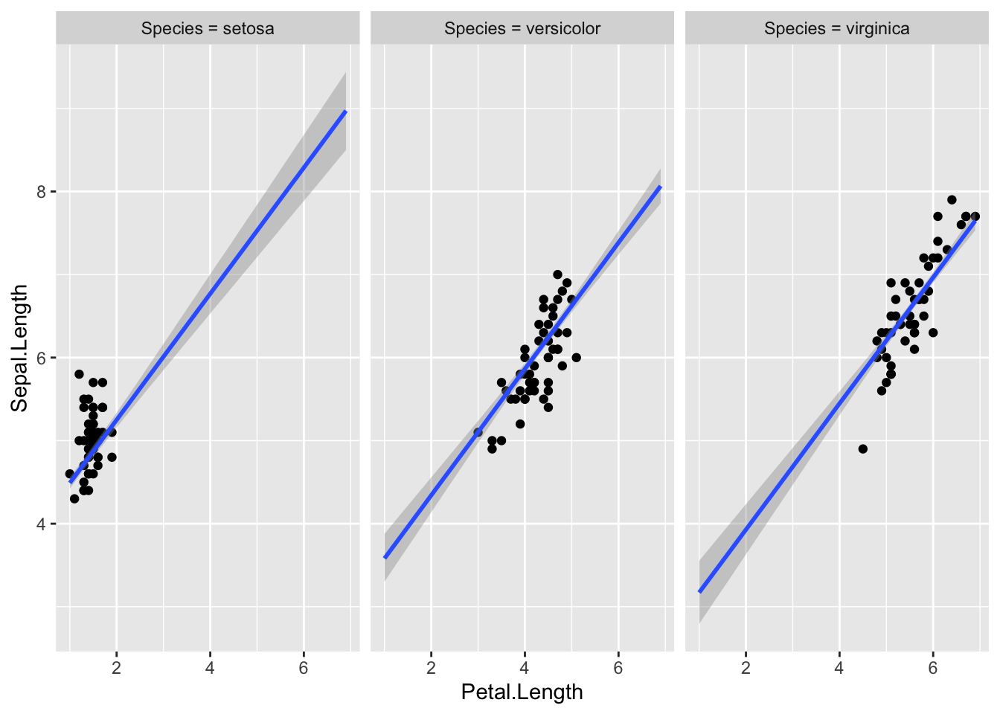


method = "predict" ennustab, millisesse vahemikku peaks mudeli järgi jääma 90% andmepunkte (k.a. uued andmepunktid, mida pole veel valimisse korjatud).

Tõesti, valdav enamus valimi punkte on intervallis sees, mis viitab et mudel töötab hästi. Seal, kus on rohkem punkte, on intervall kitsam (mudel on usaldusväärsem).

Järgneval pildil on method = "fitted". Nüüd on enamus punkte väljaspool usaldusintervalle, mis sellel pildil mõõdavad meie usaldust regressioonijoone vastu.


```r
conditions <- data.frame(Species =c("setosa", "virginica", "versicolor"))
plot(marginal_effects(m2, effects= "Petal.Length", method = "fitted", conditions = conditions, probs=c(0.1, 0.9), re_formula = NULL), points = TRUE, theme = theme_bw())
```


method = "fitted" annab CI regressioonijoonele.

argumendid: 

method - predict annab veapiirid (95% CI) mudeli ennustustustele andmepunkti tasemel. fitted annab veapiirid mudeli fitile endale (joonele, mis tähistab keskmist või kõige tõenäolisemat y muutuja väärtust igal x-i väärtusel)

conditions - andmeraam, kus on kirjas mudeli nendele ennustavatele (x) muutujatele omistatud väärtused, mida ei joonistata x teljele. Kuna meil on selleks mudeli madalama taseme muutuja Species, siis on lisaks vaja määrata argument *re_formula = NULL*, mis tagab, et ennustuste tegemisel kasutatakse mudeli kõikide tasemete fititud koefitsiente. re_formula = NA annab seevastu keskmise fiti üle kõigi gruppide (irise liikide)

probs annab usaldusintervalli piirid.

Pane tähele, et argumendid points ja theme kuuluvad plot(), mitte marginal_effects() funktsioonile.


tavaline interaktsioonimudel, aga pidevatele muutujatele.


```r
m5 <- brm(Sepal.Length~Petal.Length + Sepal.Width + Petal.Length*Sepal.Width, 
          data= iris, 
          prior = prior, 
          family = gaussian,
          warmup = 1000, 
          iter = 2000, 
          chains = 3,
          cores = 4,
          control = list(adapt_delta = 0.95))
write_rds(m5, path = "m5.fit")
```


```r
m5 <- read_rds("m5.fit")
```

Kõigepealt plotime mudeli ennustused, kuidas Sepal Length sõltub Petal Length-ist kolmel erineval Sepal width väärtusel. Ja siis sümmeetriliselt vastupidi.

```r
plot(marginal_effects(m5, 
                      effects = "Petal.Length:Sepal.Width"),
     points = T)
plot(marginal_effects(m5, 
                      effects = "Sepal.Width:Petal.Length"),
     points = T)
```

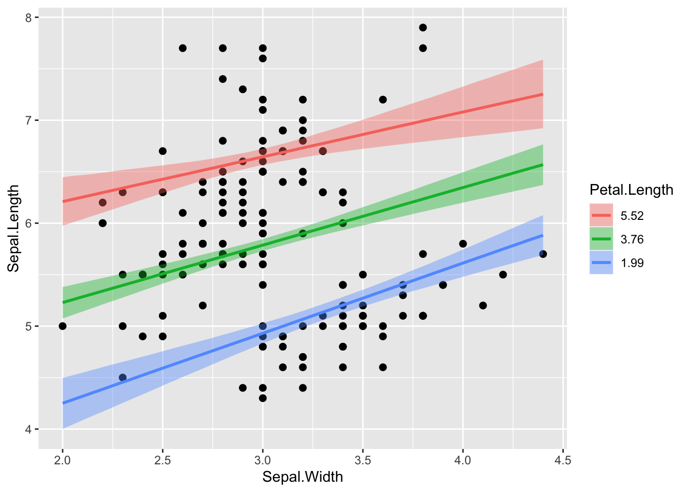

Siin lisame enda soovitud Sepal Width väärtused (5 ja 1.2), mis on väljaspool seda, mida loodus pakub. Pane tähele ennustuse laiu CI-sid.

```r
conditions <- data.frame(Sepal.Width = c(5, 1.2))
plot(marginal_effects(m5, effects = "Petal.Length", conditions = conditions, re_formula = NULL), points= TRUE)
```


### Alternatiivne tee:

Teeme tabeli nende väärtustega, millele tahame mudeli ennustusi. Tabelis newx on spetsifitseeritud mudeli kõikide X muutujate väärtused! Me ennustame Y väärtusi paljudel meie poolt võrdse vahemaaga ette antud petal length väärtustel, kusjuures me hoiame sepal width väärtuse alati konstantsena tema valimi keskmisel väärtusel ja vaatame ennustusi eraldi kahele liigile kolmest. Liigid on mudeli madala taseme osad, seega kasutame ennustuste tegemisel mudeli kõikide tasemete koefitsiente.


```r
newx <- expand.grid(Petal.Length = seq(min(iris$Petal.Length), 
                                       max(iris$Petal.Length), 
                                       length.out = 150),
                    Sepal.Width = mean(iris$Sepal.Width),
                    Species = c("setosa", "virginica")
                    )
```
expand.grid() lõõb tabeli pikaks nii, et kõik võimalikud kombinatsioonid 3st muutujast on täidetud väärtustega.


reformula NULL mudeldab eraldi liigid eraldi mudeli madalama taseme (liikide sees) koefitsiente kasutades

```r
predict_interval_brms2 <- predict(m2, newdata = newx, re_formula = NULL) %>%
  cbind(newx,.)
head(predict_interval_brms2)
#>   Petal.Length Sepal.Width Species Estimate Est.Error Q2.5 Q97.5
#> 1         1.00        3.06  setosa     4.49     0.319 3.86  5.13
#> 2         1.04        3.06  setosa     4.51     0.316 3.88  5.14
#> 3         1.08        3.06  setosa     4.56     0.317 3.94  5.19
#> 4         1.12        3.06  setosa     4.59     0.317 3.95  5.20
#> 5         1.16        3.06  setosa     4.61     0.315 4.01  5.21
#> 6         1.20        3.06  setosa     4.64     0.317 4.01  5.25
```

predict() ennustab uusi petal length väärtusi (Estimate veerg) koos usaldusinetrvalliga neile väärtustele

Siin siis eraldi ennustused kahele liigile kolmest, kaasa arvatud petal length väärtusvahemikule, kus selle liigi isendeid valimis ei ole (ja võib-olla ei saagi olla) 

```r
iris1 <- iris %>% filter(Species != "versicolor")
ggplot(data = predict_interval_brms2, aes(x = Petal.Length, y = Estimate)) +
  geom_point(data= iris1, aes(Petal.Length, Sepal.Length, color=Species)) +
  geom_line(aes(color = Species)) +
  geom_ribbon(aes(ymin = Q2.5, ymax = Q97.5, fill = Species), alpha = .1, colour = NA) +
  scale_color_brewer(palette = 'Set1') +
  ggthemes::theme_tufte()
```


Ennustav plot - kuidas lähevad kokku mudeli ennustused reaalsete y-i andmepunktidega

```r
pr <- predict(m2) %>% cbind(iris)

ggplot(pr, aes(Sepal.Length, Estimate, color=Species))+
  geom_pointrange(aes(ymin = Q2.5, ymax = Q97.5), alpha=0.5, size=0.2) +
  geom_abline(intercept = 0, slope = 1, lty = 2) +
  coord_cartesian( xlim=c( 4, 8 ), ylim=c( 4, 8 ))+
  ggthemes::theme_tufte()
```


Igae andmepunktile - kui palju erineb selle residuaal 0-st - st kui hästi ennustab mudel just seda andmepunkti. Ruumi kokkuhoiuks plotime välja ainult irise esimele 50-le andmepunktile.

```r
re <- residuals(m2) %>% cbind(iris)
re$indeks <- 1:nrow(re)

ggplot(re[1:50,], aes(x = Estimate, y = reorder(indeks, Estimate))) +
  geom_vline(xintercept = 0, lty = 2) +
  geom_point(size=1) +
  geom_errorbarh(aes(xmin = Q2.5, xmax = Q97.5), color = "red", size =0.2) +
  theme(text = element_text(size = 7), axis.title.y = element_blank())+
  xlab("residuals (95 CI)")
```


Ok, isendid nr 15 ja 37 paistavad olema palju väiksema Sepal Lengthiga kui mudel ennustab. Võib küsida, miks?

Nüüd plotime usaldusintervalli mudeli fitile (**keskmisele** Y väärtusele igal määratud X-i väärtusel), mitte Y- ennustusele andmepunkti kaupa. Selleks on hea fitted() funktsioon. Me ennustame m2 mudelist vastavalt newdata parameetriväärtustele. Kui me newdata argumendi tühjaks jätame, siis võtab fitted() selleks automaatselt algse iris tabeli (ehk valimi väärtused). 


```r
predict_interval_brms2f <- fitted(m2, newdata = newx, re_formula = NULL) %>%
  cbind(newx,.)
head(predict_interval_brms2f)
#>   Petal.Length Sepal.Width Species Estimate Est.Error Q2.5 Q97.5
#> 1         1.00        3.06  setosa     4.49    0.0542 4.38  4.59
#> 2         1.04        3.06  setosa     4.52    0.0535 4.41  4.62
#> 3         1.08        3.06  setosa     4.55    0.0529 4.45  4.65
#> 4         1.12        3.06  setosa     4.58    0.0524 4.48  4.68
#> 5         1.16        3.06  setosa     4.61    0.0520 4.51  4.71
#> 6         1.20        3.06  setosa     4.64    0.0518 4.54  4.74
```

```r
ggplot(data = predict_interval_brms2f, aes(x = Petal.Length, y = Estimate, color = Species)) +
  geom_point(data= iris1, aes(Petal.Length, Sepal.Length, color=Species)) +
  geom_line() +
  geom_ribbon(aes(ymin = Q2.5, ymax = Q97.5, fill = Species), alpha = .1, colour = NA) +
  scale_x_continuous(breaks = 0:10) +
  theme(panel.grid.minor = element_blank()) +
  scale_color_brewer(palette = 'Set1')+
  ggthemes::theme_tufte()
```

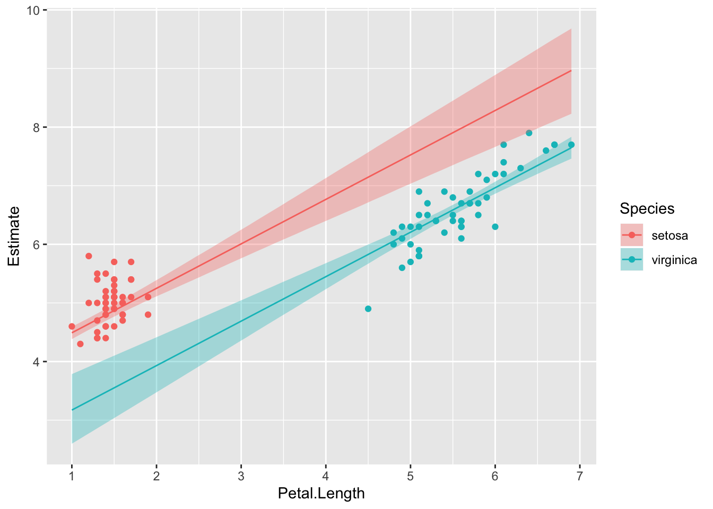

 **mudeli genereeritud andmed ja valimiandmed mõõtmisobjekti (subjekti e taimeisendi) kaupa**. See on sisuliselt posterior predictive plot (vt eespool). 


```r
predict_subjects_brms <- predict(m2) %>% cbind(iris, .)
#ennustame andmeid igale taimele vastavate parameetriväärtustega 
#ja paneme ennustused kokku algse irise tabeliga
```

predict() arvutab mudeli põhjal uusi Y muutuja andmepunkte. Võib kasutada ka väljamõeldud andmete pealt Y väärtuste ennustamiseks (selleks tuleb anda ette andmeraam kõigi X-muutujate väärtustega, mille pealt tahetakse ennustusi).

tugevalt värvitud punktid on ennustused ja läbipastvad punktid on valimiandmed

```r
ggplot(data = predict_subjects_brms, aes(Petal.Length, Estimate, color = Species)) +
  geom_point(aes(Petal.Length, Estimate), alpha = .8)+
  geom_point(data = iris, aes(Petal.Length, Sepal.Length), alpha = .3)+
  ggthemes::theme_tufte()
```


**Alternatiiv - ansambliennustus**

Kuna meil on 2 mudelit, m2 ja m3, mis on pea võrdselt eelistatud, siis genreerime ennustused mõlemast (mudelite ansamblist) proportsionaalselt nende waic skooridega. See ennustus kajastab meie mudeldamistööd tervikuna, mitte ühte "parimat" mudelit ja seega võib loota, et annab paremini edasi meie mudeldamises peituvat ebakindlust.

```r
pp_a <- pp_average(m2, m3, weights = "waic", method = "predict") %>%
  as_tibble() %>% 
  bind_cols(iris) 
ggplot(data = pp_a, aes(Petal.Length, Estimate, color = Species)) +
  geom_point(aes(Petal.Length, Estimate), alpha = .8)+
  geom_point(data = iris, aes(Petal.Length, Sepal.Length), alpha = .3)+
  ggthemes::theme_tufte()
```

## mudeli eelduste kontroll

Pareto k otsib nn mõjukaid (influential) andmepunkte. 

```r
loo_m2 <- loo(m2)
plot(loo_m2)
```

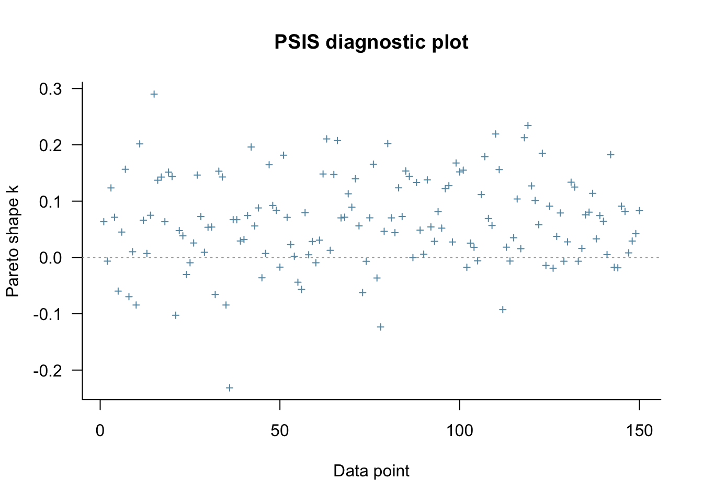

Kui paljud andmepunktid on kahtlaselt mõjukad?

```r
loo::pareto_k_table(loo_m2) 
#> 
#> All Pareto k estimates are good (k < 0.5).
```


### plotime residuaalid

resid() annab residuaalid vektorina. 
**Kõigepealt plotime residuaalid fititud (keskmiste) Y väärtuste vastu.**

```r
resid <-  resid(m2, type = "pearson")[, "Estimate"]
fit <-  fitted(m2)[, "Estimate"]
ggplot() + geom_point(data = NULL, aes(y = resid, x = fit)) + geom_hline(yintercept=0, lty=2)
```


Residuals vs fitted plot testib lineaarsuse eeldust - kui .resid punktid jaotuvad ühtlaselt nulli ümber, siis mudel püüab kinni kogu süstemaatilise varieeruvuse teie andmetest ja see mis üle jääb on juhuslik varieeruvus.

**vaatame diagnostilist plotti autokorrelatsioonist residuaalide vahel.**

```r
plot(acf(resid))
```


Residuaalide autokorrelatsioonid on madalad - seega kõik paistab OK ja andmepunktide sõltumatus on tagatud.

**siin on residuaalide histogramm**

```r
ggplot(data = NULL, aes(resid)) + geom_density(fill="lightgrey") + geom_vline(xintercept = median(resid), linetype ="dashed")+ theme_classic()
```

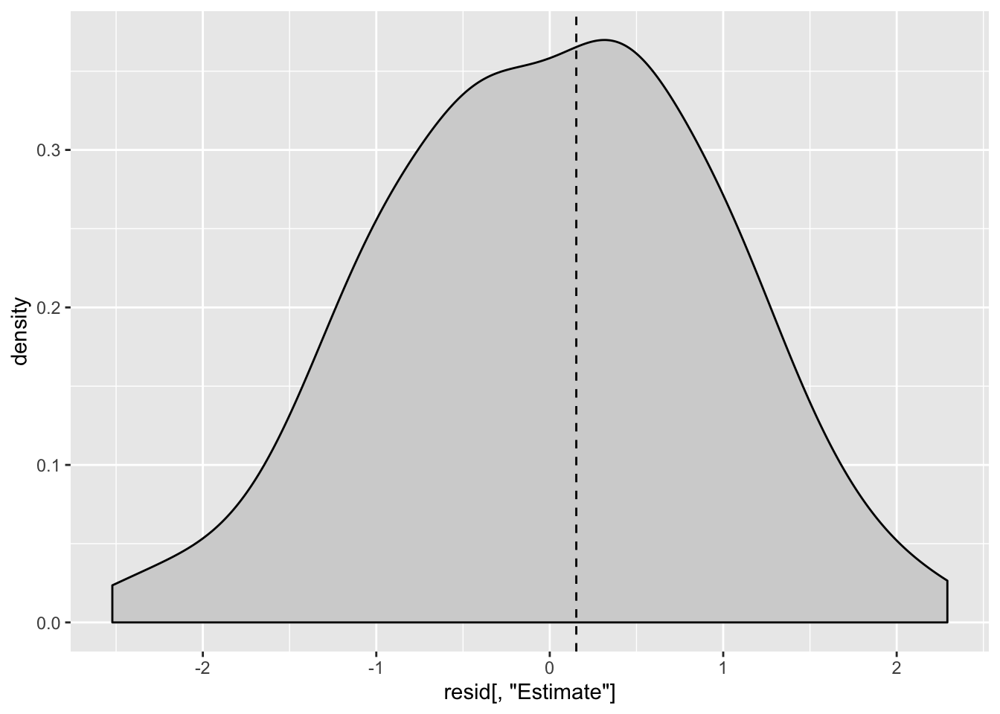

Residuaalid on sümmeetrilise jaotusega ja meedian residuaal on peaaegu null. See on kõik hea.

**Ja lõpuks plotime residuaalid kõigi x-muutujate vastu:**

Kõigepealt ühendame resid vektori irise tabeliga, et oleks mugavam plottida, seejärel tekitame uue veeru st_resid e studentiseeritud residuaalid, mis on sd ühikutes.

residuaalid standardhälbe ühikutes (nn Studentiseeritud residuaalid) saab ja ka tuleks plottida kõigi x-muutujate suhtes.

```r
iris2 <- iris %>% cbind(resid) %>% mutate(st_resid= resid/sd(resid))
ggplot(iris2, aes(Petal.Length, st_resid, color=Species))+ 
  geom_point() +
  geom_hline(yintercept = 0, linetype = "dashed") + 
  ggthemes::theme_tufte()
```

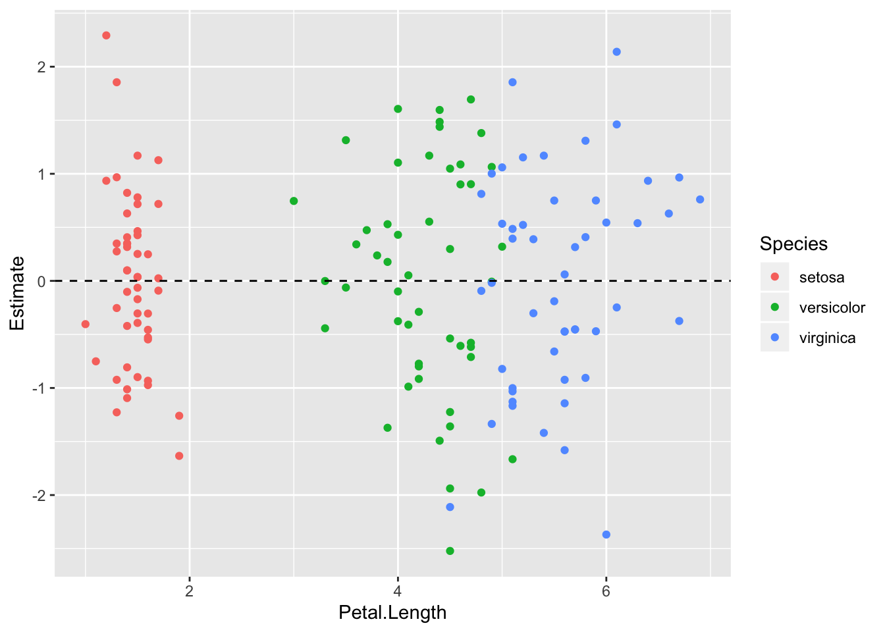

Pole paha, mudel ennustab hästi, aga mõne punkti jaoks on ennustus 2 sd kaugusel.


```r
ggplot(iris2, aes(Sepal.Width, st_resid, color=Species))+ 
  geom_point() +
  geom_hline(yintercept = 0, linetype = "dashed") + 
  ggthemes::theme_tufte()
```

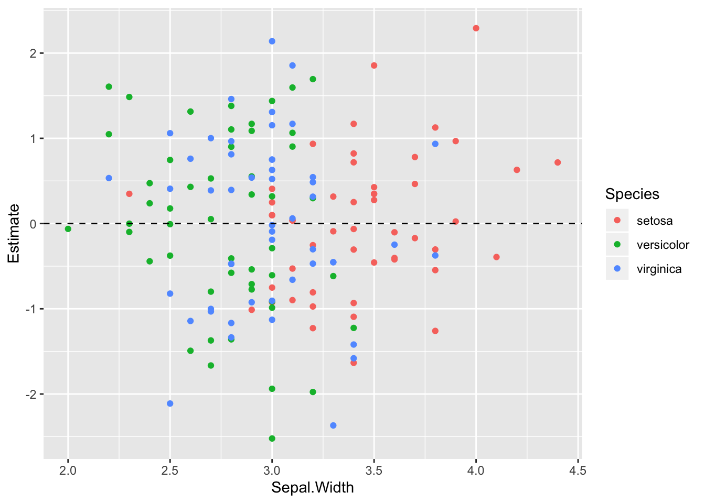


```r
ggplot(iris2, aes(Species, st_resid)) + geom_boxplot() +
  geom_hline(yintercept = 0, linetype = "dashed") +
  geom_jitter(width = 0.1, size=0.4)+
  ggthemes::theme_tufte()
```

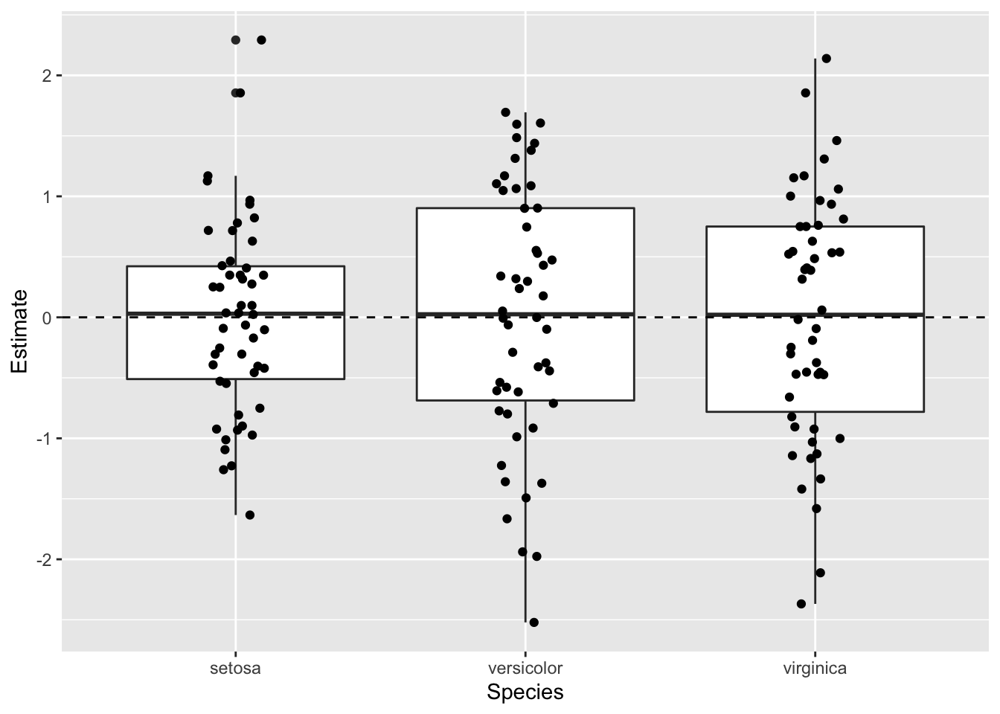

# Brms mudelid

## Robustne lineaarne regressioon

Kasutame dnorm likelihoodi asemel studenti t jaotust. Selle jaotuse õlad on reguleeritavalt kõrgemad ja nende alla mahuvad paremini outlierid. Õlgade kõrgust reguleerib parameeter nu (1 - Inf), mille väiksemad väärtused (alla 10) annavad laiad õlad ja kaitse outlierite vastu. Me anname nu-le gamma priori. Sellel prioril on omakorda 2 parameetrit, shape ja scale Kui fikseerime shape = 4 ja scale = 1, siis saame kitsa priori, mis eelistab nu väärtusi, mis soosivad laiu õlgu ja robustset regressiooni.


```r
x = seq(from = 0, to = 20, by = .1)
y = dgamma(x, shape= 4, scale = 1)
plot(y~x)
```


```r
get_prior(Sepal.Length~Petal.Length, 
          data= iris, 
          family = "student")
#>                 prior     class         coef group resp dpar nlpar bound
#> 1                             b                                         
#> 2                             b Petal.Length                            
#> 3 student_t(3, 6, 10) Intercept                                         
#> 4       gamma(2, 0.1)        nu                                         
#> 5 student_t(3, 0, 10)     sigma
```


```r
prior <- c(prior(gamma(4,1), class="nu"))
```

robust_m1 on studenti likelihoodiga, mille õlad määratakse adaptiivselt andmete poolt.
robust_m2-s anname õlgade laiuse ette ja robust_m3 on mitte-robustne kontroll tavalise normaalse likelihoodiga.

```r
robust_m1 <- brm(Sepal.Length~Petal.Length, 
          data= iris, 
          family = "student",
          prior = prior, 
          chains = 3,
          cores = 3)
robust_m2 <- brm(
          data= iris, 
          family = student,
          bf(Sepal.Length~Petal.Length, nu = 4),
          prior = c(prior(normal(0, 100), class = Intercept),
                prior(normal(0, 10),  class = b),
                prior(student_t(5, 0, 5),   class = sigma)),
          chains = 3,
          cores = 3)

robust_m3 <- brm(Sepal.Length~Petal.Length, 
          data= iris, 
          family = "gaussian",
          chains = 3,
          cores = 3)
write_rds(robust_m1, path = "robust_m1.fit")
write_rds(robust_m2, path = "robust_m2.fit")
write_rds(robust_m3, path = "robust_m3.fit")
```


```r
b_estimates <- bind_rows(tidy(robust_m1), 
                         tidy(robust_m2), 
                         tidy(robust_m3), .id= "model_nr") 
b1 <- b_estimates %>% filter(str_detect(term, "b_P") ) %>%   
ggplot(aes(model_nr, estimate))+
  geom_pointrange(aes(ymin=lower, ymax=upper))+ 
  coord_flip()+ labs(x="Model nr", title ="slopes")
b2 <- b_estimates %>% filter(str_detect(term, "b_I") ) %>%    
ggplot(aes(model_nr, estimate))+
  geom_pointrange(aes(ymin=lower, ymax=upper))+ 
  coord_flip()+ labs(x=NULL, title ="intercepts")
gridExtra::grid.arrange(b1, b2, nrow = 1)
```


Kolme mudeli interceptid ja sloped on sisuliselt võrdsed ja sama täpsusega hinnatud. Seega ei tee robustne mudel vähemal halba, kui meil on enam-vähem normaalsed andmed.

Proovime ka robuststet versiooni 2 grupi võrdlusest (vastab t testile, kus kahe grupi sd-d hinnatakse eraldi)

```r
ir1 <- iris %>% filter(Species != "versicolor")
ir1$Species <- as.factor(ir1$Species) %>% fct_drop() 
```


```r
get_prior(bf(Sepal.Length~Species, sigma ~ Species), 
            data = ir1, family = "student")
#>                 prior     class             coef group resp  dpar nlpar
#> 1                             b                                        
#> 2                             b Speciesvirginica                       
#> 3 student_t(3, 6, 10) Intercept                                        
#> 4       gamma(2, 0.1)        nu                                        
#> 5                             b                             sigma      
#> 6                             b Speciesvirginica            sigma      
#> 7 student_t(3, 0, 10) Intercept                             sigma      
#>   bound
#> 1      
#> 2      
#> 3      
#> 4      
#> 5      
#> 6      
#> 7
```


```r
prior <- c(prior(gamma(4,1), class= "nu"),
           prior(normal(0, 4), class= "b"))
```


```r
robust_t_test1 <- brm(bf(Sepal.Length~Species, sigma ~ Species), 
            data = ir1, prior = prior, family = "student")
write_rds(robust_t_test1, path = "robust_t_test1.fit")
```


```r
tidy(robust_t_test1)
#>                       term estimate std.error   lower   upper
#> 1              b_Intercept    5.002    0.0505   4.916   5.086
#> 2        b_sigma_Intercept   -1.175    0.1281  -1.383  -0.970
#> 3       b_Speciesvirginica    1.557    0.1032   1.387   1.726
#> 4 b_sigma_Speciesvirginica    0.577    0.1694   0.298   0.846
#> 5                       nu    6.113    2.0334   3.337   9.874
#> 6                     lp__  -79.991    1.5766 -82.954 -78.063
```

b_Intercept on hinnang 1. grupi keskväärtusele (algses skaalas)

b_Speciesvirginica on hinnag efekti suurusele, ehk 2. grupi erinevusest esimesest grupist (algses skaalas)

b_Intercept + b_Speciesvirginica annab 2. grupi keskväärtuse.

b_sigma_Intercept on naturaallogaritm 1. grupi sd-st.

b_sigma_Speciesvirginica on logaritm 2. grupi (I. virginica) sd erinevusest esimesest grupist (ehk efekti suurus).

**Seega saab algses skaalas sd-d nii:** 

exp(b_sigma_Intercept) = 1. grupi sd

exp(b_sigma_Intercept) + exp(b_sigma_Speciesvirginica) = 2. grupi sd

exp(b_sigma_Speciesvirginica) = sd-de erinevus

Nii arvutame 2. grupi keskväärtuse posteeriori

```r
r_1_df <- posterior_samples(robust_t_test1)
mean_2.gr <- r_1_df$b_Intercept + r_1_df$b_Speciesvirginica
ggplot(data = NULL) + geom_density(aes(mean_2.gr))
```


Nii saab tekitada usaldusinetvalle, mis katavad 90% jaotuse alusest kõrgeimast tihedusest (mis ei ole päris sama, mis kvantiilide meetod) 

```r
rethinking::HPDI(mean_2.gr, prob = 0.9)
#> |0.9 0.9| 
#>  6.4  6.7
```

Nii saame teada, milline osa (fraktsioon) posteeriorist on väiksem kui 6.4

```r
mean(mean_2.gr < 6.4)
#> [1] 0.0372
```

Asendades eelnevas koodis 6.4 nulliga saame bayesi versiooni ühepoolsest p väärtusest hüpoteesile, et teise grupi keskväärtus on null.

Avaldame posteeriori 2. grupi sd-e

```r
sd_2.gr <- exp(r_1_df$b_sigma_Intercept) + exp(r_1_df$b_sigma_Speciesvirginica)
ggplot(data = NULL) + geom_density(aes(sd_2.gr))
```


On tavaline, et sd-de posteeriorid ei ole normaaljaotusega (selle kohta vaata lähemalt Statistical Rethinking raamatust).


```r
t.test(Sepal.Length~Species, data=ir1)
#> 
#> 	Welch Two Sample t-test
#> 
#> data:  Sepal.Length by Species
#> t = -20, df = 80, p-value <2e-16
#> alternative hypothesis: true difference in means is not equal to 0
#> 95 percent confidence interval:
#>  -1.79 -1.38
#> sample estimates:
#>    mean in group setosa mean in group virginica 
#>                    5.01                    6.59
```

Klassikalise t testi efekti suuruse CI on 1.38 ... 1.79
robustse t testi oma on 1.39 ... 1.73

Simuleerime siis ühe tõsiste outlieritega andmestiku, et vaadata kas meil õnnestub päästa efekt statistilise mitteolulisuse õnnetust saatusest. Meil on a grupis 30 andmepunkti normaaljaotusest mu = 0, sd = 1 ja b grupis 25 andmepunkti normaaljaotusest mu = 1, sd = 1.5, pluss 5 andmepunkti, mis mängivad outliereid.

```r
set.seed(123)
df1 <- tibble(a=rnorm(30), b= c(rnorm(25, 1, 1.5), 4.3, 5.3, 7, -8.1, -17)) %>% gather()
ggplot(df1, aes(value, fill=key)) + geom_histogram(alpha = 0.7, position = "identity")
```


```r
robust_t_test2 <- brm(bf(value~key, sigma ~ key), 
            data = df1, family = "student", prior= prior(gamma(4,1), class= "nu"))
write_rds(robust_t_test2, path = "robust_t_test2.fit")
```


```r
tidy(robust_t_test2)
#>                term  estimate std.error    lower     upper
#> 1       b_Intercept   -0.0961     0.188   -0.410    0.2049
#> 2 b_sigma_Intercept   -0.2372     0.192   -0.557    0.0689
#> 3            b_keyb    1.4340     0.405    0.776    2.0979
#> 4      b_sigma_keyb    0.6312     0.287    0.164    1.0979
#> 5                nu    2.8096     0.952    1.585    4.6058
#> 6              lp__ -124.5835     1.718 -128.006 -122.5280
```


```r
t.test(value~key, data=df1)
#> 
#> 	Welch Two Sample t-test
#> 
#> data:  value by key
#> t = -1, df = 30, p-value = 0.3
#> alternative hypothesis: true difference in means is not equal to 0
#> 95 percent confidence interval:
#>  -2.417  0.777
#> sample estimates:
#> mean in group a mean in group b 
#>         -0.0471          0.7729
```

Nüüd kus meil on outlieritega andmed, annab klassikaline t test efekti suurusele CI -2.41 ... 0.78 (p = 0.3), aga robustne t test leiab efekti üles - CI 0.78 ... 2.10 [tegelik ES oleks 1, outliereid arvestamata]. 

Kui tavaline t test annab välja kahe grupi keskmised, usaldusintervalli nende erinevusele (ehk ES-le) ja p väärtuse, siis bayesi variant annab välja 2 grupi keskväärtused, 2 grupi varieeruvused andmepunktide tasemel ning kõik efekti suurused ja hüpoteesitestid, millest te suudate unistada. Selle külluse põhjus on, et hinnang iga parameeteri väärtusele tuleb meile posteeriori ehk tõenäosusjaotuse kujul. Kuna iga posteerior on meil arvutis olemas kui arvuline vektor, ja teatavasti saab vektoritega teha aritmeetilisi tehteid, siis saab ka posteerioreid omavahel liita, lahutada, astendada jms. Teoreetiliselt sisaldab posteerior kogu infot, mis meil vastava parameetri väärtuse kohta on. Me ei vaja midagi enamat, et teha kõiki järeldusi, mida me selle parameetri väärtuse kohta üldse teha saame. Seetõttu on bayesi versioon mitte ainult palju paindlikum kui tavaline t test, vaid selle output on ka hästi palju informatiivsem.

Igaks juhuks tuletame meelde, et tavaline t test (küll versioonis, kus võrreldavate gruppide varieeruvused on eeldatud olema identsed) on ekvivalentne lineaarse regressiooniga, mille siin fitime vähimruutude meetodiga. (Väheinformatiivsete prioritega bayesi versioon normaaljaotuse likelihoodiga annaks sellega väga sarnase fiti.)


```r
lm1 <- lm(value~key, data=df1)
tidy(lm1)
#> # A tibble: 2 x 5
#>   term        estimate std.error statistic p.value
#>   <chr>          <dbl>     <dbl>     <dbl>   <dbl>
#> 1 (Intercept)  -0.0471     0.554   -0.0850   0.933
#> 2 keyb          0.820      0.784    1.05     0.300
```
p = 0.2999252 ongi vastava t testi põhiväljund.


### puuduvate andmete imputatsioon

Regressioonimudelite fittimisel kasutatakse ainult vaatlusi, kus esinevad väärtused kõigis mudelisse pandud muutujates. Seega, kui meil on palju muutujaid, milles igaühes puuduvad juhuslikult mõned väärtused, siis kaotame kokkuvõttes enamuse oma valimist. Aitab puuduvate andmete imputatsioon, mis tegelikult tähendab, et me fitime iga puuduvaid andmeid sisaldava muutuja eraldi regressioonimudelis kõigi teiste muutujate vastu. 

Eriti vajalik, kui andmed ei puudu juhuslikult!

Viskame irise andmestiku kahest tulbast välja 1/4 andmepunkte, aga mitte juhuslikult vaid kõik madalamad väärtused. Selline suunatud tegevus kallutab (ehk suunab kindlas suunas) oluliselt mudeldamise tulemusi

```r
iris_na <- iris
quantile(iris_na$Petal.Length)
#>   0%  25%  50%  75% 100% 
#> 1.00 1.60 4.35 5.10 6.90
iris_na$Sepal.Length[iris_na$Sepal.Length < 5] <- NA
iris_na$Petal.Length[iris_na$Petal.Length < 1.6] <- NA
```


```r
lm(iris$Petal.Length~iris$Sepal.Length) %>% tidy()
#> # A tibble: 2 x 5
#>   term              estimate std.error statistic  p.value
#>   <chr>                <dbl>     <dbl>     <dbl>    <dbl>
#> 1 (Intercept)          -7.10    0.507      -14.0 6.13e-29
#> 2 iris$Sepal.Length     1.86    0.0859      21.6 1.04e-47
```


```r
lm(iris_na$Petal.Length~iris_na$Sepal.Length) %>% tidy()
#> # A tibble: 2 x 5
#>   term                 estimate std.error statistic  p.value
#>   <chr>                   <dbl>     <dbl>     <dbl>    <dbl>
#> 1 (Intercept)             -4.19    0.609      -6.89 4.33e-10
#> 2 iris_na$Sepal.Length     1.43    0.0976     14.6  4.53e-27
```

imputeerime enne mudeli fittimist kasutades multiple imputation meetodit mice paketist. Siin imputeerime iga puuduva väärtuse kasutades kõigi teiste parameetrite väärtusi, ja me teeme seda 5 korda.


```r
library(mice)
imp <- mice(iris_na, m = 5, print = FALSE)
```

Meil on nüüd 5 imputeeritud andmesetti. Me saadame need kõik brms-i.

>Siin kasutame mice() tema vaikeväärtustel, kuid mice pakett on tegelikult vägagi rikkalik imputatsioonimasin, mille helpi ja tutoorialeid tuleks kindlasti enne lugeda, kui oma andmeid imputeerima asuda. Lisaks, see raamat on tervenisti pühendatud imputatsioonile: https://stefvanbuuren.name/fimd/


```r
iris_imp1 <- brm_multiple(Petal.Length~Sepal.Length, data = imp)
write_rds(iris_imp1, path = "iris_imp1.fit")
```


Saame tavalise fitiobjekti, kus on 5 alammudeli posterioorid. Kõik juba koos.

```r
tidy(iris_imp1)[1:2,]
#>             term estimate std.error lower upper
#> 1    b_Intercept    -7.69    0.5543  -8.6 -6.79
#> 2 b_Sepal.Length     1.95    0.0929   1.8  2.10
```

Tõepoolest, süstemaatiliselt rikutud andmetest on imutatsiooni abil võimalik täitsa head ennustust tagasi saada!!!

## imputatsioon otse brms-is

See töötab küll irise peal halvemini kui mice!


```r
bform <- bf(Petal.Length | mi() ~ mi(Sepal.Length)) + 
  bf(Sepal.Length | mi() ~ Sepal.Width + Petal.Width + Species + mi(Petal.Length)) + set_rescor(FALSE)
iris_imp2 <- brm(bform, data = iris_na)
write_rds(iris_imp2, path = "iris_imp2.fit")
```


```r
bform <- bf(Petal.Length | mi() ~ mi(Sepal.Length)) + 
  bf(Sepal.Length | mi() ~ Species) + set_rescor(FALSE)
iris_imp3 <- brm(bform, data = iris_na)
write_rds(iris_imp3, path = "iris_imp3.fit")
```


```r
tidy(iris_imp2)
#>                               term  estimate std.error     lower     upper
#> 1          b_PetalLength_Intercept   -5.5690  4.92e-01    -6.204 -4.81e+00
#> 2          b_SepalLength_Intercept    2.6008  3.26e-01     2.115  3.12e+00
#> 3        b_SepalLength_Sepal.Width    0.3074  8.55e-02     0.164  4.30e-01
#> 4        b_SepalLength_Petal.Width    0.0679  1.52e-01    -0.130  3.33e-01
#> 5  b_SepalLength_Speciesversicolor   -0.2201  1.59e-01    -0.482  1.72e-02
#> 6   b_SepalLength_Speciesvirginica   -0.4502  2.32e-01    -0.856 -9.37e-02
#> 7   bsp_PetalLength_miSepal.Length    1.6355  8.26e-02     1.509  1.74e+00
#> 8   bsp_SepalLength_miPetal.Length    0.6130  3.13e-02     0.576  6.63e-01
#> 9                sigma_PetalLength    0.6527  4.04e-02     0.599  7.22e-01
#> 10               sigma_SepalLength    0.3325  1.35e-02     0.309  3.53e-01
#> 11              Ymi_PetalLength[1]    2.5171  3.47e-01     2.006  3.08e+00
#> 12              Ymi_PetalLength[2] -432.9218  1.39e+03 -3058.912  8.54e+02
#> 13              Ymi_PetalLength[3] -996.6434  1.42e+03 -4056.104  1.16e+02
#> 14              Ymi_PetalLength[4] 1510.4882  1.42e+03  -295.164  3.59e+03
#> 15              Ymi_PetalLength[5]    2.2171  3.65e-01     1.658  2.78e+00
#> 16              Ymi_PetalLength[7] 4136.6840  5.31e+03 -1684.596  1.41e+04
#> 17              Ymi_PetalLength[8]    2.1674  3.67e-01     1.673  2.77e+00
#> 18              Ymi_PetalLength[9]  172.4278  8.99e+02  -963.060  2.21e+03
#> 19             Ymi_PetalLength[10] 1157.3398  9.74e+02  -503.254  2.82e+03
#> 20             Ymi_PetalLength[11]    3.2050  3.12e-01     2.689  3.67e+00
#> 21             Ymi_PetalLength[13]  571.3848  1.11e+03  -644.225  2.81e+03
#> 22             Ymi_PetalLength[14]  265.7601  6.34e+02  -440.222  1.47e+03
#> 23             Ymi_PetalLength[15]    3.3153  3.90e-01     2.681  3.93e+00
#> 24             Ymi_PetalLength[16]    3.0418  4.40e-01     2.216  3.69e+00
#> 25             Ymi_PetalLength[17]    3.0307  3.64e-01     2.566  3.74e+00
#> 26             Ymi_PetalLength[18]    2.5185  3.97e-01     1.782  3.12e+00
#> 27             Ymi_PetalLength[20]    2.2725  4.03e-01     1.530  2.86e+00
#> 28             Ymi_PetalLength[22]    2.4953  3.96e-01     1.890  3.13e+00
#> 29             Ymi_PetalLength[23] -153.9356  2.05e+03 -3859.651  2.09e+03
#> 30             Ymi_PetalLength[28]    2.7134  4.40e-01     2.014  3.39e+00
#> 31             Ymi_PetalLength[29]    2.7003  4.45e-01     1.989  3.48e+00
#> 32             Ymi_PetalLength[32]    2.9400  3.63e-01     2.379  3.58e+00
#> 33             Ymi_PetalLength[33]    2.5132  4.26e-01     1.847  3.28e+00
#> 34             Ymi_PetalLength[34]    2.8653  3.28e-01     2.375  3.41e+00
#> 35             Ymi_PetalLength[35]  315.7272  1.31e+03 -1101.428  2.84e+03
#> 36             Ymi_PetalLength[36]    2.5777  3.37e-01     1.976  3.08e+00
#> 37             Ymi_PetalLength[37]    3.2112  3.88e-01     2.574  3.80e+00
#> 38             Ymi_PetalLength[38] -113.1557  5.45e+02 -1429.359  5.01e+02
#> 39             Ymi_PetalLength[39] -122.0110  1.87e+03 -4121.989  2.67e+03
#> 40             Ymi_PetalLength[40]    2.5490  3.25e-01     2.031  3.05e+00
#> 41             Ymi_PetalLength[41]    2.3217  4.26e-01     1.650  3.08e+00
#> 42             Ymi_PetalLength[42]  -10.1840  2.22e+02  -311.454  4.23e+02
#> 43             Ymi_PetalLength[43] -847.8219  1.13e+03 -2960.030  6.47e+02
#> 44             Ymi_PetalLength[46] -163.4421  7.83e+02 -1370.487  9.39e+02
#> 45             Ymi_PetalLength[48] 2292.4104  5.66e+03 -4695.643  1.20e+04
#> 46             Ymi_PetalLength[49]    2.5764  4.47e-01     1.862  3.29e+00
#> 47             Ymi_PetalLength[50]    2.4020  3.81e-01     1.687  2.97e+00
#> 48              Ymi_SepalLength[2] -266.8168  8.70e+02 -1892.662  5.63e+02
#> 49              Ymi_SepalLength[3] -639.3507  9.37e+02 -2636.029  7.14e+01
#> 50              Ymi_SepalLength[4]  964.9306  9.08e+02  -167.148  2.28e+03
#> 51              Ymi_SepalLength[7] 2470.0979  3.13e+03 -1050.894  8.24e+03
#> 52              Ymi_SepalLength[9]   97.2306  5.32e+02  -621.286  1.29e+03
#> 53             Ymi_SepalLength[10]  701.1611  5.83e+02  -313.687  1.65e+03
#> 54             Ymi_SepalLength[12]    4.5950  2.95e-01     4.224  5.17e+00
#> 55             Ymi_SepalLength[13]  366.2949  7.13e+02  -394.819  1.83e+03
#> 56             Ymi_SepalLength[14]  156.5420  3.77e+02  -271.828  8.59e+02
#> 57             Ymi_SepalLength[23]  -54.1831  1.24e+03 -2232.912  1.37e+03
#> 58             Ymi_SepalLength[25]    4.7323  1.66e-01     4.474  5.05e+00
#> 59             Ymi_SepalLength[30]    4.5205  2.99e-01     4.040  4.95e+00
#> 60             Ymi_SepalLength[31]    4.5043  2.08e-01     4.157  4.85e+00
#> 61             Ymi_SepalLength[35]  193.4708  7.73e+02  -637.046  1.68e+03
#> 62             Ymi_SepalLength[38]  -71.5785  3.47e+02  -922.843  3.01e+02
#> 63             Ymi_SepalLength[39]  -55.9220  1.18e+03 -2591.647  1.74e+03
#> 64             Ymi_SepalLength[42]   -1.2193  1.37e+02  -182.045  2.66e+02
#> 65             Ymi_SepalLength[43] -523.7231  6.99e+02 -1866.247  3.84e+02
#> 66             Ymi_SepalLength[46] -104.9238  4.79e+02  -856.116  5.47e+02
#> 67             Ymi_SepalLength[48] 1271.7510  3.35e+03 -2938.394  6.94e+03
#> 68             Ymi_SepalLength[58]    5.1607  2.74e-01     4.644  5.60e+00
#> 69            Ymi_SepalLength[107]    6.0507  2.04e-01     5.776  6.40e+00
#> 70                            lp__ -213.4054  5.31e+00  -222.784 -2.05e+02
```


```r
tidy(iris_imp3)
#>                               term estimate std.error    lower    upper
#> 1          b_PetalLength_Intercept   -4.601    0.5864   -5.560   -3.650
#> 2          b_SepalLength_Intercept    5.168    0.0915    5.014    5.316
#> 3  b_SepalLength_Speciesversicolor    0.781    0.1157    0.590    0.971
#> 4   b_SepalLength_Speciesvirginica    1.449    0.1155    1.259    1.645
#> 5   bsp_PetalLength_miSepal.Length    1.488    0.0945    1.333    1.642
#> 6                sigma_PetalLength    0.705    0.0494    0.630    0.791
#> 7                sigma_SepalLength    0.503    0.0325    0.453    0.559
#> 8               Ymi_PetalLength[1]    2.998    0.7075    1.887    4.187
#> 9               Ymi_PetalLength[2]    3.074    1.0414    1.344    4.806
#> 10              Ymi_PetalLength[3]    3.110    1.0349    1.401    4.837
#> 11              Ymi_PetalLength[4]    3.108    1.0649    1.343    4.882
#> 12              Ymi_PetalLength[5]    2.833    0.6971    1.690    3.987
#> 13              Ymi_PetalLength[7]    3.101    1.0299    1.433    4.832
#> 14              Ymi_PetalLength[8]    2.830    0.7094    1.668    3.986
#> 15              Ymi_PetalLength[9]    3.106    1.0544    1.335    4.809
#> 16             Ymi_PetalLength[10]    3.120    1.0461    1.402    4.882
#> 17             Ymi_PetalLength[11]    3.452    0.6926    2.341    4.582
#> 18             Ymi_PetalLength[13]    3.098    1.0516    1.346    4.774
#> 19             Ymi_PetalLength[14]    3.079    1.0440    1.420    4.796
#> 20             Ymi_PetalLength[15]    4.028    0.7033    2.873    5.193
#> 21             Ymi_PetalLength[16]    3.876    0.7141    2.693    5.081
#> 22             Ymi_PetalLength[17]    3.439    0.7004    2.269    4.585
#> 23             Ymi_PetalLength[18]    2.977    0.7185    1.778    4.152
#> 24             Ymi_PetalLength[20]    2.972    0.7062    1.804    4.141
#> 25             Ymi_PetalLength[22]    2.980    0.7071    1.853    4.116
#> 26             Ymi_PetalLength[23]    3.083    1.0405    1.385    4.814
#> 27             Ymi_PetalLength[28]    3.150    0.7182    1.970    4.319
#> 28             Ymi_PetalLength[29]    3.137    0.7118    1.955    4.322
#> 29             Ymi_PetalLength[32]    3.438    0.7153    2.250    4.594
#> 30             Ymi_PetalLength[33]    3.135    0.7317    1.949    4.335
#> 31             Ymi_PetalLength[34]    3.585    0.7020    2.410    4.743
#> 32             Ymi_PetalLength[35]    3.095    1.0425    1.354    4.801
#> 33             Ymi_PetalLength[36]    2.843    0.7317    1.667    4.049
#> 34             Ymi_PetalLength[37]    3.582    0.7249    2.382    4.772
#> 35             Ymi_PetalLength[38]    3.078    1.0506    1.311    4.763
#> 36             Ymi_PetalLength[39]    3.088    1.0618    1.333    4.794
#> 37             Ymi_PetalLength[40]    2.989    0.7160    1.784    4.172
#> 38             Ymi_PetalLength[41]    2.852    0.7160    1.662    4.031
#> 39             Ymi_PetalLength[42]    3.092    1.0302    1.385    4.780
#> 40             Ymi_PetalLength[43]    3.102    1.0397    1.401    4.792
#> 41             Ymi_PetalLength[46]    3.126    1.0382    1.416    4.844
#> 42             Ymi_PetalLength[48]    3.128    1.0212    1.465    4.821
#> 43             Ymi_PetalLength[49]    3.278    0.7262    2.072    4.452
#> 44             Ymi_PetalLength[50]    2.825    0.7284    1.598    4.012
#> 45              Ymi_SepalLength[2]    5.169    0.5124    4.342    6.016
#> 46              Ymi_SepalLength[3]    5.175    0.5100    4.306    5.985
#> 47              Ymi_SepalLength[4]    5.181    0.5113    4.354    6.024
#> 48              Ymi_SepalLength[7]    5.172    0.4976    4.360    5.989
#> 49              Ymi_SepalLength[9]    5.175    0.5084    4.340    6.002
#> 50             Ymi_SepalLength[10]    5.182    0.5094    4.337    5.988
#> 51             Ymi_SepalLength[12]    4.643    0.3494    4.053    5.208
#> 52             Ymi_SepalLength[13]    5.164    0.5111    4.325    5.984
#> 53             Ymi_SepalLength[14]    5.163    0.5175    4.324    6.014
#> 54             Ymi_SepalLength[23]    5.158    0.5114    4.329    5.989
#> 55             Ymi_SepalLength[25]    4.741    0.3495    4.161    5.311
#> 56             Ymi_SepalLength[30]    4.643    0.3498    4.080    5.223
#> 57             Ymi_SepalLength[31]    4.642    0.3564    4.056    5.223
#> 58             Ymi_SepalLength[35]    5.170    0.5100    4.336    6.009
#> 59             Ymi_SepalLength[38]    5.177    0.5112    4.328    6.007
#> 60             Ymi_SepalLength[39]    5.167    0.5121    4.335    6.009
#> 61             Ymi_SepalLength[42]    5.171    0.5068    4.328    5.982
#> 62             Ymi_SepalLength[43]    5.179    0.5137    4.311    6.018
#> 63             Ymi_SepalLength[46]    5.174    0.5101    4.339    6.007
#> 64             Ymi_SepalLength[48]    5.178    0.4987    4.349    5.982
#> 65             Ymi_SepalLength[58]    5.615    0.3417    5.058    6.168
#> 66            Ymi_SepalLength[107]    6.357    0.3541    5.779    6.930
#> 67                            lp__ -281.863    6.6033 -293.525 -271.709
```

### binoomjaotusega mudelid

y ∼ Binomial(n,p)
 
where y is some count variable, n is the number of trials, and  p is the probability a given trial was a 1, which is sometimes termed a success. 

When  n = 1, then y is a vector of 0s and 1s. Presuming the logit link, models of this type are commonly termed logistic regression. 

When n > 1, and still presuming the logit link, we might call our model an aggregated logistic regression model, or more generally an aggregated binomial regression model.

### logistic regression

```r
library(rethinking)
data(chimpanzees)
d <- chimpanzees
head(d)
#>   actor recipient condition block trial prosoc_left chose_prosoc
#> 1     1        NA         0     1     2           0            1
#> 2     1        NA         0     1     4           0            0
#> 3     1        NA         0     1     6           1            0
#> 4     1        NA         0     1     8           0            1
#> 5     1        NA         0     1    10           1            1
#> 6     1        NA         0     1    12           1            1
#>   pulled_left
#> 1           0
#> 2           1
#> 3           0
#> 4           0
#> 5           1
#> 6           1
```

1. intercept only model

```r
m_logreg_1 <-
  brm(data = d, family = binomial,
      pulled_left ~ 1,
      prior(normal(0, 10), class = Intercept))
write_rds(m_logreg_1, path= "m_logreg_1.fit")
```


```r
m_logreg_1 <- read_rds("m_logreg_1.fit")
```


```r
tidy(m_logreg_1)
#>          term estimate std.error    lower    upper
#> 1 b_Intercept    0.323    0.0882    0.181    0.464
#> 2        lp__ -346.669    0.6652 -347.959 -346.194
```

Tõenäosus, et ahv "pulled left":

```r
inv_logit_scaled(fixef(m_logreg_1))
#>           Estimate Est.Error  Q2.5 Q97.5
#> Intercept     0.58     0.522 0.539 0.621
```

Nüüd ehtne ennustav logistiline regressioonimudel

```r
m_logreg_2 <-
  brm(data = d, family = binomial,
      pulled_left ~ 1 + prosoc_left,
      prior = c(prior(normal(0, 10), class = Intercept),
                prior(normal(0, 10), class = b)))
write_rds(m_logreg_2, path= "m_logreg_2.fit")
```


```r
m_logreg_2 <-read_rds("m_logreg_2.fit")
```


```r
tidy(m_logreg_2)
#>            term  estimate std.error    lower    upper
#> 1   b_Intercept    0.0456     0.128   -0.165    0.259
#> 2 b_prosoc_left    0.5659     0.187    0.260    0.879
#> 3          lp__ -345.7102     1.014 -347.639 -344.741
```

The proportional odds = `exp(0.5528)`, which is the ratio of the probability an event happens to the probability it does not happen (the outcome or y variable). 

If changing the predictor prosoc_left from 0 to 1 increases the log-odds of pulling the left-hand lever by 0.55, then there is a proportional increase of exp(0.55) = 1.73 in the odds of pulling the left-hand lever. This means that the odds increase by 73%.


```r
exp(0.55)
#> [1] 1.73
```


the actual change in probability will also depend upon the intercept, α, as well as any other predictor variables. Logistic regression induce interactions among all variables. You can think of these interactions as resulting from both ceiling and  floor effects: If the intercept is large enough to guarantee a pull, then increasing the odds by 73% isn’t going to make it any more guaranteed. Suppose α = 4.  Then the probability of a pull, ignoring everything else, would be `inv_logit_scaled(4)` = 0.98. Adding in an increase of 0.55 (the estimate for beta) changes this to: `inv_logit_scaled(4 + 0.55)` = 0.99. That’s a difference, on the absolute scale, of 1%, despite being an 73% increase in proportional odds. Likewise, if the intercept is very negative, then the probability of a pull is almost zero. An increase in odds of 73% may not be enough to get the probability up from the floor. 


```r
inv_logit_scaled(0.04562136 + 0.56590225)
#> [1] 0.648
```

Pr of pulling left, if prosoc_left is 1, is 64%.


```r
inv_logit_scaled(0.04562136)
#> [1] 0.511
```

if prosoc_left is 0, it is 51%.

This meagre difference is reflected in the roc curve.

```r
glm.probs <- predict(m_logreg_2, type= "response") %>% as.data.frame()
#> Warning: Using 'binomial' families without specifying 'trials' on the left-
#> hand side of the model formula is deprecated.
glm.probs <- glm.probs[,1]
glm.pred <- rep("pulled_right",504)
glm.pred[glm.probs >.5] <- "pulled_left" 
table(glm.pred, d$pulled_left) #confusion matrix
#>               
#> glm.pred         0   1
#>   pulled_left  201 282
#>   pulled_right  11  10
library(pROC)
roccurve <- roc(d$pulled_left ~ glm.probs)
plot(roccurve, legacy.axes = TRUE, cex.axis=0.7, cex.lab= 0.8)
```


Sarnase mudeli saab fittida ka siis, kui n>1 ja meil on igale ahvile countide suhted nr of pull-left/total pulls. Nüüd on meil vaja lisada trials(), kuhu läheb n kas ühe numbrina või muutujana, mis indekseerib sündmuste arvu ehk n-i. Antud juhul on kõikidel ahvidel katsete arv n 18.

```r
d_aggr <- d %>% select(-recipient, -block, -trial, -chose_prosoc) %>%
  group_by(actor, condition, prosoc_left) %>%
  summarise(x = sum(pulled_left))
m_logreg_3 <-
  brm(data = d_aggr, family = binomial, x | trials(18) ~ 1 + prosoc_left)
```
Koefitsendid  tulevad samad, mis eelmisel mudelil.

2. näide aggregeeritud binoomsetele andmetele

```r
library(rethinking)
data(UCBadmit)
d <- UCBadmit
#teeme dummy variable "male", kodeeritud kui 1 ja 0
d <- d %>% mutate(male = ifelse(applicant.gender == "male", 1, 0))
head(d)
#>   dept applicant.gender admit reject applications male
#> 1    A             male   512    313          825    1
#> 2    A           female    89     19          108    0
#> 3    B             male   353    207          560    1
#> 4    B           female    17      8           25    0
#> 5    C             male   120    205          325    1
#> 6    C           female   202    391          593    0
```


```r
m_ucadmit1 <- brm(data = d, family = binomial,
      admit | trials(applications) ~ 1 + male ,
      prior = c(prior(normal(0, 10), class = Intercept),
                prior(normal(0, 10), class = b)),
      iter = 2500, warmup = 500, cores = 2, chains = 2)
write_rds(m_ucadmit1, path = "m_ucadmit1.fit")
```


```r
m_ucadmit1 <- read_rds("m_ucadmit1.fit")
```


```r
tidy(m_ucadmit1)
#>          term estimate std.error    lower    upper
#> 1 b_Intercept   -0.831    0.0509   -0.918   -0.748
#> 2      b_male    0.612    0.0626    0.512    0.718
#> 3        lp__ -433.695    0.9484 -435.621 -432.776
```


```r
exp(0.6102733)
#> [1] 1.84
```

mehed saavad suhtelise 84% eelise ülikooli sissesaamisel.


```r
inv_logit_scaled(-0.8311908 + 0.6102733)
#> [1] 0.445
```

Meeskandidaadi tõenäosus sisse saada on 44%.


```r
inv_logit_scaled(-0.8311908)
#> [1] 0.303
```

Naiskandidaadi tõenäosus sisse saada on 30%.

Kui palju erinevad vastuvõtmise tõenäosused (usaldusintervallidega)?

```r
post <- posterior_samples(m_ucadmit1)
post %>% mutate(p_admit_male   = inv_logit_scaled(b_Intercept + b_male),
         p_admit_female = inv_logit_scaled(b_Intercept),
         diff_admit     = p_admit_male - p_admit_female) %>%
  summarise(`2.5%`  = quantile(diff_admit, probs = .025),
            `50%`   = median(diff_admit),
            `97.5%` = quantile(diff_admit, probs = .975))
#>    2.5%   50% 97.5%
#> 1 0.115 0.142  0.17
```

Mudeldame otse küsimust, mis on naiste ja meeste erinevus sissesaamisel.
intercepti surume nulli, et saada eraldi hinnang igale departmendile


```r
m_ucadmit2 <- brm(data = d, family = binomial,
      admit | trials(applications) ~ 0 + dept + male,
      prior(normal(0, 10), class = b),
      iter = 2500, warmup = 500, cores = 2, chains = 2)
write_rds(m_ucadmit2, path = "m_ucadmit2.fit")
```


```r
m_ucadmit2 <- read_rds("m_ucadmit2.fit")
```


```r
tidy(m_ucadmit2)
#>      term estimate std.error   lower    upper
#> 1 b_deptA    0.684    0.0968   0.523   0.8426
#> 2 b_deptB    0.641    0.1157   0.453   0.8313
#> 3 b_deptC   -0.581    0.0743  -0.705  -0.4593
#> 4 b_deptD   -0.613    0.0841  -0.752  -0.4776
#> 5 b_deptE   -1.058    0.0974  -1.219  -0.9006
#> 6 b_deptF   -2.630    0.1556  -2.896  -2.3911
#> 7  b_male   -0.102    0.0807  -0.232   0.0368
#> 8    lp__  -70.630    1.8432 -74.018 -68.2572
```


```r
d <- d %>% mutate(case = factor(1:12))
d_text <- d %>% group_by(dept) %>%
  summarise(case  = mean(as.numeric(case)),
            admit = mean(admit / applications) + .05)

predict(m_ucadmit2) %>%
  as_tibble() %>% 
  bind_cols(d) %>% 
  ggplot(aes(x = case, y = admit / applications)) +
  geom_pointrange(aes(y = Estimate / applications,
                      ymin = Q2.5  / applications,
                      ymax = Q97.5 / applications),
                  shape = 1, alpha = 1/3) +
  geom_point() +
  geom_line(aes(group = dept)) +
  geom_text(data = d_text,
            aes(y = admit, label = dept)) +
  labs(y = "Proportion admitted",
       title = "Posterior validation check") 
```


Ohhoo, kui vaadata deparmente eraldi, pole mingit kinnitust, et meestel oleks paremad võimalused ülikooli sisse saada.


```r
conditions <- data.frame(male = c(0, 1))
marginal_effects(m_ucadmit2, effects="dept", conditions = conditions)
```


### y muutujal 3+ kategoorilist väärtust

 Building a generalized linear model from a multinomial likelihood is complicated, because as the event types multiply, so too do your modeling choices. And there are two different approaches to constructing the likelihoods, as well.  The  First is based directly on the multinomial likelihood and uses a generalization of the logit link. 

When more than two types of unordered events are possible, and the probability of each type of event is constant across trials, then the maximum entropy distribution is the multinomial distribution. The conventional and natural link is this context is the multinomial logit. This link function takes a vector of scores, one for each  K event types, and computed the probability of a particular type of event K.


Estimate the association between person’s family income and which career (there are 3 choiches) he chooses. 


```r
library(rethinking)
N <- 100
set.seed(2078)
# simulate family incomes for each individual
family_income <- runif(N)
# assign a unique coefficient for each type of event
b      <- (1:-1)
career <- rep(NA, N)  # empty vector of choices for each individual

for (i in 1:N) {
    score     <- 0.5 * (1:3) + b * family_income[i]
    p         <- softmax(score[1], score[2], score[3])
    career[i] <- sample(1:3, size = 1, prob = p)
}
```


```r
mult_logistic_m1 <-
  brm(data = list(career = career, family_income = family_income), 
      family = categorical(link = "logit"),
      career ~ 1 + family_income)

write_rds(mult_logistic_m1, path = "mult_logistic_m1.fit")
```
 


Parameetreid ei saa otse tõlgendada. Selle asemel on mõistlik töötada mudeli ennustuste tasemel konverteerides parameetrid 3ks tõenäosusteks, et inimene kindlal perekonna sissetuleku tasemel valib karjääri 1, 2 või 3.

```r
pred1 <- predict(mult_logistic_m1) %>% as_tibble()
pred1$career <- career
pred1$income <- family_income
pred1_l <- reshape2::melt(pred1, id.vars =  4:5, measure.vars = 1:3)
pred1_l <- pred1_l %>% 
  mutate(variable = case_when(variable == "P(Y = 1)" ~ "career 1",
                              variable == "P(Y = 2)" ~ "career 2",
                              variable == "P(Y = 3)" ~ "career 3"))
ggplot(pred1_l, aes(income, value)) + geom_point()+ facet_wrap(~variable)+
  ylab("Pr of career choice at a given income") 
```


 

### zero inflated mudelid

Kasulikud siis, kui teil on Y-s rohkem nulle kui võiks arvata.
Näiteks, kui proovida hinnata, mitu suitsu päevas tõmmatakse andmestikust, mis sisaldab mittesuitsetajaid.

selle mudeli spetsifitseerimiseks pole vaja teha muud, kui õelda brm() argument family = zero_inflated_poisson(), zero_inflated_beta(), _binomial(), _negbinomial().

zinb data: mitu kala turist püüab.


```r
zinb <- read_csv("http://stats.idre.ucla.edu/stat/data/fish.csv")
zinb
```


```r
brm(count ~ persons + child + camper, 
                 data = zinb, family = zero_inflated_poisson())
```

sellel mudelil on parameeter `zi` ehk zero inflated probability, mille väärtus annab infleeritud 0-de suhte kõikidesse 0-desse, 

järgmiseks püüame veel lisaks ennustada zi väärtust lähtuvalt laste arvust (lastega pered võiks vähem kalastada)


```r
brm(bf(count ~ persons + child + camper, 
       zi ~ child), data = zinb, family = zero_inflated_poisson())
```

Nüüd on meil parameetrid `zi_Intercept` ja `zi_child`

### additiivsed distributsioonilised mudelid

inkorporeerime splinid multitaseme mudelisse - siis kui me ei tea y ja x-i suhete kuju.

simuleerime andmed

```r
dat_smooth <- mgcv::gamSim(eg = 6, n = 200, scale = 2, verbose = FALSE)
#> Gu & Wahba 4 term additive model
```


```r
head(dat_smooth[, 1:6])
#>       y    x0    x1     x2    x3     f
#> 1  5.00 0.945 0.192 0.5494 0.246  7.69
#> 2  9.08 0.126 0.194 0.0512 0.963  9.04
#> 3 16.63 0.807 0.508 0.1144 0.396 17.35
#> 4 19.70 0.399 0.823 0.9513 0.748 19.09
#> 5  6.84 0.379 0.396 0.8617 0.660  7.34
#> 6 20.27 0.123 0.826 0.1846 0.197 20.15
```

x0 kuni x3 on prediktorid, fac on faktor veerg, mis indikeerib nested andmestruktuuri. me ennustame y väärtusi x0 ja x1 järgi, ja lisaks laseme residuaalse sd varieeruma x0 smoothing termi ja fac gruppide interceptide järgi.


```r
fit_smooth1 <- brm(
  bf(y ~ s(x1) + s(x2) + (1|fac), sigma ~ s(x0) + (1|fac)),
  data = dat_smooth, family = gaussian()
)
```


## Monotoonilised efektid

näit prediktor muutuja: suitsetab palju - vähe - väga vähe.
me ei eelda, et 3 taset oleks üksteisest sama kaugel - ei modelleeri seda pideva muutujana.


```r
fit1 <- brm(y ~ mo(x), data = d)
```

nüüd tekivad meile Simplex parameetrid. Nende prior on kanooniliselt ühe parameetriga (alpha) Dirichlet prior, mis on beta jaotuse multivariaatne üldistus. 

siin me eeldame, et kõrvuti kategooriate erinevused on samad - e lähevad sama priori alla. Kui me eeldame, et meil on näit 3 järjestikust monotoonilist taset ja, et madalatel väärtustel (1) on monotoonilise muutuja mõju Y-le suurem, siis anname alphale kõrgema väärtuse. Meie kolemses näites on vaja spetsifitseerida vektor 3 alpha-ga.


```r
prior <- prior(dirichlet(c(2, 1, 1)), class = "...", coef = "...")
fit4 <- brm(y ~ mo(x), data = d,
            prior = prior, sample_prior = TRUE)
```

monotooniliste muutujate interaktsiooni mudeldamine

```r
fit5 <- brm(y ~ mo(x)*age, data = d)
marginal_effects(fit5, "x:age")
```


mitmetasemelised monotoonilised mudelid

```r
fit6 <- brm(y ~ mo(x)*age + (mo(x) | city), data = d)
```

### multivariaatsed mudelid

mitu y muutujat, millel igaühel on oma prediktorid.

Eurasian blue tit: predict the tarsus length as well as the back color of chicks. Half of the brood were put into another fosternest, while the other half stayed in the fosternest of their own dam. This allows to separate genetic from environmental factors. Additionally, we have information about the hatchdate and sex of the chicks (the latter being known for 94% of the animals).


```r
data("BTdata", package = "MCMCglmm")
head(BTdata)
```


```r
fit1 <- brm(
  cbind(tarsus, back) ~ sex + hatchdate + (1|p|fosternest) + (1|q|dam),
  data = BTdata, chains = 2, cores = 2
)
add_ic(fit1) <- "loo"
summary(fit1)
pp_check(fit1, resp = "tarsus")
pp_check(fit1, resp = "back")
```

The term (1|p|fosternest) indicates a varying intercept over fosternest. By writing |p| in between we indicate that all varying effects of fosternest should be modeled as correlated. This makes sense since we actually have two model parts, one for tarsus and one for back. The indicator p is arbitrary and can be replaced by other symbols that comes into your mind.
 Similarily, the term (1|q|dam) indicates correlated varying effects of the genetic mother of the chicks.
 
 The summary output of multivariate models closely resembles those of univariate models, except that the parameters now have the corresponding response variable as prefix. Within dams, tarsus length and back color seem to be negatively correlated, while within fosternests the opposite is true. This indicates differential effects of genetic and environmental factors on these two characteristics. Further, the small residual correlation rescor(tarsus, back) on the bottom of the output indicates that there is little unmodeled dependency between tarsus length and back color. Although not necessary at this point, we have already computed and stored the LOO information criterion of fit1, which we will use for model comparisons. 

Me võime anda ette erinevad valemid kummagile y-muutujale nii

```r
bf_tarsus <- bf(tarsus ~ sex + (1|p|fosternest) + (1|q|dam))
bf_back <- bf(back ~ hatchdate + (1|p|fosternest) + (1|q|dam))
fit2 <- brm(bf_tarsus + bf_back, data = BTdata, chains = 2, cores = 2)
```

We change our model in various directions at the same time. Remember the slight left skewness of tarsus, which we will now model by using the skew_normal family instead of the gaussian family. Since we do not have a multivariate normal (or student-t) model, estimating residual correlations is no longer possible. We make this explicit using the set_rescor function. We investigate if the relationship of back and hatchdate is really linear as previously assumed by fitting a non-linear spline of hatchdate. On top of it, we model separate residual variances of tarsus for males and femals chicks.


```r
bf_tarsus <- bf(tarsus ~ sex + (1|p|fosternest) + (1|q|dam)) +
  lf(sigma ~ 0 + sex) + skew_normal()
bf_back <- bf(back ~ s(hatchdate) + (1|p|fosternest) + (1|q|dam)) +
  gaussian()
fit3 <- brm(bf_tarsus + bf_back + set_rescor(FALSE), data = BTdata)
```

### mittelineaarsed mudelid


```r
b <- c(2, 0.75)
x <- rnorm(100)
y <- rnorm(100, mean = b[1] * exp(b[2] * x))
dat1 <- data.frame(x, y)

prior1 <- prior(normal(1, 2), nlpar = "b1") +
  prior(normal(0, 2), nlpar = "b2")
fit1 <- brm(bf(y ~ b1 * exp(b2 * x), b1 + b2 ~ 1, nl = TRUE),
            data = dat1, prior = prior1)
```

Siin on iga mittelineaarne parameeter (b1 ja b2) eraldi modelleeritud ~1 abil.  Argument b1 + b2 ~ 1 (lühivorm: b1 ~ 1, b2 ~ 1) ütleb, mis muutujad valemist on parameetrid, mille väärtust tuleb hinnata. Lisaks spetsifitseerib see igale parameetrile lineaarsed prediktorid. Mitte-lineaarsed parameetrid on tegelikult kohahoidjad lineaarsetele prediktor-termidele. Kuna me siin ei ennusta b1 ja b2 lisaparameetrite kaudu, on meil intercept-only mudel kummagile.

Priors on population-level parameters (i.e., ‘fixed effects’) are often mandatory to identify a non-linear model. Thus, brms requires the user to explicitely specify these priors. In the present example, we used a normal(1, 2) prior on (the population-level intercept of) b1, while we used a normal(0, 2) prior on (the population-level intercept of) b2. Setting priors is a non-trivial task in all kinds of models, especially in non-linear models, so you should always invest some time to think of appropriate priors. Quite often, you may be forced to change your priors after fitting a non-linear model for the first time, when you observe different MCMC chains converging to different posterior regions. This is a clear sign of an idenfication problem and one solution is to set stronger (i.e., more narrow) priors.

## brms mudelite süntaks

üldine vorm:

`response ~ pterms + (gterms | group)`

kasuta g1:g2 või g1/g2, kui nii g1 kui g2 on sobilikud grupeerivad faktorid. 
: operaator loob uue grupeeriva faktori, mis kombineerib g1 ja g2 tasemed.  

/ operaator viitab nested struktuurile (kool - koolitüüp)

(1 | g1/g2), tähendab tegelikult (1 | g1) + (1 | g1:g2). 

(1 | g1 + g2) on sama, mis (1 | g1) + (1 | g2).

 || kasutades (x || g1) ei modelleeri me grupi-taseme korrelatsioone. See on hea, kui mudeli fittimine muidu ei tööta. 
 
 kuidas mudeldada sama grupeeriva faktori korrelatsioone üle mitme regressioonivõrrandi? Selleks laiendame | operaatori |<ID>|, kus <ID> on suvaline väärtus. 
Näiteks kui termid (x1|ID|g1) and (x2|ID|g1) esinevad kuskil samas või erinevates võrrandites, modelleeritakse need kui korreleeritud.

alternatiivseid grupeeivaid struktuure saab väljendada nii: 

`(gterms | fun(group))`. 

Hetkel on meil 2 sellist fun-i: gr() annab default käitumise ja mm() annab multi-membership termid. 
Näiteks `brm(y ~ 1 + (1 | mm(s1, s2))` modelleerib seda, kuidas lapsed võivad õppida kahes koolis (s1 ja s2) eri aegadel

gr() lisatakse muidu automaatselt, aga seda spetsifitseerides saab kirjutada

`y ~ x + (1|gr(g1, by = g2))`, mis tähendab, et grupeeriva muutja g1 sees lahutatakse veel gruppidesse g2 muutuja tasemete järgi - ja iga g2 grupp modelleeritakse iseseisvalt (ilma shrinkageta)

Mittelineaarne mudel:

y = b1(1 − exp(−(x/b2)**b3 )

y ja x seos parameetritega b1..b3
Oletame, et tahame kõik parameetrid fittida grupeeriva muutuja g tasemete järgi ja et grupi tasmel efektid oleks omavahel korreleeritud. Lisaks ennustame me b1-e kovariaat z järgi. See kõik läheb järgmisesse võrrandisüsteemi kus, lisaks mitte-lineaarsele võrrandile, igale parameetrile b1...b3 vastab oma lineaarne võrrand:

`y ~ b1 * (1 - exp(-(x / b2) ^ b3)`
`b1 ~ z + (1|ID|g)`
`b2 ~ (1|ID|g)`
`b3 ~ (1|ID|g)`

lisaks on mudeli keeles silumistermid s() ehk spline ja t2() ehk bivariate tensor spline, mis tulevad mgcv paketist. 
Näiteks `rentsqm ~ t2(area, yearc) + (1|district)`

category specific effects cs, 

monotonic effects mo, 

noise-free effects me, or 

Gaussian process terms gp. 

additional information on the response variable may be specified via
`response | aterms ~ <predictor terms>`. The aterms part may contain multiple terms of the form fun(<variable>) separated by + each providing special information on the response variable. This allows among others to weight observations, provide known standard errors for meta-analysis, or model censored or truncated data. 


