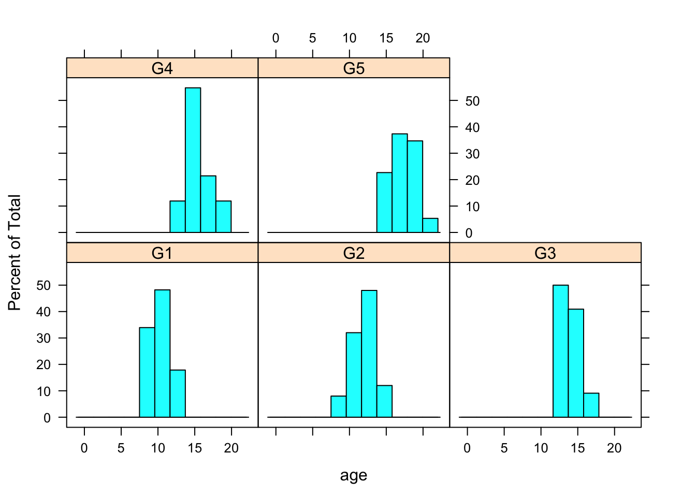
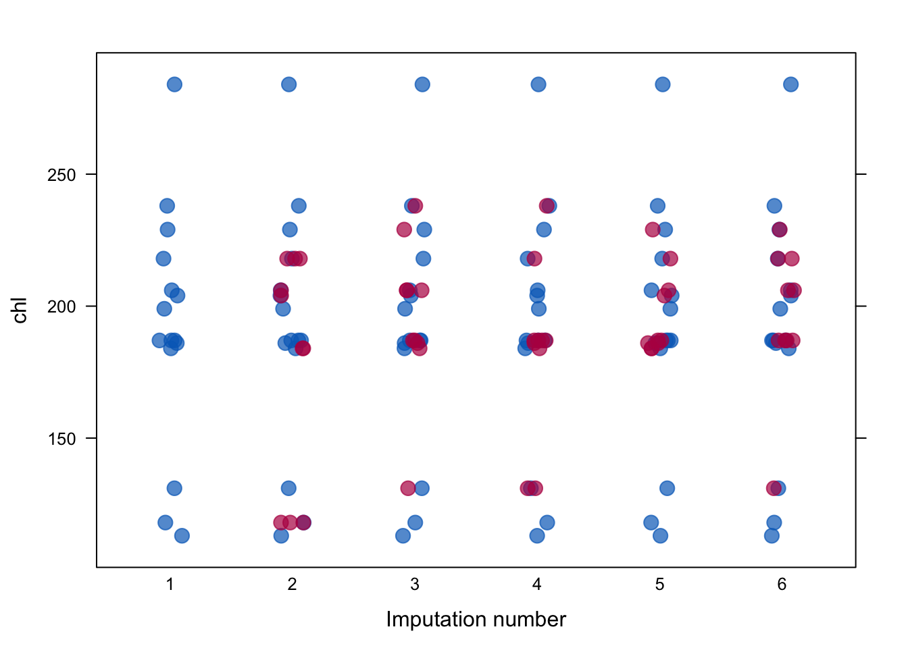
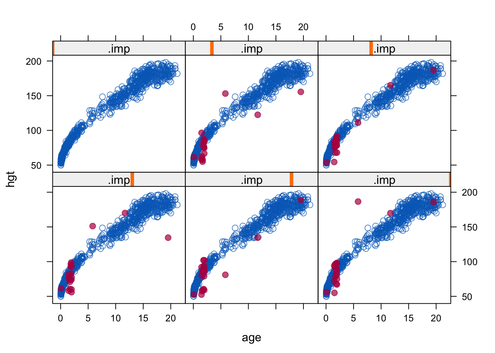

```r
library(tidyverse)
library(mice)
```


# Puuduvad andmed

Oletame, et meil on andmetabel, mis sisadab lisaks sisestatud andmetele ka NA-sid ja mille pealt te tahate fittida regresioonimudeli. NA-dega tabeleid tuleb muidugi ette ka mujal, aga just mitmesel regressioonil on nad eriline probleem, sest mudeli fittimisel saab kasutatada ainult neid tabeli ridu, mis ei sisalda ühtegi NA-d. Seega on meie huvides asendada NA-d mingite enam-vähem mõistlikke väärtustega, sest vastasel juhul võib meie efektiivne valim väga kokku kuivada, mis omakorda viib alla analüüsi sensitiivsuse. Sellist NA-de asendamist nimetame imputatsiooniks ja algoritmi, mille abil me NA-d väärtustega asendame, kutsume imputatsioonimudeliks. Imputatsiooni tulemuseks on üks või mitu andmetabelit, mis sisaldavad nii empiirilisi kui imputeeritud väärtusi ja reeglina ei sialda enam NA-sid. Nende tabelite pealt fitime siis oma päris regressioonimudeli. Imputatsioonimudel on sageli samuti regressioonimudel, aga see ei pruugi olla sama mudel samade muutujatega, kui hilisem "päris" regressioonimudel. Imputeeritud tabelilt ootame, et selle pealt arvutatud keskmised, varieeruvused jm mudeli koefitsiendid oleksid võimalikult sarnased müütilise tabeliga, kus ei olnud juba alguses puuduvaid väärtusi (mitte tegeliku NA-dega algtabeliga).

Alustuseks mõned kasulikud nipid:

* Järgnev koodirida tagab, et lm() funktsioon teeb automaatselt drop_na():
`options(na.action = na.omit)`  

* `na.action(fit)` annab lm() mudeli objekti pealt tabelist välja visatud ridade numbrid

* `naprint(na.action(fit))` annab selliste ridade arvu

* `colSums(is.na(airquality))` annab veeru kaupa NA-de arvu

* `md.pattern(data, plot = FALSE)` annab NA-de paiknemise tabeli rea ja veeru kaupa.

* `VIM::aggr(data, prop = FALSE, numbers = TRUE)` ja `VIM::matrixplot(data)` joonistavad NA-de mustrist pildi.

* `dfs[is.na(dfs)] <- 0` rekodeerib NA-d nullideks

* `na_if(dfs, 0)` teeb 0-d NA-deks

* `drop_na(data, c(column1, column2))` viskab välja NA-sid sisaldavad read 2st veerust.

* `filter_all(weather, any_vars(is.na(.)))` näitab ridu, mis sisaldavad NA-sid

Nii saab 2 vektori põhjal kolmanda nii, et NA-d asendatakse vastava väärtusega:

```r
y <- c(1, 2, NA, NA, 5)
z <- c(NA, NA, 3, 4, 5)
coalesce(y, z)
#> [1] 1 2 3 4 5
```

viska tabelist välja veerud, milles on >80% NA-sid

```r
vekt <- sapply(df, function(x) mean(is.na(x))) 
#NA-de protsent igas veerus
vekt
vekt1 <- nad[nad < 0.8] 
#subsettisin vektori elemendid, mis on < 0.8 (NA-sid alla 80%). 216 tk.
#nad1 is a named vector
vekt1n <- names(vekt1) #vektor named vektori vekt1 nimedest
df_with_fewer_cols <- subset(df, select = vekt1n)
#subsetime (jätame alles) ainult need df-i veerud, 
#mille nimele vastab mõni vektori nad1n element
```


## Andmete puudumise mehhanismid:

1. *missing completely at random (MCAR)* - NA-d on jaotunud juhuslikult -- põhimõtteliselt ei ole võimalik ennustada, et tabeli mingis positsioonis on NA erineva tõenäosusega kui igas teises. Ainult MCAR andmete korral on õigustatud NA-dega ridade eemaldamine. Igal pool mujal kallutab see pahasti teie poolt arvutatud statistikute väärtusi. 

2. *missing at random (MAR)* - Andmed on jagatavad gruppidesse ja iga grupi sees on NA-d juhuvalimina. Kui meil on NA-d muutujas A, siis andmete puudumine ei sõltu A väärtusest, aga ta võib sõltuda muutujate B, C, jne väärtustest. Kaasaegsed imputatsioonimeetodid kasutavad enamasti MAR-eeldust, mis omakorda eeldab, et relevantsed muutujad on hõlmatud imputatsioonimudelisse (aga mitte tingimata regressioonimudelisse, mis fititakse imputeeritud andmetel). 

3. *missing not at random (MNAR)* - NA-d muutujas A sõltuvad ainult A väärtusest. Kui andmed ei ole MCAR ega MAR, siis me eeldame, et nad on MNAR. MNAR imputatsioon vajab eraldi mudelit, mis arvestab NA-sid genereeriva mehhanismiga --- see on raske asi. 

Seda, millisesse kategooriasse mingi andmeset kuulub, ei saa üldjuhul öelda andmete endi põhjal. Selleks tuleb tunda andmeid genereerivat mehhanismi. Seega on oma andmete paigutamine ühte kolmest kategooriast praktikas sageli üsna ebakindel.

## Ühekaupa imputatsiooni meetodid

Siin käsitleme meetodeid, mis annavad tulemuseks ühe imputeeritud tabeli, kus iga NA asemel on üks ja ainult üks number. Neid meetodeid on lihtne mõista, aga nende kasutamist tuleks enamasti vältida. 

### NA-dega ridade eemaldamine

Pealiskaudsel vaatlusel võib tunduda, et see on üks hea ja mittekallutatud meetod, eriti siis kui meil on andmetes vaid väike NA-de osakaal. Tegelikult see ei ole nii.
NA-dega ridade eemaldamist (drop_na) on mõistlik kasutada vaid kolmel erijuhul: 

1. MCAR juhul ei kalluta see keskmist, regressioonikoefitsiente ega korrelatsiooni, kuid vähendab analüüsi sensitiivsust. Kui laseme regressiooni paljude X-muutujatega, millest igas on kasvõi väike osa NA-sid, siis nende juhuslikud kombinatsioonid viivad paraku enamuse ridade eemaldamisele tabelist ja massiivsele informatsioonikaole. 

2. Kui meil on NA-d ainult Y-muutujas (ehk muutujas, mida soovime regressioonimudelis ennustada), siis on NA-dega ridade eemaldamine sama hea kui mitmene imputatsioon ka MAR juhul (eeldades, et mitmene imputatsioon kasutab samu x-muutujaid, mis imputeeritud andmetega regressioon).

3. logistilise mudeli korral on NA-dega ridade väljaviskamine eelistatud meetod juhul kui NA-d esinevad ainult dihhotoomses Y või dihhotoomses X muutujas (aga mitte mõlemas) ja tõenäosus kohata NA-d sõltub ainult Y-väärtusest (mitte X-st).

### Paariviisiline deleteerimine

Kui muutujad on multivariaatselt normaalsed, nende vahel ei ole korrelatsioone ja kehtib MCAR eeldus, siis on hea kasutada *pairwise deletion* e *available case* meetodit, mis arvutab igale muutujale olemasolevate andmete pealt keskmise ja SEM-i ja kasutab korrelatsioonide jms arvutamisel kõiki ridu, kus andmepaarid on täielikud. Siinkohal tuleb küll mainida, et sellist olukorda praktikas naljalt ette ei tule. 

Regressioonil tuleb meil lm() asemel kasutada lavaan raamatukogu. 


```r
data <- airquality[, c("Ozone", "Solar.R", "Wind")]
mu <- colMeans(data, na.rm = TRUE)
cv <- cov(data, use = "pairwise")

library(lavaan)
fit <- lavaan("Ozone ~ 1 + Wind + Solar.R
              Ozone ~~ Ozone",
             sample.mean = mu, sample.cov = cv,
             sample.nobs = sum(complete.cases(data)))
```

### Keskmise imputatsioon ja regressiooniga imputatsioon

Kasutame mice raamatukogu.


```r
imp <- mice(airquality, method = "mean", m = 1, maxit = 1)
```

See on kindel viis varieeruvust alahinnata ja tekitada kummalisi andmejaotusi. Kui meil on MCAR andmed, siis tuleb vähemalt keskmise hinnang nihketa, aga pea kõik teised statistikud lähevad puusse. Seda meetodit tuleks alati vältida.

Regressiooniga imputatsioonil fitime mudeli olemasolevatel andmetel ja seejärel ennustame seda kasutades puuduvad andmepunktid


```r
fit <- lm(Ozone ~ Solar.R, data = airquality)
pred <- predict(fit, newdata = ic(airquality))
```

See on jällegi hea viis, kuidas kunstlikult andmete varieervust vähendada ja nende jaotust muuta. Ühtlasi tõstab see meetod kunstlikult muutujate vahelist korrelatsiooni. Enam halvemaks ei saa minna!

### Stohhastiline regressiooniga imputatsioon

lisab eelnevasse müra ja töötab ka MAR andmete peal. Kõigepealt fitib lm()-ga mudeli koefitsiendid, siis ennustab nende pealt puuduvad väärtused ja lõpuks liidab igale neist juhusliku residuaali algsest mudelist.


```r
data <- airquality[, c("Ozone", "Solar.R")]
imp <- mice(data, method = "norm.nob", m = 1, maxit = 1,
            seed = 1, print = FALSE)
```

Eeldus, mis kunagi ei kehti, on et mudeli koefitsiendid vastavad tegelikkusele. Seega puudub siin koefitsientide määramise ebakindlus (seda saab arvutada kas Bayesi meetoditega tõmmates parameetriväärtuste ebakindluse otse posteerioritest, või bootstrappides).

Stohhastiline regressiooniga imputatsioon võib anda negatiivseid väärtusi muidu positiivsetesse muutujatesse, ekstreemsed väärtused pole hästi mudeliga kaetud ja ennustused/imputatsioonid vastavad regressioonieeldustele (homoskedastilisus jne) ka siis, kui andmed nendele ei vasta. Siiski, kuna see pigem algeline meetod säilitab korrelatsioonid muutujate vahel ja ei kalluta regressioonikoefitsiente, ei saa see liiga halb olla. Sellelt põhjalt on ehitatud paljud kaasaegsed imputatsioonimeetodid.

### Eelmise vaatluse kopeerimine (LOCF).

See on *ad hoc* meetod aegridadele, mida rakendab `tydyr::fill()` ja mida on hea kasutada siis, kui muutuja väärtus kirjutatakse üles ainult siis, kui see muutub. Muidu, LOCF võib olla kallutatud isegi MCAR juhul.  

## Mitmene imputatsioon

See meetod loodi Donald Rubini poolt 1970ndatel üldskeemiga:

1. Tekita mitu imputeeritud andmeraami (igaüks on ilma NA-deta), mis erinevad ainult imputeeritud väärtuste poolest. Iga NA asemele imputeeritakse arvud omast jaotusest, mille laius arvestab meie ebakindlusega selle konkreetse positsiooni imputeerimisel.

2. Analüüsi igat andmeraami eraldi, aga tavapärasel viisil

3. kombineeri tulemused lõplikuks keskmiseks ja sem-iks.

Näide: mitmene imputatsioon lm()-ga ja CI-d koefitsientidele


```r
imp <- mice(nhanes, print = FALSE, m = 10, seed = 24415)
fit <- with(imp, lm(bmi ~ age))
est <- pool(fit)
summary(est, conf.int = TRUE)

complete(imp, 3) #annab 3. imputeeritud tabeli (nii uued kui orig andmed)
complete(imp, "long") #annab kõik imputeeritud tabelid pikas formaadis
complete(imp, "broad") #sama laias formaadis
imp$data #originaalsed andmed NAdega
imp$imp #ainult imputeeritud andmed
```

m=10 loob 10 iseseisvat andmeraami. 

> Kaasaegne soovitus on, kui võimalik, sättida m kuhugi 20-100 vahele.

Kogu järgnev imputatsioonijutt käib vaikimisi mitmese imputatsiooni kohta.

Imputatsiooni mudel peaks

* arvestama protsessiga, mis genereeris NAd (NMAR juhul) 

* säilitama andmetes leiduvad omavahelised suhted 

* säilitama nende suhete ümber laiuva ebakindluse määra 

Selle nimel peame tegema 7 valikut selles järjekorras:

1. **Kas me loeme MAR eelduse kehtivaks?** MNAR imputatsioon toob sisse lisaeeldused. MNAR juhul on kaks võimalust: toome sisse uued muutujad, mis enustaks NAde paiknemist lootuses, et läheneme MAR-eelduse täitmisele; või kasutame lisamudelit, mis arvestab protsessiga, mis genereeris NAd.  

2. **Milline imputatsioonimudel (nii mudeli struktuurne osa kui eeldatud vigade jaotus)?** *Fully conditional specification* (FCS) imputeerib multivariiatseid NA-sid muutuja haaval. Seega peab mudeli kuju spetsifitseerima igale NA-dega muutujale eraldi, arvestades ka muutujate vahelisi seoseid. 


Method        Description                              Scale Type 
------------  ---------------------------------------  -----------
pmm           Predictive mean matching                 Any*       
midastouch    Weighted predictive mean matching        Any        
sample        Random sample from observed values       Any        
cart          Classification and regression trees      Any        
rf            Random forest imputation                 Any        
norm          Bayesian linear regression               numeric    
norm.boot     Normal imputation with bootstrap         Numeric    
quadratic     Imputation of quadratic terms            Numeric    
ri            Random indicator for nonignorable data   Numeric    
logreg        Logistic regression                      Binary*    
logreg.boot   Logistic regression with bootstrap       Binary     
polr          Proportional odds model                  ordinal*   
polyreg       Polytomous logistic regression           Nominal*   

\\* - vaikemudel antud andmetüübile

Nii saab trükkida kasutatud imputatsioonimeetodi veeru kaupa:

```r
imp$meth
methods(mice) #annab mice meetodite loendi

ini <- mice(nhanes2, maxit = 0)
meth <- ini$meth
meth["bmi"] <- "norm" #muudab meetodit muutujale "bmi"
imp <- mice(nhanes2, meth = meth, print=F)
```


Normaalsetele muutujatele on norm efektiivsem, kui pmm. norm.boot on kiirem mitte-bayesiaanlik alternatiiv. Kui pmm töötab halvasti (näit ei ole piisavalt ennustuse lähedasi doonorarve), kasuta norm meetodeid. Harvade kategooriliste andmepunktide korral eelista pmm-i, pigem kui logreg, polr või polyreg. sample on kiirmeetod imputeerimiseks ilma kovariaatideta. 

3. **Milliseid muutujaid kasutada imputatsioonimudelis prediktoritena?** Üldine soovitus on lisada kõik relevantsed muutujad ja nende relevantsed interaktsioonid. 

predictorMatrix argument on maatriks suurusega ncol(data), mis sisaldab 0/1. Iga rida ütleb, milliseid prediktoreid kasutatkse muutujale, mille nimi on reanimes. 


```r
imp <- mice(nhanes, print = FALSE)
imp$predictorMatrix
#>     age bmi hyp chl
#> age   0   1   1   1
#> bmi   1   0   1   1
#> hyp   1   1   0   1
#> chl   1   1   1   0
```
Kõikide muutujate kasutamine on ok, kui meil on < 20-30 muutuja, mille vahel ei ole keerulisi interakstsioone. Rohkem muutujaid muudab ka MAR eelduse täitmise tõenäolisemaks. Muidu võta sisse (i) kogu hiljem kasutatava regressioonimudeli, (2) lisa muutujad, mis võiksid ennustada NA-de teket (mille jaotused erinevad andmete ja NA-de korral imputeeritavas muutujas), (3) lisa muutujad, mis on korreleeritud imputeeritava muutujaga. quickpred() annab kiire viisi prediktormaatriksi defineerimiseks. 

Nii saab prediktor maatriksi ilma tegelikku impoutatsiooni läbi tegemata:

```r
ini <- mice(nhanes, maxit=0, print=F)
pred <- ini$pred
pred[ ,"hyp"] <- 0 #rekodeerime veeru "hyp", 
#mida ei kasutata enam imputatsioonil
imp <- mice(nhanes, pred=pred, print=F)
```

`quickpred()` teeb ise prediktorite valiku, mida imputatsioonil kasutada


```r
ini <- mice(nhanes, pred=quickpred(nhanes, mincor=.3), print=F)
ini$pred
```


Nii kirjutame imputatsioonimudelisse sisse interaktsiooni kahele muutujale, kus me kõigepealt lahutame kummagist muutujast tema keskmise (tsentreerime) ja siis korrutame need muutujad
 

```r
expr <- expression((wgt - mean(wgt)) * (hc - mean(hc)))
boys$wgt.hc <- with(boys, eval(expr))
meth <- make.method(boys)
meth["wgt.hc"] <- paste("~I(", expr, ")", sep = "")
#I() lubab argumendi (wgt - mean(wgt)) * (hc - mean(hc)) 
#ära tunda literaase valemina.
meth["bmi"] <- ""
pred <- make.predictorMatrix(boys)
pred[c("wgt", "hc"), "wgt.hc"] <- 0
#et katkestada võimalikke tagasisidestusega luupe wgt.hc ja 
#wgt&hc vahel, viime sisse muutused prediktormaatriksisse.
imp.int <- mice(boys, m = 1, meth = meth, pred = pred,
                print = FALSE, seed = 62587, maxit = 10)
```
 Kategooriliste muutujate interaktsioone saab imputeerida jagades andmed gruppidesse ja imputeerides neid eraldi, misjärel kombineerida tulemused taas rbind() abil.

Kompositsioonilised andmed -- mitu muutujat summeeruvad ühele (100%-le). Selliste andmete imputeerimiseks vt robCompositions raamatukogu. 

4. **Kas imputeerida muutujaid, mis on teiste NA-dega muutujate funktsioonid (suhted jms)?** Lihtsaim vastus on "ei". Siin imputeerime kõigepealt wght ja hgth muutujad ja siis arvutame nende pealt suhte (whr).

```r
data <- boys[, c("age", "hgt", "wgt", "hc", "reg")]
imp <- mice(data, print = FALSE, seed = 71712)
long <- mice::complete(imp, "long", include = TRUE)
long$whr <- with(long, 100 * wgt / hgt)
imp.itt <- as.mids(long)
```
See ei ole täiuslik meetod: päris regressioonimudelis saavad kõikide muutujate koefitsiendid, mis sõltuvad whr-ist, kallutatud nulli suunas.

Alternatiivne meetod on nn **passiivne imputatsioon**, kus transformatsioon tehakse koos imputatsiooniga samas algoritmis. Passiivseks imputatsiooniks on vaja alustada imputatsioonimeetodi defineerimist ~ (tilde) sümboliga.


```r
data <- boys[, c("age", "hgt", "wgt", "hc", "reg")]
data$whr <- 100 * data$wgt / data$hgt
meth <- make.method(data)
meth["whr"] <- "~I(100 * wgt / hgt)"
#I() lubab argumendi 100*wght/hgth ära tunda literaase valemina.
pred <- make.predictorMatrix(data)
pred[c("wgt", "hgt"), "whr"] <- 0
#et katkestada võimalikke tagasisidestusega luupe whr-i ja 
#wgt&hgt vahel, viime sisse muutused prediktormaatriksisse.
imp.pas <- mice(data, meth = meth, pred = pred, print = FALSE)
```
 whr imputatsioonid saadakse hgt ja wgt-st vastavalt 100*wght/hgth valemile. Kuna whr on andmetabeli viimane veerg, imputeeritakse see peale wgt ja hgt-d. Kahjuks kallutab ka passivne imputasioon koefitsiente nulli suunas. Suhteid ongi raske imputeerida!
 
Suhete, ruutliikmete ja interaktsioonide imputeerimiseks on arvatavasti parim meetod järgmine:

```r
library(smcfcs)
data <- pop
data[sample(nrow(data), size = 100), "wgt"] <- NA
data[sample(nrow(data), size = 100), "hgt"] <- NA
data$whr <- 100 * data$wgt / data$hgt
meth <- c("", "norm", "norm", "", "", "norm")
imps <- smcfcs(originaldata = data, meth = meth, smtype = "lm",
               smformula = "hc ~ age + hgt + wgt + whr")
fit <- lapply(imps$impDatasets, lm,
              formula = hc ~ age + hgt + wgt + whr)
summary(pool(fit))
```

5. **Mis järjekorras muutujaid imputeerida?** 

Tavaliselt imputeeritakse muutujaid järjekorras vasakult paremale ja see on hea küll.
Imputeerimise järjekorrale tasub tähelepanu põõrata siis, kui NA-de muster on monotooniline. NA-de muster on monotooniline siis, kui muutujaid saab järjestada nõnda, et kui esimeses muutujas on NA, siis ka kõikides järgnevates muutujates on selles reas NA. (Näiteks, kui aegreas mõni subjekt välja kukub.)

Näiteks siin on meil 3 monotoonilist muutujat

```r
data <- nhanes2[, 1:3]
md.pattern(data, plot = FALSE)
#>    age hyp bmi   
#> 16   1   1   1  0
#> 1    1   1   0  1
#> 8    1   0   0  2
#>      0   8   9 17
```

Meil on 16 ilma NA-deta rida, 1 rida, kus puudub bmi üksi ja 8 rida, kus puuduvad bmi ja hyp. Paremas servas on veerg rea kaupa NA-de arvuga igale kombinatsioonile ja alumine rida annab NA-de arvu igale veerule ja totaalse NAde arvu (17).


```r
imp <- mice(data, visit = "monotone", maxit = 1, m = 2,
            print = FALSE)
```

Argument `visit = monotone` määrab monotoonilise imputatsiooni, ehk kõigepealt imputeeritakse need muutujad, milles on vähem NA-sid (enne hyp ja siis bmi). Monotooniline imputatsioon eeldab, et NA-de muster on monotooniline ja et muutujad ei sõltu üksteisest (muutujate distinktsust).


6. **Mitu iteratsiooni teha?**  

Nii saab mc agelate konvergeerumist graafiliselt kontrollida.

```r
plot(imp)
mice.mids(imp, maxit=35, print=F) 
#> Class: mids
#> Number of multiple imputations:  5 
#> Imputation methods:
#>   age   bmi   hyp   chl 
#>    "" "pmm" "pmm" "pmm" 
#> PredictorMatrix:
#>     age bmi hyp chl
#> age   0   1   1   1
#> bmi   1   0   1   1
#> hyp   1   1   0   1
#> chl   1   1   1   0
#tõstab mc iteratsioonide arvu 35-le.
#võtab imputeeritud mids objekti ja lisab iteratsioone, 
#toodab uue mids objeki
```


Joonisel on igale iteratsioonile imputeeritud väärtuste (aga mitte algsete väärtuste) keskmine ja SD.

7. **Mitu imputatsiooni teha?** Liiga suur m viib suurele simulatsiooniveale ja statistilisele ebaefektiivsusele. Vaikeväärtus on 5.  


## Predictive mean matching 

See on enimkasutatud mitmese imputatsiooni meetod:

1. ennusta NA asemele parim oodatud väärtus regressioonimudelist

2. leia mingi arv (3, 5 v 10) oodatud väärtusega sarnaseid kandidaatväärtusi (ehk doonorväärtusi d=) olemasolevatest andmetest

3. võta nende seast üks juhuslik väärtus ja imputeeri see.

See põhineb eeldusel, et kandidaatväärtused on sama jaotusega, kui puuduvad väärtused. Meetod on robustne andmete tranformatsioonidele ja töötab üldiselt hästi pidevatel muutujatel, juhul kui valim on suur. Kui N>100, kasuta d=5, väikeste valimite korral aga d=1. Kui N on ligikaudu 10, siis on eelis adaptatiivsel meetodil `midastouch`.

*Predictive mean matching* d=5 on mice vaikemudel pidevatele muutujatele.
Vaikemudel on lineaarne additiivne mudel üle kõikide prediktorite. Kui päris regressioonimudel on vaikemudelist erinev (interaktsioonid!), siis tuleks seda kasutada ka imputatsioonil. Meetod võib töötada halvasti väikesel valimitel, seda ei saa kasutada andmetest välja ekstrapoleerimiseks ja ka andmete sees, juhul kui andmete tihedus on madal.

## Imputeerimine mitte-normaalsete jaotuste korral

Kui n > 400, pole enamasti probleemi imputeeritud andmete pealt keskmise arvutamisega (isegi kui muutujas on 75% NA-sid), kuid varieeruvusnäitajad võivad siiski olla problemaatilised. Üks võimalus on transformeerida andmed nii, et nad oleksid normaalsed, siis imputeerida ja seejärel andmed uuesti tagasi transformeerida. Siiski ei ole garantiid, et selline trikitamine asja hoopis hullemaks ei tee. Teine võimalus on imputeerida, kastudades mitte-normaalseid jaotusi. Näiteks saab kasutada studenti t jaotust, et saada imputatsioonil robustsemaid tulemusi, juhul kui andmetes on outlierid, mis kajastavad tegelikke olusid.


```r
library("ImputeRobust")
library("gamlss")
imp <- mice(data2, m = 1, meth = "gamlssTF", print = FALSE)
```

## Kategoorilised muutujad

Binaarse muutuja korral kasutame logistilist mudelit, rohkem kui kahe tasemega mittejärjestatud juhul multinominaalset logistilist mudelit ja järjestatud tasemetega juhul *ordered logit* mudelit või *proportional odds* mudelit. 

Kategooriliste muutujate imputeerimine on raske. Logistilises regressioonis vajame me reeglina vähemalt 10 sündmust prediktori kohta. Seega, kui me imputeerime 10 binaarset NAd, vajame me 100 sündmust ja kui sündmuse tõenäosus on 0.1, siis üle 1000 katse. Kui muutuja tasemete arv kasvab, siis need numbrid kasvavad väga kiiresti. 

Vaikimisi töötavad logreg, polyreg ja polr on tavaliselt ok. Kui suhe sündmuste arv/fititud parameetrite arv langeb alla 10, siis võiks kasutada robustsemaid meetodeid: pmm, cart või rf.

## countid (sisaldavad nulle)

Meetodid:

1. Predictive mean matching.

2. Ordered categorical imputation.

3. (Zero-inflated) Poisson regression.

4. (Zero-inflated) negative binomial regression.

Poisson mudeldab haruldaste sündmuste summat, negatiivne binoommudel on paindlikum versioon Poissonist, mida saab kasutada siis, kui meil on andmetes üle-dispersioon (poisson eeldab kindlat dispersioonimäära). Zero-inflated versioonid mõlemast töötavad siis, kui meil on andmetes oodatust rohkem nulle. 

ImputeRobust raamatukogu kasutab mice meetodeid: `gamlssPO` (Poisson), `gamlssZIBI` (zero-inflated binomial) ja `gamlssZIP` (zero-inflated Poisson). 


## Graafilised meetodid


konditsionaalne plot muutujale "age" erinevatel muutuja "gen" väärtustel

```r
histogram(~age|gen, data=boys)
```



Vanuste jaotus on erinev sõltuvalt sellest, kas gen muutuja on NA v mitte.

```r
R <- is.na(boys$gen) 
histogram(~age|R, data=boys)
```


näitab algseid ja imputeeritud andmeid üksteise peal muutujale "chl"

```r
stripplot(imp, chl~.imp, pch=20, cex=2)
```


Imputeeritud andmed on punased.

suru imputeeritud andmed 1 ja 25 vahele

```r
ini <- mice(boys, maxit = 0)
meth <- ini$meth
meth["tv"] <- "norm"
post <- ini$post
post["tv"] <- "imp[[j]][, i] <- squeeze(imp[[j]][, i], c(1, 25))"
imp <- mice(boys, meth=meth, post=post, print=FALSE)
```

scatterplot, kus on nii imputeeritud kui päris andmed

```r
miss <- is.na(imp$data$bmi)
xyplot(imp, bmi ~ I (wgt / (hgt / 100)^2),
       na.groups = miss, cex = c(0.8, 1.2), pch = c(1, 20),
       ylab = "BMI (kg/m2) Imputed", xlab = "BMI (kg/m2) Calculated")
```


```r
imp <- mice(boys, maxit=1)
#> 
#>  iter imp variable
#>   1   1  hgt  wgt  bmi  hc  gen  phb  tv  reg
#>   1   2  hgt  wgt  bmi  hc  gen  phb  tv  reg
#>   1   3  hgt  wgt  bmi  hc  gen  phb  tv  reg
#>   1   4  hgt  wgt  bmi  hc  gen  phb  tv  reg
#>   1   5  hgt  wgt  bmi  hc  gen  phb  tv  reg

### xyplot: scatterplot by imputation number
### observe the erroneous outlying imputed values
### (caused by imputing hgt from bmi)
xyplot(imp, hgt~age|.imp, pch=c(1,20),cex=c(1,1.5))
```




```r
### same, but label with missingness of wgt (four cases)
xyplot(imp, hgt~age|.imp, na.group=wgt, pch=c(1,20),cex=c(1,1.5))
```


```r
xyplot(imp, hgt~age, pch=c(1,20),cex=c(1,1.5))
```


## Tulemuste avaldamine

Avaldatud töö võiks sisaldada vastuseid järgmistele küsimustele

1. Kui palju NAsid on igas muutujas? Mis oleks valimi suurus *complete-cases* analüüsile, kui me teeme drop_na()? Kui NA-d tekivad erinevates ajapunktides (drop-out), siis kirjelda seda ajapunkti kaupa.

2. Mis võiks põhjustada andmete puudumist?

3. Kas mõõteobjektid, millel esineb NA-sid, erinevad süstemaatiliselt neist, millel ei ole NA-sid? Kas need grupid erinevad keskmise ja/või varieeruvuse poolest? Kuidas erineb *complete case* analüüsi tulemus imputeeritud regressioonist?

4. Imputatsiooni meetod, selle eeldused (MAR).

5. Software ja selle mitte-vaikesettingud.

6. Mitu imputatsiooni tabeli kohta?

7. Imputatsiooni mudeli kirjeldus: millised muutujad, kas kasutati automaatset muutujate selektsiooni, kuidas imputeeriti mitte-normaalseid ja kategoorilisi muutujaid, kuidas võeti arvesse katse hierarhilist struktuuri?

8. Kuidas imputeeriti transformeeritud muutujaid (bmi, suhted jms)?

9. algse ja imputeeritud andmete võrdlus, konvergentsi diagnostika. Kas imputeeritud andmed on usutavad?

Punktid 1, 2, 4, 5 ja 6 on krutsiaalsed.


