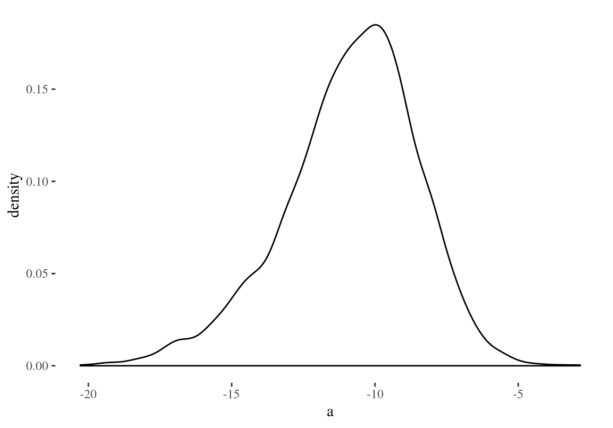
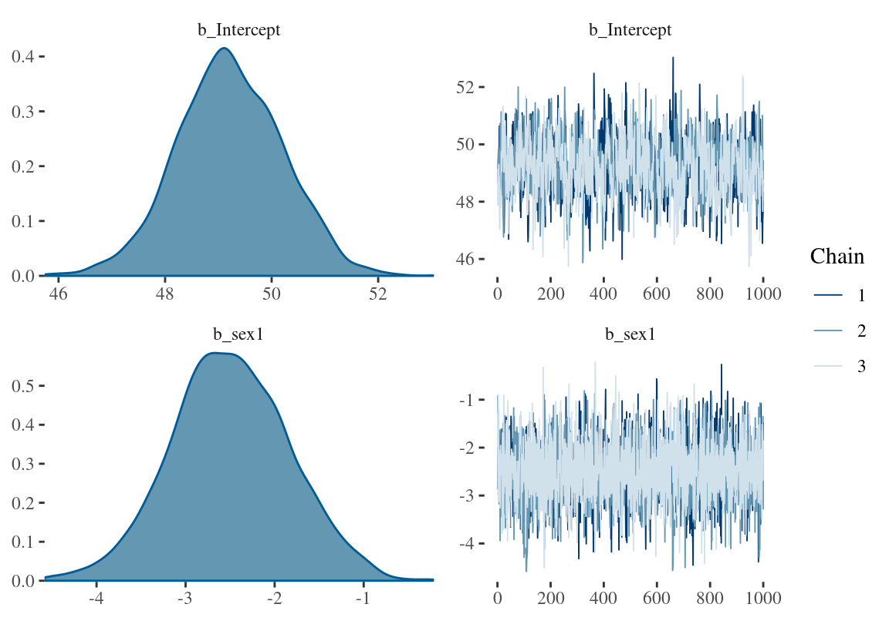
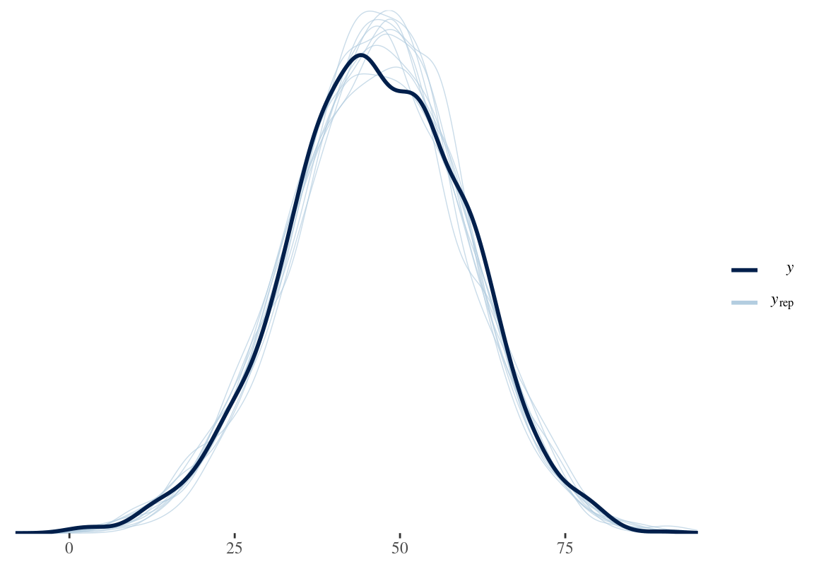
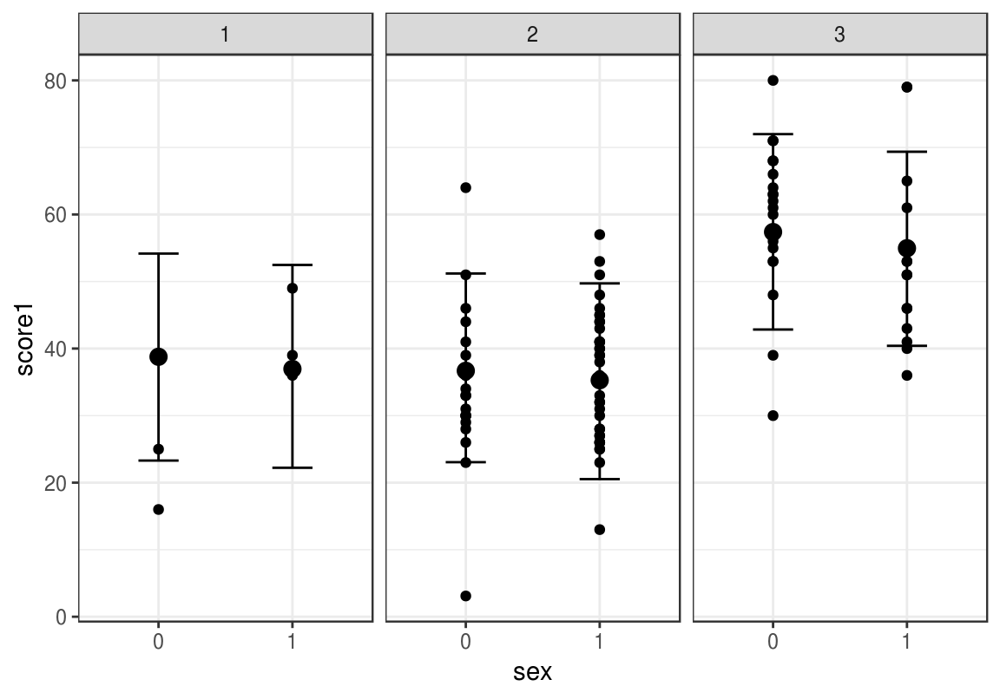
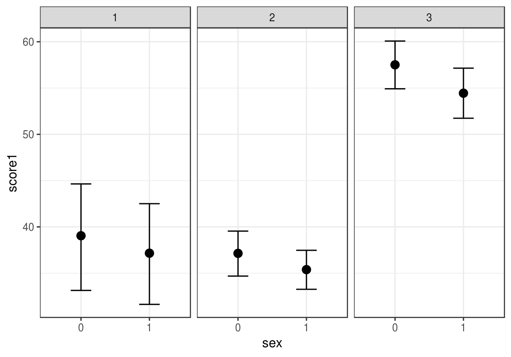

---
title: "R Notebook"
output: html_notebook
---


```r
library(tidyverse)
library(brms)
library(bayesplot)
library(broom)
library(rethinking)
```


```r
schools <- read_csv( "data/schools.csv")
schools <- schools %>%
  drop_na() %>%
  mutate_at(vars(sex, school), as.factor) 
```

```r
head(schools)
#> # A tibble: 6 x 5
#>   school student sex   score1 score2
#>   <fct>    <int> <fct>  <dbl>  <dbl>
#> 1 20920       27 1         39   76.8
#> 2 20920       31 1         36   87.9
#> 3 20920       42 0         16   44.4
#> 4 20920      101 1         49   89.8
#> 5 20920      113 0         25   17.5
#> 6 22520        1 1         48   84.2
```

(0 - poiss, 1 - tüdruk)


```r
skimr::skim(schools)
#> Skim summary statistics
#>  n obs: 1523 
#>  n variables: 5 
#> 
#> ── Variable type:factor ───────────────────────────────────────────────────
#>  variable missing complete    n n_unique
#>    school       0     1523 1523       73
#>       sex       0     1523 1523        2
#>                          top_counts ordered
#>  681: 83, 684: 65, 688: 61, 225: 56   FALSE
#>               1: 899, 0: 624, NA: 0   FALSE
#> 
#> ── Variable type:integer ──────────────────────────────────────────────────
#>  variable missing complete    n    mean      sd p0  p25 p50 p75 p100
#>   student       0     1523 1523 1016.45 1836.14  1 62.5 129 445 5516
#>      hist
#>  ▇▁▁▁▁▁▁▂
#> 
#> ── Variable type:numeric ──────────────────────────────────────────────────
#>  variable missing complete    n  mean    sd   p0  p25  p50  p75 p100
#>    score1       0     1523 1523 46.5  13.48 0.6  38   46   56     90
#>    score2       0     1523 1523 73.38 16.44 9.25 62.9 75.9 86.1  100
#>      hist
#>  ▁▁▃▇▇▅▁▁
#>  ▁▁▁▂▅▇▇▆
```

Excersize: how do these models differ?

1. score1~ sex

2. score1~ score2

3. score1~score2 + sex

4. score1~score2*sex

5. score1~score2:sex

6. score1~sex*school

7. score1~sex + (1 | school)

8. score1~sex + (sex | school)

9. score1~0 + (sex | school)


score1~score2*sex on sama, mis score1~score2 + sex + score2:sex

```r
lm_m1 <- lm(score1~score2 + sex, data = schools)
lm_m2 <- lm(score1~score2*sex, data = schools)
lm_m3 <- lm(score1~score2:sex, data = schools)
```


```r
rethinking::AIC(lm_m1, lm_m2, lm_m3)
#>       df   AIC
#> lm_m1  4 11771
#> lm_m2  5 11768
#> lm_m3  4 11785
```


```r
tidy(lm_m1)
#> # A tibble: 3 x 5
#>   term        estimate std.error statistic   p.value
#>   <chr>          <dbl>     <dbl>     <dbl>     <dbl>
#> 1 (Intercept)   19.0      1.36       14.1  2.73e- 42
#> 2 score2         0.422    0.0183     23.1  2.08e-101
#> 3 sex1          -5.98     0.611      -9.79 5.54e- 22
```


```r
tidy(lm_m2)
#> # A tibble: 4 x 5
#>   term        estimate std.error statistic  p.value
#>   <chr>          <dbl>     <dbl>     <dbl>    <dbl>
#> 1 (Intercept)  22.2       1.97       11.3  1.77e-28
#> 2 score2        0.377     0.0274     13.7  1.66e-40
#> 3 sex1        -11.9       2.73       -4.36 1.40e- 5
#> 4 score2:sex1   0.0818    0.0368      2.23 2.62e- 2
```

score1~score2 + sex + score2:sex

```r
score2 <- 50
sex <- 1
a <- 22.22521711
b1 <- 0.37664046
b2 <- -11.90657014
b3 <- 0.08180509
a + b1*score2 + b2*sex +  b3*score2*sex
#> [1] 33.2
```


```r
score2 <- 50
sex <- 0
a <- 22.22521711
b1 <- 0.37664046
b2 <- -11.90657014
a + b1*score2 + b2*sex +  b3*score2*sex
#> [1] 41.1
```


```r
tidy(lm_m3)
#> # A tibble: 3 x 5
#>   term        estimate std.error statistic   p.value
#>   <chr>          <dbl>     <dbl>     <dbl>     <dbl>
#> 1 (Intercept)   16.1      1.37        11.7 2.72e- 30
#> 2 score2:sex0    0.460    0.0197      23.4 2.62e-103
#> 3 score2:sex1    0.386    0.0180      21.4 5.80e- 89
```

score1~ a + b1* score2_fem + b2* score2_male


**Homework: please get from the fitted lm_m1 the predictions for the score 1 for boys and girls, if score 2 is 50.**


ennustame keskmist skoori nii üle kõikide koolide kui ka kooli tasemel eraldi poistele ja tüdrukutele.

```r
get_prior(score1~sex + (sex | school), 
          data= schools)
#>                   prior     class      coef  group resp dpar nlpar bound
#> 1                               b                                       
#> 2                               b      sex1                             
#> 3                lkj(1)       cor                                       
#> 4                             cor           school                      
#> 5  student_t(3, 46, 13) Intercept                                       
#> 6   student_t(3, 0, 13)        sd                                       
#> 7                              sd           school                      
#> 8                              sd Intercept school                      
#> 9                              sd      sex1 school                      
#> 10  student_t(3, 0, 13)     sigma
```


```r
prior <- c(prior(normal(50, 30), class="b"),
           prior(normal(0, 20), class ="b", coef = "sex1"),
           prior(lkj(3), class = "cor"))
```


```r
sch_m1 <- brm(score1~sex + (sex | school), 
          data= schools, prior = prior, chains = 3, cores = 3)
write_rds(sch_m1, path = "sch_m1.fit")
```


```r
sch_m1 <- read_rds("sch_m1.fit")
```

b_Intercept annab ennustuse sex = 0 keskmisele testitulemusele üle kõikide koolide ja b_sex1
annab sex = 1 tulemuse. Kooli tasemele minnes tuleb teha tehted: 

b_Intercept + r_school[xxx,Intercept] ja 

b_sex1 + r_school[xxx,sex1], 

et saada sellele koolile ennustatud poiste ja tüdrukute skoor.

```r
broom::tidyMCMC(sch_m1$fit, conf.int = TRUE, conf.method = "HPDinterval",
    rhat = TRUE)
#> # A tibble: 152 x 6
#>   term                        estimate std.error  conf.low conf.high  rhat
#>   <chr>                          <dbl>     <dbl>     <dbl>     <dbl> <dbl>
#> 1 b_Intercept                  49.2        0.993  47.3        51.1   1.00 
#> 2 b_sex1                       -2.50       0.663  -3.75       -1.16  1.000
#> 3 sd_school__Intercept          7.24       0.798   5.71        8.75  1.00 
#> 4 sd_school__sex1               1.53       1.01    0.00555     3.36  1.00 
#> 5 cor_school__Intercept__sex1  -0.0924     0.315  -0.651       0.570 1.000
#> 6 sigma                        11.2        0.208  10.7        11.6   0.999
#> # ... with 146 more rows
```

Kui suure tõenäosusega on sex1 koef suurem kui -2.3?


```r
sch_df <- as.data.frame(sch_m1$fit)
mean(sch_df$b_sex1 > -2.3)
#> [1] 0.38
```
Vastus - 38% tõenäosusega.

Posteerior kahe kooli keskmise tulemuse erinevusele "22520", "30474"

```r
a <- ((sch_df$`r_school[22520,Intercept]` - sch_df$`r_school[22520,sex1]`)/2) - ((sch_df$`r_school[30474,Intercept]` - sch_df$`r_school[30474,sex1]`)/2)

ggplot(data=NULL, aes(a)) + geom_density()
```



90% CI 

```r
rethinking::HPDI(a, prob = 0.9)
#>   |0.9   0.9| 
#> -14.68  -7.12
```
Juhhei! keskmine tulemus erineb kuskil 7 - 15 punkti võrra ja posteerior ei kata üldse nulli.


```r
mean(sch_df$b_sex1 > 0)
#> [1] 0
```


```r
plot(sch_m1, pars = "b_")
```




```r
stanplot(sch_m1, pars = "cept]$")
```


```r
bayes_R2(sch_m1)
#>    Estimate Est.Error Q2.5 Q97.5
#> R2    0.316     0.018 0.28  0.35
```


```r
pp_check(sch_m1)
```



poiste ja tüdrukute ennustatud keskmine tulemus 90% CI-ga (0 - poiss, 1 - tüdruk)

```r
marginal_effects(sch_m1, method = "fitted", probs=c(0.1, 0.9))
```


siin ennustab mudel kooli kaupa, kuhu piirkonda võiksid tulla just selle kooli tulemused kordustestis. Näidatud on ka algse valimi andmepunktid. NB! kui minna mudeli alumisele tasemele, siis tuleb sisse panna argument re_formula = NULL (muidu ei arvesta ennustus mudeli alumise taseme koefitsiente)

```r
conditions <- data.frame(school =c("20920", "22520", "30474"))
plot(marginal_effects(sch_m1, method = "predict", re_formula = NULL, conditions = conditions, probs=c(0.1, 0.9)), points = TRUE,  theme = theme_bw())
```



ja kooli tasemel ennustused keskmisele skoorile. Kool 2, kus on rohkem andmeid kui kool 1-l, saab ka kitsamad usalduspiirid.

```r
plot(marginal_effects(sch_m1, method = "fitted", conditions = conditions, re_formula = NULL, probs=c(0.1, 0.9)),  theme = theme_bw())
```




