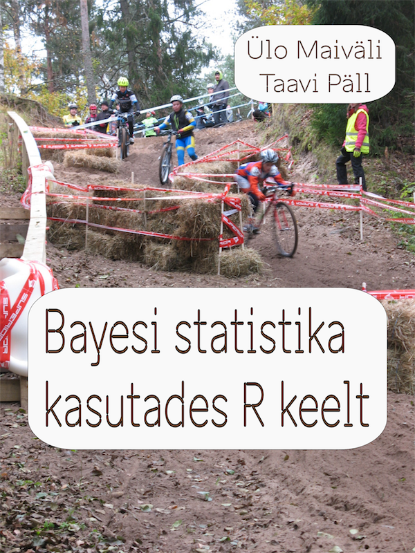

--- 
knit: "bookdown::render_book"
title: "Bayesi statistika kasutades R keelt"
author: ["Taavi P<U+00E4>ll", "<U+00DC>lo Maiv<U+00E4>li"]
github-repo: rstats-tartu/bayesiraamat
description: "Praktilise kursuse 'Reprodutseeritav andmeanal<U+00FC><U+00FC>s R keeles' Bayesi statistika materjalid."
bibliography: [book.bib, packages.bib]
biblio-style: apalike
site: bookdown::bookdown_site
documentclass: book
cover-image: img/cyclo.png
---

# Saateks {-}

See <U+00F5>pik soovib anda praktilisi andmeanal<U+00FC><U+00FC>si oskusi t<U+00F6><U+00F6>tamiseks reaalsete andmetega. See puudutab laias laastus kolme teemat: 

1. Kuidas summeerida andmeid: keskmise, varieeruvuse ja kovarieeruvuse n<U+00E4>itajad. 

2. Kuidas graafiliste meetodite abil kontrollida andmete kvaliteeti ja p<U+00FC>stitada uusi h<U+00FC>poteese.

3. Kuidas teha andmete p<U+00F5>hjal j<U+00E4>reldusi protsessi kohta, mis neid andmeid genereerib, <U+00FC>htlasi kirjeldades adekvaatselt neid j<U+00E4>reldusi <U+00FC>mbritsevat ebakindlust.

Kuna me p<U+00FC><U+00FC>ame anda eesk<U+00E4>tt praktilisi oskusi andmeanal<U+00FC><U+00FC>siks, mitte matemaatilist ega muidu teoreetilist haridust, siis keskendume moodsatele bayesi meetoditele. Need on k<U+00FC>ll arvuti jaoks t<U+00F6><U+00F6>mahukamad kui klassikalised statistilisel olulisusel p<U+00F5>hinevad testid, aga inimese jaoks kergemini <U+00F5>pitavad ning t<U+00F5>lgendatavad. Klassikalist ja bayesi statistikat v<U+00F5>rdleme lisas 1. Bayesiaanliku l<U+00E4>henemise hind on, et kasutaja peab omandama v<U+00E4>hemalt algtasemel R keele, mis v<U+00F5>imaldab k<U+00E4>surealt anmdeid manipuleerida. R-i <U+00F5>ppimine n<U+00F5>uab kahtlemata lisapingutust, aga me usume, et see tasub <U+00E4>ra iga<U+00FC>hele, kes t<U+00F6><U+00F6>tab v<U+00E4>hemalt keskmise suurusega andmekogudega. Me teeme sissejuhatuse R-i peat<U+00FC>kkides ...., keskendudes R-i tidyverse <U+00F6>kos<U+00FC>steemile, mis on optimeeritud olema kergesti kasutatav ja <U+00F5>pitav inimestele, kelle p<U+00F5>hit<U+00F6><U+00F6> ei ole seotud koodi kirjutamisega.  

Pingutus R <U+00F5>ppimiseks tasub teile mitmel erineval viisil. R v<U+00F5>imaldab palju kiiremini andmetabeleid anal<U+00FC><U+00FC>siks sobivasse vormi  ajada kui spreadsheet programmid. R-i graafikas<U+00FC>steem, eriti ggplot2, on v<U+00F5>imas ning paindlik t<U+00F6><U+00F6>riist v<U+00E4>ga erinevate graafikute koostamiseks. R-s jooksevad praktiliselt k<U+00F5>ik statistilised testid, mida inimm<U+00F5>istus on loonud -- R on levinuim statistikaprogramm maailmas, mis on eriti h<U+00E4>sti sobiv statistiliseks modelleerimiseks. See t<U+00E4>hendab ka, et <U+00FC>le maailma on suur seltskond inimesi, kes R-i arendab ja on n<U+00F5>us vastama ka teie k<U+00FC>simustele. Lisaboonusena on juba kord salvestatud R-i koodi taaskasutades palju lihtsam oma anal<U+00FC><U+00FC>si korrata ja vastavalt vajadustele muuta, kui spreadsheet programmide puhul.    

<U+00D5>piku kasutamise eeldused:
- Arvuti.
- Matemaatikaoskused, mis h<U+00F5>lmavad liitmist, lahutamist, korrutamist, jagamist, logaritmimist ja astendamist. 
- K<U+00F5>rgemat matemaatikat me ei vaja. 

<U+00D5>piku struktuur:

xxx

