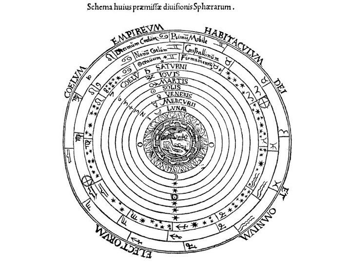
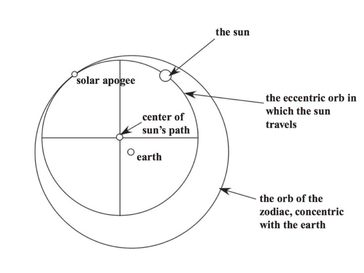
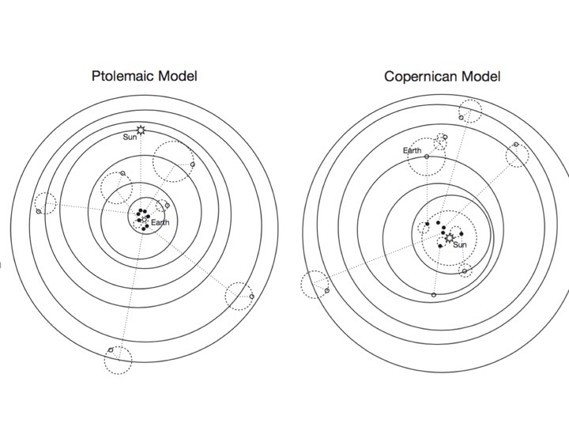
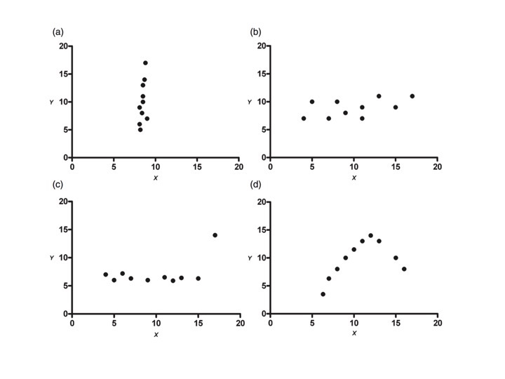

--- 
title: "Reprodutseeritav andmeanalüüs kasutades R keelt"
author: "Taavi Päll, Ülo Maiväli"
date: "`r Sys.Date()`"
site: bookdown::bookdown_site
output: bookdown::gitbook
documentclass: book
bibliography: [book.bib, packages.bib]
biblio-style: apalike
link-citations: yes
colorlinks: yes
github-repo: rstats-tartu/lectures
description: "Praktilise kursuse 'Reprodutseeritav andmeanalüüs R keeles' materjalid."
cover-image: assets/img/cover.png
---


```{r setup, include=FALSE}
knitr::write_bib(c(.packages(), 'bookdown', 'knitr', 'rmarkdown'), 'packages.bib')
knitr::opts_chunk$set(dev = 'svg')
options(htmltools.dir.version = FALSE, 
        formatR.indent = 2, 
        width = 55, 
        digits = 4, 
        warnPartialMatchAttr = FALSE, 
        warnPartialMatchDollar = FALSE)
```

# Haara kannel, Vanemuine! {-}

```{r fig.align='center', echo=FALSE, include=identical(knitr:::pandoc_to(), 'html')}
knitr::include_graphics('assets/img/cover.png', dpi = NA)
```

Bayesi tõlgenduses on tõenäosus teadlase usu määr mingi hüpoteesi kehtimisse. 
Hüpotees võib näiteks olla, et järgmise juulikuu sademete hulk Vilsandil jääb vahemikku 22 kuni 34 mm. 
Kui arvutus annab selle hüpoteesi tõenäosuseks 0.57, siis oleme me selle teadmise najal nõus maksma mitte rohkem kui 57 senti kihlveo eest, mille alusel makstakse juhul, kui see hüpotees tõeseks osutub, välja 1 euro (ja me saame vähemalt 43 senti kasumit).  


<!--chapter:end:index.Rmd-->


# Bayesi ja sagedusliku statistika võrdlus

```{r vrdlslibs}
library(tidyverse)
library(rethinking)
library(ggthemes)
library(brms)
```

## Kaks statistikat: ajaloost ja tõenäosusest

Bayesiaanlik ja sageduslik statistika leiutati üksteise järel Pierre-Simon Laplace poolt, kes arendas välja kõigepealt bayesiaanliku statistika alused ning seejärel sagedusliku statistika omad (ca. 1800 - 1812). 
Sagedusliku statistika tekkimise ja õitsengu, mis kulmineerus 20. sajandil, põhjusteks olid arvutuslik lihtsus ning tõenäosuse sagedusliku tõlgenduse sobivus 20 saj esimeses pooles käibinud teadusfilosoofiatega - eeskätt loogilise postivismiga. 
1930-1980-ndatel valitses akadeemiliste statistikute seas seisukoht, et Bayesi statistika on surnud ja maha maetud, ning selle arendamisega tegelesid vaid üksikud inimesed, kes sageli olid füüsikaliste teaduste taustaga (Jeffreys, Jaynes). 


Alates 1960-e keskpaigast arendati bayesiaanlust USA sõjaväe egiidi all, kuna seal oli piisav juurdepääs arvutivõimsusele, kuid seda tehti paljuski salastatult. 
Bayesi meetoditega ei olnud võimalik korralikult tsiviilteadust teha enne 1990-ndaid aastaid, mil personaalarvutite levik algatas buumi nende meetodite arendamises. 
Praegu on maailmas bayesiaanlikku ja sageduslikku statistikat umbes pooleks (vähemalt uute meetodite arendustöö poole pealt). 

> Eestis bayesiaanlik statistika 2017 aasta seisuga peaaegu, et puudub. 

1930ndatel kodifitseeris Andrei Kolmogorov tõenäosusteooria aksioomid (3 aksioomi), mis ütlevad lühidalt, et tõenäosused jäävad 0 ja 1 vahele ning, et üksteist välistavate ja hüpoteesiruumi ammendavate hüpoteeside tõenäosused summeeruvad ühele. 
Selgus, et Bayesi teoreem on lihtsa aritmeetika abil tuletatav Kolmogorovi aksioomidest. 
Tagantjärele saame öelda, et bayesiaanlik statistika on mitte ainult tõenäosusteooriaga kooskõlas vaid ka, et Bayesi teoreem on parim võimalik viis sellist kooskõla saavutada (see on 1950ndate tarkus - Coxi teoreem). 
On ka teada, et kui tõenäosused on fikseeritud nulli ja ühega, siis taandub Bayesi teoreem klassikalisele lausearvutuslikule loogikale. 
See tähendab, et klassikaline loogika on bayesiaanluse erijuht.
Seevastu sageduslik statistika püüab saavutada mõistlikke lahendusi arvutuslikult lihtsamate meetoditega, mille hinnaks on formaalse kooskõla puudumine tõenäosusteooriaga. 
Seega kujutab sageduslik statistika endast kogumit *ad hoc* meetodeid, mis ei tähenda muidugi, et sellest kasu ei võiks olla. 
Küll aga tähendab see, et kuigi sageduslike mudeleid on lihtsam arvutada, on neid raskem ehitada ja mõista ning, et sageduslike testide, milliseid on viimase saja aasta jooksul loodud 10 000 ringis, tulemusi on raskem tõlgendada.  


> Kahe statistika põhiline erinevus ei tulene matemaatikast vaid tõenäosuse tõlgendusest.


Bayesi tõlgenduses on tõenäosus teadlase usu määr mingi hüpoteesi kehtimisse.
Hüpotees võib näiteks olla, et järgmise juulikuu sademete hulk Vilsandil jääb vahemikku 22 kuni 34 mm. 
Kui Bayesi arvutus annab selle hüpoteesi tõenäosuseks 0.57, siis oleme me selle teadmise najal nõus maksma mitte rohkem kui 57 senti kihlveo eest, mille alusel makstakse juhul, kui see hüpotees tõeseks osutub, välja 1 EUR (ja me saame vähemalt 43 senti kasumit).  

Sageduslikud teoreetikud usuvad, et selline tõenäosuse tõlgendus on ebateaduslik, kuna see on "subjektiivne". 
Nimelt on võimalik, et n teadlast arvutavad korrektselt samade andmete põhjal n erinevat tõenäosust ja usuvad seega samade tõendite põhjal erinevaid asju. 
Kui nad lähtuvad väga erinevatest taustauskumustest oma hüpoteeside kehtimise kohta, võivad nad lõpuks uskuda väga erinevaid asju. 
Seega, kui te usute, et teie taustateadmised ei tohi mõjutada järeldusi, mis te oma andmete põhjal teete, siis te ei ole bayesiaan. 
Siinkohal pakub alternatiivi tõenäosuse sageduslik tõlgendus. 
Sageduslik tõenäosus on defineeritud kui teatud tüüpi andmete esinemise pikaajaline suhteline sagedus. 
Näiteks, kui me viskame münti palju kordi, siis peaks kullide (või kirjade) suhteline sagedus meile andma selle mündi tõenäosuse langeda kiri üleval. 
Selline tõenäosus on omistatav ainult sellistele sündmustele, mille esinemisel on sagedus. 
Kuna teaduslik teooria ei ole selline sündmus, ei ole sageduslikus statistikas võimalik rääkida ka hüpoteesi kehtimise tõenäosusest. 
Sageduslik lahendus on selle asemel, et rääkida meie hüpoteesi tõenäosusest meie andmete korral, rääkida andmete, mis sarnanevad meie andmetega, esinemise tõenäosusest null-hüpoteesi (mis ei ole meie hüpotees) kehtimise korral. 
Seega omistatakse sagedus ehk tõenäosus andmetele, mitte hüpoteesile. 

## Poleemika: kumbki tõenäosus pole päris see, mida üldiselt arvatakse

Bayesi tõenäosus ei anna tegelikult seda tõenäosusnumbrit, mida me reaalselt peaksime kihlveokontoris kasutama. 
Ta annab numbri, millest me lähtuksime juhul, kui me usuksime, et selle numbri arvutamisel kasutatud statistilised mudelid kirjeldavad täpselt maailma. 
Paraku, kuna mudeldamine on oma olemuselt kompromiss mudeli lihtsuse ja ennustusvõime vahel, ei ole meil põhjust sellist asja uskuda. 
Seega ei peaks me bayesi tõenäosusi otse maailma üle kandma, vähemalt mitte automaatselt. 
Bayes ei ütle meile, mida me reaalselt usume. 
Ta ei ütle, mida me peaksime uskuma. Ta ütleb, mida me peaksime uskuma tingimuslikult.

Sageduslik tõenäosus on hoopis teine asi. 
Seda on võimalik vaadelda kahel viisil: 

1. imaginaarsete andmete esinemissagedus nullhüpoteesi all; 

2. reaalsete sündmuste esinemise sagedus. 

Teise vaate kohaselt on sageduslik tõenäosus päriselt olemas. See on samasugune füüsikaline nähtus nagu näiteks auto kiirus, mõõdetuna liiklusmiilitsa poolt. 

> Kui kaks politseinikku mõõdavad sama auto kiirust ja 1. saab tulemuseks 81 km/h ning 2. saab 83 km/h, siis meie parim ennustus auto kiiruse kohta on 82 km/h. Kui aga 1. mõõtmistulemus on 80 km/h ja teine 120 km/h, siis meie parim hinnang ei ole 100 km/h. Enne sellise hinnangu andmist peame tegema lisatööd ja otsustama, kumb miilits oma mõõtmise kihva keeras. Ja me ei otsusta seda mitte oodatavast trahvist lähtuvalt, vaid neutraalseid objektiivseid asjaolusid vaagides. Seda sellepärast, et autol on päriselt kiirus olemas ja meil on hea põhjus, miks me tahame seda piisava täpsusega teada. Sagedusliku statistiku mõõteriist on statistiline mudel ja mõõtmistulemus on tõenäosus, mis jääb 0 ja 1 vahele.

Õpikunäidetes on sündmusteks, mille esinemise sagedust tõenäosuse abil mõõdetakse, enamasti täringuvisked, ehk katsesüsteemi reaalne füüsikaline funktsioneerimine.
Pane tähele, et need on inimtekkelised sündmused (loodus ei viska täringuid).
Teaduses on sündmused, millele tõenäosusi omistatakse, samuti inimtekkelised: selleks sündmuseks on teadlase otsus H0 ümberlükkamise kohta, mille tegemisel ta lähtub p (või q) väärtusest ja usaldusnivoost. 
Siin vastab auto kiirusele tüüp 1 vigade tegemise sagedus. 
See sagedus on inimtekkeline, aga sellest hoolimata päriselt olemas ja objektiivselt mõõdetav. 
Kui 2 teadlast mõõdavad seda paraleelselt ja saavad piisavalt erineva tulemuse (näiteks väga erineva FDR-i), võib olla kindel, et vähemalt üks neist eksib, ning peaks olema võimalik ausalt otsustada, kumb.


Sageduslikku tõenäosust on võimalik mõõta siis, kui sündmused, mille sagedust mõõdetakse (ümber lükatud null-hüpoteesid) on üksteisest sõltumatud. 
Tavapärane sageduslik statistika annab mitte lihtsalt valesid, vaid absurdselt valesid mõõtmistulemusi alati, kui mõõdetavad sündmused sõltuvad tugevalt üksteisest (teades ühe sündmuse esinemise fakti, saab suure tõenäosusega ennustada teise esinemist). 
Näiteks, me mõõdame mass-spektroskoopiaga 2000 valgu tasemed katse-kontroll süsteemis ja lükkame neist kahest tuhandest 30 H0-i ümber, kui statistiliselt olulised. 
Me teeme seda lähtuvalt FDR (false discovery rate) kriteeriumist, mis tähendab, et me oleme mõõtnud sagedust, millega meie poolt ümber lükatud H0-d on tegelikult tõesed. 
Nüüd me avastame, et pooled ümber lükatud H0-d tähistavad valke, mis kõik kuuluvad samasse reguloni. 
Sellest teeme igati mõistliku järelduse, et meie katsetingimusel on see regulon inaktiveeritud. 
Paraku, see tähendab ühtlasi, et meie FDR on valesti mõõdetud, kusjuures see ülehindab väga tugevalt FDR-i reguloni kuuluvate valkude osas ja ilmselt alahindab FDR-i reguloni mittekuuluvate valkude osas. 
Seega, me oleme asjatult analüüsist välja jätnud teised selle reguloni valgud, mille q väärtus valele poole usaldusnivood jättis; ja samal ajal kulutame asjatult oma teadlaseajusid selleks, et välja mõelda seletusi, miks üks või teine reguloni mittekuuluv valk meie katses siiski oluline on. 
Me oleme politseinäite juures tagasi, aga seekord teame, et politsei ei saa enda käsutuses oleva aparatuuriga piisavalt täpselt kiirust mõõta, et trahvid kohtus püsima jääksid. 


Bayesiaanile ei ole see näide probleem. 
Ta inkorporeerib informatsiooni regulonide kohta oma mudelisse ja juhul kui regulonid on valkude tasemete muutuste seisukohast olulised, ei juhtu midagi muud, kui et tema mudeli võime ennustada tegelikke muutusi valkude tasemetes paraneb oluliselt. 
Me teame (avaldamata andmed), et kui bayesi mudeli struktuuri inkorporeerida info valkude kuuluvusest operonidesse, siis mudeli ennustusvõime kasvab dramaatiliselt.
See on loogiline, sest sama operoni valke toodetakse enamasti samalt mRNAlt ja mRNA tase määrab oluliselt valgu taseme. 
Aga see tähendab ka, et suure tõenäosusega on FDR-i mõõtmine igas seda tüüpi katses ebatäpne (kuigi me ei tea, millisel määral), sest sageduslikud mudelid ei talu sõltuvaid sündmusi (milleks operonidesse koondunud valgud ilmselt on).

## Võrdlev näide: kahe grupi võrdlus

Järgnevalt toome näite, kuidas bayesiaan ja sageduslik statistik lahendavad sama ülesande.
Meil on 2 gruppi, katse ja kontroll, millest kummagis 30 mõõtmist ja me soovime teada, kui palju katsetingimus mõjutab mõõtmistulemust. 
Meie andmed on normaaljaotusega ja andmepunktid, mida me analüüsime, on efektisuurused (katse1 - kontroll1 = es1 jne).

### Bayesiaan 
Statistiline küsimus on Bayesiaanil ja sageduslikul statistikul sama: kas ja kui palju erinevad kahe grupi keskväärtused? 
Bayesiaan alustab sellest, et ehitab kaks mudelit: andmete tõepäramudel ja taustateadmiste mudel ehk prior. 

Kui andmed on normaaljaotusega, siis on ka tõepäramudel normaaljaotus. 
Alustame sellest, et fitime oma valimiandmed (üksikud efekti suurused) normaaljaotuse mudelisse.

```{r vrdlssd, fig.cap="Paariviisiline katse - kontroll disain. Katset on korratud 30 korda. X-teljel on efektisuurused (ES). 30 üksikut efektisuurust on näidatud punktidena. Must joon näitab keskmist efektisuurust. Andmed on mudeldatud normaaljaotusena."}
set.seed(19)
## Function to provide density data
densfun <- function(x, data, se = FALSE) {
  
  s <- sd(data)
  
  if(se) {
    s <- s / sqrt(length(data))
  }
  
  dnorm(x, mean(data), s)
}

a <- rnorm(30, 0.7, 4)
p <- tibble(a) %>% 
  ggplot(aes(a)) +
  xlim(-10, 10) +
  geom_vline(aes(xintercept = 0), linetype = 2) +
  geom_vline(aes(xintercept = mean(a))) +
  labs(x = "ES")
p + geom_dotplot(binwidth = 1, dotsize = 1/3) +
  stat_function(fun = densfun,
                args = list(data = a),
                colour = "red") +
  scale_y_continuous(NULL, breaks = NULL, 
                     limits = c(0, densfun(mean(a), a)))
```


See ei ole veel tõepäramudel, sest me tahame hinnangut ES **keskväärtuse** kõige tõenäolisemale väärtusele, ja lisaks veel hinnangut ebakindlusele selle punkt-hinnangu ümber (usalduslpiire).
Seega tuleb eelmine jaotus kitsamaks tõmmata, et ta kajastaks meie teadmisi ES-ide keskväärtuste, mitte individuaalsete ES-de, kohta. 
Uue jaotusmudeli sd = eelmise jaotuse sd/sqrt(30).

```{r vrdlsse, fig.cap="See jaotus iseloomustab keskmise ES paiknemist puhtalt meie andmete põhjal."}
p + geom_dotplot(binwidth = 1, dotsize = 1/3) + 
  stat_function(fun = densfun,
                args = list(data = a, se = TRUE),
                colour = "red") +
  scale_y_continuous(NULL, breaks = NULL, 
                     limits = c(0, densfun(mean(a), a, se = TRUE)))
```

Täpsemalt, selle joonise põhjal võib arvutada, milline on meie valimi keskväärtuse kohtamise tõenäosus igal võimalikul tõelisel ES-i väärtusel. 
Kõige tõenäolisemad on andmed siis, kui tegelik ES = andmete keskväärtusega (seda kohta näitab must joon). 
Kui me jagame musta joone pikkuse punase kurvi all läbi katkendjoone pikkusega sama kurvi all, saame teada, mitu korda on meie andmed tõenäolisemad siis, kui tegelik ES = mean(valimi ES), võrreldes olukorraga, kus tegelik ES = 0. 
Loomulikult võime sama näitaja arvutada ükskõik millise hüpoteeside paari kohta (näiteks, andmed on miljon korda tõenäolisemad hüpoteesi ES = 0.02 all kui hüpoteesi ES = -1 all; mis aga ei tähenda, et andmed oleksid väga tõenäolised kummagi võrreldud hüpoteesi all). 

Aga see ei ole veel Bayes. 
Lisame andmemudelile taustateadmiste mudeli. 
Sellega tühistame me väga olulise eelduse, mis ripub veskikivina sagedusliku statistika kaelas. 
Nimelt, et valimi andmed peavad olema esinduslikud populatsiooni suhtes. 
Me võime olla üsna kindlad, et väikeste valimite korral see eeldus ei kehti ja sellega seoses ei tööta ka sageduslik statistika viisil, milleks R.A. Fisher selle kunagi lõi.
Taustateadmiste mudeli peamine, kuigi mitte ainus, roll on mõjutada meie hinnangut õiges suunas vähendades halbade andmete võimet meile kahju teha. 
Kui sul on väike valim, siis sinu andmed vajavad sellist kantseldamist.

Olgu meie taustateadmise mudel normaaljaotus keskväärtusega 0 ja standardhälbega 1.

```{r vrdlssdse, fig.cap="Taustateadmiste mudel ehk prior on normaaljaotus (must joon), mille ülesanne on veidi vähendada ekstreemsete valimite kahjulikku mõju."}
p + stat_function(fun = densfun,
                args = list(data = a, se = TRUE),
                colour = "red") +
  stat_function(fun = densfun,
                args = list(data = rnorm(30))) +
  scale_y_continuous(NULL, breaks = NULL, 
                     limits = c(0, densfun(mean(a), a, se = TRUE)))
```

Taustateadmiste mudel on sageli normaaljaotus. 
Kui meil on palju taustateadmisi, siis on see jaotus kõrge ja kitsas, kui meil on vähe taustateadmisi, siis on see madal ja lai.

> Mida teha, kui sa ei taha, et taustateadmiste mudel sinu posteeriori kuju mõjutab? Sellisel juhul kasutatakse nõrgalt informatiivseid prioreid, mis tähendab, et priori jaotus on palju laiem kui tõepäramudeli laius. Miks mitte kasutada mitte-informatiivseid tasaseid prioreid? Põhjused on arvutuslikud, seega tehnilist laadi.

Igal juhul järgmise sammuna korrutab bayesiaan selle jaotuse andmejaotusega, saades tulemuseks kolmanda normaaljaotuse, mille ta seejärel normaliseerib nii, et jaotuse alune pindala = 1. 
See kolmas jaotus on posterioorne tõenäosusjaotus, mis sisaldab kogu infot, millest saab arvutada kõige tõenäolisema katseefekti suuruse koos ebakindluse määraga selle ümber (mida rohkem andmeid, seda väiksem ebakindlus) ja tõenäosused, et tegelik katseefekt jääb ükskõik milllisesse meid huvitavasse vahemikku.

Nüüd ei ole siis muud kui bayesi mudel läbi arvutada.
```{r vrdlsstan, cache=TRUE}
dfa <- data.frame(a)
m <- map2stan(
  alist(
    a ~ dnorm(mean = mu, sd = sigma),
    mu  ~ dnorm(0, 1), 
    sigma ~ dcauchy(0, 1)), 
  data = dfa)
```

```{r vrdlstriplot, fig.cap="Triplot. Bayesi väljund on posterioorne tõenäosusjaotus (roheline). Nagu näha, ei ole selle jaotuse tipp täpselt samas kohas kui andmejaotuse tipp ehk keskväärtus. Prior tõmbab seda veidi nulli suunas. Lisaks on posteerior veidi kitsam kui andmemudel, mis tähendab, et hinnang ES-le tuleb väiksema ebakindluse määraga."}
mm <- as.data.frame(m@stanfit)
ggplot(mm, aes(mu)) + 
  stat_density(color = "green", geom = "line") + 
  stat_function(fun = densfun,
                args = list(data = a, se = TRUE),
                colour = "red") +
  stat_function(fun = densfun,
                args = list(data = rnorm(30))) +
  scale_y_continuous(NULL, breaks = NULL) +
  xlim(-10, 10)
```

Posteerior sisaldab endas kogu infot, mis meil ES-i tõelise väärtuse kohta on. 
Siit saame arvutada:

1. parima hinnangu ES-i punktväärtusele, 

2. usaldusintervalli, ehk millisest ES-ide vahemikust loodame leida tõelise ES-i näit 90% tõenäosusega,

3. iga mõeldava ES-i väärtuste vahemiku kohta tõenäosuse, millega tõeline ES jääb sellesse vahemikku.

4. saame ES-i põhjal arvutada mõne muu statistiku, näiteks ES1 = log(ES), kasutades selleks ES-i posterioorset jaotust. Sel viisil kanname oma ES-i hinnangus peituva ebakindluse üle ES1-le, millele saame samuti rakendada punkte 1-3 (sest ES1 on posterioorne jaotus).

5. uute andmete lisandumisel saame kasutada ES-i posteeriorit uue priorina ja arvutada uue täiendatud posteeriori. Põhimõtteliselt võime seda teha pärast iga üksiku andmepunkti lisandumist. See avab ka head võimalused metaanalüüsiks.

6. lisaks saame oma algsest mudelist ka posteeriori andmepunkti tasemel varieeruvusele  (pole näidatud). Seda kasutame uute andmete simuleerimiseks (meie näites üksikud ES-d).

### Sageduslik statistik 
Sageduslik lähenemine sisaldab ainult ühte mudelit, mida võrreldakse valimi andmetega. 
Sageduslik statistik alustab selles lihtsas näites täpselt samamoodi nagu bayesiaan, tekitades eelmisega identse andmemudeli, mis on keskendatud valimi keskväärtusele \@ref(fig:vrdlsse).
Seejärel nihutab ta oma andmemudelit niipalju, et normaaljaotuse tipp ei ole enam valimi keskväärtuse kohal vaid hoopis 0-efekti kohal. Jaotuse laius nihutamisel ei muutu. 

```{r vrdlsnull, fig.cap="Nullhüpotees (must kõver) ja andmed (punane kõver)."}
p + stat_function(fun = densfun,
                args = list(data = a, se = TRUE),
                colour = "red") +
  stat_function(fun = dnorm,
                args = list(mean = 0, sd = sd(a)/sqrt(length(a)))) +
  scale_y_continuous(NULL, breaks = NULL, 
                     limits = c(0, densfun(mean(a), a, se = TRUE)))
```


Seda nullile tsentreeritud mudelit kutsutakse null-hüpoteesiks (H0). 
Nüüd võrdleb ta oma valimi keskväärtust (must joon) H0 jaotusega. 
Kui valimi keskväärtuse kohal on H0 jaotus kõrge, siis on andmete tõenäosus H0 kehtimise korral suur. 
Ja vastupidi, kui valimi keskväärtuse kohal on H0 madal, siis on andmete esinemise tõenäosus H0 all madal. 
Seda tõenäosust kutsutakse p väärtuseks. 
Mida väiksem on p, seda vähem tõenäolised on teie andmed juhul, kui H0 on tõene ja katseefekt võrdub nulliga. 
P on defineeritud kui "teie andmete või 0-st veel kaugemal asuvate andmete esinemise pikaajaline suhteline sagedus tingimusel, et H0 kehtib". 

### Tulemuste tõlgendamine
Kui sageduslik statistik kirjutab, et tema "efekti suurus on statistiliselt oluline 0.05 olulisusnivool", siis ta ütleb sellega, et tema poolt arvutatud p < 0.05.
Selle väite korrektne tõlgendus on, et juhul kui statistik pika aja jooksul võtab omaks "statistiliselt olulistena" kõik tulemused, millega kaasnev p  < 0.05 ja lükkab tagasi kõik tulemused, mille p > 0.05, siis sooritab ta 5% sagedusega tüüp 1 vigu. 
See tähendab, et igast sajast tõesest H0-st, mida ta testib, võtab ta keskeltläbi 5 vastu, kui statistiliselt olulised. 
Sageduslik statistika on parim viis tüüp 1 vigade sageduse pikaajaliseks fikseerimiseks. 


Paraku ei tea me ühegi üksiku testi kohta ette, kas see testib kehtivat või mittekehtivat H0-i, mis teeb raskeks katseseeriate ühekaupa tõlgendamise. 
Tuletame meelde, et sageduslikus statistikas ei saa rääkida H0 kehtimise tõenäosusest vaid peab rääkima andmete tõenäosusest (ehk andmete esinemise sagedusest) tingimusel, et H0 kehtib. 

**Kas ühte p väärtust saab tõlgendada kui hinnangut tõendusmaterjali hulgale, mida teie valim pakub H0 vastu?**
Selle üle on vaieldud juba üle 80 aasta, kuid tundub, et ainus viis seda kas või umbkaudu teha on bayesiaanlik. 
Igal juhul, p väärtust, mis on defineeritud pikaajalise sagedusena, on raske rakendada üksiksündmusele. 
Bayesiaanliku p väärtuste tõlgendamiskalkulaatori leiate aadressilt http://www.graphpad.com/quickcalcs/interpretPValue1/.

> Kujutle mass spektroskoopia katset, kus mõõdame 2000 valgu tasemeid katse-kontroll skeemis ja katset korratakse n korda. Sageduslik statistik kasutab adjusteeritud p väärtusi või q väärtusi, et tõmmata piir, millest ühele poole jäävad statistiliselt olulised ES-d ja teisele poole mitteolulised null-efektid. Edasi  tõlgendab ta mitteolulisi efekte kui ebaolulisi ja diskuteerib vaid "olulisi" efekte. Paraku, p väärtuste arvutamine ja adjusteerimine saab toimuda mitmel erineval moel ja usalduspiiri panekule just 95-le protsendile, mitte näiteks 89% või 99.2%-le, pole ühtegi ratsionaalset põhjendust. Seega tõmbab ta sisuliselt juhuslikus kohas joone läbi efektide, misjärel ignoreerib kõiki sellest joonest valele poole jäänud efekte. Meetod, mis väga hästi töötab pikaajalises kvaliteedikontrollis, ei ole kahjuks kuigi mõistlik katse tulemuste ükshaaval tõlgendamises. Mis juhtub, kui oleme kavalad ja proovime mitmeid erinevaid p väärtustega töötamise meetodeid, et valida välja see usalduspiir, millest õigele poole jäävaid andmeid on teaduslikult kõige parem tõlgendada? Ehkki ükshaaval võisid kõik meie poolt läbi arvutatud meetodid olla lubatud (ja isegi võrdselt head), ei fikseeri p nüüd enam tüüp 1 vigade sagedust. See tähendab, et p on kaotanud definitsioonijärgse tähenduse ja te oleksite võinud olulisuspiiri sama hästi tõmmata tunde järgi.

Tüüpiline tulemuse kirjeldus artiklis: 

1. sageduslik: _the effect is statistically significant (p < 0.01)_.

2. bayesiaanlik: _the most likely effect size is x (90% CI = x-low, x-high) and the probability that the true effect is < 0 is z percent_.

90% CI --- _credible interval_ --- tähendab, et me oleme 90% kindlad, et tegelik efekti suurus asub vahemikus x-low ... x-high. 

## Kahe paradigma erinevused 

1. sageduslikus statistikas võrdub punkt-hinnang tegelikule efekti suurusele valimi keskmise ES-ga. Bayesi statistikas see sageli nii ei ole, sest taustateadmiste mudel mõjutab seda hinnangut. Paljud mudelid püüavad ekstreemseid valimeid taustateadmiste abil veidi mõistlikus suunas nihutada, niiviisi vähendades ülepaisutatud efektide avaldamise ohtu.

2. sageduslik statistika töötab tänu sellele, et uurija võtab vastu pluss-miinus otsuseid: iga H0 kas lükatakse ümber või jäetakse kehtima. Seevastu bayesiaan mõtleb halli varjundites: sissetulevad andmed kas suurendavad või vähendavad hüpoteeside tõenäosusi (mis jäävad aga alati > 0 ja < 1).

3. p väärtused kontrollivad tüüp 1 vigade sagedust ainult siis, kui katse disaini ja hilisema tulemuste analüüsi detailid on enne katse sooritamist jäigalt fikseeritud (või eelnevalt on täpselt paika pandud lubatud variatsioonid katse- ja analüüsi protokollis). Eelkõige tähendab see, et valimi suurus ja kasutatavad statistilinsed testid peavad olema eelnevalt fikseeritud. Tüüpiliselt saame p väärtuse arvutada vaid üks kord ja kui p = 0.051, siis oleme sunnitud H0 paika jätma ning efekti deklareerimisest loobuma. Me ei saa lihtsalt katset juurde teha, et vaadata, mis juhtub. Bayesiaan seevastu võib oma posterioorse tõenäosuse arvutada kasvõi pärast iga katsepunkti kogumist ning katse peatada kohe (või alles siis), kui ta leiab, et tema posterioorne jaotus on piisavalt kitsas, et teaduslikku huvi pakkuda.

4. sagedusliku statistika pluss-miinus iseloom tingib selle, et kui tegelik efekti suurus on liiga väike, et sattuda õigele poole olulisusnivood, siis annavad statistiliselt olulisi tulemusi ülepaisutatud efektid, mida tekib tänu valimiveale. Nii saab süstemaatiliselt kallutatud teaduse. Bayesi statistikas seda probleemi ei esine, kuna otsused ei ole pluss-miinus tüüpi.

5. bayesi statistika ei fikseeri tüüp 1 vigade sagedust. See-eest võitleb see nn valehäirete vastu, milleks kaasajal kasutatakse enim hierarhilisi shrinkage mudeleid. See on bayesi vaste sageduslikus statistikas kasutatavatele multiple testingu korrektsioonidele. Kui sageduslik statistik võitleb valehäiretega p väärtusi adjusteerides ja selle läbi olulisusnivood nihutades, siis bayesiaan kasutab shrinkage mudelit, et parandada hinnanguid üksikute efektide keskväärtustele ja nende sd-le, kasutades paindlikult kogu andmesetis leiduvat infot.

See on kõik, mida me sagedusliku statistika kohta ütleme. 
Mitte miski, mis järgneb, ei eelda sagedusliku paradigma tundmist.

<!--chapter:end:01_vrdls_bayes_freq.Rmd-->


# Statistiline analüüs


```{r message=FALSE}
library(tidyverse)
library(rethinking)
library(ggthemes)
library(psych)
library(corrgram) 
library(modelr) #you may skip this
library(broom) #you may skip this
library(car) 
library(scatterplot3d) #you may skip this
```


## Suur ja väike maailm

Kuna maailmas on kõik kõigega seotud, on seda raske otse uurida. Teadus töötab tänu sellele, et teadlased lõikavad reaalsuse väikesteks tükkideks, kasutades tordilabidana teaduslike hüpoteese, ning uurivad seda tükikaupa lootuses, et kui kõik tükid on korralikult läbi nätsutatud, saab sellest taas tordi kokku panna. Tüüpiline bioloogiline hüpotees pakub välja tavakeelse (mitte matemaatilise) seletuse mõnele piiritletud loodusnähtusele. 
  
Näiteks antibiootikume uuritakse keemilise sideme tasemel kasutades orgaanilise keemia meetodeid. Antibiootikumide molekulaarseid märklaudu uuritakse molekulaarbioloogiliste meetoditega, nende toimet uuritakse rakubioloogia ja füsioloogia meetoditega, aga kaasajal on väga olulised ka ökoloogilised, evolutsioonilised, meditsiinilised, põllumajanduslikud, majanduslikud ja psühholoogilised aspektid. Kõigil neil tasanditel on loodud palju hüpoteese, millest kokku moodustub meie teadmine antibiootikumide kohta. Neid väga erinevaid asju, mida me kutsume hüpoteesideks, ühendab see, et neist igaüht võib võrrelda empiiriliste andmetega. Samuti, enamust neist saab kirjeldada matemaatiliste formalismide ehk mudelite abil, ja neid mudeleid saab omakorda võrrelda andmetega. Kuigi erinevate tasemete hüpoteesid on tavakeeles üksteisest väga erinevad, on neid kirjeldavad mudelid sageli matemaatiliselt sarnased.
  
  > Kui mudel on teooria lihtsustus, siis teooria on maailma lihtsustus.
  
Mudeliteks nimetatakse bioloogias väga erinevaid asju: skeeme, diagramme, füüsikalisi mudeleid (näit Watsoni ja Cricki poolt kasutatud nukleotiidimudelid), mudelorganisme, katsesüsteeme, matemaatilisi mudeleid jms. Üldiselt, mudelid asendavad selle, mida uuritakse millegagi, mida on lihtsam mõista, manipuleerida või uurida kui päris maailma. Meie räägime edaspidi siiski ainult matemaatilisest mudelist ja eriti selle erijuhust, statistilisest e stohhastilisest mudelist. 
  
Mis juhtub, kui teie hüpotees on andmetega kooskõlas? Kas see tähendab, et see hüpotees vastab tõele? Või, et see on tõenäoliselt tõene? Kahjuks on vastus mõlemale küsimusele eitav. Põhjuseks on asjaolu, et enamasti leiab iga nähtuse seletamiseks rohkem kui ühe alternatiivse teadusliku hüpoteesi ning rohkem kui üks üksteist välistav hüpotees võib olla olemasolevate andmetega võrdses kooskõlas. Asja teeb veelgi hullemaks, et teoreetiliselt on võimalik sõnastada lõpmata palju erinevaid teooriaid, mis kõik pakuvad alternatiivseid ja üksteist välistavaid seletusi samale nähtusele. Kuna hüpoteese on lõpmatu hulk, aga andmeid on alalti lõplik hulk, siis saab igas teaduslikus "faktis" kahelda.  
Kunagi ei või kindel olla, et parimad teooriad ei ole täiesti tähelepanuta jäänud ning, et meie poolt kogutud vähesed andmed kajastavad hästi kõiki võimalikke andmeid.

> Ca. 1910 mõtlesid filosoofid Russell ja Moore välja tõe vastavusteooria, mille kohaselt tõest propositsiooni eristab väärast "vastavus" füüsikalisele maailmale. Selle kohaselt on tõesed need laused, mis vastavad asjadele. Ehkki keegi ei oska siiani öelda, mida "vastavus" selles kontekstis ikkagi tähendab, või kuidas seda saavutada, on vastavusteooria senini kõige populaarsem tõeteooria filosoofide hulgas (mis on kõnekas alternatiivide kohta). Samamoodi, kui lausete vastavusest maailmaga, võime rääkida ka võrrandite (ehk mudelite) vastavusest lausetega. Vastavusest lausetaga sellepärast, et mudelid on koostatud teaduslike teooriate, mitte otse maailma, kirjeldusena. Seega ei pea me muretsema mudelite tõeväärtuse pärast. Võib lausa väita, et mudeli tõeväärtusest rääkimine on kohatu.

### Näide: politoloogia. 

Meil on hüpotees (H1), mille kohaselt demokraatlikus süsteemis käituvad valijad ratsionaalselt ehk lähtuvalt endi huvidest (Achen, C. H., & Bartels, L. M. (2016). Democracy for Realists). Alternatiiv (H2) ütleb, et valijad ei vali poliitikuid lähtuvalt oma tegelikest huvidest. Kuna H1 on liiga lai, et seda otse andmetega võrrelda, tuletame sellest kitsama alamhüpoteesi (H1.1), mille kohaselt valijad eelistavad tagasi valida kandidaate, kes on ennast tõestanud sellega, et saavad hakkama majanduse edendamisega. Seega, poliitikud, kes on võimekad majanduse vallas, valitakse tagasi suurema tõenäosusega kui need, kes seda ei ole. Sellest hüpoteesist tuletati kaks andemete vastu testitavat järelmit: H.1.1.1 -- majandusel läheb keskeltläbi paremini juba tagasi valitud poliitikute all kui esimest korda valitud poliitkute all, kelle ridu ei ole veel elektoraadi poolt harvendatud ja H.1.1.2 -- majandusnäitajate varieeruvus on esimesel juhul väiksem, sest kehvemad poliitikud on juba valimist eemaldatud. Esimese järelmi testimiseks kasutati statistilise mudelina (m1) aritmeetilist keskmist koos standardveaga ja teise järelmi jaoks (m2) standardhälvet. 

Tulemused olid paraku vastupidised H.1.1.1 ja H.1.1.2 poolt ennustatuga, millest autorid tegid järelduse, et olemasolevad andmed ei toeta hüpoteesi H1.1 (andmete vähesuse tõttu nad ei arvanud, et nad oleksid H1.1-e ümber lükanud). Seega, andmed fititi mudelitesse m1 ja m2, nende fittide põhjal tehti järeldused H1.1.1 ja H1.1.2 kohta (et m1 ja H1.1.1 ning m2 ja H1.1.2 vahel puudub kooskõla), mille põhjal omakorda tehti järeldus H1.1 kohta (et H1.1-e ei õnnestunud kinnitada), mille põhjal üksi ei tehtud formaalset järeldust H1 kohta. H1 vs. H2 kohta tehakse järeldus alles raamatu lõpus, lähtudes H1.1, H1.2, ..., H1.n kohta tehtud järeldustest.  

### Näide: populatsioonigeneetika.

Populatsioonigeneetikas on evolutsioon defineeritud kui alleelide sageduste muutumine põlvkonnast põlvkonda. Kõigepealt defineeriti tingimused, milliste kehtimisel alleelide sagedus EI muutu. Need on juhuslik sigimine populatsioonis, lõpmata suur populatsioon, mis koosneb diploidsetest organismidest, kellel on 1 geneetiline lookus ja 2 alleeli. See on Hardy-Weinbergi printsiip, millel põhineb enamus klassikalisest populatsioonigeneetikast ja mida kirjeldab võrrand 

*p^2^ + 2pq + q^2^ = 1* 

kus *p^2^*, *2pq* ja *q^2^* on genotüüpide *AA*, *Aa* ja *aa* sagedused sugurakkudes ning *p* ja *q* on alleelide *A* ja *a* sagedused (ning *p + q = 1*). Populatsioonis, mis on Hardy-Weinbergi tasakaalus, on *p* ja *q* põlvkondade vältel muutumatud. Selleks, et tasakaalu lõhkuda, toome mudelisse lisaparameetri *w*, mis iseloomustab valikusurvet ehk kohasust (fitnessi). Kohasus iseloomustab looduliku valiku poolt tingitud genotüüpide sageduste muutust populatsioonis. Nüüd saame deterministliku mudeli (deterministliku, sest mudeli parameetritele väärtused omistades ja mudeli läbi arvutades saame vastuseks vaid ühe arvu):

 *p^2^wAA + 2pqwAa + q^2^waa = w_mean* 
 
 kus *w_mean* on populatsiooni keskmine kohasus, *wAA* on genotüübi *AA* kohasus jne. Kui me teame parameetrite *p, q, wAA, wAa* ja *waa* väärtusi, saame hõlpsalt arvutada populatsiooni kohasuse. 
 
 Vaadates maailma mudeli pilgu läbi, juhul kui looduses mõõdetud genotüüpide sageduse muutus erineb mudelist arvutatud *w_mean*-ist, siis on meil tegemist geneetilise triiviga. Geneetiline triiv on genotüübisageduste juhuslik muutus populatsioonis, mis on seda suurem, mida väiksem on populatsioon ja mida väiksem on valikusurve populatsioonile. Seega oleks nagu võimalik geneetilise triivi olemasolu tuvastada alati, kui empiiriline genotüübisageduste muutuse kiirus erineb mudeli punktennustusest *w_mean*. Selle deterministliku mudeli järgi on valik ja triiv teineteist välistavad: kui empiiriline kohasus = *w_mean*, siis valik; muidu triiv.

Samas, kui me eeldame, et populatsiooni suurus ei ole lõpmata suur, tuleb mudelisse sisse juhuslik valimiviga. Mida väiksem on populatsioon, seda suurema tõenäosusega ei anna juhuslik paljunemine ka ilma valikusurveta populatsioonis järgmist põlvkonda, mille genotüübisagedused vastaksid eelmise põlvkonna genotüübisagedustele (ptk xxx simuleerime me juhuslikku valimiviga normaaljaotuse mudelist). Seega muutub meie deterministlik mudel stohhastiliseks mudeliks, mille väljund ei ole enam punktväärtus *w_mean*-le vaid rida tõenäosusi erinevatele *w_mean*-i väärtustele (sellise mudeli kuju vt ptk xxx). Selle mudeli järgi ei ole valik ja triiv enam erinevat tüüpi protsessid, vaid ühe kontiinumi kaks poolust; kontiinumi, mis sõltub populatsiooni suurusest ja valikusurve tugevusest. Kuna puhas looduslik valik saab mudeli järgi toimuda ainult lõpmata suures populatsioonis, milliseid looduses ei leidu, siis on alleeli *a* sageduse muutus teadlase poolt uuritavas looduslikus populatsioonis x ühtaegu nii loodusliku valiku kui geenitriivi tagajärg.
 
 Mis juhtub, kui me ei tee mudeli struktuurist otse järeldusi maailma kohta? Nüüd alustame me eeldusest, et looduslik valik on looduses reaalselt toimuv protsess. Näiteks Darwin nägi valikut loodusliku põhjusliku protsessina, mis on samas stohhastiline (mitte kõik kõrgema kohasusega organismid ei anna järglasi). Selle vaate kohaselt on loodusliku valiku tagajärjeks kallutatud valim genotüüpidest, mille avaldumise poolt põhjustatud erinevused organismides viisid nende erinevale paljunemisedukusele. Seega on valik ja triiv erinevat tüüpi looduslikud protsessid, mitte mudeli väljundid. Niisiis teeme rangelt vahet valikul ja triivil nende põhjuste järgi. Kui tõuseb kasulike genotüüpidega organismide osakaal, siis on tegemist loodusliku valiku poolt tingitud evolutsiooniga. Kui aga genotüüpide sageduste muutumine ei ole põhjustatud indiviidide füüsilistest erinevustest, siis on tegu geneetilise triivi poolt tingitud evolutsiooniga.
 
 Nõnda saame evolutsiooniteooriast lähtudes hoopis teistsuguse vaate bioloogiale, kui mudeleid otse tõlgendades. Muidugi ei tähenda see, et me ei vaja mudeleid. Vajame küll, aga me peame neid ettevaatlikult tõlgendama, pidades silmas oma teooriate sisu. Andemetega fititud mudelit tõlgendame teooria kaudu ja seda ei tohiks kunagi teha otse mudelist päris maailmale.

## Mudeli väike maailm

  Ülalmainitud teadusliku meetodi puudused tingivad, et meie huvides on oma teaduslikke probleeme veel ühe taseme võrra lihtsustada, taandades need statistilisteks probleemideks. Selleks tuletame tavakeelsest teaduslikust teooriast täpselt formuleeritud matemaatilise mudeli ning seejärel asume uurima oma mudelit lootuses, et mudeli kooskõla andmetega ütleb meile midagi teadusliku hüpoteesi kohta. Enamasti töötab selline lähenemine siis, kui mudeli ehitamisel arvestati võimaliku andmeid genereeriva mehhanismiga -- ehk, kui mudeli matemaatiline struktuur koostati teaduslikku hüpoteesi silmas pidades. Mudelid, mis ehitatakse silmas pidades puhtalt matemaatilist sobivust andmetega, ei kipu omama teaduslikku seletusjõudu, kuigi neil võib olla väga hea ennustusjõud. 
  
  > Meil on kaks hüpoteesi, A ja B. Juhul kui A on tõene ja B on väär, kas on võimalik, et B on tõele lähemal kui A? Kui A ja B on teineteist välistavad punkthüpoteesid parameetri väärtuse kohta, siis on vastus eitav. Aga mis juhtub, kui A ja B on statistilised mudelid? Näiteks, kui tõde on, et eesti meeste keskmine pikkus on 178.3 cm ja A ütleb, et keskmine pikkus jääb kuhugi 150 cm ja 220 cm vahele ning B ütleb, et see jääb kuhugi 179 cm ja 182 cm vahele, siis on B tõele lähemal selles mõttes, et meil on temast teaduslikus mõttes rohkem kasu. Siit on näha oluline erinevus teadusliku hüpoteesi ja statistilise mudeli vahel: hüpotees on orienteeritud tõele, samal ajal kui mudel on orienteeritud kasule.  
  
  Mudeli maailm erineb päris maailmast selle poolest, et mudeli maailmas on kõik sündmused, mis põhimõtteliselt võivad juhtuda, juba ette teada ja üles loendatud (seda sündmuste kogu kutsutakse parameetriruumiks). Tehniliselt on mudeli maailmas üllatused võimatud. 
  Lisaks, tõenäosusteooriat, ja eriti Bayesi teoreemi, kasutades on meil garantii, et me suudame mudelis leiduva informatsiooniga ümber käia parimal võimalikul viisil. Kõik see rõõm jääb siiski mudeli piiridesse.
Mudeli eeliseks teooria ees on, et hästi konstrueeritud mudel on lihtsamini mõistetav --- erinevalt vähegi keerulisemast teaduslikust hüpoteesist on mudeli eeldused ja ennustused läbinähtavad ja täpselt formuleeritavad. Mudeli puuduseks on aga, et erinevalt teooriast ei ole mingit võimalust, et mudel vastaks tegelikkusele. Seda sellepärast, et mudel on taotluslikult lihtsustav (erandiks on puhtalt ennustuslikud mudelid, mis on aga enamasti läbinähtamatu struktuuriga). Mudel on kas kasulik või kasutu; teooria on kas tõene või väär. Mudeli ja maailma vahel võib olla kaudne peegeldus, aga mitte kunagi otsene side. Seega, ükski number, mis arvutatakse mudeli raames, ei kandu sama numbrina üle teaduslikku ega päris maailma. Ja kogu statistika (ka mitteparameetriline) toimub mudeli väikses maailmas. Arvud, mida statistika teile pakub, elavad mudeli maailmas; samas kui teie teaduslik huvi on suunatud päris maailmale. Näiteks 95% usaldusintervall ei tähenda, et te peaksite olema 95% kindel, et tõde asub selles intervallis – sageli ei tohiks te seda nii julgelt tõlgendada isegi kitsas mudeli maailmas. 
  
  
### Näide: Aristoteles, Ptolemaios ja Kopernikus

Aristoteles (384–322 BC) lõi teooria maailma toimimise kohta, mis domineeris haritud eurooplase maailmapilti enam kui 1200 aasta vältel. Tema ühendteooria põhines maailmapildil, mis oli üldtunnustatud juba sajandeid enne Aristotelest ja järgneva 1500 aasta jooksul kahtlesid selles vähesed mõistlikud inimesed. Selle kohaselt asub universumi keskpunktis statsionaarne maakera ning kõik, mida siin leida võib, on tehtud neljast elemendist: maa, vesi, õhk ja tuli. Samas, kogu maailmaruum alates kuu sfäärist on tehtud viiendast elemendist (eeter), mida aga ei leidu maal (nagu nelja elementi ei leidu kuu peal ja sealt edasi). Taevakehad (kuu, päike, planeedid ja kinnistähed) tiirlevad ümber maa kontsentrilistes sfäärides, mille vahel pole vaba ruumi. Seega on kogu liikumine eetri sfäärides ühtlane ja ringikujuline ja see liikumine põhjustab pika põhjus-tagajärg ahela kaudu kõiki liikumisi, mida maapeal kohtame. Kaasa arvatud sündimine, elukäik ja surm. Kõik, mis maapeal huvitavat, ehk kogu liikumine, on algselt põhjustatud esimese liikumise poolt, mille käivitab kõige välimises sfääris paiknev meie jaoks mõistetamatu intellektiga "olend".  

```{r, fig.cap="Keskaegne aristotellik maailm.",fig.align='center',out.width=600, echo=FALSE}

```


Aristotelese suur teooria ühendab kogu maailmapildi alates meie mõistes keemiast ja kosmoloogiast kuni bioloogia, maateaduse ja isegi geograafiani. Sellist ühendteooriat on erakordselt raske ümber lükata, sest seal on kõik kõigega seotud.

 > Aristarchus (c. 310 – c. 230 BC) proovis seda siiski, väites, et tegelikult tiirleb maakera ümber statsionaarse päikese. Ta uskus ka, et kinnistähed on teised päikesed, et universum on palju suurem kui arvati (ehkki kaasaegne seisukoht oli, et universumi mastaabis ei ole maakera suurem kui liivatera) ning, et maakera pöörleb ümber oma telje. Paraku ei suutnud Aristarchuse geotsentriline teooria toetajaid leida, kuna see ei pidanud vastu vaatluslikule testile. Geotsentrilisest teooriast tuleneb nimelt loogilise paratametusena, et tähtedel esineb maalt vaadates parallaks. See tähendab, et kui maakera koos astronoomiga
      teeb poolringi ümber päikese, siis kinnistähe näiv asukoht taevavõlvil
      muutub, sest astronoom vaatleb teda teise nurga alt. Pange oma nimetissõrm
      näost u 10 cm kaugusele, sulgege parem silm, seejärel avage see ning sulgege
      vasak silm ja te näete oma sõrme parallaksi selle näiva asukoha muutusena.
      Mõõtmised ei näidanud aga parallaksi olemasolu (sest maa trajektoori diameeter 
      on palju lühem maa kaugusest tähtedest). Parallaksi suudeti esmest korda mõõta alles 1838, siis kui juba iga koolijüts uskus, et maakera tiirleb ümber päikese!

Ühte Aristotelese kosmoloogia olulist puudust nähti siiski kohe. Nimelt ei suuda Aristoteles seletada, miks osad planeedid teavavõlvil vahest suunda muudavad ja mõnda aega lausa vastupidises suunas liiguvad (retrogressioon). Kuna astronoomiat kasutasid põhiliselt astroloogid, siis põõrati planeetide liikumisele suurt tähelepanu. Lahenduseks ei olnud aga mitte suure teooria ümbertegemine või ümberlükkamine, vaid uue teaduse nõudmine, mis "päästaks fenomenid". Siin tuli appi Ptolemaios (c. AD 100 – c. 170), kes lõi matemaatilise mudeli, kus planeedid mitte lihtsalt ei liigu ringtrajektoori mõõda, vaid samal ajal teevad ka väiksemaid ringe ümber esimese suure ringjoone. Neid väiksemaid ringe kutsutakse epitsükliteks. See mudel suutis planeetide liikumist taevavõlvil piisavalt hästi ennustada, et astroloogide seltskond sellega rahule jäi. 

Ptolemaiosel ja tema järgijatel oli tegelikult mitu erinevat mudelit. Osad neist ei sisaldanud epitsükleid ja maakera ei asunud tema mudelites universumi keskel, vaid oli sellest punktist eemale nihutatud --- nii et päike ei teinud ringe ümber maakera vaid ümber tühja punkti. Kuna leidus epitsüklitega mudel ja ilma epitsükliteta mudel, mis andsid identseid ennustusi, on selge, et Aristotelese teooria ja fenomenide päästmise mudelid on põhimõtteliselt erinevad asjad. Samal ajal, kui Aritoteles **seletas** maailma põhiolemust põhjuslike seoste jadana (mitte matemaatiliselt), **kirjeldas/ennustas** Ptolemaios sellesama maailma käitumist matemaatiliste (mitte põhjuslike) struktuuride abil.

```{r, fig.cap="Ilma epitsükliteta ptolemailine mudel.", fig.align='center',out.width=600, echo=FALSE}

```


Nii tekkis olukord, kus maailma mõistmiseks kasutati Aristotelese ühendteooriat, aga selle kirjeldamiseks ja tuleviku ennustamiseks hoopis ptolemailisi mudeleid, mida keegi päriselt tõeks ei pidanud ja mida hinnati selle järgi, kui hästi need "päästsid fenomene". 

See toob meid Kopernikuse (1473 – 1543) juurde, kes teadusajaloolaste arvates vallandas 17. sajandi teadusliku revolutsiooni, avaldades raamatu, kus ta asetab päikese universumi keskele ja paneb maa selle ümber ringtrajektooril tiirlema. Kas Kopernikus tõrjus sellega kõrvale Aristotelese, Ptolemaiose või mõlemad? Tubdub, et Kopernikus soovis kolmandat, suutis esimest, ning et tolleaegsete lugejate arvates üritas ta teha teist --- ehk välja pakkuda alternatiivi ptolemailistele mudelitele, mis selleks ajaks olid muutunud väga keerukaks (aga ka samavõrra ennustustäpseks). Kuna Kopernikuse raamat läks trükki ajal, mil selle autor oli juba oma surivoodil, kirjutas sellele eessõna üks tema vaimulikust sõber, kes püüdis oodatavat kiriklikku pahameelt leevendada vihjates, et päikese keskele viimine on vaid mudeldamise trikk, millest ei tasu järeldada, et maakera ka tegelikult ümber päikese tiirleb (piibel räägib, kuidas jumal peatas taevavõlvil päikese, mitte maa). Ja kuna eessõna oli anonüümne, eeldasid lugejad muidugi, et selle kirjutas autor. Lisaks, kuigi Kopernikus tõstis päikese keskele, jäi ta planeetide ringikujuliste trajektooride juurde, mis tähendas, et selleks, et tema teooria fenomenide päästmisel hätta ei jääks, oli ta sunnitud maad ja planeete liigutama ümber päikese mõõda epitsükleid. Kokkuvõttes oli Kopernikuse mudel pea-aegu sama keeruline kui Ptolemaiose standardmudel ja selle abil tehtud ennustused planeetide liikumise kohta olid väiksema täpsusega. Seega, ennustava mudelina ei olnud tal suuri eeliseid ptolemailike mudelite ees.


```{r, fig.cap="Ptolemaiose ja Kopernikuse mudelid on üllatavalt sarnased.", fig.align='center',out.width=600, echo=FALSE}

```


> Kopernikuse mudel suutis siiski ennustada mõningaid nähtusi (planeetide näiv
    heledus jõuab maksimumi nende lähimas asukohas maale), mida
      Ptolemaiose mudel ei ennustanud. See ei tähenda, et need fenomenid oleksid
      olnud vastuolus Ptolemaiose mudeliga. Lihtsalt, nende Ptolemaiose mudelisse
      sobitamiseks oli vaja osad mudeli parameetrid fikseerida nii-öelda 
      suvalistele väärtustele. Seega Koperniku mudel töötas nii, nagu see oli, 
      samas kui Ptolemaiose mudel vajas ad hoc tuunimimst.  

Kui vaadata Koperniku produkti teooriana, mitte mudelina, siis oli sellel küll selgeid eeliseid Aristotelese maailmateooria ees. Juba ammu oli nähtud komeete üle taevavõlvi lendamas (mis Aristotelese järgi asusid kinnistähtede muutumatus sfääris), nagu ka supernoova tekkimist ja kadu, ning enam ei olnud kaugel aeg, mil Galileo joonistas oma teleskoobist kraatreid kuu pinnal, näidates, et kuu ei saanud koosneda täiuslikust viiendast elemendist ja et sellel toimusid ilmselt sarnased füüsikalised protsessid kui maal. On usutav, et kui Kopernikus oleks jõudnud oma raamatule ise essõna kirjutada, oleks tema teooria vastuvõtt olnud palju kiirem (ja valulisem). 


## Lineaarsed mudelid 
  
Oletame, et me mõõtsime N inimese pikkuse cm-s ja kaalu kg-s ning meid huvitab, kuidas inimeste pikkus sõltub nende kaalust. Lihtsaim mudel pikkuse sõltuvusest kaalust on pikkus = kaal (formaliseeritult: y = x) ja see mudel ennustab, et kui Johni kaal = 80 kg, siis John on 80 cm pikkune. siin on pikkus muutuja, mille väärtust ennustatakse ja kaal muutuja, mille väärtuste põhjal ennustatakse pikkusi. Selle mudeli saame graafiliselt kujutada nii:
 
```{r fig.height=3, fig.width=3}
x <- 0:100 #y = kaal
y <- x # x = pikkus 
plot(y~x, 
     type="l", 
     xlab="weight in kg", 
     ylab="heigth in cm")
```


Mudeli keeles tähistame me seda, mida me ennustame (antud juhul pikkus) Y-ga ja seda, mille väärtuse põhjal me ennustame (antud juhul kaal) X-ga. Seega sirge mudeli matemaatiline formalism on Y = X. 

See on äärmiselt jäik mudel: sirge, mille asukoht on rangelt fikseeritud. Sirge lõikab y telge alati 0-s (mudeli keeles: sirge intercept ehk lõikepunkt Y teljel = 0) ja tema tõusunurk saab olla ainult 45 kraadi (mudeli keeles: mudeli slope ehk tõus = 1). Selle mudeli jäikus tuleneb sellest, et temas ei ole parameetreid, mille väärtusi me saaksime vabalt muuta ehk tuunida.  

Mis juhtub, kui me lisame mudelisse konstandi, mille liidame x-i väärtustele? 

*y = a + x*

See konstant on mudeli parameeter, mille väärtuse võime vabalt valida. Järgnevalt anname talle väärtuse 30 (ilma konkreetse põhjuseta).

```{r fig.height=3, fig.width=3}
x <- 0:100 
a <- 30
y <- a + x 
plot(y~x, 
     xlim=c(0, 100), 
     ylim=c(0, 150), 
     col="red",
     type="l")
abline(c(0,1), lty=2)

```


Meie konstant a määrab *y* väärtuse, kui *x = 0*, ehk sirge lõikepunkti *y* teljel. 
Teisisõnu, a = mudeli intercept

Mis juhtub, kui me mitte ei liida, vaid korrutame *x*-i konstandiga? 

*y =  bx*

Jällegi, me anname mudeli parameetrile b suvalise väärtuse, 3.

```{r fig.height=3, fig.width=3}
x <- 0:200 #y = kaal
b <- 3
y <- b*x # x = pikkus 
plot(y~x, 
     xlim=c(0, 100), 
     ylim=c(0, 100), 
     col="red",
     type="l")
abline(c(0,1), lty=2)
```

Nüüd muutub sirge tõusunurk, ehk kui palju me ootame *y*-t muutumas, kui *x* muutub näiteks ühe ühiku võrra. Kui b = 3, siis *x*-i tõustes ühe ühiku võrra suureneb *y* kolme ühiku võrra. Proovi järgi, mis juhtub, kui b = -3.

Selleks, et sirget kahes dimensioonis vabalt liigutada, piisab kui me kombineerime eelnevad näited ühte: 

*y = a + bx* 

Selleks lisame mudelisse kaks parameetrit, intercept (a) ja tõus (b). Kui *a = 0* ja *b = 1*, saame me eelpool kirjeldatud mudeli *y = x*. Kui *a = 102*, siis sirge lõikab *y* telge väärtusel 102. Kui *b = 0.8*, siis *x*-i tõustes 1 ühiku võrra tõuseb *y*-i väärtus 0.8 ühiku võrra. Kui *a = 100* ja *b = 0*, siis saame sirge, mis on paraleelne x-teljega ja lõikab y-telge väärtusel 100. Seega, Teades a ja b väärtusi ning omistades x-le suvalise meid huvitava väärtuse, saab ennustada y-i keskmist väärtust sellel x-i väärtusel. Näiteks, olgu andmete vastu fititud mudel: 

pikkus(cm) = 102 + 0.8 * kaal(kg) ehk 

*y = 102 + 0.8x*. 

Omistades nüüd kaalule väärtuse 80 kg, tuleb mudeli poolt ennustatud keskmine pikkus 102 + 0.8 * 80 = 166 cm. Iga kg lisakaalu ennustab mudeli kohaselt 0.8 cm võrra suuremat pikkust.


```{r fig.height=3, fig.width=3}
a <- 102
b <- 0.8
x <-  0:100 
y <-  a + b * x
plot(y~x, 
     type="l", 
     xlab="weight in kg", 
     ylab="heigth in cm", 
     ylim=c(50, 200))
```

See mudel ennustab, et 0 kaalu juures on pikku 102 cm, mis on rumal, aga mudelite puhul tavaline, olukord. Me tuunime mudelit andmete peal, mis ei sisalda 0-kaalu. Meie valimiandmed ei peegelda täpselt inimpopulatsiooni. Sirge mudel ei peegelda täpselt pikkuse-kaalu suhteid vahemikus, kus meil on reaalseid kaaluandmeid; ja ta teeb seda veelgi vähem seal, kus meil mõõdetud kaalusid ei ole. Seega pole mõtet imestada, miks mudeli intercept meie üle irvitab.  

Kahe parameetriga sirge mudel ongi see, mida me fitime kahedimensiooniliste andmetega.
Näiteks nii:
```{r}
#read in the internal dataset iris
data(iris)
# fit a linear model and name the model object as m1
m1 <- lm(data=iris, Sepal.Length ~ Petal.Length)
# make a scatter plot, colored by the var called "Species"
plot(iris$Sepal.Length~iris$Petal.Length, col=iris$Species)
# draw the fitted regression line from m1
abline(m1)
```

Mudeli fittimine tähendab siin lihtsalt, et sirge on 2D ruumi asetatud nii, et see oleks võimalikult lähedal kõikidele punktidele.

> oletame, et meil on n andmepunkti ja et me fitime neile sirge. Nüüd plotime fititud sirge koos punktidega ja tõmbame igast punktist mudelsirgeni joone, mis on paraleelne y-teljega. Seejärel mõõdame nende n joone pikkused. Olgu need pikkused a, b, ... i. lm() funktsioon fitib sirge niimoodi, et summa a^2^ + b^2^ + ... i^2^ oleks minimaalne. Seda kutsutakse vähimruutude meetodiks.

Fititud koefitsientide väärtused saame nii
```{r}
coef(m1)
```

Siin a = (Intercept) ja b = Petal.Length ehk 0.41.

**ennustus lineaarsest mudelist**

Anname x-le rea väärtusi, et ennustada y keskmisi väärtusi nendel x-i väärtustel. 
Siin me ennustame y (Sepal_length) keskväärtusi erinevatel x-i (Petal_length) väärtustel, mitte individuaalseid Sepal_length väärtusi. Me kasutame selleks deterministlikku mudelit kujul Sepal_length =  a + b*Petal_length. Hiljem õpime ka bayesiaanlike meetoditega individuaalseid Sepal_length-e ennustama. 

Järgnev kood on sisuliselt sama, millega me üle-eelmisel plotil joonistasime mudeli y = a + bx. Me fikseerime mudeli koefitsiendid fititud irise mudeli omadega ja anname Petal_length muutujale 10 erinevat väärtust originaalse muutuja mõõtmisvahemikus. Aga sama hästi võiksime ekstrapoleerida ja küsida, mis on oodatav Sepal_length, kui Petal_length on 100 cm? Loll küsimus, aga mudel ei tea seda. Proovi seda kodus. 

```{r}
Petal_length <- seq(min(iris$Petal.Length), 
                    max(iris$Petal.Length), 
                    length.out = 10)
a <- coef(m1)[1]
b <- coef(m1)[2]

Sepal_length <-  a + b*Petal_length

plot(Sepal_length~Petal_length, type="b")
```

Siin ennustasime 10 y väärtust 10-l x-i väärtusel.


### Neli mõistet 

Mudelis *y = a + bx* on *x* ja *y* muutujad, ning *a* ja *b* on parameetrid. Muutujate väärtused fikseeritakse andmete poolt, parameetrid fititakse andmete põhjal. Fititud mudel ennustab igale *x*-i väärtusele vastava kõige tõenäolisema *y* väärtuse (*y* keskväärtuse sellel *x*-i väärtusel).
 
 > Y - mida me ennustame (dependent variable, predicted variable)
 
 > X - mille põhjal me ennustame (independent variable, predictor)
 
 > muutuja (variable) - iga asi, mida me valimis mõõdame (X ja Y on kaks muutujat). Muutujal on sama palju fikseeritud väärtusi kui meil on selle muutuja kohta mõõtmisandmeid.
 
 > parameeter (parameter) - mudeli koefitsient, millele võib omistada suvalisi väärtusi. Parameetreid tuunides fitime mudeli võimalikult hästi sobituma andmetega.
 
Mudel on matemaatilise formalism, mis püüab kirjeldada füüsikalist protsessi.
Statistilise mudeli struktuuris on komponent, mis kirjeldab ideaalseid ennustusi (nn protsessi mudel) ja eraldi veakomponent (ehk veamudel), mis kirjeldab looduse varieeruvust nende ideaalsete ennustuste ümber. Mudeli koostisosad on (i) muutuja, mille väärtusi ennustatakse, (ii), muutuja(d), mille väärtuste põhjal ennustatakse, (iii) parameetrid, mille väärtused fititakse ii põhjal ja (iv) konstandid.  

### Mudeli fittimine

Mudelid sisaldavad (1) matemaatilisi struktuure, mis määravad mudeli tüübi ning (2) parameetreid, mida saab andmete põhjal tuunida, niiviisi täpsustades mudeli kuju. 

Seda tuunimist nimetatakse mudeli fittimiseks. Mudelit fittides on eesmärk saavutada antud tüüpi mudeli maksimaalne sobivus andmetega. Näiteks võrrand *y = a + bx* määrab mudeli, kus *y = x* on on see struktuur, mis tagab, et mudeli tüüp on sirge, ning *a* ja *b* on parameetrid, mis määravad sirge asendi. Seevastu struktuur *y = x + x^2^* tagab, et mudeli *y = a + b~1~x + b~2~x^2^*  tüüp on parabool, ning parameetrite *a*, *b~1~* ja *b~2* väärtused määravad selle parabooli täpse kuju. Ja nii edasi. 

  > lineraarse mudeli parima sobivuse andmetega saab tagada kahel erineval viisil: 
    (i) vähimruutude meetod mõõdab y telje suunaliselt iga andmepunkti kauguse mudeli
    ennustusest, võtab selle kauguse ruutu, summeerib kauguste ruudud ning leiab sirge 
    asendi, mille korral see summa on minimaalne; 
    (ii) Bayesi teoreem annab väheinformatiivse priori korral praktiliselt sama fiti. 
  
 Hea mudel on 
 
 (1) võimalikult lihtsa struktuuriga, mille põhjal on veel võimalik teha järeldusi protsessi kohta, mis genereeris mudeli fittimiseks kasutatud andmeid; 
 
 (2) sobitub piisavalt hästi andmetega (eriti uute andmetega, mida ei kasutatud selle mudeli fittimiseks), et olla relevantne andmeid genereeriva protsessi kirjeldus; 
 
 (3) genereerib usutavaid simuleeritud andmeid.
 
 Sageli fititkse samade andmetega mitu erinevat tüüpi mudelit ja püütakse otsustada, milline neist vastab kõige paremini eeltoodud tingimustele. Näiteks, kui sirge suudab kaalu järgi pikkust ennustada paremini kui parabool, siis on sirge mudel paremas kooskõlas teadusliku hüpoteesiga, mis annaks mehhanismi protsessile, mille käigus kilode lisandumine viiks laias kaaluvahemikus inimeste pikkuse kasvule ilma, et pikkuse kasvu tempo kaalu tõustes langeks. 
 
 See, et teie andmed sobivad hästi mingi mudeliga, ei tähenda automaatselt, et see fakt oleks teaduslikult huvitav. Mudeli parameetrid on mõtekad mudeli matemaatilise kirjelduse kontekstis, aga mitte tingimata suure maailma põhjusliku seletamise kontekstis. Siiski, kui mudeli matemaatiline struktuur loodi andmeid genreeeriva loodusliku protsessi olemust silmas pidades, võib mudeli koefitsientide uurimisest selguda olulisi tõsiasju suure maailma kohta. 
 
 > Mudeli fittimine: X ja Y saavad oma väärtused otse andmetest; parameetrid võivad omandada ükskõik millise väärtuse.
 
 > Fititud mudelist ennustamine: X-le saab omistada ükskõik millise väärtuse; parameetrite väärtused on fikseeritud; Y väärtus arvutatakse mudelist.
  
####Üle- ja alafittimine
  
  Osad mudelite tüübid on vähem paindlikud kui teised (parameetreid tuunides on neil vähem liikumisruumi). Kuigi sellised mudelid sobituvad halvemini andmetega, võivad need  ikkagi paremini kui mõni paindlikum mudel välja tuua andmete peidetud olemuse. Mudeldamine eeldab, et me usume, et meie andmetes leidub nii müra (mida mudel võiks ignoreerida), kui signaal (mida mudel püüab tabada). Kuna mudeli jaoks näeb müra samamoodi välja, kui signaal, on iga mudel kompromiss üle- ja alafittimise vahel. Me lihtsalt loodame, et meie mudel on piisavalt jäik, et mitte liiga palju müra modelleerida ja samas piisavalt paindlik, et piisaval määral signaali tabada.
  
  Üks kõige jäigemaid mudeleid on sirge, mis tähendab, et sirge mudel on suure tõenäosusega alafittitud. Keera sirget kuipalju tahad, ikka ei sobitu ta enamiku andmekogudega. Ja need vähesed andmekogud, mis sirge mudeliga sobivad, on genereeritud teatud tüüpi lineaarsete protsesside poolt. Sirge on seega üks kõige paremini tõlgendatavaid mudeleid. Teises äärmuses on polünoomsed mudelid, mis on väga paindlikud, mida on väga raske tõlgendada ja mille puhul esineb suur mudeli ülefittimise oht. Ülefititud mudel järgib nii täpselt valimiandmeid, et sobitub hästi valimis leiduva juhusliku müraga ning seetõttu sobitub halvasti järgmise valimiga samast populatsioonist (igal valimil on oma juhuslik müra). Üldiselt, mida rohkem on mudelis tuunitavaid parameetreid, seda paindlikum on mudel, seda kergem on seda valimiandmetega sobitada ja seda raskem on seda tõlgendada. Veelgi enam, alati on võimalik konstrueerida mudel, mis sobitub täiuslikult kõikide andmepunktidega (selle mudeli parameetrite arv = N). Selline mudel on täpselt sama informatiivne kui andmed, mille põhjal see fititi --- ja täiesti kasutu.
  
  
```{r echo=FALSE, fig.height=3, fig.width=6}
df <- tibble(x=c(2, 3, 2.2, 5, 7, 8), 
             y=c(8, 5, 9, 10, 11, 10.1))
mod_e1 <- lm(y ~ x, data = df)
mod_e2 <- lm(y ~ poly(x, 2), data = df)
mod_e3 <- lm(y ~ poly(x, 3), data = df)
mod_e4 <- lm(y ~ poly(x, 4), data = df)
mod_e5 <- lm(y ~ poly(x, 5), data = df)

df %>% 
  tidyr::expand(df) %>% 
  gather_predictions(mod_e1, mod_e2, mod_e3, mod_e4, mod_e5) %>% 
  ggplot(aes(x, pred, colour = model)) +
  geom_line() +
  geom_point(aes(x, y), color="black", size=2) + theme_tufte() + xlab(NULL) + ylab(NULL)

```
*Joonis: Kasvava paindlikusega polünoomsed mudelid. mod_e1 on sirge võrrand y = a + b~1~x (2 parameetrit: a ja b~1~), mod_e2 on lihtsaim võimalik polünoom: y= a + b~1~x + b~2~x^2 (3 parameetrit), ..., mod_e5: y= a + b~1~x + b~2~x^2 + b~3~x^3 + b4x^4 + b5x^5 (6 parameetrit). mod_e5 vastab täpselt andmepunktidele (N = 6).*

Vähimruutude meetodil fititud mudeleid saame võrrelda AIC-i näitaja järgi. AIC  - Akaike Informatsiooni Kriteerium - vaatab mudeli sobivust andmetega ja mudeli parameetrite arvu. 
Väikseim AIC tähitab parimat fitti väikseima parameetrite arvu juures (kompromissi) ja väikseima AIC-ga mudel on eelistatuim mudel. Aga seda ainult võrreldud mudelite hulgas. AIC-i absoluutväärtus ei loe - see on suhteline näitaja.
```{r}
AIC(mod_e1, mod_e2, mod_e3, mod_e4, mod_e5)
```

AIC näitab, et parim mudel on mod_e4. Aga kas see on ka kõige kasulikum mudel? Mis siis, kui 3-s andmepunkt on andmesisestaja näpuviga?


    Ülefittimise vältimiseks kasutavad Bayesi mudelid informatiivseid prioreid, 
    mis välistavad ekstreemsed parameetriväärtused. 
    Vt http://elevanth.org/blog/2017/08/22/there-is-always-prior-information/ 


### kaks lineaarse mudeli laiendust. 

#### mitme sõltumatu prediktoriga mudel

Esiteks vaatame mudelit, kus on mitu prediktorit x~1~, x~2~, ... xn, mis on additiivse mõjuga. See tähendab, et me liidame nende mõjud, mis omakorda tähendab, et me usume, et x~1~...xn mõjud y-i väärtusele on üksteisest sõltumatud. Mudel on siis kujul 

*y = a + b~1~x~1~ + b~2~x~2~ + ... + bnxn*


> mitme prediktoriga mudeli iga prediktori tõus (beta koefitsient) ütleb, mitme ühiku võrra ennustab mudel y muutumist juhul kui see prediktor muutub ühe ühiku võrra ja kõik teised prediktorid ei muutu üldse. Seega pole teiste (kollapseeritud) prediktorite absoluutväärtus ennustusel oluline.


Kui meie andmed on mõõdetud 3D-s ja me tahame ennnustada ühe muutuja väärtust kahe teise muutuja väärtuste põhjal (meil on 2 prediktorit), siis tuleb meie 3 parameetriga lineaarne regressioonimudel tasapinna kujul. Kui meil on 4 prediktoriga mudel, siis me liigume 4-mõõtmelisse ruumi, jne. 3D ruumi on veel võimalik mõistlikult plottida.

```{r echo=FALSE}
library(scatterplot3d)  
data(iris)
# prepare a df of 3 cols: 
# Sepal.Length -- Sepal.Width -- Petal.Length (x -- y -- z)
  iris1 <- iris[,1:3]
   s3d <- scatterplot3d(iris1, angle=55, scale.y=0.7, pch=20, 
                        col.axis="blue", col.grid="lightblue" )
  my.lm <- lm(Sepal.Width ~ Sepal.Length + Petal.Length, data= iris1)
  s3d$plane3d(my.lm, lty.box = "solid")

```

Seda mudelit saab kaeda 2D ruumis, kui kollapseerida kolmas mõõde konstandile. 

```{r}
data(iris)
m1 <- lm(data=iris, Sepal.Width~Sepal.Length + Petal.Length)
plot(iris$Sepal.Width~iris$Sepal.Length, ylim=c(2,8), col=iris$Species)
abline(m1)
```

Enam ei läbi sirge punkte, nagu ta seda 3D ruumis tegi.

Võrlduseks ühe prediktoriga mudel
```{r}
m <- lm(data=iris, Sepal.Width~Sepal.Length)
plot(iris$Sepal.Width~iris$Sepal.Length, ylim=c(2,8), col=iris$Species)
abline(m)
```


Nõnda võrdleme kahe mudeli koefitsiente

```{r}
coef(m); coef(m1)
```

Nagu näha, mudeli m b~1~ koefitsient erineb oluliselt mudeli m1 vastavast koefitsiendist.

Kumb mudel on siis parem? AIC-i järgi on m1 kõvasti parem, kui m.
```{r}
AIC(m, m1)
```

**Ennustused sõltumatute prediktoritega mudelist**

Siin on idee kasutada fititud mudeli struktuuri enustamaks y keskmisi väärtusi erinevatel x~1~ ja x~2~ väärtustel. Kuna mudel on fititud, on parameetrite väärtused fikseeritud. 

```{r fig.height=3, fig.width=3}
Sepal_length <-  seq(min(iris$Sepal.Length), 
                     max(iris$Sepal.Length), 
                     length.out = 10) 
Petal_length <-  mean(iris$Petal.Length)
a <- coef(m1)[1]
b1 <- coef(m1)[2]
b2 <- coef(m1)[3]
Sepal_width <-   a + b1*Sepal_length + b2*Petal_length
plot(Sepal_width~Sepal_length, 
     type="b", 
     ylim=c(0, 5), 
     col="red")
abline(c(coef(m)[1], coef(m)[2]), lty=2) #prediction from the single predictor model
```


Nüüd joonistame 3D pildi olukorrast, kus nii *x~1~* kui *x~2~* omandavad rea väärtusi. Mudeli ennustus on ikkagi sirge kujul -- mis sest, et 3D ruumis.

```{r}
#library(rgl) #plot3d()
library(scatterplot3d)
Sepal_length <-  seq(min(iris$Sepal.Length), 
                     max(iris$Sepal.Length), 
                     length.out = 10) 
Petal_length <-  seq(min(iris$Petal.Length), 
                     max(iris$Petal.Length), 
                     length.out = 10) 
a <- coef(m1)[1]
b1 <- coef(m1)[2]
b2 <- coef(m1)[3]
Sepal_width <-   a + b1*Sepal_length + b2*Petal_length
df <- data.frame(Sepal_width=Sepal_width, 
                 Sepal_length=Sepal_length, 
                 Petal_length=Petal_length)
scatterplot3d(df$Sepal_length, 
              df$Petal_length, 
              df$Sepal_width, 
              col.axis="blue", 
              col.grid="lightblue", 
              type="l", lwd=2)
```


#### Interaktsioonimudel - ühe prediktori mõju sõltub teise prediktori väärtusest

*y = a + b~1~x~1~ + b~2~x~2~ + b~3~x~1~x~2~*

Interaktsioonimudeli koefitsientide tõlgendamine on keerulisem. b~1~ on otse tõlgendatav ainult siis, kui x~2~=0 (ja b~2~ ainult siis, kui x~1~=0).  Hiljem õpime selliseid mudeleid graafiliselt tõlgendama. Mudeli koefitsientide otse tõlgendamine ei ole siin sageli perspektiivikas.

> Interaktsioonimudelis sõltub x~1~ mõju tugevus y-le x~2~ väärtusest. Selle sõltuvuse määra kirjeldab b~3~ (x~1~ & x~2~ interaktsiooni tugevus). Samamoodi ja sümmeetriliselt erineb ka x~2~ mõju erinevatel x~1~ väärtustel. Ainult siis, kui x~2~ = 0, ennustab x~1~ tõus 1 ühiku võrra y muutust b~1~ ühiku võrra.

Interaktsioonimudeli 2D avaldus on kurvatuuriga tasapind, kusjuures kurvatuuri määrab b~3~. 

Interaktsiooniga mudel on AIC-i järgi pisut vähem eelistatud võrreldes m1-ga. Seega, eriti lihtsuse huvides, eelistame m1-e.
```{r}
m2 <- lm(data=iris, 
         Sepal.Width~Sepal.Length + 
           Petal.Length + 
           Sepal.Length*Petal.Length) 
AIC(m, m1, m2)
```


**ennustused interaktsioonimudelist**  

Kõigepealt anname rea väärtusi x~1~-le ja hoiame x~2~ konstantsena. 

```{r}
Sepal_length <-  seq(min(iris$Sepal.Length), 
                     max(iris$Sepal.Length), 
                     length.out = 100) 
Petal_length <-  mean(iris$Petal.Length)

a <- coef(m2)[1]
b1 <- coef(m2)[2]
b2 <- coef(m2)[3]
b3 <- coef(m2)[4]

Sepal_width <-   a + b1*Sepal_length + 
  b2*Petal_length + 
  b3*Sepal_length*Petal_length

plot(Sepal_width ~ Sepal_length, type="l", ylim=c(2, 6))
abline(m1, lty=2)
```

Tulemuseks on sirge, mis on paraleelne ilma interaktsioonita mudeli ennustusele (katkendjoon)


Nagu näha, korrutamistehe viib selleni, et interaktsioonimudeli tõus erineb ilma interaktsioonita mudeli tõusust. 

Kui aga interaktsioonimudel plottida välja 3D-s üle paljude x~1~ ja x~2~ väärtuste, saame me regressioonikurvi (mitte sirge), kus b~3~ annab kurvatuuri.


```{r}
Sepal_length <-  seq(min(iris$Sepal.Length), 
                     max(iris$Sepal.Length), 
                     length.out = 100) 
Petal_length <-  seq(min(iris$Petal.Length), 
                     max(iris$Petal.Length), 
                     length.out = 100) 
a <- coef(m2)[1]
b1 <- coef(m2)[2]
b2 <- coef(m2)[3]
b3 <- coef(m2)[4]

Sepal_width <-   a + b1*Sepal_length + 
  b2*Petal_length + 
  b3*Sepal_length*Petal_length

df <- data.frame(Sepal_width=Sepal_width, 
                 Sepal_length=Sepal_length, 
                 Petal_length=Petal_length)
scatterplot3d(df$Sepal_length, 
              df$Petal_length, 
              df$Sepal_width, 
              col.axis="blue", 
              col.grid="lightblue", 
              type="l", lwd=2)
```

Vau! See on alles ennustus!


## Veamudel
  
Eelpool kirjeldatud mudelid on deterministlikud --- nad ei sisalda hinnangut andmete varieeruvusele ennustuse ümber. Neid kutsutakse ka **protsessi mudeliteks** sest nad modelleerivad protsessi täpselt. Ehk, kui mudel ennustab, et 160 cm inimene kaalub keskmiselt 80 kg, siis protsessi mudel ei ütle, kui suurt pikkusest sõltumatut kaalude varieeruvust võime oodata 160 cm-ste inimeste hulgas. Selle hinnangu andmiseks tuleb mudelile lisada veel üks komponent, **veamudel** ehk veakomponent, mis sageli tuuakse sisse normaaljaotuse kujul. Veakomponent modelleerib üksikute inimeste kaalude varieeruvust (mitte keskmise kaalu varieeruvust) igal mõeldaval ja mittemõeldaval pikkusel. Tänu sellele ei ole mudeli ennustused enam deterministlikud, vaid tõenäosuslikud. 

  > Bioloogid, erinevalt füüsikutest, usuvad, et valimisisene andmete varieeruvus on
   tingitud pigem bioloogilisest varieeruvusest, kui mõõtmisveast. Aga loomulikult sisaldub selles ka mõõtmisviga. Lihtsuse huvides räägime
    edaspidi siiski veamudelist, selle asemel, et öelda "bioloogilise varieeruvuse ja veamudel".

Kuidas veakomponent lineaarsesse mudelisse sisse tuua?

ilma veakomponendita mudel: 

*y = a + bx*

ennustab y-i keskväärtust erinevatel x-i väärtustel.

Veakomponent tähendab, et andmepunkti tasemel varieerub *y*-i väärtus ümber mudeli poolt ennustatud keskväärtuse. Lineaarsetes mudelites modelleeritakse seda varieeruvust normaaljaotusega (vahest ka studenti t jaotusega):

*y ~ dnorm(mu, sigma)* 

kus *mu* on mudeli poolt ennustatud keskväärtus ja *sigma* on mudeli poolt ennustatud standardhälve ehk varieeruvus andmepunktide tasemel. Tilde ~ tähistab seose tõenäosuslikkust. Veamudelis on keskväärtuse ehk mu ennustus endiselt deterministlik ja sigma töötab originaalsel andmetasemel, mitte keskväärtuste tasemel. See võimaldab protsessi mudeli veamudelisse sisse kirjutada lihtsalt mu ümber defineerides:

*mu = a + bx*, 

mis tähendab, et

*y ~ dnorm(a + bx, sigma)*

See ongi sirge mudel koos veakomponendiga. Seega on sellel lineaarsel regressioonimudelil kolm parameetrit: intercept *a*, tõus *b* ja "veaparameeter" *sigma*. Sellist mudelit on mõistlik fittida Bayesi teoreemi abil. Bayesi meetodiga fititud mudel, mida kutsutakse posteerioriks, näitab, millised kombinatsioonid nendest kolmest parameetrist usutavalt koos esinevad, ja millised mitte. Seega on fititud 3 parameetriga bayesi mudel 3-dimensionaalne tõenäosusjaotus (3D posteerior). Muidugi saame ka ükshaaval välja plottida kolm 1D posteeriori, millest igaüks iseloomustab üht parameetrit ning on kollapseeritud üle kahe ülejäänud parameetri. 4. peatükis õpime selliste mudelitega töötama. 


> Kõik statistilised mudelid on tõenäosusmudelid ning sisaldavad veakomponenti.  


Muide, kõik veamudelid, millega me edaspidi töötame, modelleerivad igale x-i väärtusele (kaalule) sama suure y-i suunalise varieeruvuse (pikkuste sd). Suurem osa statistikast kasutab eeldusi, mida keegi päriselt tõe pähe ei võta, aga millega on arvutuslikus mõttes lihtsam elada.


## Enimkasutatud veamudel on normaaljaotus. 


Alustuseks simuleerime lihtsate vahenditega looduslikku protsessi, mille tulemusel tekib normaaljaotus.  
Oletame, et bakteri kasvukiirust mõjutavad 12 geeni, mille mõjud võivad olla väga erineva tugevusega, kuid mille mõjude suurused ei sõltu üksteisest. Seega nende 12 geeni mõjud kasvukiirusele liituvad.
Järgnevas koodis võtame 12 juhuslikku arvu 1 ja 100 vahel (kasutades runif() funktsiooni). Need 12 arvu näitavad 12 erineva geeni individuaalsete mõjude suurusi bakteritüve kasvukiirusele. Meil on seega kuni 100-kordsed erinevused erinevate geenide mõjude suuruste vahel. 
Seejärel liidame need 12 arvu. Nüüd võtame uue 12-se valimi ja kordame eelnevat. 
Me teeme seda 10 000 korda järjest ja plotime saadud 10 000 arvu (10 000 liitmistehte tulemust) tihedusfuntksioonina. 

```{r fig.height=2, fig.width=4}

kasv <- replicate( 10000 , sum( runif( 12, 1, 100 ) ) ) 
dens( kasv )
```

Selles näites võrdub iga andmepunkt 10 000st ühe bakteritüve kasvukiiruse mõõtmisega. Seega, antud eelduste korral on bakteritüvede kasvukiirused normaaljaotusega.

Nüüd vaatame, mis juhtub, kui 12 geeni mõjud ei ole üksteisest sõltumatud. Kui 12 geeni on omavahel vastasmõjudes, siis nende geenide mõjud korrutuvad, mitte ei liitu. (Korrutamine pole ainus viis, kuidas vastasmõjusid modeleerida, küll aga kõige levinum.)
Kõigepealt vaatleme juhtu, kus 12 geeni on kõik väikeste mõjudega ning seega mitte ühegi geeni mõju ei domineeri teiste üle.
Seekord genreerime 12 juhuslikku arvu 1 ja 1.1 vahel. Siin tähendab arv 1.1 kasvu tõusu 10% võrra. Seejärel korrutame need 12 arvu, misjärel kordame eelnevat 10 000 korda. 

```{r fig.height=2, fig.width=4}
kasv <- replicate( 10000 , prod( runif( 12, 1, 1.1 ) ) ) 
dens( kasv )
```

Tulemuseks on jällegi normaaljaotus.
Selles näites olid üksikud interakteeruvad geenid ükshaaval väikeste mõjudega ja ühegi geeni mõju ei domineerinud teiste üle. Mis juhtub, kui mõnel geenil on kuni 2 korda suurem mõju kui teisel?

```{r fig.height=2, fig.width=4}
kasv <- replicate( 10000 , prod( runif(12,1,2) ) ) 
dens( kasv )
```

Nüüd on tulemuseks log-normaaljaotus. Mis teie arvate, kas teie poolt uuritavat tunnust mõjutavad faktorid, mis omavahel ei interakteeru või kui interakteeruvad, on kõik ühtlaselt väikeste efektidega? Või on tegu vastasmõjudes olevate faktoritega, millest osad on palju suuremate mõjudega, kui teised? Ühel juhul eelistate te normaaljaotust, teisel juhul peate õppima töötama ka lognormaaljaotusega.

Kui me vaatame samu andmeid logaritmilises skaalas, avastame, et need andmed on normaaljaotusega. See ongi andmete logaritmimise mõte.

```{r fig.height=2, fig.width=4}
kasv <- replicate( 10000 , log10(prod( runif(12,1,2) ) ) )
dens( kasv )
```

## Normaaljaotuse mudel väikestel valimitel

Oletame, et meil on kolm andmepunkti ning me usume, et need andmed on juhuslikult tõmmatud normaaljaotusest või sellele lähedasest jaotusest. Normaaljaotuse mudelit kasutades me sisuliselt deklareerime, et me usume, et kui me oleksime olnud vähem laisad ja 3 mõõtmise asemel sooritanuks 3000, siis need mõõtmised sobituksid piisavalt hästi meie 3 väärtuse peal fititud normaaljaotusega. Seega, me usume, et omades 3 andmepunkti me teame juba umbkaudu, millised tulemused me oleksime saanud korjates näiteks 3 miljonit andmepunkti. Oma mudelist võime simuleerida ükskõik kui palju andmepunkte. 

Aga pidage meeles, et selle mudeli fittimiseks kasutame me ainult neid andmeid, mis meil päriselt on --- ja kui meil on ainult 3 andmepunkti, on tõenäoline, et fititud mudel ei kajasta hästi tegelikkust. 

> Halvad andmed ei anna kunagi head tulemust. 

Eelnev ei kehti Bayesi mudelite kohta, mis toovad priorite kaudu sisse lisainfot, mis ei kajastu valimiandmetes ja võib analüüsi päästa.

Kuidas panna skeptik uskuma, et statistilised meetodid töötavad halvasti väikestel valimitel? Siin aitab simulatsioon, kus me tõmbame 3-se valimi etteantud populatsioonist ning üritame selle valimi põhjal ennustada selleasama populatsiooni struktuuri. Kuna tegemist on simulatsiooniga, teame täpselt, et populatsioon, kust me tõmbame oma kolmese valimi, on normaaljaotusega, et tema keskväärtus = 0 ja et tema sd = 1. Me fitime oma valimi andmetega 2 erinevat mudelit: normaaljaotuse ja Studenti t jaotuse. 
  
```{r message=FALSE, fig.height=3, fig.width=4}
library(brms) #t jaotuse modelleerimiseks

#pakett ggfotify pakub alt lahendust jaotuste joonistamiseks
set.seed(19)
df <- tibble(a=rnorm(3))

df %>% ggplot(aes(x=a)) +
  geom_dotplot() + 
  stat_function(fun=dnorm, args=list(mean=mean(df$a),sd=sd(df$a)), colour="red") +
  stat_function(fun=dnorm, args=list(mean=0, sd=1), colour="blue") +
  stat_function(fun=dstudent_t, args=list(df=2, mu=mean(df$a), sigma=sd(df$a)))+
  xlim(-3, 3) + ylim(0, 0.55) + labs(x=NULL, y=NULL) + theme_tufte()
```

*Joonis: juhuvalim normaaljaotusest, mille keskmine=0 ja sd=1 (n=3; andmepunktid on näidatud mustade munadena). Sinine joon - popualtsioon, millest tõmmati valim; punane joon - normaaljaotuse mudel, mis on fititud valimi andmetel; must joon - Studenti t jaotuse mudel, mis on fititud samade andmetega.*

Siin saame hinnata mudelite fitte jumala positsioonilt, võrreldes fititud mudelite jaotusi "tõese" sinise jaotusega.
Mõlemad mudelid on süstemaatiliselt nihutatud väiksemate väärtuste poole ja alahindavad varieeruvust. t jaotuse mudel on oodatult paksemate sabadega ja ennustab 0-st kaugele palju rohkem väärtusi kui normaaljaotuse mudel. Kuna me teame, et populatsioon on normaaljaotusega, pole väga üllatav, et t jaotus modeleerib seda halvemini kui normaaljaotus. 

Igal juhul, mõni teine juhuvalim annaks meile hoopis teistsugused mudelid, mis rohkem või vähem erinevad algsest populatsioonist.

Mis juhtub kui me kasutame oma normaaljaotuse mudelit uute andmete simuleerimiseks? Kui lähedased on need simuleeritud andmed populatsiooni andmetega ja kui lähedased valimi andmetega, millega me normaaljaotuse mudeli fittisime?

```{r fig.height=3, fig.width=4}
set.seed(19) #muudab simulatsiooni korratavaks
#tõmbame 3 juhuslikku arvu normaalhaotusest, mille keskväärtus = 0 ja sd = 1.
df <- tibble(sample_data=rnorm(3)) 
#fitime normaaljaotuse mudeli valimi keskmise ja sd-ga
mean(df$sample_data); sd(df$sample_data)
#simuleerime 1000 uut andmepunkti fititud mudelist
simulated_data <- rnorm(1000, mean(df$sample_data), sd(df$sample_data))
#arvutame simuleeritud andmete keskmise ja sd ning joonistame neist histogrammi
mean(simulated_data); sd(simulated_data); hist(simulated_data)
```

Nagu näha, on uute (simuleeritud) andmete keskväärtus ja SD väga sarnased algsete andmete omale, mida kasutasime mudeli fittimisel. Kahjuks ei ole need aga kaugeltki nii sarnased algsele jaotusele, mille kuju me püüame oma andmete ja mudeli pealt ennustada. Seega on meie mudel üle-fittitud, mis tähendab, et ta kajastab liigselt neid valimi aspekte, mis ei peegelda algse populatsiooni omadusi. Loomulikult ei vasta ükski mudel päriselt tegelikkusele. Küsimus on pigem selles, kas mõni meie mudelitest on piisavalt hea, et olla kasulik. Vastus sellele sõltub, milleks plaanime oma mudelit kasutada.

```{r}
mean(simulated_data > 0); mean(simulated_data > 1)
```
Kui populatsiooniväärtustest on 50% suuremad kui 0, siis mudeli järgi vaevalt 32%. Kui populatsiooniväärtustest on 16% suuremad kui 1, siis mudeli järgi vaevalt 4%.
See illustreerib hästi mudeli kvaliteeti.

```{r}
library(brms)
sim_t <- rstudent_t(1000, 2, mean(df$sample_data), sd(df$sample_data))
mean(sim_t > 0); mean(sim_t > 1)
```
Samad ennustused t jaotusest on isegi paremad! Aga kumb on ikkagi parem mudel populatsioonile?


## normaaljaotuse ja lognormaaljaotuse erilisus

Normaaljaotus ja lognormaaljaotus on erilised sest 

(1) kesksest piirteoreemist (*central limit theorem*) tuleneb, et olgu teie valim ükskõik millise jaotusega, paljudest valimitest arvutatud **aritmeetilised keskmised** on alati enam-vähem normaaljaotusega. See kehtib enamuse andmejaotuste korral, kui n>30. Selle matemaatilise tõe peegeldus füüsikalisse maailma on "elementaarsete vigade hüpotees", mille kohaselt paljude väikeste üksteisest sõltumatute juhuslike efektide (vigade) summa annab tulemuseks normaaljaotuse. 
Paraku enamus bioloogilisi mõõtmisi annavad tulemuseks eranditult mitte-negatiivseid väärtusi. Sageli on selliste väärtuste jaotused ebasümmeetrilised (v.a. siis, kui cv = sd/mean on väike), ja kui nii, siis on meil sageli tegu lognormaaljaotusega, mis tekkib log-normaalsete muutujate korrutamisest. 
Siit tuleb Keskne piirteoreem 2, mille kohaselt suvalise jaotusega muutujate **geomeetrilised keskmised** on enam-vähem lognormaaljaotusega, ning elementaarsete vigade hüpotees 2: Kui juhuslik varieeruvus tekib paljude juhuslike efektide korrutamisel, on tulemuseks lognormaaljaotus. Lognormaaljaotusega väärtuste logaritmimine annab normaaljaotuse. 

(2) Nii normaal- kui lognormaaljaotus on maksimaalse entroopiaga jaotused. Entroopiat vaadeldakse siin informatsiooni & müra kaudu --- maksimaalse entroopiaga süsteem sisaldab maksimaalselt müra ja minimaalselt informatsiooni (Shannoni informatsiooniteooria). See tähendab, et väljaspool oma parameetrite tuunitud väärtusi on normaal- ja lognormaaljaotused minimaalselt informatiivsed. Näiteks normaaljaotusel on kaks parameetrit, mu ja sigma (ehk keskmine ja standardhälve). Seega, andes normaaljaotusele ette keskväärtuse ja standardhälbe fikseerime üheselt jaotuse ehk mudeli kuju ja samas lisame sinna minimaalselt muud (sooviamtut) informatsiooni. Teised maksimaalse entroopiaga jaotused on eksponentsiaalne jaotus, binoomjaotus ja poissoni jaotus. Maksimaalse entroopiaga jaotused sobivad hästi Bayesi prioriteks sest me suudame kontrollida, millist informatsiooni me neisse surume. 


## Küsimused, mida statistika küsib

Statistika abil saab vastuseid järgmisetele küsimustele:

1)  kuidas näevad välja teie andmed ehk milline on just teie andmete jaotus, keskväärtus, varieeruvus ja koos-varieeruvus? Näiteks, mõõdetud pikkuste ja kaalude koos-varieeruvust saab mõõta korrelatsioonikordaja abil.

2)  mida me peaksime teie valimi andmete põhjal uskuma populatsiooni parameetri tegeliku väärtuse kohta? Näiteks, kui meie andmete põhjal arvutatud keskmine pikkus on 178 cm, siis kui palju on meil põhjust arvata, et tegelik populatsiooni keskmine pikkus > 185 cm?

3)  mida ütleb statistilise mudeli struktuur teadusliku hüpoteesi kohta? Näiteks, kui meie poolt mõõdetud pikkuste ja kaalude koos-varieeruvust saab hästi kirjeldada kindlat tüüpi lineaarse regressioonimudeliga, siis on meil ehk tõendusmaterjali, et pikkus ja kaal on omavahel sellisel viisil seotud ja eelistatud peaks olema teaduslik teooria, mis just sellise seose tekkimisele bioloogilise mehhanismi annab.

4) mida ennustab mudel tuleviku kohta? Näiteks, meie lineaarne pikkuse-kaalu mudel suudab ennustada tulevikus kogutavaid pikkuse andmeid. Aga kui hästi?

> statistika ülesanne on lähtuvalt piiratud hulgast andmetest ja mudelitest kvantifitseerida parimal võimalikul viisil kõhedust, mida peaksime tundma vastates eeltoodud küsimustele.

Statistika ei vasta otse teaduslikele küsimustele ega küsimustele päris maailma kohta. Statistilised vastused jäävad alati kasutatud andmete ja mudelite piiridesse. Sellega seoses peaksime eelistama hästi kogutud rikkalikke andmeid ja paindlikke mudeleid. Siis on lootust, et hüpe mudeli koefitsientidest päris maailma kirjeldamisse tuleb üle kitsama kuristiku. Bayesil on siin eelis, sest osav statistik suudab koostöös teadlastega priori mudelisse küllalt palju kasulikku infot koguda. Samas, amatöör suudab bayesi abil samavõrra käkki keerata. Mida paindlikum on meetod, seda vähem automaatne on selle mõistlik kasutamine.

#  Kuidas näevad välja teie andmed?

## summaarsed statistikud

Summaarne statistik = üks number.  
Milliseid statistikuid arvutada ja milliseid vältida, sõltub statistilisest mudelist 

> summaarse statistika abil iseloomustame a) tüüpilist valimi liiget (keskmist), b) muutuja sisest varieeruvust, c) erinevate muutujate (pikkus, kaal vms) koos-varieeruvust

###  keskväärtused

Keskväärtust saab mõõta paaril tosinal erineval viisil, millest järgnevalt kasutame kolme või nelja. Enne kui te arvutama kukute, mõelge järele, miks te soovite keskväärtust teada. Kas teid huvitab valimi tüüpiline liige? Kuidas te sooviksite seda tüüpilisust defineerida? Kas valimi keskmise liikmena või valimi kõige arvukama liikmena? või veel kuidagi? 
See, millist keskväärtust kasutada sõltub sageli andmejaotuse kujust. Sümmeetrilisi jaotusi on lihtsam iseloomustada ja mitmetipulised jaotused on selles osas kõige kehvemad.

Järgnevad nõuanded on rangelt soovituslikud:

(1) Kui valim on normaaljaotusega (histogramm on sümmeetriline), hinda tüüpilist liiget läbi aritmeetilise keskmise (mean).  

(2) Muidu kasuta mediaani (median). Kui valim on liiga väike, et jaotust hinnata (aga > 4), eelista mediaani. Mediaani saamiseks järjestatakse mõõdetud väärtused suuruse järgi ja võetakse selle rea keskmine liige. Mediaan on vähem tundlik ekstreemsete väärtuste (outlierite) suhtes kui mean. 

(3) Valimi kõige levinumat esindajat iseloomustab mood ehk jaotuse tipp. Seda on aga raskem täpselt määrata ja mitmetipulisel jaotusel on mitu moodi. Töötamisel posterioorsete jaotustega on mood sageli parim lahendus. 

```{r echo=FALSE}
andmed <- rlnorm(100)
#mean(andmed); median(andmed)


mode <-  function(x, adjust=1) {
  x <- na.omit(x)
  dx <- density(x, adjust=adjust)
y_max <- dx$x[which.max(dx$y)] 
y_max
}
#mode(andmed)

plot(density(andmed, adjust=1))
abline(v=mode(andmed), col="red")
abline(v=median(andmed), col="blue")
abline(v=mean(andmed))

```

Joonis: Simuleeritud lognormaaljaotusega andmed. Punane joon - mood; sinine joon - mediaan; must joon - aritmeetiline keskmine (mean). Milline neist vastab parimini teie intuitsiooniga nende andmete "keskväärtusest"? Miks?


### muutuja sisene varieeruvus

Mean-iga käib kokku standardhälve (SD). 

SD on sama ühikuga, mis andmed (ja andmete keskväärtus). Statistikute hulgas eelistatud formaat on mean (SD), mitte mean (+/- SD). 1 SD katab 68% normaaljaotusest, 2 SD – 96% ja 3 SD – 99%. Normaaljaotus langeb servades kiiresti, mis tähendab, et tal on peenikesed sabad ja näiteks 5 SD kaugusel keskmisest paikneb vaid üks punkt miljonist. 

Näiteks: inimeste IQ on normaaljaotusega, mean=100, sd=15. See tähendab, et kui sinu IQ=115 (ülikooli astujate keskmine IQ), siis on tõenäosus, et juhuslikult kohatud inimene on sinust nutikam, 18% ((100% - 68%)/2  = 18%). 

Kui aga “tegelikul” andmejaotusel on “paks saba” või esinevad outlierid, siis normaaljaotust eeldav mudel tagab ülehinnatud SD ja seega ülehinnatud varieeruvuse. Kui andmed saavad olla ainult positiivsed, siis SD > mean/2 viitab, et andmed ei sobi normaaljaotuse mudeliga (sest mudel ennustab negatiivsete andmete esinemist küllalt suure sagedusega). 

> Standardhälve on defineeritud ka mõnede teiste jaotuste jaoks peale normaaljaotuse 
  (Poissioni jaotus, binoomjaotus). Funktsioon sd() ja selle taga olev võrrand sd = sqrt((mean(x) - x)**2/n - 1) on loodud normaaljaotuse tarbeks ja neid alternatiivseid standardhälbeid ei arvuta. Igale jaotusele, mida me oskame integreerida, saab ka integraali abil õige katvusega standardhälbe arvutada. Seega tasub meeles pidada, et tavapärane viis standardhälbe arvutamiseks kehtib normaaljaotuse mudeli piirides ja ei kusagil mujal!

Siiski, kui arvutada standardhälbe sd()-ga, võib olla kindel, jaotusest sõltumata hõlvavad 2 SD-d vähemalt 75% andmejaotusest.
Kui andmed ei sobi normaaljaotusesse ja te ei ole rahul tulemusega, mille tõlgendus on nii ebakindel kui 75 protsenti kuni 96+ protsenti, võib pakkuda kahte alternatiivset lahendust: 

####	(1) logaritmi andmed. 

Kui kõik andmeväärtused on positiivsed ja andmed on lognormaaljaotusega, siis logaritmimine muudab andmed normaalseks. Logaritmitud andmetest tuleks arvutada aritmeetiline keskmine ja SD ning seejärel mõlemad anti-logaritmida (näiteks, kui log2(10) = 3.32, siis antilogaritm sellest on 2**3.32 = 10). Sellisel juhul avaldatakse lõpuks geomeetriline keskmine ja multiplikatiivne SD algses lineaarses skaalas (multiplikatiivne SD = geom mean x SD; geom mean/SD). Geomeetriline keskmine on alati väiksem kui aritmeetiline keskmine. Lisaks on SD intervall nüüd asümmeetriline ja SD on alati > 0. See protseduur tagab, et 68% lognormaalsetest andmetest jääb 1 SD vahemikku ning 96% andmetest jääb 2 SD vahemikku.

Kui lognormaalsetele andmetele arvutada tavaline sd lineaarses skaalas kasutades sd() funktsiooni, siis tuleb SD sageli palju laiem kui peaks ja hõlmab ka negatiivseid väärtusi (pea meeles, et SD definitsiooni järgi jääb 96% populatsioonist 2 SD vahemikku).   
Sageli on aga negatiivsed muutuja väärtused võimatud (näiteks nädalas suitsetatud sigarettide arv). See on näide halvast mudelist! 

Kirjutame logaritmimise kaudu avaldatud multiplikatsiivse SD arvutamiseks funktsiooni mulitplicative_sd(): 

```{r }

multiplicative_sd <- function(x) {
  x <- na.omit(x)
  log_data <- log10(x)
  log_mean <- mean(log_data)
  log_sd <- sd(log_data)
  geom_mean <- 10**log_mean
  mult_sd <- 10**log_sd
  lower1 <- geom_mean/mult_sd
  upper1 <- geom_mean * mult_sd
  lower2 <- geom_mean/(mult_sd**2)
  upper2 <- geom_mean * (mult_sd**2)
  Mean <- mean(x)
  lower3 <- mean(x) - sd(x)
  upper3 <- mean(x) + sd(x)
  lower4 <- mean(x) - sd(x)*2
  upper4 <- mean(x) + sd(x)*2
  results <- tibble(SD=c("multiplicative_SD", 
                         "multiplicative_2_SD", 
                         "additive_SD", 
                         "additive_2_SD"), 
                    MEAN=c(geom_mean, 
                           geom_mean, 
                           Mean, 
                           Mean), 
                    lower=c(lower1, 
                            lower2, 
                            lower3, 
                            lower4), 
                    upper=c(upper1, 
                            upper2, 
                            upper3, 
                            upper4) )
  results
}

multiplicative_sd(andmed)
```

Tavalise aritmeetitilise keskmise asemel on meil nüüd geomeetriline keskmine.  Võrdluseks on antud ka tavaline (aritmeetiline) keskmine ja (aditiivne) SD. Additiivne SD on selle jaotuse kirjeldamiseks selgelt ebaadekvaatne (vt jaotuse pilti ülalpool ja võrdle mulitplikatiivse SD-ga).


Kuidas aga töötab multiplikatiivne standardhälve normaaljaotusest pärit andmetega? Kui multiplikatiivse sd rakendamine normaalsete andmete peal viib katastroofini, siis pole sel statistikul suurt kasutusruumi.
```{r}
set.seed(5363)
norm_andmed <- rnorm(3, 100, 20)
multiplicative_sd(norm_andmed)
```

Nagu näha, on multiplikatiivse sd kasutamine normaalsete andmetega pigem ohutu (kui andmed on positiivsed). Arvestades, et additiivne SD on lognormaalsete andmete korral kõike muud kui ohutu ning et lognormaaljaotus on bioloogias üsna tavaline (eriti ensüümreaktsioonide ja kasvuprotsesside juures), on mõistlik alati kasutada multiplicative_sd() funktsiooni. Kui mõlema SD väärtused on sarnased, siis võib loota, et andmed on normaalsed ning saab refereede rõõmuks avaldada tavapärase additiivse SD.

> kui n < 10, siis mõlemad SD-d alahindavad tehnilistel põhjustel tegelikku sd-d.  Ettevaatust väikeste valimitega!

Vahest tekkib teil vajadus empiiriliselt määrata, kas teie andmed on normaaljaotusega. 
Enne kui seda tegema asute, peaksite mõistma, et see, et teie valim ei ole normaalne, ei tähenda automaatselt, et populatsioon, millest see valim tõmmati, ei oleks normaaljaotusega.
Igal juhul, valimiandmete normaalsuse määramiseks on kõige mõistlikum kasutada qq-plotti. 
QQ-plot (kvantiil-kvantiil plot) võrdleb andmete jaotust ideaalse normaaljaotusega andmepunkti haaval. Kui empiiriline jaotus kattub referentsjaotusega, siis on tulemuseks sirgel paiknevad punktid. Järgneval qq plotil on näha, mis juhtub, kui plottida lognormaalseid andmeid normaaljaotuse vastu: 
```{r message=FALSE, fig.height=4, fig.width=4}
library(car)
qqPlot(andmed)
```

Nüüd joonistame qq-ploti logaritmitud andmetele. 

```{r fig.height=4, fig.width=4}
qqPlot(log2(andmed))
```

Pole kahtlust, andmed on logaritmitud kujul normaaljaotusega.

> qqPlot() võimaldab võrrelda teie andmeid ükskõik millise R-is leiduva jaotusega (?car::qqPlot). 

Normaaljaotuse kindlakstegemiseks on loodud ka peotäis sageduslikke teste, mis annavad väljundina p väärtuse. Nende kasutamisest soovitame siiski hoiduda, sest tulemused on sageli ebakindlad, eriti väikestel ja suurtel valimitel. Mõistlikum on vaadata kõikide andmepunktide plotti normaaljaotuse vastu, kui jõllitada ühte numbrit (p), mille väärtus, muuseas, monotooniliselt langeb koos valimi suuruse kasvuga.

#### (2) iseloomusta andmeid algses skaalas: mediaan (MAD). 

MAD –-- median absolute deviation --- on vähem tundlik outlierite suhtes ja ei eelda normaaljaotust. Puuduseks on, et MAD ei oma tõlgendust, mille kohaselt ta hõlmaks kindlat protsenti populatsiooni või valimi andmejaotusest. Seevastu sd puhul võime olla kindlad, et isegi kõige hullema jaotuse korral jäävad vähemalt 75% andmetest 2 SD piiridesse.

```{r}
mad(andmed, constant = 1); sd(andmed); mad(andmed)
```

```{r}
mad(log10(andmed), constant = 1); sd(log10(andmed)); mad(log10(andmed))
```

mad = median(abs(median(x) - x)), mida on väga lihtne mõista. Samas R-i funktsioon mad() korrutab default-ina mad-i läbi konstandiga 1.4826, mis muudab mad()-i tulemuse võrreldavaks sd-ga, tehes sellest sd robustse analoogi. Robustse sellepärast, et mad-i arvutuskäik, mis sõltub mediaanist, mitte aritmeetilisest keskmisest, ei ole tundlik outlierite suhtes. Seega, kui tahate arvutada mad-i, siis fikseerige mad() funktsioonis argument *constant* ühele.

> Ära kunagi avalda andmeid vormis: mean (MAD) või median (SD). 
  Korrektne vorm on mean (SD) või median (MAD).


### muutujate koos-varieeruvus

Andmete koos-varieeruvust mõõdetakse korrelatsiooni abil. Tulemuseks on üks number - korrelatsioonikordaja r, mis varieerub -1 ja 1 vahel. 

> r = 0 – kahte tüüpi mõõtmised (x=pikkus, y=kaal) samadest 
  mõõteobjektidest varieeruvad üksteisest sõltumatult. 
  r = 1: kui ühe muutuja väärtus kasvab, kasvab ka teise 
  muutuja väärtus alati täpselt samas proportsioonis. 
  r = -1: kui ühe muutuja väärtus kasvab, kahaneb teise 
  muutuja väärtus alati täpselt samas proportsioonis. 
    
Kui r on -1 või 1, saame me x väärtust teades täpselt ennustada y väärtuse (ja vastupidi, teades y väärrust saame täpselt ennustada x väärtuse).    
Kuidas tõlgendame aga tulemust r = 0.9? Mitte kuidagi. Selle asemel tõlgendame r2 = 0.9**2 = 0.81 – mis tähendab, et x-i varieeruvus suudab seletada 81% y varieeruvusest ja vastupidi, et Y-i varieeruvus suudab seletada 81% X-i varieeruvusest. 

Korrelatsiooni saab mõõta mitmel viisil (?cor.test, method=). Kõige levinum on Pearsoni korrelatsioonikoefitsient, mis eeldab, *(i)* et me mõõdame pidevaid muutujaid, *(ii)* et valim on esinduslik populatsiooni suhtes, *(iii)* et populatsiooniandmed on normaaljaotusega ja *(iv)* et igal mõõteobjektil on mõõdetud 2 omadust (pikkus ja kaal, näiteks). Tuntuim alternatiiv on mitteparameetriline Spearmani korrelatsioon, mis ei eelda andmete normaaljaotust ega seda, et mõõdetakse pidevaid suurusi (ordinaalsed andmed käivad kah). Kui kõik Pearsoni korrelatsiooni eeldused on täidetud ja te kasutate siiski Spearmani korrelatsiooni, siis on teie arvutus ca 10% vähemefektiivne.  


```{r}
#correlation<-cor.test(iris$Sepal.Length, 
# iris$Sepal.Width, na.rm=T, method = "pearson") 
#names(correlation)
#str(correlation)
#correlation$conf.int
cor(iris$Sepal.Length, iris$Sepal.Width, use="complete.obs") 
#complete.obs uses only such observations where neither x or y value is NA
#cor.test(iris$Sepal.Length, iris$Sepal.Width)
```


Korrelatsioonikordaja väärtus sõltub mitte ainult andmete koos-varieeruvusest vaid ka andmete ulatusest. Suurema ulatusega andmed X ja/või Y teljel annavad keskeltläbi 0-st kaugemal oleva korrelatsioonikordaja. Selle pärast sobib korrelatsioon halvasti näiteks korduskatsete kooskõla mõõtmiseks. 

Lisaks, korrelatsioonikordaja mõõdab vaid andmete *lineaarset* koos-varieeruvust: kui andmed koos-varieeruvad mitte-lineaarselt, siis võivad ka väga tugevad koos-varieeruvused jääda märkamatuks.

```{r,fig.cap="Anscombe'i kvartett illustreerib korrelatsioonikordaja lineaarset olemust: 4 andmestikku annavad identse nullilähedase korrelatsioonikordaja, ehkki tegelikud seosed andmete vahel on täiesti erinevad.",fig.align='center',out.width=600}

```


Moraal seisneb selles, et enne korrelatsioonikordaja arvutamist tasub alati plottida andmed, et veenduda võimaliku seose lineaarsuses. Lineaarsuse puudumine andmete koosvarieeruvuse mustris tähendab, et korrelatsioonikordaja tuleb kindlasti eksitav.
Kordamisküsimus: miks on paneelil a) r ligikaudu 0?

Korrelatsioonikordaja mõõdab pelgalt määra, mil üks muutuja muutub siis, kui teine muutuja muutub. Seega ei ole suurt mõtet arvutada korrelatsioonikordajat juhul kui me teame ette seose olemasolust kahe muutuja vahel. Näiteks, kui sama entiteeti mõõdetakse kahel erineval viisil, või kahes korduses, või kui esimene muutuja arvutatakse teise muutuja kaudu.

> Kõik summaarsed statistikud kaotavad enamuse teie andmetes leiduvast infost – see kaotus on õigustatud ainult siis, kui teie poolt valitud statistik iseloomustab hästi andmete sügavamat olemust (näiteks tüüpilist mõõtmistulemust või andmete varieeruvust).

Korrelatsioonimaatriksi saab niimoodi:
```{r }
#numeric columns only!
#the following gives cor matrix with 
#frequentist correction for mutliple testing:
#print(psych::corr.test(iris[-5]))

#only numeric cols allowed! Hence -Species
cor(iris[,-5]) 
```

  
  
## EDA --- eksploratoorne andmeanalüüs


Kui ühenumbriline andmete summeerimine täidab eelkõige kokkuvõtliku kommunikatsiooni eesmärki, siis EDA on suunatud teadlasele endale. EDA eesmärk on andmeid eelkõige graafiliselt vaadata, et saada aimu 1) andmete kvaliteedist ja 2) lasta andmetel kõneleda "sellisena nagu nad on" ja sugereerida uudseid teaduslikke hüpoteese. Neid hüpoteese peaks siis testima formaalse statistilise analüüsi abil (ptk järeldav statistika). Näiteid erinevate graafiliste lahenduste kohta vt graafika peatükist.

> EDA: mida rohkem graafikuid, seda rohkem võimalusi uute mõtete tekkeks!

EDA on rohkem kunst kui teadus selles mõttes, et teil on suur vabadus küsida selle abil erinevaid küsimusi oma andmete kohta. Ja seda nii tehnilisest aspektist lähtuvalt (milline on minu andmete kvaliteet?), kui teaduslikke küsimusi küsides (kas muutuja A võiks põhjustada muutusi muutujas B?).

Mõned üldised soovitused võib siiski anda.

1. alusta analüüsi tasemest, kus andmed on kõige inforikkamad --- toorandmete plottimisest punktidena. Kui andmehulk ei ole väga massiivne, näitab see hästi nii andmete kvaliteeti, kui ka võimalikke sõltuvussuhteid erinevate muutujate vahel.

Millised korrelatsioonid võiksid andmetes esineda?
```{r}
library(corrgram) #PCA for ordering

corrgram(iris, order=TRUE, 
         lower.panel = panel.pts,
         upper.panel = panel.ellipse,
         diag.panel = panel.density,
         main="Correlogram of Iris dataset")
```

2. vaata andmeid numbrilise kokkuvõttena.

```{r}
psych::describe(iris)
summary(iris)

```

Siin pööra kindlasti tähelepanu tulpadele min ja max, mis annavad kiire võimalusi outliereid ära tunda. Kontrolli, kas andmete keskmised (mediaan, mean ja trimmed mean) on üksteisele piisavalt lähedal --- kui ei ole, siis on andmete jaotus pika õlaga, ja kindlasti mitte normaalne. 
Kontrolli, kas erinevate muutujate keskväärtused ja hälbed on teaduslikus mõttes usutavas vahemikus. Ära unusta, et ka väga väike standardhälve võib tähendada, et teie valim ei peegelda bioloogilist varieeruvust populatsioonis, mis teile teaduslikku huvi pakub. 
NB! selles psych::describe() väljundis on mad läbi korrutatud konstandiga 1.4826, mis toob selle väärtuse lähemale sd-le. Seega on mad siin sd robustne analoog --- kui mad on palju väiksem sd-st, siis on karta, et muutujas on outliereid.

3. kontrolli NA-de esinemist oma andmetes VIM paketi abil või käsitsi (vt esimene ptk). Kontrolli, et NA-d ei oleks tähistatud mingil muul viisil (näiteks 0-i või mõne muu numbriga). Kui vaja, rekodeeri NAd. Mõtle selle peale, millised protsessid looduses võiksid genreerida puuduvaid andmeid. Kui NA-d ei jaotu andmetes juhuslikult, võib olla hea mõte andmeid imputeerida (vt hilisemaid ptk, bayesiaanlik imputeerimine). Näiteks, kui ravimiuuringust kukuvad eeskätt välja patsiendid, kellel ravim ei tööta, on ilmselt halb mõte nende patsientide andmed lihtsalt uuringust välja vistata (muidugi, kui te ei esinda kasumit taotleva ettevõtte huve). Kui NA-d jaotuvad juhuslikult, mõtle sellele, kas sa tahad NA-dega read tabelist välja visata, või hoopis osad muutujad, mis sisaldavad liiga palju NA-sid, või mitte midagi välja vistata. NB! NA-dega andmed ei sobi hästi regresiooniks.

4. Kui andmeid on nii palju, et üksikute andmepunktide vaatlemine paneb pea valutama, siis järgmine informatiivsuse tase on histogramm. 

5. kui tahame kõrvuti vaadata paljude erinevate muutujate varieeruvust ja keskväärtusi, siis on head valikud joyplot, violin plot, ja vähem hea valik (sest ta kaotab andmetest rohkem infot) on boxplot. Kui meil on vaid 2-4 jaotust, mida võrrelda, siis saab mängida histogramme facetisse või üksteise otsa pannes (vt ptk graphics).

6. Tulpdiagramm on hea valik siis, kui tahate kõrvuti näidata proportsioonide erinevust. Näiteks, kui meil on 3 liiki kalu, millest igas on erinevas proporstioonis parasiidid, võime joonistada 3 tulpa, millest igas on näidatud ühe kalaliigi parasiitide omavaheline proportsioon. 

7. Tulpdiagramm on hädaga pooleks kasutuskõlblik, kui iga muutuja kohta on vaid üks number, mida plottida. Kuigi, siin on meil parem võimalus --- clevelend plot. Me ei õpeta tulpade joonistamist olukorras, kus te tahate plottida valimi keskväärtust ja usalduspiire või varieeruvusnäitajat (sd, mad), sest selle jaoks on olemas paremad meetodid. Samas, ehki tulpdiagrammide kasutamine teaduskirjanduses on pikas langustrendis, kasutatakse neid ikkagi liiga palju just eelpoolmainitud viisil. 

8. Ära piirdu muutuja tasemel varieeruvuse plottimisega. Teaduslikult on sageli huvitavam mimte muutuja koosvarieerumine. Järgmistes peatükkides modelleerime seda formaalselt regresioonanalüüsis aga alati tasub alustada lihtsatest plottidest. Scatterplot on lihtne viis kovarieeruvuse vaatamiseks. 

9. Kui erinevad muutujad on mõõdetud erinevates skaalades (ühikutes), siis võib nende koosvarieeruvust olla kergem võrrelda, kui nad eelnevalt normaliseerida (kõigi muutujate keskväärtus = 0, aga varieeruvus jääb algsesse skaalasse), või standardiseerida (kõik keskväärtused = 0-ga ja sd-d = 1-ga). Standardiseerida tohib ainult normaaljaotusega muutujaid (seega võib olla vajalik muutuja kõigepealt logaritmida). normaliseerimine: arvuta igale valimi väärtusele: *mean(x) - x*; standardiseerimine: *(mean(x) - x)/sd(x)*.


10. Visualiseeringu valik sõltub valimi suurusest. Väikse valimi korral (N<10) boxploti, histogrammi vms kasutamine on lihtsalt rumal. Ära mängi lolli ja ploti parem punkti kaupa.

+ N < 20 - ploti iga andmepunkt eraldi (stripchart(), plot()) ja keskmine või mediaan. 

+ 20 > N > 100: geom_dotplot() histogrammi vaates

+ N > 100: geom_histogram(), geom_density() --- nende abil saab ka 2 kuni 6 jaotust võrrelda

+ Mitme jaotuse kõrvuti vaatamiseks, kui N > 15: geom_boxplot(), or geom_violin(), geom_joy() 


11. Nii saab plottida multiplikatiivse sd:
```{r fig.height=3, fig.width=4}
# Function to produce summary statistics (geometric mean and multipülicative sd)
multi_sd <- function(x) {
  x <- na.omit(x)
  a <- log10(x)
  b <- mean(a)
  c <- sd(a)
  g_mean <- 10**b
  msd <- 10**c
  ymin <- g_mean/msd
  ymax <- g_mean * msd
 return(c(y = g_mean, ymin = ymin, ymax = ymax)) 
}

ToothGrowth <- ToothGrowth
ToothGrowth$dose <- as.factor(ToothGrowth$dose)

ggplot(ToothGrowth, aes(x=dose, y=len)) + 
  geom_dotplot(binaxis='y', stackdir='center',
               stackratio=1.5, dotsize=0.6, fill="grey") + 
  stat_summary(fun.data=multi_sd, color="red", size=0.6, alpha=0.6) + 
  theme_tufte()
```


###  Kokkuvõte:

a.	Andmepunktide plottimine säilitab maksimaalselt andmetes olevat infot (nii kasulikku infot kui müra). Aitab leida outliereid (valesti sisestatud andmeid, valesti mõõdetud proove jms). Kui valim on väiksem kui 20, piisab täiesti üksikute andmepunktide plotist koos mediaaniga. Dot-plot ruulib.

b.	Histogramm – kõigepealt mõõtskaala ja seejärel andmed jagatakse võrdse laiusega binnidesse ja plotitakse binnide kõrgused. Bin, kuhu läks 20 andmepunkti on 2X kõrgem kui bin, kuhu läks 10 andmepunkti. Samas, bini laius/ulatus mõõteskaalal pole teile ette antud – ja sellest võib sõltuda histogrammi kuju. Seega on soovitav proovida erinevaid bini laiusi ja võrrelda saadud histogramme. Histogramm sisaldab vähem infot kui dot plot, aga võimaldab paremini tabada seaduspärasid & andmejaotust & outliereid suurte andmekoguste korral.

c. Density plot. Silutud versioon histogrammist, mis kaotab infot aga toob vahest välja signaali müra arvel. Density plotte on hea kõrvuti vaadelda joy ploti abil.

d.	Box-plot – sisaldab vähem infot kui histogramm, kuid neid on lihtsam kõrvuti võrrelda. Levinuim variant (kuid kahjuks mitte ainus) on Tukey box-plot – mediaan (joon), 50% IQR (box) ja 1,5x IQR (vuntsid), pluss outlierid eraldi punktidena.

e.	Violin plot – informatiivsuselt box-ploti ja histogrammi vahepeal – sobib paljude jaotuste kõrvuti võrdlemiseks

f.	Line plot – kasuta ainult siis kui nii X kui Y teljele on kantud pidev väärtus (pikkus, kaal, kontsentratsioon, aeg jms). Ära kasuta, kui teljele kantud punktide vahel ei ole looduses mõtet omavaid pidevaid väärtusi (näiteks X teljel on katse ja kontroll või erinevad valgumutatsioonid, mille aktiivsust on mõõdetud)

g.	Suhete võrdlemine (pie vs bar)

h.	Cleveland plot on hea countide jaoks. Kasuta Barplotti ainult siis, kui Cleveland plot vm plot mingil põhjusel ei sobi. 

i. Pie chart on proportsioonide vaatamiseks enam-vähem kõlblik ainult siis, kui teil pole vaja võrrelda proportsioone erinevates objektides. Kõik graafikud, kus lugeja peab võrdlema pindalasid, on inimmõistusele petlikud --- lugeja alahindab süstemaatiliselt erinevuste suurusi! Selle pärast on proportsioonide võrdlemiseks palju parem tulpdiagramm, kus võrreldavad tulbad on ühekõrgused, et proportsioonide erinevused iga tulba sees paremini tulpade vahel võrreldavad oleks.  

Informatsiooni hulk kahanevalt: 
iga andmepunkt plotitud ---> 
histogramm ---> 
density plot & violin plot ---> 
box plot ---> 
tulpdiagramm standardhälvetega ---> 
cleveland plot (ilma veapiirideta) 

# Jäta meelde:

1. Statistika jagatakse kolme ossa: kirjeldav (summary), uuriv (exploratory) ja järeldav (inferential).

2. Kirjeldav statistika kirjeldab teie andmeid summaarsete statistikute abil. 

3. uuriv statistika püstitab valimi põhjal uusi teaduslikke hüpoteese, kasutades selleks põhiliselt graafilisi meetodeid

3. Järeldav statistika kasutab formaalseid mudeleid, et kontrollida uuriva statistika abil püsitatud hüpoteese. Järeldav statistika teeb valimi põhjal järeldusi statistilise populatsiooni kohta, millest see valim pärineb. 

4. Need järeldused on alati ebakindlad; ka siis kui need esitatakse punkthinnanguna parameetriväärtusele. Nii punkthinnangud kui intervall-hinnangud on lihtsustused: tegelik ebakindluse määr on n-dimensionaalne tõenäosuspilv, kus n on mudeli parameetrite arv.

4. Statistika põhiline ülesanne on kvantifitseerida ebakindlust, mis ümbritseb järeldava statistika abil saadud hinnanguid. Selle ebakindluse numbriline mõõt on tõenäosus, mis jääb 0 ja 1 vahele.

5. tõenäosus omistab numbrilise väärtuse sellele, kui palju me usuksime hüpoteesi x kehtimisse, juhul kui me usuksime, et selle tõenäosuse arvutamiseks kasutatud statistilised mudelid vastavad tegelikkusele.

6. ükski statistiline mudel ei vasta tegelikkusele.


<!--chapter:end:02_sissejuhatus.Rmd-->


# Järeldav statistika


```{r}
library(tidyverse)
library(broom)
library(bayesboot)
library(boot)
library(rethinking)
```
 
Kui EDA määrab graafiliste meetoditega andmete kvaliteeti ja püstitab uusi hüpoteese, siis järeldav statistika püüab formaalsete arvutuste abil vastata kahele lihtsale küsimusele: 1. mis võiks olla kõige usutavam parameetriväärtus? ja 2. kui suur ebakindlus seda hinnangut ümbritseb? Kuna andmed tulevad meile lõpliku suurusega valimina koos mõõtmisveaga ja bioloogilise varieeruvusega, on ebakindlus hinnagusse sisse ehitatud. Hea protseduur kvantifitseerib selle ebakindluse ausalt ja täpselt -- siin ei ole eesmärk mitte niivõrd ebakindlust vähendada (seda teeme eelkõige katse planeerimise tasemel), vaid seda kirjeldada. 
Järeldav statistika püüab, kasutades algoritme ja mudeleid, teha andmete põhjal järeldusi looduse kohta. 

> ebakindluse allikad on mõõtmisviga (võib olla tsentreeritud õigele väärtusele, või mitte), valimiviga (juhuslik viga, mis sõltub valimi suurusest), bioloogiline varieeruvus, mudeli viga (kas maailm on lineaarne ja normaaljaotusega?), algoritmi viga kus algoritm ei tee seda, mida kasutaja tahab (eriti ohtlik mcmc algoritmide puhul) ja süstemaatiline viga (juhtub, kui te saate valesti aru oma katsesüsteemist, harrastate teaduslikku pettust või teete kõike muud, mis suunaliselt kallutab teie valimit tegelikkusest).

Sellisel tegevusel on mõtet ainult siis, kui ühest küljest andmed peegeldavad tegelikkust ja teisest küljest tegelikkus hõlmab enamat, kui lihtsalt meie andmeid. 
Kui andmed = tegelikkus, siis pole mõtet keerulisi mudeleid kasutada -- piisab lihtsast andmete kirjeldusest. 
Ja kui andmetel pole midagi ühist tegelikkusega, siis on need lihtsalt ebarelevatsed. 
Seega on järeldava statistika abil tehtud järeldused alati rohkem või vähem ebamäärased ning meil on vaja meetodit selle ebamäärasuse mõõtmiseks. Selle meetodi annab tõenäosusteooria.

## Järeldav statistika on tõenäosusteooria käepikendus

See õpik õpetab Bayesi statistikat, mis põhineb tõenäosusteoorial. Tänu sellele moodustab Bayesi statistika sidusa terviku, mille abil saab teha kõike seda, mida saab teha tõenäosusteooria abil. Bayesi statistika põhineb Bayesi teoreemil, mis on triviaalne tuletus tõenäosusteooria aksioomidest. Tänu Cox-i teoreemile (1961) teame, et klassikaline lausearvutuslik loogika on tõenäosusteooria erijuht ning, et Bayesi teoreem on teoreetiliselt parim viis tõenäosustega töötamiseks. Seega, kui te olete kindel oma väidete tõesuses või vääruses, siis on klassikaline loogika parim viis nendega opereerida; aga kui te ei saa oma järeldustes päris kindel olla, siis on teoreetiliselt parim lahendus tõenäosusteooria ja Bayesi teoreem.

Tõenäosusteooria on aksiomaatline süsteem, mille abil saame omistada numbriline väärtuse meie usu määrale mingisse hüpoteesi. Näiteks, kui me planeerime katset, kus me viskame kulli ja kirja ja teeme seda kaks korda, siis saame arvutada, millise tõenäosusega võime oodata katse tulemuseks kaht kirja. Aga seda tingimusel, et me võtame omaks mõned eeldused -- näiteks et münt on aus ja et need kaks viset on üksteisest sõltumatud. 

Sellel katsel on 4 võimalikku tulemust: H-H, H-T, T-H, T-T (H -kull, T - kiri). Tõenäosus saada 2-l mündiviskel 2 kirja, P(2 kirja) = 1/4, P(0 kirja) = 1/4 ja P(1 kiri) = 2/4 = 1/2. Sellega oleme andnud oma katseplaanile täieliku tõenäosusliku kirjelduse (pane tähele, et 1/4 + 1/4 + 1/2 = 1). Ükskõik kui keeruline on teie katseplaan, põhimõtteliselt käib selle analüüs samamoodi.
Tõenäosusteooria loomus seisneb kõikide võimalike sündmuste üleslugemises ning senikaua, kui me seda nüri järjekindlusega teeme, on vastus, mille me saame, tõsikindel.

Ehkki Bayesi statistika põhineb tõenäosusteoorial ja on sellega kooskõlas, ei ole see sama asi, mis tõenäosusteooria.
Statistikas pööratakse tõenäosusteoreetiline ülesanne pea peale ja küsitakse nii: kui me saime 2-l mündiviskel 2 kirja, siis millise tõenäosusega on münt aus (tasakaalus)? Erinevus tõenäosusteoreetilise ja statistilise lähenemise vahel seisneb selles, et kui tõenäosusteoorias me eeldame, et teame, kuidas süsteem on üles ehitatud, ja ennustame sellest lähtuvalt andmete tõenäosusi, siis statistikas me kontrollime neid eeldusi andmete põhjal. Seega annab tõenäosusteooria matemaatiliselt tõsikindlaid vastuseid ideaalmaailmade kohta, samas kui statistika püüab andmete põhjal teha kaudseid järeldusi päris maailma kohta. Selleks kasutame Bayesi teoreemi (vt allpool).

> Tõenäosusteooria määrab kõikide võimalike sündmuste esinemise tõenäosused, eeldades, et hüpotees H kehtib (H on siin lihtsalt teine nimi "eeldusele"). 

> Statistika arvutab H-i kehtimise tõenäosuse lähtuvalt kogutud andmetest, matemaatilistest mudelitest ning teaduslikest taustateadmistest. 

**Tõenäosusteooria aksioomid** ütlevad tõlkes inimkeelde, et tõenäosused (P) jäävad 0 ja 1 vahele, et *P(A) = 1* tähendab, et A on tõene, et *P(A) = 0* tähendab, et A on väär, ning kui A ja B on hüpoteesiruumi ammendavad üksteist välistavad hüpoteesid, siis *P(A) + P(B) = 1*. Need aksioomid peaksid olema iseenesestmõistetavad ja ainult neist on tuletatud kogu tõenäosusteooria.

Need aksioomid, mis oma matemaatilises vormis postuleeriti Andrei Kolmogorovi poolt ca 1930, on tuletatavad järgmistest eeldustest:

+ ratsionaalne mõtlemine vastab kvalitatiivselt tervele mõistusele: lisatõendusmaterjal hüpoteesi kasuks tõstab selle hüpoteesi usutavust.

+ mõtlemine peab olema konsistentne: kui me võime järeldusi teha rohkem kui ühel viisil, peame lõpuks ikkagi alati samale lõppjäreldusele jõudma

+ kogu kättesaadav relevantne informatsioon tuleb järelduste tegemisel arvesse võtta (totaalse informatsiooni printsiip)

+ ekvivalentsed teadmised on representeeritud ekvivalentsete numbritega. 

Kui tõenäosused on 0 või 1, siis taandub tõenäosusteooria matemaatliselt oma erijuhule, milleks on lausearvutuslik loogika. Lausearvutuse oluline erinevus tõenäosusteooriast on, et kui selle abil on saavutatud valiidne tulemus, on see tõsikindel ja uute andmete lisandumisel ei saa me seda tulemust muuta. Seevastu tõenäosusteoorias ja statstikas muudavad uued andmed alati tõenäosusi. Selles mõttes ei saa tõenäosuslik teadus kunagi valmis.

### formaalsed tuletused tõenäosusteooria aksioomidest

Me anname siin 9 tuletust ilma tõestuskäikudeta, mis on aga lihtsad. Siin võib A ja B vaadelda erinevate sündmustena või hüpoteesidena.

1. Kui B sisaldab endas A-d, siis $P(B) \leq P(A)$ 

2. kui A ja B on üksteisest sõltumatud, siis $P(A) = P(A | B)$ (definitsioon)

3. kui A ja B on üksteisest sõltumatud, siis $P(A & B) = P(A)P(B)$ 

4. kui A ja B on üksteist välistavad, siis $P(A \lor B) = P(A) + P(B)$ (tõenäosus, et A on tõene või B on tõene on nende tõenäosuste summa). kui A ja B ei ole üksteist välistavad, siis $P(A \lor B) = P(A) + P(B) – P(A & B)$

5. $P(A) = P(A & B) + P(A & mitte-B)$ --- see on "totaalse tõenäosuse seadus" kitsendatuna kahele ammendavale teineteist välistavale hüpoteesile A & B, mille kohaselt me peame hüpotees A tõenäosuse leidmiseks arvestama ka B tõenäosusega.

6. Tingliku tõenäosause definitsioon: $P(A | B) = P(A & B)/P(B)$ kus *P(A | B)* on tinglik tõenäosus: A tõenäosus tingimusel, et B kehtib. *P(vihm | pilves ilm)* ei ole sama, mis *P(pilves ilm | vihm)*. 

7. Punktist 6 tuleneb: $P(A & B) = P(A | B)P(B)$.

8. punktis 6 tuleneb totaalne tõenäosus: $P(A) = P(A | B)P(B) + P(A | notB)P(notB)$ 

9. punktis 6 tuleneb Bayesi teoreem: $P(A | B) = P(A)P(B | A)/P(B)$, kus $P(B) = P(A)P(B  A) + P(notA)P(B  notA)$  

Bayesi teoreemi kasutatakse sageli määramaks hüpoteesi tõenäosuse pärast uute faktide (andmete) lisandumist olemasolevatele teadmistele. 
Kui A on H~1~ ning mitte-A on ammendav ja välistav H~2~ ja B tähistab andmeid (data), saame Bayesi teoreemi ümber kirjutada 

$P(H1 | data) =  P(H1)P(data | H1) /( P(H1)P(data | H1) + P(H2)P(data | H2) )$

*P(H~1~ | data)* on *H~1~* kehtimise tõenäosus meie andmete korral -- ehk posteerior, 

*P(H~1~)* on *H~1~* kehtimise eelnev, ehk meie andmetest sõltumatu, tõenäosus -- ehk prior, 

*P(data | H~1~)* on andmete esinemise tõenäosus tingimusel, et H~1~ kehtib -- ehk tõepära. 


Jagamistehe tehakse ainult selle pärast, et normaliseerida 1-le kõikide hüpoteeside tõenäosuste summa meie andmete korral ja seega viia posteerior vastavusse tõenäosusteooria aksioomidega --- kui meil on i ammendavat üksteist välistavat hüpoteesi, siis murrujoone alla läheb: *sum( P(data | H~i~)P(H~i~) ) = 1*. Bayesi teoreem on triviaalne tuletus tõenäosusteooria aksioomidest, milles pole mitte midagi maagilist. See ei ole automaatne meetod, mis tagaks inimkonna teadmiste kasvu, vaid lihtsalt parim võimalik viis andmemudeli ja taustateadmiste mudeli ühendamiseks ja normaliseerimiseks tinglikuks tõenäosuseks (hüpoteesi tõenäosus meie andmete ja taustateadmiste korral). Nüüd sõltub kõik mudelite, andmete ja taustateadmiste kvaliteedist.

### Bayesi teoreemi rakendamine diskreetsetele hüpoteesidele

Oletame, et 45 aastane naine saab rinnavähi sõeluuringus mammograafias positiivse tulemuse. Millise tõenäosusega on tal rinnavähk? Kõigepealt jagame hüpoteesiruumi kahe diskreetse hüpoteesi vahel: H1 - vähk ja H2 - mitte vähk. Edasi on meil vaja omistada numbrilised väärtused järgmistele parameetritele: 

1. H1 tõepära, ehk tõenäosus saada positiivne mammogramm juhul, kui patsiendil on rinnavähk P( + | H1) = 0.9

2. H2 tõepära, ehk tõenäosus saada positiivne mammogramm juhul, kui patsiendil ei ole rinnavähki P( + | H2) = 0.08 (pane tähele, et 0.9 + 0.08 ei võrdu ühega, mis tähendab, et tõepära pole tõenäosusteooria mõttes päris tõenäosus)

3. eelnev tõenäosus, et patsiendil on rinnavähk P(H1) = 0.01 (see on rinnavähi sagedus 45 a naiste populatsioonis; kui me teame patsiendi genoomi järjestust või rinnavähijuhte tema lähisugulastel, võib P(H1) tulla väga erinev).

4. P(H2) = 1 - P(H2) = 0.99

Nüüd arvutame posterioorse tõenäosuse P(H1 | + )

```{r}
likelihood_H1 <- 0.9
likelihood_H2 <- 0.08
prior_H1 <- 0.01
prior_H2 <- 1 - prior_H1
posterior1 <- likelihood_H1 * prior_H1/(likelihood_H1 * prior_H1 + likelihood_H2 * prior_H2)
posterior1
```

Nagu näha, postiivne tulemus rinnavähi sõeluuringus annab 10% tõenäosuse, et teil on vähk (ja 90% tõenäosuse, et olete terve). Selle mudeli parameetriväärtused vastavad enam-vähem tegelikele mammograafia veasagedustele ja tegelikule populatsiooni vähisagedusele.

Mis juhtub, kui me teeme positiivsele patsiendile kordustesti? Nüüd on esimese testi posteerior meile prioriks, sest see kajastab definitsiooni järgi kogu teadmist, mis meil selle patsiendi vähiseisundist on (muidugi eeldusel, et me esimese mudeli kohusetundlikult koostasime).

```{r}
likelihood_H1 <- 0.9
likelihood_H2 <- 0.08
prior_H1 <- posterior1
prior_H2 <- 1 - prior_H1
posterior2 <- likelihood_H1 * prior_H1/(likelihood_H1 * prior_H1 + likelihood_H2 * prior_H2)
posterior2
```

Patsiendile võib pärast kordustesti positiivset tulemust öelda, et ta on 44% tõenäosusega vähivaba. Eelduseks on, et me ei tea midagi selle patsiendi geneetikast ega keskkonnast põhjustatud vastuvõtlikusest vähile ning, et testi ja kordustesti vead on üksteisest sõltumatud (mitte korreleeritud). 

### Tõenäosuse tõlgendus

Bayesi statistika opereerib episteemilise tõenäosusega. See tähendab, et tõenäosus annab numbrilise mõõdu meie ebakindluse määrale mõne hüpoteesi ehk parameetriväärtuse kehtimise kohta. Seega mõõdab tõenäosus meie teadmiste kindlust (või ebakindlust). Näiteks, kui Bayesi arvutus väidab, et vihma tõenäosus homme on 60%, siis me oleme 60% kindlad, et homme tuleb vihma. Aga hoolimata sellest, mida me vihma kohta usume, homme kas sajab vihma või mitte, ja seega on objektiivne vihma tõenäosus meie akna taga 0% või 100% -- mitte kunagi 60%. 

> Tõenäosuse formaalne definitsioon tuleb otse kihlveokontorist. Kui sa arvutasid, et vihma tõenäosus homme on 60%, siis see tähendab, et sa oled ratsionaalse olendina nõus maksma mitte rohkem kui 60 senti kihlveo eest, mis võidu korral toob sulle sisse 1 EUR -- ehk 40 senti kasumit.  

Selles mõttes on Bayesi tõenäosus subjektiivne. Kui me teaksime täpselt, mis homme juhtub, siis ei oleks meil selliseid tõenäosusi vaja. Seega, kui te usute, et teadus suudab tõestada väiteid maailma kohta, nagu seda teeb matemaatika formaalsete struktuuride kohta, siis pääsete sellega statistika õppimisest ja kasutamisest. Aga kui te siiski arvutate Bayesi tõenäosusi, siis ei ütle need midagi selle kohta, kas maailm on tõenäosuslik või deterministlik. Inimesed, kes vajavad tõenäosusi maailma seisundite kirjeldamiseks, ei kasuta enamasti Bayesi tõenäosustõlgendust (v.a. väike osa kvantfüüsikuid), vaid sagedusliku tõlgendust, mille kohta vt. Lisa xxx.

Kui me mõõdame pidevat suurust, näiteks inimeste pikkusi, siis saame arvutuse tagajärjel tõenäosused kõigi võimalike parameetriväärtuste kohta, ehk igale mõeldavale pikkuse väärtusele. Kuna pideval suurusel on lõpmata hulk võimalikke väärtusi, avaldame me sellised tõenäosused pideva tõenäosusfunktsioonina, ehk posteeriorina. See näeb sageli välja nagu normaaljaotus ja me võime igast posteeriorist arvutada, kui suur osa summaarsest tõenäosusest, mis on 100%, jääb meid huvitavasse pikkustevahemikku. Kui näiteks 67% posteeriori pindalast jääb pikkuste vahemikku 178 kuni 180 cm, siis me usume 67%-se kindlusega, et tõde asub kuskil selles vahemikus.  

### Tõenäosusteooriast tulenevad statistika põhiprintsiibid

 1. statistilise analüüsi kvaliteet sõltub mudeli eeldustest & struktuurist. Kuna maailm ei koosne matemaatikast, teevad matemaatilised mudelid alati eeldusi maailma kohta, mis ei ole päris tõesed ja mida ei saa tingimata empiiriliselt kontrollida. Mündiviske näites eeldasime, et mündivisked olid üksteisest sõltumatud. Kui me sellest eeldusest loobume, läheb meie mudel keerulisemaks, sest me peame mudelisse lisama teavet visetevahelise korrelatsiooni kohta. Aga see keerulisem mudel toob sisse uued eeldused (vähemalt pool tosinat lisaeeldust). Üldiselt peaks mudeli struktuur kajastama katse struktuuri, mis kaasaegses statistikas tähendab sageli hierarhilisi mudeleid.
 
 2. statistilise analüüsi kvaliteet sõltub andmete hulgast. Kui kahe mündiviske asemel teeksime kakskümmend, siis saaksime samade eelduste põhjal teha oluliselt täpsemaid järeldusi mündi aususe kohta. 

 3. statistilise analüüsi kvaliteet sõltub andmete  kvaliteedist. Kui münt on aus, aga me viskame seda ebaausalt, siis, mida rohkem arv kordi me seda teeme, seda tugevamalt usub teadusüldsus selle tagajärjel millessegi, mis pole tõsi.

 4. statistilise analüüsi kvaliteet sõltub taustateadmiste kvaliteedist. Napid taustateadmised ei võimalda parandada andmete põhjal tehtud järeldusi juhul, kui andmed mingil põhjusel ei vasta tegelikkusele. Adekvaatsete taustateadmiste lisamine mudelisse aitab vältida mudelite üle-fittimist.

 5. Järeldused ühe hüpoteesi kohta mõjutavad järeldusi ka kõigi alternatiivsete hüpoteeside kohta. Relevantsete hüpoteeside eiramine viib ekslikele järeledustele kõigi teiste hüpoteeside kohta.  

## Andmed ei ole sama, mis tegelikkus


Kõigepealt illustreerime andmete ja tegelikkuse erinevust.
Simuleerimine on lahe sest simulatsioonid elavad mudeli väikeses maailmas, kus me teame 
täpselt, mida me teeme ja mida on selle tagajärjel oodata. Simulatsioonidega saame me 
hõlpsalt kontrollida, kas ja kuidas meie mudelid töötavad ning genereerida olukordi 
(parameetrite väärtuste kombinatsioone), mida suures maailmas kunagi ette ei tule. 
Selles mõttes on mudelid korraga nii väiksemad kui suuremad kui päris maailm. 

Alustuseks simuleerime juhuvalimi n=3 lõpmata suurest normaaljaotusega populatsioonist, mille keskmine on 100 ja sd on 20. Populatsioon (mis on statistiline mõiste) seisab siin tegelikkuse aseainena ja juhuvalim on meie andmete simulatsioon. Päris elus on korraliku juhuvalimi tõmbamine tehniliselt raske ettevõtmine ja, mis veelgi olulisem, me ei tea kunagi, milline on populatsiooni tõeline jaotus, keskmine ja sd. Elagu simulatsioon!

```{r}
set.seed(1) # makes random number generation reproducible
Sample <- rnorm(n = 3, mean = 100, sd = 20)
Sample
mean(Sample)
sd(Sample)
```

Nagu näha on meie valimi keskmine 10% väiksem kui peaks ja valimi sd lausa kaks korda väiksem. Seega peegeldab meie valim halvasti populatsiooni --- aga me teame seda ainult tänu sellele, et tegu on simulatsiooniga.

Kui juba simuleerida, siis robinal: tõmbame ühe valimi asemel 10 000, arvutame seejärel 10 000 keskmist ja 10 000 sd-d ning vaatame nende statistikute jaotusi ja keskväärtusi. Simulatsioon on nagu tselluliit --- see on nii odav, et igaüks võib seda endale lubada. 

Meie lootus on, et kui meil on palju valimeid, millel kõigil on juhuslik viga, mis neid populatsiooni suhtes ühele või teisele poole kallutab, siis rohkem on valimeid, mis asuvad tõelisele populatsioonile pigem lähemal kui kaugemal. Samuti, kui valimiviga on juhuslik, siis satub umbkaudu sama palju valimeid tõelisest populatsiooniväärtusest ühele poole kui teisele poole ja vigade jaotus tuleb sümmeetriline. 

```{r}
N <- 3
N_simulations <- 10000
df <- tibble(a = rnorm(N * N_simulations, 100, 20), 
             b = rep(1:N_simulations, each = N))
Summary <-  df %>% 
  group_by(b) %>% 
  summarise(Mean = mean(a), SD = sd(a)) 
Summary %>% 
  ggplot(aes(Mean)) + 
  geom_histogram(bins = 40)
```

```{r}
mean(Summary$Mean) 
mean(Summary$SD)
```

Oh-hooo. Paljude valimite keskmiste keskmine ennustab väga täpselt populatsiooni keskmist aga sd-de keskmise keskmine alahindab populatsiooni sd-d. Valem, millega sd-d arvutatakse tõõtab lihtsalt kallutatult, kui n on väike (<10). Kui ei usu, korda eelnevat simulatsiooni valimiga, mille N=30.

Ja nüüd 10 000 SD keskväärtused:

```{r}
Summary %>% 
  ggplot(aes(SD)) + 
  geom_histogram(bins = 40)
```

```{r}
mode <- function(x, adjust = 1){
  x <- na.omit(x)
  dx <- density(x, adjust = adjust)
  dx$x[which.max(dx$y)]
}
mode(Summary$SD) 

```


SD-de jaotus on ebasümmeetriline ja mood ehk kõige tõenäolisem valimi sd väärtus, mida võiksime oodata, on u 14, samal ajal kui populatsiooni sd = 20. 
Lisaks on sd-de jaotusel paks saba, mis tagab, et tesest küljest pole ka vähetõenäoline, et meie valimi sd populatsiooni sd-d kõvasti üle hindab.

Arvutame, mitu % valimite sd-e keskmistest on > 25
```{r}
mean(Summary$SD > 25)
```

Me saame >20% tõenäosusega pahasti ülehinnatud SD.
```{r}
mean(Summary$SD < 15)
```

Ja me saame >40% tõenäosusega pahasti alahinnatud sd. 
Selline on väikeste valimite traagika.

Aga vähemalt populatsiooni keskmise saame me palju valimeid tõmmates ilusasti kätte --- ka väga väikeste valimitega.

Kahjuks pole meil ei vahendeid ega kannatust loodusest 10 000 valimi kogumiseks. Enamasti on meil üksainus valim. Õnneks pole sellest väga hullu, sest meil on olemas analoogne meetod, mis töötab üsna hästi ka ühe valimiga. Seda kutsutakse *bootstrappimiseks* ja selle võttis esimesena kasutusele parun von Münchausen. Too jutukas parun nimelt suutis end soomülkast iseenda patsi pidi välja tõmmata (koos hobusega), mis ongi bootstrappimise põhimõte. 
Statistika tõmbas oma saapaid pidi mülkast välja Brad Efron 1979 aastal.

```{r}
knitr::include_graphics("img/munchausen.jpg")
```


## Bootstrappimine

> Populatsioon on valimile sama, mis on valim bootstrappitud valimile. 

Nüüd alustame ühestainsast empiirilisest valimist ja genereerime sellest 1000 virtuaalset valimit. 
Selleks tõmbame me oma valimist virtuaalselt 1000 uut juhuvalimit (bootstrap valimit), millest igaüks on sama suur kui algne valim. 
Trikk seisneb selles, et bootstrap valimite tõmbamine käib asendusega, st iga empiirilise valimi element, mis bootstrap valimisse tõmmatakse, pannakse kohe algsesse valimisse tagasi. 
Seega saab seda elementi kohe uuesti samasse bootstrap valimisse tõmmata (kui juhus nii tahab). 
Seega sisaldab tüüpiline bootstrap valim osasid algse valimi numbreid mitmes korduses ja teisi üldse mitte. 
Iga bootstrap valimi põhjal arvutatakse meid huvitav statistik (näiteks keskväärtus) ja kõik need 1000 bootstrapitud statistikut plotitakse samamoodi, nagu me ennist tegime valimitega lõpmata suurest populatsioonist. 
Ainsad erinevused on, et bootstrapis võrdub andmekogu suurus, millest valimeid tõmmatakse, valimi suurusega ning, et iga bootstrapi valim on sama suur kui algne andmekogu (sest meie statistiku varieeruvus sõltub valimi suurusest ja me tahame seda varieeruvust oma bootstrapvalimiga tabada). 
Tüüpiliselt kasutatakse bootstrapitud statistikuid selleks, et arvutada usaldusintervall statistiku väärtusele.

> Bootstrap ei muuda meie hinnangut statistiku punktväärtusele. Ta annab hinnangu 
    ebakindluse määrale, mida me oma valimi põhjal peaksime tundma selle punkthinnangu kohta.
    
 Bootstrappimine on üldiselt väga hea meetod, mis sõltub väiksemast arvust eeldustest kui statistikas tavaks. Bootstrap ei eelda, et andmed on normaaljaotusega või mõne muu matemaatiliselt lihtsa jaotusega. Tema põhiline eeldus on, et valim peegeldab populatsiooni -- mis ei pruugi kehtida väikeste valimite korral ja kallutatud (mitte-juhuslike) valimite korral. Lisaks, tavaline bootstrap ei sobi hierarhiliste andmestruktuuride analüüsiks ega näiteks aegridade analüüsiks.

Bootstrap empiirilisele valimile suurusega n töötab nii:

1. tõmba empiirilisest valimist k uut virtuaalset valimit, igaüks suurusega n
2. arvuta keskmine, sd või mistahes muu statistik igale bootstrapi valimile. Tee seda k korda.
3. joonista oma statistiku väärtustest histogramm või density plot
4. nende andmete põhjal saab küsida palju toreidaid küsimusi --- vt allpool.

Mis on USA presidentide keskmine pikkus? Meil on valim 11 presidendi pikkusega.

```{r, out.width='.49\textwidth'}
heights <- tibble(value = c(183, 192, 182, 183, 177, 185, 188, 188, 182, 185, 188))
boot_mean <- heights %>% 
  bootstrap(1000) %>% 
  do(summarise(., Mean = mean(value)))
dens(boot_mean$Mean)
boot_mean %>% 
  ggplot(aes(Mean)) + 
  geom_density()
```

Mida selline keskväärtuste jaotus tähendab? Me võime seda vaadelda posterioorse tõenäosusjaotusena. Selle tõlgenduse kohaselt iseloomustab see jaotus täpselt meie usku presidentide keskmise pikkuse kohta, niipalju kui see usk põhineb bootstrappimises kasutatud andmetel. Senikaua, kui meil pole muud relevantset teavet, on kõik, mida me usume teadvat USA presidentide keskmise pikkuse kohta, peidus selles jaotuses. Need pikkused, mille kohal jaotus on kõrgem, sisaldavad meie jaoks tõenäolisemalt tegelikku USA presidentide keskmist pikkust kui need pikkused, mille kohal posterioorne jaotus on madalam.   

Kuidas selle jaotusega edasi töötada? See on lihtne: meil on 1000 arvu ja me teeme nendega kõike seda, mida parasjagu tahame.

Näiteks me võime arvutada, millisesse pikkuste vahemikku jääb 92% meie usust USA presidentide tõelise keskmise pikkuse kohta. See tähendab, et teades seda vahemikku peaksime olema valmis maksma mitte rohkem kui 92 senti pileti eest, mis juhul kui USA presidentide keskmine pikkus tõesti jääb sinna vahemikku, toob meile võidu suuruses 1 EUR (ja 8 senti kasumit). Selline kihlveokontor on muide täiesti respektaabel ja akadeemiline tõenäosuse tõlgendus; see on paljude arvates lausa parim tõlgendus, mis meil on. 

Miks just 92% usaldusinterval? Vastus on, et miks mitte? Meil pole ühtegi universaalset põhjust eelistada üht usaldusvahemiku suurust teisele. Olgu meil usaldusinteval 90%, 92% või 95% --- tõlgendus on ikka sama. Nimelt, et me usume, et suure tõenäosusega jääb tegelik keskväärtus meie poolt arvutatud vahemikku. Mudeli ja maailma erinevused tingivad niikuinii selle, et konkreetne number ei kandu mudelist üle pärismaailma. NB! pane tähele, et eelnevalt mainitud kihlveokontor töötab mudeli maailmas, mitte teie kodu lähedasel hipodroomil.  

92% usaldusintervalli arvutamiseks on kaks meetodit, mis enamasti annavad vaid veidi erinevaid tulemusi.

1. HPDI --- Highest Density Probability Interval --- alustab jaotuse tipust (tippudest) ja katab 92% jaotuse kõrgema(te) osa(de) pindalast

```{r}
HPDI(heights$value, prob = 0.92)
```


2. PI --- Probability Interval --- alustab jaotuse servadest ja katab kummagist servast 4% jaotuse pindalast. See on sama, mis arvutada 4% ja 96% kvantiilid

```{r}
PI(heights$value, prob = 0.92)
```


HPDI on üldiselt parem mõõdik kui PI, aga teatud juhtudel on seda raskem arvutada. Kui HPDI ja PI tugevalt erinevad, on hea mõte piirduda jaotuse enda avaldamisega --- jaotus ise sisaldab kogu informatsiooni, mis meil on oma statistiku väärtuse kohta. Intervallid on lihtsalt summaarsed statistikud andmete kokkuvõtlikuks esitamiseks.

Kui suure tõenäosusega on USA presidentide keskmine pikkus suurem kui USA populatsiooni meeste keskmine pikkus (178.3 cm mediaan)?

```{r}
mean(heights$value > 178.3)
```

Ligikaudu 100% tõenäosusega (valimis on 1 mees alla 182 cm, ja tema on 177 cm). Lühikesed jupatsid ei saa Ameerikamaal presidendiks!

### Veidi keerulisem bootstrap

Eelnevalt tutvustasime nn protsentiilmeetodit bootstrapi arvutamiseks. 
See lihtne meetod on küll populaarne ja annab sageli häid tulemusi, aga ei ole parim meetod bootstrappimiseks. 
Empiiriline bootstrap on sellest ainult veidi keerulisem, aga annab robustsemaid tulemusi. 
Selles ei ploti me enam mitte 1000 statistiku väärtust vaid 1000 erinevust bootstrapitud statistiku väärtuse ja empiirilise valimi põhjal arvutatud statistiku väärtuse vahel.

```{r}
boot_mean <- boot_mean %>% 
  mutate(Diff = Mean - mean(heights$value))
# dens(boot_mean$Diff)
ggplot(boot_mean, aes(Diff)) +
  geom_density()
```

Ja usaldusinterval tuleb niiviisi
```{r}
bm_hdi <- HPDI(boot_mean$Diff, prob = 0.95)
ci <- mean(heights$value) + bm_hdi
ci
```

### bayesboot()

See funktsioon pakub pisut moodsama meetodi --- Bayesian bootstrap --- mis töötab paremini väikeste valimite korral. Aga üldiselt on tulemused sarnased.
Hea lihtsa seletuse Bayesian bootstrapi kohta saab siit https://www.youtube.com/watch?v=WMAgzr99PKE ja lihtsa r koodi selle meetodi rakendamiseks saab siit https://www.r-bloggers.com/simple-bayesian-bootstrap/
Näited sellest, kuidas kasutada bayesbooti standardhälbe, korrelatsioonikoefitsiendi ja lineaarse mudeli koefitsientide usalduspiiride arvutamiseks leiate `?bayesboot` käsuga.

```{r}
library(bayesboot)
heights_bb <- bayesboot(heights$value, mean)
plot(heights_bb, compVal = 185)
HPDI(heights_bb$V1, prob = 0.95)
```


```{r}
# it's more efficient to use the a weighted statistic (but you can use a normal statistic like mean() or median() as well - as above).
heights_bb_w <- bayesboot(heights$value, 
                         weighted.mean, 
                         use.weights = TRUE)
```

Tõenäosus, et keskmine on suurem kui 182 cm
```{r}
# the probability that the mean is > 182 cm.
mean(heights_bb_w[, 1] > 182)
```

Kahe keskväärtuse erinevus (ES = keskmine1 - keskmine2):
```{r}
set.seed(1)
## Simulate two random normal distributions with mean 0. 
## True difference is 0.
dfr <- tibble(a = rnorm(10, 0, 1), 
              b = rnorm(10, 0, 1),
              c = a - b)
dfr_bb <- bayesboot(dfr$c, weighted.mean, use.weights = TRUE )
plot(dfr_bb, compVal = 0)
```


BayesianFirstAid raamatukogu funktsioon bayes.t.test() annab t-jaotuse mudeliga täpselt sama vastuse. See raamatukogu eeldab JAGS mcmc sämpleri installeerimist. Abi saab siit https://github.com/rasmusab/bayesian_first_aid ja siit https://faculty.washington.edu/jmiyamot/p548/installing.jags.pdf

```{r}
library(BayesianFirstAid)
btt <- bayes.t.test(dfr$a, dfr$b)
plot(btt)
## Calculate probability that difference is bigger than 0
## Collect all three mcmc chains
btt_samples <- btt$mcmc_samples
btt_mu_diff <- btt_samples %>% 
  lapply(as_data_frame) %>% 
  lapply(function(x) x["mu_diff"])
## Calculate probability over all chains
fun <- function(x) mean(x > 0)
bind_cols(btt_mu_diff) %>% 
  summarise_all(fun) %>% 
  rowMeans()
```

### Parameetriline bootstrap

Kui me arvame, et me teame, mis jaotusega on meie andmed, ja meil on suhteliselt vähe andmepunkte, võib olla mõistlik lisada bootstrapile andmete jaotuse mudel. Näiteks, meie USA presidentide pikkused võiksid olla umbkaudu normaaljaotusega (sest me teame, et USA meeste pikkused on seda). Seega fitime kõigepealt presidentide pikkusandmetega normaaljaotuse ja seejärel tõmbame bootsrap valimid sellest normaaljaotuse mudelist.
Normaaljaotuse mudelil on 2 parameetrit: keskmine (mu) ja standardhälve (sigma), mida saame fittida valimiandmete põhjal:
```{r}
mu <- mean(heights$value)
sigma <- sd(heights$value)
N <- length(heights$value)
sample_means <- tibble(value = rnorm(N * 1000, mu, sigma), 
                       indeks = rep(1:1000, each = N))

sample_means_sum <- sample_means %>% 
  group_by(indeks) %>% 
  summarise(Mean = mean(value))

ggplot(sample_means_sum, aes(x = Mean)) +
  geom_histogram(color = "white", bins = 20)
HPDI(sample_means_sum$Mean)
```

Üldiselt ei soovita me parameetrilist bootstrappi väga soojalt, sest täisbayesiaanlik alternatiiv, mida me kohe õppima asume, on sellest piisavalt paindlikum ja parem.

```{r, fig.align='center', out.width=600, echo=FALSE}
knitr::include_graphics("img/boot1.pdf")
```

### Bootstrappimine ei ole kogu tõde

Bootstrappimine on võimas ja väga laia kasutusalaga meetodite kogum. Sellel on siiski üks oluline puudus. Nimelt arvestab bootstrap ainult andmetega ja ignoreerib taustateadmisi (parameetriline bootstrap küll eeldab taustateadmisetele tuginevalt jaotusmudelit, kuid ignoreerib kogu muud taustateadmist). Miks on see probleem?

Mõtleme hetkeks sellele teadusliku meetodi osale, millel põhineb suuresti näiteks Darwini liikide tekkimise argument. See on nn *inference to the best explanation*, mille kohaselt on eelistatud see teooria, mis on parimas kooskõlas faktidega, ehk mille kehtimise korral on meie andmete esinemine kõige tõenäolisem. Kui mõni hüpotees omistab andmete esinemisele suure tõenäosuse, siis me ütleme tehnilises keeles, et see hüpotees on tõepärane (*has high likelihood*). Esmapilgul tundub see kõik igati mõistlik, kuid proovime lihtsat mõtteeksperimenti. Selles juhtub nii, et loteriil võidab peaauhinna meile tundmatu kodanik Franz K. Meil on selle fakti (ehk nende andmete) seletamiseks kaks teooriat: 1. Franz K. võit oli juhuslik (loterii oli aus ja keegi peab ju võitma) ja 2. Franz K. vanem õde võltsis loterii tulemusi oma venna kasuks. Teine teooria sobib andmetega palju paremini kui esimene (sest kuigi keegi peab võitma, Franz K. võiduvõimalus oli väga väike); aga ometi eelistab enamus mõistlikke inimesi esimest teooriat. Põhjus on selles, et meil pole iseenesest mingit alust arvata, et Franz K.-l üldse on noorem õde, või et see õde omaks ligipääsu loteriile. Kui me aga saame teada, et Franz K. noorem õde tõesti korraldab loteriid, siis leiame kohe, et asi on kahtlane. 

Siit näeme, et lisaks tõepärale on selleks, et me usuksime mõne teooria kehtimisse, vaja veel, et see teooria oleks piisavalt tõenäoline meie taustateadmiste valguses. Bayesi teoreem ei tee muud, kui arvutab teooria kehtimise posterioorse tõenäosuse (järeltõenäosuse), kasutades selleks meie eelteadmiste ja tõepära kvantitatiivseid mudeleid. 
Seega, Bayesi paradigmas ei arvesta me mitte ainult andmetega, vaid ka taustateadmistega, sünteesides need kokku üheks posterioorseks jaotuseks ehk järeljaotuseks. Selle jaotuse arvutamine erineb bootstrapist, kuid tema tõlgendus ja praktiline töö sellega on samasugune. Erinevalt tavapärasest bootstrapist on Bayes parameetriline meetod, mis sõltub andmete modelleerimisest modeleerija poolt ette antud jaotustesse (normaaljaotus, t jaotus jne). Tegelikult peame me Bayesi arvutuseks modelleerima vähemalt kaks erinevat jaotust: andmete jaotus, mida me kutsume likelihoodiks ehk tõepäraks, ning eelneva teadmise mudel ehk prior, mida samuti modeleeritakse tõenäosusjaotusena.

> Bootstrapil (tavalisel ja Bayesi versioonil) on mõned imelikud formaalsed eeldused:
1. väärtused, mis ei esine valimiandmetes, on võimatud, 2. Väärtused, mis esinevad väljaspool valimi väärtuste vahemikku, on võimatud, 3. andmetes ei esine ajasõltuvusi ega hierarhilisi struktuure. Nendest puudustest hoolimata kasutatakse bootstrappimist laialt ja edukalt --- eelkõige tema lihtsuse ja paindlikuse tõttu. Küll aga tähendavad eelnimetatud puudused, et bootstrap on harva parim meetod teie ülesande lahendamiseks. 

Ehkki bootstrappimine ei arvesta taustateadmistega, ei tee seda olulisel määral ka paljud Bayesi mudelid (mudeldaja vaba valiku tõttu, mitte selle pärast, et mudel ei suudaks taustainfot inkorporeerida). Bayesi meetodite väljatöötajad ei tea sageli ette, milliste teaduslike probleemide lahendamiseks nende mudeleid hakatakse kasutama, ja seega ei kirjuta nad mudelisse ka väga ranget eelteadmist. Nende mudelite teadlastest kasutajad lepivad sageli selllega ja lasevad oma mudelite kaudu "andmetel kõneleda" enam-vähem sellistena, nagu need juhtuvad olema. Sellist lähenemist ei saa alati hukka mõista, sest vahest ei olegi meil palju eelteadmisi oma probleemi kohta, küll aga tuleb mainida, et sellistel juhtudel annab bootstrappimine sageli lihtsama vaevaga väga sarnase tulemuse, kui Bayesi täismäng. 

## Bayesi põhimõte

Bayesi arvutuseks on meil vaja teada

1) milline on "*parameter space*" ehk parameetriruum? Parameetriruum koosneb kõikidest loogiliselt võimalikest parameetriväärtustest. Näiteks kui me viskame ühe korra münti, koosneb parameetriruum kahest elemendist: 0 ja 1, ehk null kulli ja üks kull. See ammendab võimalike sündmuste nimekirja. Kui me aga hindame mõnd pidevat suurust (keskmine pikkus, tõenäosus 0 ja 1 vahel jms), koosneb parameetriruum lõpmata paljudest elementidest (arvudest). 

2) milline on "*likelihood function*" ehk tõepärafunktsioon? Me omistame igale parameetriruumi elemendile (igale võimalikule parameetri väärtusele) tõepära. Tõepära parameetri väärtusel x on tõenäosus, millega me võiksime kohata oma andmete keskväärtust, juhul kui x oleks see ainus päris õige parameetri väärtus. Teisisõnu, tõepära on kooskõla määr andmete ja parameetri väärtuse x vahel. Tõepära = Pr(andmed | parameetri väärtus). Näiteks, kui tõenäolised on meie andmed, kui USA keskmine president on juhtumisi 183.83629 cm pikkune? Kuna meil on vaja modeleerida tõepära igal võimalikul parameetri väärtusel (mida pideva suuruse puhul on lõpmatu hulk), siis kujutame tõepära  pideva funktsioonina (näiteks normaaljaotusena), mis täielikult katab parameetriruumi. Tõepärafunktsioon ei summeeru 100-le protsendile --- see on normaliseerimata.

3) milline on "*prior function*" ehk prior? Igale tõepära väärtusele peab vastama priori väärtus. Seega, kui tõepära on modelleeritud pideva funktsioonina, siis on ka prior pidev funktsioon (aga prior ei pea olema sama tüüpi funktsioon, kui tõepära). Erinevus tõepära ja priori vahel seisneb selles, et kui tõepärafunktsioon annab just meie andmete keskväärtuse tõenäosuse igal parameetriväärtusel, siis prior annab iga parameetriväärtuse tõenäosuse, sõltumata meie andmetest. See-eest arvestab prior kõikide teiste relevantsete andmetega, sünteesides taustateadmised ühte tõenäousmudelisse. Me omistame igale parameetriruumi väärtusele eelneva tõenäosuse, et see väärtus on üks ja ainus tõene väärtus. Prior jaotus summeerub 1-le. Prior kajastab meie konkreetsetest andmetest sõltumatut arvamust, kui suure tõenäosusega on just see parameetri väärtus tõene; seega seda, mida me usume enne oma andmete nägemist. Nendel parameetri väärtustel, kus prior (või tõepära) = 0%, on ka posteerior garanteeritult 0%. See tähendab, et kui te olete 100% kindel, et mingi sündmus on võimatu, siis ei suuda ka mäekõrgune hunnik uusi andmeid teie uskumust muuta (eelduselt, et te olete ratsionaalne inimene).

http://optics.eee.nottingham.ac.uk/match/uncertainty.php aitab praktikas priorit modelleerida (proovige *Roulette* meetodit).

Kui te eelnevast päriselt aru ei saanud, ärge muretsege. Varsti tulevad puust ja punaseks näited likelihoodi ja priori kohta.

Edasi on lihtne. Arvuti võtab tõepärafunktsiooni ja priori, korrutab need üksteisega läbi ning seejärel normaliseerib saadud jaotuse nii, et jaotusealune pindala võrdub ühega. Saadud tõenäosusjaotus ongi posteeriorne jaotus ehk posteerior ehk järeljaotus. Kogu lugu. 

Me teame juba pool sajandit, et Bayesi teoreem on sellisele ülesandele parim võimalik lahendus. Lihtsamad ülesanded lahendame me selle abil täiuslikult. Kuna parameetrite arvu kasvuga mudelis muutub Bayesi teoreemi läbiarvutamine eksponentsiaalselt arvutusmahukamaks (sest läbi tuleb arvutada mudeli kõikide parameetrite kõikide väärtuste kõikvõimalikud kombinatsioonid), oleme sunnitud vähegi keerulisemad ülesanded lahendama umbkaudu, asendades Bayesi teoreemi *ad hoc* MCMC algoritmiga, mis teie arvutis peituva propelleri Karlsoni kombel lendu saadab, et tõmmata valim "otse" posterioorsest jaotusest. Meie poolt kasutatava MCMC *Hamiltonian Monte Carlo* mootori nimi on Stan (www.mc-stan.org). See on eraldiseisev programm, millel on R-i liides R-i pakettide rstan(), rethinking(), rstanarm() jt kaudu. Meie töötame ka edaspidi puhtalt R-s, mis automaatselt suunab meie mudelid ja muud andmed Stani, kus need läbi arvutatakse ja seejärel tulemused R-i tagasi saadetakse. Tulemuste töötlus ja graafiline esitus toimub jällegi R-is. Seega ei pea me ise kordagi Stani avama. 

Alustame siiski lihtsa näitega, mida saab käsitsi läbi arvutada.

### 1. näide

Me teame, et suremus haigusesse on 50% ja meil on palatis 3 patsienti, kes seda haigust põevad. Seega on meil kaks andmetükki (50% ja n=3). Küsimus: mitu meie patsienti oodatavalt hinge heidavad? Eeldusel, et meie patsiendid on iseseisvad (näiteks ei ole sugulased), on meil tüüpiline mündiviske olukord.

Parameetriruum: 0 surnud, 1 surnud, 2 surnud ja 3 surnud. Seega on meil neljaliikmeline parameetriruumi.

Edasi loeme üles kõik võimalikud sündmusteahelad, mis saavad loogiliselt juhtuda (et saada tõepärafunktsioon).

Me viskame kulli-kirja 3 korda: H - kiri, T - kull

Võimalikud sündmused on:

HHH,
HTH,
THH,
HHT,
HTT,
TTH,
THT,
TTT,


Kui Pr(H) = 0.5 ning H = elus ja T = surnud, siis lugedes kokku kõik võimalikud sündmused:

+ 0 surnud - 1,
+ 1 surnud - 3,
+ 2 surnud - 3,
+ 3 surnud - 1

Nüüd teame parameetriruumi igale liikme kohta, kui suure tõenäosusega me ootame selle realiseerumist. Näiteks, Pr(0 surnud) = 1/8, Pr(1 surnud) = 3/8, Pr(1 või 2 surnud) = 6/8 jne

Selle teadmise saab konverteerida tõepärafunktsiooniks

```{r}
# Parameter space as a grid
x <- seq(from = 0, to = 3)
# Likelihood
y <- c(1, 3, 3, 1) 
plot(x, y, 
     ylab = "Number of possibilities", 
     xlab = "Number of deaths", 
     type = "b", 
     main = "Likelihood")
```

Siit näeme, et üks surm ja kaks surma on sama tõenäolised ja üks surm on kolm korda tõenäolisem kui null surma (või kolm surma). 

Tõepära annab meile tõenäosuse Pr(mortality=0.5 & N=3) igale loogiliselt võimalikule surmade arvule (0 kuni 3). 

Me saame sama tulemuse kasutades binoomjaotuse mudelit (tegelikult kasutasime ka ennist sama mudelit). Ainus erinevus on, et nüüd on meil y teljel surmade tõenäosus.

```{r}
y <- dbinom(x, 3, 0.5)
plot(x, y, 
     type = "b",
     xlab = "Number of deaths",
     ylab = "Probability of x deaths",
     main = "Probability of x deaths out of 3 patients\nif Pr(Heads) = 0.5")
```

Nüüd proovime seda koodi olukorras, kus meil on 9 patsienti ja suremus on 0.67

```{r}
x <- seq(from = 0, to = 9)
y <- dbinom(x, 9, 0.67)
plot(x, y, 
     type = "b", 
     xlab = "Number of deaths", 
     ylab = "Probability of x deaths", 
     main = "Probability of x out of 9 deaths\nif Pr(Heads) = 0.67")
```

Lisame sellele tõepärafunktsioonile tasase priori (lihtsuse huvides) ja arvutame posterioorse jaotuse kasutades Bayesi teoreemi. Igale parameetri väärtusele on tõepära * prior proportsionaalne posterioorse tõenäosusega, et just see parameetri väärtus on see ainus tõene väärtus. Posterioorsed tõenäosused normaliseeritakse nii, et nad summeeruksid 1-le.

Me defineerime X telje kui rea 10-st arvust (0 kuni 9 surma) ja arvutame tõepära igale neist 10-st arvust. Sellega ammendame me kõik loogiliselt võimalikud parameetri väärtused.

```{r}
# Define grid
x <- seq(from = 0 , to = 9)
# Define flat prior
prior <- rep(1 , 10)

# Compute likelihood at each value in grid
likelihood <- dbinom(x, size = 9, prob = 0.67)

# Compute product of likelihood and prior
unstd.posterior <- likelihood * prior

# Normalize the posterior, so that it sums to 1
posterior <- unstd.posterior / sum(unstd.posterior)
sum(posterior) == 1

plot(x, posterior, 
     type = "b",
     xlab = "Number of deaths", 
     ylab = "Posterior probability", 
     main = "Posterior distribution")
```

See on parim võimalik teadmine, mitu kirstu tasuks tellida, arvestades meie priori ja likelihoodi mudelitega. Näiteks, sedapalju, kui surmad ei ole üksteisest sõltumatud, on meie tõepäramudel (binoomjaotus) vale. 

### Teine näide: sõnastame oma probleemi ümber

Mis siis, kui me ei tea suremust ja tahaksime seda välja arvutada?
Kõik, mida me teame on, et 6 patsienti 9st surid.
Nüüd koosnevad andmed 9 patsiendi morbiidsusinfost (parameeter, mille väärtust me eelmises näites arvutasime) ja parameeter, mille väärtust me ei tea, on surmade üldine sagedus (see parameeter oli eelmises näites fikseeritud, ja seega kuulus andmete hulka).

Seega on meil

1. parameetriruum 0% kuni 100% suremus (0st 1-ni), mis sisaldab lõpmata palju numbreid.

2. kaks võimalikku sündmust (surnud, elus), seega binoomjaotusega modelleeritud tõepärafunktsioon. Nagu me juba teame, on r funktsioonis dbinom() kolm argumenti: surmade arv, patsientide koguarv ja surmade tõenäosus. Seekord oleme me fikseerinud esimesed kaks ja soovime arvutada kolmanda väärtuse.

3. tasane prior, mis ulatub 0 ja 1 vahel. Me valisime selle priori selleks, et mitte muuta tõepärafunktsiooni kuju. See ei tähenda, et me arvaksime, et tasane prior on mitteinformatiivne. Tasane prior tähendab, et me usume, et suremuse kõik väärtused 0 ja 1 vahel on võrdselt tõenäolised. See on vägagi informatsioonirohke (ebatavaline) viis maailma näha, ükskõik mis haiguse puhul!

**Tõepära parameetri väärtusel x on tõenäosus kohata meie andmeid, kui x on juhtumisi parameetri tegelik väärtus.**  Meie näites koosneb tõepärafunktsioon tõenäosustest, et kuus üheksast patsiendist surid igal võimalikul suremuse väärtusel (0...1). Kuna see on lõpmatu rida, teeme natuke sohki ja arvutame tõepära 20-l valitud suremuse väärtusel. 
    
> Tehniliselt on sinu andmete tõepärafunktsioon agregeeritud iga üksiku andmepunkti tõepärafunktsioonist. Seega vaatab Bayes igat andmepunkti eraldi (andmete sisestamise järjekord ei loe).

```{r}
# Define grid (mortality at 20 evenly spaced probabilities from 0 to 1)
x <- seq(from = 0 , to = 1, length.out = 20)

# Define prior
prior <- rep(1 , 20)

# Compute likelihood at each value in grid
likelihood <- dbinom(6, size = 9 , prob = x)

def.par <- par(no.readonly = TRUE)
par(mfrow = c(1, 3))

# Plot prior
plot(x, prior, type = "b", main = "Prior")

# Plot likelihood
plot(x, likelihood, type = "b", main = "The likelihood function")

# Compute product of likelihood and prior & standardize the posterior
posterior <- likelihood * prior / sum(likelihood * prior)

# Plot posterior
plot(x, posterior, 
     type = "b", 
     xlab = "Mortality" , 
     ylab = "Posterior probability", 
     main = "Posterior distribution" )
par(def.par)
```

Nüüd on meil posterioorne tõenäosusfunktsioon, mis summeerub 1-le ja mis sisaldab kogu meie teadmist suremuse kohta.

> Alati on kasulik plottida kõik kolm funktsiooni (tõepära, prior ja posteerior).


### Kui n = 1

Bayes on lahe sest tema hinnangud väiksele N-le on loogiliselt sama pädevad kui suurele N-le. See ei ole nii klassikalises sageduslikus statistikas, kus paljud testid on välja töötatud N = Inf eeldusel ja töötavad halvasti väikeste valimitega.

Hea küll, me arvutame jälle suremust.

Bayes töötab andmepunkti kaupa (see et me talle ennist kõik andmed korraga ette andsime, on puhtalt meie mugavus)


```{r}
# Define grid
x <- seq(from = 0, to = 1, length.out = 20)

# Define prior
prior <- rep(1, 20)

# Compute likelihood at each value in grid
likelihood <- dbinom(1, size = 1, prob = x)
posterior <- likelihood * prior / sum(likelihood * prior)

plot(x, posterior, 
     type = "b", 
     xlab = "Mortality", 
     ylab = "Posterior probability" )
```

Esimene patsient suri - 0 mortaalsus ei ole enam loogiliselt võimalik (välja arvatud siis kui prior selle koha peal = 0) ja mortaalsus 100% on andmetega (tegelikult andmega) parimini kooskõlas. Posteerior on nulli ja 100% vahel sirge sest vähene sissepandud informatsioon lihtsalt ei võimalda enamat.


```{r}
# Define prior
prior <- posterior

# Compute likelihood at each value in grid
likelihood <- dbinom(1 , size = 1, prob = x)
posterior1 <- likelihood * prior / sum(likelihood * prior)

plot(x, posterior1, 
     type = "b", 
     xlab = "Mortality" , 
     ylab = "Posterior probability" )
```

Teine patsient suri. 
Nüüd ei ole 0 ja 1 vahel enam sirge posteerior. 
Posteerior on kaldu 100 protsendi poole, mis on ikka kõige tõenäolisem väärtus.

```{r}
# Define prior
prior <- posterior1

# Compute likelihood at each value in grid
likelihood <- dbinom(0, size = 1, prob = x)

# Compute product of likelihood and prior
posterior2 <- likelihood * prior / sum(likelihood * prior)

plot(x, posterior2, 
     type = "b", 
     xlab = "Mortality", 
     ylab = "Posterior probability")
```

Kolmas patsient jäi ellu - 0 ja 100% mortaalsus on seega võimaluste nimekirjast maas ning suremus on ikka kaldu valimi keskmise poole (75%).

Teeme sedasama prioriga, mis ei ole tasane. See illustreerib tõsiasja, et kui N on väike siis domineerib prior posteerior jaotust. (Suure N korral on vastupidi, priori kuju on sageli vähetähtis.)


```{r}
# Define prior
prior <- c(seq(1:10), seq(from = 10, to = 1))

# Compute likelihood at each value in grid
likelihood <- dbinom(1, size = 1 , prob = x)
posterior <- likelihood * prior / sum(likelihood * prior)

def.par <- par(no.readonly = TRUE)
par(mfrow = c(1, 2))
plot(1:20, prior, 
     type = "b", 
     main = "Prior")
plot(x, posterior, 
     type = "b", 
     xlab = "Mortality", 
     ylab = "Posterior probability", 
     main = "Posterior")
par(def.par)
```
1. patsient suri

```{r}
# Define prior
prior <- posterior

# Compute likelihood at each value in grid
likelihood <- dbinom(1, size = 1, prob = x)

# Compute product of likelihood and prior
posterior1 <- likelihood * prior / sum(likelihood * prior)

def.par <- par(no.readonly = TRUE)
par(mfrow = c(1, 2))
plot(1:20, prior, 
     type = "b", 
     main = "Prior")
plot(x, posterior1, 
     type = "b", 
     xlab = "Mortality", 
     ylab = "Posterior probability", 
     main = "Posterior")
par(def.par)
```

Teine patsient suri.

```{r}
# Define prior
prior <- posterior

# Compute likelihood at each value in grid
likelihood <- dbinom(0, size = 1, prob = x)

# Compute product of likelihood and prior
posterior2 <- likelihood * prior / sum(likelihood * prior)

def.par <- par(no.readonly = TRUE)
par(mfrow = c(1, 2))
plot(1:20, prior, 
     type = "b", 
     main = "Prior")
plot(x, posterior1, 
     type = "b", 
     xlab = "Mortality", 
     ylab = "Posterior probability", 
     main = "Posterior")
par(def.par)
```
Kolmas patsient jäi ellu. Nüüd on posteeriori tipp mitte 75% juures nagu ennist, vaid kuskil 50% juures --- tänu priorile.

## Mudelite keel

Siin vaatame kuidas kirjeldada mudelit nii, et masin selle ära tunneb. Meie mudelid töötavad läbi rethinking() paketi. See raamatukogu pakub kaks võimalust, kuidas mudelit arvutada, mis mõlemad kasutavad sama notatsiooni. Mõlemad võimalused arvutavad posteeriori mitte Bayesi teoreemi kasutades (nagu me ennist tegime), vaid kasutades stohhastilisi meetodeid, mis iseloomustavad posteeriori umbkaudu (aga piisavalt täpselt). Põhjuseks on, et keerulisemate mudelite korral on Bayesi teoreemi kasutamine liialt arvutusmahukas. 

Esiteks rethinking::map() leiab posteeriori tipu ja selle lähedal funktsiooni tõusunurga. Siin on eelduseks, et posteerior on normaaljaotus. See eeldus kehtib alati, kui nii prior kui tõepära on modelleeritud normaaljaotusena (ja ka paljudel muudel juhtudel). 

Teine võimalus on rethinking::map2stan(), mis suunab teie kirjutatud mudeli Stan-i. Stan teeb *Hamilonian Monte Carlo* simulatsiooni, kasutades valget maagiat selleks, et tõmmata valim otse posteerioorsest jaotusest. See on väga moodne lähenemine statistikale, töötab oluliselt aeglasemalt kui map, aga ei sõltu normaaljaotustest ning suudab arvutada hierarhilisi mudeleid, mis map-le üle jõu käivad. 

Me võime sama mudeli kirjelduse sõõta mõlemasse funktsiooni.

Lihtne mudel näeb välja niimodi:

   dead ~ dbinom(9, p) ,  # binomial likelihood
   
   p ~ dunif(0, 1)     # uniform prior
        

Tõepärafunktsioon on modeleeritud binoomjaotusena. Parameeter, mille väärtust määratakse on p, ehk suremus. See on ainus parameeter, mille väärtust me siin krutime.
NB! igale parameetrile peab vastama oma prior. Meil on selles mudelis täpselt 1 parameeter ja 1 prior. Vastuseks saame selle ainsa parameetri posterioorse jaotuse. Hiljem näeme, et kui meil on näiteks 452 parameetrit, mille väärtusi me koos arvutame, siis on meil ka 452 priorit ja 452 posterioorset jaotust.

```{r, message=FALSE}
library(rethinking)
# Fit model using rethinking
m1 <- map(
    alist(
        dead ~ dbinom(9, p), # Binomial likelihood
        p ~ dunif(0, 1) # Uniform prior
), data = list(dead = 6))

# Summary of quadratic approximation
precis(m1)
```


Nüüd tõmbame posteerioroorsest jaotusest valimi n=10 000. Selleks on funktsioon extract.samples()

```{r}
samples <- extract.samples(m1)
# hist(samples$p)
dens(samples$p)
HPDI(samples$p, prob = 0.95) # Highest density 95% at the center
```

Kuus patsienti üheksast surid ja nüüd me usume, et tegelik suremus võib olla nii madal kui 37% ja nii kõrge kui 97%. Kui me tahame paremat hinnangut on meil vaja kas rohkem patsiente või informatiivsemat priorit (paremat taustainfot).


```{r}
m2 <- map(
    alist(
        dead ~ dbinom(90, p),  # Binomial likelihood
        p ~ dunif(0, 1)     # Uniform prior
), data = list(dead = 60))
# Display summary of quadratic approximation
precis(m2)
```

```{r}
samples <- extract.samples(m2)
dens(samples$p)
#PI(samples$p, prob = 0.95) # Leaves out equal 2.5% at both sides
HPDI(samples$p, prob = 0.95) # Highest density 95% at the center
```

10 korda rohkem andmeid: nüüd on suremus määratud kuskile 57% ja 77% vahele (suure tõenäosusega)

## Beta prior 

Nüüd anname sisse mõistlikuma struktuuriga priori: beta-jaotuse

Beta-prior katab vahemiku 0st 1ni ja sellel on 2 parameetrit, a ja b.

Siin mõned näited erinevatest beta parametriseeringutest
```{r}
x <- seq(0, 1, length = 1000)
def.par <- par(no.readonly = TRUE)
par(mfrow = c(2, 4))
plot(x, dbeta(x, 0.2, 0.2))
plot(x, dbeta(x, 1, 0.2))
plot(x, dbeta(x, 1, 1))
plot(x, dbeta(x, 2, 1))
plot(x, dbeta(x, 4, 1))
plot(x, dbeta(x, 2, 2))
plot(x, dbeta(x, 4, 4))
plot(x, dbeta(x, 200, 100))
par(def.par)
```

 *beta(θ | a, b)* jaotuse keskväärtus on 
 
 $μ = a/(a + b)$ 
 
ja mood on 

$ω = (a − 1)/(a + b − 2)$ (kui $a > 1$ ja $b > 1$). 

Seega, kui a = b, siis on keskmine ja mood 0.5. Kui a > b, on keskmine ja mood > 0.5 ja kuid a < b, on mõlemad < 0.5. 

Beta jaotuse "laiuse" annab "konsentratsioon" $κ = a + b$. 
Mida suurem κ, seda kitsam jaotus.

$a = μκ$  

$b = (1 − μ)κ$

$a = ω(κ − 2) + 1$

$b = (1 − ω)(κ − 2) + 1$ kui $κ > 2$ 

Me võime κ-le omistada väärtuse nagu see oleks mündivisete arv, mis iseloomustab meie priori tugevust (juhul kui tõepära funktsioon tuleb andmetest, mis koosnevad selle sama mündi visetest). Kui meie jaoks piisaks ainult mõnest mündiviset, et priorist (eelnevast teadmisest) lahti ütelda, peaks meie prior sisaldama väikest kappat. 

  Näiteks, mu prior on, et münt on aus ($μ = 0.5$; $a = b$), aga ma ei ole selles väga veendunud. Niisiis ma arvan, et selle eelteadmise kaal võrdub sellega, kui ma oleksin näinud 8 mündiviske tulemust. Seega $κ = 8$, mis tähendab, et $a = μκ = 4$ ja $b = (1 − μ)κ = 4$. 
Aga mis siis kui me tahame beta priorit, mille mood $ω = 0.8$ ja $κ = 12$? Siis saame valemist, et $a = 9$ ja $b = 3$. 


```{r}
m3 <- map(
    alist(
        dead ~ dbinom(9, p),  # Binomial likelihood
        p ~ dbeta(200, 100) # Beta prior
), data=list(dead=6) )

# Display summary of quadratic approximation
precis( m3 )
```


```{r}
samples <- extract.samples(m3)
dens(samples$p)
HPDI(samples$p, prob = 0.95) #highest density 95% at the center
```

Nagu näha on ka kitsa priori mõju üsna väika, isegi kui kui n = 9.

## Lõpetuseks veel prioritest üldiselt. 

Neid võib jagada kolmeks: mitteinformatiivsed, väheinformatiivsed ehk "regularizing" ja informatiivsed. 

Mitteinformatiivseid prioreid ei ole sisuliselt olemas ja neid on soovitav vältida. Sageli kutsutakse tasaseid prioreid mitteinformatiivseteks. Neil on vähemalt 2 puudust. Tasane prior, mis ulatub lõpmatusse, on tehniliselt "improper", sest tema alune pindala ei summeeru ühele. Ja teiseks muudavad sellised priorid mcmc ahelad vähem efektiivseteks, mis võib teie arvutuse kihva keerata. 

Väheinformatiivsed priorid kujutavad endast kompromissi: nad muudavad võimalikult vähe tõepärafunktsiooni kuju, aga samas piiravad seda osa parameetriruumist, kust MCMC ahelad posteeriori otsivad (mis on soodne arvutuslikult). Nende priorite taga on filosoofiline eeldus, et teadlast huvitavad eelkõige tema enda andmed ja see, mida need ühe või teise hüpoteesi (parameetri väärtuse) kohta ütlevad. See eeldus on vaieldav, aga kui selle järgi käia, siis kulub vähem mõttejõudu eelteadmiste mudelisse formaliseerimiseks. 

Vähemalt suured farmaatsiafirmad seda hoiakut ei jaga ja kulutavad oma miljoneid informatiivsete priorite tootmiseks. Selles protsessis saavad kokku statistikud, teaduseksperdid ja psühholoogid, et inimkonna teadmisi võimalikult adekvaatselt vormida tõenäosusjaotustesse. Meie töötame siiski enamasti väheinformatiivsete prioritega.

<!--chapter:end:03_inferential.Rmd-->


# Ennustame Pidevat suurust


```{r pidevlibs}
library(tidyverse)
library(modelr)
library(broom)
library(car)
library(gapminder)
library(rethinking)
```

## Lihtne normaaljaotuse mudel

Kui me eelmises peatükis modelleerisime diskreetseid binaarseid sündmusi (elus või surnud) üle binoomjaotuse, siis edasi tegeleme pidevate suurustega ehk parameetritega, millele saab omistada iga väärtuse vahemikus -Inf kuni Inf. 

Proovime veelkord USA presidentide keskmist pikkust ennustada (sama näide oli bootstrappimisel). Selleks on meil on vaja kahte asja: (1) tõepära mudelit ning (2) igale tõepära mudeli parameetrile oma priorit.

Selline on täismudeli (tõepära ja priorid) struktuur:


```{r eval=FALSE}
heights ~ dnorm( mu, sigma ) ,  # normal likelihood
mu ~ dnorm( mean=0, sd=200 ), # normal prior for mean
sigma ~ dcauchy( 0, 20 ) #half-cauchy prior for sd 
```


Tõepära on siin modeleeritud normaaljaotusena, milles on 2 tuunitavat parameetrit: mu (keskmine) ja sigma (standardhälve). Pelgalt nende kahe parameetri fikseerimine annab meile unikaalse normaaljaotuse. See, et keskmise pikkuse prior on tsentreeritud nullile viib õige pisukesele (nõnda laia priori juures küll pigem märkamatule) mu hinnangu nihkumisele nulli suunas. Selle nihke õigustus on püüd vältida mudeli üle-fittimist ehk teisisõnu ülespoole kallutatud hinnangut keskmisele pikkusele. Sama hästi võiksime kasutada ka priorit *mu ~ dnorm( mean = 178, sd = 10 )*, kus 178 on ameerika meeste keskmine pikkus. 


Alati tasub mudeli priorid välja plottida, et veenduda, et nad tõesti kajastavad meile taustateadmisi ja on sobivas parameetrivahemikus (bayesi programmide default priorid on sageli kas liiga laiad või vastupidi eeldavad, et parameetriväärtused jäävad alla 10 ühiku).

```{r}
x <- 0:100
y <- dcauchy(x, 0, 20)
plot(y ~ x, type = "l" , main = "Cauchy prior for sd")
```

```{r}
x <- 150:200
y <- dnorm(x, 0, 200)
plot(y ~ x, type = "l", main = "Normal prior for mu")
```


```{r}
x <- 150:200
y <- dnorm(x, 178, 10)
plot(y ~ x, type = "l", main = "Another normal prior for mu")
```

Siin on valida kahe priori vahel mu-le. Võib-olla eelistaksid sina mõnda kolmandat? Kui jah, siis pole muud kui tee valmis ja kasuta!

Sama hästi võiksime tõepära modelleerida ka mõne muu jaotusega (Studenti t jaotus, eksponentsiaalne jaotus, lognormaaljaotus jne). Sel juhul oleksid meil erinevad parameetrid, mida tuunida, aga põhimõte on sama. Bayes on modulaarne --- kui sa põhimõtet tead, pole tehniliselt suurt vahet, millist mudelit soovid kasutada.

näiteks:


```{r eval=FALSE}
heights ~ student_t(nu, mu, sigma) , # t likelihood
nu~ dunif( 1, 100), # uniform prior for the shape parameter
mu ~ dnorm(mean = 0, sd = 200), # normal prior for mean
sigma ~ dcauchy(0, 20) # half-cauchy prior for sd
```

Normaaljaotusel on 2 parameetrit, millele posteerior arvutada: mu (mean) ja sigma (sd). Seega on vaja ka kahte priorit, üks mu-le ja teine sigma-le. Studenti t jaotuse korral lisandub veel üks parameeter: nu ehk jaotuse kuju määrav parameeter. nu-d saab tuunida 1 ja lõpmatuse vahel. Mida väiksem on nu, seda paksemad tulevad jaotuse sabad. Kui nu on suur, siis on t jaotuse kuju sama, mis normaaljaotusel. Siin andsime nu-le tasase priori 1 ja 100 vahel, hiljem proovime ka teisi prioreid nu-le.   

  Studenti t jaotus on põnev alternatiiv normaaljaotusele, sest see on vähem tundlik outlieritele. Kuna normaaljaotus langeb servades väga kiiresti siis, kui meil on mõni andmepunkt, mis jääb jaotuse tipust kaugele, on ainus võimalus selle punkti normaaljaotuse alla mahutamiseks omistada jaotusele väga suur standardhälve. See muudab outlierit sisaldava normaaljaotuse ülemäära laiaks, mis viib analüüsis asjatult kaotatud efektidele. 
Seevastu t jaotuse sabasid saab nu abil üles-alla liigutada vastavalt sellele, kas andmed sisaldavad outliereid (selleks tuleb lihtsalt fittida nu parameeter andmete põhjal).  
    Outlierid toovad meile paksema sabaga jaotuse, mis tipu ümber ei lähe aga kaugeltki nii laiaks, kui samade andmetega fititud normaaljaotus.
    
    
### Kui lai on meie tõepärafunktsioon? 

Normaaljaotusega modelleeritud tõepärafunktsioon on normaaljaotus, mille keskväärtus = mean(valim) ja mille standardhälve = sd(valim)/sqrt(N), kus N on valimi suurus. See tõepärafunktsioon modelleerib meie valimi keskväärtuse kohtamise tõenäosust igal võimalikul parameetriväärtusel. Kui oleme huvitatud USA presidentide keskmisest pikkusest, siis tõepärafunktsioon ütleb iga võimaliku pikkuse kohta, millise tõenäosusega kohtaksime oma valimi keskväärtust juhul, kui just see oleks tegelik presidentide keskmine pikkus. Sigma, mille posteeriori me mudelist arvutame, on aga standardhälve algsete andmepunktide tasemel. See on väga oluline eristus, sest sigma kaudu saab simueerida uusi andmepunkte.  


### lihtne või robustne normaalne mudel? 

Proovime mudeldada simuleeritud andmete keskväärtust.

```{r}
set.seed(1)
a <- rnorm(20, mean = 0, sd = 1) # expected mean = 0, sd = 1
b <- c(a, 5, 9) # plus 2 outliers
sprintf("Mean of vector a is %s and sd is %s", round(mean(a), 2), round(sd(a), 2))
sprintf("Mean of vector b is %s and sd is %s", round(mean(b), 2), round(sd(b), 2))
```

Siin kasutame andmeid, mille keskväärtus on 0.19 ja sd = 0.91 ja millele on lisatud kaks outlierit (3 ja 9). Proovime neid andmeid mudeldada normaaljaotusega tõepäramudeliga ja seejärel üle studenti t jaotuse. Me fitime 4 mudelit, neist 3 koos outlieritega. Mudeli fittimine käib nii, et mcmc ahelad sammuvad parameetriruumis ja iga samm annab meile ühe juhusliku väärtuse posteeriorist. Defaultina on meil üks ahel, mis teeb 1000 sammu (seda saab muuta: vt ?map2stan). Kuna ahelad veedavad rohkem aega seal, kus posterioorne tõenäosuspilv on tihedam, siis saab nõnda sämplitud posteeriori juhuvalimi histogrammist posterioorse jaotuse kuju. Veelgi enam, selle asemel, et tegeleda posterioorsete jaotuste matemaatilise analüüsiga (integreerimisega) võime analüüsida oma mcmc sämpleid otse, mis tähendab, et kõrgema matemaatika asemel vajame 2. klassi aritmeetikat.

Kõigepealt ilma outlieriteta mudel normaalse tõepärafuktsiooniga. Me kasutame sd priorina pool-Cauchy jaotust, mille tipp on 0 kohal ja millel on piisavalt paks saba suuremate numbrite poole. See on väheinformatiivne prior, mis on nähtud sd-de puhul mcmc algoritmides hästi töötavat. Andmed võime map2stan() funktsiooni sisestada nii listina kui data.frame-na (aga mitte tibble kujul). 

```{r}
# Ilma outlierita andmed
m0 <- map2stan(
  alist(
    y ~ dnorm(mu, sigma),  # normal likelihood
    mu ~ dnorm(0, 5), # normal prior for mean
    sigma ~ dcauchy(0, 1) # half-cauchy prior from sd 
  ), 
  data = list(y = a))
```

Sama mudel, aga outlieritega andmed. map2stan() tõlgib sisestatud mudeli Stan keelde ja see mudel kompileeritakse C++ keelde, milles on kodeeritud Stani mcmc mootor. Kuna kompileerimine on ajakulukas, kasutame m1 fittimiseks rstan raamatukogu (see loetakse sisse rethinkingu depency-na) ja juba komplieeritud m0 mudelit, millele lisame andmed kahe elemendina: N annab andmete arvu ja y tegelikud andmeväärtused. Selline andmete sisestamise viis on omane Stan-le -- map2stan arvutab ise kapoti all N-i.
```{r}
m1 <- stan(fit = m0@stanfit, 
  data = list(N = length(b), y = b))
```

Nüüd studenti t jaotusega tõepäramudel. Argumendid cores = 4, chains = 4 tähendavad, et me jooksutame 4 mcmc ahelat kasutades selleks oma arvuti 4 tuuma. Mudeli m2 juures tähendab argument constraints(list(nu = "lower=1")), et mcmc sämpleri ahelad ei lähe kunagi allapoole ühte. See on siin kuna definitsiooni kohaselt ei saa nu olla väiksem kui 1.
Argument start annab listi, mis annab iga parameetri jaoks väärtuse, millest mcmc ahel posteeriori sämplimist alustab. See on vahest vajalik, sest kui mcmc ahelad hakkavad posteeriori tõenäosuspilve otsima kaugel selle tegelikust asukohast n-mõõtmelises ruumis (n = mudeli parameetrite arv), siis võib juhtuda, et mudeli fittimine ebaõnnestub ja te saate veateate. 

```{r}
m2 <- map2stan(
  alist(
    y ~ student_t(nu, mu, sigma),
    nu ~ dnorm(5, 10), 
    mu ~ dnorm(0, 5),
    sigma ~ dcauchy(0, 1)
    ),
  data = list(y = b),
  constraints = list(nu = "lower=1"),
  start = list(mu = mean(b), sigma = sd(b), nu = 10),
  cores = 4,
  chains = 4
)
```

Ja viimasena studenti t mudel, kus nu on fikseeritud konstandina. Kuna me ei fiti nu-d mudeli parameetrina, pole meil vaja ka priorit nu-le. Me teeme selle mudeli, sest nu täpsel väärtusel pole väga suurt mõju tulemustele. Me lihtsalt fikseerime nu suvalisele väärtusele, mis annab t jaotusele piisavalt paksud sabad.

```{r, message=FALSE}
m3 <- map2stan(
  alist(
    y ~ student_t(4, mu, sigma),
    mu ~ dnorm(0, 5),
    sigma ~ dcauchy(0, 1)
  ),
  data = list(y = b),
  constraints = list(nu = "lower=1"),
  start = list(mu = mean(b), sigma = sd(b)),
  cores = 4,
  chains = 4)
```

Esimene asi, mida tuleks fititud mudeliga teha, on vaadata, kas ahelad konvergeerusid:

```{r}
tracerplot(m2)
```

Pildilt on näha, et neli ahelat (4 värvi) on hästi konvergeerunud. Hall ala on nn warmup ala, mille tulemusi ei salvestata. Muidu astub iga ahel sammu kaupa ja iga edukas samm salvestatakse ühe posteeriori väärtusena. Ahel sämplib korraga mu, sigma ja nu väärtusi n-mõõtmelises ruumis (n = mudeli parameetrite arv), mis tähendab, et ahela iga samm salvestatakse n kõrvuti numbrina. 

Kui näit sigma kõrgema väärtusega kaasneb keskeltäbi kõrgem (või madalam) mu väärtus, on sigma ja mu omavahel korreleeritud. Et kontrollida parameetrite posterioorsete väärtuste korrelatsioone:

```{r}
pairs(m2)
```

Normaaljaotus on selle poolest eriline, et tema parameetrid mu ja sigma ei ole korreleeritud. Paljud teised mudelid ei ole nii lahked. Siin on meil mõõdukas korrelatsioon nu ja sigma vahel. See on igati loogiline ja ei häiri meid.


Järgmiseks tasub heita kiire pilk fititud mudeli parameetritele

```{r}
precis(m2)
```

#### MCMC ahelate kvaliteet

Kui Rhat on 1, siis see tähendab, et MCMC ahelad on ilusti jooksnud ja posteeriori sämplinud. Kui Rhat > 1.1, siis on kuri karjas. Suur Rhat viitab, et ahel(ad) pole jõudnud konvergeeruda. Aitab, kui pikendada warm-up perioodi (map2stan(..., iter= 3000, warmup=2000) pikendab warm-upi 2 korda). 

n_eff on efektiivne valimi suurus, mis ei tohi olla väga väike. Kui n_eff on palju väiksem kui jooksutatud markovi ahela pikkus (iga ahel on defaultina 1000 iteratsiooni pikk), on ahel jooksnud ebaefektiivselt. See ei tähenda tingimata, et posteerior vale oleks.

Kui plotitud ahelad omavad pikki sirgeid lõike (n_eff tuleb siis väga madal), kus ahel ei ole töötanud, siis see rikub korralikult posteeriori. Tüüpiliselt aitavad nõrgalt informatiivsed priorid --- priorite õige valik on sama palju arvutuslik vajadus kui taustainfo lisamine. Igal juhul tuleb vältida aladefineeritud tasaseid prioreid, mis võimaldavad ahelatel sämplida lõpmatust ja sel viisil õige tee kaotada. Peale selle, tasased priorid, mis ütlevad, et kõik parameetri väärtused on võrdselt tõenäolised, kajastavad harva meie tegelikke taustateadmisi.

#############################
#############################

```{r}
plot(precis(m2))
```

Ilusamad parameetriplotid saab *bayesplot* raamatukogust.
Esiteks usalduspiirid:
```{r}
library(bayesplot)
fit2d <- as.data.frame(m2@stanfit)
par <- names(fit2d)

# inner interval = 50% CI and outer interval = 95% CI.
mcmc_intervals(fit2d, pars = par[1:3], prob = 0.5, prob_outer = 0.90) # with pars we remov theed last parameter lp_
```

Ja teiseks täis posteeriorid
```{r}
mcmc_areas(fit2d, pars = par[1:2], prob = 0.8)
```


Funktsiooniga `extract.samples()` saame koos sämplitud parameetrite numbrid kõrvuti (rea kaupa) tabelisse. 

```{r}
s1 <- extract.samples(m2) %>% as.data.frame()
```

Sellest tabelist võib arvutada posteerioreid ka uutele "väljamõeldud" parameetritele. Näiteks arvutame posteeriori CV-le:

```{r}
s1 <- s1 %>% mutate(CV = sigma / mu)
ggplot(s1, aes(CV)) + 
  geom_density(breaks = seq(0, 1, by = 0.1)) + 
  xlim(0, 10)
```

Kuna posteerior iseloomustab meie teadmiste piire, siis võime selle abil küsida, kui suure tõenäosusega jääb tõeline mu näiteks parameetrivahemikku 2 kuni 5?

```{r}
intv <- filter(s1, between(CV, 2, 5)) %>% nrow/nrow(s1)
intv
```

Vastus on, et me arvame `r round(intv*100)` kindlusega, et tõde jääb kuskile sellesse vahemikku.

Võime ka küsida, millesesse vahemikku jääb näiteks 67% meie usust mu tõelise väärtuse kohta? 

```{r}
HPDI(s1$CV, prob = 0.67)
```

Nüüd võrdleme nelja fititud mudelit, et otsustada, milline mudel kirjeldab kõige paremini outlieritega andmeid. m0 on ilma outlierita mudel ja me tahame teada, milline mudel m1, m2 või m3 annab sellele kõige lähedasemad tulemused. 

```{r}
coeftab_plot(coeftab(m0, m1, m2, m3), pars = c("mu", "sigma"), prob = 0.5)
```

Me sättisime usalduspiirid 0.5 peale, mis tähendab, et need ennustavad, kuhu peaks mudeli järgi jääma parameetri tegelik väärtus 50%-se tõenäosusega. Nagu näha, on m2 ja m3 posteeriorid palju lähemal m0-le kui normaaljaotusega fititud m1 oma. Eriti drastilised on erinevused sigma hinnangule. Lisaks, m1 mu usaldusintervall on palju laiem, kui m0, m2 ja m3 oma --- mudel nagu saaks aru, et andmed lõhnavad kala järgi.

### näide: USA presidentide keskmine pikkus

Hea küll, läheme tagasi normaaljatuse ja USA presidentide juurde. Kõigepealt defineerime priorid. Alati on mõistlik priorid välja joonistada ja vaadata, kas nad vastavad meie ootustele. Pea meeles, et sigma ehk sd on samades ühikutes, mis mõõtmisandmed. 

Kui sulle need priorid ei meeldi, tuuni priorite parameetreid ja proovi uuesti plottida.

```{r}
x <- -500:500
y <- dnorm(x, 0, 200)
plot(x, y, main = "Prior for mu", type = "l")
```

Siin kasutame nõrgalt informatiivseid prioreid. Idee on selles, et normaaljaotus, mis on tsentreeritud 0 ümber, tõmbab meie posteeriorit hästi nõrgalt nulli poole (nõrgalt, sest jaotus on hästi lai võrreldes tõepärafunktsiooniga). Pane tähele, et oma priori kohaselt usume me, et 50% tõenäususega on USA presidentide keskmine pikkus negatiivne. See prior on tehniline abivahend, mitte meie tegelike uskumuste peegeldus presidentide kohta. Aga tehniliselt kõik töötab selles mõttes, et andmed domineerivad posteeriori üle ja priori sisuliselt ainus ülesanne on veidi MCMC mootori tööd lihtsustada. 

Sigma priorina kasutame half-Cauchy jaotust, mis on samuti väheinformatiivne. Half-Cauchy ei saa olla < 0 ja on meile soodsa kujuga sest annab suurema tõenäosuse nullile lähemal asuvatele sd-väärtustele --- aga samas, kuna ta on paksu sabaga, ei välista see ka päris suuri sd väärtusi.

```{r}
x <- 0:200
y <- dcauchy(x , 0, 10)
plot(x, y, main = "Prior for sigma", type = "l")
```

Tekitame andmeraami analüüsiks ja mudeli, mis põhineb normaalsel tõepärafunktsioonil.

```{r results="hide"}
heights <- c(183, 192, 182, 183, 177, 185, 188, 188, 182, 185) # the vector of values
us_presidents <- data.frame(heights, id = "usa")
m1 <- map2stan(
  alist(
    heights ~ dnorm(mu, sigma) ,  # normal likelihood
    mu ~ dnorm(0, 200), # normal prior for mean
    sigma ~ dcauchy(0, 10) # half-cauchy prior from sd 
  ), data = us_presidents, 
  chains = 4, 
  cores = 4 
)
```

Mudeli koefitsiendid:

```{r}
precis(m1)
```

Nüüd teeme katse võrrelda USA presidentide ja Euroopa presidentide keskmisi pikkusi. Kõigepealt loome analüüsitava andmeraami.
```{r}
world_presidents <- read.csv2("data/world_presidents.csv")
world_presidents$id <- "eur"
world_presidents <- world_presidents %>% rename(heights = Height)
presidents <- bind_rows(us_presidents, world_presidents )
head(presidents)
```

Ja siin on mudel. Nüüd on mu ümber defineeritud kui mu1[indeks], mis tähendab, et mu1 saab kaks hulka väärtusi, üks kummagil indeks muutuja tasemel. Sellega jagame oma andmed kahte ossa (USA ja Euroopa), mida analüüsime eraldi. Sigma on mõlemale kontinendile sama, mis tähendab, et mudel eeldab, et presidentide pikkuste jaotus on mõlemal kontinendil identne.

```{r results="hide"}
m2 <- map2stan(
  alist(
    heights ~ dnorm(mu, sigma),
    mu <- mu1[id], #mu is redifined as mu1, which takes values at each indeks level. Now its mu1[indeks], not mu, that needs a prior.
    mu1[id] ~ dnorm(0, 200), # normal prior for mean
    sigma ~ dcauchy(0, 10) #half-cauchy prior from sd 
  ), 
  data = presidents)
```

Me võime ka vaadata 2 grupi SD-id lahus. Järgnevas mudelis on mõistlik ahelale stardipositsioon ette anda.

```{r}
startvalues <- presidents %>% 
  group_by(id) %>% 
  summarise(Mean = mean(heights),
            SD = sd(heights))
m2.1 <- map2stan(
  alist(
    heights ~ dnorm(mu, sigma) ,
    mu <- mu1[id], 
    sigma <- sigma1[id],
    mu1[id] ~ dnorm(0, 200), # normal prior for mean
    sigma1[id] ~ dcauchy(0, 10) #half-cauchy prior from sd 
  ),
  data = presidents, 
  start = list(mu1 = startvalues$Mean,
               sigma1 = startvalues$SD
  ))
```

```{r}
plot(m2.1)
```


Tulemus ES-i osas tuleb üsna sarnane.
```{r}
plot(coeftab(m2, m2.1))

```


```{r}
precis(m2, depth = 2)
```

Siin tuleb kasulik trikk: me lahutame rea kaupa mu1[1] posteeriori sampli liikmed mu1[2] sampli liikmetest. Nii saame posteeriori efekti suurusele ehk hinnangu sellele, mitme cm võrra on USA presidendid keskmiselt pikemad kui Euroopa omad!

```{r}
s <- extract.samples(m2) %>% as.data.frame() %>% mutate(es= mu1.1 - mu1.2) %>% na.omit() 
dens(s$es)
```

```{r}
median(s$es)
HPDI(s$es, prob=0.9)
mean(s$es<0)
```


```{r}
s1 <- extract.samples(m2.1) %>% 
  as.data.frame() %>% 
  mutate(es= mu1.1 - mu1.2) %>% 
  na.omit() 
mean(s1$es)
HPDI(s1$es, prob=0.9)
mean(s1$es<0)

```

Võrdse SD-ga mudeli järgi on USA presidendid on keskeltläbi 8 cm pikemad kui euroopa omad, aga ebakindlus selle hinnangu ümber on suur (0-15 cm).
Erineva SD-ga mudeli järgi on ebakindlus väiksem ja tõenäosus, et USA presidendid on lühemad kui Euroopa omad, on ainult 0.2%. 
See ei tähenda tingimata, et me peaksime eelistama teist mudelit. Oluline on, mida me teoreetiliselt usume, kas seda, et tegelik presidentide varieeruvus on USAs ja Euroopas võrdne, või mitte.


## Lineaarne regressioon

Eelmises peatükis hindasime ühe andmekogu (näiteks mõõdetud pikkuste) põhjal ehitatud mudelite parameetreid (näiteks keskmist ja statndardhälvet). Nüüd astume sammu edasi ja hindame kahe muutuja (näiteks pikkuse ja kaalu) koos-varieeruvust. Selleks ehitame mudeli, mis sisaldab mõlemaid muutujaid ja küsime: kui palju sõltub y varieeruvus x varieeruvusest. Lihtsaim viis sellele küsimusele läheneda on lineaarse regressiooni kaudu. Me ehitame lineaarse mudeli, mis vaatab kaalu-pikkuse paare (igal subjektil mõõdeti kaal ja pikkus ning mudel vaatab kaalu ja pikkuse koos-varieeruvust subjektide vahel). Enam ei tohiks tulla üllatusena, et meie arvutused ei anna numbrilist hinnangut mitte teaduslikule küsimusele selle kohta kuidas y-i väärtused sõltuvad x-i väärtustest, vaid mudeli parameetritele. Meie mudel on sirge võrrand y = a + b*x ja tavapärases R-i notatsioonis kirjutatakse see y~x. 

Kuna pikkused ja kaalud on igavad, proovime vaadata kuidas riigi keskmine eluiga on seotud riigi rikkusega.

## lm() - vähimruutude meetodiga fititud lineaarsed mudelid

```{r}
library(gapminder)
gapminder <- gapminder
#select only data from year 2007:
g2007 <- gapminder %>% filter(year==2007)
head(g2007)
```

Enne kui SKP ja eluea seoseid otsima hakkame, vaatame, mis juhtub, kui me arvutame ainult interceptiga mudeli, kus puudub SKP (kasutades lihtsuse mõttes mudeli fittimiseks nn vähimruutude meetodit lm() funktsiooni abil).

```{r}
m1 <- lm(lifeExp~1, data=g2007)
summary(m1)
```

Ok, intercept = 67. Mida see tähendab?
```{r}
mean(g2007$lifeExp)
```

See on lihtsalt parameetri, mida me ennustame, keskmine väärtus ehk keskmine eluiga üle kõikide riikide. Kasulik teada...


Nüüd fitime mudeli, kus on olemas SKP ja eluea seos aga puudub intercept.
```{r}
m2 <- lm(lifeExp~ -1 + gdpPercap, data=g2007)
summary(m2)
plot(g2007$gdpPercap, g2007$lifeExp, ylim=c(0, max(g2007$lifeExp)))
abline(m2)
```


Nüüd on intercept surutud väärtusele y=0.

Ja lõpuks täismudel
```{r}
m3 <- lm(lifeExp~ gdpPercap, data=g2007)
summary(m2)
plot(g2007$gdpPercap, g2007$lifeExp, ylim=c(0, max(g2007$lifeExp)))
abline(m2)
abline(m3, col="red", lwd=2)
```

Kuidas me seda m3 mudelit tõlgendame?
```{r}
summary(m3)
```

Esiteks, Intercept on 59.6, mis tähendab, et mudel ennustab, et kui riigi SKP=0 USD, siis selle riigi keksmine euliga on 60 aastat. See on selgelt imelik, sest ühegi riigi SKP ei ole null, ja kui oleks, oleks seal ka eluiga 0. (selle järgi peaksime eelistama m2, kus me oleme intercepti nulli surunud).

Teiseks, koefitsient b = 6.37 x 10-4, mis on üsna väike arv. See tähendab, et SKP tõus 1 USD võrra tõstab eluiga keskmiselt 0.000637 aasta võrra (ja SKP tõus 1000 USD võrra tõstab eluiga 0.6 aasta võrra). Muidugi ainult siis, kui uskuda mudelit.

Kolmandaks, adjusted R squared on 0.457, mis tähendab et mudeli järgi seletab SKP varieerumine 45.7% eluea varieeruvusest riikide vahel.


Hea küll, aga milline mudel on siis parim? 
```{r}
AIC(m1, m2, m3)
```

AIC on Aikake Informatsiooni Kriteerium, mis võtab arvesse nii R-ruudu kui mudeli parameetrite arvu. Kuna R saab parameetreid lisades ainult kasvada ja me teame, et mingist hetkest oleme niikuinii oma mudeli üle fittinud, siis otsime AIC-i abil kompromissi: võimalult hea fit võimalikult väikese parameetrite arvuga. AIC on suhteline mõõt, selle absoluutnäit ei oma mingit tähendust. Mee eelistame väiksema AIC-ga mudelit nende mudelite seast, mida me võrdleme. See ei tähenda, et võitnud mudel oleks hea mudel --- alati on võimalik, et kõik head mudelid jäid võrdlusest välja. 

Seega parim mudel on m3 ja kõige kehvem on m2, mille intercept on realistlikult nulli fikseeritud! 


## Bayesi kaudu lineaarse mudeli fittimine

Nüüd Bayesi mudelid. Glimmer on abivahend, mis konverteerib lm() mudeli kirjelduse Bayesi mudeli kirjelduseks kasutades normaaljaotusega tõepära mudelit.
```{r}
glimmer(lifeExp~1, data=g2007)
```

Ainult interceptiga mudel. Keksväärtus ehk mu on ümber defineeritud kui intercept, aga see annab talle lihtsalt uue nime. Sama hästi oleksime võinud fittida mudeilt, kus hindame otse mu keskväärtust (nagu me eelmises peatükis tegime). Pane tähele, et võrreldes lm() funktisiooniga on meil mudelis lisaparameeter --- sigma. Kui Intercept annab meile keskmise eluea, siis sigma annab eluigade standardhälbe riikide vahel.

> Kui me tahame fittida lineaarset mudelit, siis peab tõepära funktsioon olema kas normaaljaotus või studenti t jaotus.


```{r results="hide"}
g2007 <- as.data.frame(g2007)
m4 <- map2stan(alist(
    lifeExp ~ dnorm( mu , sigma ),
    mu <- Intercept,
    Intercept ~ dnorm(0,10),
    sigma ~ dcauchy(0,2)
), data=g2007)

```

```{r}
precis(m4)
```

Nüüd ilma interceptita mudel
```{r}
glimmer(lifeExp~ -1 + gdpPercap, data=g2007)
```

Bayesi mudel on ilusam kui lm() sest ta toob mudeli eksplitsiitselt välja (samas kui lm notatsioon ütleb, et mudel on "miinus intercept") 

```{r results="hide"}
m5 <- map2stan(alist(
    lifeExp ~ dnorm( mu , sigma ),
    mu <- b_gdpPercap*gdpPercap,
    b_gdpPercap ~ dnorm(0,10),
    sigma ~ dcauchy(0,2)
), data=g2007)


```

```{r}
precis(m5)
```

Ja lõpuks täismudel:
```{r results="hide"}
m6 <- map2stan(alist(
    lifeExp ~ dnorm( mu , sigma ),
    mu <- Intercept + b_gdpPercap*gdpPercap,
    Intercept~ dnorm(0, 100),
    b_gdpPercap ~ dnorm(0,10),
    sigma ~ dcauchy(0,2)
), data=g2007)

```

```{r}
compare(m4, m5, m6)
```

Jälle on täismudel võija ja kui intercept nulli suruda, saame kehveima tulemuse.
Siin me kasutame AIC-i Bayesi analoogi WAIC, mis nende mudelite peal peaks töötama veidi paremini, kui AIC. Aga see on tehniline detail...
WAIC abil mudeleid võrreldes saame muuhulgas mudeli kaalu. Antud juhul on m6-l 100% kaalust ja ülejäänud mudelitele ei jää midagi.

```{r}
plot(coeftab(m4, m5, m6))
```


Viime SKP andmed log-skaalasse ja proovime uuesti. See tähendab, et me arvame, et iga SKP kümnekordne tõus võiks kaasa tuua eluea tõusu x aasta võrra.
```{r results="hide"}
g2007 <- g2007 %>% mutate(l_GDP=log10(gdpPercap))
g2007 <- as.data.frame(g2007)
m7 <- map2stan(alist(
    lifeExp ~ dnorm( mu , sigma ),
    mu <- b_gdp*l_GDP,
    b_gdp ~ dnorm(0,10),
    sigma ~ dcauchy(0,2)
), data=g2007)

m8 <- map2stan(alist(
    lifeExp ~ dnorm( mu , sigma ),
    mu <- Intercept + b_gdp*l_GDP,
    Intercept~ dnorm(0, 100),
    b_gdp ~ dnorm(0,10),
    sigma ~ dcauchy(0,2)
), data=g2007)

```

```{r}
compare(m4, m5, m6, m7, m8)

```


Now, as it happens, in log scale the intercept-fixed-at-0 model is almost as good as the full model. This is, however, not a general feature of modelling.

```{r}
cf7 <- coef(m7)
cf8 <- coef(m8)

g2007 %>% ggplot(aes(l_GDP, lifeExp) ) + 
  geom_point() +
  geom_abline(intercept=0 , slope=cf7["b_gdp"], color="blue" ) + 
  geom_abline(intercept=cf8["Intercept"] , slope=cf8["b_gdp"], color="red" ) +
  coord_cartesian(ylim = c(0, max(g2007$lifeExp) ), xlim= c(0, 5) )
```

Pane tähele, et kuna Bayesi mudelite fittimine on keerulisem kui lm() abil, on eriti tähtis fititud mudel välja plottida. See on esimene kaitseliin lollide vigade ja halvasti jooksvate markovi ahelate vastu. 

Kui Bayesi mudeleid on raskem fittida, siis milleks me peaksime neid eelistama tavalistele vähimruutude meetodil fititud mudelitele? Tegelikult alati ei peagi. Aga siiski, Bayesi mudelid sisaldavad eksplitsiitset veakomonenti (sigma), mis on kasulik mudelist uusi andmeid ennustades. Samuti annavad nad parima hinnangu ebakindlusele parmeetrite väärtuste hinnangute ümber, võimaldavad mudeli fittimisel siduda andmeid taustainfoga (prior) ning, mis kõige tähtsam, võimaldavad paindlikumalt fittida hierarhilisi mudeleid (nende juurde tuleme hiljem tagasi). 

Samas, kui prior on väheinformatiivne, siis Bayesi hinnangud mudeli koefitsientide kõige tõenäolisematele väärtustele on praktiliselt samad, kui vähimruutude meetodiga lm() abil saadud punkt-hinnangud. 

Siin me fitime pedagooglistel kaalutlustel kõike Bayesiga aga praktikas jätavad paljud mõistlikud inimesed Bayesi hierarhiliste mudelite jaoks ja kasutavad lihtsate mudelite jaoks lm(). 

Hea küll, tagasi m7 ja m8 mudelite juurde. Plotime nende koefitsiendid koos usalduspiiridega.
```{r}
plot(coeftab(m7, m8))
```

Pane tähele, et m8 b_gdp koefitsiendi posteerior on plaju laiem kui m7 b_gdp oma. See on üldine nähtus, mis tuleneb sellest, et m7-s on vähem parameetreid. **Iga lisatud parameeter kipub vähendama teiste parameetrite hindamise täpsust.**


## Ennustused mudelist

Kuidas plottida meie hinnangud ebakindlusele parameetri tegeliku väärtuse ümber?
Siin tuleb appi link().

Nii tõmbame posteriorist igale meie andmetes esinevale log GDP väärtusele vastavad 1000 ennustust keskmise eluea kohta sellel l_GDP väärtusel: 

```{r eval=FALSE}
linked<-link(m8)
linked <- as_tibble(linked)
linked_mean <- apply(linked, 2, HPDI, prob=0.95)
```

Sel viisil saab tabeli, kus igale 142-le andmepunktist vastab üks veerg, milles on 1000 posteeriorist arvutatud ennustust lifeExp väärtusele.

Praktikas soovime aga enamasti meie poolt ette antud l_GDP väärtustel põhinevaid ennustusi keskmise eluea kohta. See käib nii:

```{r}
#first we create an evenly spced grid of l_GDP values, 
#for which we wish to obtain 95% CI-s 
width <- seq( from=2 , to=6 , by=0.1 )

# link() draws from the posterior 1000 mu values for each l_GDP value in the width object; out pops a table with 1000 rows and 41 columns. 
mu1 <- as_tibble(link( m8 , data=data.frame(l_GDP=width) ) )
```

Nüüd on meil mu1 objektis 41 l_GDP väärtust, millest igale vastab 1000 ennustust keskmise eluea kohta sellel l_GDP-l. Järgmiseks arvutame igale neist 41-st tulbast keskmise ja 95% HPDI ning plotime need koos andmepunktidega kasutades base-R graafikasüsteemi.


Pane tähele, et hall riba näitab ebakindlust ennustuse ümber keskmisele elueale üle kõikide riikide, mis võiksid sellist l_GDP-d omada (ehk ebakindlust regressioonijoonele). Kui me aga tahame ennustada ka keskmiste eluigade varieeruvust riigi tasemel (kasutades Bayesi hinnangut sigma parameetrile), siis on meil vaja sim() funktsiooni:

```{r }
mu.mean <- apply( mu1 , 2 , mean ) #applies the FUN mean() to each column
mu.HPDI <- apply( mu1 , 2 , HPDI , prob=0.95 )
sim.length <- as_tibble(rethinking::sim( m8 , data=list(l_GDP=width) ) )

height.PI <- apply( sim.length , 2 , PI , prob=0.95 )

plot( lifeExp ~ l_GDP  , data= g2007 , col=col.alpha(rangi2, 0.5) )
lines( width , mu.mean ) # mu.mean tuleb eelmisest koodiplokist
shade( mu.HPDI , width ) # mu.HPDI tuleb eelmisest koodiplokist
shade( height.PI , width ) # draw PI region for simulated heights
```

Nüüd ütleb laiem hall ala, et me oleme üsna kindlad, et nende riikide puhul, mille puhul mudel töötab, kohtame individaalsete riikide keskmiseid eluigasid halli ala sees ja mitte sealt väljas. Nagu näha, on meil ka riike, mis jäävad hallist alast kaugele ja mille keskmine eluiga on kõvasti madalam, kui mudel ennustab. Need on äkki riigid, kus parasjagu on sõda üle käinud ja mille eluiga ei ole näiteks seetõttu SKP-ga lihtsas põhjuslikus seoses. Igal juhul tasuks need ükshaaval üle vaadata sest punktid, mida mudel ei seleta, võivad varjata endas mõnd huvitavat saladust, mis pikisilmi ootab avastajat. Lisaks: pane tähele, et mudel eeldab, et riikide keskmise eluea SD on muutumatu igal GDP väärtusel.


Sama pilt ggplot-ga.
```{r}
linked_ci <- link(m8) %>% as_tibble() %>%  apply( 2, HPDI, prob=0.95)
sim_ci <- rethinking::sim(m8) %>% as_tibble() %>% apply(2, HPDI, prob=0.95)
coef <- coef(m8)
#sim_ci[,1:4]
#names(coef)

ggplot(g2007, aes(l_GDP, lifeExp)) + 
  geom_point(aes(color=continent), size=0.8)+
  geom_abline(slope=coef[2], intercept = coef[1]) +
  geom_ribbon(aes(ymin=linked_ci[1,], ymax=linked_ci[2,]), alpha=0.2)+
  geom_ribbon(aes(ymin=sim_ci[1,], ymax=sim_ci[2,]), alpha=0.1, color="grey70") +
  theme_classic()
```

Kuidas saada ennustusi kindlale l_GDP väärtusele? Näiteks tulp V10 vastab l_GDP väärtusele 2.9. Järgnevalt arvutame oodatavad keskmised eluead sellele SKP väärtusele (fiksionaalsetele riikidele, millel võiks olla täpselt selline SKP):
```{r}
dens(sim.length$V10)
HPDI(sim.length$V10, prob = 0.95)
```

Nagu näha, võib mudeli kohaselt sellise riigi keskmine eluiga tulla nii madal, kui 40 aastat ja nii kõrge kui 67 aastat.


## Mitme prediktoriga lineaarne regressioon

Meil on võimalik lisada regressioonivõrrandisse lisaprediktoreid. Nüüd ei küsi me enam, kuidas mõjutab l_GDP varieeruvus keskmise eluea varieeruvust vaid: kuidas mõjutavad muutujad l_GDP, continent ja logaritm pop-ist (rahvaarvust) keskmist eluiga. Me modelleerime selle lineaarselt nii, et eeldusena varieeruvad need x-i muutujad üksteisest sõltumatult: y = a + b1x1 + b2x2 + b3x3

Sellise mudeli tõlgendus on suhteliselt lihtne: 

  > koef b1 ütleb meile, 
      kui mitme ühiku võrra tõuseb/langeb muutuja y (eluiga) 
      kui muutuja x1 (l_GDP) tõuseb 1 ühiku võrra; 
      tingimusel, et me hoiame kõigi teiste muutujate väärtused konstantsed. 
      
      
Sarnane definitsioon kehtib ka kõigi teiste prediktorite (x-de) kohta.

Kui meil on mudelis SKP ja pop, siis saame küsida 

1) kui me juba teame SKP-d, millist ennustuslikku lisaväärtust annab meile ka populatsiooni suuruse teadmine? ja

2) kui me juba teame populatsiooni suurust, millist lisaväärtust annab meile ka SKP teadmine?

Järgenval mudelil on 4 parameetrit (intercept + 3 betat).

```{r}
m1 <- lm(lifeExp~ l_GDP + continent + log10(pop), data=g2007)
summary(m1)
```

loeme mudelis "+" märki nagu "või". Ehk, "eluiga võib olla funktsioon SKP-st **või** rahvaarvust".

Intercept 19 ei tähenda tõlgenduslikult midagi. l-GDP tõus ühiku võrra tõstab eluiga 10.7 aasta võrra. 

võrdluseks lihtne mudel
```{r}
m2 <- lm(lifeExp~ l_GDP, data=g2007)
summary(m2)
```

Siin on l_GDP mõju suurem, 16.6 aastat. Millisel mudelil on siis õigus? Proovime veel ülejäänud variendid

```{r}
m3 <- lm(lifeExp~ l_GDP + continent, data=g2007)
summary(m3)

m4 <- lm(lifeExp~ l_GDP + log10(pop), data=g2007)
AIC(m1, m2, m3, m4)
```

Võitja mudel on hoopis m3, mis võtab arvesse kontinendi. Siin on l_GDP mõju samuti 10.7 aastat. Lisaks näeme, et kui riik ei asu Aafrikas, siis on l_GDP mõju elueale u 11 aasta võrra suurem. Seega elu Aafrika kisub alla keskmise eluea riigi rikkusest sõltumata. Võib olla on põhjuseks sõjad, võib-olla AIDS ja malaaria, võib-olla midagi muud. 

Millise mudeli me peaksime siis avaldama? Vastus on, et need kõik on olulised, et vastata küsimusele, millised faktorid kontrollivad keskmist eluiga? Mudelite võrdlusest näeme, et rahvaarvu mõju elueale on väike või olematu ning et SKP mõju avaldub log skaalas (viitab teatud tüüpi eksponentsiaalsetele protsessidele, kus rikkus tekitab uut rikkust) ning, et Aafrikaga on midagi pahasti ja teistmoodi kui teiste kontinentidega. Aafrikast tasub otsida midagi, mida meie senised mudelid ei kajasta.

Miks ei ole mudeli summary tabelis Aafrikat? Põhjus on tehniline. Kategoorilisi muutujaid, nagu kontinent, vaatab mudel paariviisilises võrdluses, mis tähendab et k erineva tasemega muutujast tekitatakse k - 1 uut muutujat, millest igaühel on kaks taset (0 ja 1). See algne muutuja, mis üle jääb (antud juhul Africa), jääb ilma oma uue muutujata. Me saame teisi uusi kontinendi põhjal tehtud muutujaid tõlgendada selle järgi, kui palju nad erinevad Africa-st.

#### Miks multivariaatsed mudelid head on?

1) nad aitavad kontrollida "confounding" muutujaid. Confounding muutuja võib olla korreleeritud mõne teise muutujaga, mis meile huvi pakub. See võib nii maskeerida signaali, kui tekitada võlts-signaali, kuni y ja x1 seose suuna muutmiseni välja.

2) ühel tagajärjel võib olla mitu põhjust.

3) Isegi kui muutujad ei ole omavahel üldse korreleeritud, võib ühe tähtsus sõltuda teise väärtusest. Näiteks taimed vajavad nii valgust kui vett. Aga kui ühte ei ole, siis pole ka teisel suurt tähtsust.

### Mudeldamine standardiseeritud andmetega.

Kui me lahutame igast andmepunktist selle muutuja keskväärtuse siis saame 0-le tsentreeritud andmed. Kui me need omakorda läbi jagame sellle muutuja standardhälbega, siis saame standardiseeritud andmed, mille keskväärtus on null ja SD=1. Nii on lihtsam erinevas skaalas muutujaid omavahel võrrelda (muutus 1 ühik = muutudega 1 standardhäve võrra) ja mudeli arvutused üle Bayesi on ka lihtsamad.

```{r results="hide"}
g2007 <- g2007 %>% mutate(l_pop=log10(pop), lpop_s= (l_pop - mean(l_pop))/sd(l_pop),
                lGDP_s= (l_GDP - mean(l_GDP))/sd(l_GDP))
g2007 <- as.data.frame(g2007)
m5 <- map2stan(
    alist(
        lifeExp ~ dnorm( mu , sigma ) ,
        mu <- a + b_GDP*lGDP_s + b_pop*lpop_s ,
        a ~ dnorm( 0 , 10 ) ,
        c(b_GDP, b_pop) ~ dnorm( 0 , 1 ) ,
        sigma ~ dunif( 0 , 10 )
),
    data = g2007 )
```

```{r}
precis( m5 )
```

kui l_GDP kasvab 1 sd võrra, siis eluiga kasvab 6.9 aasta võrra. 

```{r}
 f1 <- glimmer(lifeExp~lGDP_s + lpop_s + continent, data=g2007)
 
```
See on mudeli struktuur, mis sisaldab uusi kategoorilisi muutujaid

Siin on tähtis anda map2stan()-le ette glimmeri poolt eeltöödeldud andmed:
```{r results="hide"}
m6 <- map2stan(
  f1$f, 
  data= f1$d
)

```

```{r}
precis(m6)

```

### Keerulisemate mudelitega töötamine

Kasuta graafilisi meetodied. Mudeli koefitsientide jõllitamine üksi ei päästa.

#### Predictor residual plots. 

Plotime varieeruvuse, mida mudel ei oota ega seleta.

```{r}
names(coef(m5))
```

Residuals plot:

```{r}
# Using the fitted model compute the expected value of y (mu) for each of the 142 data rows.
mu <- coef(m5)['a'] + 
  coef(m5)['b_GDP']* g2007$lGDP_s + 
  coef(m5)['b_pop']* g2007$lpop_s

# compute residuals - järgmine vector 142 arvuga
m.resid <- g2007$lifeExp - mu

library(ggthemes)
ggplot(g2007, aes(lGDP_s, m.resid))+ 
  geom_segment(aes(xend=lGDP_s, yend=0), size=0.2)+
  geom_point(size=0.5, type=1)+ theme_tufte()
  
```


Me näeme, et seal kus SKP on väiksem kipuvad residuaalid olema negatiivsed, mis tähendab, et mudel ülehindab keskmist eluiga. Ja vastupidi, seal kus SKP on üle keskmise, mudel kipub alahindma keskmist eluiga.

See seos tuleb eriti selgelt välja järgmisel pildil, kus plotime residuaalide sõltuvuse elueast:
```{r}
g2007$m.resid<-m.resid

ggplot(g2007, aes(lifeExp, m.resid))+
  geom_smooth(method="lm", se=F)+
  geom_point()+
  geom_hline(yintercept =0, color="grey", linetype=2)+
  theme_tufte()
```
Horisontaal punktiirjoon näitab, kus mudel vastab täpselt andmetele. 

Suuremad eluead omavad eelistatult poitiivseid residuaale ja väiksemad eluead negatiivseid residuaale. See tähendab, et mudel alahindab eluiga seal, kus SKP on kõrge ja vastupidi, ülehindab eluiga seal, kus SKP on madal.

##### 4.13.2.2. ennustavad plotid: 

Plot, kus me ennustame keskmise eluea sõltuvust SKP-st nii riikide kaupa eraldi (andmepunktide paupa) kui üldiselt kõikide riikide keskmisena, millel on mingi kindel SKP (mudeli parima ennustuse ehk sirge asendi ümber valitsevat ebakindlust). Et seda teha, peame hoidma rahvaarvu konstantsena ( vt objekti A.avg): 

```{r}
# prepare new counterfactual data
pred.data <- tibble(
    lGDP_s = seq( from=-3 , to=3 , length.out=30 ), #need meie poolt valitud lGDP_s väärtused, millele me ennustame vastavad eluead 
    lpop_s = 0 #rahvaarv fikseeritakse muutuja keskmisele tasemele, mis standardiseeritud andmete korral = 0
)

# compute counterfactual mean lifeExp (mu)
mu <- link( m5 , data=pred.data )
mu.mean <- apply( mu , 2 , mean )
mu.PI <- apply( mu , 2 , PI )

# simulate counterfactual lifeExpectancies of individual countries
R.sim <- rethinking::sim( m5 , data=pred.data , n=1e4 )
R.sim <- na.omit(R.sim)
R.PI <- apply( R.sim , 2 , PI)

ggplot(pred.data, aes(lGDP_s, mu.mean)) +
  geom_line(y=mu.mean)+
  geom_ribbon(ymin=mu.PI[1,], ymax=mu.PI[2,], color="grey", alpha=0.2)+
  geom_ribbon(ymin=R.PI[1,], ymax=R.PI[2,], color="grey", alpha=0.2)+
  theme_tufte()
```

Näeme, kuidas ennustus sobib/ei sobi andmetega. Võrdle eelneva ennustuspildiga, kus mudel ei sisalda rahvaarvu. Ennustuse intervallid on originaalandmete skaalas (aastates), mis on hea.


### Posterior prediction plots 

Need plotivad algandmed mudeli fiti vastu.

1) võrdle mudeli ennustusi andmetega. (Aga arvesta sellega, et mitte kõik mudelid ei püüa täpselt andmetele vastata.)

```{r}
library(bayesplot)
yrep <- sim(m5)
ppc_dens(g2007$lifeExp, yrep[1:5,])
```

 
2) Millisel viisil täpselt meie mudel ebaõnnestub? Annab mõtteid, kuidas mudelit parandada.

Ploti ennustused andmepunktide vastu ja lisa sirge, mis näitab täiuslikku ennustust pluss jooned, mis näitavad igale ennustusele omistatud usaldusintervalli

```{r}
library(gapminder)
gapminder <- gapminder
g2007 <- gapminder %>% filter(year==2007)
g2007 <- g2007 %>% mutate(l_GDP=log10(gdpPercap))
g2007 <- g2007 %>% mutate(l_pop=log10(pop), lpop_s= (l_pop - mean(l_pop))/sd(l_pop),
                lGDP_s= (l_GDP - mean(l_GDP))/sd(l_GDP))
g2007 <- as.data.frame(g2007)


mu <- link( m5 )  
mu.mean <- apply( mu , 2 , mean )
mu.PI <- apply( mu , 2 , PI )
mu_sim <- rethinking::sim( m5 )  
sim.PI <- apply( mu_sim , 2 , PI )

coef <- coef(m5)
g2007$mu.mean <- mu.mean

ggplot(g2007, aes(lifeExp, mu.mean))+
  geom_point()+
  geom_crossbar(ymin=mu.PI[1,], ymax=mu.PI[2,])+
  geom_abline(intercept= 0, slope =  1)+
  ylab("predicted life expectancy") + xlab("observed life expectancy")+
  coord_cartesian(xlim=c(40,85), ylim=c(40,85))+ theme_tufte()

```


Siin on ennustus ja seda ümbritsev ebakindlus iga riigi keskmisele elueale
Järgnev plot annab ennustusvea g2007 tabeli igale riigile:
 
```{r fig.height=8, fig.width= 4 }

# compute residuals
life.resid <- g2007$lifeExp - mu.mean

ggplot(g2007, aes(x=life.resid, y=reorder(country, life.resid))) +
  geom_point() +
  geom_errorbarh(aes(xmin=lifeExp - sim.PI[1,], 
                     xmax=lifeExp - sim.PI[2,]), color="red") +
  geom_vline(xintercept = 0) + theme_tufte() + ylab(NULL)
  
```

punased jooned näitavad 89% ennustuspiire igale residuaalile riigi tasemel (89% kõikvõimalike riikide keskmiste eluigade residuaalidest sellel SKPl jääb punasesse vahemikku).


### 4.14. interaktsioonid prediktorite vahel

Eelnevad mudelid eeldavad, et prediktorite varieeruvused on üksteisest sõltumatud. Aga mis, siis kui see nii ei ole ja ühe prediktori mõju suurus sõltub teisest prediktorist, ehk prediktorite vahel on interaktsioon? Lihtsaim viis sellist interaktsiooni modelleerida on lisades aditiivsele mudelile, milliseid me just eelmises peatükis käsitlesime, interaktsioon korrutamisetehtena:

y = a + b1x1 + b2x2 + b3x1x2

Sellise mudeli järgi erineb sirge tõus b1 erinevatel b2 väärtustel, ja erinevuse määr sõltub b3-st sõltuvalt interaktsiooni tugevusest. Samamoodi ja sümmeetriliselt erineb ka b2 väärtus erinevatel b1 väärtustel. Seega tähendab interaktsiooni mudel, et sirge tõusunurk ei ole alati sama. See on ühine paljude hierarhiliste mudelitega, mida võib omakorda vaadelda massivsete interaktsioonimudelitena. Seevastu y = a + b1x1 + b2x2 tüüpi mudel annab b1-le konstantse tõusunurga, kuid laseb intercepti muutuma sõltuvalt b2 väärtusest (ja vastupidi) 

Sellise mudeli fittimises pole midagi erilist võrreldes sellega, mida me oleme juba õppinud. Aga selle fititud parameetrite tõlgendamine on keeruline. 
alustame diskreetse muutujaga, continent. Selle interaktsioon SKP-ga.

```{r}
f1 <- glimmer(lifeExp~ lGDP_s*continent, data=g2007)
```

```{r}
m1 <- map2stan(f1$f, f1$d)
plot(precis(m1))
```

Africa on siin võrdluseks.

Interaktsioon on sümmeetriline. Me võime sama hästi küsida, kui palju SKP mõju elueale sõltub kontinendist, kui seda, kui palju kontinendi mõju eluale sõltub SKP-st.


Nüüd joonistame välja regressioonisirge Aafrika ja Euroopa jaoks eraldi m1 mudeli põhjal

```{r}
c1 <- coef(m1)
names(c1)
```


```{r}
GDP.seq <- seq(from=-3,to=3,by=0.1)
mu.Africa <- link( m1 , 
                     data=data.frame(continentAmericas=0, 
                                     continentAsia=0,
                                     continentEurope=0,
                                     continentOceania=0,
                                     lGDP_s_X_continentAmericas=0,
                                     lGDP_s_X_continentAsia=0,
                                     lGDP_s_X_continentEurope=0,
                                     lGDP_s_X_continentOceania=0,
                                     lGDP_s=GDP.seq) )
mu.Africa.mean <- apply( mu.Africa , 2 , mean )
mu.Africa.PI <- apply( mu.Africa , 2 , PI , prob=0.9 )
mu.Europe <- link( m1 , data=data.frame(continentAmericas=0, 
                                     continentAsia=0,
                                     continentEurope=1,
                                     continentOceania=0,
                                     lGDP_s_X_continentAmericas=0,
                                     lGDP_s_X_continentAsia=0,
                        lGDP_s_X_continentEurope=c1["b_lGDP_s_X_continentEurope"],
                                     lGDP_s_X_continentOceania=0, 
                                     lGDP_s=GDP.seq) )
mu.Europe.mean <- apply( mu.Europe , 2 , mean )
mu.Europe.PI <- apply( mu.Europe , 2 , PI , prob=0.9 )

# plot regression line for African nations
dd <- as.data.frame(f1$d)

plot( lifeExp ~ lGDP_s , data=dd ,
    col=rangi2 , ylab="life expectancy" ,
    xlab="GDP", type="n" )
mtext( "African nations" , 3 )
lines( GDP.seq , mu.Africa.mean , col=rangi2 )
shade( mu.Africa.PI , GDP.seq , col=col.alpha(rangi2,0.3) )

# plot european nations with regression
d.A0 <- dd[dd$continentEurope==1,]
plot( lifeExp ~ lGDP_s, data=d.A0 ,
    col="black" , ylab="life expectancy" ,
    xlab="GDP", xlim=c(-2,2) )
mtext( "European nations" , 3 )
lines( GDP.seq , mu.Europe.mean )
shade( mu.Europe.PI , GDP.seq )
```
Nagu näha, on meil nüüd üsna erinevad sirge tõusunurgad.

Sama ggplotiga
```{r}
dd1 <- dd %>% filter(continentAmericas==0, 
                     continentAsia==0, 
                     continentEurope==0, 
                     continentOceania==0)
mu.Africa <- link(m1, dd1)
mu.Africa.mean <- apply( mu.Africa , 2 , mean )
mu.Africa.PI <- apply( mu.Africa , 2 , PI , prob=0.9 )

ggplot(data=dd1, aes(lGDP_s, lifeExp)) +
  geom_point()+
  geom_ribbon( aes(ymin=mu.Africa.PI[1,], ymax=mu.Africa.PI[2,]), alpha=0.15)+
  geom_line( aes( y=mu.Africa.mean)) + theme_tufte()
```

```{r}
dd1 <- dd %>% filter(continentEurope==1)
mu.Europe <- link(m1, dd1)
mu.Europe <- link(m1, dd1)
mu.Europe.mean <- apply( mu.Europe , 2 , mean )
mu.Europe.PI <- apply( mu.Europe , 2 , PI , prob=0.9 )

ggplot(data=dd1, aes(lGDP_s, lifeExp)) +
  geom_point()+
  geom_ribbon( aes(ymin=mu.Europe.PI[1,], ymax=mu.Europe.PI[2,]), alpha=0.15)+
  geom_line( aes( y=mu.Europe.mean))+ theme_tufte()
```


### 4.14.1. Interaktsioonid pidevatele tunnustele

Kasutame standardiseeritud prediktoreid, sest nende koefitsiente saab paremini tõlgendada (tegelikult piisab prediktorite tsentreerimisest). Meie andmed käsitlevad diabeedimarkereid Ameerika lõunaosariikide neegritel 1960-ndatel. Me ennustame siin sõltuvalt vanusest ja vööümbermõõdust hdl-i --- high density cholesterol --- mis on nn hea kolesterool.

```{r}
diabetes <- read.table(file = 'data/diabetes.csv', header = TRUE, sep = ';', dec = ',')
diabetes <- read.csv2("data/diabetes.csv")
d1 <- diabetes %>% select(hdl, age, waist) %>% na.omit()
d2 <- d1 %>% mutate(age_st=(age - mean(age))/sd(age), 
                    waist_st=(waist - mean(waist))/sd(waist))
m2 <- map2stan(
    alist(
        hdl ~ dnorm( mu , sigma ) ,
        mu <- a + bR*age_st + bA*waist_st + bAR*age_st*waist_st,
        a ~ dnorm(0,100),
        bR ~ dnorm(0,2),
        bA ~ dnorm(0,2),
        bAR~ dnorm(0,2),
        sigma ~ dcauchy(0,1)
), data=d2, chains=1 , cores=1 )

plot(precis(m2))
```

a - hdl-i oodatav keskväärtus siis kui waist ja age on fikseeritud oma keskmisel väärtusel. 
bR - oodatav hdl-i muutus, kui vanus kasvab 1 aasta võrra ja waist on fikseeritud oma keskväärtusel
bA - sama, kui võõ-ümbermõõt kasvab 1 ühiku (inch) võrra 
bAR - kaks ekvivalentset tõlgendust: 1) oodatav muutus vanuse mõju määrale hdl-le, kui vööümbermõõt kasvab 1 ühiku võrra. 2) oodatav muutus vööümbermõõdu mõju määrale hdl-le, kui vanus kasvab 1 ühiku võrra.

Negatiivne bAR tähendab, et vanus ja vööümbermõõt omavad vastandlikke mõjusid hdl-i tasemele, aga samas kumgki tõstab teise tähtsust hdl-le.


```{r}
m3 <- map2stan(
    alist(
        hdl ~ dnorm( mu , sigma ) ,
        mu <- a + bR*age_st + bA*waist_st,
        a ~ dnorm(0,100),
        c(bR, bA) ~ dnorm(0,2),
        sigma ~ dcauchy(0,1)
), data=d2, chains=1 , cores=1 )

compare(m2, m3)
```

Siin on tegelikult eelistatud ilma interaktsioonita mudel. Aga kuna interaktsioonimudeli kaal on ikkagi 27%, tasub meil ennustuste tegemisel mõlemat mudelit koos arvestada vastavalt oma kaalule. 

```{r}
coeftab(m2, m3)
```

Tõesti, bA ja bR on mõlemas mudelis väga sarnased. m3 on kindlasti lihtsamini tõlgendatav.

Ensemble teeb ära nii link() kui sim() kasutades mõlemat mudelit vastavalt mudelite WAIC-i kaaludele ja toodab listi, mille elementideks on link() toodetud maatriks ja sim() toodetud maatriks.

Teeme 3 plotti: waist=0 (keskmine), waist=-1 (miinus üks sd) ja waist=1

```{r}
d.pred <- data.frame(
  age_st=seq(-2, 2, length.out = 20),
  waist_st=0
) #siia lähevad kõik prediktorid nende väärtuste kombinatsioonidega, millele me tahame ennustada hdl-i väärtusi.
e <- ensemble(m2, m3, data=d.pred)
hdl <- apply( e$link , 2 , mean )
mu.PI <- apply( e$link , 2 , PI , prob=0.97 )

ggplot(d.pred, aes(x=age_st))+
  geom_line(aes(y=hdl))+
  geom_line(aes(y=mu.PI[1,]), linetype=2)+
  geom_line(aes(y=mu.PI[2,]), linetype=2)+ theme_tufte()
```

```{r}
d.pred <- data.frame(
  age_st=seq(-2, 2, length.out = 20),
  waist_st=-1
) #siia lähevad kõik prediktorid nende väärtuste kombinatsioonidega, millele me tahame ennustada hdl-i väärtusi.
e <- ensemble(m2, m3, data=d.pred)
hdl <- apply( e$link , 2 , mean )
mu.PI <- apply( e$link , 2 , PI , prob=0.97 )

ggplot(d.pred, aes(x=age_st))+
  geom_line(aes(y=hdl))+
  geom_line(aes(y=mu.PI[1,]), linetype=2)+
  geom_line(aes(y=mu.PI[2,]), linetype=2)+ theme_tufte()
```

```{r}
d.pred <- data.frame(
  age_st=seq(-2, 2, length.out = 20),
  waist_st=1
) #siia lähevad kõik prediktorid nende väärtuste kombinatsioonidega, millele me tahame ennustada hdl-i väärtusi.
e <- ensemble(m2, m3, data=d.pred)
hdl <- apply( e$link , 2 , mean )
mu.PI <- apply( e$link , 2 , PI , prob=0.97 )

ggplot(d.pred, aes(x=age_st))+
  geom_line(aes(y=hdl))+
  geom_line(aes(y=mu.PI[1,]), linetype=2)+
  geom_line(aes(y=mu.PI[2,]), linetype=2)+ theme_tufte()
```

sama base plotis
```{r}
d.pred <- data.frame(
  age_st=seq(-2, 2, length.out = 20),
  waist_st=0
) #siia lähevad kõik prediktorid nende väärtuste kombinatsioonidega, millele me tahame ennustada hdl-i väärtusi.
e <- ensemble(m2, m3, data=d.pred)

# make a plot window with three panels in a single row
par(mfrow=c(1,3)) # 1 row, 3 columns
# loop over values of water.c and plot predictions
age.seq <- seq(-2, 2, length.out = 20)
for ( w in -1:1 ) { #me soovime 3 joonist 3-l waisti näidul: -1, 0, 1.
    plot( hdl ~ age_st , data=d2 , type="n" ,
        main=paste("waist =",w) , xaxp=c(-1,1,2) , ylim=c(40,60) , xlim=c(-2,2),
        xlab="age (centered)" )
    mu.mean <- apply( e$link , 2 , mean )
    mu.PI <- apply( e$link , 2 , PI , prob=0.97 )
    lines( age.seq , mu.mean )
    lines( age.seq , mu.PI[1,] , lty=2 )
    lines( age.seq , mu.PI[2,] , lty=2 )
}
```


Ja sama ainult m2-ga
```{r}
# make a plot window with three panels in a single row
par(mfrow=c(1,3)) # 1 row, 3 columns
# loop over values of age_st and plot predictions
age.seq <- seq(-2, 2, length.out = 20)
for ( w in -1:1 ) {
    plot( hdl ~ age_st , data=d2 , type="n" ,
        main=paste("waist =",w) , xaxp=c(-1,1,2) , ylim=c(40,60) , xlim=c(-2,2),
        xlab="age (centered)" )
    mu <- link( m2 , data=data.frame(waist_st=w, age_st=age.seq) )
    mu.mean <- apply( mu , 2 , mean )
    mu.PI <- apply( mu , 2 , PI , prob=0.97 )
    lines( age.seq , mu.mean )
    lines( age.seq , mu.PI[1,] , lty=2 )
    lines( age.seq , mu.PI[2,] , lty=2 )
}
```

Nüüd on hästi näha, et interaktsioonimudel laseb sirge tõusunurgad vabaks!

Üldiselt tasub interaktsioon mudelisse sisse kirjutada siis, kui see interaktsioon on teoreetiliselt mõtekas (ühe prediktori mõju võiks sõltuda teise prediktori tasemest).
Interaktsiooni koefitsiendi määramine võib suurendada ebakindlust teiste parameetrite määramisel, seda eriti siis kui interaktsiooni parameeter on korreleeritud oma komponentide parameetritega (vt pairs(model)).

Isegi kui interaktsiooniparameetri posteerior hõlmab 0-i, tuleb interaktsiooni parameetrit mudelisse pannes arvestada, et individuaalsete prediktorite mõju ei saa summeerida pelgalt läbi nende koefitsientide. Selle asemel tuleb vaadata sirge tõusu erinevatel teiste prediktorite väärtustel (nagu eelneval joonisel)

Kui tavaline interaktsioonimudel on y = a + b1x1 + b2x2 + b3x1x2, siis mis juhtub, kui meie mudel on y = b1x1 + b3x1x2? See tähendab, et me surume b2 väärtuse nulli, mis võib ära rikkuda mudeli teiste parameetrite posteeriorid! Kui teil on alust arvata, et b2-l puudub otsene mõju y väärtusele (kuid tal on mõju b1 väärtusele), siis võib muidugi ka sellist mudelit kasutada. Aga see on haruldane juhtum.

## 4.15. Hierarhilised mudelid 

Hierarhiline mudel kajastab sellise katse või vaatluse struktuuri, kus andmed  ei jagune mitte ainult gruppideks katse- ja kontrollgrupi vahel, vaid ka nende gruppide sees alamgruppideks. Näiteks kui me mõõdame platseebo-kontrollitud uuringus 10 patsienti ja teeme igale patsiendile 5 kordusmõõtmist (kahetasemeline mudel). Või kui me mõõdame kalamaksaõli mõju matemaatikaeksami tulemustele võrdluses limonaadi-kontrolliga 10 koolis, ja igas neist 5 klassis (kolmetasemeline mudel). 

Tavapärane viis selliste andmetega töötamisel on kõigepealt keskmistada andmed iga klassi kohta. Seejärel keskmistada üle koolide. Ning seejärel, võttes iga kooli keskmise üheks andmepunktiks, sooritada soovitud statistiline test. Sellisel viisil talitades kaotame paraku andmetest infot varieeruvuse kohta ja alahindame varieeruvust, mistõttu meie statistiline test alahindab ebakindluse määra arvutatud statistiku ümber. Hierarhilised mudelid, mis kajastavad adekvaatselt katse struktuuri, aitavad sellest murest üle saada. Üldine soovitus on, et kui teie katse struktuur seda vähegi võimaldab, siis peaksite alustama modelleerimist hierarhilistest mudelitest.

Hierarhilised mudelid on eriti kasulikud, kui teil on osades klastrites vähem andmepunkte kui teistes sest nad vaatavad andmeid korraga nii klastrite vahel kui klastrite sees ning kannavad informatsiooni üle klastitest, kus on rohkem andmepunkte, nendesse klastrisse, kus on vähe andmeid. See parandab hinnangute täpsust

> Hierarhilised mudelid modelleerivad eksplitsiitselt varieeruvust klastite sees ja klastrite vahel.

### 4.15.1. Shrinkage

Kasutades hierarhilisi mudeleid saab edukalt võidelda ka *multiple testingu* probleemiga. See probleem on lihtsalt sõnastatav: kui te sooritate palju mõttetuid võrdluskatseid ja statistilisi teste (mõttetuid sellest mõttes, et tegelik katseefekt on tühine), siis juhuslikud protsessid tagavad, et osad teie paljudest testidest annavad ekslikult ülehinnatud efekti. Seega, kui meil on kahtlus, et enamus võrdlusi on "mõttetud" ja me ei oska ette ennustada, millised võrdlused neist (kui üldse mõni) võiks anda tõelise teaduslikult "mõtteka" efekti, siis on lahendus kõiki saadud efekte kunstlikult pisendada kõikide efektide keskmise suunas. Mudeli kontekstis kutsutakse sellist lähenemist parameetrite *shrinkage*-ks. Aga kui suurel määral seda teha? See sõltub nii sellest, kui palju teste me teeme, kui ka sellest, kuidas jaotuvad mõõdetud efektisuurused (milline on efektisuuruste varieeruvus testide vahel). Bayesi lahendus on, et me lisame mudelisse veel ühe hierarhilise priori, mis kõrgub üle gruppide-spetsiifilise priori. Seega anname me olemasolevale priorile uue kõrgema taseme priori, mis tagab selle, et informatsiooni jagatakse gruppide vahel ja samal ajal ka gruppide sees. Sellise lahenduse õigustus on, et me usume, et erinevad alam-grupid pärinevad samast üli-jaotusest ja neil on omavahel midagi ühist (ehkki alam-gruppide vahel võib olla ka reaalseid erinevusi). Näiteks, et kõik klassid saavad oma lapsed samast lastepopulatsioonist, aga siiski, et leidub ka eriklasse eriti andekatele. 

Selline mudel tagab, et samamoodi nagu mudeli ennustused individaalsete andmepunktide kohta iga alam-grupi sees "liiguvad lähemale" oma alam-grupi keskmisele, samamoodi "liiguvad" ka alam-gruppide keskmised lähemale üldisele grupi keskmisele. Selle positiivne mõju on valealarmide vähendamine ja oht on, et me kaotame ka tõelisi efekte. Bayesi eelis on, et see oht realiseerub ainult niipalju, kuipalju meie mudel ei kajasta reaalset katse struktuuri. Klassikalises statistikas rakendatavad multiple testingu korrektsioonid (Bonfferroni, ANOVA jt) on kõik teoreetiliselt kehvemad. 

Lihtsaim shrinkage mudeli tüüp on mudel, kus me laseme vabaks interceptid, aga mitte tõusunurgad. Igale klastrile vastab mudelis oma intercepti parameeter ja oma intercepti prior. Lisaks annab mudel meile fittimise käigus valimi andmete põhjal ise parameetrid kõrgema taseme priorisse, mis on ühine kõikidele interceptidele. Seega me määrame korraga interceptide parameetrid ja kõrgema taseme priori parameetrid, mis tähendab, et informatsioon liigub mudelit fittides mõlemat pidi --- mööda hierarhiat alt ülesse ja ülevalt alla. 

Nüüd konkreetne näide:

*The data contain GCSE exam scores on a science subject. Two components of the exam were chosen as outcome variables: written paper and course work. There are 1,905 students from 73 schools in England. Five fields are as follows.*

1. School ID

2. Student ID

3. Gender of student
  
  0 = boy
  
  1 = girl
  
4. Total score of written paper

5. Total score of coursework paper

Missing values are coded as -1.

```{r, eval=F}
df <- read.table(file = "data/Gcsemv.txt", sep = " ", dec = ".", header = FALSE) 

df$V4[df$V4==-1] <- NA
df$V5[df$V5==-1] <- NA
colnames(df) <- c("school", "student", "sex", "score1", "score2")

df$school <- as.factor(df$school)
df$student <- as.factor(df$student)
#write.csv(df, "schools.csv")
```


Alustuseks mitte-hierarhiline mudel, mis arvutab keskmise score1 igale koolile eraldi. See on intercept-only mudel, mis tähendab, et me hindame parameetri keskväärtust, mitte ei püüa ennustada parameeter y väärtust parameeter x-i väärtuse põhjal.

```{r, eval=F}
df1 <- na.omit(df)
df2 <- df %>% filter(score1>0) 
#muide, need mudelid töötavad ka df-ga, imputeerides NAd

#m1 <- map2stan(
    #alist(
        #score1~ dnorm( mu , sigma ) ,
        #mu <- a + a_school[school] ,
        #a ~ dnorm(50, 30),
        #a_school[school] ~ dnorm( 0 , 20 ),
        #sigma ~ dcauchy(0,1)
#), data=df2 )
#see mudel arvutab keskmise intercepti ja 
#grupispetsiifilised interceptid tuleb sellega liita
#siit tuleb hästi ülevaatlik võrdlus iga kooli erinevuse kohta keskmisest

#järgmine mudel arvutab lihtsalt grupi-spetsiifilised interceptid

m2 <- map2stan(
    alist(
        score1~ dnorm( mu , sigma ) ,
        mu <- a_school[school],
        a_school[school]  ~ dnorm(50, 30),
        sigma ~ dcauchy(0,1)
), data=df2 )
precis(m2, depth = 2)

```

Igale koolile antud hinnang on sõltumatu kõigist teistest koolidest.


Ja nüüd hierarhiline mudel, mis teab koolide vahelisest varieeruvusest

```{r, eval=F}
#glimmer(score1 ~ (1|school), data=df1) #so intercept-only hierarhiline mudel

m3 <- map2stan(
    alist(
        score1~ dnorm( mu , sigma ) ,
        mu <- a_school[school],
        a_school[school]  ~ dnorm(50, sigma_school), #50 võiks olla keskmine testi tulemus
        sigma_school~ dcauchy(0,1),
        sigma ~ dcauchy(0,1)
), data=df2 )
precis(m3, depth = 2)
```
Siin on nüüd lisaparameeter sigma_school. Nagu näha on sigma_school < sigma, mis tähendab, et koolide vaheline varieeruvus on väiksem kui õpilaste vaheline varieeruvus neis koolides. Seega sõltub testi tulemus rohkem sellest, kes seda testi teeb kui sellest, mis koolis ta õpib.


ning veel üks hierarhiline mudel, mis teab nii koolide skooride keskmiste varieeruvust kui koolide vahelist varieeruvust.

```{r, eval=F}
m4 <- map2stan(
    alist(
        score1~ dnorm( mu , sigma ) ,
        mu <- a_school[school],
        a_school[school]  ~ dnorm(mu_school, sigma_school),
        mu_school~ dnorm(50, 20),
        sigma_school~ dcauchy(0,1),
        sigma ~ dcauchy(0,1)
), data=df2 )
precis(m4, depth = 2)
```

```{r, eval=F}
compare(m2, m3, m4)
```
m3 is the best model (and preferred by glimmer()), but also m4 and m2 have some weigth!

```{r fig.height=10, fig.width=4, eval=F}
#coeftab(m2, m3, m4)
plot(coeftab(m2, m3, m4))
```

Siin on hästi näha shrinkage m3 ja m4 puhul, võrreldes m2-ga, mis ei tee multiple testingu korrektsiooni. Nende koolide puhul, kus usaldusintervall on laiem, on ka suurem shrinkage (mudel võtab nende kohta suhteliselt rohkem infot teistest koolidest sest need koolid ise on mingil põhjusel suhteliselt infovaesed)

### 4.15.2 Vabad interceptid.

Ennustame score1 ja score2 summa sõltuvust sex-ist. Küsimus: kui palju poiste ja tüdrukute matemaatikaoskused erinevad?
Seega kasutame prediktorina binaarset kategoorilist muutujat. See on analoogiline olukord ANOVA mudelile, mis võtab arvesse multiple testingu olukorra, mis meil siin on.
```{r}
#df2 <- schools
df2 <- read.csv( "data/schools.csv")
df2 <- df2 %>% mutate(summa=score1 + score2) %>% na.omit()
df2$sex <- as.factor(df2$sex)
f1 <- glimmer(summa~ sex + (1 | school), data=df2)
```

```{r fig.height=8, fig.width=6}
m1 <- map2stan(alist(
    summa ~ dnorm( mu , sigma ),
    mu <- Intercept +
        b_sex1*sex1 +
        v_Intercept[school],
    Intercept ~ dnorm(0,200),
    b_sex1 ~ dnorm(0,10),
    v_Intercept[school] ~ dnorm(0,sigma_school),
    sigma_school ~ dcauchy(0,2),
    sigma ~ dcauchy(0,2)
), data= f1$d #siin tuleb kasutada glimmeri poolt loodud andmetabelit sest glimmer teeb factorid Stanile sõõdavaks
)

plot(precis(m1, depth = 2))
```
sex=1 ehk sex1 on tüdruk. Ja selle soo tulemused on tõesti paremad kui 0-seksi omad. intercept annab siin sex=0 (poisid) keskmise  skoori kooli kaupa (kui liita üldisele interceptile kooli-spetsiifiline intercept). Kui tahame näiteks hinnangut 2. kooli tüdrukute skoorile (ehk tõelisele matemaatikavõimekusele) siis: 

*Intercept + b_sex1 + intercept[2]* 

annab meile selle posteeriori. Poistele sama 2. kooli kohta:

*Intercept + intercept[2]*

Ja poiste-tüdrukute erinevus skooripunktides võrdub 

*b_sex1* 

```{r}
s1 <- as.data.frame(m1@stanfit)
sch2_intercept <- s1$Intercept + s1$b_sex1 + s1$`v_Intercept[2]`
#median(sch2_intercept)
#HPDI(sch2_intercept)
dens(sch2_intercept)
```


Siin on eeldus, et kõikides koolides on sama poiste ja tüdrukute vaheline erinevus (b_sex1), kuid erinevad matemaatikateadmiste baastasemed (mudeli intercept on koolide vahel vabaks lastud, kuid tõus mitte). 

### 4.15.3. vabad tõusud ja interceptid

Milline näeb välja mudel, kus me laseme vabaks nii intercepti kui tõusu?

```{r }
f2 <- glimmer(summa~ sex + (1 + sex | school), data=df2)
```

nüüd on meil lisaparameetrid v_sex1, mis annab tõusu igale koolile eraldi ning Rho-school, mis annab korrelatsiooni intercepti ja tõusu vahel. Nüüd me jagame informatsiooni erinevat tüüpi parameetrite, nimelt interceptide ja tõusude, vahel. Selleks ongi vaja Rho lisa-parameetrit. Nüüd ei modelleeri me intercepti ja tõusu enam 2 eraldi normaaljaotuste abil vaid ühe 2-dimensionaalse normaaljaotusega (mvnorm2).

prior korrelatsioonile Interceptide ja tõusude vahel on lkjcorr. Selle ainus parameeter on K. Mida suurem K, seda rohkem on prior konsentreeritud 0 korrelatsiooni ümber. K = 1 annab tasase priori. Meie kasutame K = 2, mis töötab laia vahemiku mudelitega.
```{r}
R <- rlkjcorr( 1e4 , K=2 , eta=2 )
dens( R[,1,2] , xlab="correlation" )
```
*Joonis: korrelatsiooni prior (nõrgalt informatiivne --- suunab posteeriori eemale ekstreemsetest korrelatsioonidest).*


```{r fig.height=10, fig.width=6}
m2 <- map2stan(alist(
    summa ~ dnorm( mu , sigma ),
    mu <- Intercept +
        b_sex1*sex1 +
        v_Intercept[school] +
        v_sex1[school]*sex1,
    Intercept ~ dnorm(100,100),
    b_sex1 ~ dnorm(0,10),
    c(v_Intercept,v_sex1)[school] ~ dmvnorm2(0,sigma_school,Rho_school),
    sigma_school ~ dcauchy(0,2),
    Rho_school ~ dlkjcorr(2),
    sigma ~ dcauchy(0,2)
), f2$d)
plot(precis(m2, depth = 2))
```


```{r}
s <- extract.samples(m2)
dens( s$Rho_school[,1,2] )
```

Meil on negatiivne korrelatsioon intercepti ja tõusu vahel. Seega, mida väiksem on poiste keskmine skoor koolis (=intercept), seda suurem om erinevus poiste ja tüdrukute skooride vahel (= tõus).


Nüüd saab 2. kooli skoori tüdrukutele valemiga: 

*Intercept + b_sex1 + v_intercept[2] + v_sex1[2]* 

Sama skoor poistele:

*Intercept + v_intercept[2]*  

ja tüdrukute ja poiste erinevus 2. koolile: 

*b_sex1 + v_sex1[2]*

tüdrukute-posite erinevus üle kõikide koolide:

*b_sex1*

tüdrukute keskmine skoor üle kõikide koolide:

*Intercept + b_sex1*

ja poiste keskmine skoor üle kõikide koolide:

*Intercept*

Tõmbame mudelist ennustused 1., 2. ja 37. kooli poiste skooridele järgmisel semestril:
```{r}
df2$school <- as.factor(df2$school)
d.pred <- list(
  school=c(1, 2, 37),
  sex1= 0
)

sim_sch <- sim(m2, data= d.pred) 
pred.p <- apply( sim_sch , 2 , mean )
pred.p.PI <- apply( sim_sch , 2 , PI )

pred.p.PI
```

NB! kasutades sim() saame me enustused andmepunktide (üksikute poiste tasemel). Antud juhul jääb ennustuse kohaselt esimeses koolis 89% individuaalseid skoore vahemikku 61-132 punkti 200-st võimalikust. 

Kui meid huvitab hoopis nende koolide keskmine skoor järgmisel semestril, siis kasuta sim() asemel link() funktsiooni.
```{r}
sim_sch <- link(m2, data= d.pred) 
pred.p <- apply( sim_sch , 2 , mean )
pred.p.PI <- apply( sim_sch , 2 , PI )

pred.p.PI
```

Esimeses koolis jääb keskmine poiste skoor 89% tõenäosusega vahemikku 80-112 punkti.

```{r}
compare(m1, m2)
```

Tundub, et tõusude vabakslaskine oli hea mõte. Ma saan hästi pihta, et erinevad koolid õpetavad matemaatikat erineva kvaliteediga. Aga miks peaks erinevates Inglismaa koolides olema erinev vahe poiste ja tüdrukute matemaatikateadmistel? Kas olukorras, kus meil on hea kool, läheb see vahe väiksemaks või suuremaks? Tehke kindlaks!!! ploti slope vs. intercept.

```{r}
s2 <- as.data.frame(m2@stanfit)
ss2 <- apply(s2,2,mean)
ss2 <- as.data.frame(ss2) 
ss2$names <- colnames(s2)
ss2 <- spread(ss2, key=names, value = ss2) #alternatiiv oleks regexpr kasutamine koos filter() verbiga.
ss3 <- ss2 %>% select(starts_with("v_Int")) %>% gather
ss4 <- ss2 %>% select(starts_with("v_sex")) %>% gather

plot(ss3$value, ss4$value, xlab="poiste skoor", ylab="erinevus poiste-tydrukute vahel")
abline(lm(ss4$value~ss3$value))

```

Tõepoolest: mida suurem on koolis poiste skoor (parem kool), seda väiksem on poiste ja tüdrukute erinevus. Aga seos on kaunis nõrk! 

Muide sel joonisel tähendavad negatiivsed väärtused alla keskmist väärtust, mitte tingimata negatiivset erinevust või negatiivset skoori. Miks?

Arvutage nüüd poiste ja tüdrukute keskmine skoor kooli kaupa ja vaadake uuesti sõltuvust samasse erinevusesse. Mis on õigem viis: kas fittida ilma interceptita mudel (nagu eelmises peatükis) ja kasutada otse selle koefitsiente või kasutada meie m2 mudelit ning arvutada selle mudeli koefitsientide põhjal uus statistik (kaalutud keskmine näiteks)? Miks?

```{r}
postcheck(m2)
```

### 4.15.4. hierarhiline mudel pidevate prediktoritega

Siin püüame ennustada score1 mõju score2 väärtusele.

```{r}
#df2 <- read.csv( "data/schools.csv")
df2 <- schools
plot(df2$score2, df2$score1)
abline(lm(score1~score2, data=df2))
```

Kõigepealt lihtne regressioon lm()-ga (see ei ole hierarhiline mudel)
```{r}
lm(score1~ score2, data=df2)
```

score2 tõus 1 punkti võrra tõstab score1-e 0.39 punkti võrra.


Modelleerime seost üle Bayesi hierarhilise mudeli, kus ainult Intercept on vabaks lastud.

```{r}
f <- glimmer(score1~score2 + (1 | school), data=df2)

```


```{r fig.height=10, fig.width=6}
m1 <- map2stan(alist(
    score1 ~ dnorm( mu , sigma ),
    mu <- Intercept +
        b_score2*score2 +
        v_Intercept[school],
    Intercept ~ dnorm(50,50),
    b_score2 ~ dnorm(0,10),
    v_Intercept[school] ~ dnorm(0,sigma_school),
    sigma_school ~ dcauchy(0,2),
    sigma ~ dcauchy(0,2)
), data=f$d)
plot(precis(m1, depth = 2))
```

Siin ei ole individuaalsed interceptid tõlgenduslikult informatiivsed, aga nende sissepanek parandab mudeli ennustust beta koefitsiendile (beta läheb väiksemaks ja ebakindlus selle hinnangu ümber kasvab).

```{r}
precis(m1)
```

Siin tuleb beta veidi väiksem - 0.36. Kuna sigma_school < sigma, siis tundub, et koolide vaheline varieeruvus on väiksem kui laste vaheline varieeruvus (sigma on üle kõigi koolide). iga kooli baastase tuleb Intercept + v_Intercept[] aga selle mudeli järgi on kõikide koolide score2 ja score1 sõltuvus sama tugevusega.

Laseme siis ka tõusud vabaks
```{r}
f1 <- glimmer(score1~score2 + (1 +  score2 | school), data=df2)
```

```{r fig.height=10, fig.width=6}
m2 <- map2stan(alist(
    score1 ~ dnorm( mu , sigma ),
    mu <- Intercept +
        b_score2*score2 +
        v_Intercept[school] +
        v_score2[school]*score2,
    Intercept ~ dnorm(50,50),
    b_score2 ~ dnorm(0,10),
    c(v_Intercept,v_score2)[school] ~ dmvnorm2(0,sigma_school,Rho_school),
    sigma_school ~ dcauchy(0,2),
    Rho_school ~ dlkjcorr(2),
    sigma ~ dcauchy(0,2)
), data=f1$d)

plot(precis(m2, depth = 2))
```

nüüd saame igale koolile arvutada oma intercepti ja oma tõusu (ikka samamoodi: Intercept + v_intercept[] ja b_score2 + v_score2[])

```{r}
precis(m2)
```


```{r warning=F}
m0 <- map2stan( alist(score1 ~ dnorm( mu , sigma ),
    mu <- Intercept + b_score2*score2 ,
    Intercept ~ dnorm(50,50),
    b_score2 ~ dnorm(0,10),
    sigma ~ dcauchy(0,2)
    ), data=f$d )
compare(m0,m1,m2)
```
m2 on selgelt parem mudel, kuigi m3 hinnangud interceptidele on suurema ebakindlusega. beta on nyyd 0.35

```{r}
precis(m0)
```
0-mudel, mis on kõige kehvem, on kõige suurema betaga ja kõige väiksema ebakindlusega selle ümber. See on tavaline --- hierarhiline mudel modelleerib ebakindlust paremini (realistlikumalt) ja vähendab üle-fittimise ohtu (beta tuleb selle võrra väiksem).


<!--chapter:end:04_pidev.Rmd-->


# Sõnastik

- Statistiline populatsioon (statistical population) – objektide kogum, millele soovime teha statistilist üldistust. Näiteks hinnata keskmist ravimi mõju patsiendipopulatsioonis. Või alkoholi dehüdrogenaasi keskmist Kcat-i. 

- Valim (sample) – need objektid (patsiendid, ensüümiprepid), mida me reaalselt mõõdame. 

- Juhuvalim (random sample) – valim, mille liikmed on populatsioonist valitud juhuslikult ja iseseisvalt. See tähendab, et kõigil populatsiooni liikmetel (kõikidel patsientidel või kõikidel võimalikel ensüümipreparatsioonidel) on võrdne võimalus sattuda valimisse JA, et valimisse juba sattunud liikme(te) põhjal ei ole võimalik ennustada järgmisena valimisse sattuvat liiget. Juhuvalim muudab lihtsamaks normaaljaotuse mudeli kasutamise bayesiaanlikes arvutustes, aga ta ei ole seal selleks absoluutselt vajalik. Seevastu pea kogu sageduslik statistika põhineb juhuvalimitel.

- Esinduslik valim (representative sample) – Valim on esinduslik, kui ta peegeldab hästi statistilist populatsiooni. Ka juhuvalim ei pruugi olla esinduslik (juhuslikult).

- valimiviga (sampling error, sampling effect) - määr, millega juhuvalimi põhjal arvutatud statistiku väärtus (näit keskväärtus) erineb populatsiooni parameetri väärtusest. valimiviga kutsutakse sageli ka juhuslikuks müraks.

- kallutatus e süstemaatiline viga (bias) - see osa statistiku väärtuse erinevusest katsetingimuse ja kontrolltingimuse vahel, mis on põhjustatud millegi muu poolt, kui deklareeritud katse-interventsioon. 

- Statistik (statistic) – midagi, mis on täpselt arvutatud valimi põhjal (näiteks pikkuste keskmine)

- Parameeter (parameter) – teadmata suurus populatsiooni tasemel, mille täpset väärtust me saame umbkaudu ennustada, aga mitte kunagi täpselt teada. Näiteks mudeli intercept, populatsiooni keskmine pikkus.

- Efekti suurus (effect size) - siin võrdub katsegrupi keskmine – kontrollgrupi keskmine. Leidub ka teistsuguseid es mõõte, millest levinuim on coheni d.

- standardhälve

- mad

- variatsiooni koefitsient

- Statistiline mudel (statistical model) – matemaatiline formaliseering, mis koosneb 2st osast: deterministlik protsessi-mudel pluss juhuslik vea/varieeruvuse-mudel. 
Protsessi-mudeli näiteks kujutle, et mõõdad mitme inimese pikkust (x muutuja) ja kaalu (y muutuja). Sirge võrrandiga y = a + bx (kaal = a + b * pikkus) saab anda determinismliku lineaarse ennustuse kaalu kohta: kui x (pikkus) muutub ühe ühiku (cm) võrra, siis muutub y (kaal) väärtus keskmiselt b ühiku (kg) võrra. Seevastu varieeruvuse-mudel on tõenäosusjaotus (näit normaaljaotus). Selle abil modelleeritakse
y-suunalist andmete varieeruvust igal x väärtusel (näiteks, milline on 182 cm pikkuste inimeste oodatav kaalujaotus).  Mudel on seega tõenäosuslik: me saame näiteks küsida: millise tõenäosusega kaalub 182 cm pikkune inimene üle 100 kilo. Mida laiem on varieeruvuse mudeli y-i suunaline jaotus igal x-i väärtusel, seda kehvemini ennustab mudel, millist y väärtust võime konkreetselt oodata mingi x-i väärtuse korral. Lineaarsete mudelite eesmärk ei ole siiski mitte niivõrd uute andmete ennustamine (seda teevad paremini keerulised mudelid), vaid mudeli struktuurist lähtuvalt põhjuslike hüpoteeside püstitamine/kontrollimine (kas inimese pikkus võiks otseselt reguleerida/kontrollida tema kaalu?). Kuna selline viis teadust teha töötab üksnes lihtsate mudelite korral, on enamkasutatud statistilised mudelid taotluslikult lihtsustavad ja ei pretendeeri tõelähedusele. 

- tõepära (likelihood)

- prior e eeljaotus

- posteerior e järeljaotus (posterior)

- Tehniline replikatsioon (technical replication) – sama proovi (patsienti, ensüümipreparatsiooni, hiire pesakonna liiget) mõõdetakse mitu korda. Mõõdab tehnilist varieeruvust ehk mõõtmisviga. Seda püüame kontrollida parandades mõõtmisaparatuuri või protokolle. 

- Bioloogiline replikatsioon (biological replication) – erinevaid patsiente, ensüümipreppe, erinevate hiirepesakondade liikmeid mõõdetakse, igaüht üks kord. Eesmärk on mõõta bioloogilist varieeruvust, mis tuleneb mõõteobjektide reaalsetest erinevustest: iga patsient ja iga ensüümimolekul on erinev kõigist teistest omasugustest. Bioloogiline varieeruvus on teaduslikult huvitav ja seda saab visualiseerida algandmete tasemel (mitte keskväärtuse tasemel) näiteks histogrammina.
Teaduslikke järeldusi tehakse bioloogiliste replikaatide põhjal. Tehnilised replikaadid seevastu kalibreerivad mõõtesüsteemi täpsust. Kui te uurite soolekepikest E. coli, ei saa te teha formaalset järeldust kõigi bakterite kohta. Samamoodi, kui te uurite vaid ühe hiirepesakonna/puuri liikmeid, ei saa te teha järeldusi kõikide hiirte kohta. Kui teie katseskeem sisaldab nii tehnilisi kui bioloogilisi replikaate on lihtsaim viis neid andmeid analüüsida kõigepealt keskmistada üle tehniliste replikaatide ning seejärel kasutada saadud keskmisi edasistes arvutustes üle bioloogiliste replikaatide (näiteks arvutada nende pealt uue keskmise, standardhälve ja/või usaldusintervalli). Selline kahe-etapiline arvutuskäik ei ole siiski optimaalne. Optimaalne, kuid keerukam, on panna mõlemat tüüpi andmed ühte hierarhilisse mudelisse.

####Tõenäosuse (P) reeglid on ühised kogu statistikale:

- P jääb 0 ja 1 vahele; P(A) = 1 tähendab, et sündmus A toimub kindlasti. 
- kui sündmused A ja B on üksteist välistavad, siis tõenäosus, et toimub sündmus A või sündmus B on nende kahe sündmuse tõenäosuste summa --- P(A v B) = P(A) + P(B).
- Kui A ja B ei ole üksteist välistavad, siis P(A v B) = P(A) + P(B) – P(A & B).
- kui A ja B on üksteisest sõltumatud (A toimumise järgi ei saa ennustada B toimumist ja vastupidi) siis tõenäosus, et toimuvad mõlemad sündmused on nende sündmuste tõenäosuste korrutis –-- P(A & B) = P(A) x P(B). 
- Kui B on loogiliselt A alamosa, siis P(B) < P(A)
- P(A | B) –-- tinglik tõenäosus. Sündmuse A tõenäosus, juhul kui peaks toimuma sündmus B. P(vihm | pilves ilm) ei ole sama, mis P(pilves ilm | vihm).
- Juhul kui P(B)>0, siis P(A | B) = P(A & B)/P(B) ehk
- P(A | B) = P(A) x P(B | A)/P(B) –-- Bayesi teoreem.

Kuigi kõik statistikud lähtuvad tõenäosustega töötamisel täpselt samadest matemaatilistest reeglitest, tõlgendavad erinevad koolkonnad saadud numbreid erinevalt. Kaks põhilist koolkonda on sageduslikud statistikud ja Bayesiaanid. 

- Tõenäosus, Bayesi tõlgendus (Bayesian probability) – usu määr mingisse hüpoteesi. Näiteks 62% tõenäosus (et populatsiooni keskmine pikkus < 180 cm) tähendab, et sa oled ratsionaalse olendina nõus kulutama mitte rohkem kui 62 senti kihlveo peale, mis võidu korral toob sulle sisse 1 EUR (ja 38 senti kasumit). Bayesi tõenäosus omistatakse statistilisele hüpoteesile (näiteks, et ravimiefekti suurus jääb vahemikku a kuni b), tingimusel, et sul on täpselt need andmed, mis sul on; ehk P(hüpotees | andmed). 

- Tõenäosus, sageduslik tõlgendus (Frequentist probability) – pikaajaline sündmuste suhteline sagedus. Näiteks 6-te sagedus paljudel täringuvisetel. Sageduslik tõenäosus on teatud tüüpi andmete sagedus, tingimusel et nullhüpotees (H0) kehtib; ehk P(andmed | H0). Nullhüpotees ütleb enamasti, et uuritava parameetri (näiteks ravimiefekti suurus) väärtus on null. Seega, kui P on väike, ei ole seda tüüpi andmed kooskõlas arvamusega, et parameetri väärtus on null (mis aga ei tähenda automaatselt, et sa peaksid uskuma, et parameetri väärtus ei ole null). 


<!--chapter:end:05_dictionary.Rmd-->

`r if (knitr:::is_html_output()) '# Bibliograafia {-}'`

<!--chapter:end:99-references.Rmd-->

